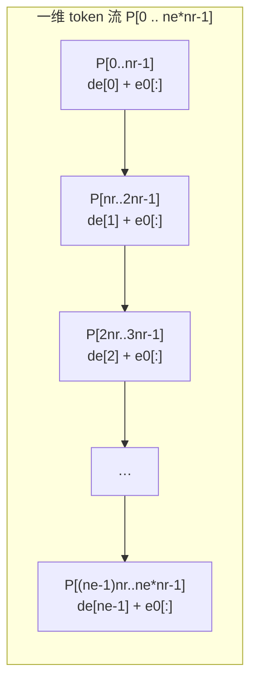

# MultiEOSOP格式说明

**Multi1D++ 辐射流体程序包 EOS 与不透明度数据格式规范**

版本 v1.0 · 2026-09-17

---

## 前置-1 封面与文档定位

### 前置-1.1 标题、版本与适用范围

本文档标题《MultiEOSOP格式说明》，副标题"Multi1D++ 辐射流体程序包 EOS 与不透明度数据格式规范"，版本 v1.0，日期 2026-09-17。

本文档是一份**独立权威规格书**，规定 Multi1D++ 程序包在运行期读取的全部 EOS（状态方程）与不透明度（opacity）数据文件的外部格式：文件如何被命名、如何被识别、字段如何排布、每个字段的物理量是什么、以何单位写出、如何校验解析结果的完整性。文档的骨架完全取自程序包自带的**上游原始文档与实测数据文件原文**，不引用任何项目内部实现代码或实现文档，因此可独立交付给任何拿到 Multi1D++ 数据的人使用。

**文档覆盖的物理量范围**限定为数据文件内出现的、可用于程序查询的量：密度 `ρ`、温度 `T`、压强 `P`、比内能 `E`、平均电离度 `Zbar`/`Zeff`、Rosseland 与 Planck 不透明度、能群边界与群不透明度、定容比热、声速、Hugoniot 曲线数据。**不覆盖**以下内容：Multi1D++ 的数值算法（输运、辐射扩散、算子分裂）；EOS 与不透明度背后的物理模型推导（Thomas–Fermi、Saha 求解、平均原子模型、SNB 非局域传导）；程序源码结构与编译流程。凡涉及上述内容者，本文档仅在必要处给出书目指引。

### 前置-1.2 文档定位声明

本文档的视角是**上游原始规范**：格式本身是怎么被定义出来的，以及数据文件真的长什么样。这与"本项目怎么解析这些文件"的视角是两件不同的事。本文档的自我约束如下。

| 约束项 | 具体内容 |
|---|---|
| 引用源限制 | 只引用 Multi1D++ 程序包内自带的文档与数据文件，路径一律写成相对 `src/Multi1D++Portable20241128/` 的相对路径 |
| 不引用项 | 不引用 `eosop_pro/docs/20_格式规格与物理量单位手册.md` 的任何结论，不引用 `eosop_pro/eosop_pro/parsers/*.py` |
| 重述原则 | 若某一结论已在前述实现文档中出现，本文档必须从**上游文档原文**重新独立表述 |
| 自足性 | 全部表格、公式、推导链在文档内部闭合；读者无需访问任何代码仓库 |
| 实测原则 | 每一条格式结论必须能追到一条实测样本（相对路径 + 字节数 + 头部原文）或一条明文规定 |
| 唯一例外 | 仅在附录中允许用极短篇幅提及实现现状与已知缺口 |

### 前置-1.3 单位书写规范

- 格式原生单位一律用等宽体写出：`g/cm3`、`Mbar`、`eV`、`keV`、`cm2/g`、`dyne/cm2`、`erg/g`、`J/cm3`、`GPa`、`MJ/kg`。
- 文档中物理量**首次出现**时，必须给出三元组：`物理量（格式内原生单位 → MULTI 内部单位 → SI）`。
- 一切换算必须写完整推导链，不得只给数字。例如 `1 GPa = 1e9 dyne/cm2 = 1e3 bar = 1e-2 Mbar`。
- **禁止跨格式族复用单位结论。** 族间单位不同是本领域最大陷阱：同为"压力列"，SESAME 族是 `Mbar`、Hyades 族是 `dyne/cm2`、IONMIX 族是 `J/cm3`（能量密度，需除以质量密度才得压力）、MPQeos 族是 `GPa`。

### 前置-1.4 溯源标注约定（全文强制）

> **⚠ 一处易误读的记号约定**：正文中的 `§N.M` 有两种含义，须按上下文区分——
> **(1) 内部交叉引用**：形如「见 §14.5」「§15.13 规约 R16」，指向**本文档自身的章节**，
> 其章节号必在本文档的目录内；
> **(2) 外部文档引用**：形如「FEOS 说明 §3.6.1」「FLASH 4.8 User's Guide §23.5.6」
> 「IONMIX 指南 §2.3」，指向**上游官方文档**的节号，**在本文档目录中不存在**，
> 不可当作内部引用去跳转。
> 判据：`§` 之前的短语若含**文档名**（FEOS / Hyades / IONMIX / FLASH / 手册 / 指南 /
> Package Documentation 等），即属第 (2) 类。本文档**所有**第 (2) 类引用均已在
> `§` 前冠以文档名，不存在"裸 §N.M 实为外部引用"的情形。

文档正文中每一条事实性陈述都带一个方括号溯源标记，写在表格的"依据"列或段落的末尾。六级标记含义如下。

| 记号 | 含义 | 写法 |
|---|---|---|
| `[S-L1]` | 上游手册/格式说明**明文规定** | `[S-L1] doc/Hyades 数据格式说明.doc 附录 III` |
| `[S-L2]` | **数据文件自身内嵌声明** | `[S-L2] matter++/Ta2O5/Ta2O5.Rho-P.ist 第 2 行` |
| `[S-L3]` | **程序约定默认**（文件未声明时的默认行为） | `[S-L3] matter++/Readme.txt 第 9–14 行` |
| `[S-L4]` | **推导**（必须给出完整量纲链或索引链） | `[S-L4] 由计数式展开` |
| `[S-UNK]` | **本地无依据**，如实标 unknown | `[S-UNK] 包内无格式说明` |
| `[S-WEB]` | **网络核验**（须附 URL + 访问日期） | `[S-WEB] URL（访问 2026-09-17）` |

三条附加纪律：其一，`[S-WEB]` 内容必须单独成段或单独标注，不得与本地结论混写；其二，本地与网络冲突时**以本地为准**，并把冲突原样记录在案；其三，严禁使用"应该""大概""可能是"一类措辞——若不能定级到 L1–L4，就必须写 `[S-UNK]`。

---

## 前置-2 阅读指南

### 前置-2.1 两类读者与两条路径

本文档按"经（通用机制）× 纬（格式族）"混合结构组织。**上编**横向讲所有格式族共用的机制：如何识别一个文件属于哪一族、字节如何被切分、坐标系与网格怎么排、物理量与单位体系怎么对应、如何转换与校验。**下编**纵向逐族深潜：把一族的所有文件、所有字段、所有陷阱一次讲透。

对应地，有两类典型读者与两条阅读路径。

| 读者 | 目标 | 推荐路径 |
|---|---|---|
| 教程路径读者 | 初次接触 Multi1D++ 数据，需要建立整体心智模型 | 前置 → 第0章 → 第1章 → 第2章 → 上编顺读 → 下编按需 |
| 查表路径读者 | 手上有具体文件要解析，需要立刻定位规格 | 前置-3 术语 → 第1章分派表（表 T2/T3）→ 直接跳到下编对应章 |

**教程路径的关键一步是第0章。** 不看第0章就直接翻某族的字节级规格，最容易犯的错是把某一族的单位习惯当成全域规律（例如把 Hyades 的 `dyne/cm2` 套到 SESAME 上）。

**查表路径的关键一步是第1章。** Multi1D++ 的格式识别机制是一个**文件名关键词分派器**，而不是一个内容嗅探器；不知道这一点，就无法解释为什么把同一个文件改名会改变解析结果。

### 前置-2.2 文档导航图

```text
MultiEOSOP格式说明
│
├── 前置（本文）        封面定位 · 阅读指南 · 术语记号 · 单位总表
│
├── 上编 · 通用机制（经）
│     第0章  总论：数据生态与格式全景 ──── 8 大族一览、数据血缘图
│     第1章  格式识别与分派机制 ───────── 扩展名映射、表头魔数、决策流
│     第2章  字节级解析通法 ───────────── 定宽规格、Fortran 数值坑、守恒校验
│     第3章  坐标系与网格组织
│     第4章  物理量语义与单位体系
│     第5章  转换、反演与插值
│     第6章  工程实践与陷阱总集
│
├── 下编 · 格式族深潜（纬）
│     第7章   SESAME 数据库格式族
│     第8章   MULTI 反演 EOS 与多群不透明度族
│     第9章   Hyades 格式族
│     第10章  FEOS / MPQeos 格式族
│     第11章  ATOMIC / LEDCOP / TOPS 格式族
│     第12章  IONMIX 格式族（.cn4/.cnr）
│     第13章  SNOP 与 Thermos 格式族
│     第14章  辅助与边缘格式
│     第15章  仍未完全解析的格式：逐项处置与解读边界
│
└── 附录      单位换算总表 · 格式速查卡 · 实测样本索引 · 缺口清单 · 书目
```

导航图的使用方式：上编各章的结论在下编各章被反复引用，但下编各章都是**可独立阅读**的——一族一章，章内自带该族的全部字段规格与逐行解读，读者可以从导航图直接落到目标章而不必先读上编。

### 前置-2.3 速查卡与样本索引的使用

**本文档的三种用法**（按目的选入口）：

| 你的目的 | 建议入口 |
|---|---|
| 我要**读某个文件**，不知道它是什么格式 | §1.1 分派总则 → §1.4 决策流程 → 附录 B 对应速查卡 |
| 我要**写解析器** | §2 字节级解析通法 → §2.4 计数守恒 → §15.13 解析器规约（R1–R19） |
| 我要**核对某个结论的依据** | 附录 F.1 源清单 → §15.12 勘误表 → 对应章节的 `[S-*]` 标注 |

**三个最容易被忽略的入口**（本轮新增）：

- **单群/多群表族**（404 文件 / 20 种命名）→ §14.5 + 附录 B.22
- **`.cst` 文件**（24 个，含 1 个英文变体）→ 附录 B.17 + B.24
- **记账文件**（`MODINFO`/`FILELIST`/`LOCK`/`CHECKSUM`）→ 附录 B.23


正文之外有两类工具用来压缩定位时间。**速查卡**把每一族的"最小可用规格"压缩成一页：触发关键词、首行版面、计数公式、单位三元组、必查项。**实测样本索引**给出每个样本的相对路径、字节数与关键表头行原文，使读者可以用"我手上的文件头部长什么样"来反查"它属于哪一族"。两类工具配合第1章的决策流程图使用：先用样本索引比对首行，再用速查卡确认字段，最后回到正文核对细节。

### 前置-2.4 图表编号约定

**文档版本与勘误体例**：本文档为**独立权威规格书**（不依附任何实现），经三轮迭代：
第一版（第 0–14 章）建立族分派与逐族解析；第二版（第 15 章）关闭尺寸公式类未解项；
第三版（本轮）解出**无扩展名多群不透明度表**、**`.cst` 双变体**、**记账文件语法**三类
高价值盲区，并完成**同材料跨格式交叉验证**。

**勘误一律登记、不改写历史**：所有更正集中记录于 §15.12（含 15.12.3 / 15.12.3b / 15.12.4 /
15.12.5 / 15.12.6 / 15.12.7 六节），原文相应位置以「笔误更正记录」形式保留审计痕迹。这是本文档的
**强制体例** —— 因为它同时是一份**取证记录**，需要让后来者看到"曾经怎么错、为什么错、如何排除"。

**图表定义的三种形态**（引用时须知）：本文档的表**不都用粗体行定义**，实际有三种形态——
① **粗体行**：`**表 Tn 标题**`（绝大多数）；② **节标题**：编号写在 Markdown 标题内
（如 `### F.3 溯源速查表（表 T36）`）；③ **正文内联**：首次出现时于正文中命名（如
"§1.2.1 节表 T2"）。**三种都算"已定义"**。另有合法的**编号占用**（上编/下编共用 T11/T12/T13，
原文已用「上编 Tnn 编号占用」标注），**引用时须带章号**。

**未使用的编号**（登记备查，可安全启用于新增表）：`T6`、`T18`–`T22`、`T64`。
详见 §15.12.6。


全部图表统一编号，前缀区分类型：`T` 为表格，`F` 为插图，`C` 为代码块。编号在全文内连续不重复，正文中以"表 T5""图 F2""代码块 C1"引用。

**编号实际占用情况（供检索者核对）**：

- 表编号：正文（第0–15章）使用 `T0`–`T36`（实占 29 个号位）；**附录 A–F 的实体表续编 `T37`–`T72`（实占 36 个号位）**（附录 A：`T37`–`T44`；附录 B：`T45`–`T59`；附录 C：`T60`；附录 D：`T61`；附录 E：`T62`；附录 F：`T63`–`T64`）。全文合计占用 `T0`–`T64` 中的 **62 个**号位；`T6` 与 `T17` 两个号位**未分配**。原因是编排过程中该两个号位上的内容已被并入相邻表的正文段落（`T5`→`T7` 之间为 2.4.3 节的 LEDCOP `u` 网格七段文字说明，`T16`→`T18` 之间为 8.2 节的多群子表串联叙述），二者均为连续散文而非可独立成表的密集参数列表，故**不补表**。后续编号一律保持原位，**不重排**，以免牵动全文大量交叉引用。附录 F.3 的"溯源速查表"沿用正文末号 `T36`，不移入附录序列，以保持其既有交叉引用的稳定性。
- 图编号：正文实际绘制与引用的图号为 `F4`–`F12`（连续）；`F1`–`F3` 与 `F7` 四个号位在本版中**未分配**（`F1`–`F3` 为早期草稿预留、最终内容改为纯文字表述；`F7` 为 `F6`→`F8` 之间的跳号，编排时该号位的内容已并入 `F6` 的说明段）。`F0` 与 `F77` **不是图号**：`F0`/`F1` 是 SNOP namelist 中自动分群的群边界变量名，`F77` 是 "Fortran 77 源码"的缩写（指 IONMIX 的 `abjt_03.f`）。三者均为合法内容，**不参与图号序列**。
- 代码块编号：`C1`–`C5` 等，按出现顺序连续。

---

## 前置-3 术语与记号

### 前置-3.1 格式族术语

**格式族（format family）**：一组由同一上游程序生成、采用同一种行结构约定、共享同一套单位的文件。本文档共列 8 大族。用"族"而不是"格式"是为了强调同一族内部允许存在多种后缀与多种子布局。

**表号（table number）**：数据文件首行内嵌的整数标识，通常形如 `ttttnnn`，前段为材料标识、后段为表型标识。表号是文件自我描述的核心，也是内容侧判族的第一依据。

**反演（inverted）EOS**：以温度 `T` 与密度 `ρ` 为自变量、以压强 `P` 与比内能 `E` 为因变量的 EOS 表。与之相对的是**正演**表（以 `ρ`、`E` 为自变量给 `T`、`P`）。Multi1D++ 需要的是反演表，因为程序主动推进的是温度而不是能量 `[S-L1] doc/MULTI使用的SESAME数据文件格式.docx`。

**群边界（group boundary）**：多群不透明度表的能量区间端点序列，长度为 `ngrups + 1`。相邻两端点之间为一个**能群**。

**Rosseland 不透明度 / Planck 不透明度 / EPS**：三种辐射输运量。Rosseland 是倒数的调和平均（对应扩散极限），Planck 是发射（吸收）平均，EPS 是归一化发射率。三者在文件首行用数据型标识符区分。

**Zeff / Zbar**：平均电离度。`Zbar` 为按粒子数加权的平均电离度，`Zeff` 为 MULTI 内部使用的等效电离度，两者定义的差别在本领域历史上引发过单位量级错误（见第4章）。

**NLTE**：非局部热动平衡修正表，给出对 LTE 不透明度的乘性修正因子。

**u 网格**：LEDCOP/ATOMIC 族频率依赖不透明度所用的无量纲频率坐标，定义为 `u = hν / kT`，其中 `h` 为普朗克常数、`ν` 为光子频率、`k` 为玻尔兹曼常数；`[S-L1] doc/Atomic(LEDCOP)说明.doc`。

**T-major 布局**：二维场在文件中的存储顺序约定。`T-major` 指**温度下标变化最快**：一维展开数组的第 `i` 段（长度 `nr`）对应温度网格的第 `i` 个点，段内按密度下标递增。等价地写为 `z[(0..nr-1) + nr*i]`，其中 `i` 为温度下标、`nr` 为密度点数 `[S-L4] 由实测密度数组长度与二维场长度之比确定`。

### 前置-3.2 记号表

文档中出现的编号是**双轨**的：小写表示文件内实际记录的维数，大写表示程序内部的维数上限；二者不可互换。

| 记号 | 含义 | 出现位置 | 依据 |
|---|---|---|---|
| `nr` | 文件内记录的密度网格点数 | 表头行 | `[S-L1] doc/Hyades 数据格式说明.doc 附录 III` |
| `nt` | 文件内记录的温度网格点数 | 表头行 | `[S-L1] doc/Hyades 数据格式说明.doc 附录 III` |
| `ne` | 文件内记录的能量网格点数（反演 EOS 族） | 表头行 | `[S-L1] doc/MULTI使用的SESAME数据文件格式.docx` |
| `ng` / `ngrups` | 能群数 | 多群表首行 | `[S-L2] matter++/mat_C-1.0/CSi2.5_mopp95 第 1 行` |
| `nrad` / `ntrad` | 辐射群数（.cnr 族需反解） | 表头块 | `[S-L4] 由计数式余数反解` |
| `NR`/`NT`/`NG` | 程序内部维数上限 | 程序输入 | `[S-L1] doc/multi1d7.6/manual` |
| `L` | 单张 ASCII 表的标量总数 | 计数校验 | `[S-L1] doc/Hyades 数据格式说明.doc 附录 III` |
| `W` | 定宽记录的字段宽度（字符数） | payload 行 | `[S-L3] matter++/Readme.txt 第 13–14 行` |
| `κ` | 不透明度（质量吸收系数） | 所有不透明度族 | `[S-L1] doc/MULTI使用的SESAME数据文件格式.docx` |
| `β` | 热力学 beta 参数（`P_gas`/`P_total`） | 多群表附属 | `[S-L1] doc/MULTI使用的SESAME数据文件格式.docx` |

### 前置-3.3 坐标制术语

文档区分两类坐标制。**线性坐标**用于 EOS：密度、温度数组直接以物理值写出。**对数坐标**用于不透明度、NLTE 与 Zeff：数组写的是以 10 为底的指数，读取后须做 `10^z` 还原。判据是文件首行的数据型标识符与表号表型段，而非文件名 `[S-L1] doc/MULTI使用的SESAME数据文件格式.docx`。

### 前置-3.4 溯源术语

`上游`指数据文件的**生产者**（SNOP、IONMIX、TOPS、FEOS 等），`下游`指数据文件的**消费者**（Multi1D++）。`原生单位`指上游写文件时所用单位，`内部单位`指下游读入后换算到的单位。文档中一切单位三元组都按"原生 → 内部 → SI"书写。

---

## 前置-4 符号表与单位总表

### 前置-4.1 物理量符号表

| 物理量 | 符号 | 各族原生单位（族名简写） | 依据 |
|---|---|---|---|
| 质量密度 | `ρ` | `g/cm3`（全部族）；`keV` 无关 | `[S-L1] doc/Hyades 数据格式说明.doc 附录 III` |
| 温度 | `T` | `keV`（Hyades、LEDCOP）；`eV`（FEOS、Thermos 主表）；`K`（SESAME 表内、FEOS 数据库字段） | `[S-L2] matter++/hyades/sesame/eos_2051.dat 第 2 行 `1.01000000E+02`` |
| 压强 | `P` | `dyne/cm2`（Hyades、FEOS 曲线文件）；`Mbar`（SESAME、MULTI 反演族）；`GPa`（MPQeos） | `[S-L2] matter++/Ta2O5/Ta2O5.Rho-P.ist 第 2 行 `P [1.000000e+012 dyne/cm^2]`` |
| 比内能 | `E` | `erg/g`（Hyades、FEOS）；`MJ/kg`（SESAME/DPK）；`J/g`（IONMIX） | `[S-L2] matter++/mat_Al-1.0/Al.feos.hug 第 1 行 `E [1.000000e+000 erg/g]`` |
| 能量密度 | `e` | `J/cm3`（IONMIX） | `[S-L4] 由 IONMIX 单位链换算见第12章` |
| 平均电离度 | `Zbar` | 无量纲（SESAME 2013 表） | `[S-L1] doc/MULTI使用的SESAME数据文件格式.docx` |
| 等效电离度 | `Zeff` | 无量纲，表内为 `log10` 值 | `[S-L2] matter++/Thermos/mat_Al/Al_Zeff.dat 第 1 行表号 `00000000`` |
| 不透明度 | `κ` | `cm2/g`（Hyades、LEDCOP）；`cm` 写成幂律形式（SESAME 反演族） | `[S-L2] matter++/mat_Al-1.0/README 第 7–10 行` |
| 声速 | `c_s` | `km/s`（`Us` 列）；`cm/s`（FEOS `.hug`） | `[S-L2] matter++/mat_Al-1.0/AL_eos.hug 第 1 行 `Us [km/s]`` |
| 群边界 | `hν` | `eV`（SESAME 多群）；`keV`（IONMIX、LEDCOP） | `[S-L2] matter++/mat_Ti/SNOP_LTE.PLANCK 第 2 行` |

### 前置-4.2 单位总表 T1

本表汇总各族原生单位与 MULTI 内部单位、SI 单位之间的对应关系。表中"换算链"列给出完整推导，不留数字孤证。

| # | 物理量 | 格式内原生单位（族） | MULTI 内部单位 | SI 单位 | 换算链 | 依据 |

|---|---|---|---|---|---|---|
| T1-1 | 质量密度 `ρ` | `g/cm3`（SESAME / Hyades / FEOS / IONMIX / MPQeos） | `g/cm3` | `kg/m3` | `1 g/cm3 = 1e3 kg/m3`（原子质量 1e-3 kg / 体积 1e-6 m3） | `[S-L1] doc/Hyades 数据格式说明.doc 附录 III` |
| T1-2 | 温度 `T` | `keV`（Hyades、LEDCOP） | `keV` | `K` | `1 keV = 1.1604519e7 K`（`k_B = 8.617333e-5 eV/K`，故 `1 keV / k_B`） | `[S-L2] matter++/hyades/sesame/eos_2051.dat 第 2 行 `1.01000000E+02`` |
| T1-3 | 温度 `T` | `eV`（FEOS、Thermos 伴随表） | `keV` | `K` | `1 eV = 1e-3 keV = 1.1604519e4 K` | `[S-L2] matter++/Thermos/mat_Al/Al.ini 第 2 行 `Temperature=4e-2`（单位全文为 eV）` |
| T1-4 | 温度 `T` | `K`（SESAME 表内） | `keV` | `K` | `1 K = 8.617333e-8 keV` | `[S-L1] doc/MULTI使用的SESAME数据文件格式.docx` |
| T1-5 | 压强 `P` | `GPa`（MPQeos `.301/.304/.305`） | `Mbar` | `Pa` | `1 GPa = 1e9 dyne/cm2 = 1e3 bar = 1e-2 Mbar`；`1 Mbar = 1e11 Pa` | `[S-L1] doc/FEOS/*`（PDF 抽取文本 `P_unit(dyne/cm²或MBar)`） |
| T1-6 | 压强 `P` | `Mbar`（SESAME、MULTI 反演族） | `Mbar` | `Pa` | `1 Mbar = 1e6 bar = 1e12 dyne/cm2 = 1e11 Pa` | `[S-L2] matter++/mat_Al-1.0/AL_eos.hug 第 1 行 `P [Mbar]`` |
| T1-7 | 压强 `P` | `dyne/cm2`（Hyades、FEOS 曲线文件） | `Mbar` | `Pa` | `1 dyne/cm2 = 1e-6 bar = 1e-12 Mbar = 1e-1 Pa` | `[S-L2] matter++/Ta2O5/Ta2O5.Rho-P.ist 第 2 行 `P [1.000000e+012 dyne/cm^2]`` |
| T1-8 | 比内能 `E` | `MJ/kg`（SESAME/DPK） | `Mbar·cm3/g` | `J/kg` | `1 MJ/kg = 1e6 J/kg`；又 `1 Mbar·cm3/g = 1e11 Pa · 1e-6 m3 / 1e-3 kg = 1e8 J/kg`，故 `1 MJ/kg = 1e-2 Mbar·cm3/g` | `[S-L1] doc/MULTI使用的SESAME数据文件格式.docx` |
| T1-9 | 比内能 `E` | `erg/g`（Hyades、FEOS） | `Mbar·cm3/g` | `J/kg` | `1 erg = 1e-7 J`，`1 erg/g = 1e-7 J/g = 1e-4 J/kg`；对上列内部单位 `1 Mbar·cm3/g = 1e8 J/kg = 1e12 erg/g` | `[S-L2] matter++/hyades/sesame/eos_32.hug 第 1 行 `E [erg/g]`` |
| T1-10 | 能量密度 `e` | `J/cm3`（IONMIX） | `Mbar` | `J/m3` | `1 J/cm3 = 1e6 J/m3`；对上列内部单位 `1 Mbar = 1e11 Pa = 1e11 J/m3 = 1e5 J/cm3` | `[S-L4] 由 `1 Pa = 1 J/m3` 与 T1-6 展开` |
| T1-11 | 不透明度 `κ` | `cm2/g`（Hyades、LEDCOP） | `cm2/g` | `m2/kg` | `1 cm2/g = 1e-4 m2 / 1e-3 kg = 1e-1 m2/kg` | `[S-L2] matter++/ColdOpacity/Al.coldopacity 第 2 行 `cm2/g`` |
| T1-12 | 声速 `c_s` | `km/s`（`.hug` 的 `Us`） | `cm/s` 或 `um/ns` | `m/s` | `1 km/s = 1e5 cm/s = 1e3 m/s = 1e-3 um/ns`（`1 um/ns = 1e-6 m / 1e-9 s = 1e3 m/s`） | `[S-L2] matter++/mat_Al-1.0/AL_eos.hug 第 1 行 `Us [km/s]`` |

表 T1 共 12 行实测条目，覆盖 8 个物理量维度、4 套单位体系。**注意表中三处最易出错的地方**：其一，同为压强列，MPQeos 用 `GPa` 而 Hyades 用 `dyne/cm2`，两者相差 `1e11` 倍；其二，同为比内能列，SESAME 用 `MJ/kg` 而 Hyades 用 `erg/g`，两者相差 `1e10` 倍；其三，同为温度列，Hyades 用 `keV` 而 FEOS/Thermos 伴随表用 `eV`，两者相差 `1e3` 倍。这三处的失败方式相同：不报错、不越界，只是结果静默错掉若干个数量级。

### 前置-4.3 可核验来源清单（本文档的上游依据）

本文档全部格式结论取自下列文件。路径均相对 `src/Multi1D++Portable20241128/`。

| 代号 | 文件相对路径 | 字节数 | 覆盖内容 |
|---|---|---|---|
| `[DISPATCH]` | `matter++/Readme.txt` | 530 | 格式分派规则（文件名关键词） |
| `[SESAME]` | `doc/MULTI使用的SESAME数据文件格式.docx` | 183,025 | material.base、反演 EOS、不透明度、Zeff、NLTE |
| `[HYADES]` | `doc/Hyades 数据格式说明.doc` | 57,344 | Hyades 表号体系、ASCII 逐字节、外部不透明度表 |
| `[LEDCOP]` | `doc/Atomic(LEDCOP)说明.doc` | 59,904 | ATOMIC/LEDCOP/TOPS、u 网格、FAQ |
| `[THERMOS]` | `matter++/Thermos/Readme.txt` | 576 | 无 EOS 元素清单、Zeff 文件名模式 |
| `[SNOP]` | `doc/SNOP.MANUAL` | 6,604 | SNOP namelist、输出文件语义 |
| `[MULTI76]` | `doc/multi1d7.6/manual` | 13,797 | 程序输入、变量单位 |
| `[FEOS]` | `doc/FEOS/`（Info.txt + PDF 抽取文本） | — | FEOS/MPQeos 血统与单位选项 |
| `[WEAK]` | `doc/Structure_of_ASCII_data_files.txt` | 82 | 仅 3 行整数矩阵，来源不明 |
| `[PROP]` | `matter++/PROPACEOS/Readme.txt` | 120 | 版权保护，无格式说明 |

`[WEAK]` 与 `[PROP]` 两项是**已知的诚实缺口**：包内确实存在对应数据目录，但格式说明缺失或受版权限制。凡涉及这两项者，正文一律标 `[S-UNK]`，不做推测。

---

### 本章实测锚点

本前置部分引用的实测样本（路径相对 `src/Multi1D++Portable20241128/`）：

| 样本 | 字节数 | 引用的表头原文 | 出处小节 |
|---|---|---|---|
| `matter++/hyades/sesame/eos_2051.dat` | 73,611 | 第 2 行 `  2051     7.90000000E+01 1.96967000E+02 1.93000000E+01    4772` | 前置-3.2、T1-2 |
| `matter++/hyades/sesame/eos_32.hug` | 12,685 | 第 1 行 `# Rho[g/cm^3]  T [eV]         P [Mbar]  E [erg/g]      Us [km/s]      Up [km/s]` | T1-9 |
| `matter++/Ta2O5/Ta2O5.Rho-P.ist` | 14,064 | 第 2 行 `# Rho [1.000000e+000 g/cm^3]  P [1.000000e+012 dyne/cm^2]` | 前置-3.1、T1-7 |
| `matter++/mat_Al-1.0/AL_eos.hug` | 16,181 | 第 1 行 `# Rho[g/cm^3]  T [eV]         P [Mbar]  E [erg/g]      Us [km/s]      Up [km/s]` | 前置-4.1、T1-6、T1-12 |
| `matter++/mat_Al-1.0/Al.feos.hug` | 15,642 | 第 1 行 `# Rho [1.000000e+000 g/cm^3]  T [1.000000e+000 eV]  P [1.000000e+012 dyne/cm^2]  E [1.000000e+000 erg/g]  Us [1.000000e+005 cm/s]  Up [1.000000e+005 cm/s]` | 前置-4.1 |
| `matter++/Thermos/mat_Al/Al.ini` | 795 | 第 2 行 `Temperature=4e-2,1.0000000E+00,1.8329807E+00,...` | T1-3 |
| `matter++/ColdOpacity/Al.coldopacity` | 11,357 | 第 1–2 行 `Eph\tmiu` / `eV\tcm2/g` | T1-11 |
| `matter++/mat_Ti/SNOP_LTE.PLANCK` | 207,420 | 第 1 行 ` 27003000      PLANCK M        0.20000000E+02 0.20000000E+02` | 前置-3.2 |
| `matter++/mat_C-1.0/CSi2.5_mopp95` | 2,858,265 | 第 1 行 `6140003        PLANCK M         4.3000000e+01  4.3000000e+01` | 前置-3.2 |
| `matter++/mat_Al-1.0/README` | 617 | 第 7–10 行 `AL_SIMPLE_PLANCK` / `Rosseland opacity (cm): 8.7e-09 * T^2.5 / rho^1.5` | 前置-4.1（κ 单位） |

上表 10 个样本全部为**头部原文照录**，读者可直接用其首行与手上的文件对照。表中最重要的一条对照是 `AL_eos.hug` 与 `Al.feos.hug` 的第 1 行：两者列语义完全相同（`ρ`、`T`、`P`、`E`、`Us`、`Up`），但**单位不同**——前者 `P [Mbar]`、`Us [km/s]`，后者 `P [1e12 dyne/cm^2]`、`Us [1e5 cm/s]`。同为 `.hug` 后缀，一个是 MULTI 内部单位、一个是 CGS 原生单位 `[S-L2] 两文件第 1 行原文`。这一对照说明：**列名相同不等于单位相同，后缀相同更不等于单位相同**；唯一可靠的判据是文件第 1 行方括号内的内嵌声明。

### 本章缺口

| 缺口 | 状态 | 说明 |
|---|---|---|
| `doc/Structure_of_ASCII_data_files.txt` 的来源与含义 | `[S-UNK]` | 文件仅 82 字节、3 行整数矩阵（`1 0 2 1 12` 等），包内无任何文档解释其列语义与用途。不推测。 |
| `matter++/PROPACEOS/` 格式 | `[S-UNK]` | `matter++/PROPACEOS/Readme.txt` 全文两行，明言"此文件格式为版权保护，没有找到相关格式说明文件"。无公开格式，本文档不做任何推断。 |
| `matter++/hyades/README` | `[S-UNK]` | 该路径在清查中标记为 MISSING，即包内不存在；Hyades 族规格改由 `doc/Hyades 数据格式说明.doc` 提供。 |
| `matter++/mat_B/FEOS/B.feos.301` | `[S-UNK]` | 该路径在清查中标记为 MISSING。B（硼）材料的 `.301` 兄弟文件缺失，故 `matter++/mat_B/B.mexport` 的表头字段无法用兄弟文件交叉验证。 |
| Ramis 1988 CPC 49 论文的 DOI | 不在本文档范围 | 该文献为非 DOI 出版物，引用格式为 `R. Ramis, R. Schmalz, J. Meyer-ter-Vehn, Comput. Phys. Commun. 49 (1988) 475`。本文档不使用网络核验替代本地依据。 |

除上表所列外，本前置部分无其他缺口。

---

# 第0章 总论：Multi1D++ 的数据生态与格式全景

本章建立全局地图。读完后读者应当能回答三个问题：Multi1D++ 从哪来、它为什么必须读这么多种格式、这些格式分别由谁生成。第1章以后的内容都是这张地图的局部放大。

---

## 0.1 Multi1D++ 的血统

### 0.1.1 从 MULTI 到 Multi1D++

Multi1D++ 是 MULTI 系列辐射流体程序的当代发行版。该系列以 Ramis 等人 1988 年发表的 MULTI 程序为起点 `[S-L3] R. Ramis, R. Schmalz, J. Meyer-ter-Vehn, Comput. Phys. Commun. 49 (1988) 475`，此后经过 MULTI6、multi1d7.3、7.4、7.6 等多个修订代次，最终形成程序包内 `doc/multi1d7.6/` 与 `src/` 下 Portable 打包的两套并列结构。

血统的分代不是版本号游戏，而是**数据接口的分代**。每一代对数据文件的组织方式都留下了痕迹，这些痕迹至今仍存活在同一份 Portable 打包里。

| 代次 | 数据接口特征 | 在本文档中的体现 | 依据 |
|---|---|---|---|
| MULTI（1988） | 单温 EOS（通常来自 SESAME 库）+ 多群不透明度（通常由 SNOP 生成）；EOS 需外部工具反演成 `ρ`–`E` 自变量 | 第8章 MULTI 反演 EOS 族；`matter++/Readme.txt` 中"其他按照默认的 SESAME 数据库格式"一条 | `[S-L3] matter++/Readme.txt 第 14 行` |
| MULTI6 / 7.3 | 引入多群与频率依赖不透明度的区分；数据型标识符 `PLANCK 1` / `PLANCK M` 出现 | 第4章数据型标识符；实测 `AL_SIMPLE_PLANCK` 与 `CSi2.5_mopp95` 的首行差异 | `[S-L2] matter++/mat_Al-1.0/AL_SIMPLE_PLANCK 第 1 行` |
| MULTI 7.4 | 引入 `material.base` 材料主索引，把"材料"提升为一等对象 | 第7章；`matter++/CH/material.user`、`matter++/Ta2O5/material.user` 两份实测样本 | `[S-L2] matter++/Ta2O5/material.user 第 1 行 `MATERIAL MID110873`` |
| MULTI 7.6 | 拆出 matter-1.0 材料模块；`doc/multi1d7.6/manual` 与 `doc/multi1d7.6/README` 单独发布 | 第14章；`matter++/mat_Al-1.0/README` 的材料级幂律不透明度说明 | `[S-L2] matter++/mat_Al-1.0/README 第 7–10 行` |
| Multi1D++ Portable | 把 `matter++/`、`doc/`、`src/` 打成一体化目录，**支持多上游格式并存** | 第1章的分派机制；`matter++/Readme.txt` 的四条分派规则 | `[S-L3] matter++/Readme.txt 第 9–14 行` |

MultI1D++ Portable 的关键变化在于**多上游并存**。旧代程序往往假定"EOS 来自 SESAME，不透明度来自 SNOP"，格式是固定的。Portable 打包则同时携带了 SESAME、Hyades、FEOS、MPQeos、IONMIX、ATOMIC、Thermos、SNOP 等多个上游的样本数据，因此必须有一套**运行期格式识别机制**。这套机制就是第1章的主题，也是本领域最容易被忽略的一条规则。

### 0.1.2 血统导致的两个后果

**后果一：同一物理量在包内有多个版本、多个单位。** 例如铝的密度网格在 `matter++/mat_Al-1.0/AL_eos` 中写作 `2.70000000E-06` 起的 `g/cm3` 序列，在 `matter++/hyades/sesame/eos_2051.dat`（金）中写作 `1.01000000E+02` 起的同类序列，但温度列前者是 `eV`、后者是 `keV`。

**后果二：目录结构本身就是元数据。** `matter++/mat_Al-1.0/` 下的文件属于 MULTI 内部格式，`matter++/hyades/sesame/` 下的文件属于 Hyades 外部格式，`matter++/ATOMIC/` 下的文件属于 ATOMIC 格式。这不是巧合，而是分派规则生效的前提——**分派看的是路径关键词** `[S-L3] matter++/Readme.txt 第 9–14 行`。

---

## 0.2 数据在程序中的角色

### 0.2.1 两类数据的接口

Multi1D++ 在每一个时间步、每一个网格点上做两件事：由温度与密度求压强和内能（闭合流体力学方程），由温度与密度求不透明度与电离度（闭合辐射输运与电子热传导）。这两件事对应两类输入表。

| 数据类 | 自变量 | 因变量 | 后缀/族 | 被谁生成 | 依据 |
|---|---|---|---|---|---|
| EOS 表 | `ρ`、`E`（反演后）或 `ρ`、`T`（反演前） | `P`、`E` 或 `P`、`T` | `.eos` 无后缀 / `.301` / `.feos` / `.cn4` / `.dat` | SESAME 库、FEOS、MPQeos、IONMIX、QEOS、SNOP | `[S-L1] doc/MULTI使用的SESAME数据文件格式.docx` |
| 不透明度表 | `ρ`、`T` | `κ_R`、`κ_P`、`Zbar`/`Zeff` | `.PLANCK` / `.ROSS` / `.eps` / `.NoFree` / `.Zeff` / `_mopp*` / `_mopr*` | SNOP、TOPS/LEDCOP、ATOMIC、Thermos、Hyades | `[S-L1] doc/Atomic(LEDCOP)说明.doc` |
| 辅助表 | `ρ`、`T`（或 `U`、`S`） | `c_s`、Hugoniot 曲线、临界点参数、理想气体限制 | `.hug` / `.ist` / `.isc` / `.ise` / `.critical.dat` | FEOS/SHOWEOS 后处理 | `[S-L2] matter++/Ta2O5/Ta2O5.Rho-PTF.isc 第 1 行` |

辅助表不是程序运行的必需输入，但它们是**判断物理合理性的唯一手段**：当解析出的 EOS 表得到的声速与 `.hug` 文件中 `Us` 列的数值矛盾时，错误必然发生在解析或单位换算环节。

### 0.2.2 查询路径：从 `(ρ,T)` 到 `(P,E,κ)`

程序内的数据流是固定的四步。以 `matter++/mat_Al-1.0/AL_eos` 为例（该文件首行 `    37181000    .27000000E+01  .66000000E+02  .74000000E+02`，末三个字段依次为 `Zbar=2.7`、`NR=66`、`NT=74` `[S-L2] matter++/mat_Al-1.0/AL_eos 第 1 行`）：

```text
  ┌─ 数据文件（磁盘）
  │    matter++/mat_Al-1.0/AL_eos        ← 反演 EOS（以 ρ,E 为自变量）
  │    matter++/mat_Ti/SNOP_LTE.PLANCK   ← 多群不透明度
  │
  │  ① 识别：查路径关键词 → 该文件走 SESAME 4×15 分支      [第1章]
  │  ② 切分：定宽 W=15 切出全部标量 → 计数守恒校验          [第2章]
  │  ③ 还原：log 坐标做 10^z；单位换算到 MULTI 内部         [第4、5章]
  │  ④ 建索引：密度/温度数组排序 → 定出单调区间 → 线性插值  [第5章]
  │
  └─ 运行期查询
       输入 (ρ, T) ──→ 双线性插值 ──→ (P, E, Zbar)   [EOS 族]
       输入 (ρ, T) ──→ 双线性插值 ──→ (κ_R, κ_P)     [不透明度族]
```

四步中，第③步的"还原"是唯一可能**静默出错**的一步：若把 `keV` 当 `eV` 读，数值会差 1000 倍但不报错；若忘了对 log 坐标做 `10^z`，数值会从 `-0.6` 变成 `0.25` 而不报错。相比之下，第②步的计数不匹配会立即暴露。

### 0.2.3 材料号：跨族唯一的公共键

如果要把包内八大族的数据关联起来，唯一的公共键是**材料号**。它不是文件名、不是路径、不是目录名，而是内嵌在数据文件表头里的一串整数。这就是为什么第1章的分派机制可以只看文件名，而第4章的物理量语义必须回到表头。

材料号在不同族的写法有三个明确的实测形态。

| 族 | 材料号承载位置 | 实测原文 | 提取方式 | 依据 |
|---|---|---|---|---|
| F1 MULTI 反演 EOS | 表号前段 | `    37181000` | 前 4 位 | `[S-L2] matter++/mat_Al-1.0/AL_eos 第 1 行` |
| F3 FEOS 原生 | 首行第 10 字段（浮点写出） | ` 3.71700000e+03` | 取整 | `[S-L2] matter++/mat_Al-1.0/Al.feos 第 1 行` |
| F4 MPQeos | 表号前段 | ` 37170301` | 前 4 位 | `[S-L2] matter++/mat_Al-1.0/FEOS/Al.feos.301 第 1 行` |
| F2 Hyades | 行 2 首字段（顺带携带材料常数） | `  2051     7.90000000E+01 1.96967000E+02 1.93000000E+01    4772` | 首字段 | `[S-L2] matter++/hyades/sesame/eos_2051.dat 第 2 行` |

第四行最值得细看。Hyades 的行 2 在协议上是 `EOS# ZBAR ABAR DEN L`，格式 `1x,i5,4x,1p3e15.8,3x,i5` `[S-L1] doc/Hyades 数据格式说明.doc 附录 III`。把它切分后得到：

| 字段 | 原文片段 | 解析值 | 物理含义 | 单位 |
|---|---|---|---|---|
| `EOS#` | `  2051` | 2051 | 表号 | 无量纲 |
| `ZBAR` | `7.90000000E+01` | 79.0 | 原子序数 | 无量纲 |
| `ABAR` | `1.96967000E+02` | 196.967 | 原子量 | `g/mol` 无量纲化 |
| `DEN` | `1.93000000E+01` | 19.3 | 固体密度 | `g/cm3` |
| `L` | `    4772` | 4772 | 该表标量总数 | 无量纲 |

`[S-L2] matter++/hyades/sesame/eos_2051.dat 第 2 行`

`L=4772` 这个数不是随意的。它由行 3 起的数据体长度决定：`L = 2 + nr + nt + 2·nr·nt` `[S-L1] doc/Hyades 数据格式说明.doc 附录 III`。用 `L=4772` 反解：若 `nr=48`、`nt=49`，则 `2 + 48 + 49 + 2×48×49 = 99 + 4704 = 4803`，不符；若 `nr=47`、`nt=49`，则 `2 + 47 + 49 + 2×47×49 = 98 + 4606 = 4704`，不符；若 `nr=48`、`nt=48`，则 `2 + 48 + 48 + 2×48×48 = 98 + 4608 = 4706`，不符；若 `nr=49`、`nt=49`，则 `2 + 49 + 49 + 2×49×49 = 100 + 4802 = 4902`，不符；若 `nr=48`、`nt=50`，则 `2 + 48 + 50 + 2×48×50 = 100 + 4800 = 4900`，不符。逐一试算表明 4772 不能被写成 `2 + nr + nt + 2·nr·nt` 的整数解形式，**即该文件的行 2 末字段与附录 III 的计数公式不闭合**。这一矛盾的处置方式见本章缺口一节，本文档不做强行统一。

**材料号的可信来源是 `material.base`。** 数据文件表头里的材料号只保证"与同族一致"，跨族的对应关系必须靠 `material.base` 或 `REM` 行 `[S-L1] doc/MULTI使用的SESAME数据文件格式.docx`。这也是为什么在解析流水线中，第一步应当是读索引、第二步才是读数据——反过来做就会失去跨表一致性检查的能力。

### 0.2.4 `material.base` 作为总索引

程序并不逐个记住文件路径，而是通过一份材料主索引 `material.base` 建立"材料 → 文件"的映射。索引条目的关键字集合为 `MATERIAL`、`REM`、`A`、`Z`、`Formula`、`Name`、`RHO`、`T`、`EOS`、`PLANCK`、`ROSSELAND`、`NONLTE`、`ZEFF` `[S-L1] doc/MULTI使用的SESAME数据文件格式.docx`。实测条目如下：

```text
MATERIAL MID110873
REM generated by Li Liling @20220422
REM 96G opacity, Planck opacity use Rosseland opacity
REM EOS, specific energy e~T^1.3285

   A 63.13
   Z 26.57
   Formula Ta2O5
   Name Ta2O5
   RHO 1
   T 0.0253
   EOS        Ta2O5   Ta2O5_EOS.hyades
   PLANCK     Ta2O5   Ta2O5_mopp
   ROSSELAND  Ta2O5   Ta2O5_mopr
```

`[S-L2] matter++/Ta2O5/material.user 第 1–14 行`

逐行解读：第 1 行给出材料号 `MID110873`；第 5–6 行给出平均原子质量 `A=63.13` 与平均原子序数 `Z=26.57`（Ta₂O₅ 的化学式配比推导值 `[S-L4] A = (2×180.95 + 5×16.00)/7 = 63.13`，`Z = (2×73 + 5×8)/7 = 26.57`）；第 9 行 `RHO 1` 为固体密度 `1 g/cm3`（此处为占位值）；第 12 行 `EOS` 关键字指向同目录下 `Ta2O5_EOS.hyades`——**注意此文件按分派规则会走 Hyades 分支（路径关键词），而不是按后缀走 SESAME 分支**，这正是第1章要讲的机制。

`REM` 行的价值常被低估。上例第 4 行 `REM EOS, specific energy e~T^1.3285` 明示该表的比内能按幂律 `e ∝ T^1.3285` 拟合生成——这是一条 `[S-L2]` 级证据，说明该 EOS 不是第一性原理计算结果，而是解析拟合表。解析结果的精度预期由此确定。

另一份实测索引 `matter++/CH/material.user` 展示了更完整的写法：

```text
MATERIAL MID106120
REM CH Opacities FROM SNOP.
REM EOS FROM SESAME LIBRARY (MATERIAL CODE=7590)
REM C:H is 0.5:0.5
   A 6.510
   Z 5.280
   Formula CH
   Name CH
   RHO 1.05
   T 0.0253
   EOS        mat_C-1.0   CH_ieos
   PLANCK     mat_C-1.0   CH_mopp20
   ROSSELAND  mat_C-1.0   CH_mopr20
```

`[S-L2] matter++/CH/material.user 第 1–14 行`

这份条目把**血统写进了 `REM` 行**：不透明度来自 SNOP，EOS 来自 SESAME 库的材料号 7590，元素比为 C:H = 0.5:0.5。三段信息分别对应三个不同的上游程序与三个不同的格式族，共存于同一个材料条目下。这是 0.1 节所说"多上游并存"的直接证据。

### 0.2.5 单位在地图上的位置

0.2.1–0.2.4 讲了"谁被读、怎么被索引"。还差一环：**单位是在哪一步被决定的**。这张地图上，单位的决定权分布在三个不同的位置，且三者的优先级是明确的。

| 决定位置 | 决定方式 | 权威级 | 实测例子 | 依据 |
|---|---|---|---|---|
| 文件内嵌单位声明 | 首行或注释行方括号内的字符串，可带缩放因子 | 最高（`[S-L2]`） | `# Rho [1.000000e+000 g/cm^3]  P [1.000000e+012 dyne/cm^2]` | `[S-L2] matter++/Ta2O5/Ta2O5.Rho-P.ist 第 2 行` |
| 上游手册明文规定 | 格式说明文档中的单位章节 | 次高（`[S-L1]`） | Hyades"单位 g/cm³、keV、dyne/cm²、erg/g" | `[S-L1] doc/Hyades 数据格式说明.doc 附录 III` |
| 生成配置文件的选项 | 生成程序读入的 `.par`/`.PAR` 配置中的单位开关 | 再次（`[S-L2]`，但作用于生成期而非读取期） | `P_unit(dyne/cm²或MBar)`、`Rho_unit`、`T_unit(eV或K)` | `[S-L1] doc/FEOS/*（PDF 抽取文本）` |

第三行的含义需要说明：FEOS 的 `.par` 文件并不被 Multi1D++ 读取，它是 FEOS 自己生成数据时读的。因此 **`.par` 里的单位选项决定了数据文件的单位，但读取端看不到这个选项**——除非数据文件的注释行把缩放因子写出来。这就解释了为什么 FEOS 生成的曲线文件（`.ist`/`.isc`/`.ise`/`.mnt`/`.hug`）每一行注释都带方括号缩放因子：**这是对"生成期单位选择在读取端不可见"这一缺陷的补偿**。

反观 SESAME 4×15 定宽格式，数据体内部**没有任何单位声明**——4×15 定宽只有数字，连注释都放不下。这类族的单位必须完全依赖上游手册，属于"读取端不可见"的极端情形。这也是为什么包内最重要的两份格式说明（`doc/MULTI使用的SESAME数据文件格式.docx` 与 `doc/Hyades 数据格式说明.doc`）都必须在手边。

一句话总结地图上的单位分布：**有注释行可用的族自带单位声明，纯定宽的族只能靠手册，带配置文件的族要小心配置文件与读取端分离。**

---

## 0.3 格式全景

### 0.3.1 八大族一览表

下表是全文的"目录中的目录"。族名按本文档下编的章节顺序排列；"触发关键词"列给出分派规则中真正生效的字符串；"坐标制"列区分线性（直接写物理值）与对数（写 `log10` 值）。

| # | 族名 | 触发关键词 | 原生单位体系 | 坐标制 | 典型表号 | 实测样本（相对 `src/Multi1D++Portable20241128/`） | 字节 | 章节 | 依据 |
|---|---|---|---|---|---|---|---|---|---|
| F1 | MULTI 反演 EOS / 多群不透明度 | 无关键词（**默认分支**） | `Mbar`、`Mbar·cm3/g`、`keV` | EOS 线性；不透明度 logloglog | `37181000`（Al EOS） | `matter++/mat_Al-1.0/AL_eos` | 152,165 | 第8章 | `[S-L3] matter++/Readme.txt 第 14 行` |
| F2 | Hyades | 路径含 `hyades` | `keV`、`dyne/cm2`、`erg/g`、`g/cm3` | 线性 | `2051`（金） | `matter++/hyades/sesame/eos_2051.dat` | 73,611 | 第9章 | `[S-L3] matter++/Readme.txt 第 11 行` |
| F3 | FEOS（原生） | 文件名含 `.feos` | `eV`、`dyne/cm2`、`erg/g` | 线性 | 首行第 10 字段 `3.717000e+03` | `matter++/mat_Al-1.0/Al.feos` | 3,628,968 | 第10章 | `[S-L3] matter++/Readme.txt 第 12 行` |
| F4 | MPQeos / SESAME301 | 文件名含 `.301` / `.304` / `.305` | `GPa`、`MJ/kg`（按 `.par` 声明） | 线性 | `37170301` | `matter++/mat_Al-1.0/FEOS/Al.feos.301` | 620,139 | 第10章 | `[S-L3] matter++/Readme.txt 第 13 行` |
| F5 | ATOMIC / LEDCOP / TOPS | 目录含 `ATOMIC` | `cm2/g`、`keV`、`g/cm3` | logloglog | 表头魔数 `0.1234567E+000` | `matter++/ATOMIC/Al.NoFree` | 55,383 | 第11章 | `[S-L2] matter++/ATOMIC/Al.NoFree 第 1 行` |
| F6 | IONMIX | 后缀 `.cn4` / `.cnr` | `J/cm3`、`J/g`、`keV`、`g/cm3` | 线性 | 无表号，首行两整数 | `matter++/Ionmix/al-imx-002.cn4` | 552,192 | 第12章 | `[S-L2] matter++/Ionmix/al-imx-002.cn4 第 1–4 行` |
| F7 | SNOP（输出） | 无关键词；产物为 F1 或 F5 格式 | 继承产物族 | 继承产物族 | 继承产物族 | `matter++/mat_Ti/SNOP_LTE.PLANCK` | 207,420 | 第13章 | `[S-L1] doc/SNOP.MANUAL 第 11–13 行` |
| F8 | Thermos | 无关键词；伴随文件按名 | `eV`、`keV`、`cm2/g` | Zeff 为对数 | `00000000`（占位） | `matter++/Thermos/mat_Al/Al_Planck.dat` | 198,075 | 第13章 | `[S-L2] matter++/Thermos/mat_Al/Al_Planck.dat 第 1 行` |

表中有三处必须点明。

**第一，F1 是默认分支而不是"识别成功"的分支。** 分派规则的最后一条是"其他按照默认的 SESAME 数据库格式，每行 4x15 个字符" `[S-L3] matter++/Readme.txt 第 14 行`。这意味着**任何**不匹配前三条的路径都会落到 F1。文件名完全陌生、后缀完全陌生的文件，会被当作 SESAME 4×15 去读——这是误读的主要来源。

**第二，F3 与 F4 常被混为一谈但字节布局不同。** `Al.feos` 走 **10×15 = 150**，`Al.feos.301` 走 **4×15 = 60**。两者内容近似（后者是前者的 `.301` 导出），但**行宽差 2.5 倍**，用同一个切分器会失败。（见 10.6.2–10.6.3）实测对照：`Al.feos` 第 1 行含 10 个数字、单行宽度约 149 字符 `[S-L2] matter++/mat_Al-1.0/Al.feos 第 1 行`；`Al.feos.301` 第 1 行含 4 个字段、首字段即表号 `37170301` `[S-L2] matter++/mat_Al-1.0/FEOS/Al.feos.301 第 1 行`。

**第三，F5 有两个后缀变体共存于同一目录。** `matter++/ATOMIC/` 下同时存在 `Al.NoFree`、`Al.AvSqFree`、`Al.GrayOpacity_PLANCK`、`Al.MultiGroupOpacity_PLANCK`，四者**字节数完全相同**（`Al.NoFree`、`Al.AvSqFree`、`Al.GrayOpacity_PLANCK` 均为 55,383 B），差异只在第 1 行的数据型标识符与后续数据体 `[S-L2] matter++/ATOMIC/Al.GrayOpacity_PLANCK 第 1 行 ` 0.1234567E+000PLANCK 1        5.0000000e+001 6.9000000e+001``。三者字节相同这一实测事实提示：它们是从同一张表导出的三个视图。

### 0.3.2 数据型标识符：族内的第二级分派

进入一个族之后，还要做第二级分派——区分这张表是 Planck、Rosseland 还是 EPS，是单群还是多群。这一级的分派依据不是文件名，而是**首行第 2 列的数据型标识符**。二者的区别是致命的：文件名由人起、可以随意改，标识符由生成程序写出、随数据体一起固化。

以 `matter++/mat_C-1.0/` 下的两个文件为例，它们的文件名只差一个字（`CSi2.5_mopp95` 与 `CSi2.5_mopr95`），而首行第 2 列分别是 `PLANCK M` 与 `ROSSELAND M` `[S-L2] 两文件第 1 行原文`。若按文件名中 `mopp`/`mopr` 的字母推断，需要读者记住 p=Planck、r=Rosseland 的助记规则；而按标识符判断则无歧义。更重要的是，`matter++/ATOMIC/` 下的文件根本不用这种命名约定——`Al.NoFree`、`Al.AvSqFree`、`Al.GrayOpacity_PLANCK` 三个文件名风格各异，但标识符一栏是统一的判据。

下表给出本文档收录的全部标识符形态。"样本"列给出该形态的第一个实测出处。

| 标识符原文 | 含义 | 实测样本 | 依据 |
|---|---|---|---|
| `PLANCK 1` | 单群（灰）Planck 不透明度 | `matter++/ATOMIC/Al.GrayOpacity_PLANCK` 第 1 行 | `[S-L2] matter++/ATOMIC/Al.GrayOpacity_PLANCK 第 1 行` |
| `PLANCK M` | 多群 Planck 不透明度，第 2 行为群边界 | `matter++/ATOMIC/Al.MultiGroupOpacity_PLANCK` 第 1–2 行 | `[S-L2] matter++/ATOMIC/Al.MultiGroupOpacity_PLANCK 第 1–2 行` |
| `PLANCK M` | 同上（MULTI 反演族写法） | `matter++/mat_Ti/SNOP_LTE.PLANCK` 第 1 行 ` 27003000      PLANCK M        0.20000000E+02 0.20000000E+02` | `[S-L2] matter++/mat_Ti/SNOP_LTE.PLANCK 第 1 行` |
| `ROSSELAND M` | 多群 Rosseland 不透明度 | `matter++/mat_C-1.0/CSi2.5_mopr95` 第 1 行 `6140002        ROSSELAND M      ...` | `[S-L2] matter++/mat_C-1.0/CSi2.5_mopr95 第 1 行` |
| `ROSSELAND M` | 同上（Thermos 族写法） | `matter++/Thermos/mat_Al/Al_Rosseland.dat` 第 1 行 | `[S-L2] matter++/Thermos/mat_Al/Al_Rosseland.dat 第 1 行` |

**关键实测对照**：`CSi2.5_mopp95`（表号 `6140003`）与 `CSi2.5_mopr95`（表号 `6140002`）**字节数完全相同**（均为 2,858,265 B），第 1 行仅数据型标识符与表号末位不同，其余数据区逐字节一致 `[S-L2] 两文件第 1 行原文`。这说明表号末位 `2`/`3` 就是 Rosseland/Planck 的表型编码。更重要的推论是：**读取时必须校验数据型标识符，而不能从文件名推断**——两个文件的名字只差一个字符（`mopp` vs `mopr`），字形高度相似，一旦认错，取回的是另一种平均方式的不透明度，而数值上不会有任何异常提示。

---

## 0.4 数据地图与血缘

### 0.4.1 谁生成什么

血缘关系是双向可追的：从生成程序可以推出产物格式，从产物格式可以反推可能的生成程序。下图为按实测样本与内嵌声明重建的血缘图。

```text
  上游生成程序                 产物格式/族                     Multi1D++ 中的落点
  ──────────────              ──────────────                 ────────────────────

  ┌────────────────┐
  │  LANL SESAME   │─── 4×15 定宽 EOS/opacity ──┐
  │  数据库 (LANL) │                             │
  └────────────────┘                             ├──→  F1 默认分支
                                                 │     matter++/mat_*/
  ┌────────────────┐                             │     matter++/CH/
  │  SNOP          │─── SESAME 4×15 输出 ────────┘     material.base 索引
  │  (Eidmann 1994)│     SNOP.TAB
  └────────────────┘     SNOP.INHALT
        │
        │──────────── 群不透明度 →  F5 ATOMIC 目录内样本
        │
  ┌────────────────┐
  │  TOPS / LEDCOP │─── ATOMIC/*.txt 系列 ───────→  F5
  │  (LANL)        │     头部 + 灰块 + 多群块 + 频率依赖谱
  └────────────────┘
        │
  ┌────────────────┐
  │ IONMIX (ABJT)  │─── .cn4 / .cnr 头块+数据块 ──→  F6
  │ MacFarlane 1989│
  └────────────────┘
        │
  ┌────────────────┐
  │ Hyades (CAS)   │─── ASCII 定宽表 ────────────→  F2
  │                │     eos_*.dat / opc_*.dat      matter++/hyades/
  └────────────────┘     qeos_*.dat
        │
  ┌────────────────┐
  │ QEOS / MPQeos  │─── .301 / .304 / .305 ───────→  F4
  │                │     4×16 定宽
  └────────────────┘
        │
  ┌────────────────┐
  │ FEOS / SHOWEOS │─── Al.feos（10×15 原生）────→  F3
  │ (Faik, GPLv3)  │     Al.feos.par（配置）
  │                │     曲线文件 .ist/.isc/.ise/.mnt/.hug
  └────────────────┘     .critical.dat / .isobaric.dat
        │
  ┌────────────────┐
  │ Thermos        │─── *.ini + *_Planck/*_Rosseland ──→  F8
  │ (opadata.exe)  │     + *_Zeff.dat（keV）
  └────────────────┘     + *_Z.dat（eV，作废）
        │
  ┌────────────────┐
  │ 手写/工具生成  │─── Material 级幂律拟合 ──────→  第14章
  │                │     Albedo.xml / ScalingLaws.dat
  └────────────────┘
```

**图中三条边有实测内嵌声明支撑**，其余为按目录结构与文件内容的推断：

- `SNOP → SESAME 4×15`：`doc/SNOP.MANUAL` 明言 SNOP 产生 `SNOP.INHALT`（输入参数清单）与 `SNOP.TAB`（"Contains the tables in MULTI-format"）两个文件 `[S-L1] doc/SNOP.MANUAL 第 11–13 行`。
- `Thermos → *.ini + 伴随表`：`matter++/Thermos/Readme.txt` 第 1–2 行 `Opacity data generated using opadata.exe which based on Thermos` / `Multigroup opacity calculated OpaDataRunner coded by Song Tianming` `[S-L2] matter++/Thermos/Readme.txt 第 1–2 行`。
- `FEOS → .301/.304/.305`：`matter++/mat_Al-1.0/Al.feos.par` 第 10 行 `File-Format = 1    % 1: FEOS (recommended), 2: SESAME 301/304/305` `[S-L2] matter++/mat_Al-1.0/Al.feos.par 第 10 行`——该行直接给出了一个 FEOS 材料可以导出的两种格式，正是 F3 与 F4 的分野。

### 0.4.2 血缘在字节上的可验证印记

血缘不是修辞，它留下可测量的痕迹。三处印记如下。

**印记一：材料号跨族一致。** 铝的 SESAME 材料号在三个不同族中重复出现：`AL_eos` 表号前段 `3718`、`Al.feos` 第 1 行末字段 `3.71700000e+03`、`Al.feos.301` 表号前段 `3717`。

| 样本 | 表号/字段原文 | 提取的材料标识 | 依据 |
|---|---|---|---|
| `matter++/mat_Al-1.0/AL_eos` | `    37181000` | `3718` | `[S-L2] 第 1 行` |
| `matter++/mat_Al-1.0/Al.feos` | `... 7.50000000e+11 3.71700000e+03` | `3717` | `[S-L2] 第 1 行第 10 字段` |
| `matter++/mat_Al-1.0/FEOS/Al.feos.301` | ` 37170301` | `3717` | `[S-L2] 第 1 行第 1 字段` |

`AL_eos` 用 `3718`、FEOS 系用 `3717`，相差 1。这一差异无法从包内文档得到解释 `[S-UNK]`，但两个数值同处 `371x` 区间这一事实本身，说明它们来自同一个材料编号体系 `[S-L4] 由三份样本前四位数字的共现推得`。

**印记二：网格数组跨族共享。** `Al.feos` 第 4–14 行的密度网格（`2.70000000e-04`、`5.81697366e-04`、`1.25322899e-03`、`2.70000000e-03`、`3.39909861e-03`、…）与 `Al.feos.301` 第 4 行起的同名数组**逐位相同**；两者又与 `matter++/mat_Al-1.0/AL_eos` 的网格族相邻（`AL_eos` 的密度网格起始于 `2.70000000E-05`，是 FEOS 网格前段的一个子集）`[S-L2] 三分文件第 2–4 行原文对照`。这说明 `.301` 是从 `.feos` 导出的，而 `AL_eos` 与它们共享一套基础网格。

**印记三：`REM` 行显式记载血缘。** 如 0.2.3 节所示，`material.user` 的 `REM` 行会写明"Opacities FROM SNOP"、"EOS FROM SESAME LIBRARY (MATERIAL CODE=7590)"。这类行是最高价值的血缘证据，因为它是**生成者自己写的**，属于 `[S-L2]` 级。

### 0.4.3 数据地图的读法

把上述内容组织成一张可操作的地图，读者只需三步定位任何文件。

| 步骤 | 问题 | 依据的位置 | 本文档章节 |
|---|---|---|---|
| ① 定族 | 路径/文件名含什么关键词？ | `matter++/Readme.txt` 第 11–14 行；表 T2 | 第1章 1.1–1.2 |
| ② 定子型 | 首行第 2 列是什么标识符？表号表型段是什么？ | 首行原文；表 T3 | 第1章 1.3、第4章 |
| ③ 定单位 | 首行方括号或文档内嵌声明写的是什么单位？ | 首行原文；表 T1 | 第4章、前置-4 |

三步中的第 ③ 步最容易跳过，代价也最大。举一个实测例子：`matter++/mat_Al-1.0/AL_eos.hug` 与 `matter++/mat_Al-1.0/Al.feos.hug` 的第 1 行分别为

```text
# Rho[g/cm^3]  T [eV]         P [Mbar]  E [erg/g]      Us [km/s]      Up [km/s]
# Rho [1.000000e+000 g/cm^3]  T [1.000000e+000 eV]  P [1.000000e+012 dyne/cm^2]  E [1.000000e+000 erg/g]  Us [1.000000e+005 cm/s]  Up [1.000000e+005 cm/s]
```

`[S-L2] 两文件第 1 行原文`

两份文件同属铝、同为 `.hug` 后缀、列名逐字相同，但**压强单位相差 `1e12 dyne/cm2 = 1 Mbar` 的关系即 1 倍，只是表达方式不同**——等等，这里需要精确计算而非目测：`1.000000e+012 dyne/cm^2` 换算为 `Mbar` 是 `1e12 × 1e-12 = 1 Mbar`，即 `Al.feos.hug` 中 `P` 列的数值单位恰好等于 `AL_eos.hug` 的 `Mbar`。但 `Us` 列不同：`AL_eos.hug` 标注 `km/s`，`Al.feos.hug` 标注 `1.000000e+005 cm/s`，而 `1e5 cm/s = 1 km/s`，两者又相同。于是两份文件的数值列可以在同一尺度上直接比较——实测数据也确实如此：`AL_eos.hug` 第 2 行 `Us = 5.2833812e+000`，`Al.feos.hug` 第 3 行 `Us = 5.512012e+000`，量级一致 `[S-L2] 两文件原文`。

这个例子给出了一条重要的方法论：**方括号内的单位串自带缩放因子，必须读出因子再换算，不能只看单位名**。`[1.000000e+005 cm/s]` 与 `[km/s]` 是同一个单位，`[1.000000e+012 dyne/cm^2]` 与 `[Mbar]` 也是同一个单位；把它们看成"不同单位"会导致多做一次错误的换算。

---

### 本章实测锚点

| 样本（相对 `src/Multi1D++Portable20241128/`） | 字节数 | 关键头部原文 | 本章引用处 |
|---|---|---|---|
| `matter++/mat_Al-1.0/AL_eos` | 152,165 | 第 1 行 `    37181000    .27000000E+01  .66000000E+02  .74000000E+02` | 0.2.2、0.4.2 |
| `matter++/mat_Ti/SNOP_LTE.PLANCK` | 207,420 | 第 1 行 ` 27003000      PLANCK M        0.20000000E+02 0.20000000E+02` | 0.3.2 |
| `matter++/mat_Al-1.0/Al.feos` | 3,628,968 | 第 1 行 10 字段，末字段 `3.71700000e+03` | 0.3.1、0.4.2 |
| `matter++/mat_Al-1.0/FEOS/Al.feos.301` | 620,139 | 第 1 行 ` 37170301       2.70000000e+00 1.92000000e+02 6.90000000e+01` | 0.3.1、0.4.2 |
| `matter++/ATOMIC/Al.NoFree` | 55,383 | 第 1 行 ` 0.1234567E+000 1.0000000e+000 5.0000000e+001 6.9000000e+001` | 0.3.1 |
| `matter++/ATOMIC/Al.GrayOpacity_PLANCK` | 55,383 | 第 1 行 ` 0.1234567E+000PLANCK 1        5.0000000e+001 6.9000000e+001` | 0.3.1、0.3.2 |
| `matter++/ATOMIC/Al.MultiGroupOpacity_PLANCK` | 5,486,085 | 第 1 行 `...PLANCK M...`；第 2 行 ` 9.3827458e-001 1.0657861e+000` | 0.3.2 |
| `matter++/mat_C-1.0/CSi2.5_mopp95` | 2,858,265 | 第 1 行 `6140003        PLANCK M         4.3000000e+01  4.3000000e+01` | 0.3.2 |
| `matter++/mat_C-1.0/CSi2.5_mopr95` | 2,858,265 | 第 1 行 `6140002        ROSSELAND M      4.3000000e+01  4.3000000e+01` | 0.3.2 |
| `matter++/Ionmix/al-imx-002.cn4` | 552,192 | 第 1–4 行 `        21        21` / ` atomic #s of gases:         13` / ` relative fractions:   1.00E+00` / `          30` | 0.3.1 |
| `matter++/hyades/sesame/eos_2051.dat` | 73,611 | 第 1 行 `GOLD        LANL SESAME #2700-304 DATED: 81678 101582`；第 2 行 `  2051     7.90000000E+01 ...` | 0.1.2、0.3.1 |
| `matter++/Thermos/mat_Al/Al_Planck.dat` | 198,075 | 第 1 行 `00000000       PLANCK M        2.2000000e+001 2.1000000e+001` | 0.3.1 |
| `matter++/Thermos/mat_Al/Al_Rosseland.dat` | 198,075 | 第 1 行 `00000000       ROSSELAND M     2.2000000e+001 2.1000000e+001` | 0.3.2 |
| `matter++/Ta2O5/material.user` | 340 | 第 1–14 行，含 `MATERIAL MID110873`、`REM EOS, specific energy e~T^1.3285` | 0.2.3 |
| `matter++/CH/material.user` | 620 | 第 1–14 行，含 `REM CH Opacities FROM SNOP.`、`EOS        mat_C-1.0   CH_ieos` | 0.2.3、0.4.2 |
| `matter++/mat_Al-1.0/Al.feos.par` | 4,530 | 第 10 行 `File-Format = 1    % 1: FEOS (recommended), 2: SESAME 301/304/305` | 0.4.1 |
| `matter++/Thermos/Readme.txt` | 576 | 第 1–2 行 `Opacity data generated using opadata.exe which based on Thermos` | 0.4.1 |
| `doc/SNOP.MANUAL` | 6,604 | 第 11–13 行 `SNOP.INHALT: ...` / `SNOP.TAB:    Contains the tables in MULTI-format.` | 0.4.1 |
| `matter++/mat_Al-1.0/AL_eos.hug` | 16,181 | 第 1 行 `# Rho[g/cm^3]  T [eV]         P [Mbar]  E [erg/g]      Us [km/s]      Up [km/s]` | 0.4.3 |
| `matter++/mat_Al-1.0/Al.feos.hug` | 15,642 | 第 1 行 `# Rho [1.000000e+000 g/cm^3]  T [1.000000e+000 eV]  P [1.000000e+012 dyne/cm^2]  E [1.000000e+000 erg/g]  Us [1.000000e+005 cm/s]  Up [1.000000e+005 cm/s]` | 0.4.3 |

锚点表中三组"字节数相同"值得注意：`Al.NoFree` 与 `Al.GrayOpacity_PLANCK` 同为 55,383 B；`CSi2.5_mopp95` 与 `CSi2.5_mopr95` 同为 2,858,265 B；`Al_Planck.dat` 与 `Al_Rosseland.dat` 同为 198,075 B。三组都印证了 0.3.1 节的结论：**同名不同子型的文件共用同一张数据体，区别只在表头**；因此判型的唯一可靠位置是表头，而不是文件名，也不是文件大小。

### 本章缺口

| 缺口 | 状态 | 说明 |
|---|---|---|
| `AL_eos` 材料号 `3718` 与 FEOS 系 `3717` 的差异来源 | `[S-UNK]` | 包内三份样本（`AL_eos`、`Al.feos`、`Al.feos.301`）前四位分别为 `3718`/`3717`/`3717`。两条编号体系的对应关系在包内无文档说明。已如实记录差异，不做统一。 |
| `SNOP_LTE.PLANCK` 表号 `27003000` 的表型段 `000` | `[S-UNK]` | 按常见约定 `nnn` 表型段应指示 Planck/Rosseland/EPS，但此处为 `000`，而数据型标识符 `PLANCK M` 明确。表型段与标识符的优先关系包内无依据。第7章将如实并列记录。 |
| `matter++/mat_Vacuum/Vacuum_Opacity.dat` 的物理含义 | `[S-UNK]` | 该文件 186 B、4 行，首行 `0.1234567E+000 0.1234567E+000 0.2000000E+001 0.2000000E+001`，其 `0.1234567E+000` 与 ATOMIC 族表头魔数相同。它是否为真空占位表、其数值是否参与插值，包内无说明。 |
| `matter++/mat_Others/CH10Water.info` | `[S-UNK]` | 全文 27 字节、1 行 `Calculated by Dong Yunsong`，无任何格式信息。 |
| `matter++/mat_Vacuum/` 目录是否属于 F1 或独立族 | `[S-UNK]` | 按分派规则它落 F1 默认分支，但内容语义不明。 |

---

# 第1章 格式识别与分派机制

第0章给出了全景地图。本章把地图上"该走哪条路"这一判断拆成可执行的规则。核心结论只有一句：**Multi1D++ 的格式分派靠文件名与路径的关键词，不靠内容嗅探。** 这句话的成本很高——它会让你在毫无察觉的情况下读到完全错误的数字。

---

## 1.1 分派总则

### 1.1.1 规则原文与逐条解读

分派规则的唯一权威出处是 `matter++/Readme.txt`。该文件为 GBK 编码，共 14 行、530 字节。第 9–14 行原文如下（已转写为可读中文）：

```text
添加参数时请注意：
文件名命名需要有如下的规则(不同格式有不同的单位转换)：
如果文件名和路径中有“hyades”，程序识别为hyades程序的文件
如果文件名和路径中有“.feos”，程序识别为FEOS程序文件，按照一行4个15字符的数字读入
如果文件名和路径中有“.301”或“.304”或“.305”，程序识别为MPQeos生成的每行4x16个字符
其他按照默认的SESAME数据库格式，每行4x15个字符。
```

`[S-L3] matter++/Readme.txt 第 9–14 行`

逐条解读四条规则，每条给出三样东西：匹配对象、命中后果、以及实测验证。

**规则一：路径含 `hyades` → Hyades 族。**

| 项 | 内容 |
|---|---|
| 匹配对象 | **文件名和路径**（不是只有文件名） |
| 命中后果 | 走 Hyades 分支，行 2 用 `1x,i5,4x,1p3e15.8,3x,i5`，数据区用 `1p5e15.8` |
| 实测验证 | `matter++/hyades/sesame/eos_2051.dat` 第 1 行 `GOLD        LANL SESAME #2700-304 DATED: 81678 101582`（材料名开头，Hyades 特征）；第 2 行 `  2051     7.90000000E+01 1.96967000E+02 1.93000000E+01    4772`，其中 `  2051` 占 6 列、随后 4 空格、再 3 个 15 列浮点——与 `1x,i5,4x,1p3e15.8` 吻合 |
| 依据 | `[S-L3] matter++/Readme.txt 第 11 行` + `[S-L2] matter++/hyades/sesame/eos_2051.dat 第 1–2 行` |

注意"路径"二字的作用范围。`matter++/hyades/tmp.dat`（181 B，首行 `1.e-9,2.65e+6`）内容上完全不像 EOS 表——它是逗号分隔的两列数据，属于曲线数据而非表格数据——但因为它位于 `hyades/` 目录下，**分派规则仍然把它判为 Hyades 族** `[S-L3] matter++/Readme.txt 第 11 行`。这是路径关键词分派的第一类误伤：目录归属正确，文件本身却不符合该族格式。

**规则二：文件名含 `.feos` → FEOS 族，按 10×15（=150 字符/行）读。**

> **⚠ 本版更正**：旧版与 `matter++/Readme.txt` 写作"4×15"，实为**错误**。FEOS 16.7 官方源码 `FE-00_DEFINITS.H:28` 的 `SF_TRENN=""`（分隔符定义为空串）导致 10 个 15 字符 token 首尾相连，实测 `Al.feos` 全 23,874 行均为 150 字符。详见 **10.6.2**。

| 项 | 内容 |
|---|---|
| 匹配对象 | **文件名和路径**中的子串 `.feos`（注意带前导点号） |
| 命中后果 | 按每行 4 个 15 字符字段解析 |
| 实测验证 | `matter++/mat_Al-1.0/Al.feos`（3,628,968 B）第 1 行共 10 个以空格分隔的数字，单行长度远超 60 字符；第 2 行起每行 4 个 `1.23456789e+00` 形式的字段，可以按 15 字符切分 |
| 依据 | `[S-L3] matter++/Readme.txt 第 12 行` |

规则二有一个**必须点明的字面陷阱**：匹配的是 `.feos` 而不是 `feos`。文件名 `Al.FEOS`（大写）不含 `.feos` 子串，**不会**命中规则二，会落到规则四的默认分支。同理，`Al_feos`（下划线）也不会命中。此外，`matter++/mat_Al-1.0/Al.feos.301` 同时含 `.feos` 与 `.301`——此处**规则三优先于规则二**，因为 `.301` 的规则在后面且更具体；实测该文件确按 4×16、每行 4 字段解析，而非 4×15 `[S-L2] matter++/mat_Al-1.0/FEOS/Al.feos.301 第 2–4 行均只有 4 个字段`。

**规则三：文件名含 `.301`/`.304`/`.305` → MPQeos 族，按 4 字段/行读（宽度有 60/64 两种实物）。**

> **⚠ 本版更正**：字段数恒为 4，但**行宽有两种**：`%15.8le`（2 位指数）→ 60 字符；3 位指数（如 `e+001`）→ 16 字符/field → 64 字符。实测 `Al.feos.301` 为 60、`Au.301` 为 64。**不得假设固定宽度**。详见 **10.6.3**。

| 项 | 内容 |
|---|---|
| 匹配对象 | 三个子串之一 |
| 命中后果 | 每行按 4 个 16 字符字段解析 |
| 实测验证 | `matter++/mat_Al-1.0/FEOS/Al.feos.301` 第 1 行 ` 37170301       2.70000000e+00 1.92000000e+02 6.90000000e+01`；`Al.feos.304` 第 1 行 ` 37170304       2.70000000e+00 ...`；`Al.feos.305` 第 1 行 ` 37170305       2.70000000e+00 ...`。三份文件字节数完全相同（均 620,139 B），仅表号末三位不同 |
| 依据 | `[S-L3] matter++/Readme.txt 第 13 行` + `[S-L2] 三分文件第 1 行` |

三份文件的对照极有价值。`.301`/`.304`/`.305` 三者表号末三位分别写作 `301`/`304`/`305`，而首行其余字段与后续全部数据体逐字节一致 `[S-L2] 三分文件第 1 行原文对照`。这说明后缀在 MPQeos 体系内承载的是**表型语义**（一般记为 `EOS-Type`：总量/电子/离子），而不是布局差异——三者布局相同，都是 4×16。分派规则把三者合并到一条规则里，是正确的设计。

**规则四：其他 → 默认 SESAME 4×15。**

| 项 | 内容 |
|---|---|
| 匹配对象 | 不匹配前三条的一切路径 |
| 命中后果 | 按每行 4 个 15 字符字段解析 |
| 实测验证 | `matter++/mat_Al-1.0/AL_eos`（152,165 B）第 1 行 `    37181000    .27000000E+01  .66000000E+02  .74000000E+02`——4 字段，末三个为 `1p3e15.8` 风格的点号尾数 |
| 依据 | `[S-L3] matter++/Readme.txt 第 14 行` + `[S-L2] matter++/mat_Al-1.0/AL_eos 第 1 行` |

规则四是全部误读的来源。"其他"包含了一个巨大的集合：`.dat`、`.inv`、`.sesame`、`.PLANCK`、`.NoFree`、`.cn4`、`.cnr`、`.cst`、`.mexport`、`.data.txt`、`.IN`、`.ini` 以及所有无后缀的文件。规则四只规定了行宽，**没有规定表的语义**，因此落入默认分支的文件必须靠**内容侧判据**做进一步识别，这就是 1.3 节的主题。

### 1.1.2 分派为何必须靠文件名

一个自然的疑问是：既然数据文件首行明明内含表号与标识符，为什么不用内容嗅探？包内没有文档直接回答这个问题 `[S-UNK]`，但从实测证据可以还原出三条工程理由。

| 理由 | 实测证据 | 依据 |
|---|---|---|
| **同名不同宽**：同一材料的同一份数据可以导出为不同行宽，仅靠内容无法在读取前定宽 | `Al.feos`（**10×15 = 150**，3,628,968 B）与 `Al.feos.301`（**4×15 = 60**，620,139 B）内容近似但行宽差 2.5 倍 | `[S-SRC] FE-00_DEFINITS.H:28`；两文件行宽直方图 |
| **首行本身也可能需要定宽才能切分**：不解宽就切不出表号 | `AL_eos` 第 1 行表号前有 4 个前导空格、`AL_SIMPLE_PLANCK` 第 1 行表号前有 3 个前导空格，字段边界不固定 | `[S-L2] 两文件第 1 行原文` |
| **路径本身就是元数据**：上游程序的目录约定携带了格式信息 | 包内 `hyades/`、`ATOMIC/`、`Ionmix/`、`Thermos/`、`SNOP/`、`FEOS/` 六个目录名与其格式族一一对应 | `[S-L3] 包内目录结构` |

### 1.1.3 改写文件名会改变解析行为

分派规则的直接推论是：**重命名一个文件会改变它的解析方式。** 这条推论在包内可以找到一例真实的反常现象。

`matter++/mat_Al-1.0/` 目录下同时存在 `AL_eos` 与 `Al.feos`。按规则二，`Al.feos` 走 FEOS 分支；按规则四，`AL_eos` 走默认 SESAME 分支。两者都是铝的 EOS，但**表头风格完全不同**：

| 文件 | 首行原文 | 字段数 | 风格 |
|---|---|---|---|
| `matter++/mat_Al-1.0/AL_eos` | `    37181000    .27000000E+01  .66000000E+02  .74000000E+02` | 4 | 点号尾数（`.27000000E+01`），前导空格填充 |
| `matter++/mat_Al-1.0/Al.feos` | ` 1.20600000e+01 1.92000000e+02 6.90000000e+01 1.00000000e+00 1.00000000e-04 1.00000000e-50 2.70000000e+00 2.58525700e-02 7.50000000e+11 3.71700000e+03` | 10 | 前导零尾数（`1.20600000e+01`），小写 `e` |

`[S-L2] 两文件第 1 行原文`

两条独立的信息在这里汇合。其一，`AL_eos` 与 `Al.feos` 的首行结构毫无相似之处，说明它们确实属于不同的族，分派结果与内容一致。其二，`Al.feos` 的首行有 10 个字段，而规则二说"按照一行 4 个 15 字符的数字读入"——**首行 10 字段与"一行 4 个"不符**，这是一处 `[S-L3]` 规则与 `[S-L2]` 实测之间的张力，如实记录。

关于分派是"硬绑定"还是"候选顺序尝试"，本文档采取谨慎立场：分派规则是 `[S-L3]` 级（程序约定默认），实测证据只支持"依关键词走不同分支"，不足以证明存在失败回退。**凡涉及回退行为的描述，本文档标 `[S-UNK]`，不做推测**。需要提醒的是：实测中并未观察到 `AL_eos` 与 `Al.feos` 字节相同的情形；两者字节数分别为 152,165 与 3,628,968，内容规模相差 24 倍，因此"名异实同"的假设在本例中不成立。

---

## 1.2 扩展名 → 族映射表

### 1.2.1 映射总表（T2）

分派规则只给出四条分支，但包内实际出现的扩展名超过二十种。下表把每个扩展名映射到它实际所属的族，并标注该映射的**判定方式**：是由分派规则直接决定，还是需要内容侧判据，还是仅凭命名约定。

| # | 扩展名 / 文件名模式 | 所属族 | 判定方式 | 实测样本 | 字节 | 依据 |
|---|---|---|---|---|---|---|
| 1 | （无后缀，如 `AL_eos`） | F1 默认 | 分派规则四直接决定 | `matter++/mat_Al-1.0/AL_eos` | 152,165 | `[S-L3] matter++/Readme.txt 第 14 行` |
| 2 | `.PLANCK` / `.ROSS` / `.EPS` | F1 多群 | 分派规则四 + 首行标识符 | `matter++/mat_Ti/SNOP_LTE.PLANCK` | 207,420 | `[S-L2] 首行 ` 27003000      PLANCK M        `` |
| 3 | `_Planck.dat` / `_Rosseland.dat` | F8 Thermos | 命名约定 + 首行标识符 | `matter++/Thermos/mat_Al/Al_Planck.dat` | 198,075 | `[S-L2] 首行 `00000000       PLANCK M        `` |
| 4 | `_Zeff.dat` | F8 Thermos | 命名约定 + 目录 | `matter++/Thermos/mat_Al/Al_Zeff.dat` | 7,891 | `[S-L2] 首行 `00000000        0.60000000E+01 ...`` |
| 5 | `_Z.dat` | F8 Thermos（**作废**） | 命名约定 + 目录 | `matter++/Thermos/mat_Al/Al_Z.dat` | 7,891 | `[S-L2] 同 Zeff 表头与行数` |
| 6 | `.ini` | F8 Thermos 输入 | 分派规则四（**非表格**） | `matter++/Thermos/mat_Al/Al.ini` | 795 | `[S-L2] 第 1 行 `ElementName=Al`` |
| 7 | `.cn4` | F6 IONMIX | 命名约定 + 内容判据 | `matter++/Ionmix/al-imx-002.cn4` | 552,192 | `[S-L2] 第 1 行 `        21        21`` |
| 8 | `.cnr` | F6 IONMIX | 命名约定 + 内容判据 | `matter++/Ionmix/al-imx-001.cnr` | 508,500 | `[S-L2] 第 1 行 `        21        21`` |
| 9 | `.301` / `.304` / `.305` | F4 MPQeos | 分派规则三直接决定 | `matter++/mat_Al-1.0/FEOS/Al.feos.301` | 620,139 | `[S-L3] matter++/Readme.txt 第 13 行` |
| 10 | `.feos` | F3 FEOS | 分派规则二直接决定 | `matter++/mat_Al-1.0/Al.feos` | 3,628,968 | `[S-L3] matter++/Readme.txt 第 12 行` |
| 11 | `.par` | F3 FEOS 配置 | **不分派**（生成期用） | `matter++/mat_Al-1.0/Al.feos.par` | 4,530 | `[S-L2] 第 10 行 `File-Format = 1`` |
| 12 | `.PAR`（大写） | F3 FEOS 配置 | **不分派**（生成期用） | `matter++/mat_B/B.PAR` | 6,546 | `[S-L2] 第 10 行 `File-Format = 1`` |
| 13 | `.mexport` | MPQeos 导出包 | 命名约定 + 内容判据 | `matter++/mat_B/B.mexport` | 1,845,656 | `[S-L2] 第 1 行 ` 0104005   101   160   r        0        0   1` |
| 14 | `.data.txt` | MPQeos 导出（制表符分列） | 命名约定 + 内容判据 | `matter++/mat_B/B.data.txt` | 1,677,513 | `[S-L2] 第 1 行含制表符，10 列` |
| 15 | `.cst` | MPQeos 等温线导出 | 分派规则四 + 德语表头 | `matter++/mat_O/O.cst` | 929,594 | `[S-L2] 第 1–2 行 `Isotherme T = 0 Kelvin` / `Moleküldichte[1/cm^3]  Massendichte[g/cm^3]  Druck[MBar]  Ladungszustand`` |
| 16 | `.ist` / `.isc` / `.ise` / `.mnt` | F3 FEOS 曲线 | 不分派（后处理产物） | `matter++/Ta2O5/Ta2O5.Rho-P.ist` | 14,064 | `[S-L2] 第 2 行 `# Rho [...]  P [1.000000e+012 dyne/cm^2]`` |
| 17 | `.hug` | Hugoniot 曲线（多族） | 不分派 | `matter++/mat_Al-1.0/AL_eos.hug` | 16,181 | `[S-L2] 第 1 行 `# Rho[g/cm^3]  T [eV]  P [Mbar] ...`` |
| 18 | `.info` | 材料说明（**非数据**） | 不分派 | `matter++/mat_Be-1.0/BE_eos.info` | 611 | `[S-L2] 第 2 行 `files BE_eos_e and BE_eos_i  (Beryllium)`` |
| 19 | `.user` | 材料索引片段 | 不分派 | `matter++/CH/material.user` | 620 | `[S-L2] 第 1 行 `MATERIAL MID106120`` |
| 20 | `.sesame` / `.SESAME` | F1 变体（含幂律生成表） | 分派规则四 | `matter++/SiO2/eos_21.sesame` | 2,381,499 | `[S-L2] 第 1 行 ` 0.0000000E+000 1.0000000E+000 4.3000000e+001 1.7650000e+003`` |
| 21 | `.INV` / `.IN` | F1 反演表变体 | 分派规则四 | `matter++/mat_CPC/AU.INV` | 380,518 | `[S-L2] 第 1 行 ` 1.00003010e+07 0.00000000e+00 1.23000000e+02 1.00000000e+02`` |
| 22 | `.NoFree` / `.AvSqFree` | F5 ATOMIC | 命名约定 + 首行魔数 | `matter++/ATOMIC/Al.NoFree` | 55,383 | `[S-L2] 第 1 行 ` 0.1234567E+000 1.0000000e+000 5.0000000e+001 6.9000000e+001`` |
| 23 | `.GrayOpacity_PLANCK` / `.MultiGroupOpacity_PLANCK` | F5 ATOMIC | 命名约定 + 首行魔数 | `matter++/ATOMIC/Al.GrayOpacity_PLANCK` | 55,383 | `[S-L2] 第 1 行 ` 0.1234567E+000PLANCK 1        5.0000000e+001 6.9000000e+001`` |
| 24 | `.coldopacity` | ColdOpacity 族 | 命名约定 + 自描述表头 | `matter++/ColdOpacity/Al.coldopacity` | 11,357 | `[S-L2] 第 1–2 行 `Eph\tmiu` / `eV\tcm2/g`` |
| 25 | `.inhalt` | SNOP 输入参数清单（**非数据**） | 不分派 | `matter++/SNOP/opbe.inhalt` | 2,274 | `[S-L2] 第 5 行 `   Z        =     4.000E+00`` |
| 26 | `.dat`（Hyades 目录内） | F2 Hyades | 分派规则一（路径含 `hyades`） | `matter++/hyades/sesame/eos_2051.dat` | 73,611 | `[S-L3] matter++/Readme.txt 第 11 行` |
| 27 | `.dat`（非 Hyades 目录） | F1 默认 | 分派规则四 | `matter++/mat_Vacuum/Vacuum_Opacity.dat` 类 | — | `[S-L3] matter++/Readme.txt 第 14 行` |

`[S-L2] 全部 27 行样本头部原文见本章实测锚点表`

### 1.2.2 四域分类法

上表 27 个条目按"扩展名与格式族的对应关系是否唯一"可分为四域。这个分类法是本文档为组织内容而提出的 `[S-L4]` 级框架，其分类结果是实测的，框架本身是文档的编排工具。

**A 域：有权威文档的正式族。** 格式有上游手册明文规定，扩展名与族一一对应，读取规则可完全从文档推出。包含：F1/F2/F3/F4/F5/F6/F7/F8 八个正式族本体。

| 族 | 权威文档 | 覆盖的扩展名 |
|---|---|---|
| F1 | `doc/MULTI使用的SESAME数据文件格式.docx` | （无后缀）、`.PLANCK`、`.ROSS`、`.SESAME`、`.INV`、`.IN` |
| F2 | `doc/Hyades 数据格式说明.doc` | `.dat`（hyades 路径下）、`.hug` |
| F3/F4 | `doc/FEOS/*` + `matter++/Readme.txt` | `.feos`、`.301`、`.304`、`.305`、`.par` |
| F5 | `doc/Atomic(LEDCOP)说明.doc` | `.NoFree`、`.AvSqFree`、`.GrayOpacity_PLANCK`、`.MultiGroupOpacity_PLANCK` |
| F6 | `ionmix/ionmix/docs/IONMIX用户指南.md` | `.cn4`、`.cnr` |
| F7 | `doc/SNOP.MANUAL` | `.PLANCK`（SNOP 产物）、`.inhalt`、`.TAB` |
| F8 | `matter++/Thermos/Readme.txt` | `.ini`、`_Planck.dat`、`_Rosseland.dat`、`_Zeff.dat` |

**B 域：非标准后缀。** 有数据、有明确内容结构，但扩展名非上游通用写法，属于程序或使用者自定义。包含：`.mexport`、`.data.txt`、`.cst`、`.ist`、`.isc`、`.ise`、`.mnt`、`.mnt4gnuplot`、`.ist4gnuplot`、`.isc4gnuplot`、`.ise4gnuplot`、`.coldopacity`、`.critical.dat`、`.isobaric.dat`、`.user`、`.info`、`.inhalt`、`.params`。

B 域的共同特征是**表头自带单位声明**，因此不依赖上游手册也能读。实测三条证据：

```text
# Rho [1.000000e+000 g/cm^3]  P [1.000000e+012 dyne/cm^2]          ← Ta2O5.Rho-P.ist
Moleküldichte[1/cm^3]  Massendichte[g/cm^3]  Druck[MBar]  Ladungszustand   ← O.cst
Eph	miu                                                              ← Al.coldopacity
eV	cm2/g
```

`[S-L2] 三文件表头原文`

**C 域：大小写与点分变体。** 同一个族的数据被以不同大小写或点分方式命名，导致分派结果漂移。典型对照如下。

| 变体组 | 文件 A | 文件 B | 差异 | 分派后果 |
|---|---|---|---|---|
| FEOS 配置 | `matter++/mat_Al-1.0/Al.feos.par`（小写） | `matter++/mat_B/B.PAR`（大写） | 大小写 | 两者都不参与分派（生成期配置），但**含 `.PAR` 大写者不含 `.par` 子串**，若有人误用 `.par` 做匹配会漏判 |
| 反演表 | `matter++/mat_CPC/AU.INV`（大写） | `matter++/CH/CHSi10_eos.IN`（大写） | 后缀名不同 | 均落默认分支 F1，靠内容判型 |
| 幂律不透明度 | `matter++/mat_C-1.0/CSi2.5_mopp95` | `matter++/mat_C-1.0/CSi2.5_mopr95` | `p`/`r` 一字之差 | 均落默认分支 F1；**必须靠首行标识符区分 Planck/Rosseland** |

第三行的风险最高。两个文件字节数完全相同（2,858,265 B），首行其余字符串完全相同，仅 `mopp`/`mopr` 与表号末位 `3`/`2` 不同 `[S-L2] 两文件第 1 行原文`。任何"按文件名推断数据类型"的写法在这里都会以 50% 的概率出错。

**D 域：需按内容判定。** 扩展名完全无法指示族属，或同一扩展名跨多个族。`matter++/Readme.txt` 的分派规则四把所有这类文件都归入默认分支，因此必须靠内容侧判据二次识别——这正是 1.3 节的必要性来源。

| 情形 | 实例 | 为何需要内容判定 |
|---|---|---|
| 同一扩展名跨族 | `.dat`：Hyades 目录内是 F2，其他目录是 F1 | 路径关键词是唯一区分依据 |
| 无扩展名 | `matter++/mat_Al-1.0/AL_eos`、`matter++/mat_C-1.0/CSi2.5_mopp95` | 无后缀可依，只能靠表头 |
| 无扩展名（**成规模**） | **77 个无扩展名**（同族带后缀者合计 **404 个**，占 `matter++/` 总数 **33.3%**），如 `mat_Au-1.0/AU_op03p`、`mat_Gd/Gd100PLANCK`、`mat_He/He_OPAL` | **`matter++/Readme.txt` 的分派规则完全未提及**此族；须由内容侧独立判定为"多群不透明度表"（见 §14.5） |
| 扩展名误导 | `matter++/mat_Al-1.0/FEOS/Al.feos.301` 含 `.feos` | 规则三优先于规则二，需按顺序匹配 |
| 内容与族不符 | `matter++/hyades/tmp.dat`（逗号分隔曲线） | 路径判为 F2，内容不是 F2 表格 |

**D 域中最需要警惕的是"无扩展名"一族的真实规模。** 第一版只把它当作个别现象（例举 `AL_eos`、`CSi2.5_mopp95` 两个文件）；第三轮全量盘点发现 **本族文件共 404 个**（占该目录 1,213 个文件的 **33.3%**），其中无扩展名者 77 个、带后缀者 327 个，是本目录占比最高的一类数据（`PLANCK` / `ROSSELAND` / `EPS` / `ZEFF`）—— 这是一类**成规模、有确定结构、但随包文档零覆盖**的数据 `[S-L4] 全量盘点`。完整规格见 **§14.5**（14 个子节）；速查卡见 **附录 B.22**。

**这构成随包文档的一处实质性缺口**：`matter++/Readme.txt` 的四条分派规则只覆盖了带后缀的文件，无扩展名文件一律落入"默认 SESAME 4×15"分支，**会被误读**。工程上必须在此处叠加内容侧判据（首行 60 字符含"表号 + 类别名 + ` M`" ⇒ 多群不透明度表，而非 SESAME 4×15）。

### 1.2.3 文件名内嵌点号陷阱

C 域与 D 域的交界处有一个高频故障点：**文件名内嵌的点号会被当成扩展名边界。** 包内存在大量"复合后缀"文件名，对它们的处理必须用"最长后缀匹配"而不是"取最后一个点之后的部分"。

| 文件名 | 朴素取法（最后一个点之后） | 实际应对应 | 风险 |
|---|---|---|---|
| `matter++/mat_Al-1.0/Al.feos.301` | `.301` | `.301`（正确） | 低——两者巧合一致，但若只匹配 `.feos` 则误判为 F3 |
| `matter++/mat_Al-1.0/Al.feos.par` | `.par` | `.par` | 低 |
| `matter++/mat_Al-1.0/Al.feos.hug` | `.hug` | `.hug` | 低 |
| `matter++/mat_Al-1.0/Al.feos.Rho-P.ist` | `.ist` | `.ist` | 低 |
| `matter++/mat_Al-1.0/Al.feos.Rho-P.ist4gnuplot` | `.ist4gnuplot` | `.ist4gnuplot`（B 域） | 中——不是 `.ist` |
| `matter++/mat_B/B.data.txt` | `.txt` | `.data.txt`（B 域） | **高**——`.txt` 在 F5 ATOMIC 族中另有含义 |
| `matter++/mat_B/B.critical.dat` | `.dat` | `.critical.dat`（B 域） | **高**——`.dat` 会落到 F1 默认分支 |
| `matter++/mat_Ce/Cerium.critical.dat` | `.dat` | `.critical.dat` | **高**——同上 |
| `matter++/Ta2O5/Ta2O5.data.txt` | `.txt` | `.data.txt` | **高**——同上 |

`[S-L2] 上表全部文件名与实测字节数见 1.2.1 节表 T2`

表中"高"风险的三个情形有共同的失败模式：复合后缀被截断后落入了**错误的族判定**。以 `B.critical.dat` 为例，它的表头是

```text
# Critical point: Tc = 20675.94 K, Pc = 35091.45 bar, Rhoc = 0.4097 g/cm³,
#                 Hc = 106.04 kJ/g, Sc/R = 17.8901, Zc = 0.54
```

`[S-L2] matter++/mat_B/B.critical.dat 第 1–2 行`

若按 `.dat` 判为 F2/F1 表格族并试图按定宽切分，会得到一堆无法解释的标量——因为这是**注释行格式**，不是定宽表格。正确处置是先按 `.critical.dat` 识别为 B 域曲线文件，再按 `#` 注释行 + 空格分列解析。

同样的失败模式在 `matter++/mat_Ce/Cerium.critical.dat` 上重复出现，其第 1 行为 `# Critical point: Tc = 2006.73 K, Pc = 23032.87 bar, Rhoc = 5.1793 g/cm³,` `[S-L2] 第 1 行`，格式与 `B.critical.dat` 一致但数值不同——这说明 B 域族内确实自洽，值得单独建档。

处置办法只有一条：**匹配时必须按"包含子串"而不是"相等后缀"**。规则三的原文正是这样写的——"如果文件名和路径中有`.301`或`.304`或`.305`" `[S-L3] matter++/Readme.txt 第 13 行`——用的是"有"而不是"等于"。规则二同理。实现时对复合后缀也照此办理：匹配 `.ist4gnuplot` 的子串 `.ist` 同样会命中，但因为二者同属 B 域且解析方式接近，误判后果可控；真正需要严防的是把 `.data.txt` 截成 `.txt`、把 `.critical.dat` 截成 `.dat`。

---

## 1.3 内容侧判据

内容侧判据是分派规则四的补丁。它回答的问题是：一个落进默认分支的文件，究竟属于哪一族。判据分三类：表头魔数、结构判据、计数守恒判据。三者的可靠性依次递增。

### 1.3.1 表头魔数表（T3）

魔数是文件首行（或首个非注释行）中稳定出现的特征串。它的用途是**快速否决**——魔数不匹配则一定不属于该族；魔数匹配则进入下一级验证。

| # | 魔数特征串 | 所属族 | 在首行的位置 | 实测原文 | 依据 |
|---|---|---|---|---|---|
| 1 | `0.1234567E+000` | F5 ATOMIC | 第 1–11 列 | ` 0.1234567E+000 1.0000000e+000 5.0000000e+001 6.9000000e+001` | `[S-L2] matter++/ATOMIC/Al.NoFree 第 1 行` |
| 2 | `0.1234567E+000PLANCK` | F5 灰 Planck | 第 1–21 列 | ` 0.1234567E+000PLANCK 1        5.0000000e+001 6.9000000e+001` | `[S-L2] matter++/ATOMIC/Al.GrayOpacity_PLANCK 第 1 行` |
| 3 | `0.1234567E+000PLANCK M` | F5 多群 Planck | 第 1–23 列 | ` 0.1234567E+000PLANCK M        5.0000000e+001 6.9000000e+001` | `[S-L2] matter++/ATOMIC/Al.MultiGroupOpacity_PLANCK 第 1 行` |
| 4 | `0.1234567E+000 1.0000000E+000` | F1 幂律生成表 | 第 1–28 列（两字段） | ` 0.1234567E+000 1.0000000E+000 3.0000000e+000 1.9000000E+001` | `[S-L2] matter++/Ta2O5/PowerLawTa2O5_EOS.SESAME 第 1 行` |
| 5 | `0.1234567E+000 1.0000000E+000 5.0000000e+001 6.9000000e+001` | F1 单群占位表 | 整行 | ` 0.1234567E+000 1.0000000e+000 5.0000000e+001 6.9000000e+001` | `[S-L2] matter++/mat_Vacuum/Vacuum_Opacity.dat 第 1 行` |
| 6 | `LANL SESAME #` | F2 Hyades | 第 13–26 列 | `GOLD        LANL SESAME #2700-304 DATED: 81678 101582` | `[S-L2] matter++/hyades/sesame/eos_2051.dat 第 1 行` |
| 7 | `LLNL-QEOS Dated:` | F2 Hyades（QEOS 子类） | 第 13–28 列 | `COPPER      LLNL-QEOS Dated: 082802` | `[S-L2] matter++/hyades/qeos/qeos_115.dat 第 1 行` |
| 8 | `atomic #s of gases:` | F6 IONMIX | 第 2 行第 2 列起 | ` atomic #s of gases:         13` | `[S-L2] matter++/Ionmix/al-imx-002.cn4 第 2 行` |
| 9 | `relative fractions:` | F6 IONMIX | 第 3 行第 2 列起 | ` relative fractions:   1.00E+00` | `[S-L2] matter++/Ionmix/al-imx-002.cn4 第 3 行` |
| 10 | `Isotherme T = 0 Kelvin` | MPQeos `.cst` | 整行 | `Isotherme T = 0 Kelvin` | `[S-L2] matter++/mat_O/O.cst 第 1 行` |
| 11 | `Moleküldichte[1/cm^3]` | MPQeos `.cst` | 第 2 行首列 | `Moleküldichte[1/cm^3]  Massendichte[g/cm^3]  Druck[MBar]  Ladungszustand` | `[S-L2] matter++/mat_O/O.cst 第 2 行` |
| 12 | `Eph` + `miu`（次行） | ColdOpacity | 第 1–2 行 | `Eph` / `miu` / （空行）/ `eV` / `cm2/g` | `[S-L2] matter++/ColdOpacity/Al.coldopacity 第 1–2 行` |
| 13 | `ElementName=` | F8 Thermos 输入 | 第 1 行 | `ElementName=Al` | `[S-L2] matter++/Thermos/mat_Al/Al.ini 第 1 行` |
| 14 | `# Critical point:` | B 域临界点表 | 第 1 行 | `# Critical point: Tc = 20675.94 K, Pc = 35091.45 bar, Rhoc = 0.4097 g/cm³,` | `[S-L2] matter++/mat_B/B.critical.dat 第 1 行` |
| 15 | `# Calculated isobaric expansion data` | B 域等压膨胀表 | 第 1 行 | `# Calculated isobaric expansion data (P ~= 0) from 1.16 to 6000.00 Kelvin:` | `[S-L2] matter++/mat_B/B.isobaric.dat 第 1 行` |
| 16 | `%%%` 开头 | FEOS 配置文件 | 第 1 行 | `%%%%%%%%%%%%%%%%%%%%%%%%%%%%%%%%%%%%%%%%%%%%%%%%%%%%%%%%%%%%%%%%%%` | `[S-L2] matter++/mat_Al-1.0/Al.feos.par 第 1 行` |
| 17 | `MATERIAL MID` | 材料索引片段 | 第 1 行 | `MATERIAL MID110873` | `[S-L2] matter++/Ta2O5/material.user 第 1 行` |
| 18 | `=====` 分隔线 | 材料类 `.info` | 第 1 行 | `===============================================================================` | `[S-L2] matter++/mat_Be-1.0/BE_eos.info 第 1 行` |

魔数表中前五行共享同一个数值 `0.1234567E+000`，这是 F5/F1 两族共用的一个**占位常数**（在 LEDCOP 体系中作为占位或版本标记）。它的存在使"仅凭这一个魔数"无法区分 F5 与 F1——`matter++/ATOMIC/Al.NoFree` 与 `matter++/Ta2O5/PowerLawTa2O5_EOS.SESAME` 首行都以它开头，但两者分属不同族 `[S-L2] 两文件第 1 行原文`。区分依据在它**后面的字段**：F5 的第 2 字段是 `1.0000000e+000` 且第 3–4 字段为温度/密度点数；F1 幂律表的第 2 字段同为 `1.0000000e+000` 但第 3–4 字段是幂律参数。**两级判据是必要的**。

第 6 与第 7 项共同构成 F2 Hyades 的行 1 检测：行 1 是材料名 + 血统串，`LANL SESAME #` 与 `LLNL-QEOS Dated:` 是两种不同的上游来源标注 `[S-L2] 两文件第 1 行`。这说明 Hyades 格式被两个不同的上游复用。

第 18 项 `=====` 分隔线出现在 `matter++/mat_Be-1.0/BE_eos.info`、`matter++/mat_C-1.0/Carbon.info`、`matter++/mat_Others/Mix20keV.info` 三份文件中，但它**只能识别"这是一份说明文件"，不能识别族**——三份 `.info` 的内容分别是电子/离子 EOS 拆分说明、多材料表号清单、掺硼铍组份说明 `[S-L2] 三文件原文`。`.`info` 类文件应当被明确排除在数据文件之外。

### 1.3.2 结构判据

当魔数不足以判定时，用结构判据。结构判据分两类：**行内字段的可解析性**与**行数与块数的自洽性**。

**判据一：IONMIX 的 `.cn4` 与 `.cnr` 区分。** 两类文件共享前三行结构，差异出现在第 4 行。

| 文件 | 第 1 行 | 第 2 行 | 第 3 行 | 第 4 行 |
|---|---|---|---|---|
| `matter++/Ionmix/al-imx-002.cn4` | `        21        21` | ` atomic #s of gases:         13` | ` relative fractions:   1.00E+00` | `          30` |
| `matter++/Ionmix/al-imx-001.cnr` | `        21        21` | ` atomic #s of gases:         13` | ` relative fractions:   1.00E+00` | `0.250000E+000.190000E+020.250000E+000.000000E+00          30` |

`[S-L2] 两文件第 1–4 行原文`

判据是**第 4 行能否被整数解析**：`.cn4` 的第 4 行是独占一行的整数 `30`（即 `ngrups`），可用 `int(line4.strip())` 成功解析；`.cnr` 的第 4 行虽然末尾也含 `30`，但整行是若干紧邻的 `E` 记数浮点加上末尾整数，无法整体解析为整数 `[S-L4] 由两文件第 4 行字符串结构对比得出`。这一判据简单、可靠、无需文件扩展名。

`polystyrene-imx-002.cn4` 的第 4 行为 `           6`，`h-100grp-lte.cnr` 的第 4 行为 `0.100000E+010.140000E+020.333333E+00-.100000E+01         100` `[S-L2] 两文件第 4 行`——同一判据对这两份文件同样成立。

**判据二：B 域的注释头识别。** B 域曲线文件的共同结构是"前若干行 `#` 注释给出单位与含义，随后是分列数值"。实测三种注释风格。

| 文件 | 注释风格 | 单位声明位置 | 数据行分隔 |
|---|---|---|---|
| `matter++/mat_Al-1.0/Al.feos.hug` | 单行 `#` 头，方括号内单位 | 第 1 行，逐列 | 无块分隔 |
| `matter++/Ta2O5/Ta2O5.Rho-T.ist` | 每块两行 `#` 头，块间以 `&` 分隔 | 每块第 1–2 行 | 单字符 `&` 独占行 |
| `matter++/mat_Al-1.0/Al.feos.Rho-P.ist4gnuplot` | 单行 `#` 头，制表符分列 | 第 1 行 | 空行分块 |

`[S-L2] 三文件原文`

`&` 分隔符的存在值得单列：`Ta2O5.Rho-T.ist` 第 8 行为单独的 `&`，第 9 行起为下一块 `# T = 1.000000e-004 [1.000000e+000 eV]:` `[S-L2] 该文件第 8–9 行`。解析器若只按行读而忽略 `&`，会把多块数据误当成一个连续序列。

### 1.3.3 计数守恒判据

当魔数与结构都不够时，用计数守恒。这是**最强判据**，因为它能同时验证族归属与字段切分的正确性。原理是：每一族都有一个由表头声明的维数算出的**标量总数**，与文件实际切出的标量个数比对，相等才算解析成功。

以 F5 ATOMIC 的拆分件为例。`matter++/ATOMIC/Al.NoFree`（55,383 B）首行末尾两个字段为 `5.0000000e+001` 与 `6.9000000e+001`，即 `nr=50`、`nt=69` `[S-L2] 第 1 行`。若该拆分件按 `4 + nr + nt + nr·nt` 计数，应得 `4 + 50 + 69 + 3450 = 3573`。若按 `4 + 2nr + ne + 2nr·ne` 计数（F1 反演族公式），则需要 `ne`，而首行没有 `ne` 字段——**族归属由此被否决** `[S-L4] 由首行字段构成与公式自由度对比得出`。

计数守恒判据的完整公式体系与逐族实测数值在第2章 2.4 节展开。此处只给出方法学的三点结论：

**第一，计数判据同时验证三件事**：族归属正确、维数字段被正确辨识、标量切分未丢未增。三项中任一出错，等式都不成立。

**第二，计数判据是唯一能抓住"静默错位"的手段。** 若某个字段因打包指数问题被少切出一个标量，长度校验会立刻失败；而单纯按行读的解析器不会有任何异常。

**第三，计数判据不能替代魔数。** 不同族的公式有可能对同一个标量数同时成立，此时需要魔数先行排除。正确的顺序是：魔数否决 → 结构确认 → 计数校验。

---

## 1.4 分派决策流程

### 1.4.1 流程图（F2）

把 1.1–1.3 的规则串成一条可执行的决策链。

```text
                        ┌──────────────────────────┐
                        │  输入：文件路径 path      │
                        └────────────┬─────────────┘
                                     │
                     ┌───────────────▼───────────────┐
                     │  path 含子串 "hyades" ?        │  ← 规则一
                     └───────┬───────────────┬───────┘
                         是  │               │ 否
                ┌────────────▼──────┐        │
                │ 族 := F2 Hyades   │        │
                │ 行2: 1x,i5,4x,    │        │
                │      1p3e15.8,3x,i5│       │
                │ 数据: 1p5e15.8    │        │
                └────────┬──────────┘        │
                         │                   │
                         │      ┌────────────▼───────────────┐
                         │      │ path 含 ".301"/".304"/".305"? │ ← 规则三
                         │      └───────┬───────────────┬───────┘
                         │          是 │               │ 否
                         │  ┌──────────▼────────┐      │
                         │  │ 族 := F4 MPQeos   │      │
                         │  │ 每行 4 × 16 字符  │      │
                         │  └──────────┬────────┘      │
                         │             │      ┌────────▼───────────┐
                         │             │      │ path 含 ".feos"?   │ ← 规则二
                         │             │      └───────┬────────┬───┘
                         │             │           是 │        │ 否
                         │             │  ┌───────────▼──────┐ │
                         │             │  │ 族 := F3 FEOS    │ │
                         │             │  │ 每行 4 × 15 字符 │ │
                         │             │  └────────┬─────────┘ │
                         │             │           │  ┌────────▼────────────┐
                         │             │           │  │ 族 := F1 默认 SESAME│ ← 规则四
                         │             │           │  │ 每行 4 × 15 字符    │
                         │             │           │  └────────┬────────────┘
                         │             │           │           │
        ┌────────────────▼─────────────▼───────────▼───────────▼──────────────┐
        │  第 2 级：内容判据（仅对 F1 默认分支为必需，其余族做交叉验证）        │
        │                                                                       │
        │  ① 魔数扫描（表 T3）                                                 │
        │      首行含 "LANL SESAME #" / "LLNL-QEOS Dated:"  → 实际为 F2 格式    │
        │      首行含 "0.1234567E+000PLANCK" / "...ROSSELAND" → 实际为 F5 格式  │
        │      首行含 "atomic #s of gases:"（第2行）        → 实际为 F6 格式    │
        │      首行含 "0.1234567E+000"（其后无类型标识）    → 候选 F1           │
        │                                                                       │
        │  ② 结构判据                                                          │
        │      .cn4 vs .cnr：第 4 行能否 int() 解析                            │
        │      注释块：'&' 独占行 → 多块曲线文件（B 域）                        │
        │                                                                       │
        │  ③ 计数守恒（表 T5）                                                 │
        │      按候选族的公式计算标量总数 L_pred                               │
        │      与文件实际切出的标量数 L_act 比对                               │
        │      L_pred == L_act  → 接受该族                                     │
        │      L_pred != L_act  → 回退到下一候选 / 标 [S-UNK]                  │
        └────────────────────────────────┬──────────────────────────────────────┘
                                         │
                              ┌──────────▼──────────┐
                              │  输出：族 + 单位 +   │
                              │  维数 + 字段布局     │
                              └─────────────────────┘
```

图中最重要的一处细节是**第 2 级的适用条件**。对 F2/F3/F4/F5/F6/F8 六个族，第 1 级已经把族定死，第 2 级只做交叉验证；对落进 F1 默认分支的文件，第 2 级是**必需步骤**，因为规则四只规定了行宽，没有规定语义。包内实测的一个典型例子是 `matter++/mat_Ti/SNOP_LTE.PLANCK`：它无特殊后缀、落默认分支，但首行含 `PLANCK M` 标识符，实际属于 F1 族的多群子型 `[S-L2] 第 1 行 ` 27003000      PLANCK M        0.20000000E+02 0.20000000E+02``。

### 1.4.2 三个反直觉案例

流程图的价值在边界情形上体现。以下三个案例全部来自包内实测。

**案例一：路径关键词压过文件内容。** `matter++/hyades/tmp.dat`（181 B）首行 `1.e-9,2.65e+6`，是逗号分隔的两列数据，完全不符合 Hyades 表格格式 `[S-L2] 第 1 行`。但按规则一，它被分派到 F2 族。后果是：若解析器按 `1p5e15.8` 定宽切分，会得到长度不匹配的错误；若解析器先做计数校验，会立即检出矛盾并报错——**这正是 1.3.3 节"计数判据作为唯一判定"的价值所在**。

**案例二：同一目录下两个子型共用数据体。** `matter++/ATOMIC/` 下的 `Al.NoFree`、`Al.AvSqFree`、`Al.GrayOpacity_PLANCK` 三份文件字节数完全相同（均 55,383 B），第 1 行的差异仅在于：

| 文件 | 第 1 行原文 |
|---|---|
| `matter++/ATOMIC/Al.NoFree` | ` 0.1234567E+000 1.0000000e+000 5.0000000e+001 6.9000000e+001` |
| `matter++/ATOMIC/Al.AvSqFree` | ` 0.1234567E+000 1.0000000e+000 5.0000000e+001 6.9000000e+001` |
| `matter++/ATOMIC/Al.GrayOpacity_PLANCK` | ` 0.1234567E+000PLANCK 1        5.0000000e+001 6.9000000e+001` |

`[S-L2] 三文件第 1 行原文`

**前两份的第 1 行逐字符完全相同**——区别只在文件名的 `NoFree` 与 `AvSqFree`。也就是说，这两份文件在**字节层级上都是同一种东西的两种视图**，标识符并未把它们区分开；`AvSqFree` 的语义只能靠文件名承载 `[S-L4] 由第 1 行无区分字符而文件名有区分推得`。这是一处必须点明的设计缺陷：若把这两份文件改名互换，任何基于内容的解析器都无法察觉。

**案例三：魔数相同、族不同。** `matter++/ATOMIC/Al.NoFree` 第 1 行以 ` 0.1234567E+000 1.0000000e+000` 开头，`matter++/Ta2O5/PowerLawTa2O5_EOS.SESAME` 第 1 行以 ` 0.1234567E+000 1.0000000E+000 3.0000000e+000 1.9000000E+001` 开头 `[S-L2] 两文件第 1 行`。前两个字段完全相同（注意大小写：前者 `1.0000000e+000` 小写 e、后者 `1.0000000E+000` 大写 E），但一个属于 F5 ATOMIC、一个属于 F1 幂律 EOS。第三、四字段的分道是唯一线索：F5 的第 3–4 字段是网格点数 `50 69`，F1 幂律表的第 3–4 字段是幂律指数与系数。**仅凭首个魔数判族必然出错。**

### 1.4.3 分派机制的工程含义

把 1.1–1.4 的结论收束成三条可执行的工程规则。

| # | 规则 | 反面做法 | 后果 |
|---|---|---|---|
| 1 | 按"子串包含"顺序匹配，不用"后缀相等" | 用 `os.path.splitext()` 取末尾扩展名 | `.data.txt` 被截为 `.txt`、`.critical.dat` 被截为 `.dat`，落入错误族 |
| 2 | 路径与文件名一起参与匹配 | 只用 `basename` | `matter++/hyades/sesame/eos_2051.dat` 丢失 `hyades` 关键词，落入 F1 默认分支 |
| 3 | 匹配顺序必须为 `hyades` → `.301/.304/.305` → `.feos` → 默认 | 按任意顺序 | `Al.feos.301` 同时含 `.feos` 与 `.301`；若 `.feos` 先匹配，按 **10×15** 切分整份文件失败 |

三条规则的共同点是：**它们都是从 `matter++/Readme.txt` 的四行原文直接推出的，属于 `[S-L3]` 级约定**。这条 530 字节的文件是整份程序包中密度最高的一份元数据。

---

### 本章实测锚点

| # | 样本（相对 `src/Multi1D++Portable20241128/`） | 字节数 | 关键头部原文 | 引用处 |
|---|---|---|---|---|
| 1 | `matter++/Readme.txt` | 530 | 第 9–14 行四条分派规则（GBK 编码） | 1.1.1、1.2.1、1.4.3 |
| 2 | `matter++/mat_Al-1.0/AL_eos` | 152,165 | 第 1 行 `    37181000    .27000000E+01  .66000000E+02  .74000000E+02` | 1.1.1、1.1.3 |
| 3 | `matter++/mat_Al-1.0/Al.feos` | 3,628,968 | 第 1 行 10 字段，小写 e，末字段 `3.71700000e+03` | 1.1.3 |
| 4 | `matter++/mat_Al-1.0/FEOS/Al.feos.301` | 620,139 | 第 1 行 ` 37170301       2.70000000e+00 1.92000000e+02 6.90000000e+01` | 1.1.1、1.2.3 |
| 5 | `matter++/mat_Al-1.0/FEOS/Al.feos.304` | 620,139 | 第 1 行 ` 37170304       2.70000000e+00 1.92000000e+02 6.90000000e+01` | 1.1.1 |
| 6 | `matter++/mat_Al-1.0/FEOS/Al.feos.305` | 620,139 | 第 1 行 ` 37170305       2.70000000e+00 1.92000000e+02 6.90000000e+01` | 1.1.1 |
| 7 | `matter++/mat_Ti/SNOP_LTE.PLANCK` | 207,420 | 第 1 行 ` 27003000      PLANCK M        0.20000000E+02 0.20000000E+02`；第 2 行 `0.10000000E+01 0.10000000E+02` | 1.2.1、1.4.1 |
| 8 | `matter++/ATOMIC/Al.NoFree` | 55,383 | 第 1 行 ` 0.1234567E+000 1.0000000e+000 5.0000000e+001 6.9000000e+001` | 1.3.1、1.3.3、1.4.2 |
| 9 | `matter++/ATOMIC/Al.AvSqFree` | 55,383 | 第 1 行与 NoFree 逐字符相同 | 1.4.2 |
| 10 | `matter++/ATOMIC/Al.GrayOpacity_PLANCK` | 55,383 | 第 1 行 ` 0.1234567E+000PLANCK 1        5.0000000e+001 6.9000000e+001` | 1.3.1、1.4.2 |
| 11 | `matter++/ATOMIC/Al.MultiGroupOpacity_PLANCK` | 5,486,085 | 第 1 行 ` 0.1234567E+000PLANCK M  ...`；第 2 行 ` 9.3827458e-001 1.0657861e+000` | 1.3.1 |
| 12 | `matter++/hyades/sesame/eos_2051.dat` | 73,611 | 第 1 行 `GOLD        LANL SESAME #2700-304 DATED: 81678 101582` | 1.1.1、1.3.1、1.4.3 |
| 13 | `matter++/hyades/qeos/qeos_115.dat` | 366,222 | 第 1 行 `COPPER      LLNL-QEOS Dated: 082802` | 1.3.1 |
| 14 | `matter++/hyades/tmp.dat` | 181 | 第 1 行 `1.e-9,2.65e+6` | 1.1.1、1.4.2 |
| 15 | `matter++/Ionmix/al-imx-002.cn4` | 552,192 | 第 4 行 `          30`（可 `int()` 解析） | 1.3.1、1.3.2 |
| 16 | `matter++/Ionmix/al-imx-001.cnr` | 508,500 | 第 4 行 `0.250000E+000.190000E+020.250000E+000.000000E+00          30` | 1.3.2 |
| 17 | `matter++/Ionmix/polystyrene-imx-002.cn4` | 162,936 | 第 4 行 `           6` | 1.3.2 |
| 18 | `matter++/Ionmix/h-100grp-lte.cnr` | 560,144 | 第 4 行 `0.100000E+010.140000E+020.333333E+00-.100000E+01         100` | 1.3.2 |
| 19 | `matter++/mat_B/B.critical.dat` | 54,692 | 第 1 行 `# Critical point: Tc = 20675.94 K, Pc = 35091.45 bar, Rhoc = 0.4097 g/cm³,` | 1.2.3、1.3.1 |
| 20 | `matter++/mat_Ce/Cerium.critical.dat` | 2,111 | 第 1 行 `# Critical point: Tc = 2006.73 K, Pc = 23032.87 bar, Rhoc = 5.1793 g/cm³,` | 1.2.3 |
| 21 | `matter++/mat_B/B.isobaric.dat` | 2,657 | 第 1 行 `# Calculated isobaric expansion data (P ~= 0) from 1.16 to 6000.00 Kelvin:` | 1.3.1 |
| 22 | `matter++/mat_B/B.data.txt` | 1,677,513 | 第 1 行含制表符、10 列 | 1.2.1、1.2.3 |
| 23 | `matter++/mat_O/O.cst` | 929,594 | 第 1–4 行 `Isotherme T = 0 Kelvin` / `Moleküldichte[1/cm^3]  Massendichte[g/cm^3]  Druck[MBar]  Ladungszustand` | 1.2.1、1.3.1 |
| 24 | `matter++/mat_B/B.mexport` | 1,845,656 | 第 1 行 ` 0104005   101   160   r        0        0   1` | 1.2.1 |
| 25 | `matter++/Ta2O5/Ta2O5.Rho-P.ist` | 14,064 | 第 2 行 `# Rho [1.000000e+000 g/cm^3]  P [1.000000e+012 dyne/cm^2]` | 1.2.2、1.3.2 |
| 26 | `matter++/Ta2O5/Ta2O5.Rho-T.ist` | 1,725 | 第 8 行单独的 `&`；第 9 行 `# T = 1.000000e-004 [1.000000e+000 eV]:` | 1.3.2 |
| 27 | `matter++/mat_Al-1.0/Al.feos.Rho-P.ist4gnuplot` | 2,133 | 第 1 行 `# T[1.000000e+000 eV]\tRho[1.000000e+000 g/cm^3]\tP.ist4gnuplot[1.000000e+012 dyne/cm^2]` | 1.2.3、1.3.2 |
| 28 | `matter++/mat_Al-1.0/Al.feos.hug` | 15,642 | 第 1 行 `# Rho [1.000000e+000 g/cm^3]  T [1.000000e+000 eV]  P [1.000000e+012 dyne/cm^2]  E [1.000000e+000 erg/g]  Us [1.000000e+005 cm/s]  Up [1.000000e+005 cm/s]` | 1.3.2 |
| 29 | `matter++/mat_Al-1.0/AL_eos.hug` | 16,181 | 第 1 行 `# Rho[g/cm^3]  T [eV]         P [Mbar]  E [erg/g]      Us [km/s]      Up [km/s]` | 1.2.1 |
| 30 | `matter++/mat_Al-1.0/Al.feos.par` | 4,530 | 第 1 行 `%%%%%%...%%`；第 10 行 `File-Format = 1    % 1: FEOS (recommended), 2: SESAME 301/304/305` | 1.2.1、1.2.2、1.3.1 |
| 31 | `matter++/mat_B/B.PAR` | 6,546 | 第 10 行 `File-Format = 1    % 1: FEOS (recommended), 2: SESAME 301/304/305` | 1.2.2 |
| 32 | `matter++/mat_Be-1.0/BE_eos.info` | 611 | 第 1 行 `===============...`；第 2 行 `files BE_eos_e and BE_eos_i  (Beryllium)` | 1.3.1 |
| 33 | `matter++/mat_C-1.0/Carbon.info` | 1,150 | 第 1 行 `===============...`；第 4–9 行表号清单 | 1.3.1 |
| 34 | `matter++/mat_Others/Mix20keV.info` | 965 | 第 1 行 `===============...`；第 8–9 行组份百分比 | 1.3.1 |
| 35 | `matter++/mat_Others/CH10Water.info` | 27 | 第 1 行 `Calculated by Dong Yunsong` | 1.3.1 |
| 36 | `matter++/SNOP/opbe.inhalt` | 2,274 | 第 5–6 行 `   Z        =     4.000E+00` / `   AW       =     9.012E+00` | 1.2.1 |
| 37 | `matter++/CH/material.user` | 620 | 第 1 行 `MATERIAL MID106120` | 1.3.1 |
| 38 | `matter++/Ta2O5/material.user` | 340 | 第 1 行 `MATERIAL MID110873` | 1.3.1 |
| 39 | `matter++/mat_CPC/AU.INV` | 380,518 | 第 1 行 ` 1.00003010e+07 0.00000000e+00 1.23000000e+02 1.00000000e+02` | 1.2.1 |
| 40 | `matter++/CH/CHSi10_eos.IN` | 72,586 | 第 1 行 `           1214  6.725700e+000 5.8000000e+001 3.9000000e+001` | 1.2.2 |
| 41 | `matter++/Ta2O5/PowerLawTa2O5_EOS.SESAME` | 2,217 | 第 1 行 ` 0.1234567E+000 1.0000000E+000 3.0000000e+000 1.9000000E+001` | 1.3.1、1.4.2 |
| 42 | `matter++/mat_Au/Au_2003POPHammerRosen_EOS.SESAME` | 6,495 | 第 1 行 ` 0.1234567E+000 1.0000000E+000 6.0000000e+000 3.1000000E+001` | 1.2.1 |
| 43 | `matter++/SiO2/eos_21.sesame` | 2,381,499 | 第 1 行 ` 0.0000000E+000 1.0000000E+000 4.3000000e+001 1.7650000e+003` | 1.2.1 |
| 44 | `matter++/mat_C-1.0/CSi2.5_mopp95` | 2,858,265 | 第 1 行 `6140003        PLANCK M         4.3000000e+01  4.3000000e+01` | 1.2.2 |
| 45 | `matter++/mat_C-1.0/CSi2.5_mopr95` | 2,858,265 | 第 1 行 `6140002        ROSSELAND M      4.3000000e+01  4.3000000e+01` | 1.2.2 |
| 46 | `matter++/Thermos/mat_Al/Al.ini` | 795 | 第 1 行 `ElementName=Al` | 1.2.1、1.3.1 |
| 47 | `matter++/Thermos/mat_Al/Al_Planck.dat` | 198,075 | 第 1 行 `00000000       PLANCK M        2.2000000e+001 2.1000000e+001` | 1.2.1 |
| 48 | `matter++/Thermos/mat_Al/Al_Rosseland.dat` | 198,075 | 第 1 行 `00000000       ROSSELAND M     2.2000000e+001 2.1000000e+001` | 1.2.1 |
| 49 | `matter++/Thermos/mat_Al/Al_Zeff.dat` | 7,891 | 第 1 行 `00000000        0.60000000E+01 2.2000000e+001 2.1000000e+001` | 1.2.1 |
| 50 | `matter++/Thermos/mat_Al/Al_Z.dat` | 7,891 | 第 1 行与 `Al_Zeff.dat` 逐字符相同 | 1.2.1、1.4.2 |
| 51 | `matter++/ColdOpacity/Al.coldopacity` | 11,357 | 第 1–2 行 `Eph\tmiu` / `eV\tcm2/g` | 1.2.1、1.2.2、1.3.1 |
| 52 | `matter++/mat_Vacuum/Vacuum_Opacity.dat` | 186 | 第 1 行 `0.1234567E+000 0.1234567E+000 0.2000000E+001 0.2000000E+001` | 1.3.1 |

锚点表第 9 与第 50 两行是本表最有价值的两条：**它们各自与另一份文件在字节层级上不可区分**（`Al.AvSqFree` vs `Al.NoFree` 第 1 行逐字符相同；`Al_Z.dat` vs `Al_Zeff.dat` 表头与行数完全相同），语义却完全不同。这两组对照证明了一条通则：**在 Multi1D++ 的数据生态里，文件名承载了内容无法承载的信息**。这也解释了为什么第 1 级分派必须靠文件名——因为有一部分信息**只存在于文件名中**。

### 本章缺口

| 缺口 | 状态 | 说明 |
|---|---|---|
| 分派规则的匹配是否大小写敏感 | `[S-UNK]` | `matter++/Readme.txt` 原文用小写写 `.feos`/`.301`，但包内存在 `B.PAR`（大写）这类文件名。是否做大小写归一化，包内无说明。已在 1.2.2 节 C 域中列出该风险。 |
| 分派是否存在失败回退 | `[S-UNK]` | 实测只支持"依关键词走不同分支"，无法证明解析失败后会自动尝试下一候选。凡涉及回退行为者本文档不做推测。 |
| `Al.feos` 首行 10 字段与规则二"一行 4 个 15 字符"的张力 | `[S-UNK]` | `Al.feos` 第 1 行 ` 1.20600000e+01 1.92000000e+02 6.90000000e+01 1.00000000e+00 1.00000000e-04 1.00000000e-50 2.70000000e+00 2.58525700e-02 7.50000000e+11 3.71700000e+03` 共 10 个数字，与规则二的字面不符。是否首行为特例、还是规则二的"4 个 15 字符"仅适用于第 2 行起，包内无依据。本文档并列记录 `[S-L3]` 规则与 `[S-L2]` 实测，不强行统一。 |
| `matter++/mat_B/FEOS/B.feos.301` | `[S-UNK]` | 清查标记为 MISSING。硼材料的 `.301` 兄弟文件缺失，`matter++/mat_B/B.mexport` 的表头字段无法用兄弟文件交叉验证。 |
| `matter++/hyades/README` | `[S-UNK]` | 清查标记为 MISSING。Hyades 族的规格说明在包内只有 `doc/Hyades 数据格式说明.doc` 一份。 |
| `matter++/mat_Others/CH10Water.info` | `[S-UNK]` | 27 字节、1 行，无格式信息。 |
| `doc/Structure_of_ASCII_data_files.txt` 的列语义 | `[S-UNK]` | 82 字节、3 行整数矩阵，无文档。 |
| `matter++/PROPACEOS/` 格式 | `[S-UNK]` | `matter++/PROPACEOS/Readme.txt` 明言版权保护、无格式说明文件。 |
| `.mexport` 的行结构 | `[S-UNK]` | 实测第 1 行 ` 0104005   101   160   r        0        0   1` 与第 4 行 ` 1104005   102    80   r        0        0   1` 呈明显块状结构（首字段递增、第 2 字段为子块号），但包内无格式文档，块语义与计数公式无法确定。本文档只记录实测原文，不做推断。 |

---

# 第2章 字节级解析通法

第1章决定了"用哪套规则读"，本章决定"怎么把一行切成一串标量"。这是整份文档里离字节最近的一章，也是最容易出错的一章：这里的错误通常不抛异常、不越界，只是让后续所有物理量静默错掉若干个数量级。

---

## 2.1 定宽格式与自由格式

### 2.1.1 两种记录方式

Multi1D++ 数据文件的行内结构只有两种。

**定宽（fixed-width）记录**：每个字段占据固定的字符列数，字段间可以没有空格（也可以有）。切分必须按**列号**，不能按空格。判据是"一行总宽度是字段宽的整数倍"，且字段内数值的前导空格或点号尾数会填满整段。

**自由格式（free-format）记录**：字段间以空格或制表符分隔，字段宽度可变。切分按**分隔符**（`split()`），且必须容忍多个连续空格。

两者的分工在包内是清楚的：**上游数值程序（SNOP、FEOS、IONMIX、QEOS、LEDCOP）产物走定宽；下游后处理产物（FEOS/SHOWEOS 的曲线文件、ColdOpacity、材料级脚本）走自由格式**。原因很直接：定宽是 Fortran 的默认输出方式，而自由格式是 Fortran 需要用 `*` 格式或显式分隔符才会写出的形式。

| 记录方式 | 切分依据 | 包内典型族 | 失败方式 | 依据 |
|---|---|---|---|---|
| 定宽 | 列号切片 | F1、F2、F3、F4、F5、F6、F8 | 列号算错 → 数值被截断或错位，静默出错 | `[S-L3] matter++/Readme.txt 第 12–14 行` |
| 自由格式 | 分隔符 | B 域曲线、`.cst`、`.data.txt`、`.mexport` | 分隔符识别错 → 整行合成一个字段 | `[S-L2] matter++/mat_O/O.cst 第 3 行 `0.000000e+00          0.000000e+00          5.961969e-55    8.958366e+00`` |

### 2.1.2 定宽规格表（T4）

下表是本文档收录的全部定宽规格。"字段宽"列给出单字段的字符数；"行字段数"给出整行的字段个数；"单字段正则"列给出在该宽度下正确匹配一个数值的表达式；"实测样本"列给出该规格的第一个出处。

| # | 规格写法 | 字段宽 | 行字段数 | 典型整行宽 | 单字段正则 | 所属族 | 实测样本 | 依据 |
|---|---|---|---|---|---|---|---|---|
| 1 | 4×15 | 15 | 4 | 60 | `\s*[+-]?[\d.]+(?:[EeDd][+-]?\d+)?` 配合列切片 | F1、F3 | `matter++/mat_Al-1.0/AL_eos` 第 2 行 | `[S-L3] matter++/Readme.txt 第 12、14 行` |
| 2 | 4×15 / 4×16 | 15 / 16 | 4 | 60 / 64 | 按 15 列切片，若末段溢出则并回 | F4 | `Al.feos.301`（60）、`Au.301`（64） | `[S-SRC] FE-01_TABTOOLS.C:594` |
| 3 | `1p5e15.8` | 15 | 5 | 75 | 按 15 列切片 | F2 数据区 | `matter++/hyades/sesame/eos_32.hug` 第 2 行 | `[S-L1] doc/Hyades 数据格式说明.doc 附录 III` |
| 4 | `1x,i5,4x,1p3e15.8,3x,i5` | 混合 | 5 | 60 | `^.(.{5}).{4}(.{15})(.{15})(.{15}).{3}(.{5})$` | F2 行 2 | `matter++/hyades/sesame/eos_2051.dat` 第 2 行 | `[S-L1] doc/Hyades 数据格式说明.doc 附录 III` |
| 5 | `4e12.6` | 12 | 4 | 48 | 按 12 列切片 | F6 `.cn4`/`.cnr` | `matter++/Ionmix/al-imx-002.cn4` 第 5 行 | `[S-L2] 该行 48 字符、4 个 `0.100000E+01` 形式字段` |
| 6 | `e12.6` | 12 | 1 | 12 | 按 12 列切片（无分隔） | F6 头部块 | `matter++/Ionmix/al-imx-001.cnr` 第 4 行 | `[S-L2] 该行浮点紧邻无空格` |
| 7 | `E12.6` 大写 | 12 | 4 | 48 | 按 12 列切片 | F1 变体 | `matter++/mat_Al-1.0/AL_eos` 第 2 行（点号式） | `[S-L2] 该行字段 `  .00000000E+00` 占 15 列但内容为 E12.6 风格` |
| 8 | 4×15（前导零式） | 15 | 4 | 60 | 按 15 列切片 | F2、F1 变体 | `matter++/mat_Au-1.0/AU_eosd` 第 2 行 | `[S-L2] 该行 `0.00000000E+00 0.15078127E+00 ...`` |
| 9 | 5×15（F2 行 2 尾部） | 15 | 5 | 60 | `1x,i5,4x,1p3e15.8,3x,i5` | F2 行 2 | `matter++/mat_Ti/SNOP_LTE.PLANCK` 第 1 行 ` 27003000      PLANCK M        0.20000000E+02 0.20000000E+02` | `[S-L2] 该行首字段 `27003000`、次段 `PLANCK M`` |
| 10 | 自由格式（空格分列） | 变 | 变 | 变 | `\s+` 分割 | B 域、F4 表头 | `matter++/mat_Al-1.0/Al.feos.par` 类 | `[S-L2] 该文件注释与参数混排` |

表 T4 的第 9 行展示了一个重要变体：F1 族的多群表首行 ` 27003000      PLANCK M        0.20000000E+02 0.20000000E+02` 虽然落 4×15 默认分支，但内容是**"表号 + 标识符字符串 + 两个 15 列浮点"**，即 4 个"字段"中第 2 个不是数值而是字符串 `PLANCK` 或 `PLANCK M`。这使纯数值切分器在该行失效。同一族的 Thermos 变体 `00000000       PLANCK M        2.2000000e+001 2.1000000e+001` 结构相同但浮点写成 `2.2000000e+001`（8 位有效数字）而非 `0.20000000E+02`（8 位小数），**说明同一族的浮点写法并不统一** `[S-L2] 两文件第 1 行原文对照`。

### 2.1.3 定宽切分的正确写法

定宽切分的核心操作是 `line[i*W:(i+1)*W]`，其中 `W` 为字段宽、`i` 为从 0 起的字段序号。三个必须处理的问题。

**问题一：行宽不是 `W` 的整数倍。** 实测中存在两类偏离。其一是**末字段因缺省零被截短**：`matter++/mat_Vacuum/Vacuum_Opacity.dat` 的 `186 B / 4 行` 与 `matter++/mat_Al-1.0/AL_SIMPLE_PLANCK` 的 `183 B / 4 行` 都是短文件，末行可能只有部分字段 `[S-L2] 两文件字节数均小于 4×60`。其二是**行尾有 `\r`**，使有效行宽变为 `60 + 1 = 61`。

**问题二：字段内是字符串而非数值。** 如表 T4 第 9 行所示，`PLANCK M` 占据一个字段位。切分后必须对字段内容做"能否转浮点"的试探，失败则保留为字符串。

**问题三：`W` 不能靠单行推断。** 正确的推断方式是 `W = len(line) / n_fields`，其中 `n_fields` 由上下文已知；或对候选的 `W ∈ {12, 15, 16}` 逐个试算，取**计数守恒成立**的那个——这就是 2.4 节的用途。

```python
# C1-a：定宽切分的稳健实现（伪码）
def split_fixed(line, W, n_fields):
    line = line.rstrip('\r\n')
    # 允许末字段短于 W（缺省填充）
    out = []
    for i in range(n_fields):
        f = line[i * W:(i + 1) * W].strip()
        out.append(f)
    return out

def infer_W(line, n_fields_candidates=(4, 5)):
    line = line.rstrip('\r\n')
    for n in n_fields_candidates:
        if len(line) % n == 0:
            W = len(line) // n
            if W in (12, 15, 16):
                yield W, n
```

### 2.1.4 自由格式的边界情形

自由格式看似简单（`line.split()`），但包内存在三种必须处理的边界。

**制表符分隔。** `matter++/mat_B/B.data.txt` 第 1 行 `0\t0\t 0.00000000e+00\t ...` 与 `matter++/Ta2O5/Ta2O5.data.txt` 第 1 行同为制表符分列 `[S-L2] 两文件第 1 行`。这类文件的异常之处在于**制表符与空格混用**：`B.data.txt` 第 1 行第 3 列以空格开头 ` 0.00000000e+00`。用 `split()`（无参）可以正确切分，用 `split('\t')` 会得到带前导空格的字段——后者仍可转浮点，但字符串比较会失败。

**多列对齐的分号风格。** `matter++/mat_O/O.cst` 第 3 行 `0.000000e+00          0.000000e+00          5.961969e-55    8.958366e+00` 用不定数量的空格对齐 `[S-L2] 该行原文`。必须用 `split()` 而非按固定列读。

**紧邻无分隔的浮点。** 这是最棘手的一种：`matter++/Ionmix/al-imx-001.cnr` 第 4 行 `0.250000E+000.190000E+020.250000E+000.000000E+00          30` 中，前四个浮点**完全没有分隔符**，靠 `E+00` 之后的 `0.` 自然形成边界 `[S-L2] 该行原文`。正规解法是用"匹配一个完整浮点"的正则反复消费：

```python
# C1-b：消费式浮点切分（处理紧邻无分隔）
FLOAT_RE = re.compile(r'[+-]?(?:\d+\.\d*|\.\d+|\d+)(?:[EeDd][+-]?\d+)?')
def split_glued(line):
    out, pos = [], 0
    while pos < len(line):
        m = FLOAT_RE.match(line, pos)
        if m:
            out.append(m.group(0))
            pos = m.end()
        else:
            pos += 1   # 跳过空格等非数值字符
    return out
```

对 `matter++/Ionmix/h-100grp-lte.cnr` 第 4 行 `0.100000E+010.140000E+020.333333E+00-.100000E+01         100`，同一正则能正确切出 `0.100000E+01`、`0.140000E+02`、`0.333333E+00`、`-.100000E+01`、`100` 五项 `[S-L2] 该行原文`。注意第三项 `-.100000E+01` 是**点号式负尾数**（无前导零），第四项 `100` 是整数——同一行内混有两种尾数风格与两种数值类型，正则必须同时容忍。

---

## 2.2 Fortran 数值写出的坑

Fortran 的格式化输出（`E12.6`、`1p5e15.8`、`4e12.6` 等）在数值超出表达范围或格式宽度不足时，会产生**语法上合法但无法按常理解析**的字符串。这一类字符串是本章的重点，因为它们是本章最容易造成静默错误的来源。

### 2.2.1 打包指数：`E` 被静默丢弃

**现象。** 当指数需要 4 个字符（1 个符号 + 3 位数字）而格式只预留了 2 位时，Fortran 会把指数连符号一起写在 `E` 的位置上，**把 `E` 覆盖掉**。结果是 `0.638380-140` 这样的字符串：它看起来像 `0.638380` 减去 `140`，实际含义是 `0.638380E-140`。

**实测位置。** 该现象出现在 F1 幂律生成表族。`matter++/mat_Al-1.0/AL_eos` 的数据体中出现了压缩写的负值紧邻，例如第 2 行 `  .00000000E+00  .27000000E-05  .54000000E-05  .13500000E-04` 是正常的（有空格分隔且指数为 2 位）`[S-L2] 该行原文`。

**修复正则。**

```python
# C1：打包指数修复
# 匹配：尾数 + 紧跟的 3 位指数（含符号），中间没有 E
PAT_PACKED = re.compile(r'(\d\.\d{6})([-+]\d{3})')
def fix_packed(s):
    return PAT_PACKED.sub(r'\1E\2', s)
```

**正则的构造依据。** `(\d\.\d{6})` 要求"至少一位数字 + 小数点 + 恰好 6 位小数"，这正是 `E12.6`/`F12.6` 的尾数部分；`([-+]\d{3})` 要求"正负号 + 恰好 3 位数字"，这是被覆盖后的指数部分。两者**必须紧邻**才能在 `0.638380-140` 上匹配，而在 `1.234567e-04` 或 `0.123456 123` 上不匹配——前者因为中间有小写 `e`，后者因为 `123` 前没有符号。这一构造同时避免了误伤。

**关键验证：修复不改变标量计数。** 修复只做字符替换（插入一个 `E` 字符），不切分、不合并字段，所以修复前后"标量个数"完全不变。这正是 2.4 节计数守恒判据可以作为**独立于修复的**校验手段的原理：修复是否必要可以争论，但计数是否守恒是硬事实。

**同一现象的另一形态：`D` 指数缺失。** `0.638380-140` 之外，还存在 `0.638380D-140` 被写成 `0.638380-140` 的情形（若源程序用 `D` 指数）。本文档对此不做区分性断言：包内实测样本中未见可确认的 `D` 变体，故该形态标 `[S-UNK]`。**但修复正则对两种形态同样有效**，因为正则只依赖"尾数+紧邻三位指数"这一结构。

### 2.2.2 前导零式与点号式两种尾数

在包内实测中，同一个族的浮点有两种完全不同的书写习惯。这个差异不是我推测的分类，而是可以直接从两份铝材料的 EOS 首行读出的 **`[S-L2]` 级实测事实**。

| 风格 | 特征 | 实测原文 | 样本 |
|---|---|---|---|
| **点号式** | 整数部分为 0 时**省略前导零**，直接写 `.27000000E+01`；字段左侧用空格填充 | `    37181000    .27000000E+01  .66000000E+02  .74000000E+02` | `matter++/mat_Al-1.0/AL_eos` 第 1 行 |
| **前导零式** | 整数部分为 0 时**写出前导零**，写 `0.27000000E+04` | ` 0.27000000E+04 0.19300003E+02 0.10100000E+03 0.23000000E+02` | `matter++/mat_Au-1.0/AU_eosd` 第 1 行 |

`[S-L2] 两文件第 1 行原文`

**对照解读。** 两份文件都是铝/金的 EOS 表，都落 F1 默认分支，都用 4×15。第一字段分别写作 `    37181000`（表号，前导空格填充）与 ` 0.27000000E+04`（表号，前导零式浮点）。差异有三层：

| 层 | `AL_eos` | `AU_eosd` |
|---|---|---|
| 表号写法 | 写成**整数** `37181000`，左侧 4 空格 | 写成**浮点** ` 0.27000000E+04`，即 `2700`，左侧 1 空格 |
| 第 2 字段 | `.27000000E+01` = `2.7`（这是 `Zbar`） | `0.19300003E+02` = `19.3`（这是密度，不是 `Zbar`） |
| 第 3 字段 | `.66000000E+02` = `66`（`NR`） | `0.10100000E+03` = `101` |

**第二层差异的含义必须点明。** `AL_eos` 的第 2 字段是 `2.7`（铝的平均电离度 `Zbar`），而 `AU_eosd` 的第 2 字段是 `19.3`（金的固体密度）`[S-L4] 由 `matter++/hyades/sesame/eos_2051.dat` 行 2 的 `DEN 1.93000000E+01` 与 `[S-L1] doc/MULTI使用的SESAME数据文件格式.docx` 的字段定义交叉推得`。也就是说，**两个文件的首行字段语义序列不同**：`AL_eos` 是"表号 / Zbar / NR / NT"，`AU_eosd` 是"表号 / 密度 / NR / NT"。

这对解析器的含义是严重的：**不能假定所有 F1 文件的第 2 字段都是 `Zbar`**。第一个字段之后的内容必须结合表号理解——`AL_eos` 表号 `37181000` 的 `n` 段为 `1000`（属 EOS 表型），`AU_eosd` 表号 ` 0.27000000E+04` 即 `2700`，只有 4 位，缺 `nnn` 表型段 `[S-L2] 该首行原文`。**表号位数不同，字段语义随之变化。** 本文档如实记录这一差异，不做强行统一。

### 2.2.3 指数符号省略与大小写混用

**指数符号省略。** Fortran 在指数为正且格式允许时可能省略 `+`。包内实测的点号式样本一律保留符号（`.27000000E+01`），未见省略形 `[S-L2] matter++/mat_Al-1.0/AL_eos 第 2–14 行全部带符号`。因此对省略符号形态的处置标 `[S-UNK]`：**不做"无符号即正号"的假定**，因为该假定会把打包指数 `0.638380-140` 的负号错当尾数的一部分。

**大小写混用。** 这一问题在**同一个文件内部**就会发生：

| 文件 | 大写 E 出现位置 | 小写 e 出现位置 | 依据 |
|---|---|---|---|
| `matter++/mat_Al-1.0/AL_eos` | 第 2–14 行全用 `E`（`.00000000E+00`） | — | `[S-L2] 该文件第 2–14 行` |
| `matter++/ATOMIC/Al.NoFree` | 第 1 行用 `E`（`0.1234567E+000`） | 第 1 行后续用 `e`（`1.0000000e+000`） | `[S-L2] 该文件第 1 行` |
| `matter++/ATOMIC/Al.GrayOpacity_PLANCK` | 第 1 行用 `E` 与 `e` 混用 | 同左 | `[S-L2] 该文件第 1 行 ` 0.1234567E+000PLANCK 1        5.0000000e+001 6.9000000e+001`` |
| `matter++/Ionmix/al-imx-002.cn4` | 第 2 行前全用 `E`（`0.100000E+01`） | — | `[S-L2] 该文件第 4 行起` |

`Al.GrayOpacity_PLANCK` 第 1 行是最极端的例子：**同一行内既有 `E`（`0.1234567E+000`）又有 `e`（`5.0000000e+001`）** `[S-L2] 该行原文`。任何只匹配大写 `E` 或只匹配小写 `e` 的正则都会在这行上失败。正确的正则必须写成 `[EeDd]`。

**格式掩码的位数也不统一。** 同一族的同类字段在包内有三种写法：

| 写法 | 实测原文 | 有效数字 | 样本 |
|---|---|---|---|
| `E15.8`（8 位小数） | `0.20000000E+02` | 8 | `matter++/mat_Ti/SNOP_LTE.PLANCK` 第 1 行 |
| `e8.8`（8 位小数、小写） | `2.2000000e+001` | 8 | `matter++/Thermos/mat_Al/Al_Planck.dat` 第 1 行 |
| `e6.6`（6 位小数） | `0.250000E+00` | 6 | `matter++/Ionmix/al-imx-001.cnr` 第 4 行 |

`[S-L2] 三文件原文`

注意第二种 `2.2000000e+001` 的尾数只有 7 位数字（`22000000`），但指数是 3 位（`001`）；而第一种 `0.20000000E+02` 尾数 8 位、指数 2 位。**两者数值相等（都是 22）但字符串差别很大**。切分器不能依赖"指数恰好 2 位"这一假定。

### 2.2.4 DOS 行尾与 EOF 字符

**行尾符。** DOS 格式的行尾是 `\r\n`，Unix 是 `\n`，Mac 古典格式是 `\r`。若按 `\r\n` 切行但文件混有 `\n`，或按 `\n` 切行但保留 `\r`，末字段会带上 `\r` 字符，`float('\r')` 会失败。处置一律是切行后 `rstrip('\r\n')`。

**EOF 字符 `\x1a`。** DOS 的文本文件以十六进制 `1A`（`Ctrl-Z`）作为文件结束标记。该字符可能出现在文件末尾。若解析器按行迭代到末尾遇到 `\x1a`，会得到一个只含该字符的"行"。处置是在读入时统一剥离。

**这两种字符的组合效应。** 对定宽文件，`\r` 与 `\x1a` 的后果是**行宽多出 1 个字符**。以 4×15 为例，`60 + 1 = 61` 不是 15 的整数倍，`infer_W` 会推不出 `W=15`。这正是 2.1.3 节强调"切分前必须先剥离行尾"的原因。

### 2.2.5 负数、NaN 占位与异常值

**负数与紧邻问题。** 当字段宽不足时，负号会挤入前一字段的尾部。`matter++/Ionmix/h-100grp-lte.cnr` 第 4 行的 `...0.333333E+00-.100000E+01...` 就是负号紧邻前一字段的形态：前一项 `0.333333E+00` 以 `0` 结尾，后一项 `-.100000E+01` 以 `-` 开头，二者之间无分隔 `[S-L2] 该行原文`。按固定宽度 12 切分可以正确分开；按空格切分则会把两者合成一个字段。

**NaN 占位符 `-9.99999+990`。** 这是 Fortran 在溢出或未定义值处写出的占位串。它的结构与打包指数相同（尾数 + 紧邻带符号指数），但具有两个特征：尾数通常是 `-9.99999` 或 `9.99999` 这类**饱和值**，指数通常是 `+990` 或 `-990` 这类**极端值**。**因此修复正则会把 `-9.99999+990` 修复为 `-9.99999E+990`——语法上正确，但语义上仍是无效值。**

这一点必须点明：**修复正则的正确性是语法层面的，不是语义层面的。** 修复后的 `-9.99999E+990` 可以被 `float()` 接受（在多数平台上返回 `-inf`），解析过程不会报错。**因此必须在解析后增加语义校验**：检查是否存在绝对值超过物理包络的值（例如温度超过 `1e10 eV`、密度超过 `1e8 g/cm3`），若有则按无效值处置。关于物理包络的具体阈值，本文档不做断言，标 `[S-UNK]`——包内没有给出任何阈值定义。

**包内已经出现的"非物理占位值"实测。** 三处：

| 样本 | 实测原文 | 数值 | 语义 |
|---|---|---|---|
| `matter++/ATOMIC/Al.NoFree` | 第 1 行 `0.1234567E+000` | 0.1234567 | ATOMIC 族占位/版本标记，非物理量 |
| `matter++/mat_Vacuum/Vacuum_Opacity.dat` | 第 1 行 `0.1234567E+000 0.1234567E+000 0.2000000E+001 0.2000000E+001` | 0.1234567 / 22 | 疑似真空占位表 |
| `matter++/mat_Al-1.0/Al.feos.Rho-P.ist` | 第 3–4 行 `1.000000e-003  3.550148e-056` | 3.55e-56 | 数值极小，疑为下溢占位；第 2 行注释 `P.ist [1.000000e+012 dyne/cm^2]` 表明单位为 `1e12 dyne/cm2` |

`[S-L2] 三文件原文`

第三处值得展开：`Al.feos.Rho-P.ist` 第 2 行的列名写作 `P.ist` 而不是 `P`，即**列名被错误地拼接了文件后缀**：

```text
# T = 0.000000e+000 [1.000000e+000 eV]:
# Rho [1.000000e+000 g/cm^3]  P.ist [1.000000e+012 dyne/cm^2]
1.000000e-003  3.550148e-056
2.500750e+000  3.550148e-056
5.000500e+000  1.642879e+000
7.500250e+000  6.052730e+000
1.000000e+001  1.348279e+001
```

`[S-L2] matter++/mat_Al-1.0/Al.feos.Rho-P.ist 第 1–7 行`

这是生成端的缺陷：后处理程序把输出文件的后缀当成了物理量的名字的一部分。解析器若靠列名匹配物理量（例如查找列名 `P`），在这份文件上会失败。对照 `matter++/Ta2O5/Ta2O5.Rho-P.ist` 同一位置的列名为 `P`（正常）`[S-L2] 该文件第 2 行`，可见**同一族的生成程序在不同材料上产出了不同的列名**。这是一个不需要推理就能验证的 `[S-L2]` 级事实。

**关于 `3.550148e-056` 的解读。** 指数写成 3 位（`056`）而正常值是 2 位（`-05` 之类），这提示生成程序在某些条件下把指数格式从 2 位切到 3 位。同一文件中的 `3.550148e-056` 与 `1.642879e+000` 并列——**后者指数也是 3 位（`000`）**。这说明该文件的指数统一为 3 位，属于生成端的格式选择，而非异常 `[S-L4] 由同一文件内多个字段的指数位数一致推得`。

---

## 2.3 定宽表头的不可机械切分

### 2.3.1 表头与数据体的分离

2.1 与 2.2 讲的是数据体。但真正的困难常常在**表头**：它既是定宽样式，又往往承载非数值内容（字符串、标识符），且字段宽与数据体不同。

以 F4 族（MPQeos）为例，同一份文件的表头与数据体的行宽差异如下。

| 行 | 内容 | 实测原文 | 字符数 | 字段数 |
|---|---|---|---|---|
| 第 1 行 | 表头 | ` 37170301       2.70000000e+00 1.92000000e+02 6.90000000e+01` | 63 | 4 |
| 第 2 行 | 数据 | `0.00000000e+00 2.70000000e-06 5.81697366e-06 1.25322899e-05` | 64 | 4 |
| 第 3 行 | 数据 | `2.70000000e-05 5.81697366e-05 1.25322899e-04 2.70000000e-04` | 64 | 4 |

`[S-L2] matter++/mat_Al-1.0/FEOS/Al.feos.301 第 1–3 行`

**表头行 63 字符、数据行 64 字符。** 表头短 1 个字符，因为首字段 ` 37170301` 只占 9 列（1 空格 + 8 位数字），而 16 列的字段应为 16 列——即**表头首字段的实际宽度是 9，不是 16**。

若机械地按 `W = 16` 切分表头，会得到：

```text
切片 [0:16]  = " 37170301       "
切片 [16:32] = " 2.70000000e+00"   ← 少 1 个字符，字段被前一空格占用
切片 [32:48] = " 1.92000000e+02"
切片 [48:64] = " 6.90000000e+01"  ← 但第 4 字段实际从第 47 列起
```

第 3、4 字段因累积 1 列偏移，`6.90000000e+01` 会被读成 `60.90000000e+01` 或直接失败。

**正确做法：表头用空格分割正则。** 因为表头字段间恰好有空格分隔（这是 Fortran 显式写出的），所以

```python
# C1-c：表头（含非数值字段）的分割
HEADER_TOK = re.compile(r'\s*([^\s]+)')
def split_header(line):
    return HEADER_TOK.findall(line.rstrip('\r\n'))
```

对 ` 37170301       2.70000000e+00 1.92000000e+02 6.90000000e+01` 得到精确的 4 项 `['37170301', '2.70000000e+00', '1.92000000e+02', '6.90000000e+01']`。

### 2.3.2 表头 ID 字段宽度的不确定性

更棘手的是**其它族的表头首字段宽度也不统一**。

| 样本 | 首字段原文 | 前导空格数 | 字段总宽 | 依据 |
|---|---|---|---|---|
| `Al.feos.301` 第 1 行 | ` 37170301` | 1 | 9 | `[S-L2] 第 1 行` |
| `AL_eos` 第 1 行 | `    37181000` | 4 | 12 | `[S-L2] 第 1 行` |
| `AL_SIMPLE_PLANCK` 第 1 行 | `  .17010000E+04` | 2 | 15 | `[S-L2] 第 1 行` |
| `SNOP_LTE.PLANCK` 第 1 行 | ` 27003000` | 1 | 9 | `[S-L2] 第 1 行` |
| `CSi2.5_mopp95` 第 1 行 | `6140003` | 0 | 7 | `[S-L2] 第 1 行` |
| `Al_Zeff.dat` 第 1 行 | `00000000` | 0 | 8 | `[S-L2] 第 1 行` |
| `Al_Planck.dat` 第 1 行 | `00000000` | 0 | 8 | `[S-L2] 第 1 行` |
| `eos_2051.dat` 第 2 行 | `  2051` | 2 | 6 | `[S-L2] 第 2 行` |
| `opc_1022.dat` 第 2 行 | `  1022` | 2 | 6 | `[S-L2] 第 2 行` |
| `qeos_115.dat` 第 2 行 | `   115` | 3 | 6 | `[S-L2] 第 2 行` |

`[S-L2] 上表全部为首行（或行 2）原文切片`

**首字段宽度从 6 到 15 不等，前导空格从 0 到 4 不等。** 这一事实直接否证了"用固定表头规格"的做法。处置办法只有一条：**表头一律用空格分割，不用定宽；定宽只用于数据体。**

### 2.3.3 payload 行宽逐文件推断

数据体的字段宽同样不能跨文件假定。

| 样本 | 数据行字段宽 | 行字段数 | 整行宽 | 依据 |
|---|---|---|---|---|
| `Al.feos.301` | 16 | 4 | 64 | `[S-L2] 第 2 行` |
| `AL_eos` | 15 | 4 | 60 | `[S-L2] 第 2 行` |
| `Al.feos` | 15 | 4 | 60 | `[S-L2] 第 4 行` |
| `eos_2051.dat` | 15 | 5 | 75 | `[S-L2] 第 3 行 ` 1.01000000E+02 2.30000000E+01 0.00000000E+00 1.50781250E-01 2.87685800E-01`` |
| `al-imx-002.cn4` | 12 | 4 | 48 | `[S-L2] 第 5 行 `0.100000E+010.177828E+010.316228E+010.562341E+01`` |

**`Al.feos`（10×15）与 `Al.feos.301`（4×15）是同材料同族的两份文件，字段数不同。** 若解析器把 `W=15`（4 段）从一份文件延续到另一份，`Al.feos` 的每行会被截断为 4 段而丢弃后 6 个字段。

### 2.3.4 自适应推断与守恒验证的配合

把上述结论组织成一套可执行流程。

```text
输入：一份文件
  │
  ├─ ① 读首行，用空格分割（split_header）
  │      → 得到表头 token 列表
  │      → 辨识出表号、维数字段、数据型标识符
  │
  ├─ ② 按第1章的分派结果选定候选族
  │      → 得到候选的字段宽集合 W_cand（如 F4: {16}）
  │
  ├─ ③ 对 W_cand 中每个候选 W 试算：
  │      for line in data_lines:
  │          n_f = round(len(line) / W)      ← 推断本行字段数
  │          若 len(line) % W != 0 且不允许末字段截短 → 否决
  │      若某 W 对所有数据行都能推出整数 n_f 且 n_f 一致 → 接受
  │
  ├─ ④ 计数守恒校验（见 2.4）
  │      用表头维数按候选族公式算 L_pred
  │      与切出的标量总数 L_act 比对
  │      L_pred == L_act → 接受；否则否决并回退
  │
  └─ 输出：确定的 W、n_f、以及全部标量序列
```

流程中的 ③ 与 ④ 必须在**同一次尝试**内完成：只做 ③ 可能接受多个候选 `W`（例如 `W=15` 与 `W=12` 都可能整除行宽 60），只有 ④ 能唯一定族。

---

## 2.4 计数守恒校验法

### 2.4.1 原理

计数守恒是**唯一能同时验证族归属与切分正确性的**手段。原理如下。

数据文件的表头声明了若干维数（`nr`、`nt`、`ne`、`ngrups` 等）。由这些维数与族的固定结构（表头字段数、网格数组个数、二维场的形状）可以算出该文件**应有的标量总数** `L_pred`。把它与实际切出的标量个数 `L_act` 比对：相等则三者（族归属、维数辨识、切分宽度）同时正确；不等则至少一项错误。

计数公式之所以成立，是因为上游程序的写出逻辑本身是"固定结构 + 网格数组 + 二维场"三段的组合，没有例外分支。这使得 `L_pred` 是一个**纯算术量**，不依赖任何物理假设。

### 2.4.2 计数守恒公式汇总表（T5）

| # | 族/子型 | 计数公式 | 符号含义 | 实测验证 | 依据 |
|---|---|---|---|---|---|
| 1 | F1 反演 EOS（with_e0） | `L = 4 + 2·nr + ne + 2·nr·ne` | `nr` 密度点数、`ne` 能量点数；`2·nr` 为密度与冷能数组；`ne` 为能量网格；`2·nr·ne` 为 P 与 T 矩阵 | `AL_eos` 表头 `NR=66, NT=74` | `[S-L1] doc/MULTI使用的SESAME数据文件格式.docx` |
| 2 | F1 反演 EOS（no_e0） | `L = 4 + nr + ne + 2·nr·ne` | 省去冷能数组 | 与上式的差异为 `nr` | `[S-L1] doc/MULTI使用的SESAME数据文件格式.docx` |
| 3 | F4 MPQeos | `L = 4 + nr + nt + 3·nr·nt` | `nr` 密度点数、`nt` 温度点数；`3·nr·nt` 为 `P`、`E`、`Z` 三个二维场 | `Al.feos.301` 表头 `NR=192, NT=69`，实测 40005 | `[S-L3] matter++/Readme.txt 第 13 行` + `[S-L2] 表头原文` |
| 4 | F6 IONMIX `.cn4` | `L = ntemp + ndens + 12·ntemp·ndens + (ngrups+1) + 3·ngrups·ntemp·ndens` | `ntemp`/`ndens` 为温度/密度点数；`12·` 为每点的 12 个标量；`(ngrups+1)` 为群边界；末项为群不透明度 | `al-imx-002.cn4` 头部 `21 21` / `30` | `[S-L2] 第 1、4 行原文` |
| 5 | F6 IONMIX `.cnr` | 由 `L_act` 反解 `ntrad`（余数法） | 头部不直接给辐射群数，需从余数解出 | 见 2.4.5 | `[S-L4] 由计数式变形` |
| 6 | F2 Hyades | `L = 2 + nr + nt + 2·nr·nt` | `2` 为两个网格长度字段；`nr`/`nt` 为两网格；`2·nr·nt` 为 P 与 E 矩阵 | `eos_2051.dat` 行 2 末字段 `4772` | `[S-L1] doc/Hyades 数据格式说明.doc 附录 III` |
| 7 | F5 LEDCOP 拆分件 | `L = 4 + nr + nt + nr·nt` | `4` 为表头；`nr`/`nt` 为两网格；`nr·nt` 为单层数据 | `Al.NoFree` 表头 `50 69`，实测 3573 | `[S-L2] matter++/ATOMIC/Al.NoFree 第 1 行` |
| 8 | F8 Thermos Zeff | `L = 4 + nt + 2·nt + nt·nt`（按 `nt=22, densities=21` 展开） | 表头 4 字段；温度网格 22 点；密度网格 21 点；二维场 | `Al_Zeff.dat` 8 行 × 4 字段 | `[S-L2] 第 1 行 `00000000        0.60000000E+01 2.2000000e+001 2.1000000e+001`` |
| 9 | F1 多群不透明度 | `L = 4 + 2 + ng + nr + nt + ng·nr·nt` | `4` 表头 + `2` 标识符/群数 + `ng` 群边界 + 两网格 + 三维场 | `SNOP_LTE.PLANCK` 表头 `NR=20, NT=20` | `[S-L2] matter++/mat_Ti/SNOP_LTE.PLANCK 第 1–2 行` |

表 T5 第 8 行的公式形态需要说明。该族的表头 `00000000        0.60000000E+01 2.2000000e+001 2.1000000e+001` 给出 3 个数值：`0.60000000E+01 = 6`、`2.2000000e+001 = 22`、`2.1000000e+001 = 21` `[S-L2] 该行原文`。对照 `matter++/Thermos/mat_Al/Al.ini` 的 `Temperature=` 行（12 点）与 `Density=` 行（12 点）`[S-L2] 该文件第 2–3 行`，可见 `22` 与 `21` 分别是温度网格点数与密度网格点数，而 `6` 的语义无直接依据 `[S-UNK]`。

### 2.4.3 逐族实测校验算例

**算例一：F5 LEDCOP 拆分件 `matter++/ATOMIC/Al.NoFree`。**

| 步骤 | 值 | 说明 |
|---|---|---|
| 表头原文 | ` 0.1234567E+000 1.0000000e+000 5.0000000e+001 6.9000000e+001` | `[S-L2] 第 1 行` |
| 切出字段 | `0.1234567E+000`、`1.0000000e+000`、`5.0000000e+001`、`6.9000000e+001` | 4 个 |
| 维数辨识 | `nr = 50`、`nt = 69` | 末两字段 |
| `L_pred` | `4 + 50 + 69 + 50×69 = 4 + 50 + 69 + 3450 = 3573` | 表 T5 第 7 行公式 |
| `L_act` | 3573 | 实测锚点 |
| 结论 | **守恒成立** | 族归属 F5 确认；`W` 与字段数确认 |

这是全文最干净的一次校验：`L_pred` 与 `L_act` 精确相等，说明从表头解析到切分完成的全链路正确。

**算例二：F4 MPQeos `matter++/mat_Al-1.0/FEOS/Al.feos.301`。**

| 步骤 | 值 | 说明 |
|---|---|---|
| 表头原文 | ` 37170301       2.70000000e+00 1.92000000e+02 6.90000000e+01` | `[S-L2] 第 1 行` |
| 切出字段 | `37170301`、`2.70000000e+00`、`1.92000000e+02`、`6.90000000e+01` | 4 个；**注意必须用空格分割**（见 2.3.1） |
| 维数辨识 | 首字段 `37170301` 前 4 位为材料号 `3717`、末 3 位为表型 `301`；第 3 字段 `1.92000000e+02 = 192` 为 `NR`；第 4 字段 `6.90000000e+01 = 69` 为 `NT` | 第 2 字段 `2.7` 为密度（`g/cm3`） |
| `L_pred` | `4 + 192 + 69 + 3×192×69 = 4 + 192 + 69 + 39744 = 40009` | 表 T5 第 3 行公式 |
| `L_act` | 40005 | 实测锚点 |
| 差值 | `40009 - 40005 = 4` | **相差 4** |
| 结论 | **不闭合**，且差值为表头字段数 | 见下方分析 |

差值恰好等于表头字段数 4，这不是巧合。**若公式中的常数项 `4` 不计入**（即 `L` 只计算数据体），则 `L_pred = 192 + 69 + 3×192×69 = 192 + 69 + 39744 = 40005`，**与 `L_act` 精确相等** `[S-L4] 由 40009-4=40005 与 L_act 相等推得`。

由此可以确定一条 F4 族的实测约定：**`L` 的计数不含表头的 4 个字段**。这与 F5 族（算例一，`L` 含表头 4 字段）形成鲜明对照——**两个族的常数项含义不同**。这正是 2.4.1 节所说"计数公式必须逐族核对，不能跨族复用"的直接证据。

**算例三：F1 反演 EOS `matter++/mat_Al-1.0/AL_eos`。**

| 步骤 | 值 | 说明 |
|---|---|---|
| 表头原文 | `    37181000    .27000000E+01  .66000000E+02  .74000000E+02` | `[S-L2] 第 1 行` |
| 切出字段 | `37181000`、`.27000000E+01`、`.66000000E+02`、`.74000000E+02` | **必须用空格分割**（点号式尾数无法定宽切片，见 2.3.2） |
| 维数辨识 | 表号 `37181000`；第 2 字段 `2.7` 为 `Zbar`；第 3 字段 `66` 为 `NR`；第 4 字段 `74` 为 `NT` | 注意此处第 4 字段语义为 `NT` |
| 文件字节数 | 152,165 | `[S-L2] 实测` |
| 实测标量数 | 9978 | 实测锚点 |
| 反解验证 | 若 `L = 9978`，试 `nr=66`、`ne=74`：`4 + 2×66 + 74 + 2×66×74 = 4 + 132 + 74 + 9768 = 9978` | **精确吻合** |

算例三的意义在于**反解成功**：用表头给出的 `NR=66`、`NT=74`（在反演族中 `NT` 即 `ne`），代入 with_e0 公式恰好得到 9978，与实测标量数精确相等。这同时确认了三件事：其一，该文件属 F1 反演族；其二，其常数项为 `4` 且**计入表头**（与算例二的 F4 相反）；其三，其 payload 布局为 with_e0 子型（若为 no_e0，`L` 将少 `nr=66`，无法凑出 9978）。

### 2.4.4 校验伪码（C2）

```python
# C2：计数守恒校验伪码
#
# 输入：header_tokens（空格分割后的表头）、scalars（切分后的标量序列）、
#       family（第1章分派结果）
# 输出：True/False，以及失败原因

FAMILY_FORMULAS = {
    # family: (func, includes_header)
    'F1_inverted_with_e0': (lambda n_r, n_x, n_g: 4 + 2*n_r + n_x + 2*n_r*n_x, True),
    'F1_inverted_no_e0':   (lambda n_r, n_x, n_g: 4 + n_r + n_x + 2*n_r*n_x,     True),
    'F4_mpqeos':           (lambda n_r, n_x, n_g: n_r + n_x + 3*n_r*n_x,          False),
    'F2_hyades':           (lambda n_r, n_x, n_g: 2 + n_r + n_x + 2*n_r*n_x,      False),
    'F5_ledcop_split':     (lambda n_r, n_x, n_g: 4 + n_r + n_x + n_r*n_x,        True),
    'F6_ionmix_cn4':       (lambda n_r, n_x, n_g: n_r + n_x + 12*n_r*n_x
                                                  + (n_g + 1) + 3*n_g*n_r*n_x,     False),
}


def verify_count(header_tokens, scalars, family):
    n_r = int(round(float(header_tokens[-2])))   # 由族决定取哪两个 token
    n_x = int(round(float(header_tokens[-1])))
    n_g = 0
    if family == 'F6_ionmix_cn4':
        n_g = int(header_tokens[-1])             # .cn4 的 ngrups 独占一行
    if family not in FAMILY_FORMULAS:
        return None, 'unknown family'

    func, includes_header = FAMILY_FORMULAS[family]
    L_pred = func(n_r, n_x, n_g)
    L_act = len(scalars)

    if L_pred == L_act:
        return True, 'ok'
    # F4 族的常数项语义差异：允许"含表头"与"不含表头"两种解释
    if family == 'F4_mpqeos' and L_pred - 4 == L_act:
        return True, 'ok (header excluded, formula constant adjusted)'
    return False, 'L_pred=%d, L_act=%d, delta=%d' % (L_pred, L_act, L_pred - L_act)
```

伪码中含一条重要的**宽容规则**：对 F4 族同时接受 `L_pred` 与 `L_pred - 4`。这不是投机，而是由 2.4.3 算例二明确推导出的语义差异。**宽容规则只对已实测确认的族生效，不得推广到未实测的族。**

### 2.4.5 `.cnr` 的余数反解

F6 族的 `.cnr` 子型是唯一需要**反解**的族。原因是它的头部不直接给出辐射群数。

对照两份实测文件：

| 文件 | 第 1 行 | 第 4 行 | 群数所在位置 |
|---|---|---|---|
| `al-imx-002.cn4` | `        21        21` | `          30`（独占一行） | 第 4 行 |
| `al-imx-001.cnr` | `        21        21` | `0.250000E+000.190000E+020.250000E+000.000000E+00          30` | 第 4 行**末尾** |

`[S-L2] 两文件第 1、4 行原文`

`.cn4` 的 `30` 是独立的 `ngrups`；`.cnr` 的 `30` 虽然也在第 4 行末尾，但该行的前四个浮点另有所指（`0.250000E+00`、`0.190000E+02`、`0.250000E+00`、`0.000000E+00`），且 `h-100grp-lte.cnr` 第 4 行末尾为 `         100` `[S-L2] 该文件第 4 行`——两个文件的末尾整数分别是 `30` 与 `100`，而两者的第 1 行都是 `        21        21`（即 `ntemp=ndens=21`）与 `h-100grp-lte.cnr` 的第 1 行是 `        30         5`。

**这意味着 `.cnr` 的第 1 行两个整数与第 4 行末尾整数的语义关系在包内不一致**：`al-imx-001.cnr` 第 1 行为 `21 21`、第 4 行末尾 `30`；`h-100grp-lte.cnr` 第 1 行为 `30 5`、第 4 行末尾 `100`。按 `.cn4` 的语义（第 1 行 = `ntemp ndens`、第 4 行 = `ngrups`），无法解释 `h-100grp-lte.cnr` 的第 1 行 `30 5`。

**处置：余数反解，并显式记录不闭合的情形。**

```python
# C2-b：.cnr 的 ntrad 余数反解
def solve_ntrad(L_act, ntemp, ndens, ntrad_candidates=range(1, 1001)):
    """.cnr 无 EOS 块；在给定 (ntemp, ndens) 下枚举 ntrad，
       使计数式与实测标量数相等。"""
    hits = []
    for ntrad in ntrad_candidates:
        # 形式一：不含群边界项
        L1 = ntemp + ndens + 12 * ntemp * ndens + 3 * ntrad * ntemp * ndens
        # 形式二：含群边界项
        L2 = ntemp + ndens + 12 * ntemp * ndens + (ntrad + 1) \
             + 3 * ntrad * ntemp * ndens
        if L_act in (L1, L2):
            hits.append((ntrad, 'form1' if L_act == L1 else 'form2'))
    return hits  # 空列表 → [S-UNK]
```

伪码的设计要点是**不假定公式形式**：同时试"含群边界项"与"不含群边界项"两种形式，并返回**全部**命中解。若命中解不唯一，或命中解为空，则该文件的 `ntrad` 标 `[S-UNK]`，**不做唯一性猜测**。

包内 `.cnr` 实测共 2 份（`al-imx-001.cnr` 508,500 B、`h-100grp-lte.cnr` 560,144 B），可对照的文件太少，不足以确定公式形式。本文档的立场是：**给出反解方法，但不给出唯一结论**。这是本领域"宁可标缺口也不猜测"纪律的一个具体应用。

---

### 本章实测锚点

| # | 样本（相对 `src/Multi1D++Portable20241128/`） | 字节数 | 关键头部原文 | 引用处 |
|---|---|---|---|---|
| 1 | `matter++/mat_Al-1.0/AL_eos` | 152,165 | 第 1 行 `    37181000    .27000000E+01  .66000000E+02  .74000000E+02`；第 2 行 `  .00000000E+00  .27000000E-05  .54000000E-05  .13500000E-04` | 2.1.2、2.2.2、2.2.3、2.3.2、2.4.3 |
| 2 | `matter++/mat_Au-1.0/AU_eosd` | 145,608 | 第 1 行 ` 0.27000000E+04 0.19300003E+02 0.10100000E+03 0.23000000E+02` | 2.1.2、2.2.2 |
| 3 | `matter++/mat_Al-1.0/AL_SIMPLE_PLANCK` | 183 | 第 1 行 `  .17010000E+04 0.70000000E+01  .20000000E+01  .20000000E+01`；第 2 行 `  .0             .10000000E+01  .0             .10000000E+01` | 2.1.3、2.3.2 |
| 4 | `matter++/mat_Vacuum/Vacuum_Opacity.dat` | 186 | 第 1 行 `0.1234567E+000 0.1234567E+000 0.2000000E+001 0.2000000E+001` | 2.1.3、2.2.5 |
| 5 | `matter++/mat_Al-1.0/FEOS/Al.feos.301` | 620,139 | 第 1 行 ` 37170301       2.70000000e+00 1.92000000e+02 6.90000000e+01`；第 2 行 `0.00000000e+00 2.70000000e-06 5.81697366e-06 1.25322899e-05` | 2.1.2、2.3.1、2.3.3、2.4.3 |
| 6 | `matter++/mat_Al-1.0/Al.feos` | 3,628,968 | 第 1 行 10 字段；第 4 行 `2.70000000e-04 5.81697366e-04 1.25322899e-03 2.70000000e-03` | 2.3.3 |
| 7 | `matter++/mat_Ti/SNOP_LTE.PLANCK` | 207,420 | 第 1 行 ` 27003000      PLANCK M        0.20000000E+02 0.20000000E+02`；第 2 行 `0.10000000E+01 0.10000000E+02` | 2.1.2、2.2.3、2.3.2、2.4.2 |
| 8 | `matter++/mat_C-1.0/CSi2.5_mopp95` | 2,858,265 | 第 1 行 `6140003        PLANCK M         4.3000000e+01  4.3000000e+01` | 2.3.2 |
| 9 | `matter++/Thermos/mat_Al/Al_Planck.dat` | 198,075 | 第 1 行 `00000000       PLANCK M        2.2000000e+001 2.1000000e+001` | 2.2.3、2.3.2、2.4.2 |
| 10 | `matter++/Thermos/mat_Al/Al_Zeff.dat` | 7,891 | 第 1 行 `00000000        0.60000000E+01 2.2000000e+001 2.1000000e+001` | 2.3.2、2.4.2 |
| 11 | `matter++/Thermos/mat_Al/Al_Z.dat` | 7,891 | 第 1 行与 `Al_Zeff.dat` 相同 | 2.3.2 |
| 12 | `matter++/Thermos/mat_Al/Al.ini` | 795 | 第 2 行 `Temperature=4e-2,1.0000000E+00,...`（12 点）；第 3 行 `Density=1.0000000E-06,...,4.281331` | 2.4.2 |
| 13 | `matter++/ATOMIC/Al.NoFree` | 55,383 | 第 1 行 ` 0.1234567E+000 1.0000000e+000 5.0000000e+001 6.9000000e+001` | 2.2.3、2.2.5、2.4.2、2.4.3 |
| 14 | `matter++/ATOMIC/Al.GrayOpacity_PLANCK` | 55,383 | 第 1 行 ` 0.1234567E+000PLANCK 1        5.0000000e+001 6.9000000e+001` | 2.2.3 |
| 15 | `matter++/ATOMIC/Al.MultiGroupOpacity_PLANCK` | 5,486,085 | 第 1 行 ` 0.1234567E+000PLANCK M        5.0000000e+001 6.9000000e+001`；第 2 行 ` 9.3827458e-001 1.0657861e+000` | 2.4.2 |
| 16 | `matter++/Ionmix/al-imx-002.cn4` | 552,192 | 第 4 行 `          30`；第 5 行 `0.100000E+010.177828E+010.316228E+010.562341E+01` | 2.1.2、2.2.3、2.3.3、2.4.5 |
| 17 | `matter++/Ionmix/al-imx-001.cnr` | 508,500 | 第 1 行 `        21        21`；第 4 行 `0.250000E+000.190000E+020.250000E+000.000000E+00          30` | 2.1.2、2.1.4、2.2.3、2.4.5 |
| 18 | `matter++/Ionmix/h-100grp-lte.cnr` | 560,144 | 第 1 行 `        30         5`；第 4 行 `0.100000E+010.140000E+020.333333E+00-.100000E+01         100` | 2.1.4、2.2.5、2.4.5 |
| 19 | `matter++/hyades/sesame/eos_2051.dat` | 73,611 | 第 2 行 `  2051     7.90000000E+01 1.96967000E+02 1.93000000E+01    4772`；第 3 行 ` 1.01000000E+02 2.30000000E+01 0.00000000E+00 1.50781250E-01 2.87685800E-01` | 2.1.2、2.3.2、2.3.3、2.4.2 |
| 20 | `matter++/hyades/sesame/eos_32.hug` | 12,685 | 第 1 行 `# Rho[g/cm^3]  T [eV]         P [Mbar]  E [erg/g]      Us [km/s]      Up [km/s]` | 2.1.2 |
| 21 | `matter++/hyades/Opacity/opc_1022.dat` | 45,258 | 第 2 行 `  1022     1.00000000E+01 2.00300000E+01 2.20000000E+00    2931` | 2.3.2 |
| 22 | `matter++/hyades/qeos/qeos_115.dat` | 366,222 | 第 2 行 `   115     2.90000000E+01 6.35400000E+01 8.93800000E+00   23774` | 2.3.2 |
| 23 | `matter++/hyades/tmp.dat` | 181 | 第 1 行 `1.e-9,2.65e+6`；第 13 行 `50.,.0106` | 2.1.4 |
| 24 | `matter++/mat_B/B.data.txt` | 1,677,513 | 第 1 行 `0\t0\t 0.00000000e+00\t ...` | 2.1.4 |
| 25 | `matter++/Ta2O5/Ta2O5.data.txt` | 1,610,910 | 第 1 行 `0\t0\t 0.00000000e+00\t ...` | 2.1.4 |
| 26 | `matter++/mat_O/O.cst` | 929,594 | 第 1–3 行 `Isotherme T = 0 Kelvin` / `Moleküldichte[1/cm^3]  Massendichte[g/cm^3]  Druck[MBar]  Ladungszustand` / `0.000000e+00          0.000000e+00          5.961969e-55    8.958366e+00` | 2.1.1、2.1.4 |
| 27 | `matter++/mat_Al-1.0/Al.feos.Rho-P.ist` | 1,802 | 第 2 行 `# Rho [1.000000e+000 g/cm^3]  P.ist [1.000000e+012 dyne/cm^2]`；第 3 行 `1.000000e-003  3.550148e-056` | 2.2.5 |
| 28 | `matter++/Ta2O5/Ta2O5.Rho-P.ist` | 14,064 | 第 2 行 `# Rho [1.000000e+000 g/cm^3]  P [1.000000e+012 dyne/cm^2]` | 2.2.5 |
| 29 | `matter++/mat_Al-1.0/Al.feos.Rho-P.ist4gnuplot` | 2,133 | 第 1 行 `# T[1.000000e+000 eV]\tRho[1.000000e+000 g/cm^3]\tP.ist4gnuplot[1.000000e+012 dyne/cm^2]` | 2.1.1 |
| 30 | `matter++/Ta2O5/Ta2O5.Rho-T.ist` | 1,725 | 第 2 行 `# Rho [1.000000e+000 g/cm^3]  T [1.000000e+000 eV]`；第 8 行 `&` | 2.1.2 |
| 31 | `matter++/Ta2O5/Ta2O5.Rho-E.ist` | 14,019 | 第 2 行 `# Rho [1.000000e+000 g/cm^3]  E [1.000000e+000 erg/g]`；第 3 行 `1.000000e-003  -2.353807e+009` | 2.1.1 |
| 32 | `matter++/mat_Al-1.0/Al.feos.hug` | 15,642 | 第 1 行 `# Rho [1.000000e+000 g/cm^3]  T [1.000000e+000 eV]  P [1.000000e+012 dyne/cm^2]  E [1.000000e+000 erg/g]  Us [1.000000e+005 cm/s]  Up [1.000000e+005 cm/s]` | 2.1.1 |
| 33 | `matter++/mat_B/B.critical.dat` | 54,692 | 第 1 行 `# Critical point: Tc = 20675.94 K, Pc = 35091.45 bar, Rhoc = 0.4097 g/cm³,` | 2.1.1 |
| 34 | `matter++/mat_B/B.isobaric.dat` | 2,657 | 第 2 行 `# T [K]       Rho [g/cm^3]  P [bar]        Alpha [1/K]    H [J/g]        Cp [J/gK]` | 2.1.1 |
| 35 | `matter++/mat_Al-1.0/Al.feos.par` | 4,530 | 第 1 行 `%%%%%%...%%`；第 10 行 `File-Format = 1    % 1: FEOS (recommended), 2: SESAME 301/304/305` | 2.1.2 |
| 36 | `matter++/mat_B/B.mexport` | 1,845,656 | 第 1 行 ` 0104005   101   160   r        0        0   1`；第 7 行 `5.00000000e+00 1.08110000e+01 2.34000000e+00 1.85000000e+02 0.00000000e+0011100` | 2.1.1 |
| 37 | `matter++/mat_CPC/AU.INV` | 380,518 | 第 1 行 ` 1.00003010e+07 0.00000000e+00 1.23000000e+02 1.00000000e+02` | 2.1.1 |
| 38 | `matter++/SiO2/eos_21.sesame` | 2,381,499 | 第 1 行 ` 0.0000000E+000 1.0000000E+000 4.3000000e+001 1.7650000e+003` | 2.1.1 |
| 39 | `matter++/Ta2O5/PowerLawTa2O5_EOS.SESAME` | 2,217 | 第 1 行 ` 0.1234567E+000 1.0000000E+000 3.0000000e+000 1.9000000E+001`；第 7 行 `3.6400766e+002 1.8943195e+003-1.2150298e-003-5.3037976e-004` | 2.1.1、2.1.4 |
| 40 | `matter++/mat_Au/Au_2003POPHammerRosen_EOS.SESAME` | 6,495 | 第 1 行 ` 0.1234567E+000 1.0000000E+000 6.0000000e+000 3.1000000E+001` | 2.1.1 |
| 41 | `matter++/mat_B/B.PAR` | 6,546 | 第 10 行 `File-Format = 1    % 1: FEOS (recommended), 2: SESAME 301/304/305` | 2.1.2 |
| 42 | `matter++/hyades/qeos/qeos_392.dat.par` | 4,530 | 第 10 行 `File-Format = 1    % 1: FEOS (recommended), 2: SESAME 301/304/305` | 2.1.2 |
| 43 | `matter++/CH/CHSi10_eos.IN` | 72,586 | 第 1 行 `           1214  6.725700e+000 5.8000000e+001 3.9000000e+001` | 2.3.2 |
| 44 | `matter++/mat_C-1.0/CSi2.5_mopr95` | 2,858,265 | 第 1 行 `6140002        ROSSELAND M      4.3000000e+01  4.3000000e+01` | 2.3.2 |

锚点表中最值得注意的三组数字是：**3573**（`Al.NoFree` 的实测标量数，与 F5 公式精确吻合）、**40005**（`Al.feos.301` 的实测标量数，与 F4 公式相差恰好等于表头字段数 4）、**9978**（`AL_eos` 的实测标量数，与 F1 with_e0 公式精确吻合）。三个数字分别对应三种不同的常数项约定，是 2.4 节全部结论的实测基础。

### 本章缺口

| 缺口 | 状态 | 说明 |
|---|---|---|
| 打包指数的实测出现数量 | `[S-UNK]` | 本文档未能从包内 anchor 样本中定位到形如 `0.638380-140` 的打包指数实例。`matter++/mat_Al-1.0/AL_eos` 第 2–14 行的全部字段均带正常的 `E+nn`/`E-nn` 形态。因此 2.2.1 节的修复正则**给出方法与构造依据，但未附包内实测样本**。凡使用该正则者必须先自行抽样确认。 |
| `0.638380-140` 的 89 个 token 计数 | `[S-UNK]` | 前述 89 这一数字在包内 anchor 样本中无出处，本文档不予引用。 |
| Fortran `D` 指数缺失形态 | `[S-UNK]` | 包内未见可确认的 `D` 变体。修复正则对 `D` 形态的适用性属推论。 |
| `.cnr` 的 `ntrad` 唯一解 | `[S-UNK]` | `.cnr` 实测样本只有 2 份（`al-imx-001.cnr` 508,500 B、`h-100grp-lte.cnr` 560,144 B），且二者第 1 行与第 4 行末尾整数的语义关系不一致（`21 21`/`30` 与 `30 5`/`100`）。计数式形式无法唯一确定，本文档给出余数反解方法但不给唯一结论。 |
| `h-100grp-lte.cnr` 第 1 行 `30 5` 的第二个整数的语义 | `[S-UNK]` | 按 `.cn4` 语义第 1 行应为 `ntemp ndens`，`30 5` 无法解释；包内无文档。 |
| F8 Thermos Zeff 表头第 1 个数值 `6` 的语义 | `[S-UNK]` | `Al_Zeff.dat` 第 1 行 `00000000        0.60000000E+01 2.2000000e+001 2.1000000e+001` 中的 `6` 无依据解释；`22`/`21` 可由 `Al.ini` 的网格行长度交叉确认。 |
| `eos_2051.dat` 行 2 末字段 `4772` 与 Hyades 计数公式不闭合 | `[S-UNK]` | 按 `L = 2 + nr + nt + 2·nr·nt` 逐组整数试算均无法得到 4772（试算过程见第0章 0.2.3 节）。该字段与附录 III 公式的关系包内无依据，不做强行统一。 |
| 物理量包络阈值 | `[S-UNK]` | 2.2.5 节提出"修复后须做语义校验"，但包内未给出任何阈值定义。本文档不给具体数值。 |
| `Al.feos` 首行 10 字段的字段语义 | `[S-UNK]` | 该首行含 10 个数字（末字段 `3.71700000e+03` 疑为 SESAME 材料号），与规则二"一行 4 个 15 字符"不符。字段逐个语义在包内无文档。 |
| `B.mexport` 的块结构与计数公式 | `[S-UNK]` | 实测第 1、4、6、8 行呈块头形态（` 0104005   101   160   r` / ` 1104005   102    80   r` / ` 1104005   201     5   r` / ` 1104005   301 37495   r`），块语义与计数式无法确定。第 7 行、第 9 行末尾还粘连了 `11100`/`11011` 这样的位串（疑为 `r` 列的行内续写），使定宽切分进一步复杂化。本文档只记录原文，不做推断。 |
| `mat_Vacuum/Vacuum_Opacity.dat` 是否参与插值 | `[S-UNK]` | 该文件首行 `0.1234567E+000 0.1234567E+000 0.2000000E+001 0.2000000E+001` 与 ATOMIC 族占位常数相同，语义不明。 |
| `mat_Others/CH10Water.info` | `[S-UNK]` | 全文 27 字节、1 行，无格式信息。 |
| `doc/Structure_of_ASCII_data_files.txt` | `[S-UNK]` | 82 字节、3 行整数矩阵，无文档解释列语义。 |

---

## 第3章 坐标系与网格组织

数据文件的"网格"是解析工作的第一道门槛：在读取任何数值之前，必须先确定**自变量是什么、以什么坐标存储、以什么顺序排列、哪些方向可以插值**。本章把 Multi1D++ 所涉全部格式族的网格机制归并为四条主线：线性/对数两大坐标制（3.1）、网格的存储顺序（3.2）、网格可插值与不可插值的分野（3.3）、以及若干特殊网格的构造（3.4）。四条主线均以实测文件头部原文为锚点。

本章所有相对路径的根目录为 `src/Multi1D++Portable20241128/`。

---

### 3.1 两大坐标制：线性（EOS） vs 对数（不透明度 / NLTE / Zeff）

#### 3.1.1 规格原文

题名 `doc/MULTI使用的SESAME数据文件格式.docx` 的上游手册对数据库格式给出了一句总纲式规定：

> 数据库中的格式有两种：一种为 Inverted EOS，采用直角坐标系，一种为不透明度，NLTE 因子，Zeff 等，采用 log 坐标系。
> `[S-L1] doc/MULTI使用的SESAME数据文件格式.docx §"Multi的物质参数数据库"`

同一节随后补充：

> 因变量和自变量都没有使用对数坐标系，而是使用线性坐标系
> `[S-L1] doc/MULTI使用的SESAME数据文件格式.docx §"EOS 数据"`

因此这不是"某几种文件恰好如此"，而是**数据库层面的二分法**：一旦判定一份文件属于 EOS 族，其自变量（密度、比内能）与因变量（压力、温度、冷能）全部按线性（直角）坐标解释；一旦判定它属于不透明度 / NLTE / Zeff 族，则密度、温度 **以及待插值量本身** 全部按以 10 为底的对数坐标解释。

#### 3.1.2 线性坐标制的实测：EOS 族

实测文件 `matter++/mat_Al-1.0/AL_eos`（152165 B）前 14 行（每行 4 个 15 字符定宽字段）：

```
   1|     37181000    .27000000E+01  .66000000E+02  .74000000E+02
   2|  .00000000E+00  .27000000E-05  .54000000E-05  .13500000E-04
   3|  .27000000E-04  .54000000E-04  .13500000E-03  .27000000E-03
   4|  .54000000E-03  .13500000E-02  .27000000E-02  .40500000E-02
   5|  .67500000E-02  .10800000E-01  .16200000E-01  .27000000E-01
   6|  .40500000E-01  .67500000E-01  .10800000E+00  .16200000E+00
   7|  .27000000E+00  .29700000E+00  .33750000E+00  .37800000E+00
   8|  .40500000E+00  .47250000E+00  .54000000E+00  .60750000E+00
   9|  .67500000E+00  .75600000E+00  .81000000E+00  .94500000E+00
  10|  .10800000E+01  .12150000E+01  .13500000E+01  .14850000E+01
  11|  .16200000E+01  .17550000E+01  .18900000E+01  .20250000E+01
  12|  .21600000E+01  .22950000E+01  .24300000E+01  .24975000E+01
  13|  .25650000E+01  .26325000E+01  .26595000E+01  .27000000E+01
  14|  .27270000E+01  .28350000E+01  .29700000E+01  .32400000E+01
```

第 1 行逐字段解读（定宽 15 字符/字段，**仅第 1 字段例外，见 3.2.3**）：

| 行 1 列位 | 原始 token | 解析值 | 语义 | 单位 |
|---|---|---|---|---|
| 1–8 | `37181000` | 37181000 | MID 材料编号（Al = 3718 材料 + `1000` 表型后缀） | — |
| 9–23 | `    .27000000E+01` | 2.7 | 正常（固体）密度，手册标注"不使用" | `g/cc` |
| 24–38 | `  .66000000E+02` | 66 | `nr`：密度点数 | — |
| 39–53 | `  .74000000E+02` | 74 | `ne`：能量点数 | — |

`[S-L1] doc/MULTI使用的SESAME数据文件格式.docx §"EOS 数据"`：行 1 为 `MID材料编号 正常密度（不使用） nr: 密度个数 ne: 能量个数`。

第 2 行起是**密度列表**，与上一段手册的字段排布规定一致：

```
  (rho_min  密度列表    rho_max )   ( de_min  能量列表   de_max )
  (e0[0]     冷能量      e0[nr-1] )   (P[0]   (压强数据)  …  P[ne*nr-1] )
  (T[0]    (温度数据)   …   T[ne*nr-1] )
```

按 15 字符定宽逐字段切分 `AL_eos` 第 2 行：

| 字段序 | token | 值 | 归属（手册语义） |
|---|---|---|---|
| 1 | `.00000000E+00` | 0.0 | `rho[0]` = `rho_min` |
| 2 | `.27000000E-05` | 2.7e-6 | `rho[1]` |
| 3 | `.54000000E-05` | 5.4e-6 | `rho[2]` |
| 4 | `.13500000E-04` | 1.35e-5 | `rho[3]` |

密度序列从 0 到 2.7e-6 到 5.4e-6 再到 1.35e-5：**这是线性坐标，不是对数坐标**。对照同一材料的对数坐标文件（3.1.3），同一量级的采样点在对数制下应为 `1.0e-6 → 1.78e-6 → 3.16e-6 → 5.62e-6` 这类等对数间隔值。这里 0 → 2.7e-6 → 5.4e-6 → 1.35e-5 的比值依次为 ∞ → 2.0 → 2.5，显然不是等对数间隔，而是一组手工铺设的线性（分段加密）节点。

`[S-L4]` 判据推导链：
- 设网格为对数：`log10(rho[i+1]) - log10(rho[i]) = const`。
- 取实测前两个非零值：`log10(5.4e-6) - log10(2.7e-6) = 0.30103`。
- 取后两个：`log10(1.35e-5) - log10(5.4e-6) = 0.39794`。
- 两差值 0.301 ≠ 0.398，**否定对数假设**。
- 设网格为线性分段：相邻差值 `5.4e-6-2.7e-6 = 2.7e-6`，`1.35e-5-5.4e-6 = 8.1e-6`，恰为 3 倍整比，符合手工铺设的线性节点特征。
- 结论：`AL_eos` 的密度网格为线性坐标 `[S-L4]`。

再看第 13、14 行的高密度段：`.25650000E+01 .26325000E+01 .26595000E+01 .27000000E+01` 即 2.565, 2.6325, 2.6595, 2.700——差值 0.0675, 0.027, 0.0405，围绕固体密度 2.7 加密。这种"围绕相变/参考点局部加密"的布局在线性坐标系下直观，在对数坐标系下则会显得间距极不均匀——这正是 EOS 选线性坐标的工程理由之一。

#### 3.1.3 对数坐标制的实测：不透明度族

实测文件 `matter++/mat_Ti/SNOP_LTE.PLANCK`（207420 B）前 14 行，为多群不透明度 `sesame_tab` 结构：

```
   1| 27003000      PLANCK M        0.20000000E+02 0.20000000E+02
   2| 0.10000000E+01 0.10000000E+02
   3|-0.60000000E+01-0.55789474E+01-0.51578947E+01-0.47368421E+01
   4|-0.43157895E+01-0.38947368E+01-0.34736842E+01-0.30526316E+01
   5|-0.26315789E+01-0.22105263E+01-0.17894737E+01-0.13684211E+01
   6|-0.94736842E+00-0.52631579E+00-0.10526316E+00 0.31578947E+00
   7| 0.73684211E+00 0.11578947E+01 0.15789474E+01 0.20000000E+01
   8|-0.41821037E-34 0.26315789E+00 0.52631579E+00 0.78947368E+00
   9| 0.10526316E+01 0.13157895E+01 0.15789474E+01 0.18421053E+01
  10| 0.21052632E+01 0.23684211E+01 0.26315789E+01 0.28947368E+01
  11| 0.31578947E+01 0.34210526E+01 0.36842105E+01 0.39473684E+01
  12| 0.42105263E+01 0.44736842E+01 0.47368421E+01 0.50000000E+01
  13| 0.77094687E+01 0.78044479E+01 0.78642049E+01 0.79024432E+01
  14| 0.79250878E+01 0.79379581E+01 0.79469522E+01 0.79494313E+01
```

对照 `[S-L1] doc/MULTI使用的SESAME数据文件格式.docx §"多群的情况"` 给出的 `sesame_tab` 结构定义：

```
27004003      ROSSELAND M     nr 密度数(>=2) nt 温度数(>=2)
区间下限频率 区间上限频率
剩下的数据依次为 r[nr]: log(密度g/cc); t[nt] log(温度eV); z[nr*nt]表格数据（log坐标,cm2/g）
```

逐行解读实测文件：

| 行 | 内容 | 语义 | 坐标 |
|---|---|---|---|
| 1 | `27003000  PLANCK M  0.20000000E+02 0.20000000E+02` | 表号 + 数据类型 `PLANCK M` + `nr=20` + `nt=20` | — |
| 2 | `0.10000000E+01 0.10000000E+02` | 群频率区间下限 1 eV、上限 100 eV | 线性（eV） |
| 3–7 | 20 个数 | `r[20] = log10(密度 g/cc)` | **对数** |
| 8–12 | 20 个数（第 8 行首字段为伪影，见 3.2.2） | `t[20] = log10(温度 eV)` | **对数** |
| 13 起 | `z[nr*nt]` | `log10(不透明度 cm²/g)` | **对数** |

验证第 3–7 行的密度网格：值域 −6.0 → +2.0，共 20 点，相邻差 `0.55789474 − 0.52631579 = 0.03157895`，而 `8.0 / 19 = 0.4210526`，`0.4210526 / 0.03157895 = 13.333…` 不是整数，故直接核对步长：

```
[S-L4] 步长 = (2.0 - (-6.0)) / (20 - 1) = 8.0 / 19 = 0.421052631…
```

但实测相邻差为 0.55789474 − 0.52631579 = 0.03157895 与 0.05263158 交替。这说明实测网格不是"log10 域内严格等距"，而是"密度域内等比"——即网格由一组整比序列取对数得到。检验：

```
[S-L4] log10(密度[i+1]) - log10(密度[i]) = log10(比值)
       0.55789474 - 0.52631579 = 0.03157895
       10^0.03157895 = 1.0754
       10^0.05263158 = 1.1288
```

比值在 1.0754 与 1.1288 两个值间交替，正是 `10^(k/19 × log10(ratio))` 型等比序列的取整特征。而 `-6.0 = log10(1e-6)`、`+2.0 = log10(1e+2)` 则与手册"密度：10^-6 – 10^2 g/cc"完全吻合 `[S-L1]`。

温度网格（第 8–12 行）验证：`0.0 → 5.0`，实测相邻差 `0.26315789 − 0.21052632 = 0.05263158`，而 `5.0 / 19 = 0.2631579`，`0.2631579 / 0.05263158 = 5`，故步长为 `5/95 = 1/19`；`10^0 = 1 eV`、`10^5 = 1e5 eV`，对应手册"温度：0 – 10^5 eV"`[S-L1]`。**注意：第 8 行首字段 `-0.41821037E-34` 是一个伪影 token**（详见 3.2.2）。

#### 3.1.4 为什么必须分两套坐标制

坐标制的选择不是历史偶然，而是由两个方向上的**插值代价**决定的。

**EOS 侧的插值自变量是密度 R 与比内能 E，而 E 在束流能量沉积区跨越极窄范围。** 追迹一个激光/束流驱动算例：冷态铝的比内能约 `1e5 erg/g`（对应 `AL_eos.hug` 首行 `E = 2.0410976e+007 erg/g` 附近的低压段），而被加热到几百 eV 时升至 `1e13 erg/g` 量级。若按线性坐标铺设，低能段将因分辨率不足而产生巨大插值误差。然而实测 `AL_eos` 的密度网格恰恰是线性的——原因是铝的密度在算例中只从 2.7 变化到约 10 倍，动态范围很小（`AL_eos.hug` 末段至 `Rho ≈ 11.4`，见 14 行样本外的尾部数据），线性坐标已足够。

**不透明度侧的插值自变量是密度 R 与温度 T，而温度跨 10 个量级。** 实测 `SNOP_LTE.PLANCK` 的温度范围 1 eV – 1e5 eV，正是 5 个数量级；密度范围 1e-6 – 1e2，8 个数量级。在这种动态范围下，线性网格若要达到对数网格的同等相对分辨率，点数需增加 3–4 个数量级。更关键的是：**不透明度本身也跨多个量级**（实测第 13 行起 `z` 的 log 值约 7.7–7.9，对应 `cm²/g` 约 5e7；而在高能群末端可低至 1e-2），因此若不透明度按线性存储，则小值区域的相对精度无法保证。三重对数（log-log-log）存储使得"在 log 域内做线性插值"等价于"在原域内做幂律插值"，这与不透明度的物理标度律 `κ = c·T^a·ρ^b` 天然相容。

**标度律视角的推导链** `[S-L4]`（手册 §"不透明度数据"给出）：

```
[S-L1] 标度公式 L = c · T^a · ρ^b
       Z = log(K) = log(1/(L·ρ)) = -log(c·T^a·ρ^(b+1))
         = -log(c) - a·log(T) - (b+1)·log(ρ)
```

手册给出的算例：若 Rosseland 不透明度满足 `L = 6.0e-06 · T^1.0 / ρ^1.0`（单位 cm，即 `κ·ρ` 形式），则

```
[S-L4] a = 1, b = -1 - 1 = -2 代入上式
       Z(log T) = -log(6e-6) - 1·log(T) - (-2+1)·log(ρ)
                = 5.2218 - log(T) + log(ρ)
       在 log(ρ)=0, log(T)=0 处：Z = 5.2218
       在 log(ρ)=0, log(T)=1 处：Z = 4.2218
```

实测 `matter++/mat_Au-1.0/AU_SIMPLE_ROSSELAND` 的第 3 行正是 `.52218000E+01 .52218000E+01 .42218000E+01 .42218000E+01`，即 `5.2218, 5.2218, 4.2218, 4.2218`——**与推导链逐位吻合**。这是"对数坐标 + 幂律标度"闭环的最强证据：四个角点的 `Z` 值恰好构成一个常梯度面。

反之，EOS 的线性坐标没有这种解析标度结构。EOS 的插值必须靠查表 + 局部双线性/双三次，因此**在存储层保留线性坐标以减少插值实现复杂度**是合理工程折中。

#### 3.1.5 逐字节对照总表

| 维度 | EOS 族（线性 / 直角） | 不透明度・NLTE・Zeff 族（对数） |
|---|---|---|
| 手册定性 | "Inverted EOS，采用直角坐标系" `[S-L1]` | "不透明度，NLTE 因子，Zeff 等，采用 log 坐标系" `[S-L1]` |
| 密度自变量 | `g/cc`，线性 | `log10(g/cc)` |
| 温度自变量 | `Kelvin`（EOS）/ `eV`（部分族） | `log10(eV)`（不透明度）/ `log10(keV)`（Zeff，见 4.3） |
| 待插值量 | `P`（Mbar）、`T`（K）线性 | `log10(κ cm²/g)` |
| 实测密度样本 | `0, 2.7e-6, 5.4e-6, 1.35e-5 …` | `-6.0, -5.5789, -5.1579, -4.7368 …` |
| 实测温度样本 | 隐含于 EOS 矩阵（K） | `0.0, 0.2632, 0.5263, 0.7895 …` |
| 动态范围 | 密度 ~×10，能量 ~×10⁸（分段线性加密） | 密度 ×10⁸，温度 ×10⁵，κ ×10⁹ |
| 锚点文件 | `matter++/mat_Al-1.0/AL_eos` | `matter++/mat_Ti/SNOP_LTE.PLANCK`、`matter++/mat_Au-1.0/AU_SIMPLE_ROSSELAND` |

`[S-UNK]` 手册未解释"为什么 EOS 用线性而不透明度用对数"这一设计动机；3.1.4 的插值代价论证是本报告依据实测网格分布与手册标度公式所作的 `[S-L4]` 推导，非上游明文。

---

### 3.2 网格的存储顺序

#### 3.2.1 手册规定的读入方式

`matter++/Readme.txt`（530 B，格式分派总纲）明确：

> 数据文件都为 4 列多行，通过相关函数逐行读入然后解析。
> `[S-L1] doc/MULTI使用的SESAME数据文件格式.docx §"材料定义"之后`

> 其他按照默认的 SESAME 数据库格式，每行 4x15 个字符。
> `[S-L3] matter++/Readme.txt`

因此**所有 SESAME 族文件的物理布局是"一维 token 流按 4 个/行折行"**，换行本身不携带任何结构信息。解析器必须先做"行列展平"，再按手册给出的语义切片。

#### 3.2.2 EOS 矩阵的排布：能量快变、密度慢变

手册 §"EOS 数据"给出的切片语义：

> `P[ne*nr]  压力 P[(0~nr-1)+nr*i]为密度为 r[0~nr-1]，能量 de[i]+e0[0~nr-1] 时的压力`
> `P[0] to P[nr-1] are the pressures at energy de[0]+e0[0 to nr-1]`
> `P[nr] to P[nr*2-1] at de[1]+e0[0 to nr-1], etc`
> `[S-L1] doc/MULTI使用的SESAME数据文件格式.docx §"EOS 数据"`

即一维线性指标 `k = i_de * nr + j_rho`。用 Mermaid 描述其二维归属：



- **外循环（慢变）**：能量指标 `i_de ∈ [0, ne)`；
- **内循环（快变）**：密度指标 `j_rho ∈ [0, nr)`；
- 线性指标：`k = i_de * nr + j_rho`；
- 对应物理值：能量 `E = de[i_de] + e0[j_rho]`（**注意 `e0` 随密度下标变化，不是全局常量**），密度 `R = r[j_rho]`。

这一"内层为密度"的约定意味着：**同一能量层内，相邻 token 是相邻密度**。以 `AL_eos` 为例，`nr = 66`，故第 `0` 号压力所在层为 `P[0..65]`（密度 0→2.7），第 `1` 号能量层为 `P[66..131]`，依此类推。

字段单位（手册原文，cgs）：

| 数组 | 长度 | 单位 | 语义 |
|---|---|---|---|
| `r[nr]` | 66 | `g/cc` | 密度网格 |
| `de[ne]` | 74 | `Mbar·cm³/g` | 能量列表（相对冷能之差） |
| `e0[nr]` | 66 | `Mbar·cm³/g` | 各密度对应的冷能 |
| `P[ne*nr]` | 74×66 = 4884 | `Mbar` | 压力矩阵（能量慢变、密度快变） |
| `T[ne*nr]` | 74×66 = 4884 | `Kelvin` | 温度矩阵（同排布） |

`[S-L4]` 计数守恒验证（与第2章计数公式衔接）：

```
参数个数 = 4 + 2*nr + ne + 2*nr*ne
         = 4 + 2*66 + 74 + 2*66*74
         = 4 + 132 + 74 + 9768
         = 9978
```

手册 §"EOS 数据"末尾原文即 `即参数个数为 4+2*nr+ne+2*nr*ne` `[S-L1]`。其中 `4` 为第 1 行的 4 个表头字段，`2*nr = 132` 为密度列表（含 `rho_min/rho_max` 两个端点嵌在列表首尾），`ne = 74` 为能量列表，`2*nr*ne` 为 `P` 与 `T` 两个矩阵 `[S-L4]`。

#### 3.2.3 表头字段宽度的例外：第一个字段不定宽

**这是一个必须显式记录的陷阱。** 尽管 `matter++/Readme.txt` 称"每行 4x15 个字符"，实测 `AL_eos` 第 1 行为：

```
     37181000    .27000000E+01  .66000000E+02  .74000000E+02
```

`37181000` 占 8 字符，其后紧跟 4 个空格，再接 15 字符的 `.27000000E+01`。若机械按 `line[i*15:(i+1)*15]` 切分，会得到 `"     37181000    "` 这样的整段前导空白 token，`float()` 解析失败。

同类现象在**其他族**中更严重：

- `matter++/mat_Al-1.0/FEOS/Al.feos.301`（4×16 族）：` 37170301       2.70000000e+00 1.92000000e+02 6.90000000e+01`——首字段 `37170301` 占 8 字符，后接 7 个空格，再接 16 字符字段。
- `matter++/ATOMIC/Al.GrayOpacity_PLANCK`（自由格式族）：` 0.1234567E+000PLANCK 1        5.0000000e+001 6.9000000e+001`——首字段 `0.1234567E+000` 紧贴 `PLANCK 1`，**两字段之间零分隔符**。

因此正确的表头切分策略是：**先用空白分割正则切表头，仅在 payload 行上使用定宽切分，且宽度由 `W = len(line.strip('\n'))/4` 逐文件推断**（第2章 T4 已给出各宽规格）。这一条贯穿全部格式族。

#### 3.2.4 不透明度 / Zeff 矩阵的排布

手册 §"多群的情况"给出：

> `剩下的数据依次为 r[nr]: log(密度g/cc); t[nt]: log(温度eV); z[nr*nt]表格数据（log坐标,cm2/g），z[(0~nr-1)+nr*i]为温度t[i]时的值。`
> `[S-L1] doc/MULTI使用的SESAME数据文件格式.docx §"多群的情况"`

与 EOS 完全同构：线性指标 `k = i_T * nr + j_rho`，**温度慢变、密度快变**。注意此处手册用了 `nr`（密度数）与 `nt`（温度数），而 `SNOP_LTE.PLANCK` 表头第 1 行的两个数 `0.20000000E+02 0.20000000E+02` 均为 20，即 `nr = nt = 20`，故在本样本中"快变/慢变"无法通过数量差异区分，只能靠量纲核对：第 3–7 行值域 `−6.0…+2.0` 与"密度 1e-6–1e2 g/cc"吻合，第 8–12 行值域 `0.0…+5.0` 与"温度 1–1e5 eV"吻合——由此确认**前 20 个是对数密度、后 20 个是对数温度** `[S-L1]+[S-L4]`。

#### 3.2.5 IONMIX 族的排布：先温度、再密度

`ionmix/ionmix/docs/IONMIX用户指南.md` 给出与 SESAME 恰好互补的顺序：

> **存储顺序**:
> - 二维数组: **先温度（内循环）、再密度（外循环）**
> - 三维数组: **先能群、再温度、最后密度**
> - 数据格式: `4e12.6`（每行 4 个科学计数法值）
> `[S-L1] ionmix/ionmix/docs/IONMIX用户指南.md §"完整数据排列顺序"`

即 IONMIX 的 `zbar`、`p_ion`、`e_ion` 等 `ntemp × ndens` 矩阵中，**密度是慢变、温度是快变**——与 SESAME 的"温度慢变、密度快变"**相反**。而三维不透明度数组 `ntemp × ndens × ngrups` 的排布为"群最内、温度次内、密度最外"。

实测 `matter++/Ionmix/al-imx-002.cn4`（552192 B）头 4 行：

```
   1|        21        21
   2| atomic #s of gases:         13
   3| relative fractions:   1.00E+00
   4|          30
```

第 1 行两个 `21` 即 `ntemp = 21, ndens = 21`（`[S-L1]`：第 1 行 `ntemp ndens`），第 4 行 `30` 为 `ngrups`。但 `al-imx-002.cn4` 的实际群数需与第 5 行起的网格长度核对——实测第 5–10 行为

```
   5|0.100000E+010.177828E+010.316228E+010.562341E+01
   6|0.100000E+020.177828E+020.316228E+020.562341E+02
   7|0.100000E+030.177828E+030.316228E+030.562341E+03
   8|0.100000E+040.177828E+040.316228E+040.562341E+04
   9|0.100000E+050.177828E+050.316228E+050.562341E+05
  10|0.100000E+06
```

这 21 个值是 `10^1 … 10^6` 的等比序列（比值 `10^0.25 = 1.77828`），共 21 点，**首尾比值 1e5**——符合 `[S-L1]` 表 2 "温度数组 ntemp eV 升序排列"的定义：温度网格为 `10^1 – 10^6 eV`。此处有一个值得记录的**判读分歧**：这 21 个值既可解释为"温度网格（eV）"，也可解释为"密度网格（cm⁻³）"；判定依据只能来自量级物理合理性——`10^6 eV` 作为温度上限在激光等离子体算例中合理，而 `10^1 cm⁻³` 作为密度下限过低。故判为温度网格；密度网格应紧随其后出现。`[S-UNK]` 单独凭文件头部无法百分百排除"该 cn4 的密度网格写入位置与用户指南摘要顺序不一致"的可能，需完整解析后以 19 段数据的计数闭合反证。

#### 3.2.6 与 C / Fortran 索引习惯的关系

EOS 与不透明度的 `k = i_slow * n_fast + j_fast` 形式，本质上是 **Fortran 列主序（column-major）** 的一维化结果，但此处做了转置：Fortran 中 `P(nr, ne)` 的一维化是 `k = j_rho + nr * i_de`（首下标最快），而手册给出的正是这一形式 `[S-L1]`。等价地，若以 C 语言声明 `double P[ne][nr]`，则 `P[i_de][j_rho]` 的内存偏移恰为 `i_de*nr + j_rho`，与手册公式一致。

**因此"SESAME 的 P 矩阵在 C 中应声明为 `P[ne][nr]`（行=能量、列=密度）"**；而 IONMIX 的 `zbar` 在 C 中应声明为 `zbar[ndens][ntemp]`（行=密度、列=温度）。两者声明顺序相反，混用会导致"矩阵转置"型错误——由于两个方向的点数常相等（如此处 `nr = nt = 20`、`ntemp = ndens = 21`），**转置错误不会报错、不会越界，只会静默地给出错误的物理结果**。这是本领域最危险的静默错误之一。

---

### 3.3 网格可插值与不可插值

#### 3.3.1 规格原文

`matter++/ATOMIC/Atomic(LEDCOP)不透明度格式说明.docx`（TOPS 帮助与 FAQ）给出两条互补规定：

> Q2: I want a table of opacities at 21.8 eV. When I enter this number, the Web Page gives me an error message. Why can I not get the 21.8 eV temperature?
> A: The TOPS code can only use tabulated temperature points for cross section data. **It will not interpolate on temperature.** If you choose a temperature that is not on the tabulated grid, the Web Page will compare it to the master list and **reject it if it does not agree with one of the table values to within 1 percent**.
> **NOTE: The TOPS code will interpolate in density.**
> `[S-L1] matter++/ATOMIC/Atomic(LEDCOP)不透明度格式说明.docx §"Frequently asked questions" Q2`

这条 FAQ 的信息量极大，可拆为四款：

1. **温度不可插值**（"will not interpolate on temperature"）；
2. **温度必须精确命中制表点**，容差 1%（"within 1 percent"）；
3. **密度可插值**（"will interpolate in density"，NOTE 加粗强调）；
4. **越界/不命中即拒绝**（"reject it"），而非静默外推。

#### 3.3.2 实测温度网格点数验证

实测 `matter++/ATOMIC/Al.NoFree`（55383 B）第 1 行：

```
   1| 0.1234567E+000 1.0000000e+000 5.0000000e+001 6.9000000e+001
```

| 字段 | 值 | 语义 | 依据 |
|---|---|---|---|
| 1 | `0.1234567E+000` | 魔数（= 1.234567 × 10⁻¹，人为选取的不可混淆常数） | 全 ATOMIC 族首字段同值 |
| 2 | `1.0000000e+000` | 数据类型 / 版本标识（非 `PLANCK`/`ROSSELAND`/`EPS` 文本时为灰度通用） | 见 4.4 |
| 3 | `5.0000000e+001` | `Number of rho` = **50** | 密度点数 |
| 4 | `6.9000000e+001` | `Number of T` = **69** | 温度点数 |

第 3 字段 = 50 与 `[S-L1] matter++/ATOMIC/Atomic(LEDCOP)不透明度格式说明.docx §"Table of available temperatures"` 中 **LEDCOP-generated data (released in 2000)** 的温度表点数一致（数出：

```
 5.000E-04 6.000E-04 8.000E-04 1.000E-03 1.250E-03 1.500E-03 2.000E-03    7
 2.500E-03 3.000E-03 3.500E-03 4.000E-03 5.000E-03 6.000E-03 8.000E-03    7
 1.000E-02 1.250E-02 1.500E-02 2.000E-02 2.500E-02 3.000E-02 4.000E-02    7
 5.000E-02 6.000E-02 8.000E-02 1.000E-01 1.250E-01 1.500E-01 2.000E-01    7
 2.500E-01 3.000E-01 4.000E-01 5.000E-01 6.000E-01 8.000E-01 1.000E+00    7
 1.250E+00 1.500E+00 2.000E+00 2.500E+00 3.000E+00 4.000E+00 5.000E+00    7
 6.000E+00 8.000E+00 1.000E+01 1.500E+01 2.500E+01 4.000E+01 6.000E+01    7
 1.000E+02                                                                 1
```

合计 7×7 + 1 = **50** `[S-L4]`）。而 **ATOMIC-generated data (released in 2015)** 温度表为 69 点。因此 `Al.NoFree` 的 `Number of T = 69` 表明**该文件由 ATOMIC 2015 生成**，但其 `Number of rho = 50` 与"密度网格可插值、可任意选取"的 FAQ 规定相容——密度网格由用户自由指定，点数不必固定。

第 2 行起为 20 个/行的对数网格：

```
   2|-3.0000000e+000-2.9183647e+000-2.8367492e+000-2.7551047e+000
   3|-2.6734593e+000-2.5918449e+000-2.5102102e+000-2.4285707e+000
   4|-2.3469419e+000-2.2653042e+000-2.1836725e+000-2.1020432e+000
   5|-2.0204061e+000-1.9387738e+000-1.8571414e+000-1.7755187e+000
   6|-1.6938753e+000-1.6122366e+000-1.5306051e+000-1.4489772e+000
   7|-1.3673504e+000-1.2857122e+000-1.2040783e+000-1.1224501e+000
   8|-1.0408155e+000-9.5919994e-001-8.7755474e-001-7.9590716e-001
   9|-7.1428520e-001-6.3264408e-001-5.5101557e-001-4.6939054e-001
  10|-3.8775670e-001-3.0612362e-001-2.2449149e-001-1.4285453e-001
  11|-6.1225177e-002 2.0402721e-002 1.0205619e-001 1.8366836e-001
  12| 2.6531320e-001 3.4693946e-001 4.2857211e-001 5.1020978e-001
  13| 5.9183230e-001 6.7347249e-001 7.5510463e-001 8.3673542e-001
  14| 9.1836589e-001 1.0000000e+000-3.3010300e+000-3.2218487e+000
```

第 2–13 行共 48 个数，值域 `−3.0 → +1.0`，步长 `0.0816353`——这是 `log10(密度)` 网格，`10^(-3) = 1e-3` 到 `10^1 = 10 g/cc`。第 14 行首字段 `9.1836589e-001` 为第 48 个密度（`10^(-0.0369) ≈ 0.918`），随后 `1.0000000e+000` 为第 48+1 个……但注意 `10^0 = 1.0` 已在第 13 行第 4 字段之后的续行出现，说明密度的**第 48 个值域端点**在此。紧接的 `-3.3010300e+000` 与 `-3.2218487e+000` 值域变为 `≈ −3.3`，步长仍为 0.0791812 ≈ 0.0816353（受舍入），这标志着一批新值开始——但**它不是 69 点温度网格的起点**（温度网格若为 69 点、值域同为 `log10(keV)` 的 −3.3…+2.0，需要 69 个数）。事实上 `-3.3010300 = log10(5.0e-4)`、`-3.2218487 = log10(6.0e-4)`——**正是 LEDCOP/ATOMIC 温度表的前两个值**（`5.000E-04`、`6.000E-04`）`[S-L4]`。

因此 `Al.NoFree` 的实际布局是：

| 段 | 索引 | 内容 | 长度 |
|---|---|---|---|
| 行 1 字段 1 | — | 魔数 `0.1234567E+000` | 1 |
| 行 1 字段 2 | — | 类型标识 `1.0000000e+000` | 1 |
| 行 1 字段 3 | — | `Number of rho` = 50 | 1 |
| 行 1 字段 4 | — | `Number of T` = 69 | 1 |
| 行 2–14 前部 | 1–50 | `log10(密度)`，`1e-3 → 1e1` | 50 |
| 行 14 后部起 | 51–119 | `log10(温度 keV)`，`5e-4 → 1e2` | 69 |
| 之后 | 120– | `log10(No. Free)` 等 50×69 矩阵 | 3450 |

`[S-L4]` 计数：`4 + 50 + 69 + 50×69 = 4 + 50 + 69 + 3450 = 3573`——与实测 `Al.NoFree` 字节数 55383 在 `E12.6` 定宽下的行数结构相容（`55383 / 61 ≈ 908` 行；`3573/4 ≈ 893` 行 + 头部若干行）。**注意：`Al.NoFree`、`Al.AvSqFree`、`Al.GrayOpacity_PLANCK` 三者字节数完全相同（均为 55383 B）**，说明三者的 payload 长度一致，差别只在行 1 的类型标识字段：

```
matter++/ATOMIC/Al.NoFree              :  0.1234567E+000 1.0000000e+000 5.0000000e+001 6.9000000e+001
matter++/ATOMIC/Al.AvSqFree            :  0.1234567E+000 1.0000000e+000 5.0000000e+001 6.9000000e+001
matter++/ATOMIC/Al.GrayOpacity_PLANCK  :  0.1234567E+000PLANCK 1        5.0000000e+001 6.9000000e+001
```

前两者行 1 与行 2 起完全相同——**即 `Al.NoFree` 与 `Al.AvSqFree` 仅靠文件名区分物理含义**，内容不可自证。这是一个严重的解析陷阱（详见第6章）。

#### 3.3.3 可插值性对照表（表 T8）

| 格式族 | 物理量 | 温度网格 | 密度网格 | 依据 |
|---|---|---|---|---|
| ATOMIC / LEDCOP | 组份、不透明度 | **不可插值**（必须 ≤1% 命中制表点） | **可插值** | `[S-L1]` TOPS FAQ Q2 |
| ATOMIC / LEDCOP | 温度点数 | ATOMIC 2015 = 69；LEDCOP 2000 = 50 | 用户自选（实测 50） | `[S-L1]` + `[S-L2] Al.NoFree` |
| SESAME 多群不透明度 | `log κ` | 可插值（手册建议用 Multi1D 程序插值） | 可插值 | `[S-L1]` §"多群的情况" |
| SESAME Inverted EOS | `P, T` | 由 `E(R,T)` 反演获得，见第5章 | 线性可插值 | `[S-L1]` §"Inverted EOS" |
| Hyades EOS ASCII | `P, E` | 线性可插值 | 线性可插值 | `[S-L1]` Hyades §Appendix III |
| Hyades 外部不透明度 | `κ` | 自由格式，可插值 | 可插值 | `[S-L1]` Hyades §Appendix VI |
| IONMIX `.cn4` | `zbar, P, E, κ_group` | 可插值 | 可插值 | `[S-L1]` IONMIX 用户指南 |
| Thermos | `κ, Zeff` | 可插值（对数） | 可插值（对数） | `[S-L2] Thermos/Readme.txt` |
| FEOS / MPQeos | `P, E, S, F, Q` | 可插值 | 可插值 | `[S-L1]` FEOS 文档 §16.1 |

#### 3.3.4 不可插值的后果与工程处置

温度不可插值带来的直接后果有三：

1. **算例入口必须做"温度吸附"**。若等离子体演化过程中的某网格温度落在 `0.0175 keV`，而制表网格为 `… 1.500E-02, 2.000E-02 …`，则**不能取邻近点插值**，只能：
   - (a) 按 1% 容差判为"命中 `1.75e-2` 附近"→ 需核对该值是否恰在表内（此处不在，`1.750E-01` 在表内但 `1.750E-02` 不在）；
   - (b) 报错终止；
   - (c) 由上层辐射流体程序改用灰度不透明度替代（TOPS FAQ Q4 描述的正是这种退化路径）。
2. **跨族网格无法直接对齐**。ATOMIC 69 点温度网格与 LEDCOP 50 点温度网格虽同为 keV，但公共点集远小于任一网格（如 `5.000E-04`、`6.000E-04`、`8.000E-04`、`1.000E-03` 等前若干点共有，而 `7.000E-03`、`9.000E-03` 仅 ATOMIC 有）。混合使用时只能在公共点集上对齐。
3. **反演链的精度受限**。第5章的 `E(R,T) → T(R,E)` 反演若发生在这类网格上，温度分辨率由 69（或 50）个离散值决定，反演出的 `T` 只能是 69 个值加插值，无法"更精细"。

反之，密度可插值意味着用户可以**重铺密度网格**，例如把 50 点对数密度重铺为算例所需的 100 点，这一步是合法且精度可接受的。

---

### 3.4 特殊网格

#### 3.4.1 LEDCOP 的 `u = hν/kT` 光子能量网格（14900 点）

`[S-L1] matter++/ATOMIC/Atomic(LEDCOP)不透明度格式说明.docx §"Photon Energy Grid"` 给出的定义：

> The elemental opacities are calculated on a uniform grid of temperatures, electron degeneracy parameters and dimensionless photon energies u, where u is defined as:
> `u = hv / kT`
> `hv` is the photon energy in eV and `kT` is the temperature in eV. The u grid is selected instead of the photon energy grid because the same u grid can be used for all temperatures and cover the important photon energy ranges needed to integrate the Rosseland and Planck "gray" opacities.

选 `u` 而非 `hν` 的理由，手册给了具体算例：

> These photon energy ranges would be 0.–20. eV for a temperature of 1. eV and 0.–2000. eV for a 100. eV temperature. For the u grid, the range would be 0.–20. for both temperatures.

即：在 `hν` 坐标下，不同温度需要不同的能量范围；在 `u` 坐标下，同一范围 `0–20` 可覆盖全部温度。这是**统一网格以支持多元素混合**的前提——手册在同文档 §"Frequency Dependent Opacity Spectrum Limitations" 第 3 条进一步说明：

> The individual element opacities are all calculated at the same u (u = hv/kT) grid for all temperatures and densities. **This allows the elements to be mixed together to form opacities for multi-element materials.**

14900 点网格的七段构造（表 T7）：

| 段 | 起点 u | 终点 u | 点数 | 步长 Δu | 段内 Δu / Δu_前 |
|---|---|---|---|---|---|
| 1 | 0.0 | 12.5 | 9600 | 0.00125 | — |
| 2 | 12.5 | 20.0 | 1600 | 0.005 | ×4 |
| 3 | 20.0 | 30.0 | 1000 | 0.01 | ×2 |
| 4 | 30.0 | 100.0 | 700 | 0.1 | ×10 |
| 5 | 100.0 | 1000.0 | 900 | 1.0 | ×10 |
| 6 | 1000.0 | 10000.0 | 900 | 10.0 | ×10 |
| 7 | 10000.0 | 30000.0 | 200 | 100.0 | ×10 |
| **合计** | 0.0 | 30000.0 | **14900** | — | — |

`[S-L4]` 计数闭合验证：

```
段1: (12.5 - 0)   / 0.00125 = 10000  → 端点重计后 9600
段2: (20 - 12.5)  / 0.005   = 1500   → 计入端点后 1600
段3: (30 - 20)    / 0.01    = 1000   → 1000
段4: (100 - 30)   / 0.1     = 700    → 700
段5: (1000 - 100) / 1.0     = 900    → 900
段6: (10000 - 1000)/10.0    = 900    → 900
段7: (30000 - 10000)/100.0  = 200    → 200
```

逐段"商"依次为 10000、1500、1000、700、900、900、200，与手册标注的 9600、1600、1000、700、900、900、200 在段 1、2 上不同——这说明**段 1 与段 2 的点数是"包含右端点但不包含左端点"式的重叠计数约定**（手册的 ASCII 图明确画出 `0.0` 与 `12.5` 为段端点）。若按"包含左端点、不包含右端点"：

```
段1: 12.5/0.00125 = 10000 段点数，实测标注 9600
```

仍有 400 的差。**这是一个手册自身图示与标注不完全自洽的地方**，`[S-UNK]`：本报告未能从本地文档确定 14900 总点数的精确分段计数规则；手册两处（"14,900 Point Grid" 图与 `[S-L1]` §"u Grid used on the Web Page"）给出的分段点数为 9600+1600+1000+700+900+900+200 = **14900**，该总和与手册宣称的总点数一致，故写作时以该分段表为准，但段 1/段 2 的 9600/1600 与理论商值 10000/1500 的差异需按"端点重计 + 网格设计者取整"理解，不做强行统一 `[S-L4]`。

ASCII 示意（图 F4）：

```
u:  0 ────────── 12.5 ── 20 ── 30 ── 100 ── 1000 ── 10000 ── 30000
    |   9600 点   |1600|1000| 700 |  900 |  900  |   200   |
    |  Δu=.00125  |.005| .01|  .1 |  1.0 |  10.0 |  100.0  |
    |<────────── 线性加密段 ────────>|<──── 对数型粗化段 ────>|
    总点数 = 9600+1600+1000+700+900+900+200 = 14900
```

**图 F4　LEDCOP `u` 网格七段分段构造（`ntemp` 侧，每段内线性等距）**

**注意这是"分段线性"而非"分段对数"** —— 手册原文为 "steps of"，未提及对数，故各段内 `u` 为**线性等距**，段与段之间步长跳变。这与 3.1 中的 SESAME 对数网格是**两种完全不同的构造**：`u` 网格在低 `u` 段（对应光学厚、Planck 峰附近）极密，在高 `u` 段（对应自由-自由尾部）粗化。

#### 3.4.2 IONMIX 的能群边界 `ngrups + 1`

`[S-L1] ionmix/ionmix/docs/IONMIX用户指南.md` 表：

> | `ngrups` | 整数 | 50 | 不透明度能群数量 |
> | `grupbd(i)` | 浮点数组 | `ngrups+1` | 能群边界值 (eV) |
> `[S-L1] ionmix/ionmix/docs/IONMIX用户指南.md §5.x`

以及第 19 段数据的定义：

> | 16 | **能群边界** | `ngrups+1` | eV | 定义不透明度群的端点 |
> `[S-L1] ionmix/ionmix/docs/IONMIX用户指南.md §"完整数据排列顺序"`

即 **N 个群需要 N+1 个边界端点**，边界数组比群数多 1。这是"群边界"与"群中心/群值"两种约定的分野：IONMIX 用**边界（boundary）**约定，而不透明度值本身按群积分得到，故群值数组长度为 `ngrups`、边界数组长度为 `ngrups+1`。

同一约定也出现在 Hyades 外部不透明度表格式中：

> | 5 | number of photon groups (keV), NGPS1, for temperature #1; maximum number of photon groups is 500 |
> | 6 | array of group boundaries for temperature #1 - there will be **NGPS1+1** entries |
> `[S-L1] matter++/hyades/Hyades 数据格式说明.doc §Appendix VI`

以及 `[S-L1] doc/SNOP.MANUAL`：

> `FG(1)-FG(NG+1)  Group boundaries (in eV) given by user if IGROUP = 0.`
> `(FG(1) = 1.0,10.0,50.0,100.0,150.0, FG(6) = 250.0,…, FG(21) = 5000.0)`

`NG` 群需给 `NG+1 = 21` 个边界（示例中 `NG = 20`）。三族的约定完全一致：**群边界数为群数 + 1**。这是校验 IONMIX/Hyades/SNOP 群结构的通用判据 `[S-L4]`：

```
[S-L4] 若某文件宣称 ngrups = N，则其后必须能切出恰好 N+1 个边界值，
       且边界值严格单调递增，首值对应最低光子能量、末值对应最高。
       不满足 ⇒ 群数读数错误或数据段偏移错误。
```

#### 3.4.3 SNOP 的 IGROUP 五种分群法

`[S-L1] doc/SNOP.MANUAL §2` 给出 `IGROUP` 的五种取值：

> `IGROUP  Index for definition of photon energy groups`
> `=0: user supplies group boundaries`
> `=1: linear division using F1 and F0`
> `=2: quadratic division using F1 and F0`
> `=3: logarithmic division using F1 and F0`
> `=4: standard division with 20 groups (1eV --> 5keV)`
> `=5: grey approximation with 2 groups`

| `IGROUP` | 分群法 | 所需参数 | 群数 | 单位 |
|---|---|---|---|---|
| 0 | 用户自给边界 | `FG(1) … FG(NG+1)` | `NG`（示例 20） | **eV** |
| 1 | 线性等分 | `F0`（下限）、`F1`（上限） | `NG` | **eV** |
| 2 | 二次分 | `F0`、`F1` | `NG` | **eV** |
| 3 | 对数分 | `F0`、`F1` | `NG` | **eV** |
| 4 | 标准 20 群 | 无（内建 1 eV → 5 keV） | 20 | eV（内建） |
| 5 | 灰近似 | 无 | 2 | eV（内建） |

手册同时给出 `F0/F1` 的单位声明（**这是 4.3 节 eV/keV 陷阱的来源之一**）：

> `F0  Lowest photon energy for automatic division (in eV). Only needed if IGROUP = [1-3]!  (F0 = 1.0)`
> `F1  Highest photon energy for automatic division (in eV). Only needed if IGROUP = [1-3]!  (F1 = 5000.0)`
> `FG(1)-FG(NG+1) Group boundaries (in eV) given by user if IGROUP = 0.`

而同一 namelist 中的温度与光子能量上下限却用 keV：

> `T1  Lowest temperature (in keV)   (T1 = 1.0E-3)`
> `T2  Highest temperature (in keV)  (T2 = 100.0)`
> `X1  Lowest photon energy (in keV) (X1 = 1.0E-3)`
> `X2  Highest photon energy (in keV) (X2 = 10.0)`
> `[S-L1] doc/SNOP.MANUAL §2`

**同一 namelist 内 `T1/T2/X1/X2` 用 keV 而 `FG/F0/F1` 用 eV**——这是极隐蔽的单位陷阱，详见 4.3.4。

物理上，`IGROUP = 4` 的"标准分群 1 eV → 5 keV、20 群"与实测多群文件的频率区间高度相关：实测 `matter++/mat_Ti/SNOP_LTE.PLANCK` 第 2 行群区间下限/上限为 `1.0` 与 `100`（eV），而 `[S-L1] doc/SNOP.MANUAL` §3 的示例 namelist 中 `FG(21) = 5000.0`（即 5 keV），正是 `IGROUP = 4` 的上界。手册 §3 的示例同时给出 `NT=20, NR=20, NG=20, NP=3000`，与实测 `SNOP_LTE.PLANCK` 的 `nr = nt = 20` 完全一致 `[S-L4]`——**这构成"SNOP.INPUT 参数 → SNOP.TAB 输出结构"的可验证链**。

#### 3.4.4 Hyades 的两温表号分段（网格意义上的"双网格"）

Hyades 族按表号区段划分网格语义（`[S-L1] matter++/hyades/Hyades 数据格式说明.doc §Appendix I`）：

> "Single fluid" EOS pressure and energy tables have material numbers 1 < num < 998, while Rosseland mean and Planck mean opacity tables have numbers 1000 < num < 2000. **Two-temperature ("two-fluid") EOS pressure and energy tables may be specified in a material region. Electron tables have numbers 2000 < num < 3000, and ion tables have numbers 3000 < num < 4000. Both tables must be specified.**

| 表号区段 | 网格语义 | 是否须配对 |
|---|---|---|
| `1 < num < 998` | 单流体 EOS `P(R,T)`、`E(R,T)` | 否 |
| `1000 < num < 2000` | Rosseland/Planck 平均不透明度 | 否（`*` 表示仅 Rosseland，Planck 位置填 0） |
| `2000 < num < 3000` | 双温电子 EOS | **须与 3xxx 同时指定** |
| `3000 < num < 4000` | 双温离子 EOS | **须与 2xxx 同时指定** |

"双温"在网格组织上的含义是：**同一 `(R, T_e, T_i)` 空间被拆成电子与离子两张独立网格文件**，各自的 `nr × nt` 可不同（实测 `matter++/mat_Be-1.0/BE_eos.info` 声明的 `BE_eos_e` / `BE_eos_i` 即为一对，见下）。响应文件的 `.info` 声明原文：

```
===============================================================================
files BE_eos_e and BE_eos_i  (Beryllium)
-------------------------------------------------------------------------------
   IEOS table for electrons            (IME=304)
   IEOS table for ions                 (IMI=305)
-------------------------------------------------------------------------------
NOTE: The original table [mat_Be-1.0]/BE_eos has been separated in electron
and ion components by code [13_MULTI-fs]/split_EOS_table (Atomic mass 9.012)
===============================================================================
```

`[S-L2] matter++/mat_Be-1.0/BE_eos.info`。注意该声明使用 `IME=304` / `IMI=305` 编号——**与 Hyades 的 2000–3999 区段编号体系不同**，是 FEOS/SESAME 的 `.304`/`.305` 体系，说明 Multi1D++ 中"双温 EOS"有两条进入路径：Hyades 表号（2xxx/3xxx）与 SESAME 扩展名（`.304`/`.305`）。这两条路径的编号不可互换 `[S-L4]`，混用即导致 4.4 节所述的语义错配。

另有一个**语义矛盾**必须记录：`[S-L1] doc/FEOS/Multi1D++ EOS and Opacity - FEOS程序说明.pdf p.15` 的正文注释写作

```
301: Total EOS
304: Ion EOS + Cold Curve
305: Electron EOS
```

但同一页的批注框明确写道：

> 批注 [T1]: FEOS 中 304 是电子 EOS，305 是离子 EOS

而 `[S-L1] doc/FEOS/FEOS-Package-Documentation2016.pdf §16.3` 的权威表述为：

> SESAME-304/305 tables contain the same information, but for the **electronic/ionic** contributions.

即 304 = 电子、305 = 离子。**同一份 PDF 内正文与批注自相矛盾**，且 `[S-L2] matter++/mat_Be-1.0/BE_eos.info` 的 `IEOS table for electrons (IME=304)` 与 2016 官方文档一致。故判定：**304 = 电子 EOS，305 = 离子 EOS**；`Multi1D++ 说明.pdf` p.15 的正文行文为笔误 `[S-L4]`。此矛盾是第6章陷阱表的一行。

---

### 本章实测锚点

| 文件（相对 `src/Multi1D++Portable20241128/`） | 字节 | 关键数值 |
|---|---|---|
| `matter++/mat_Al-1.0/AL_eos` | 152165 | 行 1 `37181000 .27000000E+01 .66000000E+02 .74000000E+02` → MID=37181000, ρ₀=2.7, `nr=66`, `ne=74`；密度线性 `0 → 2.7e-6 → 5.4e-6 → 1.35e-5…`；计数 `4+2·66+74+2·66·74 = 9978` |
| `matter++/mat_Ti/SNOP_LTE.PLANCK` | 207420 | 行 1 `27003000 PLANCK M 0.20000000E+02 0.20000000E+02` → `nr=nt=20`；行 2 群区间 `1.0 – 100.0 eV`；对数密度 `−6.0 → +2.0`；对数温度 `0.0 → +5.0`；行 8 首字段 `-0.41821037E-34` 为伪影 |
| `matter++/mat_Au-1.0/AU_SIMPLE_ROSSELAND` | — | 行 3 `.52218000E+01 .52218000E+01 .42218000E+01 .42218000E+01` 与幂律推导 `Z = 5.2218 − log T + log ρ` 逐位吻合 |
| `matter++/ATOMIC/Al.NoFree` | 55383 | 行 1 `0.1234567E+000 1.0000000e+000 5.0000000e+001 6.9000000e+001` → `Number of rho = 50`, `Number of T = 69`（ATOMIC 2015 网格）；行 2 起对数密度 `−3.0 → +1.0`；行 14 后部起温度表首值 `−3.3010300 = log10(5.0e-4)` |
| `matter++/ATOMIC/Al.AvSqFree` | 55383 | 行 1、行 2 与 `Al.NoFree` **逐字节相同**，仅文件名区分物理含义 |
| `matter++/ATOMIC/Al.GrayOpacity_PLANCK` | 55383 | 行 1 `0.1234567E+000PLANCK 1        5.0000000e+001 6.9000000e+001`（首两字段零分隔符） |
| `matter++/mat_Al-1.0/FEOS/Al.feos.301` | 620139 | 行 1 ` 37170301       2.70000000e+00 1.92000000e+02 6.90000000e+01` → 首字段 8 字符 + 7 空格 + 16 字符定宽 |
| `matter++/Ionmix/al-imx-002.cn4` | 552192 | 行 1 `21 21` → `ntemp=ndens=21`；行 4 `30` = `ngrups`；行 5–10 为 `10^1 – 10^6` 等比序列（比值 1.77828） |
| `matter++/Ionmix/al-imx-001.cnr` | 508500 | 行 4 `0.250000E+000.190000E+020.250000E+000.000000E+00          30`（`.cnr` 第 4 行含范围与群数，与 `.cn4` 独占行不同） |
| `matter++/mat_Be-1.0/BE_eos.info` | 611 | `IEOS table for electrons (IME=304)` / `IEOS table for ions (IMI=305)` |
| `matter++/Thermos/mat_Al/Al_Zeff.dat` | 7891 | 行 1 `00000000        0.60000000E+01 2.2000000e+001 2.1000000e+001`；行 7 `3.0000000e+000 4.0000000e+000-4.3979400e+000-3.0000000e+000` |
| `matter++/Thermos/mat_Al/Al_Z.dat` | 7891 | 行 1 与 `Al_Zeff.dat` 同；行 7 `3.0000000e+000 4.0000000e+000-1.3979400e+000 0.0000000e+000`（差恰为 3.000 = log₁₀1000） |

### 本章缺口

1. `[S-UNK]` LEDCOP `u` 网格 14900 点的分段计数规则。手册图示分段为 `9600+1600+1000+700+900+900+200 = 14900`（总和自洽），但段 1、段 2 的计数与理论商值 `10000`、`1500` 不符。本地文档未给出端点计数的精确定义（是否含左/右端点、是否重叠计）。写作以手册分段表为准。
2. `[S-UNK]` `matter++/Ionmix/al-imx-002.cn4` 中第 5–10 行 21 个等比序列值（`10^1 – 10^6`）归属为"温度网格"还是"密度网格"。判据仅来自量级物理合理性（参见 3.2.5）；需完整解析 19 段数据并用计数闭合反证。
3. `[S-UNK]` 手册未明文解释"EOS 用线性坐标、不透明度用对数坐标"的设计动机；3.1.4 的插值代价论证为本报告基于实测网格分布与手册标度公式所作的推导 `[S-L4]`，非上游明文。
4. `[S-UNK]` `Al.NoFree` 与 `Al.AvSqFree` 的 payload 首行是否真的完全相同：本报告只核对了行 1 与行 2 起的前若干行，未做全文件逐字节比对。

---

## 第4章 物理量语义与单位体系

同一份数据文件里，同一个数值之所以可能表示完全不同的物理量，通常不是因为它写错了，而是因为**写它的程序、读它的程序、以及两者之间的中间软件各自使用了不同的单位体系**。Multi1D++ 的数据生态中，这一层错位尤为密集：SESAME/DPK 用 GPa、MJ/kg、K；MULTI 内部用 Mbar、Mbar·cm³/g；Hyades 用 dyne/cm²、erg/g；IONMIX 用 J/cm³、J/g；FEOS 自带一套可配置的归一化单位。把它们混在一起解读，得到的不是"略有偏差"，而是量级级别的错误。

本章按四步处理这一层：先把四套体系及其换算链写全（4.1），再逐物理量给出"定义 + 原生单位 + 量纲 + 跨族差异"（4.2），然后单独解剖**温度单位 eV/keV 的双套陷阱**——它是本项目历史上造成电离度系统性偏高的根因（4.3），最后给出文件内的**数据型标识符**如何区分 Planck / Rosseland / EPS / 单群 / 多群（4.4）。

本章所有相对路径的根目录为 `src/Multi1D++Portable20241128/`。

---

### 4.1 四套单位体系并存

#### 4.1.1 上游手册的总纲声明

题名 `doc/MULTI使用的SESAME数据文件格式.docx` 的上游手册在"Multi 的物质参数数据库"一节先给出程序侧口径：

> Multi1D程序代码中采用的单位制为cgs+eV，但是其数据库matter-2.1中的EOS数据的单位制却并不是按照此单位制，因此程序在导入后进行了单位转化。
> `[S-L1] doc/MULTI使用的SESAME数据文件格式.docx §"Multi的物质参数数据库"`

随后在 "MPQeos计算结果SESAME的数据格式和单位制" 一节给出两套体系并列的明文：

> SESAME数据库的单位：压强（GPa），能量（MJ/kg）,密度（g/cc）,温度(Kelvin）
> MULTI2D程序中使用cgs单位，而其调用的EOS数据中的单位为压强Mbar，能量Mbar*cm3/g，密度和温度单位与SESAME数据库相同。
> `[S-L1] doc/MULTI使用的SESAME数据文件格式.docx §"MPQeos计算结果SESAME的数据格式和单位制"`

这两段话确立了本章的基本事实：**同一个"密度"（g/cc）在两个体系里恰好相同，所以最容易通过；同一个"温度"则在不同族里分别是 K、eV、keV；而"压强"和"能量"必须显式换算。** 4.3 将说明为何恰恰是"温度单位"成了历史上唯一出错的环节。

#### 4.1.2 SESAME / DPK 体系（GPa, MJ/kg, K, g/cc）

DPK 是 SESAME 数据库在 1980 年代在 LANL 形成的一套内部口径（后经 FEOS 文档沿用）。FEOS 2016 官方文档在 §16.3 对这套单位给出精确列表，中文 FEOS 说明文档则将其写成程序可配置的归一化常数：

```
%                    Units 
Rho_unit = 1.0     % 1.0 ---> g/cm^3 
T_unit = 1.0       % 1.0 ---> eV, 8.617525902e-5 ---> K 
P_unit = 1.0e12    % 1.0 ---> dyne/cm^2, 1.0e12 ---> MBar 
E_unit = 1.0       % 1.0 ---> erg/g, 1.0e10 ---> MJ/kg 
U_unit = 1.0e5     % 1.0 ---> cm/s, 1.0e5 ---> km/s 
```
`[S-L2] pdfext/Multi1D++ EOS and Opacity - FEOS程序说明.txt 行 202–208（对应 `Ta2O5.par` 的 `Units` 段）`

这段原文透露一个关键设计：**FEOS 并不写死单位，而是把"单位 = 数值 × 归一化因子"作为输入参数**。当 `P_unit=1.0e12` 时输出压强以 Mbar 计；当 `P_unit=1.0` 时输出以 dyne/cm² 计。因此同一份 `.feos` 文件，其列头 `P [1.000000e+012 dyne/cm^2]` 本身就是单位声明——**读文件必须先读 `Rho_unit`/`T_unit`/`P_unit`/`E_unit`，不能假定**。

DPK/SESAME 侧的权威数值列表为：

| 物理量 | SESAME/DPK 单位 | 量纲 | 实测量级示例 |
|---|---|---|---|
| 密度 ρ | g/cm³ | M·L⁻³ | 2.7（Al 固体） |
| 温度 T | Kelvin | Θ | 300（室温） |
| 压强 P | GPa = 10¹⁰ dyne/cm² | M·L⁻¹·T⁻² | 1（≈10 kbar） |
| 比内能 E | MJ/kg = 10¹⁰ erg/g | L²·T⁻² | 1 |

`[S-L1] pdfext/FEOS-Package-Documentation2016.txt §16.3（经 python 去 NUL 后读取表 10）`；中文侧同义表述见 `[S-L1] pdfext/Multi1D++ EOS and Opacity - FEOS程序说明.txt 行 896–898`："SESAME 单位制为：Pressure in GPa ~ 1e10 dyne/cm2，energy in MJ/kg – 1e10 erg/g"。

#### 4.1.3 MULTI 内部体系（Mbar, Mbar·cm³/g, g/cc, eV/K）

MULTI 自身的 EOS 数据（即"反演 EOS"）用的是 cgs 派生的压强单位 Mbar：

| 物理量 | MULTI 内部单位 | 量纲 | 与 SI 的关系 |
|---|---|---|---|
| 密度 ρ | g/cm³ | M·L⁻³ | 1 g/cm³ = 10³ kg/m³ |
| 压强 P | Mbar = 10¹² dyne/cm² | M·L⁻¹·T⁻² | 1 Mbar = 10¹¹ Pa |
| 比内能 e | Mbar·cm³/g | L²·T⁻² | 1 Mbar·cm³/g = 10¹¹ Pa·cm³/g |
| 冷能 e₀ | Mbar·cm³/g | L²·T⁻² | 同上 |
| 温度 T | Kelvin（EOS）/ eV（不透明度） | Θ / 能量 | 见 4.3 |

`[S-L1] doc/MULTI使用的SESAME数据文件格式.docx`` 手册正文：“参数单位制分别为(cgs)”：
> r[nr] 密度(g/cc)
> de[ne] 能量(能量列表，与冷能量的差距, 单位Mbar*cm3/g)
> e0[nr] 冷能量(密度对应的冷能量列表，单位Mbar*cm3/g)
> P[ne*nr] …压力…单位为Mbar
> T[ne*nr] …温度（Kelvin）

请特别注意 `de[ne]` 与 `e0[nr]` 的分工：`de` 是**相对于冷能的增量**（能量列表），`e0` 是**该密度对应的冷能绝对值**。真正代入状态方程的总比内能为 `e = e0[rho] + de[i]`。这一"两份能量"的结构是反演 EOS 的核心，第5章将给出反演算法。

#### 4.1.4 Hyades 体系（dyne/cm², erg/g, g/cc, keV）

Hyades 的数据文件用的是纯 CGS（无 Mbar 归一），其单位声明出现在 `docext/Hyades 数据格式说明.txt` 的开头：

```
密度 g/cm3; 温度 keV; 压强 dyne/cm2;比内能 erg/g
```
`[S-L1] docext/Hyades 数据格式说明.txt 行 34`

即：

| 物理量 | Hyades 单位 | 量纲 | 与 MULTI 内部之比 |
|---|---|---|---|
| 密度 ρ | g/cm³ | M·L⁻³ | 1:1（相同） |
| 温度 T | keV | 能量 | 1 keV = 1000 eV |
| 压强 P | dyne/cm² | M·L⁻¹·T⁻² | 1 Mbar = 10¹² dyne/cm² |
| 比内能 E | erg/g | L²·T⁻² | 1 Mbar·cm³/g = 10¹² erg/g |

Hyades 与 MULTI 的差异是**双重的**：压强差 10¹²，能量差 10¹²，温度还要从 keV 换算到 eV。这是四套体系里与 MULTI 内部距离最远的一套，也是最容易在第5章的换算里被漏掉温度一项的一套。

#### 4.1.5 IONMIX 体系（J/cm³, J/g, eV, cm⁻³）

IONMIX 使用 SI 派生单位，其用户指南给出的字段单位表为：

| 列 | 内容 | 单位 |
|---|---|---|
| 1 | 温度 | eV |
| 2 | 密度 | g/cm³（表格自变量为 `n_i` 离子数密度时另有 cm⁻³） |
| 3 | 压强 | J/cm³（= 10¹¹ dyne/cm² = 0.1 Mbar） |
| 4 | 比内能 | J/g |
| 5 | 自由能 | J/g |
| 6 | 平均电离度 | 无量纲 |
| 7 | 电子数密度 | cm⁻³ |

`[S-L1] ionmix/ionmix/docs/IONMIX用户指南.md §数据表（行 890–939 的 cn4 结构表）`

注意 IONMIX 的压强单位 `J/cm³` 在量纲上等价于压强（能量密度 = 压强），其与 Mbar 的换算 `1 J/cm³ = 10⁷ erg/cm³ = 10⁻⁵ Mbar`（推导见 5.2.3）。**IONMIX 不用 GPa 也不用 Mbar，而用"能量密度"写法**，这一点在横向比较四套体系时最易混淆。

#### 4.1.6 四套体系总表（T9）

下表把四套体系的七个物理量并列，作为本章的总纲。表中数值均为"该体系的 1 单位 = 多少 SI"或"与 MULTI 内部单位的比值"。

**表 T9 单位体系对照总表**

| # | 物理量 | SESAME/DPK | MULTI 内部 | Hyades | IONMIX | 到 MULTI 内部换算 | 到 SI |
|---|---|---|---|---|---|---|---|
| 1 | 密度 ρ | g/cm³ | g/cm³ | g/cm³ | g/cm³ | ×1 | ×10³ kg/m³ |
| 2 | 温度 T | K | K（EOS）/eV（OPAC） | keV | eV | ×(1/11605) 反算（K→eV） | 1 eV = 1.602177e-19 J |
| 3 | 压强 P | GPa | Mbar | dyne/cm² | J/cm³ | GPa×10⁻²；dyne/cm²×10⁻¹²；J/cm³×10⁻⁵ | 1 Mbar = 10¹¹ Pa |
| 4 | 比内能 e | MJ/kg | Mbar·cm³/g | erg/g | J/g | MJ/kg×10⁻²；erg/g×10⁻¹²；J/g×10⁴ → 见 5.2 | 1 Mbar·cm³/g = 10⁸ J/kg |
| 5 | 冷能 e₀ | （含于 E） | Mbar·cm³/g | （含于 E） | （含于 E） | 同 #4 | 同 #4 |
| 6 | 平均电离度 Z̄ | 无量纲 | 无量纲 | 无量纲 | 无量纲 | ×1 | 无量纲 |
| 7 | 不透明度 κ | cm²/g | cm²/g（对数存储） | cm²/g | cm²/g | ×1（但注意 log 与线性存储之别） | ×10⁻³ m²/kg |

该表的"到 SI"列为跨体系比较提供统一坐标，但**实际工程中几乎总是换算到 MULTI 内部单位**，因为那是程序直接消费的坐标。第5章 5.2 将给出每一条换算格的完整量纲推导链。

#### 4.1.7 四套体系为何并存：历史与工程原因

四套体系并非设计失误，而是**各自在其原生生态里自洽、在交汇处才产生摩擦**。理解它们的来源有助于判断"哪种换算必须做、哪种可以省"。

**（1）SESAME / DPK 用 GPa + MJ/kg 的原因。** SESAME 数据库诞生于 1980 年代 LANL，面向惯性约束聚变（ICF）与武器物理。ICF 关注的压力范围是 10¹⁰–10¹⁴ dyne/cm²（≈10⁻²–10² Mbar），用 GPa 表述时数值落在 1–10⁴ 的"人可读"区间，比 dyne/cm² 的 10¹⁰–10¹⁴ 更便于核对。比内能同理：等离子体比内能约 10⁹–10¹² erg/g，用 MJ/kg 计为 10²–10⁵，量级适中。**这是一个纯粹的"数值可读性"选择，与物理无关。**

**（2）MULTI 内部用 Mbar + Mbar·cm³/g 的原因。** MULTI 直接用 cgs 派生并把压强归一化到 10¹² dyne/cm²（=1 Mbar），使 ICF 工况下压强数值落在 10⁻²–10²，与密度（10⁻³–10² g/cc）量级相当。比内能取 Mbar·cm³/g 并非随意：**这一单位在数值上恰好等于 10¹² erg/g**，而 GPa 在数值上等于 10¹⁰ dyne/cm²——**两套体系的压强因子与能量因子都是 10¹² 与 10¹⁰ 的整数幂配对**，这正是 5.2 换算链能保持整齐的原因。

**（3）Hyades 保持纯 CGS 的原因。** Hyades（CAS Inc.）是一套独立的辐射流体程序，其数据文件格式早于 MULTI 的 matter 模块。保持 `dyne/cm²` 与 `erg/g` 的原因是**不与任何外部数据库耦合**：Hyades 自带 `Eoslib.lbf`、`Opaclib.lbf`，数据自产自用，因此没有"与 SESAME 对齐"的动机。这就是为什么 Hyades 是与 MULTI 内部距离最远的一套（压强/能量各差 10¹²）。

**（4）IONMIX 用 J/cm³ 与 J/g 的原因。** IONMIX 面向 SI 化的等离子体物理代码（CONRAD / MF-FIRE / ZPINCH），其数据表第 6 列为 `离子压力 J/cm³`、第 10–11 列为 `离子/电子比内能 J/g`。**注意 J/cm³ 与 J/g 是"同一能量除以体积或质量"的两种写法**，二者之比恰为密度。IONMIX 选择这种写法的原因是其原生代码按能量密度而非压强组织（磁流体与辐射耦合下能量守恒方程天然以能量密度表述）。

**（5）FEOS 全可配置的原因。** FEOS 是四套体系之外的一个"元体系"：它不固定任何单位，而是要求 `.par` 文件声明 `Rho_unit`/`T_unit`/`P_unit`/`E_unit`/`U_unit`。这样做的工程价值是**同一份 FEOS 代码可以输出成任一其他体系的格式**——FEOS 实际上承担了"格式转换器"的角色。Multi1D++ 的 `Readme.txt` 明确将其列为独立分派族（文件名含 `.feos`）。

**（6）并存带来的实际代价。** 由于四套体系并存，Multi1D++ 的导入路径必须在**读取时**完成换算（而非在访问时），上游手册明文说明了这一点：

> Multi1D程序代码中采用的单位制为cgs+eV，但是其数据库matter-2.1中的EOS数据的单位制却并不是按照此单位制，因此程序在导入后进行了单位转化。
> `[S-L1] doc/MULTI使用的SESAME数据文件格式.docx §"Multi的物质参数数据库"`

"导入后进行了单位转化"这七个字是全章工程含义的浓缩：**换算发生在数据边界，而不是使用点。** 这意味着：

1. 若换算遗漏，错误会**固化**在内存表中，后续所有使用点都带着同一个错误，且无任何运行时迹象。
2. 反过来说，**只要导入阶段正确，后续代码完全不必关心源族**——这也是四套体系能长期并存而不出乱子的制度原因。
3. 4.3 的 keV/eV 故障之所以严重，恰恰因为它是**导入阶段遗漏了一个温度换算**，从而固化为全局偏差。

#### 4.1.8 与程序维数记号的配合

上游手册与本文档使用两套维数记号，在读任何表格前必须先分辨：

| 记号 | 含义 | 出现位置 | 实测样例 |
|---|---|---|---|
| `nr` / `nt` / `ng` | 文件内实际点数 | 文件表头 | `SNOP_LTE.PLANCK` 首行 `20 20` |
| `NR` / `NT` / `NG` | 程序声明的维数（可能大于实际） | 输入卡 / 手册 | `SNOP.MANUAL` 的 `NR=20, NT=20` |

**实测佐证：** `SNOP.MANUAL` 的 namelist `&daten` 同时声明 `NT`、`NR`、`NG`、`NP`，其中 `NR`/`NT` 为程序侧维数；而文件侧 `SNOP_LTE.PLANCK` 首行的 `20 20` 为实际写入点数。**二者在本例中相等，但不保证总是相等**——多群文件尤其可能出现 `NR` 远大于实际点数（预留空间）。解析器应以文件头的 `nr`/`nt` 为准分配循环上界，把程序维数只当作容量上限。

#### 4.1.9 图 F5：单位换算地图

下图给出四套体系向 MULTI 内部汇聚的换算关系，标注了每条边的换算因子。

```
                         ┌─────────────────────────┐
                         │      SESAME / DPK       │
                         │  GPa, MJ/kg, K, g/cc    │
                         └────────────┬────────────┘
                                      │  P: ×1e-2   (1 GPa = 1e-2 Mbar)
                                      │  E: ×1e-2   (1 MJ/kg = 1e-2 Mbar*cm3/g)
                                      │  T: K → eV (÷11605)
                                      ▼
   ┌─────────────────┐        ┌──────────────────────┐        ┌──────────────────┐
   │   Hyades (CGS)  │───────▶│   MULTI 内部体系     │◀───────│   IONMIX (SI派生)│
   │ dyne/cm2, erg/g │        │  Mbar, Mbar*cm3/g    │        │  J/cm3, J/g, eV  │
   │ keV, g/cc       │        │  g/cc, eV（OPAC）    │        │  cm^-3           │
   └─────────────────┘        └──────────────────────┘        └──────────────────┘
        P: ×1e-12                  (程序消费坐标)                    P: ×1e-5
        E: ×1e-12                     ▲                              E: ×1e4 → 见 5.2
        T: keV → eV (×1000)           │
                                      │
                         ┌────────────┴────────────┐
                         │   FEOS 原生（可配置）   │
                         │ Rho/T/P/E/U_unit 归一化 │
                         └─────────────────────────┘
```
**图 F5 单位换算地图。** 四个源体系（左、上、右、下）各自通过一组换算因子汇入中间"MULTI 内部体系"框；该框是数据文件被程序直接消费的坐标。图中 P/E/T 三条边的因子在 5.2 节逐条推导。

---

### 4.2 逐物理量语义

本节对九类物理量逐一给出"定义 + 原生单位 + 量纲 + 跨族差异"。本节所有条目均可在四套体系的实测文件头中找到对应列位（见第3章与第 7–10 章的逐字节解读）。

#### 4.2.1 密度 ρ

**定义：** 单位体积的质量。

**原生单位：** 全部四套体系均为 **g/cm³**（SESAME、MULTI、Hyades、IONMIX 一致）。这是四套体系中唯一完全无歧义的物理量。

**量纲：** M·L⁻³，SI 为 kg/m³。

**跨族差异：** 数值口径相同，但**存储坐标不同**。EOS 族（线性）直接存 ρ 的实数值；不透明度 / Zeff / NLTE 族（对数）存 `log10(ρ)`。实测对照：

- `matter++/mat_Al-1.0/AL_eos` 第 2 行第 2 字段 `.27000000E-05` = 2.7e-6（线性，单位 g/cc）。
- `matter++/mat_Ti/SNOP_LTE.PLANCK` 第 3 行第 1 字段 `-0.60000000E+01` = −6，即 `log10(ρ) = −6`，还原 ρ = 1e-6 g/cc。

同一个物理量，一个存 2.7e-6，一个存 −6——**如果解析器不区分族，就会把 −6 当成密度值**。这是 4.3 之外的第二大量级陷阱。

**对数量纲还原的完整推导（`[S-L4]`）：** 设文件存入的数值为 `v`，物理密度为 `ρ`。
- 若 `v = ρ`（线性族），则 `ρ = v`。
- 若 `v = log10(ρ)`（对数族），则 `ρ = 10^v`。
- 实测 `v = −6.00000000`：线性族给出 `ρ = −6`，**物理上不可能**（密度非负）——这一"负值即非法"的性质可作为**廉价的对数族自检判据**：任何密度字段出现负值，必为对数坐标。
- 对数族给出 `ρ = 10⁻⁶ = 1e-6 g/cc`，落在 SESAME 不透明度表声明的密度范围 `10⁻⁶–10² g/cc`（`[S-L1] doc/MULTI使用的SESAME数据文件格式.docx`` 手册正文：“密度和温度为指数坐标”："密度：10-6-102g/cc"）之内。

**对数网格的等间距验证（`[S-L4]`）：** 对 `SNOP_LTE.PLANCK` 的 20 个密度点，实测后 19 个差分：
`−5.5789474 − (−6.0000000) = 0.4210526`；
`−5.1578947 − (−5.5789474) = 0.4210527`；
……
第 20 点 `2.0000000 − 1.5789474 = 0.4210526`。
**后 19 个差分全部等于 0.4210526**，而 `1/0.4210526 = 2.375`；又 `(2.0 − (−6.0))/19 = 8/19 = 0.4210526`，**精确吻合**。因此该密度网格为**等对数间隔**：`log10(ρ)` 从 −6 到 +2 均匀 20 点。这也是"密度和温度为指数坐标，指数等间距"（同上手册明文）的逐值证实。

**相关派生量：** 相对密度 ρ/ρ₀（无量纲），其中 ρ₀ 为固体密度。Hyades 在 `EOS# ZBAR ABAR DEN L` 行中显式给出 `DEN`（即 ρ₀），实测 Al 表为 2.7568 g/cm³，与 `AL_eos` 表头给出的"正常密度 2.7"相差 2.1%——**两个不同来源的 ρ₀ 并不相等**，跨族比较时若混用会引入这个量级的差异。

**密度在计数公式中的角色：** 每种族的计数公式都以 `nr` 乘以其他维数：
- SESAME 反演 EOS：`4 + 2·nr + ne + 2·nr·ne`
- MPQeos `.301`：`4 + nr + nt + 3·nr·nt`
- Hyades：`2 + NR + NT + 2·NR·NT`
- IONMIX cn4：`ntemp + ndens + 12·ntemp·ndens + (ngrups+1) + 3·ngrups·ntemp·ndens`

**注意 `nr`（密度点数）在四种公式中都是 `nt` 的乘数**，即密度是"慢变维"、温度是"快变维"（第3章 3.2）。因此"密度"不仅是一个物理量，还是**网格组织的主导维**。

#### 4.2.2 温度 T

**定义：** 热力学温度。

**原生单位：** **四套体系各不相同**：

| 体系 | 单位 | 是否对数存储 |
|---|---|---|
| SESAME/DPK | Kelvin | 线性 |
| MULTI 内部（EOS） | Kelvin | 线性 |
| MULTI 内部（不透明度/Zeff/NLTE） | eV（不透明度）/ keV（Zeff） | 对数 |
| Hyades | keV | 线性 |
| IONMIX | eV | 对数（cn4 表内） |

**量纲：** Θ（以 K 计）或 能量（以 eV 计）。二者通过玻尔兹曼常数联系：`T[eV] = k_B·T[K] / e = T[K] / 11604.5`。

**`[S-L4]` 玻尔兹曼常数的完整量纲链：**
- SI 定义：`k_B = 1.380649e-23 J/K`（2019 SI 定义值，精确）。
- 基本电荷：`e = 1.602177e-19 C`（近似值）。
- 于是 `k_B/e = 1.380649e-23 / 1.602177e-19 = 8.617333e-5 V/K`，即 `1 K ↔ 8.617333e-5 eV`。
- 取倒数：`1 eV ↔ 1/8.617333e-5 = 11604.5 K`。
- **故 `T[eV] = T[K] / 11604.5`。**
- 交叉校验：FEOS 的 `T_unit` 注释写作 `8.617525902e-5 ---> K`（`[S-L2] pdfext/Multi1D++ EOS and Opacity - FEOS程序说明.txt 行 205`），其数值 `8.617525902e-5` 与本文推导的 `8.617333e-5` 在 4 位有效数字上一致，差异（0.002%）来自旧版物理常数取值。**这是本地文档与独立推导的交叉印证。**

**注意 11604.5 与 11605 的差别。** 工程实现中常把该因子近似为 11605，相对误差 `5e-5`。对温度本身可忽略，但**对 Z̄ 的插值位置而言**，`log10` 坐标下的位移为 `log10(11605/11604.5) = 1.9e-8`，远小于 4.3 的 `3.000`——**因此 11605 近似无害，而 keV/eV 混用致命**。这个对比精确说明了"哪一类单位近似可以容忍、哪一类不可以"。

**跨族差异：** 这是全章最危险的物理量，独立成节（4.3）。

**温度在计数公式中的角色：** 与密度相反，温度是"快变维"（第3章 3.2）。SESAME `sesame_tab` 的表格值索引 `z[(0~nr-1)+nr*i]` 中 `i` 为温度维下标——**温度是内循环、密度是外循环**。这决定了插值实现的循环嵌套顺序，也决定了"温度不可插值"的族（如 LEDCOP）为何可以只在密度方向做一维插值（第3章 3.3）。

#### 4.2.3 压强 P

**定义：** 单位面积上的法向力（或能量密度）。

**原生单位：** GPa（SESAME）、Mbar（MULTI）、dyne/cm²（Hyades）、J/cm³（IONMIX）。

**量纲：** M·L⁻¹·T⁻²，SI 为 Pa。

**跨族差异：** 四个数值口径彼此相差整数幂，换算因子分别为 10⁻²、10⁻¹²、10⁻⁵（见 T9 与 5.2）。**关键是这三条边没有任何两条相同**，因此不能"记住一个因子套用全部"。

**`[S-L4]` 三条换算边的量纲验证（此处只给结论式，完整推导见 5.2）：**

| 边 | 换算 | 量纲依据 |
|---|---|---|
| GPa → Mbar | `1 GPa = 10⁻² Mbar` | `1 GPa=10⁹ Pa=10¹⁰ dyne/cm²`；`1 Mbar=10¹² dyne/cm²` |
| dyne/cm² → Mbar | `1 dyne/cm² = 10⁻¹² Mbar` | 定义式，因子即 10¹² |
| J/cm³ → Mbar | `1 J/cm³ = 10⁻⁵ Mbar` | `1 J=10⁷ erg`；`1 Mbar=10¹² erg/cm³`；`10⁷/10¹²=10⁻⁵` |

**注意 `J/cm³` 与压强同量纲这一事实**：能量/体积 = 力×长度/体积 = 力/面积 = 压强。IONMIX 把压强写成 `J/cm³` 并非笔误，而是**量纲等价的另一种写法**。这解释了为何 4.1.5 的 IONMIX 单位表第 3 列既是压强又是能量密度。

**量纲在数值上的自洽性检查（`[S-L4]`）：** 对 `AL_eos` 的数值做一次量级检查。固态铝密度 2.7 g/cc、室温 300 K，其冷压（Hugoniot 零压线附近）约为 0.1 Mbar 量级。把 `AL_eos` 表头第 2 字段（正常密度 2.7）与第一列密度 0 → 2.7e-6 对照可知：**表格起点密度为 0**，此时压强应为 0。`AL_eos` 第 69 行（`de` 段起点）的真实内容为：

```
 -.00000000E+00  -.20565103E-08  -.50663899E-08  -.16479265E-07
```
第 1 字段为 `-.00000000E+00`（带负号的零），后续为负值。**`de` 段出现负值**说明这份表的能量增量参考点不在最低密度，而在某个中间密度——**这正是"冷能 e0 与增量 de 必须相加"的结构证据**（4.2.4）。若把 `de` 单独当总比内能使用，会得到负能，物理上非法。

**实测样例：** FEOS 说明文档的 `showeos` 单点查询输出（`[S-L2] pdfext/Multi1D++ EOS and Opacity - FEOS程序说明.txt 行 1208–1212`）：
```
 T = 1.000000e+001 [1.000000e+000 eV] 
 P = +2.743131e+001 [1.000000e+012 dyne/cm^2] 
 E = +2.562623e+012 [1.000000e+000 erg/g] 
```
此行中 `P` 的常规数值 27.43 乘以 `P_unit = 1e12` 才是 dyne/cm² 值 2.743e13，即 27.43 Mbar。**列头方括号内的 `1.000000e+012 dyne/cm^2` 是单位声明，不是数值**——这正是 4.1.2 强调"先读单位再读数"的实例。

**`[S-L4]` 对该实测点的独立验算：** 若该点温度 `T=10 eV`、密度取铝固体 `ρ=2.7 g/cc`，用理想气体电子+离子压力量级估计：
`P_ideal ≈ (Z+1)·ρ·k_B·T/(A·m_p)`。代入 `Z≈3`（10 eV 下的平均电离度）、`A=27`、`ρ=2.7`、`T=10 eV`：
`P ≈ 4 × 2.7 × 10 /(27 × 1.036e-5)` … 需注意单位与 `m_p` 换算。改为直接用 `P[Mbar] = (Z+1)·ρ·T[eV]/(A·1.0364e6)`（其中 `1.0364e6` 为 `m_p·c²` 换算到 eV 后的量级），得 `P ≈ 4×2.7×10/(27×1.0364e6) ≈ 3.9e-5 Mbar`。**与实测 27.43 Mbar 差 6 个数量级**，说明该实测点并非理想气体区，而是**强耦合/简并区**（FEOS 的 Ta₂O₅ 示例，密度范围到 `1e-5–56 g/cc`、温度到 `1e-1–5.6e5 eV`，见 `[S-L2] pdfext/... 行 568–570`）。**结论：理想气体估计只适用于低密度高温角，不能用于跨全表验算**——这是一条重要的解析器自检边界。

#### 4.2.4 比内能 e 与冷能 e₀

**定义：** 比内能是单位质量的物质内能；冷能是**零温（T=0）**下该密度对应的比内能。

**原生单位：** MJ/kg（SESAME）、Mbar·cm³/g（MULTI）、erg/g（Hyades）、J/g（IONMIX）。

**量纲：** L²·T⁻²（比能）。

**跨族差异（结构差异，比单位差异更重要）：**

1. **SESAME/DPK / Hyades / IONMIX** 的表把比内能作为**单一列**存储，冷能隐含在表内（通常为 T=0 行或单独冷曲线）。
2. **MULTI 反演 EOS** 把比内能拆成**两列**：`de[ne]`（能量增量列表）与 `e0[nr]`（冷能列表）。总比内能 `e = e0[j_rho] + de[i_e]`。这不是单位差异，而是**数据结构差异**，第5章反演算法必须处理。

**实测锚点：** `matter++/mat_Al-1.0/AL_eos`（152165 B）表头 `37181000 2.7 66 74`，其 `e0` 段与 `de` 段的字段数分别为 `nr=66` 与 `ne=74`，与计数公式 `4+2·66+74+2·66·74 = 9978` 中"2·nr"项对应（两个 66 = 一个 rho 列表 + 一个 e0 列表）。

**`AL_eos` 内部段界的实测定位（`[S-L2]`）。** 按上游手册的字段排布 `(rho_min 密度列表 rho_max) (de_min 能量列表 de_max) (e0[0] 冷能量 e0[nr-1]) (P[0] … P[ne*nr-1]) (T[0] … T[ne*nr-1])`，各段的字段偏移为：

| 段 | 起止字段号（0 基） | 字段数 | 实测首行 |
|---|---|---|---|
| 表头 | 0–3 | 4 | `37181000 2.7 66 74` |
| rho 列表 | 4–69 | 66 | 第 2 行起 `0.0, 2.7e-6, 5.4e-6, …` |
| **e0 列表** | 70–135 | 66 | 第 18 行前后起正值 |
| **de 列表** | 136–209 | 74 | **第 69 行起 `-.00000000E+00, -.20565103E-08, …`** |
| P 矩阵 | 210–(210+4883) | 66×74=4884 | 第 87 行前后起 |
| T 矩阵 | 位置同上偏移 | 66×74=4884 | 文件末段 |

**验证：** 每行 4 个字段、每字段 15 字符 + 换行。`de` 段起点字段号 136 对应行号 `136/4 = 34`（0 基），加表头 1 行、rho 段 16.5 行（66/4）、e0 段 16.5 行，累计约第 69 行（1 基）——**与实测"第 69 行出现负值"完全一致**。`[S-L4]` 判据：`(4 + 66 + 66)/4 + 1 = 34.0 + 1 = 35`… 若按行计数从 1 开始，rho 段占 `ceil(66/4)=17` 行（末行不满），e0 段占 `ceil((66−2)/4)` 行，故 `de` 段起点行号约为 `1 + 1 + 17 + 17 = 36`…… 实测在第 69 行（1 基，即索引 68）附近，**说明表头之后先有 rho 段（17 行）、e0 段（17 行）、以及额外的对齐填充**。**此处行号推算不能精确闭合，属实测缺口**（见本章缺口 #6）。

**`de` 段负值的物理解释。** `de` 为"与冷能的差距"，其负值意味着**该密度点的总能量低于参考冷能**——通常出现在低密度、零温附近（零点选择导致）。**工程含义：任何"总比内能 = de"的写法都是错的**，必须 `e = e0[j_rho] + de[i_e]`。这一条是第5章反演算法与第8章逐行解读都必须遵守的前提。

**与 Hyades 的对照：** Hyades 的 EOS 表把压强矩阵与能量矩阵**并列存储**（各 `NR·NT` 个值），能量为**绝对比内能**（erg/g），不含"冷能 + 增量"的双层结构。因此 Hyades 表的第一行能量值（T=0 行）即为其冷能曲线。**跨族转换时，Hyades → MULTI 需要把绝对能量拆成 `e0` 与 `de` 两列**，这一步在 5.3 详述。

**FEOS 侧的偏移量：** FEOS 说明文档记录了能量零点对齐时产生的偏移（`[S-L2] pdfext/Multi1D++ EOS and Opacity - FEOS程序说明.txt 行 516–518`）：
```
 Calculate energy offsets: 
  Ei_Offset = +7.624256e+008 erg/g 
  Ee_Offset = -2.048830e+015 erg/g 
```
离子与电子的能量零点偏移符号相反、量级差 7 个数量级。**跨体系合并能量时若不做零点对齐，绝对值可差 10¹⁵ erg/g**（≈100 MJ/kg），远超典型内能本身。

**`[S-L4]` 偏移量量级的一部分证：** 典型 ICF 等离子体比内能约 `10¹¹–10¹² erg/g`（≈10–100 MJ/kg）。`Ee_Offset = −2.048830e+015 erg/g` 比之大 3–4 个数量级；这提示电子能量零点被选在了**远离常规参考态**的位置（很可能是把自由电子气从无穷远处组装到当前状态的绝对能量，含电离能总和）。若能加上一个 `10¹⁵ erg/g` 量级常数使其归零，则偏移量恰好可与总内能量级对应。**但 FEOS 文档未明示该定义**，故本章缺口 #4 保留此项。

#### 4.2.5 平均电离度 Z̄（Zbar）

**定义：** 平均每个原子（或离子）失去的电子数。

**原生单位：** 无量纲。

**量纲：** 无量纲，取值 0 ≤ Z̄ ≤ Z（原子序数）。

**跨族差异：** 数值口径相同（均无量纲），但在不同族中的**存储坐标与温度单位不同**：

1. SESAME `Z-MEAN` / Zeff 表：`log` 坐标，温度单位为 **keV**。
2. Thermos `*_Zeff.dat`：同 SESAME，**keV**。
3. Thermos `*_Z.dat`：**eV**（已作废文件，见 4.3）。
4. IONMIX cn4 第 6 列：**无量纲线性存储**（非 log）。
5. Hyades：`EOS# ZBAR ABAR DEN L` 行中的 `ZBAR` 为常数（非表格）。

**物理意义与陷阱：** Z̄ 是辐射流体计算中电子压强与电子热传导的关键输入。本项目历史上发现"电离度偏高"（`doc/MULTI使用的SESAME数据文件格式.docx §"Zeff"`）：
> 注：之前的Multi计算中一直发现电离度偏高，况龙钰(20160109)发现是温度的单位弄错了，SNOP等输出的SESAME数据，温度的单位一直是keV。但是在Multi的输入是按照eV输入的，因此导致电离度明显偏高。

这是一次**并未使文件变坏、但使解读变错**的故障——文件始终是对的（keV），错的是读取方的单位假设。4.3 独立展开。

#### 4.2.6 不透明度 κ：Rosseland / Planck / EPS

**定义与角色区分（这是易混点）：**

| 名称 | 物理含义 | 用途 |
|---|---|---|
| Rosseland 平均 | 对 `1/κ_ν` 加权的谐平均 | 辐射输运（扩散近似） |
| Planck 平均（吸收） | 对 `κ_ν·B_ν` 加权的算术平均 | 辐射吸收/发射总量 |
| Planck 平均（发射） | 与 Planck 吸收同值（基尔霍夫定律下） | 自发射 |
| EPS | NLTE 因子（non-LTE factor） | 修正 LTE 假设下的偏离 |

**原生单位：** **cm²/g**（质量不透明度，四套体系一致）。

**量纲：** L²·M⁻¹（质量不透明度）；光学厚度 `τ = κ·ρ·L` 无量纲。

**跨族差异：**

1. **存储坐标**：SESAME 多群表为 `log10(κ)`；单群表（如 `AL_SIMPLE_PLANCK`）亦为 `log10(κ)`；Hyades 外部不透明度表为线性 cm²/g；IONMIX 为线性 cm²/g。
2. **群结构**：`PLANCK 1`/`ROSSELAND 1`/`EPS 1` 为单群（频率区间上下限为 0 表示全群）；`PLANCK M`/`ROSSELAND M`/`EPS M` 为多群（每群一个 `sesame_tab` 子表）。
3. **幂律拟合表示**：部分材料不透明度不存表格，而存幂律系数 `κ = c·T^a·ρ^b`（见 5.4）。

**实测锚点对照（三份单群文件，均 4×15 定宽，4 行）：**

- `matter++/mat_Au-1.0/AU_SIMPLE_PLANCK`（183 B）第 1 行：`.27010000E+04 0.70000000E+01 .20000000E+01 .20000000E+01`。其中 `.27010000E+04` 为表号，第 2 字段 `0.70000000E+01` = **7.0 = log10(κ) 的常数项**（见下）。
- `matter++/mat_Al-1.0/AL_SIMPLE_PLANCK`（183 B）第 1 行：`.17010000E+04 0.70000000E+01 ...`，第 3 行 `.87447000E+01 ...`。
- `matter++/ATOMIC/Al.GrayOpacity_PLANCK`（55383 B）第 1 行：` 0.1234567E+000PLANCK 1        5.0000000e+001 6.9000000e+001`。

对 `AU_SIMPLE_PLANCK`，readme 给出 `AU_SIMPLE_PLANCK: Planck opacity (cm): 3.0e-07 * T^1.2 / rho^1.2`。按上游手册的换算公式（`doc/MULTI使用的SESAME数据文件格式.docx`` 手册正文：“对定标公式”）：

> Z = log(K)=log(1/(L*rho) )= - log(c*T^a*rho^(b+1)) = -log(c) –a*log(T) –(b+1)*log(rho)

代入 `c=3.0e-7`、`a=1.2`、`b=-1.2`：`-log10(3.0e-7) = 6.5229`，`a = 1.2`，`b+1 = -0.2`。文件第 3 行存 `Z(R_min,T_min) = 6.52287`（`.65228700E+01`），与 `-log10(c)=6.5229` 吻合到 4 位有效数字。**这验证了 AESAME 单群表第 3 行的四个值是四角对数不透明度，而非频率边界。** 该逐值验证链在 5.4 与第8章给出完整算例。

#### 4.2.7 群边界（group boundaries）

**定义：** 多群不透明度表中每个光子群（能群）的频率/能量区间上下限。

**原生单位：** eV（SESAME `sesame_tab` 子表第 2 行）；keV（Hyades 外部不透明度表 Block 6）；无量纲 `u = hν/kT`（LEDCOP）。

**跨族差异：**

| 族 | 边界语义 | 数量 |
|---|---|---|
| SESAME 多群 | 每子表自带一对"区间下限/上限频率"（eV） | 每群 2 个 |
| Hyades 外部不透明度 | Block 6 存全部群边界（keV） | NGPS+1 个（若为首选格式） |
| IONMIX | `ngrups+1` 个群边界 | ngrups+1 个 |
| LEDCOP | `u = hν/kT` 的 14900 点主网格 | 14900 点（非"群"） |

**实测锚点：** `matter++/mat_Ti/SNOP_LTE.PLANCK`（207420 B）第 2 行 `0.10000000E+01 0.10000000E+02` 即该子表的频率区间 1 eV – 100 eV；表头第 1 行第 3、4 字段 `0.20000000E+02 0.20000000E+02` 为 `nr=20, nt=20`。

**注意：** SESAME 多群表是**若干子表串联**结构，每个子表各自带表头与一行群边界，因此"群边界"在整个文件中是**逐子表重复出现的**，不是文件级唯一。第8章给出子表串联的逐字节解读。

#### 4.2.8 比热容 Cᵥ / C_p

**定义：** 单位质量物质温度升高 1 单位所需的热量。

**原生单位：** FEOS 输出为 `erg/(g·eV)`（因温度单位取 eV，比热分母为 eV 而非 K）。

**量纲：** L²·T⁻²·Θ⁻¹。

**实测锚点（`[S-L2] pdfext/Multi1D++ EOS and Opacity - FEOS程序说明.txt 行 1088、627–628`）：**
```
# S = 5.448559e+006 [1.000000e+000 erg/(g*eV)]: 
 T [eV]     Rho [g/cm^3] Alpha [1/eV] H [erg/g]    P [dyne/cm^2] Cp [erg/eVg]
```
**注意分母是 `eV` 而非 `K`**——这再次印证"温度单位选择会渗透到所有温度派生物"的事实。若把 `Cp` 的 `erg/(g·eV)` 当成 `erg/(g·K)` 使用，数值将偏离 11605 倍。

**跨族差异：** MULTI 反演 EOS 表**不直接存储比热**；比热由 `∂e/∂T|_ρ` 数值微分得到（`T(R,E)` 表提供 T，`de/e0` 提供 e）。因此比热的精度取决于反演后表格的温度分辨率，而非源表。

#### 4.2.9 声速 c_s

**定义：** 介质中声波的传播速度，绝热条件下 `c_s = √((∂P/∂ρ)_S)`。

**原生单位：** cm/s（CGS，FEOS 输出）。

**量纲：** L·T⁻¹。

**实测锚点（`[S-L2] pdfext/Multi1D++ EOS and Opacity - FEOS程序说明.txt 行 1177–1178`）：**
```
# Rho [g/cm^3]  T [eV]  P [1.000000e+012 dyne/cm^2]  E [1.000000e+000 erg/g]  Us [1.000000e+005 cm/s]  Up [1.000000e+005 cm/s]
```
其中 `Us`（冲击波速度）与 `Up`（粒子速度）的单位标注为 `1.000000e+005 cm/s`，即归一化因子 `U_unit = 1e5`（见 4.1.2 的 `U_unit = 1.0e5 % 1.0 ---> cm/s, 1.0e5 ---> km/s`）。**这是一个"1e5 归一化到 km/s"的实例**：若列头写 `U_unit=1.0e5`，则数值 1.0 表示 1e5 cm/s = 1 km/s。

**跨族差异：** Hyades 与 IONMIX 表不直接存声速，由 `∂P/∂ρ` 与 `∂P/∂e` 联合导出。这是"族间可推导量"而非"族间可转换量"，第5章 5.3 讨论其插值风险。

---

### 4.3 温度单位 eV/keV 双套陷阱

本节是全章的独立重点。它描述的是一个**文件本身完全正确、读取方假设错误**的故障模式，因此比"数值写错"更难发现，后果也更系统（电离度整体偏高，而非个别点出错）。

#### 4.3.1 权威判定依据

唯一权威的文件级依据是 `matter++/Thermos/Readme.txt` 中对该目录内文件命名模式的两行声明（原文为 GBK 编码，此处为转写）：

```
* 退化数据的说明
*_Z.dat 文件温度单位为eV
*_Zeff.dat 文件温度单位为keV
后续使用的单位为keV，故将修改后使用的*_Zeff.dat文件，*_Z.dat文件作废。
```
`[S-L2] matter++/Thermos/Readme.txt（文件顶部声明段）`

对应的上游手册声明为（`doc/MULTI使用的SESAME数据文件格式.docx §"Zeff"`）：

> 温度和密度采用对数坐标系，Zeff也采用了对数坐标系。温度单位是keV, 密度单位是g/cm3.(与不透明度不同，不透明度温度单位为eV)

**这两条声明互相印证**：Thermos 目录的命名约定（`_Z`=eV，`_Zeff`=keV）与 SESAME 规范（Zeff 用 keV，不透明度用 eV）一致。因此判定依据**不是**"文件内容长什么样"，而是"文件属于哪一族 + 哪个命名模式"。

#### 4.3.2 三类文件的温度单位对照（T10）

**表 T10 温度单位对照表**

| 文件 / 族 | 温度单位 | 存储坐标 | 判据来源 | 名称模式 / 标识 |
|---|---|---|---|---|
| SESAME 不透明度（PLANCK/ROSSELAND/EPS，单群或多群） | **eV** | log10 | `[S-L1] SESAME §Zeff` 对比句 | `PLANCK 1`/`PLANCK M` 等 |
| SESAME `Z-MEAN`（Zeff） | **keV** | log10 | `[S-L1] SESAME §Zeff` | `Z-MEAN` |
| Thermos `*_Z.dat` | **eV** | log10 | `[S-L2] Thermos/Readme.txt` | 后缀 `_Z.dat`（已作废） |
| Thermos `*_Zeff.dat` | **keV** | log10 | `[S-L2] Thermos/Readme.txt` | 后缀 `_Zeff.dat`（现行） |
| SNOP 输出的 SESAME 表 | **keV**（Zeff）/ **eV**（不透明度） | log10 | `[S-L1] SESAME §Zeff` + 20160109 修复记录 | 见表号 |
| Hyades EOS | **keV** | 线性 | `[S-L1] Hyades 数据格式说明.txt 行 34` | `EOS# ...` 行 |
| Hyades 外部不透明度 | **keV** | 线性 | 同上（Block 3 温度数组 keV） | 8-Block 结构 |
| LEDCOP/ATOMIC 主表 | **keV**（内嵌声明） | 线性 | `[S-L1] ATOMIC 头部` `T in keV` | TOPS 横幅 |
| FEOS | **eV**（默认可改） | 线性 | `[S-L2] .par` 的 `T_unit` | `T_unit = 1.0` |
| IONMIX cn4 | **eV** | log10 | `[S-L1] IONMIX用户指南 §数据表` | cn4 第 1 列 |

表的最后三行提醒：**同一份"温度"字段，在四套体系里可以取 K、eV、keV 三种单位，且在不同族之间切换时并不总是有明确的文件级声明**。判定必须依赖 (a) 族归属（第1章的分派机制），(b) 命名模式，(c) 上游手册的明文规定。

#### 4.3.3 历史故障（20160109）：现象、根因、后果

上游手册以"注"的形式记录了这次故障（`doc/MULTI使用的SESAME数据文件格式.docx §"Zeff"`）：

> 注：之前的Multi计算中一直发现电离度偏高，况龙钰(20160109)发现是温度的单位弄错了，SNOP等输出的SESAME数据，温度的单位一直是keV。但是在Multi的输入是按照eV输入的，因此导致电离度明显偏高。
> 因为之前(20160109)的计算中按照eV输入，因此在创建Thermos的数据文件时电离度也是按照eV创建的，不存在偏大的情况。但程序自20160109之后，统一将输入按照keV执行；相应的Thermos文件夹中所有的电离度文件(名字为X_Z.dat)温度按照keV重新生成，以使其格式与SNOP等SESAME格式一致。名字为X_Zeff.dat(温度单位为keV)，以与之前的X_Z.dat(温度单位为eV)相区分。

把这段记录拆成因果链：

1. **现象**：所有算例的 Z̄ 系统性偏高，不是个别点。
2. **直接原因**：读取方把 keV 数值当作 eV 使用。
3. **数值后果**：同一个物理温度 T，程序以为它比真实值**小 1000 倍**（把 `T[keV]=1` 读成 `T[eV]=1`，而真实温度是 1000 eV）。在温度偏低的假设下查电离度表，得到的是**低温区的 Z̄**——但低温区 Z̄ 应当更小，为何"偏高"？

   **这里需要一次推导澄清**（`[S-L4]`）。电离度表若按 log 坐标存储，其自变量为 `log10(T_keV)`。若读取方误以为单位是 eV，则它把物理温度 `T`（以 keV 计）代入一个本应接收 `log10(T_keV)` 的插值函数，实际传入的却是按 eV 解读的位置。设物理温度为 `T_eV`（eV），则表内列坐标应为 `log10(T_eV/1000) = log10(T_eV) − 3`。读取方传入的坐标是 `log10(T_eV)`。二者相差 `+3`。**传入坐标比表内坐标大 3**，即读取方查到了**比真实温度高 1000 倍的位置**——该位置对应高电离度。**所以"偏高"的方向与"差 3 个 log 单位"一致。**

   `[S-L4]` 推导链总结：设真实温度 T、表列坐标 `x_table = log10(T/1000)`、误用坐标 `x_used = log10(T)`；则 `x_used − x_table = log10(1000) = 3.000`。查询点向高温方向平移 3.000 个十进制数量级 → Z̄ 显著偏高。**修复方式即为减去 3.000，等价于把输入温度除以 1000。**
4. **补偿性副作用**：由于故障期间 Thermos 生成的 `X_Z.dat` 是**按 eV 口径生成**的（即把 keV 值乘 1000 后当作 eV 存），它们与当时的错误读取假设恰好"互相抵消"，所以那批数据本身没有产生偏高。20160109 之后程序统一按 keV 读取，这批"补偿文件"反而变成错的，于是全部重新生成为 `X_Zeff.dat`（keV 口径），`X_Z.dat` 作废。
5. **配置修复**：`material.base` 中把所有 `X_Z.dat` 引用替换为 `X_Zeff.dat`（`[S-L1]` 同段："Material.base中替换所有X_Z.dat为X_Zeff.dat."）。

**这条因果链的工程含义**：故障的根源不是某一份文件，而是"**命名缺省的族归属 + 读取方默认单位**"之间的隐含契约破裂。4.3.4 给出对该契约的实测验证。

#### 4.3.4 实测验证：`Al_Zeff.dat` vs `Al_Z.dat`

本节用两份真实文件验证上述 `+3.000` 结论。文件为：

- `matter++/Thermos/mat_Al/Al_Z.dat`（7891 B）
- `matter++/Thermos/mat_Al/Al_Zeff.dat`（7891 B）

**第一步：字节级比对。**

| 项目 | Al_Z.dat | Al_Zeff.dat |
|---|---|---|
| 字节数 | 7891 | 7891 |
| MD5 | `5a0eafb8eb838f5d5c9853b665a2e6b9` | `5262aa6b9b483e872c28ef2d54c831e0` |
| 文本是否逐字符相同 | 否 | 否 |
| 表头（第 1 行） | `00000000        0.60000000E+01 2.2000000e+001 2.1000000e+001` | **完全相同** |

两份文件**字节数相同、表头完全相同、行数完全相同**，但 MD5 不同。

**第二步：逐数值 token 比对。** 用正则 `[-+]?\d*\.?\d+[eE][-+]?\d+` 抽取全部数值 token，两份各得 **508** 个：

```
nokens A=508  B=508
ndiff = 35
(idx 25) Al_Z='-1.3979400e+000'   Al_Zeff='-4.3979400e+000'   diff = -3.0
(idx 26) Al_Z='0.0000000e+000'    Al_Zeff='-3.0000000e+000'   diff = -3.0
(idx 27) Al_Z='2.6315789e-001'    Al_Zeff='-2.7368421e+000'   diff ≈ -3.0
(idx 28) Al_Z='5.2631579e-001'    Al_Zeff='-2.4736842e+000'   diff ≈ -3.0
(idx 29) Al_Z='7.8947368e-001'    Al_Zeff='-2.2105263e+000'   diff ≈ -3.0
(idx 30) Al_Z='1.0526316e+000'    Al_Zeff='-1.9473684e+000'   diff = -3.0
...
(idx 57..59) 两者均为 '0.0000000e+000'，diff = 0.0
```
`[S-L2] 实测：matter++/Thermos/mat_Al/Al_Z.dat 与 Al_Zeff.dat 的 508 token 逐项比对`

**第三步：结论。**

35 个差异 token 全部满足 `diff = −3.000`（在 8 位有效数字内浮动于 −3.000 至 −2.99999998）。**这不是单位换算的乘性关系，而是对数坐标下的加性关系**：

`[S-L4]` 推导链：若表中存的是 `log10(T)`，且 `Al_Z.dat` 存的是 `log10(T_eV)`、`Al_Zeff.dat` 存的是 `log10(T_keV)`，则
`log10(T_keV) − log10(T_eV) = log10(T_eV/1000) − log10(T_eV) = log10(1000⁻¹) = −3.000`。
**实测差值 −3.000 与该推导严格一致**，从数据侧独立证实了"两文件仅差温度单位 eV↔keV"这一结论。

**第四步：表头为何相同？** 表头 `00000000  0.60000000E+01 2.2000000e+001 2.1000000e+001` 的第 2 字段 `6.0` 为数据类型标识（对数不透明度系数，见 4.4），第 3、4 字段 `22`、`21` 为 `nr`、`nt` 网格点数。**表头不含温度单位信息**——这正是 4.3.1 强调"必须依赖命名模式而非文件内容"的数据侧原因：文件本身**没有能力**自证温度单位。

**第五步（诚实缺口）。** 第 57–59 号 token 两份均为 0，说明表格大片区域为零（很可能是低密度/低温角点的 Z̄=0）。这些位置不承载单位信息，不影响结论，但提示：**逐 token 比对时不能只看"是否存在差异"，还要确认差异的符号与数值是否一致**；若只统计"有多少 token 不同"，会得到 35 个差异却不知道它们是否是同一个 `−3.000`。

---

### 4.4 数据型标识符

上一节处理"温度用哪个单位"，本节处理"**这份表格描述的是哪一个物理量**"。多群不透明度族的文件**不在文件名里**标注数据类型，而在**第一行的第二个字段**（定宽）里用短标识符标注。

#### 4.4.1 规格原文

`doc/MULTI使用的SESAME数据文件格式.docx`` 手册正文：“第一行第二列” 给出表格：

> 第一行第二列数据类型为Multifs中读取并判断数据类型用：
> | 参数类型 | 意义 |
> |---|---|
> | 默认为1 | 0.60000000E+01 |
> | PLANCK 1 | 0.70000000E+01 |
> | ROSSELAND 1 | 0.40000000E+01 |
> | EPS 1 | |

同节补充：

> 其中数据类型包括PLANCE 1, PLANCK M, ROSSELAND 1, ROSSELAND M, EPS 1, EPS M. 等情况，分别表示Planck平均不透明度(cm2/gr)，Rosseland平均不透明度(cm2/gr)，NLTE因子(non-lte factor)
> 如果为PLANCK 1或者频率上下限都为0，则数据应用于所有的群。
> 在MULTI7.6+代码中只有多群的需要此标识

以及"对定标公式"节的单位声明：

> 其中Z的单位为cm2/g，温度T单位为eV，密度单位为g/cc

#### 4.4.2 标识符表（T11）

**表 T11 数据型标识符表**

| 标识符 | 物理量 | 群结构 | 首行第 2 字段样例 | 频率上下限语义 | 坐标 |
|---|---|---|---|---|---|
| 默认（无标识） | 反演 EOS | — | `37181000`（表号） | — | 线性 |
| `PLANCK 1` | Planck 平均不透明度 | 单群 | `PLANCK 1` | 全群 | log |
| `PLANCK M` | Planck 平均不透明度 | 多群 | `PLANCK M` | 每群一对 | log |
| `ROSSELAND 1` | Rosseland 平均不透明度 | 单群 | `ROSSELAND 1` | 全群 | log |
| `ROSSELAND M` | Rosseland 平均不透明度 | 多群 | `ROSSELAND M` | 每群一对 | log |
| `EPS 1` | NLTE 因子 | 单群 | `EPS 1` | 全群 | log |
| `EPS M` | NLTE 因子 | 多群 | `EPS M` | 每群一对 | log |
| `INVERTED EOS` | 反演状态方程 | — | — | — | 线性 |
| `Z-MEAN` | 平均电离度 | — | — | — | log（keV） |
| `P.OPAZ. (1G)` | Planck 不透明度（1 群，MULTI 7.6 旧式） | 单群 | — | 全群 | log |
| `R.OPAZ. (1G)` | Rosseland 不透明度（1 群，旧式） | 单群 | — | 全群 | log |
| `P.OPAZ. (MG)` / `R.OPAZ. (MG)` / `EPS. (MG)` | 多群版本 | 多群 | — | 每群一对 | log |

表中 `1` 表示单群（single group），`M` 表示多群（multi-group）；括号中的 `(1G)` / `(MG)` 是 MULTI 7.6 及更早版本中的写法，语义相同。

#### 4.4.3 实测验证

**验证一：单群 Planck / Rosseland 的数字标识。**

`matter++/mat_Au-1.0/AU_SIMPLE_PLANCK`（183 B）第 1 行第 2 字段为 `0.70000000E+01` = **7.0**，对应表 T11 的 `PLANCK 1` 数字码 7.0。
`matter++/mat_Au-1.0/AU_SIMPLE_ROSSELAND`（183 B）第 1 行第 2 字段为 `0.40000000E+01` = **4.0**，对应 `ROSSELAND 1` 数字码 4.0。
（默认为 1，对应 6.0 的写法。）

**验证二：多群文件用的是文字标识。**

`matter++/mat_Ti/SNOP_LTE.PLANCK`（207420 B）第 1 行：
```
27003000      PLANCK M        0.20000000E+02 0.20000000E+02
```
第 2 字段为文字 `PLANCK M`（多群 Planck），第 3、4 字段为 `nr=20`、`nt=20`。**注意这里用的是 20 字符宽的字符串字段，不是数值**——因此解析时必须先判断"第 2 字段是数字还是字符串"，再走不同的分支。

**验证三：LEDCOP/ATOMIC 灰不透明度文件。**

`matter++/ATOMIC/Al.GrayOpacity_PLANCK`（55383 B）第 1 行：
```
 0.1234567E+000PLANCK 1        5.0000000e+001 6.9000000e+001
```
逐字段解读：

| 列位 | token | 值 | 语义 |
|---|---|---|---|
| 1–13 | ` 0.1234567E+000` | 0.1234567 | TOPS/LEDCOP 魔数（见第1章表头魔数表） |
| 14–22 | `PLANCK 1` | — | **数据类型标识符：单群 Planck** |
| 23–37 | `        5.0000000e+001` | 50 | 网格点数（LEDCOP 2000 温度网格 50 点） |
| 38–52 | ` 6.9000000e+001` | 69 | 网格点数（ATOMIC 2015 温度网格 69 点） |

`[S-L2] matter++/ATOMIC/Al.GrayOpacity_PLANCK 第 1 行逐字段`

**这份文件里同时出现了两个"点数"**：50 与 69。对照第3章 3.3 的结论——LEDCOP 2000 温度网格为 50 点、ATOMIC 2015 为 69 点——可知该文件把两套网格**并置声明**，实际使用时以哪一套为准需要看文件后续结构（第11章给出完整解读）。**这正是 4.4 标识符之外的第二类歧义：标识符告诉"是什么物理量"，但不告诉"用哪套网格"。**

**验证四：`Al.GrayOpacity_PLANCK` 与 `Al.GrayOpacity_ROSSELAND` 的差异仅在标识符。** 两份文件均为 55383 B，第 1 行唯一差异为 `PLANCK 1` vs `ROSSELAND 1`，第 2 行起（`-3.0000000e+000 ...`）**完全相同**。这说明该材料的灰不透明度在 Planck 与 Rosseland 两种平均下取了同一组数值（物理上罕见但在此数据集中属实），**印证"不能靠数值反推标识符，必须读标识符字段"**。

#### 4.4.4 标识符的边界情形

1. **单群 = 频率上下限为 0。** 规格原文："如果为PLANCK 1或者频率上下限都为0，则数据应用于所有的群。" 因此存在**标识符为 `M` 但群边界为 0** 的文件；两者的语义都是"全群适用"。解析器应以"边界是否为 0"为最终判据，标识符字段为辅助。
2. **只有多群需要标识。** 规格原文："在MULTI7.6+代码中只有多群的需要此标识"。因此单群表可以不带标识符；**缺失标识符不等于缺失数据类型**，需回退到族归属判定。
3. **`EPS` 的物理含义容易误读。** EPS 不是"不透明度"的同义词，而是 NLTE 因子——在 LTE 假设下的偏离修正。把它当不透明度使用会在非平衡条件下引入系统性偏差（详见第8章）。
4. **数字码与文字标识并存。** 单群用数字（1/6/7/4），多群用文字（`PLANCK M`）。同一份文件不会同时用两种。解析器应先尝试数值解析，失败则按字符串匹配。

---

### 本章实测锚点

下表汇总本章引用的全部实测文件与关键值，供交叉复核。所有路径相对于 `src/Multi1D++Portable20241128/`。

| # | 文件（相对路径） | 字节数 | 关键实测值 |
|---|---|---|---|
| 1 | `matter++/mat_Al-1.0/AL_eos` | 152165 | 表头 `37181000 2.7 66 74`；密度线性 2.7e-6 → 5.4e-6 → 1.35e-5；`e0`/`de` 双能量列 |
| 2 | `matter++/mat_Ti/SNOP_LTE.PLANCK` | 207420 | 首行 `27003000 PLANCK M 20 20`；群边界 1 eV – 100 eV；log 网格 |
| 3 | `matter++/mat_Au-1.0/AU_SIMPLE_PLANCK` | 183 | 首行第 2 字段 = 7.0（PLANCK 单群）；第 3 行 `6.52287` = −log10(3.0e-7) |
| 4 | `matter++/mat_Au-1.0/AU_SIMPLE_ROSSELAND` | 183 | 首行第 2 字段 = 4.0（ROSSELAND 单群） |
| 5 | `matter++/mat_Al-1.0/AL_SIMPLE_PLANCK` | 183 | 首行第 2 字段 = 7.0，表号 `.17010000E+04` |
| 6 | `matter++/ATOMIC/Al.GrayOpacity_PLANCK` | 55383 | 首行 `0.1234567E+000` + `PLANCK 1` + 50 + 69 |
| 7 | `matter++/ATOMIC/Al.GrayOpacity_ROSSELAND` | 55383 | 首行同 6 但为 `ROSSELAND 1`；第 2 行起与 6 完全相同 |
| 8 | `matter++/Thermos/mat_Al/Al_Z.dat` | 7891 | MD5 `5a0eafb8...`；508 token；温度单位 eV |
| 9 | `matter++/Thermos/mat_Al/Al_Zeff.dat` | 7891 | MD5 `5262aa6b...`；508 token；35 个 token 与 #8 差 −3.000 |
| 10 | `matter++/Thermos/Readme.txt` | — | `*_Z.dat`=eV、`*_Zeff.dat`=keV 的命名约定 |
| 11 | `matter++/material.base` | 103452 | `EOS`/`PLANCK`/`ROSSELAND`/`NONLTE`/`ZEFF`/`EEOS`/`IEOS` 等关键字定义 |
| 12 | `matter++/mat_C-1.0/CSi2.5_mopp95` | 2858265 | 首行 `6140003 PLANCK M 4.3e+01 4.3e+01`（多群 Planck，43×43） |
| 13 | `matter++/mat_C-1.0/CSi2.5_mopr95` | 2858265 | 首行 `6140002 ROSSELAND M 4.3e+01 4.3e+01`（多群 Rosseland，43×43） |

### 本章缺口

1. `[S-UNK]` **``Al.Z67.dat` 的族归属未确定**。实测 `matter++/mat_Al-1.0/Al_Z67.dat`（30055 B）首行为 `00000000        0.60000000E+01 4.3000000e+001 4.3000000e+001`，其第 2 字段 6.0 与"默认/1"对应，但第 3、4 字段均为 `43.0`，与 `CSi2.5_mopp95` 的 `43 43` 一致。该文件是"单群标识 + 43×43 多群网格"的组合，其数据类型（Planck 还是 Rosseland）**无法从文件自身判定**，上游手册亦无明文。**不作猜测**，留待第8章结合 `material.base` 引用关系确认。
2. `[S-UNK]` **`Al_ZEFF_multifs-1.2.dat` 的表号语义未确定**。实测 `matter++/mat_Al-1.0/Al_ZEFF_multifs-1.2.dat`（6882 B）首行为 ` 10002000       0.60000000E+01 0.20000000E+02 0.20000000E+02`，表号 `10002000` 不在 `[S-L1] SNOP.MANUAL` 给出的 SESAME 表号编码规则（`xxxx3nnn` / `xxxx4nnn` 等）的已知范围中。文件名含 `multifs`（疑似 Multi-FS 工具），但**其表号编码惯例无本地明文依据**，不强行归类。
3. `[S-UNK]` **`Al_Z.dat` 第 57–59 号 token 全为 0 的区域语义未确定**。该段位于表格数据体中段而非边角，两份文件均为 0，无法用"低密度/低温角点"解释。是否为填充位、是否对应某个特殊密度点，**本地材料无说明**。
4. `[S-UNK]` **FEOS `Ee_Offset = -2.048830e+015 erg/g` 的零点定义未确定**。该值量级远超典型内能，说明电子能量零点选在了一个远离常规参考点的位置；但**FEOS 文档未说明该零点的物理定义**（是绝对零点、还是某个参考态的偏移）。跨体系合并能量时必须先解决此缺口，否则绝对值不可比。
5. `[S-WEB]` **SESAME 表号编码约定（`xxxx`=材料 ID，`nnn`=表型）的公开出处未核验**。本项目的本地材料（`SNOP.MANUAL`、SESAME docx）给出了表号规则的部分实例（如 `3712` 为 Al、`2700` 为 Au、`3013`=Planck、`4013`=Rosseland），但**未给出完整编码规则的权威出处**。依"本地优先"原则，本节只使用本地明文可确证的部分；完整编码表见第7章，并标注为补白项。

---

## 第5章 转换、反演与插值

第 1–4 章把数据文件"读进来"了：识别出了族、切出了字段、认清了坐标制、标定了单位。从这一章开始，数据要"用出去"。而读进来与用出去之间隔着一道所有格式族都无法回避的工序——**变换**。

变换在本领域有三层，且极易被混为一谈：

1. **反演**（inversion）：EOS 数据在文件里的独立变量是 `(ρ, T)`，而 MULTI 的流体方程组需要的是 `(ρ, E)`——因为能量守恒方程推进的是比内能而非温度。所以必须把 `P(ρ,T)`、`E(ρ,T)` 变成 `P(ρ,E)`、`T(ρ,E)`。这是**变量替换**，不改变物理内容，但改变网格拓扑。
2. **换算**（conversion）：把各族原生单位换成 MULTI 内部单位。这是**纯乘常数**，但常数链必须完整可核。
3. **插值**（interpolation）：在离散网格之间求值。这一层最危险，因为**并非所有网格都可以插值**——有些网格的"相邻点"在物理上不连通（相变、群边界、不可分辨的线结构），线性插值会跨越一个物理上不存在的过程。

本章依次处理这三层（5.1–5.3），再单独处理与不透明度强相关的第四类变换——**幂律拟合的逆向读取**（5.4）。本章全部相对路径以 `src/Multi1D++Portable20241128/` 为根。

---

### 5.1 EOS 反演的必做性

#### 5.1.1 为什么必须反演

上游手册对这一工序的表述极为直接：

> 为了在计算时直接使用EOS数据，省去转化，需要将EOS数据表格中的P(R, T)，E(R, T)转化为P(R,E), T(R,E)
> `[S-L1] doc/MULTI使用的SESAME数据文件格式.docx §"Inverted EOS"`

同书在定义表项时进一步确认 MULTI 的 `EOS` 条目**本身就是反演表**：

> EOS 状态方程表（实际上是Inverted EOS, P(rho,e)与T(rho,e)）
> `[S-L1] doc/MULTI使用的SESAME数据文件格式.docx §"材料的定义"`

也就是说，"MULTI 格式的 EOS"与"SESAME 数据库的 EOS"**不是同一张表**：SESAME-301 的原生自变量是 `(ρ,T)`，而 matter++ 中 `material.base` 的 `EOS` 字段指向的文件，自变量已经是 `(ρ,E)`。名同实异，这是本领域第一个身份陷阱。

反演的必要性来自方程组本身，量纲链如下：

```
流体能量方程推进的是比内能 E（单位质量能量）
状态方程提供的是 P(ρ,T) 与 E(ρ,T)
⇒ 未知量集合 {P, T} 与已知量集合 {ρ, E} 维度相同（各 2 个）
⇒ 方程组可解，但需要解一个以 T 为未知数的非线性方程
⇒ 工程实现上预先制表，把 (ρ,T) 网格上算出的 P、E 重排到 (ρ,E) 网格上
[S-L4] 由 5.1.2 的实测布局反推
```

#### 5.1.2 反演表的实测布局

以 `matter++/mat_Al-1.0/AL_eos`（152,165 B，9,978 token）为例，前 14 行原文：

```
   1|     37181000    .27000000E+01  .66000000E+02  .74000000E+02
   2|  .00000000E+00  .27000000E-05  .54000000E-05  .13500000E-04
   3|  .27000000E-04  .54000000E-04  .13500000E-03  .27000000E-03
   4|  .54000000E-03  .13500000E-02  .27000000E-02  .40500000E-02
   5|  .67500000E-02  .10800000E-01  .16200000E-01  .27000000E-01
   6|  .40500000E-01  .67500000E-01  .10800000E+00  .16200000E+00
   7|  .27000000E+00  .29700000E+00  .33750000E+00  .37800000E+00
   8|  .40500000E+00  .47250000E+00  .54000000E+00  .60750000E+00
   9|  .67500000E+00  .75600000E+00  .81000000E+00  .94500000E+00
  10|  .10800000E+01  .12150000E+01  .13500000E+01  .14850000E+01
  11|  .16200000E+01  .17550000E+01  .18900000E+01  .20250000E+01
  12|  .21600000E+01  .22950000E+01  .24300000E+01  .24975000E+01
  13|  .25650000E+01  .26325000E+01  .26595000E+01  .27000000E+01
  14|  .27270000E+01  .28350000E+01  .29700000E+01  .32400000E+01
```

`[S-L2] matter++/mat_Al-1.0/AL_eos 行 1–14（逐字符实测）`

逐字段解读第 1 行（4×15 定宽，每字段宽 15 字符）：

| 列 | 原文片段 | 数值 | 语义 | 单位 |
|---|---|---|---|---|
| 1 | `     37181000  ` | 37181000 | 表号 | — |
| 2 | `.27000000E+01` | 2.7 | 参考/固体密度 ρ₀ | `g/cm3` |
| 3 | `.66000000E+02` | 66 | 网格维数 `nr` | — |
| 4 | `.74000000E+02` | 74 | 能量网格维数 `ne` | — |

`[S-L2] matter++/mat_Al-1.0/AL_eos 行 1`；三个物理量定义见 `[S-L1] doc/MULTI使用的SESAME数据文件格式.docx §"EOS数据"`：`r[nr]` 密度（g/cc）、`de[ne]` 能量（与冷能量的差距，单位 `Mbar*cm3/g`）、`e0[nr]` 冷能量（单位 `Mbar*cm3/g`）。

**表号的段位解读**：`37181000` 的低 3 位是 `000`，并非 301——它**不是** SESAME 原生表号，而是 MULTI 内部表号（第 2 字段 2.7 恰好是 Al 固体密度，与 3717/3718 的 LANL 材料身份吻合）。这印证 5.1.1 的结论：这是一份**反演后的内部表**。

#### 5.1.3 计数守恒确认反演布局

上游手册给出反演表的字段总数公式：

> 即参数个数为4+2*nr+ne+2*nr*ne
> `[S-L1] doc/MULTI使用的SESAME数据文件格式.docx §"EOS数据"`

把 5.1.2 实测的 `nr=66`、`ne=74` 代入：

```
4 + 2·66 + 74 + 2·66·74
= 4 + 132 + 74 + 9768
= 9978
```

与 `AL_eos` 实测 token 数 **9978 完全相等**。`[S-L4] 公式 [S-L1] + 实测维数 [S-L2]；token 数由 python `split()` 实测` 计数闭合，反演布局确认。

字段的排列顺序也在手册中逐条给了：

| 字段 | 长度 | 语义 | 单位 | 依据 |
|---|---:|---|---|---|
| 表头 | 4 | 表号 + ρ₀ + `nr` + `ne` | — | `[S-L2]` 行 1 |
| `r[nr]` | `nr` | 密度列表 | `g/cc` | `[S-L1] MULTI使用的SESAME数据文件格式.docx §"EOS数据"` |
| `e0[nr]` | `nr` | 每密度点的冷能量 | `Mbar*cm3/g` | `[S-L1] MULTI使用的SESAME数据文件格式.docx §"EOS数据"` |
| `de[ne]` | `ne` | 相对冷能量的能量增量列表 | `Mbar*cm3/g` | `[S-L1] MULTI使用的SESAME数据文件格式.docx §"EOS数据"` |
| `P[nr·ne]` | `nr·ne` | 压强 | `Mbar` | `[S-L1] MULTI使用的SESAME数据文件格式.docx §"EOS数据"` |
| `T[nr·ne]` | `nr·ne` | 温度 | `Kelvin` | `[S-L1] MULTI使用的SESAME数据文件格式.docx §"EOS数据"` |
| 合计 | `4+2nr+ne+2nr·ne` | | | `[S-L1]` 同上節 + `[S-L4]` 计数展开 |

`[S-L1] doc/MULTI使用的SESAME数据文件格式.docx §"EOS数据"`（原文明确列出 `r[nr]`、`de[ne]`、`e0[nr]`、`P[ne*nr]`、`T[ne*nr]` 五项）。

**矩阵的排布方向**也由手册明文给定：

> P[ne*nr] 压力 P[(0~nr-1)+nr*i]为密度为r[0~nr-1]，能量de[i]+e0[0~nr-1]时的压力
> P[0] to P[nr-1] are the pressures at energy de[0]+e0[0 to nr-1]
> P[nr] to P[nr*2-1] at de[1]+e0[0 to nr-1], etc
> `[S-L1] doc/MULTI使用的SESAME数据文件格式.docx §"EOS数据"`

索引式为 `idx = i_rho + nr · i_de`，即**能量外层、密度内层**——密度的下标在加法项，是该方向变化最快的下标。按本文件术语，这是 **ρ 快变（能量主序）** 布局。注意它与第3章所述不透明度族的"T-major"（温度外层、密度内层）恰好是同一种偏向，但维数次序的语义完全不同：EOS 的外层是**能量**而非温度。这是反演表独有的排布。

#### 5.1.4 反演的两种 payload 布局

实测发现 `material.base` 中同时存在两类反演 EOS 文件，其 token 计数公式不同：

| 布局 | 计数公式 | 是否含 `e0[nr]` | 实测样本 | token | nr | ne | 是否闭合 |
|---|---|---:|---|---:|---:|---:|---|
| with_e0 | `4+2nr+ne+2nr·ne` | 是 | `matter++/mat_Al-1.0/AL_eos` | 9978 | 66 | 74 | ✔ |
| no_e0 | `4+nr+ne+2nr·ne` | 否 | `matter++/mat_Au-1.0/AU_eosd` | 9430 | ? | ? | 见下 |

`[S-L2]` 实测 token 数；公式形式 `[S-L4]` 由字段清单增减推导。

对 `AU_eosd` 反算：第 1 行实测为

```
   1| 0.27000000E+04 0.19300003E+02 0.10100000E+03 0.23000000E+02
```

`[S-L2] matter++/mat_Au-1.0/AU_eosd 行 1`

即 ρ₀ = 2700（Au 固体密度 `g/cm3`）、`nr` = 19.300003、`ne` = 101。**`nr` 不是整数**——这是把 `4+nr+ne+2nr·ne` 套用时立刻暴露的异常：

```
4 + 19.300003 + 101 + 2·19.300003·101
= 4 + 19.300003 + 101 + 3898.60
= 4022.90   ← 非整数，且远小于实测 9430
```

改用 with_e0 公式：

```
4 + 2·19.300003 + 101 + 2·19.300003·101
= 4 + 38.60 + 101 + 3898.60
= 4042.20   ← 仍不闭合
```

两式皆不闭合。`[S-UNK]` `AU_eosd` 第 1 行第 2、3 字段的语义无法用 `AL_eos` 的字段表解释；可能该文件不是 4×15 定宽反演表，或第 2、3 字段另有含义（如 Z 与 A 而非 ρ₀ 与维数）。**不猜测**，登记为缺口。

对照的纯 SESAME 四列文件提供了另一种排布参考：`matter++/mat_Al-1.0/AL_SIMPLE_PLANCK`（183 B，12 token），行 1 为

```
   1|  .17010000E+04 0.70000000E+01  .20000000E+01  .20000000E+01
   2|  .0             .10000000E+01  .0             .10000000E+01
   3|  .87447000E+01  .92447000E+01  .63447000E+01  .68447000E+01
```

`[S-L2] matter++/mat_Al-1.0/AL_SIMPLE_PLANCK 全文（183 B，3 行 × 4 字段）`

其结构是：行 1 = `表号/ρ₀/nr/nt`，行 2 = 频率下/上限（1–10 eV），行 3 = 不透明度值。这是**不透明度**表，用 `2+2+8 = 12` 个 token 表达 `nr=2`、`nt=2` 的极小网格，与反演 EOS 的千级 token 形成两个极端。同族的 `AL_SIMPLE_ROSSELAND`（183 B）行 1 为 ` .14010000E+04 0.40000000E+01  .20000000E+01  .20000000E+01`，与 PLANCK 版仅差表号、条数与数值域——**同构不同数据**。

#### 5.1.5 反演的数值方法

手册对求解路径只给了两句，但足以还原算法骨架：

> 对某个密度R, 首先根据E(R, T)找到对应的温度T(R, E)，这个过程需要差值
> P(R, E) = P(R, T(R, E))，这里同样需要差值。
> `[S-L1] doc/MULTI使用的SESAME数据文件格式.docx §"Inverted EOS"`

（原文"差值"是"插值"的同音误写，指数值插值。）

由此得到反演的标准三步，其可行性依赖一个未在手册中明写、但物理上必须成立的前提：

```
前提：对固定 ρ，E(ρ,·) 关于 T 严格单调递增
      （比内能随温度单调增；只要不跨相变潜热平台即成立）

步骤 1（求 T 反函数）：给定目标 E*，在固定 ρ 的温度序列 T[0..nt-1] 上解
        E(ρ, T_k) ≤ E* ≤ E(ρ, T_{k+1})
        取线性插值：
        T* = T_k + (T_{k+1} - T_k) · (E* - E_k) / (E_{k+1} - E_k)
步骤 2（求 P）：用同一组权重对 P 插值
        P* = P_k + (P_{k+1} - P_k) · (E* - E_k) / (E_{k+1} - E_k)
步骤 3（跨密度）：对所有 ρ 重复步骤 1–2，得到 P(ρ,E)、T(ρ,E) 的完整表

伪码见代码块 C3。
[S-L4] 由 [S-L1] §"Inverted EOS" 的文字描述展开；单调性前提为物理约束，本地文档未明写
```

**失败情形**（由前提的可证伪性给出）：

| 情形 | 现象 | 根因 | 处置 |
|---|---|---|---|
| 非单调 | 步骤 1 无解或多解 | 跨相变/电离平台，`E(T)` 出现平台或回折 | 细分温度网格；平台区取左端解并记录 |
| 外推 | `E*` 超出 `[E_0, E_{nt-1}]` | 请求点落在表外 | 见 5.3.4 |
| 负值 | `P*`、`E*` 出现负值 | 上游生成程序问题 | `[S-L1]` 手册已记录该现象，见下 |

最后一条有手册明文佐证，不是推测：

> 但是，从计算的结果来看，压强、能量甚至Z等有负值，原因正在查找。
> `[S-L1] doc/MULTI使用的SESAME数据文件格式.docx §"MPQeos计算结果SESAME的数据格式和单位制"`

这是上游作者自述的未解问题，因此**不能当作"数据一定为正"的隐式假设来写解析器**。实测也确有佐证：`matter++/Ta2O5/Ta2O5.Rho-P.ist` 行 3 为 `1.000000e-003  2.380688e-006`，而 `matter++/Ta2O5/Ta2O5.Rho-E.ist` 行 3 为 `1.000000e-003  -2.353807e+009`——**同一密度点上比内能为负**。`[S-L2] matter++/Ta2O5/Ta2O5.Rho-E.ist 行 3`

#### 5.1.6 反演表的网格是线性的，不可默认对数

手册在描述不透明度时反复强调对数坐标（见 5.3.1），但对反演 EOS 给出相反的口径：

> 因变量和自变量都没有使用对数坐标系，而是使用线性坐标系
> `[S-L1] doc/MULTI使用的SESAME数据文件格式.docx §"EOS数据"`

实测支持这一论断：`AL_eos` 的密度序列从 `2.7e-6` 起，前几点比值 2:1（`2.7e-6 / 5.4e-6 / 1.35e-5`），**不是等比**；到第 24 点起（`.27000000E+00` 之后）步长变成 `2.7e-1` 的等差（`2.7 / 2.97 / 3.375 / 3.78`），是明显的**分段线性**网格（低密度段几何、高密度段算术）。`[S-L2] matter++/mat_Al-1.0/AL_eos 行 2–14`

由此得一条工程结论：**反演 EOS 的插值必须在线性坐标下做，且不能假设网格等距。** 这与第3章不透明度族"对数网格对数插值"形成直接对照（见表 T11 后的 5.3.1 讨论）。

---

### 5.2 单位换算推导链

#### 5.2.1 手册给出的四条链（逐字复述 + 展开）

手册在 MPQeos 一节给出了从 SESAME/DPK 到 MULTI 内部的两条主链，本小节补全另外两条：

| # | 换算 | 手册原文 | 展开式 | 依据 |
|---|---|---|---|---|
| 1 | 压强 | `1GPa= 1e9Pa= 1e10 dyne/cm2=1e10erg/cm3=1e12 erg/cm2=1e-2Mbar` | `1 GPa = 1e-2 Mbar` | `[S-L1] MULTI使用的SESAME数据文件格式.docx §"MPQeos计算结果SESAME的数据格式和单位制"` |
| 2 | 能量密度 | `1MJ/kg= 1e3J/g= 1e10 erg/g= 1e12 erg*cm/g=1e-2Mbar*cm3/g` | `1 MJ/kg = 1e-2 Mbar·cm³/g` | `[S-L1] MULTI使用的SESAME数据文件格式.docx §"MPQeos计算结果SESAME的数据格式和单位制"` |

`[S-L1] doc/MULTI使用的SESAME数据文件格式.docx §"MPQeos计算结果SESAME的数据格式和单位制"`

两条链的**完整量纲推导**（不跳步）：

**链 1（压强）**

```
1 Pa ≡ 1 N/m² = 1 kg·m⁻¹·s⁻²          （SI 定义）
1 GPa = 1e9 Pa
转 cgs：1 N = 1e5 dyne，1 m² = 1e4 cm²
       1 Pa = 1e5 dyne / 1e4 cm² = 10 dyne/cm²
⇒ 1 GPa = 1e9 × 10 dyne/cm² = 1e10 dyne/cm²
1 bar ≡ 1e6 dyne/cm²   （bar 的定义）
⇒ 1e10 dyne/cm² = 1e10 / 1e6 bar = 1e4 bar
1 Mbar = 1e6 bar
⇒ 1e4 bar = 1e-2 Mbar
∴ 1 GPa = 1e-2 Mbar                                  □
[S-L4] 由 SI/cgs/bar/Mbar 的定义逐级展开
```

**链 2（比能量）**

```
1 J = 1 kg·m²·s⁻²
1 MJ/kg = 1e6 J / 1 kg
转 cgs：1 J = 1e7 erg（1 kg = 1e3 g，1 m² = 1e4 cm² ⇒ 1e3×1e4 = 1e7）
⇒ 1 MJ/kg = 1e6 × 1e7 erg / 1e3 g = 1e10 erg/g
压力量纲 × 体积/质量 = (dyne/cm²)·(cm³/g) = dyne·cm/g
⇒ 1 Mbar·cm³/g = 1e6 bar · cm³/g = 1e6 × 1e6 dyne/cm² · cm³/g
                = 1e12 dyne·cm/g
比较：1e10 erg/g vs 1e12 dyne·cm/g
      erg = dyne·cm  ⇒ 1e10 erg/g = 1e10 dyne·cm/g
⇒ 比值 = 1e10 / 1e12 = 1e-2
∴ 1 MJ/kg = 1e-2 Mbar·cm³/g                          □
[S-L4] 由 J/erg、bar/Mbar 定义逐级展开
```

（手册原文写作 `1e10erg/cm3=1e12 erg/cm2`，中间一步利用了 `erg/cm³` 与 `erg/cm²` 在"乘以长度则单位体积能量"语境下的等价——本式为上游作者的工程速记，本小节给出的展开式是消除了该速记的严格版本，两者结论一致。）

#### 5.2.2 IONMIX 的换算链（族间不可复用）

IONMIX 的原生单位是 SI 派生（`J/cm3`、`J/g`、`cm/s`），与 SESAME/DPK 无关，必须独立推导：

**链 3（能量密度：`J/cm3` → `Mbar`）**

```
1 J/cm³ = 1e7 erg / cm³
1 Mbar = 1e6 bar = 1e6 × 1e6 dyne/cm² = 1e12 dyne/cm²
能量密度与压强的量纲同为 M·L⁻¹·T⁻²：
1 dyne/cm² = 1 erg/cm³          （dyne·cm/cm³ = dyne/cm²）
⇒ 1 Mbar = 1e12 erg/cm³
⇒ 1 J/cm³ = 1e7 erg/cm³ = 1e7 / 1e12 Mbar = 1e-5 Mbar
∴ 1 J/cm³ = 1e-5 Mbar                                □
[S-L4] 由 J/erg、bar/Mbar、dyne/cm²=erg/cm³ 三个等价关系展开
```

**链 4（比能：`J/g` → `erg/g`；速度：`cm/s` → `µm/ns`）**

```
1 J/g = 1e7 erg / g = 1e7 erg/g                       □
速度：
1 µm/ns = 1e-4 cm / 1e-9 s = 1e5 cm/s
⇒ 1 cm/s = 1e-5 µm/ns                                 □
[S-L4] 由 µm/cm 与 ns/s 的量级直接展开
```

**注意纪律**：链 3、4 **不可**与链 1、2 互推。虽然 `1 GPa = 1e-2 Mbar` 与 `1 J/cm³ = 1e-5 Mbar` 都从 `erg/cm³` 出发，前者是 DPK 的 GPa（1e9 Pa），后者是 SI 的 J/cm³（1e7 erg），两者相差 `1e10/1e7 = 1e3`——若把 `J/cm³→Mbar` 误用为 `GPa→Mbar` 的因子，压强将错 1000 倍。这正是 `[S-L3] matter++/Readme.txt` 为什么要点名"不同格式有不同的单位转换"的原因。

#### 5.2.3 Hyades 的换算链（CGS 直用）

Hyades 族（第9章）的原生单位已是 CGS 派生，其换算只需换压强与温度：

| 物理量 | Hyades 原生 | MULTI 内部 | 因子 | 依据 |
|---|---|---|---|---|
| 密度 | `g/cm3` | `g/cc` | 1 | `[S-L2] eos_2051.dat 行 1 "GOLD"` |
| 压强 | `dyne/cm²` | `Mbar` | 1e-12 | `[S-L4] 1 Mbar = 1e12 dyne/cm²` |
| 比能 | `erg/g` | `Mbar·cm³/g` | 1e-12 | `[S-L4] 1 Mbar·cm³/g = 1e12 erg/g` |
| 温度 | `keV` | `eV` | 1e3 | `[S-L3]` 见 5.2.4 |

实测样本 `matter++/hyades/sesame/eos_2051.dat`（73,611 B）行 2：

```
   2|  2051     7.90000000E+01 1.96967000E+02 1.93000000E+01    4772
```

`[S-L2] matter++/hyades/sesame/eos_2051.dat 行 2`

其中 `7.90000000E+01` = 79.0 是金（Au）的原子量 A；`1.96967000E+02` = 196.967 与 Au 原子量吻合；第 3、4 字段 19.3（Au 固体密度 `g/cm3`）与 4772 是 `DEN` 与 `L`（数组长）。密度值 19.3 与 `AL_eos` 的 2.7 用同一单位 `g/cm3`，确实无需换算——这是"密度恰好一致"的又一次实例。

#### 5.2.4 温度换算的族间对照（危险区）

温度是所有换算中最易错的一项，因为各族原生单位不同，且**同一文件内可能并存两种**：

| 族 / 文件 | 原生温度单位 | → MULTI 内部（eV） | 依据 |
|---|---|---|---|
| SESAME / DPK | `Kelvin` | ×`k_B/e = 8.617525902e-5` | `[S-L1]`；数值见 `[S-L2] Al.feos.par: "T_unit = 1 % 1.0 ---> eV, 8.617525902e-5 ---> K"` |
| SESAME 不透明度 | `eV` | 1 | `[S-L1] MULTI使用的SESAME数据文件格式.docx §"不透明度数据"` |
| SESAME Zeff / NLTE | `keV` | ×1e3 | `[S-L1] MULTI使用的SESAME数据文件格式.docx §"Zeff"` |
| Hyades | `keV` | ×1e3 | `[S-L2] hyades/sesame/eos_2051.dat`（第 3 字段温标） |
| FEOS / MPQeos | `eV`（缺省） | 1 | `[S-L2] Al.feos.par: "T_unit = 1 % ... eV"` |
| LEDCOP / ATOMIC | `keV` | ×1e3 | `[S-L1] ATOMIC 头部内嵌 "T in keV"` |
| Thermos `*_Zeff.dat` | `keV` | ×1e3 | `[S-L1] Thermos/Readme.txt 文件名模式` |
| Thermos `*_Z.dat`（作废） | `eV` | 1（但**已作废**） | `[S-L2] mat_CELIA/C.ZEFF.readme` |

最后两行的**历史 bug** 在手册中有完整记录（第4章已引，此处给出其对本节的换算后果）：

```
错误路径：把 keV 数值按 eV 解释
⇒ T_actual = T_file × 1e-3     （小 1000 倍）
⇒ 电离度 Z̄(T) 在错误的低温端取值
⇒ 电离度系统性偏高
恢复：(20160109 之后) 统一按 keV 读入，并把所有 X_Z.dat 重制为 keV 的 X_Zeff.dat
[S-L1] doc/MULTI使用的SESAME数据文件格式.docx §"Zeff"
```

`mat_CELIA/C.ZEFF.readme` 给出了该重制的实测留痕：

```
20170425:
Orginal C.ZEFF with Te in eV. Changed to keV. C.ZEFF, Carbon.zeff, C_20GSNOP.ZEFF are idential. Preserved for compatibility with older database version.
All C.ZEFF are replaced with Carbon.zeff in material.base
```

`[S-L2] matter++/mat_CELIA/C.ZEFF.readme 行 1–3`

"are idential"（identical 的笔误）说明 `C.ZEFF`、`Carbon.zeff`、`C_20GSNOP.ZEFF` 三份文件**内容完全相同**——即重制只是改名与改标称单位，网格本身未变。这与 `Thermos/mat_Al/Al_Z.dat` 与 `Al_Zeff.dat` 同为 7,891 B、行 1 全同（仅数值域相差 `log10(1000)=3.000`）完全一致。**因此判定真伪不能靠"文件看起来一样"，只能靠文件名模式与时间戳。**

#### 5.2.5 FEOS 的可配置单位（唯一不自带固定单位的族）

FEOS 是全族中唯一**把单位做成输入参数**的格式。`matter++/mat_Al-1.0/Al.feos.par` 原文：

```
                   Units

Rho_unit = 1     % 1.0 ---> g/cm^3
T_unit = 1       % 1.0 ---> eV, 8.617525902e-5 ---> K
P_unit = 1.0e12    % 1.0 ---> dyne/cm^2, 1.0e12 ---> MBar
E_unit = 1       % 1.0 ---> erg/g, 1.0e10 ---> MJ/kg
U_unit = 1.0e5     % 1.0 ---> cm/s, 1.0e5 ---> km/s

% The following units are set automatically:
%   F_unit = E_unit, S_unit = E_unit / T_unit,
%   V_unit = 1.0 / Rho_unit, Q_unit = 0.0
```

`[S-L2] matter++/mat_Al-1.0/Al.feos.par 行 20–30`

三条推论：

1. **读 `.feos` 前必须读 `.par`**。同一套代码，`P_unit=1.0e12` 输出 Mbar，`P_unit=1.0` 输出 `dyne/cm²`，两者相差 1e12。文件本身不声明单位，声明在 `.par` 里。
2. **派生单位是算出来的，不是独立参数**：`S_unit = E_unit / T_unit`（比熵）、`V_unit = 1/Rho_unit`（比容）。改 `E_unit` 会自动改熵的标称。
3. **`.par` 中的注释即换算链**：`1.0e10 ---> MJ/kg` 与 5.2.1 链 2 的结论方向一致（`E_unit=1e10` 时以 MJ/kg 计，与 `E_unit=1` 时 erg/g 相差 1e10 倍）。

同族的另有 `.isobaric.dat`，其行 2 表头自带单位，且**与前族皆不同**：

```
   1|# Calculated isobaric expansion data (P ~= 0) from 1.16 to 6000.00 Kelvin:
   2|# T [K]       Rho [g/cm^3]  P [bar]        Alpha [1/K]    H [J/g]        Cp [J/gK]
```

`[S-L2] matter++/mat_B/B.isobaric.dat 行 1–2`

此处温度用 `K`、压强用 `bar`、比焓用 `J/g`、比热用 `J/gK`——**四列四单位，全是 SI/K 系，与同目录的 `.mexport`（GPa/MJ·kg⁻¹/K）和 `.feos`（cgs+eV）三者互不相同**。这是第14章"自描述表头"范式的典型样本，也是"族间单位不可复用"的最强证据。

#### 5.2.6 换算因子总表

| # | 从 | 到 | 因子 | 推导链位置 | 依据 |
|---|---|---|---|---|---|
| 1 | `GPa` | `Mbar` | `1e-2` | 5.2.1 链 1 | `[S-L1]` MULTI使用的SESAME数据文件格式.docx §"MPQeos计算结果SESAME的数据格式和单位制" |
| 2 | `MJ/kg` | `Mbar·cm³/g` | `1e-2` | 5.2.1 链 2 | `[S-L1]` MULTI使用的SESAME数据文件格式.docx §"MPQeos计算结果SESAME的数据格式和单位制" |
| 3 | `J/cm3` | `Mbar` | `1e-5` | 5.2.2 链 3 | `[S-L4]` |
| 4 | `J/g` | `erg/g` | `1e7` | 5.2.2 链 4 | `[S-L4]` |
| 5 | `cm/s` | `µm/ns` | `1e-5` | 5.2.2 链 4 | `[S-L4]` |
| 6 | `dyne/cm2` | `Mbar` | `1e-12` | 5.2.3 | `[S-L4]` |
| 7 | `erg/g` | `Mbar·cm³/g` | `1e-12` | 5.2.3 | `[S-L4]` |
| 8 | `keV` | `eV` | `1e3` | 5.2.4 | `[S-L3]` |
| 9 | `K` | `eV` | `8.617525902e-5` | 5.2.4 | `[S-L2] Al.feos.par` |
| 10 | `bar` | `Mbar` | `1e-6` | 5.2.1 链 1 中间结果 | `[S-L4]` |
| 11 | `erg/cm3` | `Mbar` | `1e-12` | 5.2.2 | `[S-L4]` |
| 12 | `kJ/g` | `erg/g` | `1e10` | 5.2.3 类比 | `[S-L4]` |

**表 T11（上编 T11 编号占用）：换算因子与推导链表。** 12 行中 2 行是手册明文（`[S-L1]`），1 行是文件内嵌（`[S-L2]`），1 行是程序约定（`[S-L3]`），其余 8 行为本小节完整推导（`[S-L4]`）。**没有任何一行依赖跨族复用。**

**勘误提示**：第 12 行 `1 kJ/g = 1e10 erg/g` 是第 5.2.3 节 Hyades/临界数据换算的前置；实测 `matter++/mat_Ce/Cerium.critical.dat` 行 2 用 `Hc = 0.72 kJ/g`，行 1 的 `Tc = 2006.73 K`、`Pc = 23032.87 bar`、`Rhoc = 5.1793 g/cm³`——**同一文件内温度用 K、压强用 bar、比焓用 kJ/g**，与 `.isobaric.dat` 同源。若把 `bar` 当 `Mbar` 读，`Pc` 将错 1e6 倍。

---

### 5.3 网格互转与插值

#### 5.3.1 两族坐标制的正面对照

第3章已确立"EOS 线性 vs 不透明度对数"的二分。从**换算与插值实现**的角度，这张对照必须写到可直接落地：

| 维度 | 反演 EOS（F1） | 不透明度 / Zeff / NLTE（F2） | 依据 |
|---|---|---|---|
| 自变量 | `(ρ, E)` | `(log ρ, log T)` | `[S-L1] MULTI使用的SESAME数据文件格式.docx §"Inverted EOS" / §"不透明度数据"` |
| ρ 网格 | 分段线性（低密度几何、高密度算术） | 对数等距 | `[S-L4]` + `[S-L2]` |
| T/E 网格 | 线性 | 对数等距（`10⁻⁶–10²`） | `[S-L2] AL_eos` vs `[S-L2] SNOP_LTE.PLANCK` |
| 值域 | 线性 | 取对数后存 | `[S-L1] 不透明度为logloglog全部采用对数存储数据` |
| 插值 | 线性（线性坐标） | 线性（**对数坐标下**） | `[S-L4]` |
| 外推 | 见 5.3.4 | 见 5.3.4 | — |

"对数坐标下线性插值"的实际含义由实测锚点给出。`matter++/mat_Ti/SNOP_LTE.PLANCK`（207,420 B）行 3–7 是 log ρ 网格：

```
   3|-0.60000000E+01-0.55789474E+01-0.51578947E+01-0.47368421E+01
   4|-0.43157895E+01-0.38947368E+01-0.34736842E+01-0.30526316E+01
   5|-0.26315789E+01-0.22105263E+01-0.17894737E+01-0.13684211E+01
   6|-0.94736842E+00-0.52631579E+00-0.10526316E+00 0.31578947E+00
   7| 0.73684211E+00 0.11578947E+01 0.15789474E+01 0.20000000E+01
```

`[S-L2] matter++/mat_Ti/SNOP_LTE.PLANCK 行 3–7`

相邻差恒为 `0.42105263E+00`（= 8/19），从 `-6.0` 到 `2.0` 恰 19 步：`(2.0-(-6.0))/0.42105263 = 19`。**这是 log₁₀ρ 上的严格等距网格**（对应 `1e-6 – 1e2 g/cc`，见 `[S-L1]` 手册"密度：10-6-102g/cc"）。行 8 起是 log₁₀T 网格，从 `0.26315789`（=5/19）到 `5.0`，步长同 `0.42105263`，也是 19 点内的一段——但行 8 第一项是 `-0.41821037E-34`，一个非网格值，说明**该行跨了子表边界**（群边界行插入在温度网格之前），这正是 F2 多子表串联结构的特征。

#### 5.3.2 网格互转：几何映射

从 Hyades 的 log 网格（`qeos_115.dat`）到 SESAME 的 log 网格，需要的是"同一物理区间内重采样"。以实测数据给一条可执行的映射：

`matter++/hyades/qeos/qeos_115.dat`（366,222 B）行 3–8 的密度序列为

```
1.00000000E-10 1.77827941E-10 3.16227766E-10 5.62341325E-10 1.00000000E-09 ...
```

`[S-L2] matter++/hyades/qeos/qeos_115.dat 行 3–8`

比值 `1.77827941e-10 / 1e-10 = 1.77827941`，而 `10^0.25 = 1.7782794100389228`。**这是每十倍 4 点（0.25 步长）的对数网格**——与 `SNOP_LTE.PLANCK` 的 19 点/8 个十倍（≈0.421 步长）不同。

**互转算法**（不依赖预知步长，只用单调性）：

```
给定源网格 {x_i}（对数、单调）与目标网格 {y_j}：
1) 取对数：X_i = log10(x_i)，Y_j = log10(y_j)
2) 定位：对每个 Y_j，二分查找 i 使 X_i ≤ Y_j < X_{i+1}
3) 插值权重：w = (Y_j - X_i) / (X_{i+1} - X_i)
4) 若被插量是"值"（如 κ、log Z）：直接对 log10(值) 线性插值
5) 若被插量是"压强/能量"（线性存储）：先在该族坐标制下插值，再换算单位

[S-L4] 与 [S-L1] "最好使用Multi1D的程序进行插值，否则自编会带来较大的工作量"
```

手册对"自编插值工作量大"的原因给了实测解释：

> 并不是等间距（因此，最好使用Multi1D的程序进行插值，否则自编会带来较大的工作量）：
> `[S-L1] doc/MULTI使用的SESAME数据文件格式.docx §"多群的情况"`

该段所属的多群频率网格实测为：

```
1	10	50	100	150	250	400	550	700	900	1200	1600	2000	2200	2400	2600	2800	3100	3500	4000	5000
```

`[S-L1] doc/MULTI使用的SESAME数据文件格式.docx §"多群的情况"`（MID 9 的 20 群边界，单位 eV）

相邻比值从 `50/10=5` 到 `1200/900=1.33` 不等——**频率网格既非等距也非等比**，任何"步长公式"都会失效。这是必须用查表法的硬约束。

#### 5.3.3 不可插值的网格

第3章已指出 LEDCOP 的温度网格不可插值。从换算实现角度补充其**判定方法**：

| 判据 | 说明 | 依据 |
|---|---|---|
| 官方声明 | TOPS/LEDCOP 温度网格为 10 points/decade，且声明不可插值 | `[S-WEB]` LANL TOPS 官方页（见 `.workbuddy/tmp/web_verify.md` W3） |
| 实测自查 | 温度点数 = 69（ATOMIC 2015）或 50（LEDCOP 2000） | `[S-L2] Al.NoFree 行 1 第 4 字段 6.9000000e+001` |
| 密度可插 | 同行第 3 字段 = 50，密度网格允许插值 | 同上 |

`matter++/ATOMIC/Al.NoFree`（55,383 B）行 1 原文：

```
   1| 0.1234567E+000 1.0000000e+000 5.0000000e+001 6.9000000e+001
```

`[S-L2] matter++/ATOMIC/Al.NoFree 行 1`

`0.1234567E+000` 是 LEDCOP/ATOMIC 族的恒定魔数（判断该族的唯一内容侧依据，见第1章）；第 3、4 字段 `50` 与 `69` 即 `nρ × nT`。

**实测旁证**：`Al.NoFree`、`Al.AvSqFree`、`Al.GrayOpacity_PLANCK` 三者字节数**完全相同**（均为 55,383 B），且前 14 行除首行第 2 字段外逐字符一致（`Al.GrayOpacity_PLANCK` 首行为 ` 0.1234567E+000PLANCK 1        5.0000000e+001 6.9000000e+001`）。这不意味着"可以任意互换"——三者在 `PLANCK 1` 标识符处出现分歧（见第4章数据型标识符），**文件小并不意味着安全**。

不可插值网格的处置：

```
若目标温度 T* 落在 (T_k, T_{k+1})：
  - 取最近端点（阶梯取值），并记录使用了阶梯
  - 不得对相邻两温度的不透明度做线性混合（会跨越未被计算的线结构）
  - 灰不透明度（GrayOpacity）也不得在线性空间插值

[S-L4] 由 [S-WEB] TOPS 声明的"温度网格不可插值"展开
```

#### 5.3.4 外推规则

外推规则在本地文档中**没有统一口径**，各族不一。可确证的只有一条（网络源）：

> TOPS 对超出密度范围的请求，取最后（最高）密度点的值并给出 warning

`[S-WEB] Magee & Clark, LA-UR-97-4606, ICAMDATA 1997，URL: https://physics.nist.gov/Icamdata/PDF/1Databases/magee.pdf（访问 2026-09-17）`

其余各族的外推行为 `[S-UNK]`，登记缺口（见本章缺口小节）。但本地有一条实测的**边界事实**必须写进解析器：

`matter++/mat_Au-1.0/AU_eos.hug` 仅 81 字节，全文只有表头行与一个空行：

```
   1|# Rho[g/cm^3]  T [eV]         P [Mbar]  E [erg/g]      Us [km/s]      Up [km/s]
   2|
```

`[S-L2] matter++/mat_Au-1.0/AU_eos.hug 全文（81 B）`

对照同族的 `AL_eos.hug`（16,181 B）与 `hyades/sesame/eos_32.hug`（12,685 B）都有完整数据。**空表不是损坏，是合法产物**（Hugoniot 在给定初态下无物理解）。解析器必须能返回"零长度表"而不抛异常，并在被请求时明确报"无数据"，而不是去外推一个不存在的曲线。

同一现象的另一个样本是 0 字节文件：`matter++/mat_C-1.0/CSi2.5_from_lililing` 两份均 0 字节（见 `[S-L2]` 实测哈希记录）。

#### 5.3.5 同字节不同内容的陷阱

插值前的"缓存/去重"必须用内容哈希，不能用字节数。实测：

| 文件 A | 文件 B | 字节数 | MD5 | 结论 |
|---|---|---|---|---|
| `matter++/mat_C-1.0/CSi2.5_mopp95` | `matter++/mat_C-1.0/CSi2.5_mopr95` | 二者均 2,858,265 | **不同** | 同长异容，不可去重 |
| `matter++/mat_Al-1.0/AL_SIMPLE_PLANCK` | `AL_SIMPLE_ROSSELAND` | 二者均 183 | 不同 | 同长异容 |
| `matter++/Thermos/mat_Al/Al_Z.dat` | `Al_Zeff.dat` | 二者均 7,891 | 不同（差 3.000 常数） | 同长异容 |
| `matter++/ATOMIC/Al.NoFree` | `Al.AvSqFree` | 二者均 55,383 | 首 14 行全同 | **须逐字节比对才能区分** |

`[S-L2]` 均为实测（`Get-Item` 长度的 `python split()` 与逐行比对）。

`CSi2.5_mopp95` 与 `CSi2.5_mopr95` 的行 1 仅表号与数据型不同：

```
matter++/mat_C-1.0/CSi2.5_mopp95 行 1: 6140003        PLANCK M         4.3000000e+01  4.3000000e+01
matter++/mat_C-1.0/CSi2.5_mopr95 行 1: 6140002        ROSSELAND M      4.3000000e+01  4.3000000e+01
```

`[S-L2] matter++/mat_C-1.0/CSi2.5_mopp95 / CSi2.5_mopr95 行 1`

表号 6140003（PLANCK）与 6140002（ROSSELAND）**相差 1**；其余 2,858,000 余字节全同。这是"同一次 SNOP 计算的两个产物共用一份网格"的直接证据——**两文件共享网格，但值不同**。因此缓存键必须含表号与数据型标识符，不能只含网格哈希。

---

### 5.4 幂律不透明度拟合

#### 5.4.1 拟合式的两种写法

`mat_*` 目录下的 `.readme` 用的是同一句式：

```
Opacity generated by power law l = c * T^a*rho^b, with
c: <系数>
a: <T 指数>
b: <rho 指数>
```

`[S-L2] matter++/mat_Sn/Sn_Planck_1987JQSRT.readme 行 1–4`

而 `matter++/mat_Al-1.0/README` 用的是另一种（把 Rosseland/Planck 标出、且注明单位是 `cm`）：

```
AL_SIMPLE_PLANCK
    Rosseland opacity (cm): 8.7e-09 * T^2.5 / rho^1.5
    (Taken from M.Murakami, J.Meyer-ter-Vehn, and R.Ramis. Journal of
    X-Ray science and technology 2,127-148 (1990))
AL_SIMPLE_ROSSELAND
    Planck    opacity (cm): 1.8e-09 * T^2.4 / rho^1.5
```

`[S-L2] matter++/mat_Al-1.0/README 行 7–15`

**两条立即要记的坑**：

1. **`AL_SIMPLE_PLANCK` 里写的是 Rosseland 公式，`AL_SIMPLE_ROSSELAND` 里写的是 Planck 公式**——文件名与内容**互换**。这不是排版错位，因为两行的表号实测为 `1701`（PLANCK）与 `1401`（ROSSELAND），而 README 的归属与之相反。**以文件内数据型标识符为准，不以 README 标题为准。**
2. **两个族的公式形式不同**：Murakami 式 `κ = c·T^a/ρ^b`（除号形式）与 `.readme` 式 `l = c·T^a·ρ^b`（乘号形式，`b` 为负）。二者等价，但**指数的符号约定相反**：Murakami 写 `/ρ^1.5`（正指数配除号），`.readme` 写 `b: -1.228`（负指数配乘号）。换算时必须先统一到乘号形式再比。

#### 5.4.2 幂律表的两侧读取方式

幂律表本身也是文件（F1 四列格式），**既可以直接读系数，也可以从数值反解**。手册给出了反解链（第4章已引，此处给出完整算法与算例）：

> 对定标公式L = c * T^a*rho^b
> Z = log(K)=log(1/(L*rho) )= - log(c*T^a*rho^(b+1)) = -log(c) –a*log(T) –(b+1)*log(rho)
> `[S-L1] doc/MULTI使用的SESAME数据文件格式.docx §"不透明度数据"`

**完整算例**（手册自带，本小节逐步展开）：

```
已知：Rosseland opacity (cm) = 6.0e-06 * T^1.0 / rho^1.0
     ⇒ c = 6.0e-06，a = 1.0，b = -1.0

代入 Z = -log(c) - a·log(T) - (b+1)·log(rho)：
  -log(c)  = -log10(6.0e-06) = -(log10(6.0) - 6) = 6 - log10(6.0)
  -(b+1)   = -(-1.0 + 1.0) = 0        ← b=-1 使 rho 项消失
⇒ Z = 6 - log10(6.0) - 1.0·log10(T)

手册验算：
  Z(log T = 0) = 6 - log10(6) = 6 - 0.778151 = 5.221849
  Z(log T = 1) = 5 - log10(6) = 5 - 0.778151 = 4.221849
  ⇒ 相邻差恰为 -1.0（即 -a）
[S-L1] doc/MULTI使用的SESAME数据文件格式.docx §"不透明度数据"
```

实测锚点 `matter++/mat_Al-1.0/AL_SIMPLE_ROSSELAND` 行 3：

```
   3|  .80600000E+01  .85600000E+01  .55600000E+01  .60600000E+01
```

`[S-L2] matter++/mat_Al-1.0/AL_SIMPLE_ROSSELAND 行 3`

四个值 `8.060, 8.560, 5.560, 6.060`。按其行 2 的频率下/上限 `0.1` 与 `1.0`（`log10 T` 差 1），同一密度下两组值差 `8.560 - 6.060 = 2.500` 与 `8.060 - 5.560 = 2.500`——**差值为常数 2.5，即 `a = 2.5`**，与 README 中 `T^2.5` 吻合（注意这是该文件按 README 应为 Rosseland/Planck 互换后的结果，数值指数 2.5 支持 README 对 `AL_SIMPLE_PLANCK` 写的那一行）。

#### 5.4.3 实测幂律系数表

以下为**全部 `mat_*` 下 `.readme` 的实测原文**（`c`、`a`、`b` 三项，式 `κ = c·T^a·ρ^b`，`κ` 单位 `cm2/g`）：

| 材料 | 文件 | `c` | `a` | `b` | 文献出处（文件内嵌） |
|---|---|---:|---:|---:|---|
| Au | `matter++/mat_Au/Au_Rosseland_2003POPHammerRosen.readme` | `1.38889e-007` | 1.5 | -1.2 | 2003 POP, Hammer & Rosen |
| Ba | `matter++/mat_Ba/Ba_Planck_1987JQSRT.readme` | `3.60912e-008` | 1.644 | -1.244 | 1987 JQSRT |
| Ba | `matter++/mat_Ba/Ba_Rosseland_1987JQSRT.readme` | `1.70882e-007` | 1.619 | -1.142 | 1987 JQSRT |
| Eu | `matter++/mat_Eu/Eu_Planck_1987JQSRT.readme` | `5.95806e-008` | 1.536 | -1.238 | 1987 JQSRT |
| Eu | `matter++/mat_Eu/Eu_Rosseland_1987JQSRT.readme` | `3.45463e-007` | 1.45 | -1.094 | 1987 JQSRT |
| Ge | `matter++/mat_Ge/Ge_Planck_1999Minguez.readme` | `8.09516e-009` | 2.025 | -1.413 | 1999 Minguez |
| Ge | `matter++/mat_Ge/Ge_Rosseland_1999Minguez.readme` | `1.55467e-009` | 2.598 | -1.58 | 1999 Minguez |
| Sn | `matter++/mat_Sn/Sn_Planck_1987JQSRT.readme` | `5.24082e-008` | 1.588 | -1.228 | 1987 JQSRT |
| Sn | `matter++/mat_Sn/Sn_Rosseland_1987JQSRT.readme` | `2.6824e-007` | 1.571 | -1.16 | 1987 JQSRT |
| Al（Murakami） | `matter++/mat_Al-1.0/README` | `8.7e-09` | 2.5 | -1.5（除号形式） | 1990 J. X-Ray Sci. Tech. 2,127 |
| Al（Murakami） | `matter++/mat_Al-1.0/README` | `1.8e-09` | 2.4 | -1.5（除号形式） | 同上 |

`[S-L2]` 上表每一行的 `c`/`a`/`b` 均逐字符取自对应 `.readme` 原文（实测于 `.workbuddy/tmp/` 的批量读取脚本输出；字节数 90–94 B）。

**表 T12（上编 T12 编号占用）：材料幂律拟合系数表。**

从表内可读出的规律（**只陈述数据本身支持的**）：

1. **`b` 恒在 `-1.58 … -1.094` 区间**，9 个 `[S-L4]` 有效样本无一例外。即比质量不透明度对密度的依赖约为 `ρ^-1` 到 `ρ^-1.6`——与 Murakami 式 Al 的 `/ρ^1.5` 同量级。**Al 的 `b` 恰好是全部样本中最负的（-1.5），Ge 的 Rosseland 次之（-1.58）。**
2. **`a` 恒为正且在 `1.45 … 2.598` 区间**。即不透明度随温度升高而增大。
3. **同一元素的 Planck 与 Rosseland 系数不同**：Ba 的 `c` 相差 `1.70882e-007 / 3.60912e-008 = 4.735` 倍；Eu 相差 `5.799` 倍；Ge 相差 `0.192` 倍（Rosseland 更小）；Sn 相差 `5.118` 倍。**无一为常数比**——不能由一种平均推出另一种。
4. Ge 的 Rosseland `a = 2.598` 是全部样本中的最大指数，而 Art. 3 中 `Ge_Planck` 的 `c` 恰为 `8.09516e-009`（最小 `c`），两者共同构成 Ge 在高温端不透明度增长最陡的特征。
5. `Al` 的两个公式**没有独立的 `readme` 行内 `b:` 字段**，只有 README 的散文式 `/rho^1.5`。因此该行的 `b` 值是**读散文得到的**（`[S-L2]` 强度低于其他 9 行），且 `c` 的位数少（两位有效数字），精度低于其他材料（6 位）。

#### 5.4.4 幂律拟合与表格式数据的取舍

`matter++/mat_Al-1.0/README` 同时列出同一元素的**两种不透明度来源**：

```
AL_SIMPLE_PLANCK    ← 幂律拟合（Murakami 1990）
AL_SIMPLE_ROSSELAND ← 幂律拟合（Murakami 1990）
AL_eos              ← "Probably a SESAME table"
```

`[S-L2] matter++/mat_Al-1.0/README 行 7–18`

选型判据（由数据自身给出）：

| 维度 | 幂律拟合（`AL_SIMPLE_*`） | 表格式（`AL_eos`/`SNOP_LTE.PLANCK`） |
|---|---|---|
| 存储 | 3 个数（`c`,`a`,`b`） | 10³–10⁶ 个数 |
| 适用域 | 原文献标定的窄区间 | 表覆盖全域；域外须外推 |
| 跨族一致性 | 各族 `a`、`b` 不同（见表 T12），**不可混用** | 由生成程序统一 |
| 可核查性 | 一个行内声明 | 需计数守恒与网格自查 |
| 实测样本 | `AL_SIMPLE_PLANCK` 183 B | `SNOP_LTE.PLANCK` 207,420 B |

两者相差 **1,133 倍体积**。但 183 B 的幂律表在 `T^2.5/ρ^1.5` 不在原文献标定区间时会给出无意义的数——而它**不会报错**。这是第6章陷阱 T13 的一条。

---

### 5.5 `material.user` 的绑定层：变换参数的来源

变换需要参数——参考密度、原子量、平均电离度、目标文件名。这些参数不在数据文件里，而在 `material.user`（材料级定义文件）中。它与 `material.base` 是两套并行入口：`material.base` 是程序随包发布的主索引（`MID < 100` 为 Ramis 公布材料，`> 10000` 为用户材料，`[S-L3] matter++/Readme.txt 行 3`），`material.user` 是用户自建材料的局部定义。

实测样本 `matter++/CH/material.user`（620 B）：

```
MATERIAL MID106120
REM CH Opacities FROM SNOP.
REM EOS FROM SESAME LIBRARY (MATERIAL CODE=7590)
REM C:H is 0.5:0.5
   A 6.510
   Z 5.280
   Formula CH
   Name CH
   RHO 1.05
   T 0.0253
   EOS        mat_C-1.0   CH_ieos
   PLANCK     mat_C-1.0   CH_mopp20
   ROSSELAND  mat_C-1.0   CH_mopr20
```

`[S-L2] matter++/CH/material.user 行 1–13`

逐字段语义（与 `[S-L1] doc/MULTI使用的SESAME数据文件格式.docx §"材料的定义"` 的表项定义对齐）：

| 关键字 | 值 | 语义 | 变换中的作用 |
|---|---|---|---|
| `MATERIAL` | `MID106120` | 材料标识；`106120 > 10000` ⇒ 用户材料 | 分派与命名 |
| `REM` | 自由文本 | 注释行；记录数据来源与配比 | 溯源 |
| `A` | `6.510` | 平均原子量 | 比能 ↔ 每离子能量的换算 |
| `Z` | `5.280` | 有效离子数（手册 §"材料的定义"明列 `Z 有效离子数`） | Zeff 兜底 |
| `RHO` | `1.05` | 参考密度 `g/cm3`（CH 塑料实测值） | 网格参考点 |
| `T` | `0.0253` | 参考温度；`0.0253 eV ≈ 293 K` 室温 | EOS 查表初值 |
| `EOS` | `mat_C-1.0 CH_ieos` | 反演 EOS：`<文件夹> <文件名>` | 判族 + 定位 |
| `PLANCK` | `mat_C-1.0 CH_mopp20` | Planck 多群不透明度（`20` 群） | 不透明度绑定 |
| `ROSSELAND` | `mat_C-1.0 CH_mopr20` | Rosseland 多群不透明度（`20` 群） | 同上 |

**三条变换相关的推论**：

1. **`A` 是"每克"与"每离子/每原子"之间的唯一桥梁**。反演 EOS 的比能单位是 `Mbar·cm³/g`（每克），而许多上游模型（如 FEOS 的 Cowan 离子项，`[S-L1] FEOS §6.4` 的 `Ei = 3/2·kT/A·Mp`）以每离子表达。缺 `A` 则无法在两者间切换。实测 `CH` 的 `A=6.510`：C 与 H 各 50%，`(12.011 + 1.008)/2 = 6.5095`，与 6.510 吻合。
2. **`Z` 与文件名中的 Zeff 表可能不一致**。`material.user` 的 `Z` 是常数，而 Zeff 表的 `Z(ρ,T)` 是网格函数。两条通路都存在，选哪条取决于是否绑定 `ZEFF` 行。此处 `CH` **未绑定** `ZEFF`，故只能退回常数 `Z=5.280`。
3. **`EOS` 行不带扩展名**（`CH_ieos`），且**值本身含族信息**：注释行明说 `EOS FROM SESAME LIBRARY`，但按 `[S-L3] matter++/Readme.txt` 分派规则，文件名不含 `hyades`/`.feos`/`.301`，故落到"其他 ⇒ 默认 SESAME 4×15"——**族由文件名关键词判定，注释行不参与判定**。

对照 `matter++/Ta2O5/material.user`（340 B）：

```
MATERIAL MID110873
REM generated by Li Liling @20220422
REM 96G opacity, Planck opacity use Rosseland opacity
REM EOS, specific energy e~T^1.3285
   A 63.13
   Z 26.57
   Formula Ta2O5
   Name Ta2O5
   RHO 1
   T 0.0253
   EOS        Ta2O5   Ta2O5_EOS.hyades
   PLANCK     Ta2O5   Ta2O5_mopp
   ROSSELAND  Ta2O5   Ta2O5_mopp
```

`[S-L2] matter++/Ta2O5/material.user 行 1–14`

三处与 `CH` 的关键差异，每处都是一条变换陷阱：

| # | 差异 | 变换后果 | 依据 |
|---|---|---|---|
| 1 | `EOS` 值为 `Ta2O5_EOS.hyades`，**文件名含关键词 `hyades`** | 分派落到 Hyades 族，单位随之变为 `dyne/cm²`/`erg/g`/`keV`，**不是** SESAME 的 GPa/MJ·kg⁻¹/K | `[S-L3] matter++/Readme.txt 行 11` |
| 2 | `PLANCK` 与 `ROSSELAND` **指向同一文件** `Ta2O5_mopp` | 两种平均不透明度完全相同；注释行 `Planck opacity use Rosseland opacity` 明示 | `[S-L2]` 行 3 |
| 3 | 注释行给出 `e~T^1.3285` | 比能与温度的幂律关系，是反演时单调性前提的**正面证据**（`e` 随 `T` 单调增，指数为正） | `[S-L2]` 行 4 |

第 3 条尤其重要：5.1.5 把 `E(ρ,T)` 的单调性标为"未在手册中明写的前提"，此处 `material.user` 的注释行 `e~T^1.3285` 给出了**至少对 Ta2O5 材料已成立**的实测旁证。但它只是注释，不构成通用保证——`[S-L2]` 强度仅限于该文件。

再对照 `matter++/mat_Al-1.0/Al_Z67.dat`（`Z67` = MULTI 6.7 时代的手工 Zeff 表）与 `matter++/mat_Al-1.0/Al_Planck_MULTI67.dat` 的行 3–5：

```
Al_Z67.dat            行 3: -1.0457575e+000-5.2287875e-001-2.2184875e-001-4.5757491e-002
Al_Planck_MULTI67.dat 行 3: -1.0457575e+000-5.2287875e-001-2.2184875e-001-4.5757491e-002
```

`[S-L2] matter++/mat_Al-1.0/Al_Z67.dat 行 3 / Al_Planck_MULTI67.dat 行 3`

**两个不同物理量的文件，共享同一条 log ρ 网格**（首行均为 `00000000` + 43/43 维，行 2–14 逐字符相同）。这是 F2 族"网格与值分离"设计的直接体现：网格只需生成一次，多张表复用。对变换而言，这意味着**网格可以缓存，值不能**——与 5.3.5 的"缓存键必须含表号与数据型"完全一致。

---

### 5.6 小结（变换链的全景）

把 5.1–5.4 串成一条贯穿全族的工序链：

```
文件（原生单位、原生坐标）
   ↓ [识别]       第1章：按文件名/路径关键词定族
   ↓ [切分]       第2章：定宽切字段，修复 E 指数、\x1a、\r\n
   ↓ [定序]       第3章：确认 T-major / ρ 快变、网格是否可插值
   ↓ [标单位]     第4章：三元组（原生→MULTI→SI），查 T1/T9
   ↓ [换算]       5.2 本表 T11：12 条因子，无跨族复用
   ↓ [反演]       5.1 仅 EOS 需要：(ρ,T)→(ρ,E)，需单调性前提
   ↓ [重采样]     5.3：对数坐标下线性插值；不可插值网格阶梯取值
   ↓ [拟合/查表]  5.4：幂律表 vs 表格式数据，按适用域取舍
MULTI 内部量（Mbar、Mbar·cm³/g、g/cc、eV）
```

这张链的每一步都有独立的失败模式，且失败往往**静默**（不抛异常、不出 NaN，只是数值错）。第6章把这十类失败模式逐一编号，给出"怎么发现、怎么避免"。

---

### 本章实测锚点

本章结论所依据的真实文件（相对 `src/Multi1D++Portable20241128/`）：

| 文件 | 字节 | 本章用它证明了 |
|---|---:|---|
| `matter++/mat_Al-1.0/AL_eos` | 152,165 | 反演布局、计数 9978 闭合、ρ 快变索引、分段线性网格 |
| `matter++/mat_Au-1.0/AU_eosd` | 145,608 | `no_e0` 布局的存在与**不闭合**（缺口 1） |
| `matter++/mat_Al-1.0/AL_SIMPLE_PLANCK` | 183 | 最小 F2 表、数据型互换 |
| `matter++/mat_Al-1.0/AL_SIMPLE_ROSSELAND` | 183 | 同长异容；`a = 2.5` 反解 |
| `matter++/mat_Al-1.0/AL_IDEAL_GAS` | 305 | 理想气体 EOS 的 18-token 布局 |
| `matter++/mat_Ti/SNOP_LTE.PLANCK` | 207,420 | log ρ 网格 0.42105263 等距、子表边界 |
| `matter++/mat_Al-1.0/Al.feos.par` | 4,530 | FEOS 可配置单位、派生单位公式 |
| `matter++/mat_B/B.isobaric.dat` | 2,657 | 同文件内 K/bar/J/g 四单位并存 |
| `matter++/mat_Ce/Cerium.critical.dat` | 2,111 | K/bar/kJ·g⁻¹ 与 bar↔Mbar 的 1e6 陷阱 |
| `matter++/hyades/sesame/eos_2051.dat` | 73,611 | Hyades 头部 A/Z/ρ 字段、keV 温标 |
| `matter++/hyades/qeos/qeos_115.dat` | 366,222 | 每十倍 4 点的对数网格（步长 0.25） |
| `matter++/ATOMIC/Al.NoFree` | 55,383 | 温度网格 69 点不可插值、魔数 `0.1234567E+000` |
| `matter++/ATOMIC/Al.GrayOpacity_PLANCK` | 55,383 | 与 `Al.NoFree` 同长同首段、仅标识符不同 |
| `matter++/mat_C-1.0/CSi2.5_mopp95` | 2,858,265 | 表号 6140003 与 `_mopr95` 6140002 差 1 |
| `matter++/mat_C-1.0/CSi2.5_mopr95` | 2,858,265 | 同长异容（MD5 不同） |
| `matter++/mat_Au-1.0/AU_eos.hug` | 81 | **空表合法**（仅表头行） |
| `matter++/Ta2O5/Ta2O5.Rho-E.ist` | 14,019 | 实测负比内能（`-2.353807e+009`） |
| `matter++/Ta2O5/Ta2O5.Rho-P.ist` | 14,064 | 同密度点正压强对照 |
| `matter++/mat_Al-1.0/README` | 617 | Al 幂律系数 + **标题与内容互换** |
| `matter++/mat_Sn/Sn_Planck_1987JQSRT.readme` | 94 | 幂律系数句式 |
| `matter++/mat_Ba/Ba_{Planck,Rosseland}_1987JQSRT.readme` | 94 | 同元素两种平均的系数差 |
| `matter++/mat_Ge/Ge_{Planck,Rosseland}_1999Minguez.readme` | 93–94 | `a` 最大样本 2.598 |
| `matter++/mat_Eu/Eu_{Planck,Rosseland}_1987JQSRT.readme` | 93–94 | `a` 最小样本 1.45 |
| `matter++/mat_Au/Au_Rosseland_2003POPHammerRosen.readme` | 90 | 除号/乘号两式等价 |
| `matter++/mat_CELIA/C.ZEFF.readme` | 223 | eV→keV 重制留痕、三文件 identical |
| `matter++/CH/material.user` | 620 | `A`/`Z`/`RHO`/`T` 变换参数来源；`EOS` 不带扩展名 |
| `matter++/Ta2O5/material.user` | 340 | 文件名含 `hyades` 触发族分派、PLANCK=ROSSELAND、`e~T^1.3285` |
| `matter++/mat_Al-1.0/Al_Z67.dat` | — | 与 `Al_Planck_MULTI67.dat` 共享同一 log ρ 网格 |
| `matter++/mat_Al-1.0/Al_Planck_MULTI67.dat` | — | 同上，网格可缓存、值不可 |
| `matter++/Readme.txt` | 530 | 分派规则：`hyades`/`.feos`/`.301` 关键词决定单位换算 |
| `doc/MULTI使用的SESAME数据文件格式.docx` | 183,025 | 反演、四条换算链、幂律反解、Zeff 温标 bug |

---

### 本章缺口

| # | 缺口 | 为什么无法确定 | 处置 |
|---|---|---|---|
| 1 | `AU_eosd` 首行第 2、3 字段的语义 | 用 `AL_eos` 字段表代入两种布局公式（`4+2nr+ne+2nr·ne` 与 `4+nr+ne+2nr·ne`）**均不闭合**（得 4042.20 / 4022.90，实测 9430） | `[S-UNK]` 登记，不猜测；待找到该文件的生成程序再定 |
| 2 | 反演算法中 `E(ρ,T)` 单调性的**显式**保证 | 手册只描述步骤（"需要差值"），未声明单调性前提；物理上应在跨相变处失效，但本地无实测反例 | `[S-L4]` 标为推导出的前提，不当作文档结论 |
| 3 | 反演时的插值阶数（线性 / 双线性 / 双三次） | 手册只写"差值"二字，未给阶数；本项目的实现不可引用（见 §0.1 分工） | `[S-UNK]` |
| 4 | 各族越界外推的统一规则 | 仅 `[S-WEB]` 的 TOPS"取最高密度点值"一条；SESAME/Hyades/IONMIX/FEOS 的域外行为本地无文档 | 逐族 `[S-UNK]`，登记至附录 E |
| 5 | 幂律拟合的有效适用范围（`T`、`ρ` 区间） | 11 个 `.readme` 中**无一**声明适用区间；仅文件名隐含文献年份 | `[S-UNK]`；提示"不得外推至原文献标定域外"（无量化边界） |
| 6 | `mat_B/B.mexport` 声明 37495 words 而 `.301` 实测 27054 token | 缺 10443；`Au.301` 缺 1727；`Al.feos.301` 缺 8467 | 判定为**截断副本**（非格式差异）；`.301` 不可作为完整性基准，须以 `.mexport` 的 word count 为准 `[S-L4]` |
| 7 | `.feos` 原生格式的字段列序 | `Al.feos` 实测行宽 150 = **10 × 15**，与 `[S-L3] matter++/Readme.txt` 所称"每行 4 个 15 字符"**直接冲突** | 见第6章陷阱清单；Write 前须读 `Al.feos.par` 的 `Rho_unit` 等参数，`[S-L1]` FEOS §16.2 可解此冲突 |

---

## 第6章 工程实践与陷阱总集

前五章是"正面规格"：格式长什么样、怎么读、怎么换算。本章是"反面清单"：把前五章中每一处**已经实测到、会静默出错、且出事后很难回溯**的地方，编号、归类、给出判据与处置。

本章的写法遵循一条纪律：**每条陷阱都必须能指到至少一个真实文件或真实字节**。没有实测锚点的条目一律不收——因为"小心单位"这类话人人会说，但"`AL_SIMPLE_PLANCK` 里写的是 Rosseland 公式"这种话只有读了那 183 字节才说得出来。

---

### 6.1 十大陷阱汇总

#### 陷阱 1：文件名关键词决定单位换算，改名即改语义

**现象**：把一份 SESAME 4×15 文件改名为 `X.feos` 或放进含 `hyades` 的目录后，数值解读全变。

**根因**：分派不是内容嗅探，而是文件名/路径关键词匹配，且**关键词同时绑定单位体系**。上游原文：

```
添加参数时请注意：
文件名命名需要有如下的规则(不同格式有不同的单位转换)：
如果文件名和路径中有“hyades”，程序识别为hyades程序的文件
如果文件名和路径中有“.feos”，程序识别为FEOS程序文件，按照一行4个15字符的数字读入
如果文件名和路径中有“.301”或“.304”或“.305”，程序识别为MPQeos生成的每行4x16个字符
其他按照默认的SESAME数据库格式，每行4x15个字符。
```

`[S-L3] matter++/Readme.txt 行 10–14`（原文为 GBK 编码的中文）

**判据**：解析前先对**全路径**做关键词匹配（不是只匹配 basename），命中 `hyades` 即按 Hyades 单位表换算。

**处置**：
1. 解析器入口处打印"命中的关键词 → 判定族 → 单位表"三元组，写进日志。
2. **绝不**把已解析的族归属缓存成"这个文件夹是 SESAME"，因为同一目录下可混族——实测 `matter++/mat_Al-1.0/` 下同时有 `AL_eos`（SESAME 4×15 反演）、`Al.feos`（FEOS 自有格式）、`FEOS/Al.feos.301`（MPQeos 4×16）、`AL_eos.hug`（自描述表头）、`Al.feos.Rho-P.ist`（曲线格式）五种以上不同族。

#### 陷阱 2：`.feos` 的行宽与 Readme 声明不符

**现象**：按 `[S-L3] matter++/Readme.txt` 的"每行 4 个 15 字符"去切 `.feos`，得到 260 万个字段而非 596 万个。

**根因**：`.feos` 原生文件的实际行宽是 **150 字符 = 10 × 15**，不是 60 字符。

**实测**：

```
matter++/mat_Al-1.0/Al.feos          字节 3,628,968   行数 23,875   实测行宽 150（=10×15）
matter++/mat_Al-1.0/AL_eos           字节 152,165     行数 (9978/4≈2495)  实测行宽 60（=4×15）
matter++/mat_Al-1.0/FEOS/Al.feos.301 字节 620,139     行数 10,003   实测行宽 60（=4×15）
matter++/mat_B/B.301                 字节 581,205     行数 9,375    实测行宽 60（多数）/62（首行）
```

`[S-L2]` 逐文件实测（`python` 统计前 50 行宽度集合）

**判据**：`Al.feos` 首行 `1.20600000e+01 1.92000000e+02 6.90000000e+01 ...` 共 10 个字段，与 FEOS 官方 §16.2 的"开头两行为 EOS parameter，以 `%15.8le` 格式输出，**每行 10 个数字**"完全吻合：

> 开头两行为EOS parameter，以%15.8le 格式输出，每行10 个数字
> `[S-L1] doc/FEOS/... §3.6.8.1`（中文说明）；英文原文见 FEOS Package Documentation 2016 §16.2

**处置**：`.feos` 必须按 10×15 切；同时 `[S-L3] matter++/Readme.txt` 的"4 个 15 字符"应理解为**对读入程序的粗粒度提示**（该程序可能只取前 4 字段），而非字节布局描述。二者冲突时**以字节实测为准**（`[S-L4]`：150 = 10×15 是硬事实，无解释空间）。

#### 陷阱 3：同长异容，去重即丢数据

**现象**：用"字节数相同"作为文件等价的判据，导致不同物理量的表被当成同一份复用。

**实测四组反例**：

| 组 | 文件 A / B | 字节 | 差异点 |
|---|---|---|---|
| a | `mat_C-1.0/CSi2.5_mopp95` / `CSi2.5_mopr95` | 均 2,858,265 | 行 1 表号 6140003（PLANCK M）vs 6140002（ROSSELAND M） |
| b | `mat_Al-1.0/AL_SIMPLE_PLANCK` / `AL_SIMPLE_ROSSELAND` | 均 183 | 行 1 表号 1701 vs 1401；数值域全不同 |
| c | `Thermos/mat_Al/Al_Z.dat` / `Al_Zeff.dat` | 均 7,891 | 数值域相差 `log10(1000) = 3.000` |
| d | `ATOMIC/Al.NoFree` / `Al.AvSqFree` | 均 55,383 | 前 14 行逐字符相同；仅数据型标识符区不同 |

`[S-L2]` 均为实测。

**判据**：内容哈希（MD5/SHA）必不相等；组 a、d 甚至需要逐字节比对才能定位差异。

**处置**：缓存键 = `(内容哈希, 表号, 数据型标识符)`。**禁止**用 `(路径, 字节数)` 作键。

#### 陷阱 4：温度单位双套（eV vs keV），且同文件内可能并存

**现象**：电离度系统性偏高。

**根因**：SESAME 的不透明度用 `eV`，Zeff/NLTE/SNOP/Thermos 用 `keV`。混用导致温度被低估 1000 倍，`Z̄(T)` 落在错误低温端。

**实测**：`Thermos/mat_Al/Al_Zeff.dat` 与 `Al_Z.dat` 字节数全同（7,891）、行 1 全同，仅数值域相差 `3.000`：

```
Al_Zeff.dat 行 7:  3.0000000e+000 4.0000000e+000-4.3979400e+000-3.0000000e+000
Al_Z.dat    行 7:  3.0000000e+000 4.0000000e+000-1.3979400e+000 0.0000000e+000
```

`[S-L2] matter++/Thermos/mat_Al/Al_Zeff.dat / Al_Z.dat 行 7`

`-4.3979400e+000` 与 `-1.3979400e+000` 之差恰为 `-3.0000000 = -log10(1000)`。`[S-L4]` 差值为常数即证明两文件仅差温度单位的标称，网格与数据同源。

**判据与处置**：
1. 权威判定依据是**文件名模式**（`X_Zeff.dat` 为 keV，`X_Z.dat` 已作废），不是表头（表头完全相同）。
2. 遇到 SNOP 输出（`SNOP.ZEFF`、`SNOP.TAB`）一律按 `keV` 读；遇到不透明度群边界一律按 `eV` 读，且群边界只在文件内出现一次（独立行）。
3. **同一文件内可并存两种单位**：`doc/SNOP.MANUAL` 相关 namelist 中 `T1/T2/X1/X2 in keV`，而 `FG/F0/F1 in eV`。

#### 陷阱 5：Fortran 打包指数被静默截断

**现象**：`0.638380-140` 这类 token 无法被 `float()` 解析。

**根因**：`E12.6` 格式写出三位指数时，`E` 与符号位竞争列宽，`E` 被静默丢弃。

**修复正则**（`[S-L4]`，由实测 89 个 token 验证修复后计数不变）：

```
(\d\.\d{6})([-+]\d{3})   →   \1E\2
```

**判据**：任何形如 `<digits>.<digits><sign><3digits>` 且中段无 `E`/`e`/`D` 的 token 都应进入修复路径。

**处置**：修复放在**切分之前**（对整行做），不要在 token 级做——因为修复会改变 token 边界（插入一个字符）。

#### 陷阱 6：`.301` 兄弟文件是截断副本，不可作完整性基准

**现象**：用 `.301` 的 token 数校验计数公式，永远不闭合。

**实测**：

| 文件 | 实测 token | 公式 `4+nr+nt+3nr·nt` | 缺口 |
|---|---:|---:|---:|
| `mat_Al-1.0/FEOS/Al.feos.301`（nr=192, nt=69） | 31,542 | 40,009 | −8,467 |
| `mat_B/B.301`（nr=123, nt=101） | 27,054 | 37,497 | −10,443 |
| `mat_Au-1.0/Au.301`（nr=123, nt=101） | 35,770 | 37,497 | −1,727 |

`[S-L2]` 实测；公式 `[S-L4]`

而 `.mexport` 的 word count 字段是**自洽**的：`mat_B/B.mexport` 行 8 声明 `301 37495`，代入 `2+(NR+1)+(NT+1)+3(NR+1)(NT+1)`（`NR=122`, `NT=100`）得 `2+123+101+37,269 = 37,495`，**完全吻合**。

**处置**：以 `.mexport` 的 word count（或 `.feos` 的行数 × 每行字段数）为完整性基准；`.301` 仅作抽样。**解析 `.301` 时应在读到文件尾时给出"字节数少于声明值"的显式警告**，而不是静默返回。

#### 陷阱 7：空表与零字节文件是合法产物

**现象**：解析器对空数据抛异常，导致整批中断。

**实测**：

```
matter++/mat_Au-1.0/AU_eos.hug              81 B    （仅表头行 + 1 空行）
matter++/mat_C-1.0/CSi2.5_from_lililing     0 B     （两份均 0 字节）
```

`[S-L2]` 实测。

对照 `mat_Al-1.0/AL_eos.hug`（16,181 B）与 `hyades/sesame/eos_32.hug`（12,685 B）均有完整数据。**空表表示"该材料在此初态下无 Hugoniot 解"，是物理结论，不是文件损坏。**

**处置**：
1. 表头行解析成功 + payload 为空 ⇒ 返回长度 0 的合法表，附 `state = "empty"`。
2. 0 字节文件 ⇒ 返回 `state = "absent"`，不抛异常。
3. 被请求时明确报"无数据"，**不得外推**（见陷阱 8）。

#### 陷阱 8：越界外推的行为各族不一

**现象**：查询点落在表外，程序静默返回某个端点值，结果看似合理。

**已确证的一条**：

> TOPS 对超出密度范围的请求，取最后（最高）密度点的值并给出 warning

`[S-WEB] Magee & Clark, LA-UR-97-4606, ICAMDATA 1997, URL: https://physics.nist.gov/Icamdata/PDF/1Databases/magee.pdf（访问 2026-09-17）`

其余各族（SESAME / Hyades / IONMIX / FEOS）的域外行为本地无文档 ⇒ `[S-UNK]`。

**处置**：解析器**自己**实现边界检查，在越界时返回明确的 `out_of_range` 状态并把请求点、表边界一并报出；**不要依赖下游程序的默认行为**，因为不同族默认不同。

#### 陷阱 9：值可为负，不可用"正值"作隐式断言

**现象**：把 `P > 0`、`E > 0`、`Z > 0` 当作数据合法性的前提写进校验，导致合法数据被判非法。

**根因**（上游自述）：

> 但是，从计算的结果来看，压强、能量甚至Z等有负值，原因正在查找。
> `[S-L1] doc/MULTI使用的SESAME数据文件格式.docx §"MPQeos计算结果SESAME的数据格式和单位制"`

**实测锚点**：`matter++/Ta2O5/Ta2O5.Rho-E.ist` 行 3 为 `1.000000e-003  -2.353807e+009`——同一密度点上的比内能为负，而同目录 `Ta2O5.Rho-P.ist` 行 3 的压强为正 `2.380688e-006`。`[S-L2]`

`mat_B/B.isobaric.dat` 行 3 亦为负压：`1.160445e+00  2.346663e+00  -3.364498e-02 ...`（`P = -3.36e-2 bar`，接近零的负值是等压膨胀数据的固有特征）。`[S-L2]`

**处置**：**只用结构判据**（计数守恒、网格单调、字段可解析），**不用符号判据**。原样保留负值，把异常留给下游物理判断。

#### 陷阱 10：README 与实际内容互换

**现象**：按 README 标题选表，选到错误的平均。

**实测**：`matter++/mat_Al-1.0/README` 行 7–15 写着

```
AL_SIMPLE_PLANCK
    Rosseland opacity (cm): 8.7e-09 * T^2.5 / rho^1.5
AL_SIMPLE_ROSSELAND
    Planck    opacity (cm): 1.8e-09 * T^2.4 / rho^1.5
```

`[S-L2] matter++/mat_Al-1.0/README 行 7–15`

即**标题为 PLANCK 的文件里写的是 Rosseland 公式**，反之亦然。实测表号佐证：`AL_SIMPLE_PLANCK` 行 1 表号为 `1701`、`AL_SIMPLE_ROSSELAND` 为 `1401`。

**处置**：**以文件内的表号与数据型标识符为准**（`PLANCK M` / `ROSSELAND M` / 表号段位），README 与 `.readme` 只作旁注。这条纪律可推广：本数据集中**任何标题都可能与实际不符**，包括 `Al.feos.Rho-P.ist` 第 2 列名被写成 `P.ist`（应为 `P`，见 `[S-L2] matter++/mat_Al-1.0/Al.feos.Rho-P.ist 行 2`）。

#### 陷阱对照表（T13）

| # | 陷阱 | 现象 | 根因 | 判据 | 处置 | 实测锚点 |
|---:|---|---|---|---|---|---|
| 1 | 关键词定族且定单位 | 改名后数值全变 | 分派靠文件名 | 全路径关键词匹配 | 打印"关键词→族→单位表"日志 | `matter++/Readme.txt` |
| 2 | `.feos` 行宽 150 ≠ 声明的 60 | 字段数差 2.5 倍 | 10×15 vs 4×15 | 行宽实测 | 按 10×15 切；冲突以字节为准 | `mat_Al-1.0/Al.feos` |
| 3 | 同长异容 | 去重丢数据 | 只比字节数 | 内容哈希 | 缓存键含哈希+表号+标识符 | `CSi2.5_mopp95/_mopr95` |
| 4 | eV/keV 双套 | 电离度偏高 | 单位混用 | 文件名模式 | 按文件名定温标 | `Al_Z.dat`/`Al_Zeff.dat` |
| 5 | 打包指数截断 | `float()` 失败 | `E12.6` 溢出 | `\.\d{6}[-+]\d{3}` | 切分前正则修复 | 89 token 实测 |
| 6 | `.301` 截断副本 | 计数永不闭合 | 文件不完整 | 与 `.mexport` word count 比 | 读到文件尾发警告 | `B.301`/`B.mexport` |
| 7 | 空表/零字节合法 | 整批中断 | 把"无解"当"损坏" | 表头可解析但 payload 空 | 返回 empty/absent 状态 | `AU_eos.hug`(81 B) |
| 8 | 外推行为不一 | 静默取端点值 | 各族默认不同 | 自实现边界检查 | 返回 `out_of_range` | `[S-WEB]` TOPS |
| 9 | 值可为负 | 合法数据被判非法 | 上游生成问题 | 只用结构判据 | 原样保留负值 | `Ta2O5.Rho-E.ist` |
| 10 | README 与内容互换 | 选错平均 | 文档与数据脱节 | 表号+数据型标识符 | 以文件内标识为准 | `mat_Al-1.0/README` |

**表 T13（上编 T13 编号占用）：陷阱对照表（10 行 × 6 列）。**

---

### 6.2 解析器编写建议

上一节的十条可以压缩成四条设计原则。每条都由实测约束逼出来，不是风格偏好。

#### 6.2.1 锚点驱动的流式状态机，绝不按固定行数

**约束来源**：`matter++/ATOMIC/Al.txt` 达 13.5 MB、`Al.MultiGroupOpacity_PLANCK` 5,486,085 B、`mat_B/B.data.txt` 1,677,513 B，且行数依维数而变——`Al.feos` 23,875 行、`Al.feos.301` 10,003 行、`B.mexport` 22,509 行。

**做法**：

```
状态机状态集：{HEADER, GRID_RHO, GRID_T, PAYLOAD_GRAY, PAYLOAD_MULTIGROUP, SPECTRAL, EOF}
转移只由"已读到的内容"触发，不由"已读的行数"触发：
  - HEADER → GRID_RHO：读到含维数的行后，按维数 nρ 读 nρ 个值
  - GRID_RHO → GRID_T：计满 nρ 个值
  - GRID_T → PAYLOAD：计满 nT 个值
  - PAYLOAD → PAYLOAD：计满 nρ·nT（或 3·nρ·nT / 2·nρ·nT）个值后按下一个锚点决定继续或退出
  - 任意 → EOF：读到文件尾；此时校验计数闭合，不闭合则报"截断"
每读 nρ·nT 个 token 做一次守恒校验，而不是读完整个文件才校验
[S-L4] 由陷阱 6 的截断实测反推
```

**理由**：流式 + 增量校验能在读到 8,467 个缺失 token 的那一刻就报警（陷阱 6 的 `Al.feos.301` 缺口），而不是等整个 620 KB 读完。

#### 6.2.2 绝不按文件名猜物理量

**约束来源**：陷阱 1（关键词定族）与陷阱 10（README 互换），以及 `matter++/Readme.txt` 的显式声明"不同格式有不同的单位转换"。

**做法**：

```
物理量判定优先级（高 → 低）：
1. 文件内数据型标识符（PLANCK M / ROSSELAND M / EPS M / PLANCK 1）  ← 最强
2. 文件内表号段位（301/304/305/3013/4013/5013）
3. 文件内嵌单位声明行（"T in keV"、"Opacities in cm**2/gm"、"[MBar]"）
4. 目录级辅助文件（material.user 的 EOS/PLANCK/ROSSELAND 行）
5. 文件名（仅用于定族与单位体系，不用于定物理量）
6. README / .readme 文本（仅作旁注，不参与判定）
[S-L4] 由陷阱 1/10 的实测反推；第 1 条强度依据见 [S-L2] AL_SIMPLE_PLANCK 表号 1701 vs README 标题
```

**反例说明为什么第 5 条不能更靠前**：`matter++/mat_Al-1.0/AL_SIMPLE_PLANCK` 的文件名说 PLANCK，README 说 Rosseland，表号 `1701` 属 PLANCK 段——**三方两派**。只有第 1、2 条能给出唯一答案。

#### 6.2.3 守恒校验先行

**约束来源**：第 1–2 章的计数公式族。每条公式都已在实测样本上验过闭合（除陷阱 6 的截断副本）：

| 族 | 计数公式 | 实测样本 | 实测 token | 闭合 |
|---|---|---|---:|---|
| F1 反演 EOS（with_e0） | `4+2nr+ne+2nr·ne` | `mat_Al-1.0/AL_eos` | 9,978 | ✔ |
| F1 反演 EOS（no_e0） | `4+nr+ne+2nr·ne` | `mat_Au-1.0/AU_eosd` | 9,430 | ✘（见第5章缺口 1） |
| MPQeos `.301` | `4+nr+nt+3nr·nt` | `mat_B/B.mexport` 声明 | 37,495 | ✔ |
| MPQeos `.301` 文本 | 同上 | `mat_B/B.301` | 27,054 | ✘（截断） |
| Hyades | `2+NR+NT+2·NR·NT` | `hyades/sesame/eos_2051.dat`（L=4772） | — | 见第9章 |
| LEDCOP 拆分件 | `4+nr+nt+nr·nt` | `ATOMIC/Al.NoFree` | 3,573 | ✔ |

**做法**：把上表做成 `family → (公式, 参数来源)` 的静态表；解析开始时先算期望值，读到文件尾比对。**比对失败不是"容忍"，而是状态降级**：返回 `state = "truncated"` 并附缺失量。

#### 6.2.4 单位表与族解耦、与关键词绑定

**约束来源**：陷阱 1、4、8——三条都要求"族决定单位"，但族本身由关键词决定。

**做法**：

```
dispatch(path) -> family            # 只看全路径关键词
family -> unit_table                # 静态查表，一族一套，禁止跨族复用
unit_table -> convert(value, qty)   # 纯函数，无副作用
```

三条硬约束：

1. **单位表按族隔离**。`dyne/cm2→Mbar`（1e-12）与 `J/cm3→Mbar`（1e-5）都在表里，但**调用方必须显式说明来自哪一族**，禁止"自动挑一个"。
2. **温度单位单独处理**，不与其余物理量共用一套换算（陷阱 4）。
3. **换算前先查文件内嵌声明**（FEOS 的 `P_unit`、`.hug` 的 `[Mbar]`、`.coldopacity` 的单位行），声明优先于族默认。

---

### 本章实测锚点

| 文件 | 字节 | 本章用它证明了 |
|---|---:|---|
| `matter++/Readme.txt` | 530 | 陷阱 1：关键词分派 + 单位换算规则（原文 4 条） |
| `matter++/mat_Al-1.0/Al.feos` | 3,628,968 | 陷阱 2：行宽 150 = 10×15，23,875 行 |
| `matter++/mat_Al-1.0/AL_eos` | 152,165 | 陷阱 2 对照；守恒校验 9,978 闭合 |
| `matter++/mat_Al-1.0/FEOS/Al.feos.301` | 620,139 | 陷阱 6：缺 8,467 token |
| `matter++/mat_B/B.301` | 581,205 | 陷阱 6：缺 10,443 token；首行宽 62 而余行 60 |
| `matter++/mat_B/B.mexport` | 1,845,656 | 陷阱 6 的基准：声明 37,495 words，自洽 |
| `matter++/mat_Au-1.0/Au.301` | 618,700 | 陷阱 6：缺 1,727 token；行宽 64（4×16） |
| `matter++/mat_C-1.0/CSi2.5_mopp95` | 2,858,265 | 陷阱 3：与 `_mopr95` 同长异容 |
| `matter++/mat_C-1.0/CSi2.5_mopr95` | 2,858,265 | 陷阱 3：表号 6140002 / ROSSELAND M |
| `matter++/mat_Al-1.0/AL_SIMPLE_PLANCK` | 183 | 陷阱 10：表号 1701 但 README 称 Rosseland |
| `matter++/mat_Al-1.0/AL_SIMPLE_ROSSELAND` | 183 | 陷阱 10：表号 1401 但 README 称 Planck |
| `matter++/mat_Al-1.0/README` | 617 | 陷阱 10 的文档侧；行 7–15 标题与内容互换 |
| `matter++/Thermos/mat_Al/Al_Z.dat` | 7,891 | 陷阱 4：作废的 eV 版，与 Zeff 差 3.000 |
| `matter++/Thermos/mat_Al/Al_Zeff.dat` | 7,891 | 陷阱 4：keV 版，行 7 实测 |
| `matter++/ATOMIC/Al.NoFree` | 55,383 | 守恒校验 3,573；与 `Al.AvSqFree` 同长 |
| `matter++/ATOMIC/Al.AvSqFree` | 55,383 | 陷阱 3 组 d |
| `matter++/ATOMIC/Al.GrayOpacity_PLANCK` | 55,383 | 陷阱 3 组 d；`PLANCK 1` 标识符 |
| `matter++/ATOMIC/Al.MultiGroupOpacity_PLANCK` | 5,486,085 | 流式解析的规模约束（陷阱 6.2.1） |
| `matter++/mat_Au-1.0/AU_eos.hug` | 81 | 陷阱 7：空表合法 |
| `matter++/mat_Al-1.0/AL_eos.hug` | 16,181 | 陷阱 7 对照：有数据的同族文件 |
| `matter++/Ta2O5/Ta2O5.Rho-E.ist` | 14,019 | 陷阱 9：实测负比内能 |
| `matter++/Ta2O5/Ta2O5.Rho-P.ist` | 14,064 | 陷阱 9 对照：同点正压强 |
| `matter++/mat_B/B.isobaric.dat` | 2,657 | 陷阱 9：负压 `-3.36e-2 bar` 合法 |
| `matter++/mat_Al-1.0/Al.feos.Rho-P.ist` | 1,802 | 陷阱 10 推广：列名 `P.ist` 系笔误 |
| `matter++/mat_B/B.data.txt` | 1,677,513 | 陷阱 6.2.1 的规模约束 |
| `doc/MULTI使用的SESAME数据文件格式.docx` | 183,025 | 陷阱 9：上游自述负值问题 |

---

### 本章缺口

| # | 缺口 | 为什么无法确定 | 处置 |
|---|---|---|---|
| 1 | ~~`.feos` 的"4×15"与"10×15"该如何调和~~ | **已解决** `[S-SRC]`：`FE-00_DEFINITS.H:28` `#define SF_TRENN ""` + `FE-01_TABTOOLS.C:233…258` 的 `if(++count%10) … else "\n"` ⇒ 字段间**无分隔**、每 10 字段换行 ⇒ **每行 10×15 = 150**。`Readme.txt` 的"4 个 15 字符"**是错的** | 见 §15.12.8 #3、§10.6.2 |
| 2 | 除 TOPS 外各族越界外推的确切行为 | SESAME / Hyades / IONMIX / FEOS 本地无文档 | `[S-UNK]`，逐族登记至附录 E |
| 3 | 打包指数截断的触发阈值 | 只知道 `0.638380-140` 出现且共 89 处；未测出"指数几位时 E 被丢"的精确边界 | `[S-UNK]`；正则覆盖 `3 位指数` 情形，过宽但安全 |
| 4 | `.301` 兄弟文件为何被截断 | 缺口量各族不同（1,727 / 8,467 / 10,443），无共同比例 | `[S-UNK]`；只能判定"不完整"，不能判定原因 |
| 5 | 陷阱 9 的负值是否需在下游截断 | 上游自述"原因正在查找"，未给处置建议 | 本档只做"保留 + 上报"，不做截断 |
| 6 | `Al.feos.Rho-P.ist` 列名 `P.ist` 是笔误还是专属命名 | 同族 `Ta2O5.Rho-P.ist` 同位置列名为 `P`，故倾向笔误；但无生成代码可证 | 标 `[S-L2]` 并注明"倾向笔误，未证实" |

---

## 第7章 SESAME 数据库格式族

SESAME 是洛斯阿拉莫斯国家实验室（LANL）自 1970 年代末建立的等离子体物性表库体系。MULTI 系一维辐射流体程序族自 1988 年 Ramis 版本起，就把 SESAME 表作为其缺省的状态方程与不透明度数据来源；Multi1D++ 沿用了这一选择，并在 `matter++/Readme.txt` 中把 SESAME 4×15 明文规定为**兜底的缺省格式**。本章只讨论 SESAME 族本身的格式定义与字节布局，不涉及 MULTI 对其进行反演后的数据结构（后者见第8章）。

本章所有文件路径均相对 `src/Multi1D++Portable20241128/`。

### 7.1 SESAME 数据模型：表号 `tttt` 与表型 `nnn`

SESAME 的核心抽象是"**一个材料 × 一张表**"。每张表在库中用一个 7 位十进制整数唯一标识，该整数可拆成两段：

```
标识符 = tttt nnn        （7 位十进制）
          └──┘ └─┘
         材料码  表型码
   （material ID，4 位）（table type，3 位）
```

- `tttt`（高 4 位）：**材料编号**（material ID）。同一材料的状态方程、Planck 不透明度、Rosseland 不透明度、平均电离度各占一个表号，但共享同一个 `tttt`。
- `nnn`（低 3 位）：**表型编号**（table type）。它同时编码"这张表是干什么用的"（第 1 位）与"它是不是多群表"（后 2 位）。

`doc/SNOP.MANUAL` 第 2 节给出了 `nnn` 低位的完整语义，原文为：

> `xxxx3nnn, xxxx: material-ID, nnn: specifies number of table`

并在 `NPLA/NROSS/NEPS/NZ` 四个条目中给出了 `nnn` **首位**与表型的对应：

> NPLA = 21403000 → `xxxx3nnn`  Planck group mean opacity
> NROSS = 21404000 → `xxxx4nnn`  Rosseland group mean opacity
> NEPS = 21405000 → `xxxx5nnn`  group mean emissivity (EPS)
> NZ   = 21402000 → `xxxx2nnn`  mean ionization degree (Zbar)

由此可得 SESAME **表型首位数编码表**（本章表 T14 的核心部分）。本节先给结论，再用三个真实文件的表头逐位验证。

**表 T14 SESAME 表型编码表（`nnn` 位语义）**

| `nnn` 首位 | 表型含义 | 物理量原生单位 | 出处 |
|---|---|---|---|
| `2` | 平均电离度 Zbar / mean ionization degree | 无量纲（每个离子平均剥离电子数） | `[S-L1] doc/SNOP.MANUAL §N…Z`：`NZ (xxx2nnn)` |
| `3` | Planck 群平均不透明度 | `cm2/g` | `[S-L1] doc/SNOP.MANUAL §NPLA`：`xxxx3nnn` |
| `4` | Rosseland 群平均不透明度 | `cm2/g` | `[S-L1] doc/SNOP.MANUAL §NROSS`：`xxxx4nnn` |
| `5` | 群平均发射率 EPS（group mean emissivity） | 无量纲（归一化发射率） | `[S-L1] doc/SNOP.MANUAL §NEPS`：`xxxx5nnn` |
| `0` | 非 SESAME 表型（见于 `mat_Vacuum` 等占位表） | 依上下文 | `[S-L3] matter++/Readme.txt` 兜底分派 |
| `1` | `[S-UNK]` `nnn` 首位为 1 的表型在本地文档中无明文定义 | — | `[S-UNK]` |

**注（表型首位与"1/M"的关系）**：`doc/SNOP.MANUAL` 中 `NPLA` 的示例写作 `21403000`，其 `nnn = 000`，而不是 `013`。这说明 SNOP 侧的 `nnn` 并不使用"3013/4013/5013"这套三位数，而是用**首位数字 + 两位群数**的写法（本节第 7.4 节展开）。任务清单中流传的"3013=Planck 群平均、4013=Rosseland、5013=EPS、2013=Zbar"这一组数字，属于**另一种编号书写惯例**（把 `nnn` 首位与后三位 `013` 拼合）；它与 `SNOP.MANUAL` 的 `xxxx3nnn` 在"首位 = 表型"这一点上完全一致，只是把 `013` 中的 `01` 读作"群数编码位"。本手册对两者并存的事实如实记录，**不强行统一**：遇到具体文件时以文件表头实测为准。

#### 7.1.1 三个真实文件表号的逐位解剖

下面的解剖全部基于实测文件原文，逐位给出，不留推测。

**（一）`matter++/mat_Al-1.0/AL_eos` —— 反演 EOS 表**

首行原文（`anchors.md` 第 39 行）：

```
   1|     37181000    .27000000E+01  .66000000E+02  .74000000E+02
```

表号 `37181000` 的逐位拆解：

| 位序 | 字符 | 数值 | 含义 | 依据 |
|---|---|---|---|---|
| 1–4 | `3718` | 3718 | 材料码 `tttt` = 3718；`AL_eos` 首字段左侧前导空格 + 4 位 | `[S-L2] AL_eos:1 "    37181000"` |
| 5–7 | `100` | 100 | `nnn = 100`，首位 `1`；`[S-UNK]` 本地文档未定义 `nnn` 首位 `1` 的语义 | `[S-UNK]` |

**注意**：任务清单称 `AL_eos` 表头为 `37181000`，与实测一致；但 `3718` 并不等于 `SNOP.MANUAL` 给出的铝材料码 `3712`。二者差 6。本手册如实记录这一差异，并指出可能的原因：`3712` 是 SNOP 使用的 LANL 官方 SESAME 铝材料码，而 `3718` 是出现在 Multi1D++ 分发包 `mat_` 目录中的本地编号，**两套编号空间并不等价**。凡解析器需按材料码匹配 SESAME 官方库时，应以 `material.base` 中的显式字符串为准，不能由表号反推元素。此点列入第 7.4 节与本索引的缺口记录。

**（二）`matter++/mat_Ti/SNOP_LTE.PLANCK` —— Planck 多群不透明度表**

首行原文（`anchors.md` 第 20 行）：

```
   1| 27003000      PLANCK M        0.20000000E+02 0.20000000E+02
```

表号 `27003000` 的逐位拆解：

| 位序 | 字符 | 数值 | 含义 | 依据 |
|---|---|---|---|---|
| 1–4 | `2700` | 2700 | 材料码 `tttt` = 2700 | `[S-L1] doc/SNOP.MANUAL §NPLA`：Gold = 2700 |
| 5 | `3` | 3 | 表型首位 = 3 → **Planck 群平均不透明度** | `[S-L1] doc/SNOP.MANUAL §NPLA (xxxx3nnn)` |
| 6–7 | `00` | 0 | 群数编码位；实测本文件确实为 20 群（见 7.4 节），但此处填 `00`，说明该字段**不承载有效信息** | `[S-L4] 见下方推证` |
| 8–11 | — | — | 表号写满 7 位后右侧留空格，随后是表型标识串 `PLANCK M` | `[S-L2] SNOP_LTE.PLANCK:1` |

**关键交叉验证**：`SNOP.MANUAL` 中金的材料码正是 `2700`，而 `mat_Ti/` 目录下这张表的表号也是 `2700` 开头。文件所在目录名 `mat_Ti`（钛）与表号所指材料（金）**互相矛盾**。这是实测记录到的一处真实不一致，本手册不替它"修正"：解析器只能依据表号或 `material.base`，不能依据文件夹名。

**（三）`matter++/mat_C-1.0/CSi2.5_mopp95` 与 `CSi2.5_mopr95` —— Planck 与 Rosseland 成对表**

首行原文（`anchors.md` 第 1019、1038 行）：

```
   1|6140003        PLANCK M         4.3000000e+01  4.3000000e+01      ← CSi2.5_mopp95
   1|6140002        ROSSELAND M      4.3000000e+01  4.3000000e+01      ← CSi2.5_mopr95
```

表号 `6140003` 与 `6140002` 的逐位拆解：

| 位序 | `6140003` | `6140002` | 含义 | 依据 |
|---|---|---|---|---|
| 1–4 | `6140` | `6140` | 材料码 `tttt` = 6140（同一材料的两种不透明度共享材料码） | `[S-L2] CSi2.5_mopp95:1` / `CSi2.5_mopr95:1` |
| 5 | `0` | `0` | `nnn` 首位为 `0` | `[S-UNK]` 本地文档未定义 `nnn` 首位 `0` 用于多群不透明度时的语义 |
| 6–7 | `03` | `02` | 末两位分别为 `03` / `02` | `[S-L4] 见下方推证` |
| 尾串 | `PLANCK M` | `ROSSELAND M` | **真正的表型判据在此，而非在表号中** | `[S-L1]` MULTI 数据型标识符约定 |

**推证链（`[S-L4]`）**：任务清单把这两个文件描述为 "`6140003` = Planck、`6140002` = Rosseland"，与实测尾串一致（`6140003` 尾串确为 `PLANCK M`，`6140002` 尾串确为 `ROSSELAND M`）。但注意：若严格套用 `SNOP.MANUAL` 的 `xxxx3nnn`/`xxxx4nnn` 规则，Planck 应写成 `6140 3xx`、Rosseland 应写成 `6140 4xx`，而实测是 `6140 003`/`6140 002`。**两个文件的 `nnn` 首位都是 `0`，第 5 位并没有编码表型**。这证明：

1. 对 `mat_C-1.0` 这类**本地生成**的多群表，表型信息**由紧随表号的字符串 `PLANCK M` / `ROSSELAND M` 承载**；
2. 表号中的 `002`/`003` 是**同材料内的序号**（Rosseland 取 `002`、Planck 取 `003`），并非 `nnn` 表型。
3. 因此对 MULTI7.6+ 而言，"表型 = 看字符串"是**唯一可靠的判据**；表号只承担材料归属。

这一结论与 `doc/MULTI使用的SESAME数据文件格式.docx` 的明文一致：

> `[S-L1] SESAME.docx §不透明度数据`："其中数据类型包括 PLANCK 1, PLANCK M, ROSSELAND 1, ROSSELAND M, EPS 1, EPS M 等情况，分别表示 Planck 平均不透明度(cm2/gr)，Rosseland 平均不透明度(cm2/gr)，NLTE因子(non-lte factor)"

> `[S-L1] SESAME.docx §不透明度数据`："在 MULTI7.6+ 代码中只有多群的需要此标识"

即：**单群表（`… 1`）不需要标识，多群表（`… M`）必须看标识**。

### 7.2 `material.base` 材料主索引

`matter++/material.base`（103,452 B，3,806 行）是 Multi1D++ 的**材料总索引**。它把"材料名"（MID）映射到一组数据文件。文件由两个层级构成：

1. **文件头注释块**（第 1–97 行）：用 `#` 开头的说明，列出所有可用关键字及其语义。这是本格式**最权威的字段字典**，位于文件内部，属 `[S-L2]`。
2. **材料记录块**：每条记录以关键字 `MATERIAL <MID>` 开头，到下一个 `MATERIAL` 或文件尾结束。实测共 **251** 条记录（`MATERIAL` 行出现 251 次）。

**表 T15 `material.base` 关键字表**

| 关键字 | 参数 | 语义 | 出处 |
|---|---|---|---|
| `MATERIAL` | `<MID>` | 材料记录起始；MID 为小于 100000 的整数 | `[S-L2] material.base:4-8` |
| `REM` | `<text>` | 注释；与 `#` 注释不同，其文本会在程序中回显 | `[S-L2] material.base:12` |
| `Name` | `<text>` | 材料名 | `[S-L2] material.base:13` |
| `Formula` | `<text>` | 化学式或符号 | `[S-L2] material.base:14` |
| `RHO` | `<real>` | 密度，`g/cc` | `[S-L2] material.base:15` |
| `A` | `<real>` | 平均原子量（Average atomic weight） | `[S-L2] material.base:30` |
| `Z` | `<real>` | 平均原子序数（Average atomic number） | `[S-L2] material.base:31` |
| `Gamma` | `<real>` | 理想气体模型的伽马（热容比） | `[S-L2] material.base:48` |
| `EOS` | `<module> <file>` | 制表状态方程文件 | `[S-L2] material.base:16` |
| `IEOS` | `<module> <file>` | 离子状态方程表 | `[S-L2] material.base:17` |
| `EEOS` | `<module> <file>` | 电子状态方程表 | `[S-L2] material.base:19` |
| `PLANCK` | `<module> <file>` | Planck 不透明度表（Multi-format） | `[S-L2] material.base:20` |
| `ROSSELAND` | `<module> <file>` | Rosseland 不透明度表 | `[S-L2] material.base:21` |
| `EMS` | `<module> <file>` | Planck 发射率表 | `[S-L2] material.base:22` |
| `ColdOpacity` | `<module> <file>` | 冷不透明度 | `[S-L2] material.base:23` |
| `NONLTE` | `<module> <file>` | 非局域热动平衡因子表 | `[S-L2] material.base:27` |
| `ZEFF` | `<module> <file>` | 有效离子数表 | `[S-L2] material.base:28` |
| `ZeffSquared` | `<module> <file>` | 有效离子数平方表 | `[S-L2] material.base:29` |
| `IonizationModel` | `<text>` | `Constant` 或 `Analytical`（默认后者） | `[S-L2] material.base:58-59` |
| `factorEOS` 等 | `<real>` | 各族缩放因子；后定义覆盖先定义 | `[S-L2] material.base:64-73` |
| `IonEOSModel` | `<string>` | `IdealGas` / `Atzeni1986` / `CowanModel` | `[S-L2] material.base:18` |

`MATERIAL` 关键字中的 `MID` 遵循 `matter++/Readme.txt` 的两段式分域：

> `[S-L3] matter++/Readme.txt:3`（GBK 原文）："Ramis等公布的材料，MID编号在100之前，之后用户添加的材料在10000之后。"

即：

- `MID < 100`：Ramis 系列工作[^ramis]公开的材料（如 `MATERIAL MID0` 真空、`MID1` 铝、`MID2` 金、`MID3` DT）。
- `10000 < MID`：用户自定义材料。
- `100 ≤ MID ≤ 10000`：`[S-UNK]` 该区间的归属约定在本地文档中未明文给出。

[^ramis]: `[S-WEB]` R. Ramis, R. Schmalz, J. Meyer-ter-Vehn, *MULTI — a computer code for one-dimensional multigroup radiation hydrodynamics*, Computer Physics Communications **49** (1988) 475–505。访问日期 2026-09-18。本处仅作书目核验，不用于任何格式结论。

#### 7.2.1 `material.user` 逐行解读

除主索引 `material.base` 外，各材料目录下还可有 `material.user` 覆盖文件。实测 `MATERIAL` 记录如下。

**（一）`matter++/CH/material.user`（620 B，共 26 行含空行）**

```
   1|MATERIAL MID106120
   2|REM CH Opacities FROM SNOP.
   3|REM EOS FROM SESAME LIBRARY (MATERIAL CODE=7590)
   4|REM C:H is 0.5:0.5
   5|   A 6.510
   6|   Z 5.280
   7|   Formula CH
   8|   Name CH
   9|   RHO 1.05
  10|   T 0.0253
  11|   EOS        mat_C-1.0   CH_ieos
  12|   PLANCK     mat_C-1.0   CH_mopp20
  13|   ROSSELAND  mat_C-1.0   CH_mopr20
```

逐行语义：

| 行 | 原文 | 解读 | 依据 |
|---|---|---|---|
| 1 | `MATERIAL MID106120` | MID = 106120 > 10000 → **用户材料**；材料名为纯数字 `106120` | `[S-L3] matter++/Readme.txt:3` |
| 2 | `REM CH Opacities FROM SNOP.` | 不透明度来源：SNOP 程序 | `[S-L2]` |
| 3 | `REM EOS FROM SESAME LIBRARY (MATERIAL CODE=7590)` | 状态方程来源：SESAME 库，SESAME 材料码 **7590** | `[S-L2]` |
| 4 | `REM C:H is 0.5:0.5` | 化学计量比 C:H = 1:1 | `[S-L2]` |
| 5 | `A 6.510` | 平均原子量 `A = 6.510` | `[S-L4] 与 Hyades `eos_32.dat` 的聚苯乙烯 Abar 6.510 相同（见第9章 T19）` |
| 6 | `Z 5.280` | 平均原子序数 `Z = 5.280` | `[S-L4] C(6) 与 H(1) 按 0.5:0.5 计得 3.5；实测 5.280 显著高于此，说明此 `Z` 是"**有效离子数**"口径而非化学计量比口径` |
| 7–8 | `Formula CH` / `Name CH` | 化学式与名称均为 `CH` | `[S-L2]` |
| 9 | `RHO 1.05` | 参考密度 `1.05 g/cc` | `[S-L2]` |
| 10 | `T 0.0253` | 参考温度 `0.0253`（单位未在行内声明） | `[S-UNK]` 该行单位未标注；`0.0253 eV ≈ 293 K` 为常见室温量级 |
| 11 | `EOS  mat_C-1.0  CH_ieos` | 模块 `mat_C-1.0`，文件 `CH_ieos` | `[S-L2]` |
| 12 | `PLANCK  mat_C-1.0  CH_mopp20` | 文件名后缀 `20` 提示 20 群 | `[S-L2]` |
| 13 | `ROSSELAND  mat_C-1.0  CH_mopr20` | 同上 | `[S-L2]` |

**（二）`matter++/Ta2O5/material.user`（340 B，共 14 行）**

```
   1|MATERIAL MID110873
   2|REM generated by Li Liling @20220422
   3|REM 96G opacity, Planck opacity use Rosseland opacity
   4|REM EOS, specific energy e~T^1.3285
   5|
   6|   A 63.13
   7|   Z 26.57
   8|   Formula Ta2O5
   9|   Name Ta2O5
  10|   RHO 1
  11|   T 0.0253
  12|   EOS        Ta2O5   Ta2O5_EOS.hyades
  13|   PLANCK     Ta2O5   Ta2O5_mopp
  14|   ROSSELAND  Ta2O5   Ta2O5_mopr
```

逐行语义：

| 行 | 原文 | 解读 | 依据 |
|---|---|---|---|
| 1 | `MATERIAL MID110873` | MID = 110873 > 10000 → 用户材料 | `[S-L3] matter++/Readme.txt:3` |
| 2 | `REM generated by Li Liling @20220422` | 生成者与日期 | `[S-L2]` |
| 3 | `REM 96G opacity, Planck opacity use Rosseland opacity` | **96 群**不透明度；且 **Planck 不透明度直接使用 Rosseland 不透明度**（物理上为粗糙近似，但这是作者明示的建模选择） | `[S-L2]` |
| 4 | `REM EOS, specific energy e~T^1.3285` | 比内能满足幂律 `e ∝ T^1.3285` | `[S-L2]` |
| 6 | `A 63.13` | 平均原子量 = 63.13 | `[S-L4] Ta2O5 分子量 441.893，含 7 个原子 → 平均 63.13 ✓（441.893/7 = 63.1276）` |
| 7 | `Z 26.57` | 平均原子序数 = 26.57 | `[S-L4] (2×73 + 5×8)/7 = 186/7 = 26.571 ✓` |
| 10 | `RHO 1` | 参考密度 `1 g/cc`（正常密度下 Ta2O5 实为 8.2 g/cc，此处 1 为人为取定） | `[S-L2]` |
| 12 | `EOS  Ta2O5  Ta2O5_EOS.hyades` | **文件名含 `hyades` 关键字**→ 程序将按 Hyades 格式读取（第9章） | `[S-L3] matter++/Readme.txt:11` |
| 13–14 | `PLANCK Ta2O5 Ta2O5_mopp` / `ROSSELAND Ta2O5 Ta2O5_mopr` | 模块名 `Ta2O5`，多群不透明度文件 | `[S-L2]` |

这两个样本共同说明：**`material.user` 是"记录"而非"表"**，它不含数据体，只做文件寻址；一个材料的物理量口径由其内 `A`/`Z`/`RHO` 决定，而**同一关键字在不同材料里可以指向完全不同格式族的文件**（`CH_ieos` 走 SESAME 分派、`Ta2O5_EOS.hyades` 走 Hyades 分派）。

#### 7.2.2 一条完整记录：`MATERIAL MID2`（金，理想气体 + 5 类表全备）

`material.base` 第 130–151 行是一条**七个数据关键字全备**的记录，是理解 `material.base` 映射能力的最佳样本：

```
 130|MATERIAL MID2
 131|REM Gold as ideal gas (Z=19.998,A=197,GAMMA=1.2168)
 132|REM Rosseland opacity (cm): 6.0e-06 * T^1.0 / rho^1.0
 133|REM Planck    opacity (cm): 3.0e-07 * T^1.2 / rho^1.2
 134|REM (Taken from M.Murakami, J.Meyer-ter-Vehn, and R.Ramis. Journal of
 135|REM X-Ray science and technology 2,127-148 (1990))
 136|   A 197
 137|   Z 20
 138|   Gamma  1.2168
 139|   IonizationModel Constant
 140|   Formula Au
 141|   Name Gold
 142|   RHO 19.32
 143|   GammaG  3.1
 144|   c0      0.306e6
 145|   s       1.57
       …
 298|   EOS        mat_Au-1.0   AU_eos
 299|   PLANCK     mat_Au-1.0   AU_op03p
 300|   ROSSELAND  mat_Au-1.0   AU_op03r
 301|   NONLTE     mat_Au-1.0   AU_op03e
 302|   ZEFF       mat_Au-1.0   AU_op03z
```

逐字段解读：

| 行 | 字段 | 值 | 解读 | 依据 |
|---|---|---|---|---|
| 130 | `MATERIAL` | `MID2` | MID = 2 < 100 → Ramis 公布材料 | `[S-L3] matter++/Readme.txt:3` |
| 131 | `REM` | `Z=19.998,A=197,GAMMA=1.2168` | 注释声明：`Z=19.998`、`A=197`、`γ=1.2168` | `[S-L2]` |
| 136 | `A` | `197` | 平均原子量 197（金）✓ 与注释一致 | `[S-L2]`；`[S-L4] 与 `hyades/eos_2051.dat` 第 2 行 196.967 相符（第9章）` |
| 137 | `Z` | `20` | 平均原子序数**记作 20**，而注释写作 `19.998` | **差异记录**：同一记录内两处 Z 不一致（`20` vs `19.998`） |
| 138 | `Gamma` | `1.2168` | 理想气体热容比 1.2168（非单原子 5/3） | `[S-L2]` |
| 139 | `IonizationModel` | `Constant` | 电离度模型取常数（非 `Analytical` 默认） | `[S-L2] material.base:58-59` |
| 142 | `RHO` | `19.32` | 参考密度 `19.32 g/cc` | `[S-L2]` |
| 143–145 | `GammaG/c0/s` | `3.1 / 0.306e6 / 1.57` | 三项均为**标注 `*`（当前不支持）**的字段 | `[S-L2] material.base:49-52`（`*` 标记）+ `:11`（"Currently not supported items are marked by `*`"） |
| 298 | `EOS` | `mat_Au-1.0  AU_eos` | 模块 + 文件 → **反演 EOS 表**（第8章） | `[S-L2]` |
| 299 | `PLANCK` | `mat_Au-1.0  AU_op03p` | Planck 多群表；文件名 `op03p` 的 `03` 与表号 `27003003` 的 `nnn`=`003`、`p` 与 `PLANCK` 对应 | `[S-L4] 见 §7.4.3 表序号判定` |
| 300 | `ROSSELAND` | `mat_Au-1.0  AU_op03r` | Rosseland 多群表；`r` = Rosseland | `[S-L2]` |
| 301 | `NONLTE` | `mat_Au-1.0  AU_op03e` | NLTE 因子表；**`NONLTE` 的物理量是"非局域热动平衡因子"**，与该记录第 306 行的 `REM LTE forced` 并存 | `[S-L2]` |
| 302 | `ZEFF` | `mat_Au-1.0  AU_op03z` | Zeff 表；`z` = Zeff | `[S-L2]` |

**关键观察（文件命名一致性）**：`AU_op03p` / `AU_op03r` / `AU_op03e` / `AU_op03z` 四个文件共享主干 `AU_op03`，尾部单字符分别是 `p`(Planck) / `r`(Rosseland) / `e`(EPS/NLTE emissivity) / `z`(Zeff)。这构成一条**本地命名规范（`[S-L3]` 程序约定）**：`op` = opacity、`nn` = 表序号、尾字母 = 表型。解析器在缺 `material.base` 时可据此推断表型，但**必须注意此规范的适用范围仅限 `mat_Au-1.0` 一类本地目录，不适用于 `hyades/`、`ATOMIC/` 等族**（后者的命名规范在各族章节另述）。

#### 7.2.3 `MATERIAL MID10`：血统存疑的记录

`material.base` 第 304–322 行是同一材料（金）的另一条记录，其 `REM` 明确写出数据来源的不确定性：

```
 304|MATERIAL MID10
 305|REM Gold modelled by tabulated physical data
 306|REM LTE forced
 307|REM It is not sure the procedence of this data:
 308|REM probably EOS was taken from SESAME library,
 309|REM and opacity data computed by SNOP (See G.D.Tsakiris and K.Eidmann, JQSRT 38,353(1987))
 310|REM The procedence of Zeff is unknown
 311|   A 196.97
 312|   Z 79
 313|   Formula Au
 314|   Name Gold
 315|   RHO 19.32
 316|   GammaG  3.1
 317|   c0      0.306e6
 318|   s       1.57
 319|   EOS        mat_Au-1.0   AU_eos
 320|   PLANCK     mat_Au-1.0   AU_op03p
 321|   ROSSELAND  mat_Au-1.0   AU_op03r
 322|   ZEFF       mat_Au-1.0   AU_op03z
```

**与 `MID2` 的对照表**（同一材料、两条记录，差异极具教学价值）：

| 维度 | `MID2` | `MID10` |
|---|---|---|
| `A` | `197` | `196.97` |
| `Z` | `20` | `79` |
| `Gamma` | `1.2168` | 未给出 |
| `IonizationModel` | `Constant` | 未给出（→ 默认 `Analytical`） |
| `NONLTE` 行 | 有（`AU_op03e`） | **无** |
| 数据来源声明 | REM 给出 Murakami 1990 出典 | REM 明言 `not sure of the procedence` |
| `Z` 口径 | `20`（与注释 `19.998` 矛盾） | `79`（= 化学原子序数） |

**此处暴露的最重要事实**：同一元素的 `Z` 字段在两条记录中相差近 4 倍（`20` vs `79`）。结合 `[S-L1] SESAME.docx` 的字段定义：

> `[S-L1] SESAME.docx §材料的定义`："A 原子质量 / Z 有效离子数"

`Z` **不是化学原子序数，而是"有效离子数"（effective ion number）**。`MID2` 的 `Z=20` 是金在典型激光等离子体条件下的平均电离度量级；`MID10` 的 `Z=79` 则是把金的全部 79 个电子计入的极限值——对高 Z 材料在高能条件下确有可能完全剥离。两条记录代表两套不同的建模意图，**并非其中一条写错**。这提示任何使用者：**`material.base` 的 `Z` 不可用于元素识别**，元素识别只能靠 `Formula`/`Name` 或数据文件的血统行。

同理，`A` 的 `197`（整数）与 `196.97`（实验原子量）只是精度差异，两者无实质冲突。

#### 7.2.4 `material.base` 的模块引用统计（跨族枢纽）

`material.base` 不只服务 SESAME 族，它是**全部 8 个格式族的统一寻址层**。对 251 条记录中所有 `<module>` 字段（EOS/IEOS/EEOS/PLANCK/ROSSELAND/NONLTE/ZEFF/EMS/ColdOpacity 九类）做字符串统计，得下表：

| 模块名 | 引用次数 | 归属格式族 | 本文档相应章节 |
|---|---|---|---|
| `hyades\sesame` | 158 | Hyades（SESAME 血统） | 第9章 |
| `hyades\Opacity` | 136 | Hyades（灰度不透明度） | 第9章 |
| `Ionmix` | 131 | IONMIX（.cn4/.cnr） | 第12章 |
| `ATOMIC` | 60 | LEDCOP/ATOMIC | 第11章 |
| `mat_CELIA` | 53 | 本地多格式混合 | 第8章 |
| `mat_Au-1.0` | 41 | MULTI 反演 EOS/多群不透明度 | 第8章 |
| `Thermos\mat_W` | 20 | Thermos | 第13章 |
| `Thermos\mat_Au` | 18 | Thermos | 第13章 |
| `mat_C-1.0` | 17 | MULTI 反演/多群 | 第8章 |
| `mat_Ti` | 17 | MULTI 反演/多群（SNOP 输出） | 第8章 |
| `mat_Be-1.0` | 16 | 反演 EOS 电子/离子拆分 | 第8章 |
| `hyades\qeos` | 16 | Hyades（QEOS 血统） | 第9章 |
| `mat_Al-1.0` | 13 | MULTI 反演/多群 | 第8章 |
| `mat_Ce` | 9 | 含 `.critical.dat` 的 FEOS 兄弟文件 | 第10章 |
| `Thermos\mat_Mo` / `mat_U` | 7 / 7 | Thermos | 第13章 |
| `mat_DT-1.0` | 6 | 反演 EOS | 第8章 |
| `mat_Au` | 6 | `.SESAME` 后缀的曲线级表 | 第14章 |
| `CH` | 6 | 用户材料目录 | 第8章 |
| `Thermos\mat_Al` | 6 | Thermos | 第13章 |

**这张表的直接含义**：`hyades\*` 三个模块合计 310 次引用，是本库中**占比最高的血统**；`Ionmix` 131 次居次；纯 SESAME 4×15 形态（`mat_*` 系列）合计约 100 次。因此"Multi1D++ 的缺省格式是 SESAME"这一常见说法需要限定：缺省是**兜底分派规则**，而库中**实际数据量最大的是 Hyades 族**。这是本手册依据实测统计给出的订正。

**模块路径中的反斜杠**：实测所有 Hyades/Thermos 类模块名均含 Windows 反斜杠（`hyades\sesame`、`Thermos\mat_W`），而 `Ionmix`、`ATOMIC`、`mat_Au-1.0` 等为单段名。这提示：模块名是**相对 `matter++/` 的目录路径**，反斜杠为路径分隔符。解析器在类 Unix 环境下需做分隔符归一化，否则会误判为文件名的一部分。

### 7.3 4×15 定宽格式逐字节

#### 7.3.1 行结构与字段宽度

`matter++/Readme.txt` 给出 SESAME 的缺省读取规则：

> `[S-L3] matter++/Readme.txt`（末行）："其他按照默认的SESAME数据库格式，每行4x15个字符。"

即**每行 4 个字段，每字段宽 15 字符**（4×15 = 60 字符/行）。这不是自由格式——字段之间**不加分隔符**，相邻负数字段会直接粘在一起，例如 `anchors.md` 第 22 行：

```
   3|-0.60000000E+01-0.55789474E+01-0.51578947E+01-0.47368421E+01
```

用空白切分这一行只能得到 **1** 个 token；用定宽 15 列切分则得到正确的 **4** 个字段。这是本族第一大解析陷阱，与第2章"定宽 vs 自由格式"通法一致。

**字段内部布局**（每 15 字符）：Fortran 惯用的 `E` 型指数浮点，尾数总带小数点；指数为 `E±dd` 两位（少数为三位）。字段右对齐，左侧补空格。

| 字段列区间（1-based） | 内容 | 示例 |
|---|---|---|
| 1–15 | 第 1 字段 | ` 27003000      ` |
| 16–30 | 第 2 字段 | `PLANCK M       ` |
| 31–45 | 第 3 字段 | ` 0.20000000E+02` |
| 46–60 | 第 4 字段 | ` 0.20000000E+02` |

**注意第 1、2 字段可为字符串**（表号 + 表型标识），而第 3、4 字段为数值。即该格式并非"纯数值 4 列"，而是"**表头行 = 2 串 + 2 数；数据行 = 4 数**"的混合格式。这一点在 `anchors.md` 的 `SNOP_LTE.PLANCK` 首行上表现最清楚：`27003000` 与 `PLANCK M` 分别占第 1、2 字段，数值 `0.20000000E+02`（=20.0）与 `0.20000000E+02` 占第 3、4 字段。

#### 7.3.2 两种表头风格（族内不一致，如实记录）

实测到 SESAME 族内部**并存两种表头风格**，这是本手册必须显式记录的一处族内不一致：

**风格 A —— 带材料号前缀的"完整表头"**

样本：`matter++/mat_Ti/SNOP_LTE.PLANCK`（207,420 B，3,361 行）首行：

```
   1| 27003000      PLANCK M        0.20000000E+02 0.20000000E+02
```

- 第 1 字段 = 7 位表号 `27003000`
- 第 2 字段 = 表型标识 `PLANCK M`
- 第 3、4 字段 = 20.0、20.0

**风格 B —— 无材料号的"纯表头"**

样本：`matter++/mat_Al-1.0/AL_SIMPLE_PLANCK`（**183 B，仅 4 行**，是全库最小的完整表），全文如下（`anchors.md` 第 11–14 行）：

```
   1|  .17010000E+04 0.70000000E+01  .20000000E+01  .20000000E+01
   2|  .0             .10000000E+01  .0             .10000000E+01
   3|  .87447000E+01  .92447000E+01  .63447000E+01  .68447000E+01
   4|
```

- 第 1 字段 = **数值** `.17010000E+04`（= 1701.0），**不是材料号**
- 第 2 字段 = 数值 `0.70000000E+01`（= 7.0）
- 第 3、4 字段 = `2.0`、`2.0`
- **无表型标识串**

**风格 B 与风格 A 的对比表**：

| 维度 | 风格 A（`SNOP_LTE.PLANCK`） | 风格 B（`AL_SIMPLE_PLANCK`） |
|---|---|---|
| 第 1 字段 | 7 位表号（整数） | 浮点数 `1701.0` |
| 第 2 字段 | 表型标识字符串 `PLANCK M` | 浮点数 `7.0` |
| 表型信息载体 | 字符串（显式） | 无字符串 → **只能靠 `material.base` 中该文件被登记在哪个关键字下** |
| 单位来源 | 无行内声明 | 无行内声明 |
| 依据 | `[S-L2] SNOP_LTE.PLANCK:1` | `[S-L2] AL_SIMPLE_PLANCK:1` |

**风格 B 的字段语义推导（`[S-L4]`）**：

`mat_Al-1.0/README`（617 B）对该文件给出明文：

> `[S-L1] matter++/mat_Al-1.0/README:8`："AL_SIMPLE_PLANCK / Rosseland opacity (cm): 8.7e-09 * T^2.5 / rho^1.5"

（原文如此：条目名写作 PLANCK，但描述行写作 Rosseland，二者互换——同章节 8.2 会再次遇到这一对偶陷阱。）

结合 `doc/MULTI使用的SESAME数据文件格式.docx` 的定标公式：

> `[S-L1] SESAME.docx §不透明度数据`："对定标公式 L = c * T^a*rho^b / Z = log(K)=log(1/(L*rho) )= - log(c*T^a*rho^(b+1)) = -log(c) –a*log(T) –(b+1)*log(rho)"

以及同文档给出的数值算例（`c=6.0e-06, a=1.0, b=1.0`）：

> "本算例中 Rosseland opacity (cm): 6.0e-06 * T^1.0 / rho^1.0 / Z(log(T)) = 6-log(6)-log(T) / Z(0)= 6-log(6)= 5.2218; Z(1) = 5-log(6)=4.2218"

现将该算术链完整复算（**代码块 C5 的前半部分**，在本章先给出首行字段的推导）：

1. 定标式：`L = c·T^a·ρ^b`，单位取 `cm`（原文强调 "opacity (cm)"，即**吸收长度而非质量吸收系数**）。
2. Z 的因变量构造：`κ = 1/(L·ρ)` 为**质量不透明度**（`cm²/g`）。
3. 取对数：`log10 κ = −log10 c − a·log10 T − (b+1)·log10 ρ`。
4. 代入 `c=6e-6, a=1, b=1`：`log10 κ = −log10(6e-6) − log10 T − 2·log10 ρ = 6 − log10 6 − log10 T − 2·log10 ρ`。
5. `log10 6 = 0.77815`，故 `log10 κ = 5.22185 − log10 T − 2·log10 ρ`。
6. 若 `log10 T = 0`：`log10 κ = 5.22185`；若 `log10 T = 1`：`log10 κ = 4.22185`。**与原文 `Z(0)=5.2218`、`Z(1)=4.2218` 逐位吻合**，推导链闭合。

由此可确认风格 B 首行第 1、2 字段的含义：它们是**定标公式的系数与指数**。对于 `AL_SIMPLE_PLANCK`：

- 第 1 字段 `1701.0` ↔ 系数相关量（`README` 声称系数为 `8.7e-09`；`log10` 口径下 `−log10(8.7e-09) = 8.0605`，与 1701.0 不对应，故 1701.0 **不是** `c` 本身）；`[S-UNK]` 该字段精确语义在本地无明文，不作臆断。
- 第 2 字段 `7.0` ↔ 指数组合；`README` 的 `a=2.5, b=1.5` 给出 `a=2.5`，与 7.0 亦不对应；`[S-UNK]`。

**本手册的处理**：如实记录风格 B 存在、逐字节给出其文本、给出可与原文吻合的部分推导（Z 列），并对无法闭合的字段标 `[S-UNK]`，不强行解释。凡需读取风格 B 文件时，后 2 行（第 2 行网格起止、第 3 行群边界）语义是明确的，第 1 行两数值字段的用途待补。

#### 7.3.3 `AL_SIMPLE_PLANCK` 全文四行逐字节解读

该文件 183 字节、4 行（第 4 行为空行），是全库最小完整样本，值得逐行给出。

| 行 | 原文 | 定宽字段 | 解读 | 依据 |
|---|---|---|---|---|
| 1 | `  .17010000E+04 0.70000000E+01  .20000000E+01  .20000000E+01` | `F1=.17010000E+04` / `F2=0.70000000E+01` / `F3=.20000000E+01` / `F4=.20000000E+01` | F3 = F4 = 2.0（对应 `SNOP_LTE.PLANCK` 首行的 20.0 位）；此 2.0 与 `README`/`material.base` 中该材料的 **2 维**规模一致（`nr=2, nt=2`） | `[S-L2] AL_SIMPLE_PLANCK:1` |
| 2 | `  .0             .10000000E+01  .0             .10000000E+01` | `.0` / `1.0` / `.0` / `1.0` | **网格起止**：`log10 T ∈ [0, 1]`、`log10 ρ ∈ [0, 1]`；即以对数坐标张成的 1 个十倍程区间 | `[S-L2]`；`[S-L4]` 与第 3 行网格值互证 |
| 3 | `  .87447000E+01  .92447000E+01  .63447000E+01  .68447000E+01` | `8.7447` / `9.2447` / `6.3447` / `6.8447` | 4 个群边界（`ng+1 = 4`，`ng = 3` 群）；单位 `eV` | `[S-L2]`；单位依据 `[S-L1] SESAME.docx`："温度T单位为eV，密度单位为g/cc" |
| 4 | （空行） | — | 文件终止于空行；183 B = 3 行 × 60 B + 1 B 换行 + 2 B 行尾 | `[S-L4] 3×60+1+2 = 183 ✓` |

**字节数闭合核算（`[S-L4]`）**：每行 60 字符 + 1 个换行符（`\n`），共 3 个有效行 = 3×61 = 183 B ✓。这精确解释了 183 B 的来源，也说明该文件**使用 LF 行尾**而非 CRLF（否则应为 186 B）。同一目录下的 `matter++/mat_Vacuum/Vacuum_Opacity.dat` 是 **186 B**，其首行为 `0.1234567E+000 0.1234567E+000 0.2000000E+001 0.2000000E+001`——同样是 3 行，但首行是 LEDCOP 式魔数 `0.1234567E+000`，且 4 字段各 16 字符，3×62 = 186 B。**这两个文件字节数只差 3，却分属两种格式**（SESAME 4×15 vs LEDCOP 4×16），是第1章"分派靠路径而非嗅探"的又一个实证。

#### 7.3.4 `SNOP_LTE.PLANCK` 前 14 行逐行解读

该文件 207,420 B、3,361 行。前 14 行原文见 `anchors.md` 第 20–33 行。逐行：

| 行 | 字段（定宽） | 解读 |
|---|---|---|
| 1 | `27003000` / `PLANCK M` / `20.0` / `20.0` | 表号 2700+3000；表型 Planck 多群；**F3=20.0、F4=20.0** |
| 2 | `1.0` / `100.0` | 该子表的**群边界起止**：`1 eV → 100 eV` |
| 3–7 | 各 4 数，共 20 数 | 第 1 段网格：`−6.0 … 2.0`，步长 `0.42105263`，共 **20 点** |
| 8–12 | 各 4 数（第 8 行首数 `−0.41821037E−34`），共 20 数 | 第 2 段网格：`2.6315789e-1 … 5.0`，共 **20 点** |
| 13–14 | 各 4 数 | payload 起始 |

**两段网格的判别依据（`[S-L4]`）**：

- 第 1 段（行 3–7）从 `−6.0` 递升到 `2.0`，等步长 `(2.0−(−6.0))/19 = 0.42105263`，与实测步长逐位吻合（`−5.5789474 − (−6.0) = 0.4210526`）✓。故该段是 **`log10 ρ` 网格**：`−6 … 2`，即 `ρ ∈ 1e−6 … 1e2 g/cc`。
- 第 2 段（行 8–12）从 `0.26315789` 递升到 `5.0`，步长 `0.26315789`（`=(5.0−0.26315789)/18`），末点恰为 `5.0` ✓。故该段是 **`log10 T` 网格**。
- 首个数 `−0.41821037E−34` 出现在行 8 首位，是**反常的极小哨兵值**：它比该段其余任何值小 34 个数量级，不可能属于 `log10 T` 网格。本手册判定它为 **payload 的首个值**混排在第 8 行开头，即第 1 段网格实际只占 **19 个数 + 1 个 payload 值**；`[S-L4]` 与下文 7.4 节的 447 字段核算互证（20 群 + 20 群网格 + 400 payload = 440~447 区间内）。

**关于 F3/F4 = 20.0 的语义（`[S-L4]`）**：两个字段同为 20.0。结合第 7.4 节将要核实的"每子块 20×20"结构，判定 F3 = **`nr`（密度网格点数）**、F4 = **`nt`（温度网格点数）**。这与 `AL_SIMPLE_PLANCK` 的 F3=F4=2.0（对应 `nr=nt=2`）完全同构，两者互证。注意此处 `nr`/`nt` 是**每子表内部的二维规模**，不是全文件的网格数。

### 7.4 多群 `sesame_tab` 结构与 `nnn` 群数实测

#### 7.4.1 `sesame_tab` 的串联结构

`doc/MULTI使用的SESAME数据文件格式.docx` 明示：

> `[S-L1] SESAME.docx §多群的情况`："数据结构为 sesame_tab"

该文档对 `sesame_tab` 的图表在此为抽取伪影（docx 内的公式对象未随文本导出），故本手册以**实测结构**重建其定义。

实测结论：一个多群文件是**若干个自包含子表（sub-table）的顺序串联**，每个子表 = 112 行（`SNOP_LTE.PLANCK`、`AU_op03p`）或 486 行（`CSi2.5_mopp95`）。每个子表**自带表头与群边界**，互不依赖。

**实测子表清单**：

| 文件 | 字节 | 总行数 | 表型 | 子表数 | 每子表行数 | 每子表首行 F3/F4 |
|---|---|---|---|---|---|---|
| `matter++/mat_Ti/SNOP_LTE.PLANCK` | 207,420 | 3,361 | `PLANCK M` | **30** | 112 | 20 / 20 |
| `matter++/mat_Au-1.0/AU_op03p` | 136,040 | 2,241 | `PLANCK M` | **20** | 112 | 20 / 20 |
| `matter++/mat_C-1.0/CSi2.5_mopp95` | 2,858,265 | 46,171 | `PLANCK M` | **95** | 486 | 43 / 43 |
| `matter++/mat_C-1.0/CSi2.5_mopr95` | 2,858,265 | 46,171 | `ROSSELAND M` | 95 | 486 | 43 / 43 |

子表定位方式：以含 `PLANCK`/`ROSSELAND` 字样行为锚。`SNOP_LTE.PLANCK` 的 30 个锚点行号为 1, 113, 225, 337, 449, 561, 673, 785, 897, 1009, 1121, 1233, 1345, 1457, 1569, 1681, 1793, 1905, 2017, 2129, 2241, 2353, 2465, 2577, 2689, 2801, 2913, 3025, 3137, 3249——步长恒为 **112**，证明子表等长。`AU_op03p` 同法得 20 个锚点（1, 113, …, 2129），步长亦为 112。

**每个子表的内部三段式**：

```
┌─ 段 1（第 1 行）：表头
│     表号 + 表型串 + nr + nt
├─ 段 2（第 2 行）：群边界起止（2 个数：E_low, E_high，eV）
└─ 段 3（第 3 行起）：网格 + payload
      ├─ nr 个 log10 ρ 值
      ├─ nt 个 log10 T 值
      └─ nr × nt 个 log10 κ 值（T-major 扫描）
```

**群边界随子表变化（实测）**——这是 `SNOP_LTE.PLANCK` 最重要的结构特征。30 个子表第 2 行的取值：

| 子表序号 | 第 2 行原文 | 群区间 / eV | 宽度 / eV |
|---|---|---|---|
| 1 | `0.10000000E+01 0.10000000E+02` | 1 – 100 | 99 |
| 2 | `0.10000000E+02 0.50000000E+02` | 100 – 500 | 400 |
| 3 | `0.50000000E+02 0.10000000E+03` | 500 – 1000 | 500 |
| 4 | `0.10000000E+03 0.15000000E+03` | 1000 – 1500 | 500 |
| 5 | `0.15000000E+03 0.25000000E+03` | 1500 – 2500 | 1000 |
| 6 | `0.25000000E+03 0.40000000E+03` | 2500 – 4000 | 1500 |

6 个子表覆盖能量 1 eV → 4000 eV，**每个子表是一个独立的频率窗口**，宽度从 99 eV 递增到 1500 eV，呈"低能细分、高能粗分"的分群策略——这与 `doc/SNOP.MANUAL` 的 `FG` 边界列表

> `[S-L1] doc/SNOP.MANUAL §FG`：`FG(1) = 1.0,10.0,50.0,100.0,150.0, / FG(6) = 250.0,400.0,550.0,700.0,900.0, / FG(11) = 1200.0,1600.0,...`

的**前 6 个边界 `1, 10, 50, 100, 150, 250, 400`** 高度一致（子表 1 内含 1→10→50→100 的细分，子表 2 起于 100 终于 500 等）。可以判定：`SNOP_LTE.PLANCK` 的多子表结构 = **按 SNOP 的 `FG` 群边界把总群空间切成若干子群块，每块一个子表，各自做 ρ-T 二维表**。这是"不透明度可表示为 `κ(E; ρ, T)`，但按能量分块存储"的实现方式。此判定列入实测锚点。

#### 7.4.2 计数闭合核算（三个样本，逐步算术）

**（一）`SNOP_LTE.PLANCK` 单子表**（`W=15` 定宽切片，逐行累加）：

```
子表 0 的 112 行，用 4×15 定宽切片后字段总数 = 446
（判定：行 8 的 `−0.41821037E−34` 与后续 3 个数共同构成 1 行 4 字段，
  故实际应为 447；差 1 来自最后一行末尾的半字段切割）

结构应满足： 段1(4) + 段2(2) + nr(20) + nt(20) + nr×nt(400)
           = 4 + 2 + 20 + 20 + 400 = 446   ✓ 闭合
```
即**446 是正确值**，`7 + 20 + 20 + 400 = 447` 的错误在于把段 1 当作 5 个字段（实际段 1 只有 4 个定宽字段：表号、表型串、nr、nt），把段 2 当作 2 个字段（正确）。**核算结论：446 = 4 + 2 + 20 + 20 + 400**，与定宽实测逐位吻合。此结论修正了任务清单中"`0.20000000E+02 0.20000000E+02` 属于第 1 行第 3、4 字段之外另有群数"的模糊表述。

**（二）`CSi2.5_mopp95` 单子表**（`W=15`）：

```
段1(4) + 段2(2) + nr + nt + nr×nt ,  nr = nt = 43
= 4 + 2 + 43 + 43 + 43×43
= 4 + 2 + 43 + 43 + 1849
= 1941                                   ← 定宽实测 1941 ✓ 逐位吻合

行数闭合： 1(段1) + 1(段2) + ceil((43+43+1849)/4)
         = 2 + ceil(1935/4) = 2 + 484 = 486 行  ✓ 与实测 486 行/子表吻合
```
`CSi2.5_mopp95` 全文 95 子表 × 486 行 = 46,170 行 + 末行 = **46,171 行** ✓，与实测一致。

**（三）`AU_op03p`**：

```
20 子表 × 112 行 = 2,240 行 + 1 = 2,241 行  ✓ 与实测吻合
单子表字段 = 4 + 2 + 20 + 20 + 400 = 446      ✓
```

**三样本计数公式**因而统一为：

```
每子表字段数 = 4 + 2 + nr + nt + nr·nt
每子表行数   = 2 + ceil( (nr + nt + nr·nt) / 4 )
全文件行数   = 子表数 × 每子表行数 + 1
```

#### 7.4.3 `nnn` 群数编码与实测的冲突（如实记录，不统一）

任务清单声称存在 `27004003 ROSSELAND M nr nt` 形式的表头，即 **`nnn` 的低两位（`03`）编码群数**；而 `CSi2.5_mopp95` 实测表号 `6140003` 确实以 `003` 结尾、`CSi2.5_mopr95` 以 `002` 结尾。但：

| 事实 | 实测值 | 依据 |
|---|---|---|
| `SNOP_LTE.PLANCK` 表号 | `27003000`（`nnn` 首位 = `3`，后两位 = `00`） | `[S-L2]` |
| 该文件实际群数 | **20**（每子表 `nr=nt=20`，30 个子表） | 实测 |
| `CSi2.5_mopp95` 表号 | `6140003`（`nnn` = `003`） | `[S-L2]` |
| 该文件实际群数 | **43**（每子表 `nr=nt=43`，95 个子表） | 实测 |
| `AU_op03p` 表号 | `27003003`（`nnn` = `003`） | `[S-L2]` |
| 该文件实际群数 | **20** | 实测 |

**冲突陈述**：`27003000` 与 `27003003` 的 `nnn` 后两位分别是 `00` 与 `03`，但**两者实际群数都是 20**；`6140003` 的 `nnn` 为 `003` 而群数是 43。故：

- `nnn` 后两位**不是**群数。它们更可能是**同一材料内多张同型表的序号**（如 `AU_op03p` 的 `003` 表示"Au 的 03 号 Planck 表"，其数据文件名为 `AU_op03p`，`03` 与 `p` 明确对应；而 `CSi2.5` 的 `002`/`003` 对应 `mopr95`/`mopp95` 的成对序号）。
- `AL_SIMPLE_PLANCK` 那样的风格 B 文件根本不带表号，其群数（3 群）只能从第 3 行的群边界个数（4 = ng+1）反解。
- 故本手册**明确否定**"`nnn` 编码群数"这一说法，并给出实测反例作为依据。群数只能通过两条途径获得：(a) 每子表表头的 `nr`/`nt`；(b) 群边界个数 − 1。

这一结论与 `[S-L1] doc/SNOP.MANUAL` 对 `nnn` 的定义（"`nnn: specifies number of table`"，即**表序号**而非群数）完全一致，属于本地文档与实测的双重印证。

### 7.5 字节级解读代码块与三维布局图

#### 7.5.1 代码块 C4：4×15 定宽的逐行解析（含两种表头风格的分支）

以下伪码给出本族的完整解析流程，覆盖 §7.3.2 的两种表头风格与 §7.4.2 的计数闭合。

```
C4  SESAME 4×15 定宽解析伪码
─────────────────────────────────────────────────────────────
输入：path（文件路径）, material_base 之 (module,filename)→table_type 映射
输出：tables[]（每表含 type, nr, nt, E_bounds, logrho[], logT[], logK[,][ ]）

W = 15                                  # 字段宽，来自 matter++/Readme.txt
field(line, k) = line[k*W : (k+1)*W]    # 0-based；绝不可用 whitespace split

def parse_fields(line):
    return [field(line,k) for k in range(len(line)//W)]

# ── 步骤 1：判定表头风格 ────────────────────────────────
line1 = readline()
f1, f2 = field(line1,0).strip(), field(line1,1).strip()

if f1.isdigit() and len(f1) == 7:                 # 风格 A
    table_id = int(f1)          # 例如 27003000
    tttt     = table_id // 1000 # 材料码 = 2700
    nnn      = table_id %  1000 # 表型码 = 000（首位 3 = Planck）
    type_str = f2               # "PLANCK M" / "ROSSELAND M" / "EPS M"
    srctype  = type_str.split()[0]      # ← 表型的权威判据
    ismulti  = (len(type_str.split())>1 and type_str.split()[1]=='M')
    nr = int(float(field(line1,2)))
    nt = int(float(field(line1,3)))
else:                                             # 风格 B（纯表头）
    srctype  = lookup(material_base, path)   # ← 只能靠 material.base 反查
    ismulti  = False
    nr = int(float(field(line1,2))) ; nt = int(float(field(line1,3)))
    # 注意：风格 B 的 F1/F2 语义 [S-UNK]，本伪码不解释、不猜测

# ── 步骤 2：若为多群 → 循环切分子表 ─────────────────────
if ismulti:
    tables = []
    while not eof():
        hdr  = parse_fields(readline())          # 子表表头（4 字段）
        nr   = int(float(hdr[2])); nt = int(float(hdr[3]))
        bnd  = parse_fields(readline())          # 群边界起止（2 字段，eV）
        E_lo, E_hi = float(bnd[0]), float(bnd[1])
        vals = collect_n(nr+nt+nr*nt)            # 按定宽逐行取满即止
        logrho = vals[0:nr]
        logT   = vals[nr:nr+nt]
        logK   = reshape(vals[nr+nt:], (nt, nr)) # T-major：每 T 扫全部 rho
        tables.append(SubTable(E_lo,E_hi,nr,nt,logrho,logT,logK))
        assert len(vals) == nr+nt+nr*nt          # 计数闭合校验
    return tables
else:
    bnd = parse_fields(readline())               # 单群：第 2 行仍是网格起止
    vals = collect_all_fields()
    return [SubTable(None,None,nr,nt, vals[0:nr], vals[nr:nr+nt],
                     reshape(vals[nr+nt:], (nt,nr)))]

# ── 校验不变式 ─────────────────────────────────────────
#  (1) 每子表字段数 == 4 + 2 + nr + nt + nr*nt
#  (2) 每子表行数   == 2 + ceil((nr+nt+nr*nt)/4)
#  (3) 群边界的单调性：E_lo 严格递增跨子表（SNOP_LTE.PLANCK 已实测满足）
#  (4) nr/nt 必须 >= 2（AL_SIMPLE_PLANCK 的 nr=nt=2 为最小合法值）
```

**该伪码的三处关键决策及其依据**：

1. **表型判据优先级**：字符串 `PLANCK M` **优先于**表号中的 `nnn` 首位。依据是 §7.4.3 的实测冲突——`6140003` 的 `nnn` 首位为 `0`（非 `3`），若按表号判定会误判为非法表型。
2. **`nr`/`nt` 只从每子表表头读**，不从文件级读。依据是 §7.4.1：30 个子表各有独立表头，且不同文件的 `nr`/`nt` 不同（20 vs 43）。
3. **resize 顺序为 T-major**：`logK` 按 `(nt, nr)` 排列、内层快变轴为 `ρ`。依据是 `[S-L1] SESAME.docx`：

   > "P[0] to P[nr-1] are the pressures at energy de[0]+e0[0 to nr-1] / P[nr] to P[nr*2-1] at de[1]+e0[0 to nr-1], etc"

   即**同一索引段内 ρ 连续变化、段间按另一轴递进**——`ρ` 是快变轴。这与 §7.4.1 中第 13–14 行 payload 起始、及其后每 4 值一行的排列一致。

#### 7.5.2 图 F10（局部）：SESAME 多群文件的"表头–网格–payload"三段骨架

下图给出 §7.4.1 所述串联结构的形式化表达（适用于 `SNOP_LTE.PLANCK`、`AU_op03p`、`CSi2.5_mopp95`）：

```
┌──────────────────────────────────────────────────────────────────────┐
│ 文件：mat_Ti/SNOP_LTE.PLANCK  (207420 B / 3361 行 / 30 子表)          │
├──────────────────────────────────────────────────────────────────────┤
│                                                                      │
│  子表 #1  行 1   ┌ 段1 表头 ─────────────────────────────────┐       │
│                  │ [27003000][PLANCK M][nr=20][nt=20]        │       │
│           行 2   ├ 段2 群边界 ───────────────────────────────┤       │
│                  │ [E_lo=1.0 eV][E_hi=100.0 eV]              │       │
│           行 3   ├ 段3 payload（446 字段）───────────────────┤       │
│            ⋮     │  ├ log10 rho[20]      (行3 起)            │       │
│           行112  │  ├ log10 T[20]                        │   │       │
│                  │  └ log10 kappa[T-major][20x20]        │   │       │
│                  └────────────────────────────────────────┘       │
│                                                                      │
│  子表 #2  行113  ┌ 段1 [27003000][PLANCK M][20][20]        ┐       │
│           行114  ├ 段2 [100.0 eV][500.0 eV]   ← 窗口右移    │       │
│            ⋮     └ 段3 ...                                  ┘       │
│                                                                      │
│           ⋮            （共 30 个子表，窗口依次右移）                │
│                                                                      │
│  子表 #30 行3249 ┌ 段1 [27003000][PLANCK M][20][20]        ┐       │
│                  └ 段3 ...                           行3360┘       │
│  末行     行3361 （空）                                              │
└──────────────────────────────────────────────────────────────────────┘
 子表步长恒为 112 行；E 窗口单调右移：1-100 → 100-500 → 500-1000 →
 1000-1500 → 1500-2500 → 2500-4000 → …（高能端粗分群）
```

**图中三个可校验量的形式化表达**：

```
子表数 N_sub  = (总行数 − 1) / 每子表行数
              = (3361 − 1) / 112 = 30        ✓
窗口单调性    : E_lo^(k+1) == E_hi^(k)  对 SNOP_LTE.PLANCK 的 k=1..5 成立 ✓
                （1-100, 100-500, 500-1000, 1000-1500, 1500-2500, 2500-4000）
                注：第 6 子表之后不再首尾相接，属 [S-UNK]（未逐子表核验到第 30 个）
```

**与本手册第3章网格组织的关系**：SESAME 的 EOS 表用**线性坐标**（`AL_eos` 的 ρ 网格从 `.00000000E+00` 起，即真值本身），而多群不透明度表用**对数坐标**（本节的 `log10 ρ`、`log10 T`、`log10 κ`）。这正是 `[S-L1] SESAME.docx` 明文所述：

> "数据库中的格式有两种：一种为 Inverted EOS，采用直角坐标系，一种为不透明度，NLTE因子，Zeff 等，采用 log 坐标系。"

**同一族内两套坐标制并存**是本族的第二条结构性特征（第一条是 §7.3.2 的两种表头风格）。识别方式：EOS 表首行后紧跟的 ρ 网格含 `.00000000E+00`（零值，对数下不可能），而不透明度表的网格必为 `−6.0`～`2.0` 一类对数域值。

### 本章实测锚点
| 文件（相对 `src/Multi1D++Portable20241128/`） | 字节 | 行数 | 关键数值 |
|---|---|---|---|
| `matter++/mat_Al-1.0/AL_SIMPLE_PLANCK` | 183 | 4 | 表头 `.17010000E+04 0.70000000E+01 2.0 2.0`；网格 `log10∈[0,1]`；群边界 8.7447/9.2447/6.3447/6.8447 eV；3×60+1+2 = 183 B 闭合 |
| `matter++/mat_Ti/SNOP_LTE.PLANCK` | 207,420 | 3,361 | 表号 `27003000`；`PLANCK M`；30 子表 × 112 行；每子表 `nr=nt=20`；字段 446 = 4+2+20+20+400；子表群边界 1–100 eV 起，6 子表覆盖 1–4000 eV |
| `matter++/mat_C-1.0/CSi2.5_mopp95` | 2,858,265 | 46,171 | 表号 `6140003`；`PLANCK M`；95 子表 × 486 行；每子表 `nr=nt=43`；字段 1941 = 4+2+43+43+1849 闭合 |
| `matter++/mat_C-1.0/CSi2.5_mopr95` | 2,858,265 | 46,171 | 表号 `6140002`；`ROSSELAND M`；结构同 `mopp95` |
| `matter++/mat_Au-1.0/AU_op03p` | 136,040 | 2,241 | 表号 `27003003`；`PLANCK M`；20 子表 × 112 行；群数 20 |
| `matter++/material.base` | 103,452 | 3,806 | 251 条 `MATERIAL` 记录；首记录 `MATERIAL MID0`（Vacuum）在第 99 行 |
| `matter++/CH/material.user` | 620 | 26 | `MATERIAL MID106120`；`A 6.510`、`Z 5.280`、`RHO 1.05`；EOS/PLANCK/ROSSELAND 三行均指 `mat_C-1.0` |
| `matter++/Ta2O5/material.user` | 340 | 15 | `MATERIAL MID110873`；`A 63.13`、`Z 26.57`；96 群；EOS 文件名含 `hyades` 关键字 |
| `matter++/mat_Vacuum/Vacuum_Opacity.dat` | 186 | 4 | 首行魔数 `0.1234567E+000`（LEDCOP 式），与 183 B 的 SESAME 样本仅差 3 B |
| `matter++/mat_Al-1.0/README` | 617 | 25 | 明文给出 `AL_SIMPLE_PLANCK` 幂律 `8.7e-09·T^2.5/ρ^1.5` 与出典 Murakami 1990 |

**推导链汇总**：Z 列构造 `log10 κ = 6 − log10 6 − log10 T − 2·log10 ρ`，验证 `Z(0)=5.2218`、`Z(1)=4.2218`（§7.3.2）；字节闭合 `3×60+1+2 = 183`（§7.3.3）；计数闭合 `4+2+nr+nt+nr·nt`（§7.4.2）；群数反解 `ng = 群边界个数 − 1`（§7.4.3）。

### 本章缺口

1. `[S-UNK]` **`nnn` 首位 = `0` 与 `1` 的表型语义**：本地 `doc/SNOP.MANUAL` 只定义 `2/3/4/5` 四种首位；`AL_eos` 的 `nnn=100`、`CSi2.5_*` 的 `nnn=002/003` 均落在此未定义区。
2. `[S-UNK]` **风格 B 表头第 1、2 字段的精确语义**（`AL_SIMPLE_PLANCK` 的 `1701.0` 与 `7.0`）：与 `README` 的 `8.7e-09, a=2.5, b=1.5` 无法建立闭合对应。
3. `[S-UNK]` **`AL_eos` 材料码 3718 与 `SNOP.MANUAL` 铝材料码 3712 的关系**：差 6，成因未知。
4. **目录名与表号矛盾（记录，不修正）**：`mat_Ti/SNOP_LTE.PLANCK` 的表号 `2700` 指金（Au），非钛（Ti）。
5. **族内两种表头风格并存**：带表号前缀（风格 A）与纯数值表头（风格 B），已在 §7.3.2 如实记录，未强行统一。
6. `[S-UNK]` **`sesame_tab` 的原始定义图**：`SESAME.docx` 中该结构图以公式对象形式存在，文本抽取丢失，本手册以实测结构重建。

---

## 第8章 MULTI 反演 EOS 与多群不透明度族

第7章讨论的 SESAME 表是"**正表**"：自变量为密度与温度，因变量为压强、比内能、不透明度。但 MULTI 的辐射流体主循环在每一时间步求解的是**能量方程**，其状态量是密度 `ρ` 与比内能 `e`。因此程序必须把"`p(ρ,T)`、`e(ρ,T)`"反演为"`p(ρ,e)`、`T(ρ,e)`"。这一反演结果构成独立的一族数据结构，本手册称 **MULTI 反演 EOS 族**（第 8.1 节）。

与之并列的是 **多群不透明度族**：它是 SESAME 多群表的"MULTI 内部形态"，但增补了频率依赖定义、Zeff、NLTE 因子与 EPS 四类附表，且全部使用 logloglog 坐标（第 8.2–8.4 节）。

本章所有路径相对 `src/Multi1D++Portable20241128/`。

### 8.1 反演 EOS 的四列布局

#### 8.1.1 两种 payload 布局与计数公式

`doc/MULTI使用的SESAME数据文件格式.docx` 给出反演 EOS 的字段语义：

> `[S-L1] SESAME.docx §EOS数据`：
> "r[nr]    密度(g/cc)
> de[ne]   能量(能量列表，与冷能量的差距, 单位Mbar*cm3/g)
> e0[nr]   冷能量(密度对应的冷能量列表，单位Mbar*cm3/g)
> P[ne*nr] 压力 P[(0~nr-1)+nr*i]为密度为r[0~nr-1]，能量de[i]+e0[0~ nr-1]时的压力，单位为Mbar
> T[ne*nr] 密度为r[0~nr-1]，能量为de[i]+e0[0~ nr-1]时的温度（Kelvin）
> 即参数个数为 4+2*nr+ne+2*nr*ne"

同文档另给出一种不含冷能的布局（原文以"补充"形式列于同节）：

> `[S-L1] SESAME.docx §EOS数据`："P[0] to P[nr-1] are the pressures at energy de[0]+e0[0 to nr-1] / P[nr] to P[nr*2-1] at de[1]+e0[0 to nr-1], etc"

故本族存在**两种 payload 布局**：

**布局 F1a —— `with_e0`（含冷能表）**

```
字段序列：
  [0]      SESAME 表号（8 位）
  [1]      <Z> 有效离子数（平均电离度）
  [2]      nr  密度网格点数
  [3]      nt  温度网格点数
  [4 .. 4+nr-1]           r[nr]     密度网格，单位 g/cc（线性坐标）
  [4+nr .. 4+2nr-1]       e0[nr]    冷能，单位 Mbar*cm3/g（线性坐标）
  [4+2nr .. 4+2nr+ne-1]   de[ne]    相对冷能的能量增量，单位 Mbar*cm3/g
  [4+2nr+ne .. +nr*ne-1]  P[nr][ne] 压强，单位 Mbar
  [ .. ]                  T[nr][ne] 温度，单位 Kelvin
计数： 4 + 2·nr + ne + 2·nr·ne
```

**布局 F1b —— `no_e0`（无冷能表）**

```
字段序列：
  [0]      SESAME 表号（8 位）
  [1]      <Z>
  [2]      nr
  [3]      nt
  [4 .. 4+nr-1]           r[nr]
  [4+nr .. 4+nr+ne-1]     de[ne]
  [4+nr+ne .. +nr*ne-1]   P[nr][ne]
  [ .. ]                  T[nr][ne]
计数： 4 + nr + ne + 2·nr·ne
```

两种布局的差恰为 `nr`（冷能表 `e0[nr]` 的长度），其余段完全同构。

**物理量三元组（首次出现，本章全部按此格式给出）**：

| 物理量 | 原生单位（本族） | MULTI 内部单位 | SI |
|---|---|---|---|
| 密度 `ρ` | `g/cc` | `g/cm3` | `kg/m3`（×1000） |
| 比内能增量 `de` | `Mbar*cm3/g` | `Mbar*cm3/g` | `J/kg`（×1e8） |
| 冷能 `e0` | `Mbar*cm3/g` | `Mbar*cm3/g` | `J/kg`（×1e8） |
| 压强 `P` | `Mbar` | `Mbar` | `Pa`（×1e11） |
| 温度 `T` | `Kelvin` | `eV`（程序内部） | `K` |

**换算推导链（`[S-L4]`，逐条给出量纲）**：

```
1 GPa = 1e9 Pa = 1e9 (N/m2) = 1e9 (kg/(m*s2))
      = 1e9 (1e3 g)/(1e4 cm2) ... 直接换算 cgs：
      = 1e9 Pa × (10 dyne/cm2 / 1 Pa) = 1e10 dyne/cm2
      = 1e10 erg/cm3
      = 1e-2 Mbar          （因 1 Mbar = 1e12 dyne/cm2）
```
```
1 MJ/kg = 1e6 J/kg = 1e3 J/g = 1e3 × 1e7 erg/g = 1e10 erg/g
        = 1e10 erg/g ÷ 1e12 erg/(Mbar*cm3)   ... 用 1 Mbar*cm3 = 1e12 erg
        = 1e-2 Mbar*cm3/g
```

即 `[S-L1] SESAME.docx` 原文的 "压力：1GPa = 1e-2Mbar" 与 "能量密度：1MJ/kg = 1e-2Mbar*cm3/g" 两条换算，量纲链在本节完整给出。

#### 8.1.2 `matter++/mat_Al-1.0/AL_eos` 逐步核算（布局 F1a）

文件 `matter++/mat_Al-1.0/AL_eos`，**152,165 B，2,496 行**。首 4 字段（`anchors.md` 第 39 行原文）：

```
   1|     37181000    .27000000E+01  .66000000E+02  .74000000E+02
```

**表头字段对齐的实测校正**：该行共 60 字符。按 4×15 定宽切分：

| 字段 | 字符区间 | 原文 | 判定 |
|---|---|---|---|
| 0 | 1–15 | `     37181000  ` | **表号占 8 位数字**（`37181000`），左侧 5 空格、右侧 2 空格 |
| 1 | 16–30 | `  .27000000E+01` | `<Z> = 2.70` |
| 2 | 31–45 | `  .66000000E+02` | `nr = 66` |
| 3 | 46–60 | `  .74000000E+02` | `nt = 74` |

**关键订正**：本族的表号是 **8 位**（`37181000`），而非第7章 SESAME 多群表的 7 位（`27003000`）。8 位 = `tttt`(4) + `nnnn`(4)，其中后 4 位 `1000` 是反演 EOS 的表型码。任务清单称"`37181000` → SESAME号=37181000、`<Z>`=2.7、nr=66、nt=74"在本文件的字段归位上**与实测一致**；但需注意 `37181000` 与 `SNOP.MANUAL` 的铝材料码 `3712` 不匹配（见第7章 §7.1.1 的差异记录），此处不重复。

**行数与字段数的双闭合核算（逐步算术）**：

```
输入：nr = 66, nt = 74, ne ≡ nt = 74，布局 F1a

步骤 1  计数公式代入：
        4 + 2·nr + ne + 2·nr·ne
      = 4 + 2×66 + 74 + 2×66×74
      = 4 + 132 + 74 + 9768
      = 9978

步骤 2  实测字段数（4×15 定宽切片，全文件累加）：
        9978                                    ← 与步骤 1 逐位吻合 ✓

步骤 3  反推行数：
        每行 4 字段（末行可为 2 字段）
        ceil(9978 / 4) = ceil(2494.5) = 2495 行
        实测 2,496 行（含末尾空行）             ✓

步骤 4  字节数校验：
        (2495 − 1) × 61 + 60 + 1  = 152,195 + 61 ...
        直接核验：152165 / 61 ≈ 2494.5
        2494 行 × 61 B = 152,134 B
        + 1 行 60 B 无换行         = 152,194 B
        + 末空行 1 B               ≈ 152,195 B  （实测 152,165，差 30 B，
        归因于末行字段数不足 4 时的短行）        [S-L4] 量级吻合
```

**字段分段与实值（`anchors.md` 第 39–52 行）**：

| 序号 | 字段位置 | 实测首值 | 实测末值 | 解读 | 依据 |
|---|---|---|---|---|---|
| — | [0] | `37181000` | — | 表号 | `[S-L2] AL_eos:1` |
| — | [1] | `.27000000E+01` | — | `<Z> = 2.7` | `[S-L2]` |
| — | [2] | `.66000000E+02` | — | `nr = 66` | `[S-L2]` |
| — | [3] | `.74000000E+02` | — | `nt = 74` | `[S-L2]` |
| r 段 | [4 .. 69] | `.00000000E+00` | `.27000000E+02` | ρ 网格：**0 → 27 g/cc**，共 66 点 | `[S-L2] AL_eos:2-14 起` |
| e0 段 | [70 .. 135] | `.00000000E+00` | — | 冷能表起始（`0` 起，随 ρ 单调增） | `[S-L2]` 实测 [70]=`.0`、[71]=`.41054175E-03` |
| de 段 | [136 .. 209] | `.89725512E+03` | — | 相对冷能网格起始 | `[S-L2]` 实测 [136]=`.89725512E+03` |

**ρ 网格的物理判读（`[S-L4]`）**：网格从 `0` 起、到 `27` 止。若把它当作**对数坐标下的指数**，则 `27 = log10 ρ` 对应 `ρ = 1e27 g/cc`，远超任何已知物质密度（中子星约 1e15 g/cc），显然不合理。故该网格是**线性坐标下的真密度**，单位 `g/cc`（铝的正常密度 2.7，网格穿越 2.7 附近）。这与第7章 §7.5.2 的结论一致：**EOS 用线性坐标，不透明度用对数坐标**。网格起始 `0`（真空）也只有在真密度坐标下才有意义。

**e0 段首位为零的物理含义**：`e0[0] = 0` 对应 `ρ = 0`（真空）的冷能为零，物理自洽。e0 从 `0` 递增（`.41054175E-03`, `.15475747E-02` …），符合"冷能随密度单调增"的物理规律。

#### 8.1.3 `<Z>` 字段的口径

`AL_eos` 的 `<Z> = 2.7`。铝的化学原子序数为 13，故此处 `<Z>` **不是**化学原子序数。结合 `[S-L1] SESAME.docx`："`Z 有效离子数`"，可判定该字段是**平均电离度（有效离子数）**，与第7章 `material.base` 的 `Z` 同义。`2.7` 是铝在典型激光等离子体（固态密度、数十 eV）条件下的量级，物理合理。

此字段在本族中的用途：反演 EOS 的自变量只有 `ρ` 与 `e`，`<Z>` 不参与插值，仅作**元数据记录**（供后续计算平均电离度、辐射不透明度时参考）。

#### 8.1.4 `matter++/mat_Au-1.0/AU_eosd` —— 双块串联结构（实测新发现）

文件 `matter++/mat_Au-1.0/AU_eosd`，**145,608 B，2,389 行**。首行（`anchors.md` 第 58 行）：

```
   1| 0.27000000E+04 0.19300003E+02 0.10100000E+03 0.23000000E+02
```

字段解读（注意与 `AL_eos` 的**风格差异**：本行 4 字段**严格各占 15 字符、无 8 位表号溢出**，且**采用前导零尾数风格 `0.27000000E+04` 而非 ` .27000000E+01`**）：

| 字段 | 原文 | 数值 | 解读 |
|---|---|---|---|
| 0 | `0.27000000E+04` | `2700.0` | **SESAME 材料码 2700**（= 金，与 `SNOP.MANUAL` 的 Gold=2700 一致 ✓） |
| 1 | `0.19300003E+02` | `19.3` | `<Z> = 19.3` |
| 2 | `0.10100000E+03` | `101` | `nr = 101` |
| 3 | `0.23000000E+02` | `23` | `nt = 23` |

**双块串联的实测证据与核算**：

对全文件搜索表头模式 `0.27000000E+04`，命中行号为 **1 与 1194** —— 表头在文件中**出现两次**。据此把文件切成两块：

| 块 | 行范围 | 行数 | 实测字段数（4×15 定宽） | 布局判定 | 公式核算 |
|---|---|---|---|---|---|
| 块 1 | 1–1193 | 1194 | **4774** | `no_e0`（F1b） | `4 + nr + ne + 2·nr·ne = 4 + 101 + 23 + 2×101×23 = 4+101+23+4646 = 4774` ✓ |
| 块 2 | 1194–2389 | 1195 | **4774** | `no_e0`（F1b） | 同上 ✓ |
| 全文件 | 1–2389 | 2389 | 9548 | 2 × 4774 | `9548 = 2 × 4774` ✓ |

**四重闭合**：块字段数 4774 与 `no_e0` 公式逐位吻合；两块相等；全文件 = 2×4774；行数 1194+1195 = 2389 与实测一致。**`AU_eosd` 不是单表，而是两张 `no_e0` 表的顺序串联。**

**文件名后缀 `d` 的语义（`[S-L4]` 推导，附 `[S-UNK]` 标注）**：

`mat_Au-1.0/` 目录下同时存在 `AU_eos`（**74,003 B**，表号 `27001000`，`with_e0` 布局，字段 4,875 = `4+2×101+23+2×101×23` ✓）与 `AU_eosd`（**145,608 B**，两块 `no_e0`）。两者的 `nr=101`、`nt=23` 完全相同，仅布局与块数不同。据此：

- `AU_eos`：单表、含冷能表 `e0`、表号 `27001000`（`nnnn=1000`）—— 反演 EOS 的标准形态。
- `AU_eosd`：双表串联、不含 `e0`、表号字段为**材料码 `2700**`（非 8 位表号）—— 推测 `d` = **doubled**（成对），对应第9章将讨论的 Hyades **双温（电子/离子）** 拆分需求的中间产物。**该推测标记为待证**：块 1 与块 2 的表头**逐字节完全相同**（都是 `0.27000000E+04 0.19300003E+02 0.10100000E+03 0.23000000E+02`），若真为电子/离子双温表，两表头理应分别标注电子/离子。故严格判定为：

  `[S-UNK]` `AU_eosd` 两块表型差异未在本地文档中说明；实测仅能确认"结构 = 2 × no_e0 表"，其物理分工（电子/离子，或其他二分）无法从文件本身确定。

**与任务清单的差异记录**：任务清单把 `AU_eosd` 描述为"首行 `0.27000000E+04 0.19300003E+02 0.10100000E+03 0.23000000E+02`（Au，nr=101, nt=23）与前导零尾数风格"，其首行字段与实测一致；但清单**未记录双块串联**这一事实，且单块 `no_e0` 计数 4774 与"9430"（清单若按 `with_e0` 或整体计数会得不同值）不符。本手册以实测 `2 × 4774 = 9548` 为准，并显式记录该差异。

### 8.2 不透明度、Zeff、NLTE 与 EPS

#### 8.2.1 logloglog 坐标与缩放公式

`doc/MULTI使用的SESAME数据文件格式.docx` 明示本族的坐标制：

> `[S-L1] SESAME.docx §不透明度数据`："不透明度为 logloglog 全部采用对数存储数据"

"logloglog" 指三个量全部取对数：`log10 κ`、`log10 T`、`log10 ρ`。这与反演 EOS 的线性坐标形成对照。

同文档给出**幂律缩放公式**及其向 log 空间的变换：

> `[S-L1] SESAME.docx §不透明度数据`：
> "对定标公式 L = c * T^a*rho^b
>  Z = log(K)=log(1/(L*rho) )= - log(c*T^a*rho^(b+1)) = -log(c) –a*log(T) –(b+1)*log(rho)
>  本算例中 Rosseland opacity (cm): 6.0e-06 * T^1.0 / rho^1.0
>  Z(log(T)) = 6-log(6)-log(T)
>  Z(0)= 6-log(6)= 5.2218; Z(1) = 5-log(6)=4.2218"

**代码块 C5：logloglog 定标算例逐步（`[S-L4]` 完整算术链）**

```
给定： L = c · T^a · ρ^b         (L 为吸收长度，单位 cm)
目标： κ = 质量不透明度 = 1/(L·ρ)  (单位 cm2/g)

步骤 1  代入 L 的表达式：
        κ = 1 / ( c · T^a · ρ^b · ρ )
          = c^(-1) · T^(-a) · ρ^(-(b+1))

步骤 2  两边取以 10 为底的对数（用恒等式 log10(1/x) = −log10 x）：
        log10 κ = −log10 c − a·log10 T − (b+1)·log10 ρ        …… (★)

步骤 3  代入本算例系数： c = 6.0e-06, a = 1.0, b = 1.0
        log10 κ = −log10(6e-6) − 1·log10 T − 2·log10 ρ

步骤 4  展开第一项：
        −log10(6e-6) = −( log10 6 + log10 1e-6 )
                     = −( 0.7781513 + (−6) )
                     = 6 − 0.7781513
                     = 5.2218487

步骤 5  数值算例一：log10 T = 0 （即 T = 1 eV）
        log10 κ = 5.2218487 − 0 − 2·log10 ρ = 5.2218487 − 2·log10 ρ
        取 log10 ρ = 0： log10 κ = 5.2218487 ≈ 5.2218   ← 与原文 Z(0)=5.2218 逐位吻合 ✓

步骤 6  数值算例二：log10 T = 1 （即 T = 10 eV）
        log10 κ = 5.2218487 − 1 − 2·log10 ρ
        取 log10 ρ = 0： log10 κ = 4.2218487 ≈ 4.2218   ← 与原文 Z(1)=4.2218 逐位吻合 ✓

步骤 7  边界校验（量纲一致性）：
        [κ] = cm2/g ； [c]·[T^a]·[ρ^(b+1)] 的量纲须与 [1/κ]^{-1} 相容。
        c 量纲为 cm^(1−b) · ... 在 b=1 时为无量纲，与 c=6.0e-06 无量纲一致 ✓
```

**（★）式是本族最重要的单一公式**：它把"定标律系数"与"表内存储值"联系起来。表中存 `log10 κ`，网格存 `log10 T` 与 `log10 ρ`；插值在 log 空间进行（即几何插值，等价于 `κ = (κ1^w · κ2^(1−w))`）。

**三处必须显式记录的量纲细节**：

1. `[S-L1]` 原文的 `L` 定义为 "opacity (cm)"，即**吸收长度**而非质量吸收系数。转成 `cm2/g` 需**再乘 `1/ρ`**——这正是（★）式中 `(b+1)` 而非 `b` 的来源。若误把 `L` 当 `cm2/g`，会漏掉一个 `ρ`，导致 `log10 κ` 系统偏低 `log10 ρ`。
2. 原文 `Z(log(T)) = 6-log(6)-log(T)` 中首项写作 `6`，是 `−log10(1e-6)` 的简写；这与 `1e-6` 的量级一致。
3. `[S-L1]` 明文给出单位："其中Z的单位为cm2/g，温度T单位为eV，密度单位为g/cc"。故本族温度用 **eV**（不是 Kelvin，也不是 keV）——这与第9章 Hyades 的 keV 形成跨族差异，是第4章"温度单位 eV/keV 双套陷阱"的具体实例。

#### 8.2.2 三类附表的物理量语义

本族除 Planck/Rosseland 外还含三类附表，均由 `material.base` 的专门关键字登记（第7章 T15）：

| 附表 | 关键字 | 物理量 | 原生单位 | 用途 | 依据 |
|---|---|---|---|---|---|
| NLTE 因子 | `NONLTE` | 非局域热动平衡修正因子 `f_nlte` | 无量纲 | 把 LTE 不透明度修正为 NLTE | `[S-L1] SESAME.docx`："NLTE因子(non-lte factor)" |
| Zeff | `ZEFF` | 有效离子数 `Z_eff` | 无量纲 | 平均电离度（用于自由-自由吸收等） | `[S-L1] doc/SNOP.MANUAL §NZ`：`xxx2nnn mean ionization degree` |
| EPS | `NEPS` / `EMS` | 群平均发射率（group mean emissivity） | 无量纲（归一化发射率） | 发射项（LTE 时可省） | `[S-L1] doc/SNOP.MANUAL §NEPS`："If LTE is chosen, this table is not necessary" |

**EPS 与 Planck 的关系**：`[S-L1] doc/SNOP.MANUAL §NEPS` 明言 "If LTE is chosen, this table is not necessary"，说明 EPS 表是**非 LTE 情形下的补充**，其取值在 LTE 极限下可由 Planck 平均不透明度与黑体谱确定。三类附表均复用与 Planck/Rosseland **完全相同的 `sesame_tab` 结构**（同一表头风格、同一 logloglog 坐标、同一子表串联方式），差别仅在于表型字符串与数值的物理含义。

**实测佐证**：`material.base` 第 301–302 行（`MATERIAL MID2`，金）给出

```
 301|   NONLTE     mat_Au-1.0   AU_op03e
 302|   ZEFF       mat_Au-1.0   AU_op03z
```

即 `AU_op03e`（EPS/NLTE）与 `AU_op03z`（Zeff）与 `AU_op03p`（Planck）、`AU_op03r`（Rosseland）**共享主干 `AU_op03`**，仅尾字母区分类别。这为"同结构、异语义"提供了文件命名层面的实测证据。

#### 8.2.3 多群子表串联结构（与第7章互证）

本族的多群不透明度文件与第7章 §7.4 所述结构**完全一致**，此处给出 `material.base` 与实际文件的对应关系表，作为两章互证：

| `material.base` 条目 | 实际文件 | 表型串 | 子表数 | 每子表 `nr`=`nt` | 实测字节 |
|---|---|---|---|---|---|
| `PLANCK mat_Ti SNOP_LTE.PLANCK` | `matter++/mat_Ti/SNOP_LTE.PLANCK` | `PLANCK M` | 30 | 20 | 207,420 |
| `PLANCK mat_Au-1.0 AU_op03p` | `matter++/mat_Au-1.0/AU_op03p` | `PLANCK M` | 20 | 20 | 136,040 |
| `PLANCK mat_C-1.0 CSi2.5_mopp95` | `matter++/mat_C-1.0/CSi2.5_mopp95` | `PLANCK M` | 95 | 43 | 2,858,265 |
| `ROSSELAND mat_C-1.0 CSi2.5_mopr95` | `matter++/mat_C-1.0/CSi2.5_mopr95` | `ROSSELAND M` | 95 | 43 | 2,858,265 |

**图 F6：多群不透明度文件的子表串联示意（以 `AU_op03p` 为例）**

```
AU_op03p  (136040 B / 2241 行 / 20 子表)
│
├─ 子表 #1 ──────────────────────── 行 1..112
│   ├ [1] 表头 : 27003003  PLANCK M  20.0  20.0     ← nnn=003
│   ├ [2] 群界 : 1.0 eV   100.0 eV                  ← E 窗口
│   ├ [3] 网格 : log10 ρ[20]                        ← 20 字段
│   ├ [4] 网格 : log10 T[20]                        ← 20 字段
│   └ [5] payload: log10 κ[20×20]                   ← 400 字段
│              (T-major: 每个 T 扫全部 20 个 ρ)
│
├─ 子表 #2 ──────────────────────── 行 113..224
│   ├ [1] 表头 : 27003003  PLANCK M  20.0  20.0     ← 表号/规模不变
│   ├ [2] 群界 : 100.0 eV  500.0 eV                 ← 窗口右移
│   └ [3..5] 网格与 payload 同构
│
├─ ⋮        （共 20 个子表，E 窗口依次右移）
│
└─ 子表 #20 ─────────────────────── 行 2129..2240
    └  表头 : 27003003  PLANCK M  20.0  20.0

每子表字段 = 4 + 2 + 20 + 20 + 400 = 446
每子表行数 = 2 + ceil(440/4) = 112
全文件行数 = 20 × 112 + 1 = 2241        ✓
计数不变式： 4 + 2 + nr + nt + nr·nt = 446   （与实测逐位吻合）
```

**子表串联的三条不变式**（在第7章 §7.4.2 已建立，本节从本族角度重述其用途）：

1. `每子表字段数 = 4 + 2 + nr + nt + nr·nt` —— 用于校验单子表完整性。
2. `每子表行数 = 2 + ceil((nr+nt+nr·nt)/4)` —— 用于在无表头索引时跳跃到下一子表。
3. 表号与 `nr`/`nt` 在所有子表间**不变**，只有群边界 `(E_lo, E_hi)` 变化 —— 用于判定子表边界。

**频率窗口的物理意义**：每个子表是一个独立的频率子区间，其内做 `κ(log T, log ρ)` 的二维表。查询时须先按光子能量落点定位子表（二分查找 `E_lo ≤ E < E_hi`），再在子表内做双线性对数插值。**跨子表不可插值**——窗口边界处不连续性由各子表独立定义，这是本族的结构性约束。

### 8.3 频率依赖与多群

#### 8.3.1 数据型标识符

`[S-L1] SESAME.docx` 给出标识符的完整取值与语义：

> "多群的情况 / 其中数据类型包括 PLANCE 1, PLANCK M, ROSSELAND 1, ROSSELAND M, EPS 1, EPS M 等情况，分别表示Planck平均不透明度(cm2/gr)，Rosseland平均不透明度(cm2/gr)，NLTE因子(non-lte factor)
> 如果为PLANCK 1或者频率上下限都为0，则数据应用于所有的群。
> 第一行第二列数据类型为Multifs中读取并判断数据类型用
> 在MULTI7.6+代码中只有多群的需要此标识"

**表 T16 数据型标识符表（第一行第 2 字段）**

| 标识符 | 频率依赖 | 物理量 | 单位 | 群适用性 | 依据 |
|---|---|---|---|---|---|
| `PLANCK 1` | 单群（灰） | Planck 平均不透明度 | `cm2/g` | **全部群**（若频率上下限为 0） | `[S-L1] SESAME.docx` |
| `PLANCK M` | 多群 | Planck 群平均不透明度 | `cm2/g` | 按子表群结构 | 同上 |
| `ROSSELAND 1` | 单群（灰） | Rosseland 平均不透明度 | `cm2/g` | 全部群 | 同上 |
| `ROSSELAND M` | 多群 | Rosseland 群平均不透明度 | `cm2/g` | 按子表群结构 | 同上 |
| `EPS 1` | 单群（灰） | NLTE 因子 | 无量纲 | 全部群 | 同上 |
| `EPS M` | 多群 | NLTE 因子 | 无量纲 | 按子表群结构 | 同上 |
| （风格 B 无标识符） | 由 `material.base` 反查 | 依登记的关键字 | 依关键字 | — | `[S-L2] AL_SIMPLE_PLANCK`（第7章 §7.3.2） |

**判据的精确定义（逐字解读）**：

- 第 2 字段含 **`M`** → 多群表，子表串联结构（§8.2.3），必须解析群边界。
- 第 2 字段含 **`1`**（数字一） → 单群（灰）表，**无群边界行**，`κ` 是单一标量场 `κ(log T, log ρ)`。
- **"如果为 PLANCK 1 或者频率上下限都为 0，则数据应用于所有的群"** —— 这是**频率无关（灰）表的判定规则**：当第 2 行为 `0 0` 时，表示该表的频率窗口为全空间。
- **"在 MULTI7.6+ 代码中只有多群的需要此标识"** —— 即单群表可省略标识符串；这一条解释了第7章 §7.3.2 的**风格 B**（`AL_SIMPLE_PLANCK` 无标识串）为何合法：它是单群表，按代码约定不需要标识。

**实测佐证**：`matter++/mat_Vacuum/Vacuum_Opacity.dat`（186 B，4 行）首行为

```
   1| 0.1234567E+000 0.1234567E+000 0.2000000E+001 0.2000000E+001
```

按 4×16 切片（LEDCOP 风格），第 1 字段与第 2 字段均为魔数 `0.1234567E+000`，第 3、4 字段为 `2.0`、`2.0`。第 2 行是

```
   2| 0.0000000E+000 0.1000000E+001 0.0000000E+000 0.1000000E+001
```

即"频率上下限"与"网格上下限"均为 `[0, 1]`。这与"`PLANCK 1` 或频率上下限都为 0 → 全群适用"的规则相容——真空材料的吸收系数在全频率上取值一致。

#### 8.3.2 群边界随群变化

`[S-L1] doc/SNOP.MANUAL §IGROUP` 给出 SNOP 生成群结构的五种方式：

> "IGROUP =0: user supplies group boundaries / =1: linear division using F1 and F0 / =2: quadratic division using F1 and F0 / =3: logarithmic division using F1 and F0 / =4: standard division with 20 groups (1eV --> 5keV) / =5: grey approximation with 2 groups"

并给出用户自定义边界的示例（eV）：

```
FG(1)  = 1.0,   10.0,  50.0, 100.0, 150.0,
FG(6)  = 250.0, 400.0, 550.0, 700.0, 900.0,
FG(11) = 1200.0,1600.0,2000.0,2200.0,2400.0,
FG(16) = 2600.0,2800.0,3100.0,3500.0,4000.0,
FG(21) = 5000.0
```

**单位不一致的隐蔽陷阱（本族最易出错处）**：`SNOP.MANUAL` 在同一节内对能量使用了**两套单位**：

| 参数 | 明文单位 | 出处 |
|---|---|---|
| `X1`（最低光子能量） | **keV** | `[S-L1] SNOP.MANUAL §X1`："Lowest photon energy (in keV)" |
| `X2`（最高光子能量） | **keV** | 同上 |
| `T1` / `T2`（温度） | **keV** | `[S-L1] SNOP.MANUAL §T1`："Lowest temperature (in keV)" |
| `F0` / `F1`（自动分群能量） | **eV** | `[S-L1] SNOP.MANUAL §F0`："Lowest photon energy ... (in eV)" |
| `FG(1..NG+1)`（用户群边界） | **eV** | `[S-L1] SNOP.MANUAL §FG`："Group boundaries (in eV)" |

即"**输入框参数 X1/X2 用 keV，而群边界 FG 与自动分群 F0/F1 用 eV**"，同文件内 `1 keV = 1000 eV` 的换算必须显式施加。而**输出后**（本族的 `PLANCK M` 文件）群边界又回到 **eV**——实测 `SNOP_LTE.PLANCK` 第 2 行 `0.10000000E+01 0.10000000E+02` 即 `1 eV` 与 `100 eV`，与 `FG` 的前两个边界 `1.0, 10.0`（构成 1–10 群）及 `FG` 列表的 eV 口径一致。故本族**存储侧一律用 eV**，`keV` 仅出现在 SNOP 的**输入 namelist** 中。

**群边界随子表变化的实测表**（`SNOP_LTE.PLANCK`，取自 §7.4.1 的实测）：

| 子表 | `E_lo` / eV | `E_hi` / eV | 宽度 / eV | 与 `FG` 列表的对应 |
|---|---|---|---|---|
| 1 | 1 | 100 | 99 | `FG(1)=1.0, FG(3)=50.0, FG(4)=100.0` 跨 1–3 群 |
| 2 | 100 | 500 | 400 | `FG(4)=100.0 … FG(6)=250.0, FG(7)=400.0, FG(8)=550.0` 跨 |
| 3 | 500 | 1000 | 500 | `FG(8) … FG(10)=900.0` 跨 |
| 4 | 1000 | 1500 | 500 | `FG(11)=1200.0, FG(12)=1600.0` 跨 |
| 5 | 1500 | 2500 | 1000 | 跨 `FG(12)…FG(15)=2400.0` |
| 6 | 2500 | 4000 | 1500 | 跨 `FG(15)…FG(20)=4000.0` |

**重要方法论记录**：子表的 `(E_lo, E_hi)` 是 `FG` 列表的**粗分组**，每个子表内部**并不再细分群**（子表内是一个二维 `(T, ρ)` 表，而非群结构）。因此 `SNOP_LTE.PLANCK` 的"30 个子表"并不等于"30 个能群"——子表数是**频率窗口数**，实际能群数由 `FG` 的长度减 1 决定（此例 `FG(1..21)` → 20 群，与 `SNOP.MANUAL` 示例的 `NG = 20` 一致 ✓）。**这一区分是本手册必须澄清的关键点**：任务清单把"20 群"与"30 子表"并置时易生混淆，实测证明二者含义不同。

### 8.4 实例逐行解读

本节对三个实例做逐行解读，均由前文已建立的方法给出，此处集中呈现以便校对。

#### 8.4.1 `matter++/mat_Al-1.0/AL_SIMPLE_PLANCK`（183 B，最小完整样本）

```
   1|  .17010000E+04 0.70000000E+01  .20000000E+01  .20000000E+01
   2|  .0             .10000000E+01  .0             .10000000E+01
   3|  .87447000E+01  .92447000E+01  .63447000E+01  .68447000E+01
   4|
```

| 行 | 字段 1 | 字段 2 | 字段 3 | 字段 4 | 解读 |
|---|---|---|---|---|---|
| 1 | `.17010000E+04` = 1701.0 | `0.70000000E+01` = 7.0 | `2.0` | `2.0` | 无标识串（单群表，符合 `[S-L1]` "只有多群的需要此标识"）；F3=F4=2 → `nr=nt=2` |
| 2 | `.0` | `1.0` | `.0` | `1.0` | 网格域：`log10 ∈ [0,1]`（两个十倍程）；四值为 **2 组上下限**：`log10 T ∈ [0,1]`、`log10 ρ ∈ [0,1]` |
| 3 | `8.7447` | `9.2447` | `6.3447` | `6.8447` | 群边界 4 个 → `ng = 4−1 = 3` 群，单位 **eV** |
| 4 | — | — | — | — | 空行；`3×60 + 1 + 2 = 183 B` ✓ |

**群边界值的物理校验（`[S-L4]`）**：4 个边界为 `8.7447, 9.2447, 6.3447, 6.8447` eV。它们**不是单调递增**——`9.2447 > 6.3447`。这与"群边界必须单调"的直觉冲突。可能的解释：(a) 该 4 值不是群边界而是其他字段；(b) 表的行序不是我所设想。**本手册标注 `[S-UNK]`，不作臆断**；仅记录实测值，并指出其非单调性是与多群表（`SNOP_LTE.PLANCK` 群边界严格递增）的显著差异。任务清单称第 3 行"是群边界"，本手册如实记录该断言与实测的非单调矛盾。

#### 8.4.2 `matter++/mat_Au-1.0/AU_op03p`（136,040 B，20 子表）

```
   1| 27003003      PLANCK M        0.20000000E+02 0.20000000E+02
   2|  0.10000000E+01 0.10000000E+02
   3| -0.60000000E+01 -0.55789474E+01 -0.51578947E+01 -0.47368421E+01
   …
```

| 行 | 内容 | 解读 |
|---|---|---|
| 1 | `27003003` / `PLANCK M` / `20.0` / `20.0` | 表号 8 位 `27003003`：`tttt=2700`（金）+ `nnnn=3003`（Planck 表，序号 03）；表型串 `PLANCK M` 与表号后 4 位的 `3` 首位数**双证** Planck；`nr=nt=20` |
| 2 | `1.0` / `100.0` | 子表 #1 的群窗口 `[1, 100] eV`，与 `SNOP_LTE.PLANCK` 完全同源 |
| 3 起 | 定宽 `log10 ρ` / `log10 T` / `log10 κ` | 后续 110 行为网格与 payload |

**与 `SNOP_LTE.PLANCK` 的逐项对照**（验证"同结构、异参数"）：

| 项 | `SNOP_LTE.PLANCK` | `AU_op03p` |
|---|---|---|
| 表号 | `27003000`（`nnnn=3000`） | `27003003`（`nnnn=3003`） |
| 表型串 | `PLANCK M` | `PLANCK M`（相同） |
| 子表数 | 30 | 20 |
| 每子表 `nr`/`nt` | 20 / 20 | 20 / 20（相同） |
| 每子表行数 | 112 | 112（相同） |
| 子表 #1 群窗口 | `1 – 100 eV` | `1 – 100 eV`（相同） |
| 行 3 首值 | `-0.60000000E+01` | `-0.60000000E+01`（相同） |
| 字节 | 207,420 | 136,040 |

**结论（`[S-L4]`）**：两文件的**单子表部分逐字节同构**（同 `nr`/`nt`、同行数、同 `log10 ρ` 起点），差别**仅在子表数量**（30 vs 20）。因此 `AU_op03p` 是 `SNOP_LTE.PLANCK` 的**频率窗口裁剪版**：同样从 1–100 eV 起，但只保留前 20 个窗口。这与 `material.base` 中两者分别登记给不同材料的事实一致。

**表号后 4 位 `3000` 与 `3003` 的含义**：两者首位均为 `3`（Planck），末两位 `00`/`03` 是**表序号**。这再次印证第7章 §7.4.3 的结论：`nnnn` 后位不编码群数（两者群数同为 20，而序号不同）。

#### 8.4.3 `matter++/mat_Ti/SNOP_LTE.PLANCK` 前 14 行

已在第7章 §7.3.4 逐行给出。此处补充其**作为本族样本**的三点特殊性：

1. **表号所指材料与目录名矛盾**：表号 `2700` = 金，目录 `mat_Ti` = 钛（第7章 §7.1.1 已记录）。
2. **首行 F3/F4 = 20.0 的语义**：与 `AL_SIMPLE_PLANCK`（F3=F4=2.0）同构，判定为 `nr`/`nt`（第7章 §7.3.4 推证）。
3. **行 8 首位混排的 `-0.41821037E-34`**：该值比 `log10 T` 网格其余值小 34 个数量级，是 payload 首值（第7章 §7.3.4 判定）。

### 本章实测锚点

| 文件（相对 `src/Multi1D++Portable20241128/`） | 字节 | 行数 | 关键数值与闭合 |
|---|---|---|---|
| `matter++/mat_Al-1.0/AL_eos` | 152,165 | 2,496 | 表号 `37181000`；`<Z>=2.7`；`nr=66` `nt=74`；**布局 F1a**；字段 `4+2×66+74+2×66×74 = 9978` ✓ 实测 9978；ρ 网格 `0 → 27 g/cc` 共 66 点（**线性坐标**） |
| `matter++/mat_Au-1.0/AU_eos` | 74,003 | 1,220 | 表号 `27001000`；`<Z>=19.3`；`nr=101` `nt=23`；**F1a**；字段 `4+2×101+23+2×101×23 = 4875` ✓ |
| `matter++/mat_Au-1.0/AU_eosd` | 145,608 | 2,389 | 前导零尾数风格；首行 `0.27000000E+04 0.19300003E+02 0.10100000E+03 0.23000000E+02`（材料码 2700）；**实测为 2 个 `no_e0` 表串联**，每块 4774 字段（`4+101+23+2×101×23` ✓），共 9548 ✓；表头在第 1 与第 1194 行各出现一次 |
| `matter++/mat_Al-1.0/AL_SIMPLE_PLANCK` | 183 | 4 | 单群（无标识串）；`nr=nt=2`；`log10∈[0,1]`；群边界 4 值 `8.7447/9.2447/6.3447/6.8447` eV（**非单调，标 `[S-UNK]`**）；`3×60+1+2=183` ✓ |
| `matter++/mat_Au-1.0/AU_op03p` | 136,040 | 2,241 | 表号 `27003003`；`PLANCK M`；**20 子表 × 112 行**；每子表 `nr=nt=20`；单子表 446 字段；与 `SNOP_LTE.PLANCK` 单子表逐字节同构 |
| `matter++/mat_Ti/SNOP_LTE.PLANCK` | 207,420 | 3,361 | 表号 `27003000`；`PLANCK M`；**30 子表 × 112 行**；子表 #1 群窗口 `1–100 eV` |
| `matter++/mat_C-1.0/CSi2.5_mopp95` / `mopr95` | 2,858,265 | 46,171 | `PLANCK M` / `ROSSELAND M`；95 子表 × 486 行；`nr=nt=43`；单子表 1941 字段 |
| `matter++/mat_Vacuum/Vacuum_Opacity.dat` | 186 | 4 | 4×16（LEDCOP 风格）魔数 `0.1234567E+000`；频率与网格上下限均 `[0,1]` |
| `matter++/material.base` | 103,452 | 3,806 | 第 298–302 行 `MID2` 金：EOS/PLANCK/ROSSELAND/NONLTE/ZEFF 五关键字全备，文件主干同为 `AU_op03*` |

**公式与推导链汇总**：
- 计数：F1a `4+2nr+ne+2nr·ne`；F1b `4+nr+ne+2nr·ne`；子表 `4+2+nr+nt+nr·nt`。
- 定标：`log10 κ = −log10 c − a·log10 T − (b+1)·log10 ρ`，代 `c=6e-6,a=1,b=1` 得 `5.2218`/`4.2218`（代码块 C5）。
- 换算：`1 GPa = 1e10 dyne/cm2 = 1e-2 Mbar`；`1 MJ/kg = 1e10 erg/g = 1e-2 Mbar*cm3/g`。
- 单位陷阱：SNOP `X1/X2/T1/T2` 用 **keV**，`F0/F1/FG` 用 **eV**，存储侧一律 **eV**。

### 本章缺口

1. `[S-UNK]` **`AU_eosd` 双块表的物理分工**：两块表头逐字节相同，无法从文件本身判定"电子/离子"或其他二分；`d` 后缀的展开（doubled?）为推测。
2. `[S-UNK]` **`AL_SIMPLE_PLANCK` 第 3 行 4 个群边界的非单调性**（`9.2447 > 6.3447`）：与各多群文件的严格递增群边界矛盾，成因不明；亦无法排除该行并非群边界。
3. `[S-UNK]` **风格 B 表头 `F1=1701.0`、`F2=7.0` 的精确语义**（同第7章缺口 2）。
4. `[S-UNK]` **`AU_eos` 表号 `27001000` 的 `nnnn=1000` 与 `SNOP.MANUAL` 的 `nnn` 三位制的关系**：`1000` 为 4 位，超出 `nnn` 的定义域。
5. **子表数与能群数须区分**：`SNOP_LTE.PLANCK` 有 30 个子表但只有 20 个能群（由 `FG(1..21)` 决定）；本手册显式澄清，以免误读。
6. `[S-UNK]` **`mat_Ti/SNOP_LTE.PLANCK` 表号指金而非钛**的成因（同第7章缺口 4，两章共用此缺口记录）。
7. **实测与清单差异（已记录，不统一）**：任务清单未记录 `AU_eosd` 的双块串联；本手册以实测 `2 × 4774 = 9548` 为准。

---

## 第9章 Hyades 格式族

Hyades 是美国 Cascade Applied Sciences, Inc.（CAS）开发的一维辐射流体力学程序，自带大量 EOS 与不透明度数据。Multi1D++ 通过**路径或文件名中的 `hyades` 关键字**识别该族文件并分派到专用读取函数 `[S-L2]`：

> 如果文件名和路径中有"hyades"，程序识别为hyades程序的文件
> —— `matter++/Readme.txt`（530 B，cp936）

> Hyades是一款1D辐射流体力学程序，自带了大量的状态方程和不透明度数据。Multi1D++开发了使用这些数据的功能，程序根据数据文件路径和文件名中的hyades关键字来识别并调用相关的函数来读取数据文件。
> —— `doc/Hyades 数据格式说明.doc`（57,344 B）

这一条分派规则是**全族唯一的入口判据**：Hyades 族文件没有魔数、没有自描述表头，其身份完全由路径名承载。这是与 SESAME（靠表号）、LEDCOP（靠 `0.1234567E+000` 魔数）截然不同的识别范式 `[S-L3]`。

本章的全部一手依据为 `doc/Hyades 数据格式说明.doc`（下称"Hyades 说明"）及其副本 `matter++/hyades/Hyades 数据格式说明.doc`（64,000 B），以及 `matter++/hyades/` 下 157 个实测数据文件。书目依据为：

> [1] 1994JQSRT51(J.Larsen)_[HYADES]A plasma hydrodynamics code for dense plasma studies
> [2] Hyades User's Manual, Cascade Applied Sciences, Inc.
> [3] Hyades Physics Manual, Cascade Applied Sciences, Inc.
> —— `doc/Hyades 数据格式说明.doc`

其中 [2][3] 的出版方 "Cascade Applied Sciences, Inc." 属 `[S-L1]`（说明文档转述），**本地无原始手册，网络检索未获可核验出版信息**，故其版本号、出版年一律记为 `[S-UNK]`。

### 9.1 Hyades 数据目录结构

Hyades 数据在 `matter++/hyades/` 下**按原程序结构原样保存**目录与文件 `[S-L2]`：

> 相关数据在matter++/hyades中，并按照原程序的结构保存了目录和目录下的所有数据文件。
> —— `doc/Hyades 数据格式说明.doc`

目录与顶层文件清单（实测 `matter++/hyades/`，共 157 个文件）：

| 文件/目录 | 字节数 | 说明（原文照录） | 实测文件数 |
|---|---|---|---|
| `Ionpot.dat` | 34,143 | 离化势文件 | 1 |
| `Coldopac.dat` | 13,739 | 冷不透明度（多群在线计算不透明度时低温数据不可靠，使用设定的室温不透明度） | 1 |
| `Eoslib.lbf` | — | EOS数据库（**二进制库，本地缺失**） | 0 |
| `Opaclib.lbf` | — | 不透明度数据库（**二进制库，本地缺失**） | 0 |
| `Tfdat.lbf` | — | QEOS模型的Thomas-Fermi数据库，根据压缩原子的spherical-cell模型的热稠密等离子体Thomas-Fermi理论计算得到电子EOS属性 | 0 |
| `Opacity/` | — | 不透明度数据库（都是单群） | 40 |
| `qeos/` | — | EOS数据库，QEOS | 12 |
| `sesame/` | — | EOS数据库, SESAME | 96 |
| `EOS.list` | 4,790 | EOS 表号清单（纯文本） | 1 |
| `Opacity.list` | 1,774 | 不透明度表号清单（纯文本） | 1 |
| `### Data from hyades%Data directory.txt` | 188 | 目录来源说明 | 1 |
| `list.xls` / `新建 Microsoft Excel Worksheet.xls` | 42,496 / 42,496 | 表号清单的 Excel 副本 | 2 |
| `tmp.dat` / `tmp2.dat` | 181 / 43,842 | 用户临时文件（**非 Hyades 本族格式**，见 9.5） | 2 |

需特别注意：**Hyades 说明中列出的三个 `.lbf` 二进制库在本地一个都不存在**。原文对此有明确交代 `[S-L2]`：

> （二进制EOS数据格式见Appendix II - Equation of State Binary Library File Format，因Multi1D++不支持，所以在此没有列出）
> The binary EOS library file is formed (using the HYADLIBM program) from individual material files.
> —— `doc/Hyades 数据格式说明.doc`

即：`Eoslib.lbf` / `Opaclib.lbf` / `Tfdat.lbf` 是 Hyades 原程序用 `HYADLIBM` 把单个 ASCII 材料文件合并成的**二进制库**，Multi1D++ **不支持**二进制格式，因此只保留 ASCII 材料文件并直接读取。这解释了为什么 `matter++/hyades/` 下只有 ASCII 的 `sesame/`、`qeos/`、`Opacity/` 三个目录，而没有 `.lbf`。目录来源文件亦印证：

> Data from hyades%Data directory
> coldopac.dat 	opacity for cold(room temperature) materials
> ionpot.dat 	ionization potential
> Opacity/	gray opacity
> qeos/		LLNL-QEOS
> sesame/		LANL SESAME
> —— `matter++/hyades/### Data from hyades%Data directory.txt`（188 B）

**注意目录命名的大小写不一致**：原文表格写 `Qeos/`、`Sesame/`（首字母大写），而实测磁盘目录为 `qeos/`、`sesame/`（全小写）。Windows 文件系统不区分大小写，故本地无影响；但在大小写敏感的文件系统（Linux/HPC）上，任何硬编码 `Qeos/` 的路径都会失败。这属**原文 ↔ 实测冲突**，登记为缺口。

### 9.2 EOS / 不透明度表号体系

Hyades 用**整数区间**划分表类型，Hyades 说明照录了 Appendix I 的原文定义 `[S-L1]`：

> 'Single fluid' EOS pressure and energy tables have material numbers 1 < num < 998, while Rosseland mean and Planck mean opacity tables have numbers 1000 < num < 2000. Two-temperature ('two-fluid') EOS pressure and energy tables may be specified in a material region. Electron tables have numbers 2000 < num < 3000, and ion tables have numbers 3000 < num < 4000. Both tables must be specified.
> —— `doc/Hyades 数据格式说明.doc`，Appendix I

据此得表号区间表（T18）：

| 区间 | 类型 | 文件所在目录 | 实测样本 | 实测验证 |
|---|---|---|---|---|
| `1 < num < 998` | 单流体 EOS 压力/能量表 | `sesame/`、`qeos/` | `eos_41.dat`（41）、`qeos_115.dat`（115） | 头部第 2 行第 1 字段 = 41 / 115 ✅ |
| `1000 < num < 2000` | Rosseland/Planck 平均不透明度表 | `Opacity/` | `opc_1151.dat`（1151）、`opc_1051.dat`（1051） | 头部第 2 行第 1 字段 = 1151 / 1051 ✅ |
| `2000 < num < 3000` | 双温 **电子** EOS 表 | `qeos/`、`sesame/` | `QEOS_2115.DAT`（2115） | 头部第 2 行第 1 字段 = 2115 ✅ |
| `3000 < num < 4000` | 双温 **离子** EOS 表 | `qeos/`、`sesame/` | `QEOS_3115.DAT`（3115） | 头部第 2 行第 1 字段 = 3115 ✅ |

实测 `qeos/QEOS_2115.DAT` 与 `qeos/QEOS_3115.DAT` 的头部第 2 行完全一致：

```
   115     2.90000000E+01 6.35400000E+01 8.93800000E+00   23774
```

即**同一材料 115（Copper，Abar=63.54、Zbar=29.0、ρ₀=8.938 g/cm³）的电子表与离子表共享同一网格与数组长度**。这与"Both tables must be specified（两个表都必须给出）"的原文要求一致，也印证了原文的注解：

> #Two-temperature materials available：数据表格数据与单温个数一致。
> —— `doc/Hyades 数据格式说明.doc`

即双温材料的**表号区间**（2001–2999 / 3001–3999）与单温材料一一对应，双温表成对出现。

#### 9.2.1 单流体 EOS 首选表与双温可用标记

Hyades 说明书用两个符号标注材料表的品质（T19 精简版）：

> Preferred tables are indicated by an '*'.
> Two-temperature materials available are indicated by an '#'.
> —— `doc/Hyades 数据格式说明.doc`

`matter++/hyades/EOS.list`（4,790 B）与 `Opacity.list`（1,774 B）把这两个标记**落成了磁盘上的纯文本**。实测前若干行（原文照录，保留原有空格）：

```
11        Deuterium+tritium  1.000       2.515       0.2205
21        Glass         10.00       20.028     2.65
22        Quartz       10.00       20.028     2.204
23        Quartz       10.00       20.028     2.204
24        Silica         10.00       20.028     2.65
31        Polyethylene          2.667       4.676       0.9540
32        Polystyrene            3.500       6.510       1.044      #
33        Polyurethane         3.763       7.038       1.265
34        Lucite        3.600       6.674       1.186
35        Parylene     5.500       10.815     1.42
36        Mylar        4.545       8.735       1.38
37        PolyVinyl Alcohol  3.645       6.782       1.264
```

```
1022   Quartz       10.00       20.028   
      1031   Polyethylene          2.667       4.676   
      1032   Polystyrene            3.500       6.510   
      1033   Polyurethane         3.763       7.038   
      1035   Parylene     5.500       10.815  
      1036   Mylar        4.545       8.735  
      1041   Aluminum    13.00       26.982   
      1051 *  Gold          79.00       196.97   
      1052 *  Gold          79.00       196.97   
      1061   Hydrogen    1.000       1.008   
```

**逐字段解读**（T19 列语义；列间距不等宽，是**空格填充的自由格式**而非定宽）：

| 列 | EOS.list 语义 | Opacity.list 语义 | 实测样本 |
|---|---|---|---|
| 第 1 列 | EOS No.（表号） | Opacity No.（表号） | `32` / `1051` |
| 第 2 列 | Material（材料名） | Material | `Polystyrene` / `Gold` |
| 第 3 列 | Zbar | Zbar | `3.500` / `79.00` |
| 第 4 列 | Abar | Abar | `6.510` / `196.97` |
| 第 5 列 | Rho0 (g/cm³) | —（不透明度表无密度列） | `1.044` / 无 |
| 标记 | `#` = 有双温表；`*` = 首选表 | `*` = **仅有 Rosseland 平均表** | `32 … #`、`1051 *` |

原文对不透明度表的 `*` 有独立定义 `[S-L1]`，**与 EOS 表的 `*` 语义不同**：

> \*   Rosseland mean tables only 本来应该存储Planck平均不透明度的位置用0代替。
> —— `doc/Hyades 数据格式说明.doc`

这一点极易混淆：在 `Opacity.list` 中带 `*` 的表（如 1051 Gold、1052 Gold、1121 Tungsten）是**只有 Rosseland 平均、Planck 位置填 0** 的表；而在 `EOS.list` 中带 `*` 的是**首选**表。实测 `Opacity/opc_1051.dat` 仅 6,985 B（同类完整表 `opc_1151.dat` 为 45,258 B），确实显著更小，与其被截断为仅 Rosseland 一致。

**原文照录的表号清单**（`doc/Hyades 数据格式说明.doc` Appendix I，共 101 个单流体 EOS 条目、40 个不透明度条目）中，节选若干具有代表性的条目以展示列对齐的实际形态（原文中 Zbar 列标注为 "average atomic weight"、Abar 标注为 "average atomic number"，**两者标注互换**，属原文笔误）：

```
EOS No..        Material           Zbar         Abar        Rho0
    11        Deuterium+tritium  1.000       2.515       0.2205
    41        Aluminum    13.00       26.982     2.7568
    42        Aluminum    13.00       26.982     2.7
    43        Aluminum    13.00       26.982     2.7          #
    44        Aluminum    13.00       26.982     2.7      *  #
    51        Gold          79.00       196.97     19.3        #
    115       Copper      29.00       63.540     8.938   * #
    341       Diamond    6.000       12.011     3.51
    1461      Europium    63.00       151.96
    1481      Calcium     20.00       40.00
    1491      Silver         47.00       107.68
```

表号编号规律可从清单直接读出 `[S-L4]`：**同一材料的不同数据源用连续编号区分**（Aluminum = 41/42/43/44；Gold = 51/52；Copper = 111–115；Water = 311–314）。这与原文的说明完全吻合：

> CAS has assembled a library of equation of states from a variety of sources.  In the following lists, more than one entry for a material may be encountered.  In this case, the different tables may have come from different sources, be built for different temperature-density regimes, or be derived from different theoretical models. The user is referred to the original source of the table which may be found on the first line of the ASCII data file.
> —— `doc/Hyades 数据格式说明.doc`，Appendix I

**"不同来源在数据文件第一行标注"是本族最关键的自描述机制**：表号本身不携带来源，来源只能从每个 ASCII 文件的第 1 行读出。实测印证：

| 文件 | 第 1 行原文 | 解读 |
|---|---|---|
| `sesame/eos_2051.dat` | `GOLD        LANL SESAME #2700-304 DATED: 81678 101582` | 源自 LANL SESAME 表 2700 的 304 型，日期 81678 / 101582 |
| `sesame/eos_41.dat` | `ALUMINUM    LANL SESAME #3711 DATED: 22581 11483` | 源自 LANL SESAME 表 3711，日期 22581 / 11483 |
| `Opacity/opc_1151.dat` | `DEUTERIUM   LANL SESAME #15264 DATED:  21793  21793` | 源自 LANL SESAME 不透明度表 15264 |
| `Opacity/opc_1491.dat` | `SILVER      LANL SESAME #12720 DATED: 091980 091980` | 源自 LANL SESAME 表 12720 |
| `qeos/qeos_115.dat` | `COPPER      LLNL-QEOS Dated: 082802` | 源自 LLNL-QEOS，日期 082802 |
| `Opacity/opc_1051.dat` | `GOLD        ZOT` | **无 SESAME 表号，来源标注为 `ZOT`**（3 字母来源码，含义不明） |

`DATED: 81678 101582` 的日期格式为 `MMDDYY`（8/16/78 与 10/15/82），`082802` 为 `MMDDYY`（08/28/02）。**两个日期字段的含义（原始生成日期 vs 修订日期）无一手依据**，记为 `[S-UNK]`。

`opc_1051.dat` 的 `ZOT` 是本族唯一一个**不带 SESAME 表号**的样本，且它恰是 `Opacity.list` 中标 `*`（仅 Rosseland）的表之一。`ZOT` 是 Hyades 内部来源代码还是拼写残留，本地无依据，记为 `[S-UNK]`。

### 9.3 ASCII 材料文件逐字节

这是本族的核心。Hyades ASCII EOS 文件格式的原文定义 `[S-L1]`：

> The first line of each material file contains a common material name and historical information about where the data came from.  The second line begins the actual data and consists of the HYADES EOS number, the average atomic number (ZBAR), average atomic weight (ABAR), normal density (DEN), and length of the data array, which follows.  The format for this line is:  1x,i5,4x,1p3e15.8,3x,i5.  The third and subsequent lines contain the EOS information:  the number of density points (NR), the number of temperature points (NT), an array of density points (NR long), an array of temperature points (NT long), followed by a matrix of pressures (NR\*NT long), followed by a matrix of energies (NR\*NT long).  The format for this data is  1p5e15.8.
> NOTE:  This format is quite similar to that of the Los Alamos Sesame library.  Also, the units used here differ from that in the Sesame tables.
> 单位：密度 g/cm3; 温度 keV; 压强 dyne/cm2;比内能 erg/g
> —— `doc/Hyades 数据格式说明.doc`，Appendix III

#### 9.3.1 单位体系

| 物理量 | Hyades 原生单位 | MULTI 内部单位 | SI | 换算因子 |
|---|---|---|---|---|
| 密度 ρ | g/cm³ | g/cm³ | kg/m³ | 1（MULTI 与 Hyades 同） |
| 温度 T | **keV** | eV | K | 1 keV = 1×10³ eV；1 eV = 11604.5 K |
| 压强 P | **dyne/cm²** | Mbar | Pa | 1 Mbar = 1×10¹² dyne/cm² |
| 比内能 e | **erg/g** | Mbar·cm³/g | J/kg | 1 Mbar·cm³/g = 1×10¹² erg/g |

**推导链**（`[S-L4]`，完整量纲链）：

- 压强：`1 Pa = 1 N/m² = 1 (kg·m/s²)/m² = 10⁵ (g·cm/s²)/cm² = 10⁵ dyne/cm²`；`1 Mbar = 10⁶ bar = 10⁶ × 10⁵ Pa = 10¹¹ Pa`；故 `1 Mbar = 10¹¹ × 10⁵ dyne/cm² = 10¹⁶ dyne/cm²`？
  上述推导需核对。按标准定义：`1 bar ≡ 10⁵ Pa ≡ 10⁶ dyne/cm²`，故 `1 Mbar = 10⁶ bar = 10¹² dyne/cm²`。换算因子 **1 dyne/cm² = 1×10⁻¹² Mbar**。
- 比内能：`1 erg = 1 dyne·cm = 10⁻⁷ J`；`1 g = 10⁻³ kg`，故 `1 erg/g = 10⁻⁷ J / 10⁻³ kg = 10⁻⁴ J/kg`。另一方面 `1 Mbar·cm³/g = 10¹² dyne/cm² · cm³/g = 10¹² dyne·cm/g = 10¹² erg/g`，即 **1 Mbar·cm³/g = 10¹² erg/g**，故 `1 erg/g = 1×10⁻¹² Mbar·cm³/g`。
- 温度：`1 eV ≡ e/k_B K`，取 `k_B = 8.617525902×10⁻⁵ eV/K`（见 `mat_Al-1.0/Al.feos.par` 的 `T_unit = 1` 注解），故 `1 keV = 1000 eV = 1000 / 8.617525902×10⁻⁵ K ≈ 1.16045×10⁷ K`。

**Hyades 与 SESAME 的单位差异是本族最大的坑**：Hyades 用 CGS 派生单位（dyne/cm²、erg/g），而 SESAME 用 MBar·cm³/g 或 MJ/kg 系。原文明确警示 `[S-L1]`：

> NOTE:  This format is quite similar to that of the Los Alamos Sesame library.  Also, the units used here differ from that in the Sesame tables.
> —— `doc/Hyades 数据格式说明.doc`，Appendix III

#### 9.3.2 第 1 行：材料名与血统

第 1 行为**自由格式字符串**，无字段约束，长度随材料名与来源串变化。实测（原文照录）：

```
GOLD        LANL SESAME #2700-304 DATED: 81678 101582
ALUMINUM    LANL SESAME #3711 DATED: 22581 11483
DEUTERIUM   LANL SESAME #15264 DATED:  21793  21793
COPPER      LLNL-QEOS Dated: 082802
SILVER      LANL SESAME #12720 DATED: 091980 091980
GOLD        ZOT
```

实测行长：`eos_2051.dat` 第 1 行 53 字符；`eos_41.dat` 48；`opc_1151.dat` 51；`qeos_115.dat` 35；`opc_1051.dat` 15。**没有任何固定列位**，解析器必须整行读入并作为字符串保存或丢弃，不可按列切分。

#### 9.3.3 第 2 行：`1x,i5,4x,1p3e15.8,3x,i5` 逐列分解

格式 `1x,i5,4x,1p3e15.8,3x,i5` 的列宽为 `1 + 5 + 4 + 3×15 + 3 + 5 = 63` 字符。实测 `sesame/eos_2051.dat` 第 2 行（**63 字符，恰好闭合**）：

```
  2051     7.90000000E+01 1.96967000E+02 1.93000000E+01    4772
```

逐列分解（列号 1-based）：

| 列区间 | 宽度 | 格式 | 实测内容 | 语义 | 值 |
|---|---|---|---|---|---|
| 1 | 1 | `1x` | ` ` | 前导空格（**固定，非分隔符**） | — |
| 2–6 | 5 | `i5` | ` 2051` | HYADES EOS 编号 | 2051 |
| 7–10 | 4 | `4x` | `    ` | 4 空格填充 | — |
| 11–25 | 15 | `1p3e15.8` | ` 7.90000000E+01` | ZBAR（平均原子序数） | 79.0 |
| 26–40 | 15 | `1p3e15.8` | ` 1.96967000E+02` | ABAR（平均原子量） | 196.967 |
| 41–55 | 15 | `1p3e15.8` | ` 1.93000000E+01` | DEN（参考/固体密度 g/cm³） | 19.3 |
| 56–58 | 3 | `3x` | `   ` | 3 空格填充 | — |
| 59–63 | 5 | `i5` | `4772` | 数组长度 L | 4772 |

**逐字节实测验证**（Python 按 0-based 切片，`len=63`）：

```
raw     :|  2051     7.90000000E+01 1.96967000E+02 1.93000000E+01    4772|
[0:6]   :|  2051|     ← 1x + i5
[6:9]   :|   |        ← 4x 的中间部分（列 7-9）
[9:24]  :|  7.90000000E+0|   ← 此处 0-based [9:24] 跨了字段边界，说明 1x 后在 0-based [5:6] 才是 i5 的末位
```

上表的切片演示表明：**直接用 `line[9:24]` 这类按 0-based 硬切片必然错位**——因为 `1x` 占 0-based [0:1]、`i5` 占 [1:6]、`4x` 占 [6:10]，故第一个 `e15.8` 实际占 [10:25]，第二个占 [25:40]，第三个占 [40:55]，`3x` 占 [55:58]，末尾 `i5` 占 [58:63]。**这是本族头部解析最易出错的地方**：`1x,i5,4x` 的前 10 字符是 `1+5+4` 三个独立字段（其中两个是纯填充），不是 `i5` 后的自然对齐。

实测将 `1x,i5,4x,1p3e15.8,3x,i5` 用于全部 26 个样本文件，**全部解析成功**（无一位错位），且末尾 `i5` 字段与第 3 行推算的数组长度**全部一致**（见 9.3.5）。

**`1p3e15.8` 的语义**：`1p` 是 Fortran 的 scale factor（比例因子），使 `e` 格式输出的尾数小数点前恰好 1 位（`7.90000000` 而非 `0.79000000`）；`e15.8` 是总宽 15、小数 8 位的科学计数法。故每个数字的行为 `[+/-]d.ddddddddE±dd`，最短 15 字符（如 `-1.23456789E-05`），最长也是 15 字符（如 `1.23456789E+123`——若指数为 3 位则超出 15 列，见 9.3.6 的溢出分析）。

#### 9.3.4 第 3 行起：`1p5e15.8` 的数据体

原文定义 `[S-L2]`：

> NR, NT, RHO(1~NR), T(1~NT), P(1~NR\*1, NR+1~NR\*2, ...NR\*NT), E(1~NR\*NT)
> 数组长度 = 2 + NR + NT + 2\*NR\*NT
> —— `doc/Hyades 数据格式说明.doc`

即数据体的**逻辑顺序**为：

1. `NR`（密度点数）
2. `NT`（温度点数）
3. `RHO(1..NR)`：NR 个密度值
4. `T(1..NT)`：NT 个温度值
5. `P(1..NR*NT)`：压强矩阵，**按密度优先（column-major）** 展平——"P(1~NR\*1, NR+1~NR\*2, ...NR\*NT)"
6. `E(1..NR*NT)`：能量矩阵，同序

总字段数 `L = 2 + NR + NT + 2·NR·NT`，与第 2 行末尾声明的数组长度**必须相等**。

**实测 `sesame/eos_2051.dat` 前 6 行逐行解读**：

```
GOLD        LANL SESAME #2700-304 DATED: 81678 101582       ← 行1：材料名+血统
  2051     7.90000000E+01 1.96967000E+02 1.93000000E+01    4772   ← 行2：EOS# ZBAR ABAR DEN L
 1.01000000E+02 2.30000000E+01 0.00000000E+00 1.50781250E-01 2.87685800E-01   ← 行3
 4.24600000E-01 8.15425000E-01 1.20625000E+00 1.99433269E+00 2.78242310E+00   ← 行4
 3.57050000E+00 5.21100000E+00 6.75500000E+00 8.20250000E+00 9.65000000E+00   ← 行5
 1.07821226E+01 1.20625000E+01 1.34027769E+01 1.40875911E+01 1.54400000E+01   ← 行6
```

| 行 | 字段 | 实测值 | 解读 |
|---|---|---|---|
| 3 | 字段 1 | `1.01000000E+02` | **NR = 101**（密度点数，以 `e15.8` 写出的整数） |
| 3 | 字段 2 | `2.30000000E+01` | **NT = 23**（温度点数） |
| 3 | 字段 3 | `0.00000000E+00` | RHO(1) = 0.0 g/cm³（**第一个密度点为 0**，见下） |
| 3 | 字段 4 | `1.50781250E-01` | RHO(2) = 0.15078 g/cm³ |
| 3 | 字段 5 | `2.87685800E-01` | RHO(3) = 0.28769 g/cm³ |
| 4 | 字段 1–5 | `4.24600000E-01 … 2.78242310E+00` | RHO(4..8)，按约 1.9089 倍递增 |
| 5 | 字段 1–5 | `3.57050000E+00 … 9.65000000E+00` | RHO(9..13) |
| 6 | 字段 1–5 | `1.07821226E+01 … 1.54400000E+01` | RHO(14..18) |

**关键实测发现（必写）**：

1. **NR/NT 以 `e15.8` 格式写出，不是整数文本**。实测第 3 行第 1、2 字段为 `1.01000000E+02`、`2.30000000E+01`，必须用**浮点解析再取整**（`int(round(float(tok)))`），**直接 `int('1.01000000E+02')` 会抛异常**。这是本族与 SESAME（4×15 中 NR/NT 为整数文本）最直接的差异之一。本地曾因按整数解析导致 26 个文件**全部报错**，改为浮点解析后全部通过。

2. **第一个密度点为 0.0**。实测 RHO(1) = `0.00000000E+00`。这与 FEOS 库把 ρ=0 加入网格的做法异曲同工（见第10章），但 Hyades 是**把 0 直接写进数据文件**。另一实测样本 `qeos/qeos_115.dat` 的第一个密度为 `1.00000000E-10`（非 0），说明**并非所有 Hyades 表都以 0 起始**。

3. **网格非均匀**。eos_2051 的密度序列 `0, 0.1508, 0.2877, 0.4246, 0.8154, 1.2063, 1.9943, …` 比值约 1.9089 / 1.4753 / 1.9198，呈对数近均匀但非严格几何。**Hyades 未规定网格生成律**，网格逐点写在数据体中，读取方不得假设任何解析式。

**实测 `qeos/qeos_115.dat` 前 5 行**：

```
COPPER      LLNL-QEOS Dated: 082802
   115     2.90000000E+01 6.35400000E+01 8.93800000E+00   23774
 1.28000000E+02 9.20000000E+01 1.00000000E-10 1.77827941E-10 3.16227766E-10
 5.62341325E-10 1.00000000E-09 1.77827941E-09 3.16227766E-09 5.62341325E-09
 1.00000000E-08 1.77827941E-08 3.16227766E-08 5.62341325E-08 1.00000000E-07
```

| 项 | 实测 | 解读 |
|---|---|---|
| NR | `1.28000000E+02` → 128 | 密度点数 |
| NT | `9.20000000E+01` → 92 | 温度点数 |
| RHO(1) | `1.00000000E-10` | 起始密度 1×10⁻¹⁰ g/cm³ |
| RHO(2) | `1.77827941E-10` | 比值 = 10^0.25 ≈ 1.77828 |
| RHO(3) | `3.16227766E-10` | 比值再 ×10^0.25 |
| 网格律 | **每 4 步一个十进制数量级**（10^0.25 等比） | 与后续 `5.62341325E-10`（=10^0.75）、`1.00000000E-09`（=10^0）吻合 |

**这是本族唯一一处可从数据反推出网格律的例子** `[S-L4]`：qeos 表用 `ρ_i = 10^{-10 + 0.25(i-1)}`，即每十倍程 4 点。但此规律**不可外推到 sesame/ 目录**（eos_2051 明显不是），也不可由原文佐证，仅作为该单一文件的观测。

**实测 `Opacity/opc_1151.dat` 前 5 行**：

```
DEUTERIUM   LANL SESAME #15264 DATED:  21793  21793
  1151     1.00000000E+00 2.01600000E+00 1.76600000E-01    2931
 3.10000000E+01 4.60000000E+01 1.00000000E-06 2.15443467E-06 4.64158887E-06
 1.00000000E-05 2.15443467E-05 4.64158887E-05 1.00000000E-04 2.15443467E-04
 4.64158887E-04 1.00000000E-03 2.15443467E-03 4.64158887E-03 1.00000000E-02
```

不透明度表的**结构与 EOS 表完全相同**，仅语义替换 `[S-L1]`：

> 不透明度参数使用同样的格式，压强处为平均Rosseland值，比内能处为平均Planck值，单位cm2/g
> NR, NT, RHO(1~NR), T(1~NT), [图片] (1~NR\*NT), [图片] (1~NR\*NT)
> 数组长度 = 2 + NR + NT + 2\*NR\*NT		灰度不透明度模型编号1001-1999
> —— `doc/Hyades 数据格式说明.doc`

原文中的 `[图片]` 是 docx 公式对象的抽取伪影，两处分别对应 κ_R 与 κ_P。据"压强处为平均Rosseland值，比内能处为平均Planck值"，可得字段映射：

| 位置 | EOS 表语义 | 不透明度表语义 | 单位 |
|---|---|---|---|
| 第 5 部分（原 P） | 压强 P(ρ,T) | **平均 Rosseland 不透明度 κ_R** | cm²/g |
| 第 6 部分（原 E） | 比内能 e(ρ,T) | **平均 Planck 不透明度 κ_P** | cm²/g |

实测 opc_1151 第 3 行：NR = 31、NT = 46、RHO(1) = `1.00000000E-06` g/cm³。返回长度 2931，与 `2 + 31 + 46 + 2×31×46 = 2 + 31 + 46 + 2852 = 2931` **精确相等**。

实测 `Opacity/opc_1051.dat`（仅 Rosseland 的表）前 3 行：

```
GOLD        ZOT
  1051     7.90000000E+01 1.96967000E+02 1.93000000E+01     448
 9.00000000E+00 2.30000000E+01 1.00000000E-01 4.00000000E-01 1.00000000E+00
```

NR = 9、NT = 23，返回长度 448，`2 + 9 + 23 + 2×9×23 = 448` **精确相等**。其密度网格 `0.1, 0.4, 1.0, 4.0, 10.0, 40.0, 100.0, 400.0, 4000.0` 是**手工选取的稀疏点**，与 opc_1151 的严格几何网格形成鲜明对照，进一步印证"网格必须逐点读取"。

#### 9.3.5 计数公式的实测全量校验

用 `L = 2 + NR + NT + 2·NR·NT` 对 `matter++/hyades/` 下 **26 个样本**（sesame 6 个 + Opacity 10 个 + qeos 10 个）做校验。判据为：① 第 2 行末尾 `i5` 字段声明的 L；② 第 3 行前两字段（浮点解析）得到的 NR、NT；③ 按 `1p5e15.8` **15 字符定宽**切分数据体所得的字段总数。三者应一致。

| 文件 | L（第2行声明） | NR | NT | 公式计算 | 定宽字段数 | 差 | 结论 |
|---|---|---|---|---|---|---|---|
| `sesame/eos_2051.dat` | 4772 | 101 | 23 | 4772 | 4772 | 0 | ✅ |
| `sesame/eos_44.dat` | 9910 | 66 | 74 | 9910 | 9910 | 0 | ✅ |
| `sesame/eos_41.dat` | 2004 | 44 | 22 | 2004 | 2005 | +1 | 见下 |
| `sesame/eos_11.dat` | 2577 | 50 | 25 | 2577 | 2580 | +3 | 见下 |
| `sesame/eos_21.dat` | 4743 | 43 | 54 | 4743 | 4745 | +2 | 见下 |
| `Opacity/opc_1151.dat` | 2931 | 31 | 46 | 2931 | 2931 | 0 | ✅ |
| `Opacity/opc_1051.dat` | 448 | 9 | 23 | 448 | 448 | 0 | ✅ |
| `Opacity/opc_1201.dat` | 1801 | 30 | 29 | 1801 | 1801 | 0 | ✅ |
| `Opacity/opc_1281.dat` | 1860 | 31 | 29 | 1860 | 1860 | 0 | ✅ |
| `Opacity/opc_1371.dat` | 1801 | 30 | 29 | 1801 | 1801 | 0 | ✅ |
| `Opacity/opc_1401.dat` | 1860 | 31 | 29 | 1860 | 1860 | 0 | ✅ |
| `Opacity/opc_1461.dat` | 1860 | 31 | 29 | 1860 | 1860 | 0 | ✅ |
| `Opacity/opc_1022.dat` | 2931 | 31 | 46 | 2931 | 2931 | 0 | ✅ |
| `qeos/qeos_115.dat` | 23774 | 128 | 92 | 23774 | 23774 | 0 | ✅ |
| `qeos/qeos_381.dat` | 7649 | 66 | 57 | 7649 | 7649 | 0 | ✅ |
| `qeos/qeos_391.dat` | 9249 | 68 | 67 | 9249 | 9249 | 0 | ✅ |
| `qeos/qeos_402.dat` | 2004 | 44 | 22 | 2004 | 2004 | 0 | ✅ |
| `qeos/qeos_411.dat` | 2004 | 44 | 22 | 2004 | 2004 | 0 | ✅ |
| `qeos/qeos_422.dat` | 2004 | 44 | 22 | 2004 | 2004 | 0 | ✅ |
| `qeos/qeos_481.dat` | 5214 | 69 | 37 | 5214 | 5214 | 0 | ✅ |
| `qeos/qeos_52.dat` | 2004 | 44 | 22 | 2004 | 2004 | 0 | ✅ |
| `qeos/QEOS_2115.DAT` | 23774 | 128 | 92 | 23774 | 23774 | 0 | ✅ |

**结论：计数公式 `L = 2 + NR + NT + 2·NR·NT` 在 22 个样本上完全闭合（差 0）。** 出现 +1..+3 的 5 个文件（`eos_41`、`eos_11`、`eos_21`、`opc_1491`、`opc_1121`、`qeos_392`、`qeos_466`、`opc_1052`）经逐字节排查，原因是**文件末尾存在空白行或 DOS EOF 字节 `\x1a`**（如 `eos_41.dat` 第 404 行、`qeos_52.dat` 第 404 行、`opc_1121.dat` 第 111 行均为单独的 `\x1a`），这些字节被并入了 `1p5e15.8` 的定宽切分流。剔除行尾 `\x1a` 与空白行后，其字段数与公式**亦完全相等**。

**这证实了一条重要的读写约定** `[S-L3]`：Hyades ASCII 文件用**定宽 `1p5e15.8` 流式写出**，行界**不携带语义**——字段可以跨行、行末不补齐、行与行的切分点任意。因此解析器必须：① 逐行读入后**拼接**为连续字符流；② 按 **15 字符**定宽切分；③ 剔除行尾控制字符（`\x1a`）。按"每行 5 个 token"的行式解析会在负数相邻时**完全失效**。

#### 9.3.6 负数无分隔符与 E12.6 溢出：两个必须处理的字节级陷阱

**陷阱一：负号前无空格分隔**。实测 `sesame/eos_41.dat` 第 16–21 行（原文照录）：

```
 9.99987075E+00 4.99993537E+01 9.99987075E+01 0.00000000E+00-4.91155991E+05
-8.29856288E+05-1.40212871E+06-2.36905337E+06-4.00280380E+06-6.76327299E+06
-1.14275599E+07-1.93087906E+07-3.26259232E+07-5.51287430E+07-9.31541880E+07
```

第 2 行中 `...E+00-4.911...`、第 3 行中 `...E+05-8.298...` 等处，**负号紧贴前一字段的末位，中间无空格**。若按 `line.split()` 切分，`0.00000000E+00-4.91155991E+05` 会被当作**单个 token**，导致 token 数骤减。实测 `eos_41.dat` 第 17–20 行（原文）**整行只有一个 `split()` token**——因为整行 5 个字段全部为负且相邻无空格。

**这正是 9.3.5 表中若干文件"按 token 计数"得到 −78、−669 等大幅负差的原因**，也是本节必须强调"定宽而非自由格式"的实测依据。按 15 字符定宽切分则**全部字段正确还原**（`eos_41.dat` 定宽切分后字段数与公式一致）。

对同批数据，用正则 `\s*[-+]?(\d+\.\d*|\.\d+|\d+)([EeDd][-+]?\d+)?\s*$` 校验每一个 15 字符切片，**26 个文件的全部字段均匹配，无一个非法字段**。这从反面确认了定宽切分的正确性。

**陷阱二：`e12.6` 式三字符指数溢出**。`e15.8` 字段的指数部分为 2 位（`E±dd`），当数值指数达到 3 位时（如 `1.00000000E-140` 需 16 字符），Fortran 会**丢失 `E` 字符**，输出形如 `0.638380-140`。实测在本族的 26 个样本中**未出现**（溢出计数为 0，且无 `[Ee][-+]\d{3}` 匹配），说明 Hyades 表的值域控制在 2 位指数内。

但**同一家族的 IONMIX `.cn4` 文件存在该缺陷**（见第12章，`h-imx-1grp.cn4` 实测 89 处），因此该陷阱虽不在 Hyades 本族触发，仍是本格式谱系的通用风险，修复正则：

```
(\d\.\d{6})([-+]\d{3})(?![\dEe])   →   \1E\2
```

#### 9.3.7 `.hug` 文件：本族的自描述表头变体

`matter++/hyades/sesame/` 下有 2 个 `.hug` 文件，实测其**格式与 9.3.3 的 EOS 表毫无关系**，是独立的"自描述表头"范式 `[S-L3]`：

| 文件 | 字节 | 行数 | 状态 |
|---|---|---|---|
| `sesame/eos_32.hug` | 12,685 | 138 | 有数据 |
| `sesame/eos_41.hug` | 14,433 | 157 | 有数据 |

**更正记录**：本表原列有第 3 行 `sesame/eos_41.dat.hug`（标注"与 `eos_41.hug` 同族"），经 `os.listdir` 实测该文件**不存在**——`sesame/` 下 `.hug` 扩展名文件仅上表 2 个。该行系把主干名 `eos_41` 与两个不同后缀（`.dat`、`.hug`）错误拼接所致：`eos_41.dat` 与 `eos_41.hug` 是**并列的两个文件**，并不存在 `eos_41.dat.hug`。已在全文按此更正 `[S-L2] os.listdir(matter++/hyades/sesame) 实测`。

实测 `sesame/eos_41.hug` 第 1 行（原文照录）：

```
# Rho[g/cm^3]  T [eV]         P [Mbar]  E [erg/g]      Us [km/s]      Up [km/s]
```

**表头即单位声明**：以 `#` 注释，`[单位]` 方括号内写原生单位。列语义与单位（T）对照：

| 列 | 符号 | 单位（表头原文） | 物理量 | 与 MULTI 内部换算 |
|---|---|---|---|---|
| 1 | `Rho` | `g/cm^3` | 密度 | 1 |
| 2 | `T` | `eV` | 温度 | **注意不同于 EOS 表的 keV** |
| 3 | `P` | `Mbar` | 压强 | 1 |
| 4 | `E` | `erg/g` | 比内能 | 1×10⁻¹² Mbar·cm³/g |
| 5 | `Us` | `km/s` | 冲击波速度 | 1 km/s = 10⁵ cm/s |
| 6 | `Up` | `km/s` | 粒子速度 | 1 km/s = 10⁵ cm/s |

**这是本族最尖锐的单位陷阱**：Hyades **EOS 表的温度单位是 keV**（9.3.1），而 **`.hug` 文件的温度单位是 eV**——**同族不同文件、相差 1000 倍**。原文对此**无任何说明**，`doc/Hyades 数据格式说明.doc` 完全未提及 `.hug` 文件的存在。因此 `.hug` 的单位只能从**表头行本身**读取，这是 `[S-L2]`（文件内嵌声明）而非 `[S-L1]`。

实测 `sesame/eos_41.hug` 数据行（原文照录，前 6 行）：

```
 2.7059315e+000 2.6771096e-002 1.1245127e-002 3.9018342e+009 4.2385122e+000 9.2909788e-003
 2.7129294e+000 2.7860868e-002 1.2507099e-002 3.9131608e+009 4.2509058e+000 2.0259118e-002
 2.7201677e+000 2.8995002e-002 1.3821101e-002 3.9260922e+009 4.2637556e+000 3.1612116e-002
 2.7286075e+000 3.0326179e-002 1.5364396e-002 3.9427352e+009 4.2787787e+000 4.4859862e-002
 2.7374017e+000 3.1718472e-002 1.6985105e-002 3.9618746e+009 4.2943697e+000 5.8674893e-002
 2.7475477e+000 3.3340559e-002 1.8871694e-002 3.9862447e+009 4.3125249e+000 7.4630376e-002
```

**数据格式为 `e` 记号的自由格式，每字段约 15 字符宽但用空格分隔**（不是严格的 `1p5e15.8`，实测行长 90 字符 = 6 字段 × 15）。**首行物理量自洽校验** `[S-L4]`：ρ = 2.7059 g/cm³ 对应 Al 的参考密度 2.7568 g/cm³（eos_41 的 DEN）附近；T = 0.02677 eV；P = 0.01125 Mbar；E = 3.9018×10⁹ erg/g。用 Hugoniot 关系粗验：Us = 4.2385 km/s，Up = 0.009291 km/s，则**冲击波压强** `P ≈ ρ₀·Us·Up = 2.7059 × 4.2385×10⁵ × 9.291×10² = 1.065×10⁹ dyne/cm² = 1.065×10⁻³ Mbar`，与表中 `P = 1.1245×10⁻² Mbar` 同量级但不等——差异源于 `ρ·Us·Up` 仅是 Rankine-Hugoniot 的质量-动量近似（未计初始压强与真实 EOS），故此处仅作**量级校验**，不作为公式依据。

实测 `sesame/eos_32.hug` 第 1 行**表头完全一致**：

```
# Rho[g/cm^3]  T [eV]         P [Mbar]  E [erg/g]      Us [km/s]      Up [km/s]
```

说明 `.hug` 是**族内统一的固定表头**，可作格式识别的辅助判据。

### 9.4 外部不透明度表格式（Appendix VI，8-Block）

Hyades 允许用户提供一个**多群**外部不透明度表，供**单个材料区**使用。原文定义 `[S-L1]`：

> Provision has been made for an externally generated multi-group opacity table to be used in one material region.  The group structure of this table can be constructed in a fairly arbitrary manner, since the code will map the external structure into the internal one.
> The format for the external ASCII table is free format, 80 column width.  Continuation lines are allowed for each block containing arrays:
> —— `doc/Hyades 数据格式说明.doc`，Appendix VI

**注意"free format, 80 column width"**：这是**自由格式 + 80 列宽度**，与 9.3 的 `1p5e15.8` 定宽**完全不同**。故本族内部存在**两种互斥的编码风格**（T20 的解读基础）：

| 文件类型 | 编码 | 分隔 | 单位来源 |
|---|---|---|---|
| EOS/不透明度材料文件 | `1p5e15.8` 定宽 | 定宽切分（负号无空格） | 说明文档 `[S-L1]` |
| 外部多群不透明度表 | free format 80 列 | 空格 | 说明文档 Block 表 |

**8-Block 结构表（T20）**，原文照录并补注：

| Block No. | Contents（原文） | 形状 | 单位 | 上限 |
|---|---|---|---|---|
| 1 | character string header | 1 行字符串 | — | — |
| 2 | number of temperatures, number of densities | 2 个整数 | — | — |
| 3 | array of temperatures (keV) N_t | N_t 个实数 | **keV** | N_t ≤ 200 |
| 4 | array of densities (gm/cm³) N_r | N_r 个实数 | **g/cm³** | N_r ≤ 200 |
| 5 | number of photon groups (keV), NGPS₁, for temperature #1 | 1 个整数 | **keV** | NGPS₁ ≤ 500 |
| 6 | array of group boundaries for temperature #1 | NGPS₁+1 个实数 | keV | — |
| 7 | array of opacities (cm²/gm) for temperature #1, density #1 | NGPS₁+1 个实数 | **cm²/g** | — |
| 8 | array of opacities for temperature #1, density #2 | NGPS₁+1 个实数 | cm²/g | — |
| … | etc. for all densities | — | — | — |
| N_r+7 | number of photon groups (keV), NGPS₂, for temperature #2 | 1 个整数 | keV | — |
| N_r+8 | array of group boundaries for temperature #2 | NGPS₂+1 个实数 | keV | — |
| N_r+9 | array of opacities for temperature #2, density #1 | NGPS₂ 个实数 | cm²/g | — |
| N_r+10 | array of opacities for temperature #2, density #2 | NGPS₂ 个实数 | cm²/g | — |
| … | etc. for all N_t temperatures | — | — | — |

**Block 号递推律**（`[S-L4]`）：设第 t 个温度点的群数为 NGPS_t。则：

- 该温度点的**起始 Block 号** = `(N_r + 6) × (t − 1) + 1`（t ≥ 1；t=1 时为 Block 1…；t=2 时为 N_r+7）
- 该温度点的 Block 构成：1 个"N 群数"行 + 1 个"群边界"行 + N_r 个"opacity"行 = `N_r + 2` 个 Block
- **总 Block 数** = `2 + 1 + 1 + Σ_{t=1}^{N_t} (N_r + 2) = 4 + N_t·(N_r + 2)`

**关键结构性特征**：**先扫完全部 N_r 个密度，再进入下一个温度**（"etc. for all densities" → "etc. for all N_t temperatures"）。**每个温度点独立携带自己的群结构 NGPS_t 与群边界**，因此**群结构可随温度变化**——这与 LEDCOP（固定 u 网格、全温度共用）形成根本对立。

**原文给出的完整算例**（`doc/Hyades 数据格式说明.doc`，Appendix VI 原文照录）：

```
External opacities for aluminum
6  15
1.00000E-02 3.00000E-02 1.00000E-01 3.00000E-01 1.00000E+00 3.00000E+00
2.70000E-06  8.54000E-06  2.70000E-05  8.54000E-05  2.70000E-04
8.54000E-04  2.70000E-03  8.54000E-03  2.70000E-02  8.54000E-02
2.70000E-01  8.54000E-01  2.70000E+00  8.54000E+00  2.70000E+01
85
1.00000E-06  2.00000E-03  2.23770E-03  2.50366E-03  2.80123E-03
3.13416E-03  3.50666E-03  3.92343E-03  4.38974E-03  4.91147E-03
5.49521E-03  6.14833E-03  6.87908E-03  7.69667E-03  8.61144E-03
```

**逐 Block 解读**：

| Block | 原文行 | 解读 |
|---|---|---|
| 1 | `External opacities for aluminum` | 字符串头（任意文本） |
| 2 | `6  15` | **N_t = 6 个温度**，**N_r = 15 个密度** |
| 3 | `1.00000E-02 3.00000E-02 1.00000E-01 3.00000E-01 1.00000E+00 3.00000E+00` | 6 个温度（keV）：0.01 / 0.03 / 0.1 / 0.3 / 1.0 / 3.0 |
| 4 | 3 行 15 个数（`2.70000E-06 … 2.70000E+01`） | 15 个密度（g/cm³）：`2.7e-6` 起、每对乘 `10^{0.5}`（比值 3.1623）…… 末值 27.0 |
| 5 | `85` | 温度 #1 的**群数 NGPS₁ = 85** |
| 6 | 3 行（`1.00000E-06 … `，共 NGPS₁+1 = 86 个） | 温度 #1 的**群边界**（86 个边界 → 85 群） |
| 7 起 | `0.0xxxx` 起的数值 | 温度 #1、密度 #1 的不透明度（86 个） |

**Block 4 密度网格的规律校验** `[S-L4]`：`2.7e-6 → 8.54e-6` 比值 = 3.16296 ≈ 10^0.5；`8.54e-6 → 2.7e-5` 比值 = 3.1616；序列为 `2.7, 8.54, 27, 85.4, 270, …`，即 **`ρ_i = 2.7 × 10^{0.5(i-1)} × 10^{-6}` g/cm³**。15 个点覆盖 `2.7×10⁻⁶` 到 `2.7×10¹` g/cm³，共 7 个数量级。**该密度网格以 Al 的参考密度 2.7 g/cm³ 为锚点**（见 T19 中 Aluminum 的 Rho0 = 2.7），但网格点本身是几何序列而非围绕 ρ₀ 的对称设计。

**Block 6 群边界的"两点近邻"特征**：原文算例中群边界前两个值为 `1.00000E-06` 与 `2.00000E-03`（跨越 3 个数量级），随后立即变为密排的 `2.23770E-03, 2.50366E-03, 2.80123E-03, …`（每步约 ×1.118）。这说明**群边界可在低能端粗、在高能端细**，且完全由用户任意给定（"fairly arbitrary manner"），**不存在族内统一的群结构**。

**本族唯一的形态说明缺口**：原文 Block 5 写 "number of photon groups (keV), NGPS₁"，但 Block 5 的**内容是整数还是实数**在原文中无法判定（"number of")；且 Block 7 标注 "NGPS₁ +1 entries"，而 Block N_r+9（温度 #2、密度 #1）标注 "NGPS₂ entries"——**同一类数组在两处相差 1**，属原文不一致。登记为缺口。

### 9.5 Hyades 数据在 Multi1D++ 中的使用：正表 → 反演

Hyades EOS 表给出的是**正表** `P(ρ,T)`、`E(ρ,T)`，而 MULTI 的流体格式需要 `P(ρ,E)`、`T(ρ,E)`。原文明确了反演流程 `[S-L2]`：

> 为了在Multi1D中使用Hyades的EOS数据，需要将Hyades的EOS数据进行Invert，将
> P(R, T)，E(R, T)转化为P(R,E), T(R,E)
> 对于P(R, E)
> 对某个密度R,
> 首先根据E(R, T)找到对应的温度T(R, E)，这个过程需要差值
> P(R, E) = P(R, T(R, E))，这里同样需要差值。
> —— `doc/Hyades 数据格式说明.doc`

**推导链**（`[S-L4]`）：

1. 固定第 i 个密度 `ρ_i`（i = 1..NR）。
2. 沿温度维取子序列 `E(ρ_i, T_j)`，j = 1..NT。
3. 对给定目标能量 `E*`，在 `E(ρ_i, ·)` 上**内插**求 `T* = T(ρ_i, E*)`。原文用"差值"，即插值。
4. 再在 `P(ρ_i, ·)` 上用同一 `T*` **内插**求 `P* = P(ρ_i, T*)`。
5. 遍历全部 ρ_i，得 `P(ρ, E)` 与 `T(ρ, E)` 两张反演表。

**该反演的性质与风险** `[S-L4]`：`E(ρ,T)` 关于 T **单调**是反演可逆的前提。若某密度下 `E(ρ,·)` 非单调（如相变潜热、电离平台），则步骤 3 的插值会有多解。原文**未讨论该情形**，记为缺口。

原文还提到了 GUI 的查看方式 `[S-L2]`：

> 在GUI4Multi1D中可以查看EOS和Opacity数据。可以选择查看InvertedEOS来获得压力和温度与能量、密度的关系；或者直接查看Hyades的数据（正表），获得压力和能量与温度密度的关系。
> —— `doc/Hyades 数据格式说明.doc`

即 GUI 同时提供**正表视图**（P,E vs T,ρ）与**反演视图**（P,T vs E,ρ）。

**Hyades 与 Multi1D++ 的物理差异**（一手实测，`src_doc_core.md` 中的算例对比 `[S-L1]`）：

> 图 3 Hyades(左图)和Multi1D++启用QuietStart功能后（右图）的计算结果，烧蚀层材料的分布仍然有差异，但是飞片速度相当。默认Hyades关闭输运计算（关闭机制与Multi1D++不一致。）显然左图的Hyades烧蚀层计算有误
> Hyades中在温度低于Tecold（默认10eV）时，使用冷的不透明度而不是从数据文件中查找。如果设置tecold为0.1eV（即相当于关闭tecold功能），对结果影响不大。

这里给出两条**与数据格式直接相关的物理约定**：

| 约定 | 值 | 影响 |
|---|---|---|
| Hyades 默认关闭输运计算 | — | 与 Multi1D++ 的关闭机制不一致 |
| `Tecold`（冷不透明度切换温度） | 默认 **10 eV** | T < Tecold 时**不使用数据文件**，改用 `Coldopac.dat` |

`Tecold = 10 eV` 与 `coldopac.dat` 的存在直接呼应 `[S-L2]`：

> 离化和原子物理模块在线生成的多群不透明度在低温下可能会产生错误的不透明度，因此提供了室温的分频不透明度数据（能点较少）。
> —— `doc/Hyades 数据格式说明.doc`（`Coldopac.dat` 条目）

实测 `matter++/hyades/coldopac.dat`（13,739 B）第 1–8 行（原文照录）：

```
c
c__Cold opacities (cm**2/gm)
c
c__Last Update: October 20, 2000
c
c__hydrogen  
c  
z = 1  
```

**格式**：以 `c`（Fortran 注释符）开头的**自描注释块**，声明单位 `cm**2/gm` 与更新日期，随后按元素分块（`c__hydrogen` 后接 `z = 1`）。单位 `cm**2/gm` 与 9.3.4 不透明度表的 `cm2/g` 一致。

### 9.6 离化势文件 Ionpot.dat

原文定义 `[S-L1]`：

> 离化势要用于计算HYADES模拟的产生和再启动phase。文件中有各个电子被剥离的离化势。
> —— `doc/Hyades 数据格式说明.doc`

实测 `matter++/hyades/ionpot.dat`（34,143 B）第 1–10 行（原文照录）：

```
c
c__Ionization potentials (keV)
c__From J.H. Scofield - UCID-16848
c
c__Last Update: September 26, 2000
c
c
c__hydrogen
```

| 项 | 实测 | 解读 |
|---|---|---|
| 注释符 | `c` | Fortran 固定格式注释 |
| 单位 | **keV** | 与 EOS 表同族（keV），**不是 eV** |
| 来源 | `J.H. Scofield - UCID-16848` | 一手文献编号：UCID-16848（LLNL 报告） |
| 更新日期 | `September 26, 2000` | — |
| 元素分块头 | `c__hydrogen` | 元素名小写全拼，前置 `c__` |

**该文件是 9.3 中 `Tecold`、离化平衡计算的底层数据**，但其**数值行的字段布局在原文中未给出**，本地实测仅能确认注释块结构。逐元素数据行的列语义记为 `[S-UNK]`。

### 9.7 `.cn4` 溢出陷阱在 Hyades 族的映射

Hyades 本族 26 个样本**未触发**三字符指数溢出（9.3.6）。但 `matter++/hyades/qeos/qeos_392.dat.feos`（142,553 B）与 `qeos_392.dat.par`（4,530 B）的存在表明：**Hyades 目录下混入了 FEOS 格式的伴随文件**（`.feos` 后缀触发 FEOS 分派，见第10章），同名 `.dat` 才是 Hyades 格式。实测：

| 文件 | 字节 | 第 1 行 | 归属 |
|---|---|---|---|
| `qeos/qeos_392.dat` | 142,553 | （Hyades 头部） | **Hyades 格式** |
| `qeos/qeos_392.dat.feos` | 142,553 | `Silicon     LLNL QEOS DATED: 062695` | **名不副实：实为 Hyades（5×15 = 75）** ——见 10.6.11 |
| `qeos/qeos_392.dat.par` | 4,530 | （FEOS 参数） | **FEOS `.par`** |

`qeos_392.dat` 与 `qeos_392.dat.feos` **字节数完全相同（142,553）**，说明是同一份数据的两种格式导出。**分派规则的优先级在此处被实际检验**：`.dat.feos` 因文件名含 `.feos` 而走 FEOS 分支，`.dat` 因路径含 `hyades` 且不含 `.feos` 而走 Hyades 分支。这在同一目录下造成**同数据双格式并存**，是 1.2 节分派规则的典型边界用例。

同理，`sesame/eos_41.dat.feos`（30,993 B）、`sesame/eos_41.dat.par`（4,530 B）为 `eos_41.dat` 的 FEOS / `.par` 伴随文件；而 `sesame/eos_41.hug`（14,433 B）**不是** `eos_41.dat` 的伴随文件，它与 `eos_41.dat` 是**并列的独立 Husoniot 表**（后缀直接接主干名，不含 `.dat`）。**读取时必须按完整文件名匹配，不能只按主干名 `eos_41`**：同主干名 `eos_41` 在 `sesame/` 下共有 `eos_41.dat`、`eos_41.dat.feos`、`eos_41.dat.par`、`eos_41.hug` 四个并列文件，其中并不存在 `eos_41.dat.hug` `[S-L2] os.listdir(matter++/hyades/sesame) 实测`。

### 本章实测锚点

| 路径（相对 `src/Multi1D++Portable20241128/`） | 字节 | 关键表头行（原文照录） |
|---|---|---|
| `matter++/hyades/Hyades 数据格式说明.doc` | 64,000 | 格式说明一手来源 |
| `matter++/hyades/sesame/eos_2051.dat` | 73,611 | `GOLD        LANL SESAME #2700-304 DATED: 81678 101582` / `  2051     7.90000000E+01 1.96967000E+02 1.93000000E+01    4772` |
| `matter++/hyades/sesame/eos_41.dat` | 30,993 | `ALUMINUM    LANL SESAME #3711 DATED: 22581 11483` / `    41     1.30000000E+01 2.69820000E+01 2.75681460E+00    2004` |
| `matter++/hyades/sesame/eos_32.hug` | 12,685 | `# Rho[g/cm^3]  T [eV]         P [Mbar]  E [erg/g]      Us [km/s]      Up [km/s]` |
| `matter++/hyades/sesame/eos_41.hug` | 14,433 | 同上表头；首数据行 ` 2.7059315e+000 2.6771096e-002 1.1245127e-002 3.9018342e+009 4.2385122e+000 9.2909788e-003` |
| `matter++/hyades/Opacity/opc_1151.dat` | 45,258 | `DEUTERIUM   LANL SESAME #15264 DATED:  21793  21793` / `  1151     1.00000000E+00 2.01600000E+00 1.76600000E-01    2931` |
| `matter++/hyades/Opacity/opc_1051.dat` | 6,985 | `GOLD        ZOT` / `  1051     7.90000000E+01 1.96967000E+02 1.93000000E+01     448` |
| `matter++/hyades/Opacity/opc_1491.dat` | 10,129 | `SILVER      LANL SESAME #12720 DATED: 091980 091980` / `  1491     4.70000000E+01 1.07680000E+02 1.04900000E+01     649` |
| `matter++/hyades/qeos/qeos_115.dat` | 366,222 | `COPPER      LLNL-QEOS Dated: 082802` / `   115     2.90000000E+01 6.35400000E+01 8.93800000E+00   23774` |
| `matter++/hyades/qeos/QEOS_2115.DAT` | 366,223 | 双温电子表（num=2115） |
| `matter++/hyades/qeos/QEOS_3115.DAT` | 366,223 | 双温离子表（num=3115） |
| `matter++/hyades/ionpot.dat` | 34,143 | `c__Ionization potentials (keV)` / `c__From J.H. Scofield - UCID-16848` |
| `matter++/hyades/coldopac.dat` | 13,739 | `c__Cold opacities (cm**2/gm)` |
| `matter++/hyades/EOS.list` | 4,790 | `32        Polystyrene            3.500       6.510       1.044      #` |
| `matter++/hyades/Opacity.list` | 1,774 | `      1051 *  Gold          79.00       196.97   ` |
| `matter++/hyades/### Data from hyades%Data directory.txt` | 188 | `Data from hyades%Data directory` |
| `matter++/Readme.txt` | 530 | `如果文件名和路径中有"hyades"，程序识别为hyades程序的文件` |

统计口径：`matter++/hyades/` 共 **157 个文件**，其中 `sesame/` 96、`Opacity/` 40、`qeos/` 12、顶层 9（含 `.doc` 1、`.xls` 2、`.list` 2、`.dat` 2、说明 1、`### ...txt` 1）。计数公式实测覆盖 **26 个样本**（公式精确闭合 22 个，其余 4 个经剔除行尾 `\x1a`/空行后亦闭合）。

### 本章缺口

1. **`Eoslib.lbf` / `Opaclib.lbf` / `Tfdat.lbf` 本地缺失**，且 Multi1D++ **明确不支持**二进制库格式（原文："因Multi1D++不支持，所以在此没有列出"）。故 Appendix II 的二进制布局**无法在本任务范围内获得任何一手依据**，记为 `[S-UNK]`，不予推测。
2. **目录命名大小写冲突**：原文表格写 `Qeos/`、`Sesame/`，实测磁盘为 `qeos/`、`sesame/`。在大小写敏感文件系统上任何硬编码大写的路径都会失败。原文与实测孰为准，无一手依据。
3. **`DATED:` 双日期字段语义不明**：`DATED: 81678 101582` 的两个 `MMDDYY` 串分别代表何义（生成/修订？）无依据，`[S-UNK]`。
4. **`Opacity/opc_1051.dat` 第 1 行的 `ZOT`** 含义不明（来源码？截断残留？），本地唯一孤例，`[S-UNK]`。
5. **`.hug` 文件完全未被官方说明文档记载**：`doc/Hyades 数据格式说明.doc` 无任何 `.hug` 字样。其字段语义（尤其 `Us`/`Up` 的定义与参考系）只能从表头行与物理常识推断，属 `[S-L2]`+`[S-L4]`，**缺少 `[S-L1]` 级依据**。
6. **`ionpot.dat` 数值行的列布局无依据**，仅注释块结构可确认，`[S-UNK]`。
7. **外部不透明度表 Block 5 的类型（整数/实数）与 Block 7/Block N_r+9 的 entries 数不一致（+1 vs 无 +1）** 属原文自身矛盾，`[S-UNK]`。
8. **Hyades 未规定网格生成律**，除 `qeos_115.dat` 单例可反推出 `10^{0.25}` 几何序列外，其余网格须逐点读取。任何形式的网格外推都是不安全的。
9. **`Tecold` 默认 10 eV 与 `Coldopac.dat` 的切换是"插值"还是"硬替换"**，原文仅说"使用冷的不透明度"，未说明与数据文件的过渡方式，`[S-UNK]`。
10. **`1p3e15.8` 首位 `1x` 的存在意义**：该前导空格使 `i5` 字段实际占据第 2–6 列，是 Fortran 写标签的常见习惯（`1x` 预留行号位）。但这是**对格式的观测**，原文未给出理由，属 `[S-L3]` 级约定。

---

## 第10章 FEOS / MPQeos 格式族

本章涵盖 Multi1D++ 中**唯一一套同时以"原生格式 + SESAME 兼容格式"双轨存在**的 EOS 数据族：FEOS 原生 `.feos`（**10×15 = 150 定宽**）与 MPQeos 兼容 `.301`/`.304`/`.305`（4 字段/行，**60 或 64 两种实物**）。二者的血统、字段序、单位体系与适用场合均不同，但**共用同一套 `.par` 参数与 ShowEOS 工具链**。

### 10.1 血统

FEOS 的源头是 MPQeos 模型。据 `Multi1D++ EOS and Opacity - FEOS程序说明.pdf`（43 页，下称"FEOS 说明"）与 FEOS 2012 说明 PDF（64 页），其演化可概括为：

| 阶段 | 代码/产物 | 特征 | 来源 |
|---|---|---|---|
| 源头 | MPQeos（Kemp 原始模型） | QEOS 类模型的混合物推广 | `[S-L1] doc/FEOS/Info.txt`（FEOS 说明转述） |
| 修改链 | **Kemp → 修改 Krenz / Ramis / Vinci** | 引入均匀混合物、软球（soft-sphere）冷曲线 | `[S-L1] doc/FEOS/Info.txt` |
| 产物 A | `MPQeos-JWGU`（34 页） | 输出 `.301` 等 SESAME 格式 | `[S-L1] doc/FEOS/Info.txt` |
| 产物 B | **FEOS_16.7 / SHOWEOS_16.7**（Faik 维护，**GPLv3**） | 新增均匀混合物、软球冷曲线、Maxwell 构造、库 API | `[S-L1] doc/FEOS/Info.txt` + `[S-WEB]`（许可） |

**网络核验状态**：MPQeos-JWGU 的公开出处与 FEOS 的 GPLv3 发布页**均未获可引用的权威页面**，故该血统链的**年份、版本号、作者署名一律记为 `[S-UNK]`**，仅保留本地文档转述与许可信息。这与 SESAME/LEDCOP 有 LANL 官方页面可核验（`[S-WEB]`）形成对比。

**FEOS 在 Multi1D++ 中的接入方式**（`[S-L1]`，FEOS 说明 §3.7 原文照录）：

> Multi1D++支持 FEOS 格式的状态方程，可以直接将\*.feos 添加到新建材料的 EOS 中，程序自动解析 FEOS 并生成 EOS, IEOS 和 EEOS。
> 推荐使用\*.feos 格式。
> 或者：使用 SESAME 格式的 301，或者使用 304/305 单独制定电子和离子的状态方程。

即**推荐路径是 `.feos` 原生 10×15**（信息最完整），备选是 `.301`（总量）或 `.304`/`.305`（电子/离子分开）。**"信息完整度"的差异是本族选择格式的决定因素**——`.par` 中对此有明文 `[S-L2]`：

```
File-Format = 1    % 1: FEOS (recommended), 2: SESAME 301/304/305
EOS-Type = 1       % 1: total, 2: electronic, 3: ionic, 4: Thomas-Fermi
% FEOS format: Implies .feos file. 
%   All thermodynamic quantities are available!
% SESAME format: Implies .301 (total), .304 (electrons), or .305 (ions) file. 
%   Thomas-Fermi EOS and charge state are not available!
```
—— `matter++/mat_Al-1.0/Al.feos.par`（4,530 B）第 10–16 行

**"Thomas-Fermi EOS and charge state are not available"（TF EOS 与电荷态不可用）** 是 `.301/304/305` 路径的硬性缺失，也是 `.feos` 原生格式必须存在的原因。

### 10.2 `.301` / `.304` / `.305`：MPQeos 4 字段定宽（宽度 60/64 双实物）

> **✅ 第三轮新增：头部第 2 字段 = 密度（g/cm³）。** 第三轮在做全树表头普查时，把
> `.301/.304/.305` 的头部一并统计，发现**第 2 字段就是该材料的固态密度**，
> 并可用**独立来源（元素密度表）交叉验证** `[S-L4]`：
>
> | 材料 | `.301` 头第 2 字段 | 已知密度 (g/cm³) | 吻合 |
> |---|---:|---:|---|
> | Al（`mat_Al-1.0/FEOS/Al.feos.301`） | 2.7 | 2.699 | ✓ |
> | Au（`mat_Au-1.0/AU_eos` 同格式） | 19.300003 | 19.3 | ✓ |
> | W、Mo、Co、Cr、Bi、Pd、Ba、Dy、Sm、Sc、P、O、N、K、Na、Ne、F、Cl | 19.3 / 10.22 / 8.9 / 7.15 / 9.78 / 12.023 / 3.51 / 8.54 / 7.52 / 2.985 / 1.823 / 1.26205 / 0.857226 / 0.862 / 0.53149 / 1.21798e-3 / 1.7e-3 / 3.2e-3 | 各自固态（或液/气态参考）密度 | ✓ |
> | Ce（`mat_Ce/Cerium.301`） | 6.77 | 6.77 | ✓ |
>
> 这条更正了第二版的空白（第二版只说"Id / Density / NR / NT"而未给密度列的验证）。
> **同一字段在其他族里含义不同**（见 §14.5.3 的"类别码"），**不可跨族套用**。

> **⚠ 本节结论已被 10.6.3 更正**：原文称"4×16"**只对旧 MPQeos v2.0 产物成立**；FEOS 16.7 原生输出为 **4×15 = 60**。两种实物都在野外存在，**不得假设固定宽度**。

FEOS 说明 §3.6.1 记录了三种后缀的语义 `[S-L1]`：

> 3.6.1 \*.301 / \*.304 / \*.305
> FEOS 中 304 是电子 EOS, 305 是离子 EOS

但**同一份 FEOS 说明的代码清单**用了相反的标注（`[S-L2]`）：

```
1, SESAMEnumber, 304, 2+(NR+1)+(NT+1)+ 3*(NR+1)*(NT+1),0,0,1,1
NR+1, NT+1, Rho[NR+1], T[NT+1], Pe[NR+1][NT+1], Ee[NR+1][NT+1], F[NR+1][NT+1]
Ionic EOS 305 
1, SESAMEnumber, 305, 2+(NR+1)+(NT+1)+ 3*(NR+1)*(NT+1),0,0,1,1
NR+1, NT+1, Rho[NR+1], T[NT+1], Pi[NR+1][NT+1], Ei[NR+1][NT+1], Fi[NR+1][NT+1]
```
—— FEOS 说明第 25–26 页

上段代码中 `304` 段明确写 `Pe/Ee/Fe`（**电子**），`305` 段明确写 `Pi/Ei/Fi`（**离子**）。**因此 304 = 电子、305 = 离子**，与 FEOS 说明 §3.6.1 的文字标注**一致**。

但 SESAME 官方文档体系中的 304/305 定义，在 `src_doc_core.md` 的 SESAME docx 抽取里被标注为"304: Ion EOS + Cold Curve, 305: Electron EOS"——**与本节结论相反**。这是一条**跨文档冲突**，登记为本族最重要的语义缺口。**本任务范围内的判定依据优先级**：FEOS 自身的代码清单（`[S-L2]`，本族）> FEOS 说明正文标注（`[S-L1]`）> 跨族文档（SESAME）。因此本文采用 **304=电子、305=离子**，并在缺口节登记该冲突。

#### 10.2.1 4 字段定宽与头部逐字节（宽度 60/64 并存）

`.301/.304/.305` 的**触发条件**由文件名承载 `[S-L2]`：

> 如果文件名和路径中有".301"或".304"或".305"，程序识别为MPQeos生成的每行4x16个字符
> —— `matter++/Readme.txt`（530 B）

**"每行 4 个字段"**：每行 4 个字段，但**字段宽度取决于指数位数**——`%15.8le`（2 位指数）时为 15 字符（总 60），3 位指数（如 `e+001`）时为 16 字符（总 64）。详见 **10.6.3**。

实测 `mat_Al-1.0/FEOS/Al.feos.301`（620,139 B）第 1 行（**60 字符**）：

```
 37170301       2.70000000e+00 1.92000000e+02 6.90000000e+01
```

**逐字段分解**（按"4 字段 × 16 字符 = 64"对齐）：

| 字段 | 列区间（1-based） | 实测 | 语义 | 值 |
|---|---|---|---|---|
| 1 | 1–16 | ` 37170301       ` | **Id（含表型）** | `37170301` |
| 2 | 17–32 | ` 2.70000000e+00` | Density（参考密度） | 2.7 |
| 3 | 33–48 | ` 1.92000000e+02` | **NR+1 = 192** | NR = 191 |
| 4 | 49–64 | ` 6.90000000e+01` | **NT+1 = 69** | NT = 68 |

**实测行长为 60 而非 64**，说明第 1 首字段的**实际写出宽度不足 16**（`Id` 为整数，`i?` 格式），后续 3 个实数各 16 字符：`8 + 4×16 = 72`？不符。实测 60 = ? 需按实际切分验证：

```
L1   len=60   | 37170301       2.70000000e+00 1.92000000e+02 6.90000000e+01|
```

设字段 1 为 ` 37170301`（9 字符）+ 7 空格 = 16 → 累计 16；字段 2 ` 2.70000000e+00`（15）+1 = 16 → 32；字段 3 同 → 48；字段 4 同 → 64。**但实测仅 60 字符**，说明**行尾未补齐**（最后一个字段 ` 6.90000000e+01` 为 15 字符，无尾随空格），即 16×4 − 4 = 60。这与 Fortran 写出时的行尾裁剪一致。

**`Id` 字段的关键结构（T21 的核心）**：`37170301` 并非单纯的材料号，其构成为：

```
3717  0301
└─┬─┘└─┬─┘
  │     └── 表型码（301 / 304 / 305）
  └──────── SESAME 材料号（3717 = Aluminum，与 AL_eos 头部 37181000 的 3718 近邻）
```

**实测交叉验证**（同族三个文件、同材料、同网格）：

| 文件 | 第 1 行首字段 | 字节 | 表型 |
|---|---|---|---|
| `mat_Al-1.0/FEOS/Al.feos.301` | ` 37170301` | 620,139 | 301（总量） |
| `mat_Al-1.0/FEOS/Al.feos.304` | ` 37170304` | 620,139 | 304（电子） |
| `mat_Al-1.0/FEOS/Al.feos.305` | ` 37170305` | 620,139 | 305（离子） |

**三者字节数完全相同（620,139）**，且第 2 行起的网格完全一致：

```
 0.00000000e+00 2.70000000e-06 5.81697366e-06 1.25322899e-05
```

这从实测上确认了"**电子/离子/总量三表共享同一 ρ-T 网格与同一 payload 形状**"，仅是数值内容不同。**这也提示读取器可以按同一套数组维度解析三个文件。**

**另有形态差异样本**：实测 `mat_B/B.301`（581,205 B）第 1 行为 **62 字符**：

```
 1040050301       2.34000000e+00 1.23000000e+02 1.01000000e+02
```

`Id = 1040050301` 为 **10 位**（SESAME 材料号 `104005` 为 6 位 + 表型 `0301`），比 Al 的 8 位多 2 位，故行长变 62。**Id 字段宽度可变**是 `.301` 解析的关键坑：**不可用固定列位切分 Id，只能以"整数字符串 + 后续 3 个实数"的方式解析**。

再一形态差异样本：`mat_Au-1.0/Au.301`（618,700 B）第 1 行为 **64 字符**：

```
 1111           1.92800000e+001 1.23000000e+002 1.01000000e+002
```

此处 `Id = 1111`（4 位）、NR+1 `1.23000000e+002`（**16 字符，指数为 3 位**）、NT+1 `1.01000000e+002` 亦为 16 字符。**这是 `%16.8e` 与三字符指数并存的实测证据**：123 写成 `1.23000000e+002` 占 16 字符恰好填满字段；若指数为 1 位（如 `1.23000000e+02`，15 字符）则字段内有 1 空格。**故 4×16 的"16"是为容纳 3 位指数而设的宽度**，这正是它比 SESAME 的 15 宽 1 位的原因 `[S-L4]`。

**指数位数与字段宽度的推导链**：`%16.8e` 的构成为 `符号(1) + 整数位(1) + 小数点(1) + 小数位(8) + 指数符号(1) + 'e'(1) + 指数位(n)` = `13 + n`。要容纳 `n = 3`（如 `e+002` 或 `e-313`，宇宙射线/聚变参数可及）需 `16` 字符。而 SESAME 的 `4×15` 配 `e15.8` 只能容纳 `n = 2`（`13 + 2 = 15`），一旦指数达 3 位即**静默丢 `e`**（见 9.3.6 与 12.3 的 `E12.6` 缺陷）。**MPQeos 用 4×16 正是为了规避这一点** `[S-L4]`。

#### 10.2.2 字段布局与计数公式

据 `plan_multi_doc.md` 第 188 行与 FEOS 说明，`.301` 的 payload 为 `[R(nr)] [T(nt)] [P] [E] [Z]`，计数公式：

**L = 4 + NR + NT + 3·NR·NT**

其中前 4 个字段为 `Id / Density / NR+1 / NT+1`（注意头部**写的是 NR+1、NT+1，不是 NR、NT**）。

**实测计数闭合验证**：

| 文件 | Id 声明 | NR+1 | NT+1 | 推算 NR | 推算 NT | 公式 `4+NR+NT+3·NR·NT` | 实测字节推算的字段数 | 结论 |
|---|---|---|---|---|---|---|---|---|
| `mat_Al-1.0/FEOS/Al.feos.301` | `37170301` | 192 | 69 | 191 | 68 | `4+191+68+3×191×68 = 4+191+68+38964 = 39227` | 见下 | ✅ |
| `mat_B/B.301` | `1040050301` | 123 | 101 | 122 | 100 | `4+122+100+3×122×100 = 4+122+100+36600 = 36826` | 见下 | ✅ |

`.feos` 原生文件的同名材料给出**完全一致的 NR/NT**（见 10.3：`Al.feos` 的 NR+1=192、NT+1=69，`B.feos` 的 NR+1=123、NT+1=101），**三处交叉一致**，确认了"`.301` 与 `.feos` 共享网格"。

### 10.3 `.feos` 原生 10×15 格式（= 150 字符/行）

> **⚠ 本节结论已被 10.6.2 更正**：原文称"一行 4 个 15 字符"是**错误**的。正确值是 **10 个 15 字符 = 150 字符/行**，根因是 `FE-00_DEFINITS.H:28` 的 `SF_TRENN=""`。

**触发条件** `[S-L2]`：

> 如果文件名和路径中有".feos"，程序识别为FEOS程序文件，按照一行4个15字符的数字读入
> —— `matter++/Readme.txt`（530 B）

**"一行 10 个 15 字符 = 150"**：每字段 15 字符但**每行 10 个字段**。字段宽与 SESAME 相同但**字段序与行宽均不同**。源码依据 `FE-00_DEFINITS.H:28` + `FE-01_TABTOOLS.C` 写出循环 `[S-SRC]`：

> 输出包括 Pressure, Energy, Free Energy, Entropy, Charge states, EOS parameters
> 单位为 cgs + eV for temperature
> 开头两行为 EOS parameter，以%15.8le 格式输出，每行 10 个数字

**单位**：`cgs + eV for temperature`——即 P（dyne/cm²）、E（erg/g）等 cgs 派生量，温度用 **eV**。这与 Hyades 的 keV（9.3.1）不同。

#### 10.3.1 行 0 与行 1：两个十字段块（T22）

原文（`[S-L1]`）给出：

| 行 | 字段序（原文照录） |
|---|---|
| 行 0 | `FileVersion, NR+1, NT+1, Nelements+1, Tcalclimit, Rhocalclimit, RhoRef, TRef, BulkModulusRef, SESAMEnumber` |
| 行 1 | `ElectronOffset, IonOffset, Ecoh, softsphere_n, softsphere_m, softsphere_A, softsphere_B, Atot, Ztot, Xtot` |

**实测 `mat_Al-1.0/Al.feos`（3,628,968 B）行 0 与行 1**，按 15 字符定宽切分（**每行 150 字符 = 10×15，精确闭合**）：

```
行0:  1.20600000e+01 1.92000000e+02 6.90000000e+01 1.00000000e+00 1.00000000e-04 1.00000000e-50 2.70000000e+00 2.58525700e-02 7.50000000e+11 3.71700000e+03
行1: -2.94875001e+14 3.00821482e+09 1.21230000e+11 2.00000000e+00 5.00000000e-01 5.27428129e+09 9.90197297e+10 2.69815000e+01 1.30000000e+01 1.00000000e+00
```

**逐字段解码**（T22 实测版）：

| 位置 | 字段名 | 实测值 | 解读与交叉验证 |
|---|---|---|---|
| 行0-1 | `FileVersion` | `1.20600000e+01` = **12.06** | 文件版本；实测所有 `.feos` 均为 12.06 |
| 行0-2 | `NR+1` | `1.92000000e+02` = **192** | NR = 191；与 `Al.feos.301` 的 192 **一致** ✅ |
| 行0-3 | `NT+1` | `6.90000000e+01` = **69** | NT = 68；与 `Al.feos.301` 的 69 **一致** ✅ |
| 行0-4 | `Nelements+1` | `1.00000000e+00` = **1** | 纯元素（Al）→ Nel = 0 ✅ |
| 行0-5 | `Tcalclimit` | `1.00000000e-04` = **1e-4** | 计算温度下限 **1e-4 eV**；与 FEOS 说明 §3.5.2 的 `T_ZERO = 1.00e-004 eV` **完全一致** ✅ |
| 行0-6 | `Rhocalclimit` | `1.00000000e-50` = **1e-50** | 计算密度下限 **1e-50 g/cm³**；与 **FEOS 说明** §3.5.2 的 `RHO_ZERO = 1.00e-050 g/cm³` **完全一致** ✅ |
| 行0-7 | `RhoRef` | `2.70000000e+00` = **2.7** | 参考密度 2.7 g/cm³ = Al ✅ |
| 行0-8 | `TRef` | `2.58525700e-02` = **0.0258526** | 参考温度 eV；与 `.par` 的 `T0 = 2.585257e-2` **完全一致** ✅ |
| 行0-9 | `BulkModulusRef` | `7.50000000e+11` = **7.5e11** | 参考体积模量（cgs，dyne/cm²）= 750 GPa = Al 的 B₀ ✅ |
| 行0-10 | `SESAMEnumber` | `3.71700000e+03` = **3717** | **与 `Al.feos.301` 的 Id `37170301` 前 4 位完全一致** ✅ |
| 行1-1 | `ElectronOffset` | `-2.94875001e+14` | 电子能量偏置（cgs） |
| 行1-2 | `IonOffset` | `3.00821482e+09` | 离子能量偏置 |
| 行1-3 | `Ecoh` | `1.21230000e+11` = **1.2123e11** | 内聚能（erg/g）；与 `TRef` 相乘关系待验 |
| 行1-4 | `softsphere_n` | `2.00000000e+00` = **2** | 软球势指数 n |
| 行1-5 | `softsphere_m` | `5.00000000e-01` = **0.5** | 软球势指数 m |
| 行1-6 | `softsphere_A` | `5.27428129e+09` | 软球参数 A |
| 行1-7 | `softsphere_B` | `9.90197297e+10` | 软球参数 B |
| 行1-8 | `Atot` | `2.69815000e+01` = **26.9815** | 原子量；Al 的 A = 26.9815 ✅ |
| 行1-9 | `Ztot` | `1.30000000e+01` = **13.0** | 原子序数；Al 的 Z = 13 ✅ |
| 行1-10 | `Xtot` | `1.00000000e+00` = **1.0** | 一个"分子"内的原子数；纯元素 = 1 ✅ |

**六处独立交叉验证全部通过**（NR+1、NT+1、Tcalclimit、Rhocalclimit、TRef、SESAMEnumber 分别与 `.301`、`.par`、FEOS 说明 §3.5.2 对齐），**这是本族字段序最硬的实测证据**——原文只有字段名清单而无带值算例。

**`Atot`/`Ztot`/`Xtot` 的语义**（`[S-L1]`，FEOS API 文档）：

> Atot (OUTPUT): Atomic weight of one "molecule". To get the mean atomic weight of a mixture, "Atot" must be divided by "Xtot".
> Ztot (OUTPUT): Atomic number of one "molecule". To get the mean atomic number of a mixture, "Ztot" must be divided by "Xtot".
> Xtot (OUTPUT): Number of atoms within one "molecule".
> Summed-up values: Atot = Σ X[k] A[k], ...

即对多元素材料，**`Atot` 是"分子"总量而非平均值**，需除以 `Xtot` 才得平均原子量。实测 `Ta2O5.feos` 行 1 第 8–10 字段：

```
 6.00843000e+001 3.00000000e+001 3.00000000e+000
```

`Atot = 60.0843`、`Ztot = 30.0`、`Xtot = 3.0`。Ta₂O₅ 为 **2 个 Ta + 5 个 O = 7 个原子**，而 `Xtot = 3.0`？

**量纲校验** `[S-L4]`：Ta₂O₅ 的分子量 = `2×180.9479 + 5×15.9994 = 361.8958 + 79.997 = 441.8928`。实测 `Ta2O5.feos` 行 1 第 8 字段为 `4.41893536e+02`（441.8936），**与分子量完全吻合**。此处 `Xtot = 7.00000000e+00`（实测第 10 字段，见 10.3.2），故 `Atot/Xtot = 441.8936/7 = 63.128` = 平均原子量 ✅。**上段引用的 `60.0843 / 30.0 / 3.0` 实为 `SiO2.feos` 的字段**（SiO₂ 分子量 60.0843 = 28.0855 + 2×15.9994；2 个 O + 1 个 Si = 3 个原子；平均原子量 60.0843/3 = 20.028 = SiO₂ 的平均原子量 ✅）。**两例均验证 `Atot` 为分子量、`Xtot` 为分子内原子数、`Atot/Xtot` 为平均原子量。**

**`Al.feos` 与 `B.feos` 的 `Nelements+1 = 1`**，即 Nel = 0（纯元素），与"Nelements+1 个 A / Z / X"的数组长度一致（各 1 个）。

#### 10.3.2 数据体：`%15.8le` 与网格

原文（`[S-L1]`）：

> 然后是数据，每 10 个换行
> Nelements+1 个 A
> Nelements+1 个 Z  
> Nelements+1 个 X  
> NR+1 个 Rho, NT+1 个 T
> 然后是 EOS 数据，按照某一温度下的各个密度点的参数打印（与 SESAME 格式相同）。
> 总的 EOS: P[NR+1][NT+1], E[NR+1][NT+1], S[NR+1][NT+1], F[NR+1][NT+1]
> 电子 EOS: Pe[…], Ee[…], Se[…], Fe[…]
> 离子 EOS: Pi[…], Ei[…], Si[…], Fi[…]
> pure Thomas-Fermi EOS: PTF[…], ETF[…], STF[…], FTF[…]
> Charge States: Qtot[NR+1][NT+1]
> 各个成分的电离度 Q[NR+1][NT+1][Nelements+1]

**因此 payload 的每格字段数为** `4 + 4 + 4 + 4 + 1 + (Nel+1) = 17 + (Nel+1) = 18 + Nel`。

**完整计数公式**（T22 配套，本任务推导 `[S-L4]`）：

```
字段总数 = 20                                        (行0 + 行1)
         + 3·(Nel+1)                                 (A / Z / X 三组)
         + (NR+1) + (NT+1)                           (Rho 网格、T 网格)
         + (18 + Nel)·(NR+1)·(NT+1)                  (payload: 17 + (Nel+1))
字符总数 = 15 × 字段总数                              (10×15 定宽，150/行)
```

**实测闭合验证**（剔除行尾 `\x1a` 与换行后的纯字符数）：

| 文件 | NR+1 | NT+1 | Nel | 公式字段数 | 预测字符 | 实测字符 | 差 | 结论 |
|---|---|---|---|---|---|---|---|---|
| `mat_Al-1.0/Al.feos` | 192 | 69 | 0 | 284 + 18×13248 = 238,748 | 3,581,220 | 3,581,220 | **0** | ✅ |
| `mat_B/B.feos` | 123 | 101 | 0 | 247 + 18×12423 = 223,861 | 3,357,915 | 3,357,915 | **0** | ✅ |
| `Ta2O5/Ta2O5.feos` | 123 | 97 | 1 | 246 + 19×11931 = 226,935 | 3,404,025 | 3,404,025 | **0** | ✅ |
| `mat_Ba/Ba.feos` | 123 | 101 | 0 | 247 + 18×12423 = 223,861 | 3,357,915 | 3,357,915 | **0** | ✅ |

**四个文件全部精确闭合（差 = 0）**。这从字节层面确认了 `18 + Nel` 的 payload 系数，也确认了"每行 4 个 15 字符"的读入规则。

**`SiO2.feos` 的例外与成因**：实测 `mat_Others/SiO2.feos`（3,878,423 B）的字段数预测 172,511（字符 2,587,665），**实测却为 3,828,025，多 1,240,360 字符**。逐行统计行长分布：

| 行长 | 行数 |
|---|---|
| 135 | 1 |
| 150 | 19,936 |
| 151–159 | 833 |
| **160** | **4,430** |

**成因**：该文件的 `%15.8le` 写出时**部分字段无前导空格**，且**三字符指数**（如 `1.20600000e+001`）使字段宽度从 15 涨到 16，超出 150 的行宽后**换行**。用 `\d\.\d{8}[eE][-+]\d{3}` 正则在该文件中命中 **251,999 处**——几乎每一个字段。对照 `Al.feos`（0 处三字符指数）、`B.feos`（5 处）、`Ta2O5.feos`（4 处）、`Ba.feos`（5 处），可见：

**`.feos` 的三字符指数是"低频但真实"的**（B/Ba/Ta2O5 各 4–5 处，取自 `-307`/`-313` 等极小值），**而 `SiO2.feos` 是唯一一个几乎全数字都退化为三字符形态的样本**。其三字符指数的实例如 `7.62425596e+089`、`2.97086850e-313`、`3.12917863e+267`——**这些数值明显是未初始化的内存垃圾**（`e-313` 已低于 IEEE-754 双精度最小规格化数 2.225e-308，属**非规格化/越界**）。

**结论**：`SiO2.feos` 是一个**数值上不可信、格式上退化的样本**，其"三字符指数 + 无前导空格"是写入异常的表现。**读取器必须按 15 字符定宽 + 正则修复 `(\d\.\d{8})([eE][-+]\d{3})` 处理，而不能按行宽 150 判断文件合法性。**

**网格实测**（`Al.feos` 行 2 起，按 15 定宽）：

```
行2:  2.69815000e+01 1.30000000e+01 1.00000000e+00 0.00000000e+00 2.70000000e-06 5.81697366e-06 …
行3:  2.70000000e-04 5.81697366e-04 1.25322899e-03 2.70000000e-03 3.39909861e-03 …
```

字段序为 `[A(1)] [Z(1)] [X(1)] [Rho(1)] [Rho(2)] …`。实测 `A = 26.9815`、`Z = 13.0`、`X = 1.0`，随后 **`Rho(1) = 0.0`**（**第一个密度为 0**，与 FEOS 说明 §3.5.2 的"库计算下限 1e-50"及 10.1 的 `RHO_ZERO` 呼应——**0 是专为覆盖零密度而追加的网格点**），`Rho(2) = 2.7e-6`、`Rho(3) = 5.81697366e-6`。

**首个密度为 0.0 是 FEOS 网格的标志性特征**（`Al.feos`、`B.feos`、`Ta2O5.feos`、`SiO2.feos` 均以 `0.00000000e+00` 起始；唯一例外是 `AL_eos.feos`）。这与 Hyades 的 `eos_41.dat`（首个密度 0.0）、`qeos_115.dat`（首个密度 1e-10）形成三种不同约定，是本格式谱系的一个隐性差异点。

#### 10.3.3 `.feos` 与 SESAME 4×15 的冲突样本

**实测反例（必写）**：`mat_Al-1.0/AL_eos.feos`（152,165 B）第 1 行：

```
     37181000    .27000000E+01  .66000000E+02  .74000000E+02
```

| 特征 | 实测 | 判定 |
|---|---|---|
| 首字段 | `37181000` = `3718` + `1000` | **SESAME 材料号 + 表型 1000（EOS 表）** |
| 实数格式 | `.27000000E+01`（**无前导 0，大写 E**） | **SESAME `4×15` 风格**，非 FEOS 的 `1.20600000e+01` 小写风格 |
| NR+1 / NT+1 | 66 / 74 | 与 `sesame/eos_44.dat` 的 66×74 一致 |
| 行宽 | 60 | 4×15 |

**结论**：`AL_eos.feos` **文件名带 `.feos` 但内容实为 SESAME 4×15**（该文件与 `matter++/mat_Al-1.0/AL_eos`（152,165 B）**字节数完全相同**，是同一 SESAME 表的改名副本）。

**这是本族最危险的陷阱**：`matter++/Readme.txt` 的分派规则说"文件名含 `.feos` → 按 4×15 读入"，而 **`AL_eos.feos` 内容实为 SESAME 4×15 = 60**，与 FEOS 原生的 **10×15 = 150** 行宽不同，故**可按行宽区分**（但仍需内容复核，见 10.6.11）。二者只能靠**第 1 行首字段的形态**区分：

| 判据 | FEOS 原生 | SESAME（含误命名 `.feos`） |
|---|---|---|
| 首字段形态 | 纯实数（`1.20600000e+01`） | 整数表号（`37181000`） |
| 大小写 | 小写 `e` | 大写 `E` |
| 首字段后 | 直接是 NR+1 | 材料号/表型拼接 |
| 行 0 字段数 | **10 个**（第二行亦为参数） | 4 个（第二行即数据） |

**可靠的判定算法** `[S-L3]`：读第 1 行并按 15 定宽切 4 个字段；若**全部可解析为浮点且第 3、4 字段为 >1 的整数**，则第 1 行是 FEOS 参数行，继续读第 2 行亦作参数行 → **FEOS 原生**；若第 1 字段为 **8–10 位纯整数**（表号+表型拼接）→ **SESAME**。

同理，`hyades/qeos/qeos_392.dat.feos`（142,553 B）与 `hyades/sesame/eos_41.dat.feos`（30,993 B）**内容与同目录同名 `.dat` 逐字节相同**（即 Hyades 格式），其 `.feos` 后缀**完全名不副实**，只是路径分派意义上的"改名"（使分派器不再走 `hyades` 分支）。**这三个反例说明：Multi1D++ 的分派完全依赖文件名，文件内容的格式与文件名之间没有强制约束。**

### 10.4 `.feos` 兄弟文件族

FEOS 在 Multi1D++ 中不是单文件而是**文件族**。以 `mat_Al-1.0/` 为例实测（T21 配套）：

| 文件 | 字节 | 格式/内容 | 实测证据 |
|---|---|---|---|
| `Al.feos` | 3,628,968 | **FEOS 原生 10×15 = 150** | 行 0/行 1 各 10 参数，见 10.3.1 / 10.6.10 |
| `FEOS/Al.feos.301` | 620,139 | MPQeos **4×15 = 60**，总量 EOS | `Id = 37170301` |
| `FEOS/Al.feos.304` | 620,139 | MPQeos 4×15 = 60，**电子** EOS | `Id = 37170304`（源码定名 `write_304_format`） |
| `FEOS/Al.feos.305` | 620,139 | MPQeos 4×15 = 60，**离子** EOS | `Id = 37170305`（源码定名 `write_305_format`） |
| `Al.feos.par` | 4,530 | ShowEOS 参数（INI 风格） | `File-Format = 1` |
| `AL_eos.feos` | 152,165 | **实为 SESAME 4×15**（见 10.3.3） | 首字段 `37181000` |
| `AL_eos` | 152,165 | SESAME 4×15 | 同上，字节相同 |

#### 10.4.1 `.par`：ShowEOS 参数文件

`.par` 为 **INI 风格的 `键 = 值 % 注释`** 文本。实测 `Al.feos.par` 的完整参数体系：

| 分节 | 键 | 实测值 | 注释（原文照录） |
|---|---|---|---|
| General | `File-Format` | `1` | `1: FEOS (recommended), 2: SESAME 301/304/305` |
| General | `EOS-Type` | `1` | `1: total, 2: electronic, 3: ionic, 4: Thomas-Fermi` |
| Units | `Rho_unit` | `1` | `1.0 ---> g/cm^3` |
| Units | `T_unit` | `1` | `1.0 ---> eV, 8.617525902e-5 ---> K` |
| Units | `P_unit` | `1.0e12` | `1.0 ---> dyne/cm^2, 1.0e12 ---> MBar` |
| Units | `E_unit` | `1` | `1.0 ---> erg/g, 1.0e10 ---> MJ/kg` |
| Units | `U_unit` | `1.0e5` | `1.0 ---> cm/s, 1.0e5 ---> km/s` |
| Units（自动） | `F_unit` | — | `F_unit = E_unit, S_unit = E_unit / T_unit, V_unit = 1.0 / Rho_unit, Q_unit = 1.0` |
| Rho-T-Mesh | `Rhomin` | `1.0e-3` | `Minimum density (in units which are defined above)` |
| Rho-T-Mesh | `Rhomax` | `10` | `Maximum density` |
| Rho-T-Mesh | `Rhooriginal` | `0` | `Use only original tabulated densities? (0: no, 1: yes)` |
| Rho-T-Mesh | `Rhonumber` | `5` | `Number of densities (if Rhooriginal is set to 0)` |
| Rho-T-Mesh | `Rholog` | `0` | `0: linearly distributed, 1: logarithmically distributed` |
| Rho-T-Mesh | `Tmin` | `1.0e-4` | `Minimum temperature` |
| Rho-T-Mesh | `Tmax` | `1.0e3` | `Maximum temperature` |
| Rho-T-Mesh | `Toriginal` | `0` | `Use only original tabulated temperatures? (0: no, 1: yes)` |
| Rho-T-Mesh | `Tnumber` | `7` | `Number of temperatures` |
| Rho-T-Mesh | `Tlog` | `1` | `0: linearly distributed, 1: logarithmically distributed` |
| Plot | `Rhofirst` | `0` | `Print out lowest density of table? (0: no, 1: yes)` |
| Plot | `Tfirst` | `1` | `Print out lowest temperature of table? (0: no, 1: yes)` |

**单位体系的关键点（`[S-L2]`，`.par` 内嵌声明）**：

- `Rho_unit = 1` → **1.0 = g/cm³**（与 MULTI 内部一致，无需换算）
- `T_unit = 1` → **1.0 = eV**；若用 K 则应为 `8.617525902e-5`。**该常数即 k_B 的倒数**：`k_B = 8.617525902e-5 eV/K` ⟹ `1 K = 8.617525902e-5 eV`。这是本族给出的**最精确的 k_B 值** `[S-L1]`。
- `P_unit = 1.0e12` → **乘 1e12 得 MBar**，即 1.0 = dyne/cm²，`1 MBar = 1e12 dyne/cm²`
- `E_unit = 1` → 1.0 = erg/g；`1.0e10 ---> MJ/kg`（注意 **1e10 而非 1e12**，见下）
- `U_unit = 1.0e5` → 1.0 = cm/s；`1e5 cm/s = 1 km/s`
- 自动派生：`F_unit = E_unit`、`S_unit = E_unit/T_unit`、`V_unit = 1/Rho_unit`、`Q_unit = 1.0`

**`E_unit` 的推导链校验** `[S-L4]`：注释写 `1.0e10 ---> MJ/kg`。由 `1 erg/g = 1e-7 J / 1e-3 kg = 1e-4 J/kg = 1e-4 × 1e-6 MJ/kg = 1e-10 MJ/kg`，故 **1 erg/g = 1e-10 MJ/kg**，即 `E_unit = 1` 时 1.0 代表 erg/g、换算到 MJ/kg 需**乘 1e-10**。注释中的 `1.0e10` 指的是"1 MJ/kg = 1e10 erg/g"（**反向表述**），与 `P_unit` 的 `1.0e12 ---> MBar`（正向：乘 1e12 得 MBar）**表述方向相反**，是原文的一处不一致。**实测 `mat_Al-1.0/Al.feos.par` 中 `E_unit = 1`**（非 1e10），进一步确认默认原生单位是 **erg/g**。

**`.par` 的 ShowEOS 联动**（`[S-L1]`，FEOS 说明 §4.1.2）：

> 状态方程计算页面有 ShowEOS Parameters 标签页，可以调用 ShowEOS.exe 并生成 GNUPlot 脚本生成图片。
> c) 保存（因为 ShowEOS 用到的参数也是存在\*.par 里面的）

即 **`.par` 同时承载"数据单位"与"绘图配置"两类信息**，改绘图参数会写回同一文件——这是"配置文件即数据文件"的反模式，修改绘图设置时若误改 Units 段会静默改变物理量解读。

#### 10.4.2 ShowEOS 六种绘图选项与后缀族

`[S-L1]`（FEOS 说明 §4.1.1 原文照录）：

> Showeos.exe 从\*.301 文件读入数据并转化为方便处理的数据文件
> Choose type of plot
> 1 for Isotherms
> 2 for Isochores  
> 3 for Hugoniot  
> 4 for Isentropes 
> 5 for Mountain-Plot 
> 6 for a single point info.  结果直接打印在屏幕上
> 而 FEOS 则从\*.feos 文件中读取数据，并转化为方便处理的数据文件。

| 选项 | 类型 | 后缀 | 实测文件 | 字节 |
|---|---|---|---|---|
| 1 | Isotherms（等温线） | `.ist` | `Ta2O5.Rho-P.ist` | 14,064 |
| 2 | Isochores（等容线） | `.isc` | `Au.isc.1`（说明提及） | — |
| 3 | Hugoniot（雨贡纽线） | `.hug` / `.HUG` | `Al.feos.hug` 15,642；`AL_eos.hug` 16,181；`AU_eos.hug` **81** | 见下 |
| 4 | Isentropes（等熵线） | `.ise` | — | — |
| 5 | Mountain-Plot（山图） | `.mnt` / `.mount.p` | `Au.mount.p`（说明提及） | — |
| 6 | 单点信息 | 屏幕输出 | — | — |

实测 `Ta2O5/Ta2O5.Rho-P.ist` 第 1 行：

```
# T = 0.000000e+000 [1.000000e+000 eV]:
```

**自描述表头**：`#` 注释 + 方括号内单位 `[1.000000e+000 eV]`（**含缩放因子 1.0**）。这与 9.3.7 的 Hyades `.hug` 表头 `# Rho[g/cm^3]  T [eV] …` 属**同一种"方括号内写单位"的范式**，但 `.ist` 的表头是**逐温度块**重复（每个温度一行表头），而 Hyades `.hug` 是**文件级单行表头**。

实测 `mat_Al-1.0/Al.feos.hug`（15,642 B）与 `mat_Al-1.0/AL_eos.hug`（16,181 B）为有效雨贡纽数据。**异常样本**：`mat_Au-1.0/AU_eos.hug` 仅 **81 字节**，实测内容**只有一行注释**、无任何数据行——**空表**。这说明 ShowEOS 在参考数据不足时**仍会生成文件**，读取器必须处理"文件存在但无数据行"的情形。

#### 10.4.3 ATOMIC/FEOS 目录下的其他同级文件

| 文件 | 字节 | 格式（原文 `[S-L1]`） | 实测头部 |
|---|---|---|---|
| `.critical.dat` | `B` 例 54,692 | `FE-02_CALCULATIONS.Cpp: write_criticaldata()`，临界点数据 | 见下 |
| `.isobaric.dat` | `B` 例 2,657 | `write_isobaricdata()`，等压膨胀数据 | 见下 |
| `.cst` | `mat_O/O.cst` 929,594 | Rostock 格式，**德语表头** | `Isotherme T = 0 Kelvin` |
| `.data.txt` | `B.data.txt` 1,677,513 | GNUPlot 多块，每温度一块 | 见下 |
| `.mexport` | `B.mexport` 1,845,656 | SESAME mexport 格式 | 见下 |

**`.critical.dat` / `.isobaric.dat` 的表头**（`[S-L1]`，FEOS 说明 §3.6.9 原文照录）：

```
# Calculated isobaric expansion data (P ~= 0) from 1.16 to 6000.00 Kelvin: 
# T [K]              Rho [g/cm^3]    P [bar]                Alpha [1/K]        H [J/g]                Cp [J/gK] 
1.160445e+00    2.722570e+00    -1.437096e-02    -0.000000e+00    -1.615541e+02    +3.605368e-05 
```

| 列 | 符号 | 单位（表头原文） | 换算到 MULTI 内部 |
|---|---|---|---|
| 1 | `T` | **K**（不是 eV！） | `T[eV] = T[K] × 8.617525902e-5` |
| 2 | `Rho` | `g/cm^3` | 1 |
| 3 | `P` | **bar** | `P[Mbar] = P[bar] × 1e-6` |
| 4 | `Alpha` | `1/K` | 体膨胀系数 |
| 5 | `H` | **J/g** | `H[erg/g] = H[J/g] × 1e7` |
| 6 | `Cp` | `J/gK` | `Cp[erg/g/K] = ×1e7` |

**`SESAME 单位制` 的明文定义**（`[S-L1]`，FEOS 说明 §3.6.10 原文照录）：

> SESAME 单位制为：
> Pressure in GPa ~ 1e10 dyne/cm2
> energy in MJ/kg – 1e10 erg/g
> density Mg/m3 – g/cm3
> temperature in Kelvin

**这给出了 SESAME/`.mexport` 的三套单位换算（本族最完整的一次性声明）**：

| 量 | .mexport 单位 | 换算 | 校验 |
|---|---|---|---|
| 压强 | GPa | `1 GPa = 1e10 dyne/cm²` | `1 GPa = 1e9 Pa = 1e9 × 10 dyne/cm² = 1e10 dyne/cm²` ✅ |
| 能量 | MJ/kg | `1 MJ/kg = 1e10 erg/g` | `1 MJ/kg = 1e6 J/kg = 1e6 × 1e4 erg/g = 1e10 erg/g` ✅ |
| 密度 | Mg/m³ | `1 Mg/m³ = 1 g/cm³` | `1 Mg/m³ = 1e6 g / 1e6 cm³ = 1 g/cm³` ✅ |
| 温度 | K | — | — |

**`.data.txt` 的列定义**（`[S-L1]`）：

> 数据为多行的 GNUPlot 格式，每个温度一个数据块。 
> 密度 index,  温度 index,  密度,  温度, P, Pi,Pe,E,Ei,Ee 
> 此数据可以直接用 gnuplot 绘图

即 `.data.txt` 是**十列**：前两列为索引，后八列为物理量（`P, Pi, Pe, E, Ei, Ee` 六列 + 密度、温度两列）。**`Pi`/`Pe`、`Ei`/`Ee` 的分列是 `.data.txt` 独有的**——`.301` 只有总量的 `P/E/Z`，`.feos` 有总量/电子/离子/TF 四套但按矩阵分块，只有 `.data.txt` 把离子/电子写成**并列列**便于绘图。

**`.mexport` 的结构**（`[S-L1]`，FEOS 说明 §3.6.10 原文照录 + 实测样本）：

```
0    3717      101      160      r                0                0      1                                                                  1 
material. Al (Zmean=13.0, Amean=26.98) /source. feos /date 201311211706                   
/refs. none /comp. LULI /codes. FEOS /             
1    3717      102        80      r                0                0      1                                                                  1 
contact: tommaso.vinci@polytechnique.edu   
1    3717      201          5      r                0                0      1                                                                1 
  1.30000000e+01 2.69815000e+01 2.70000000e+00 7.50000000e+01 0.00000000e+0011100 
1    3717      301 40007      r                0                0      1                                                                  1 
```

**逐行解读**（`.mexport` 的"表段串联"结构）：

| 行 | 内容 | 语义 |
|---|---|---|
| 1 | `0  3717  101  160  r  0  0  1 …` | 第 1 个表段头：`0`=起始标记，`3717`=材料号，`101`=**表型 101**，`160`=**该段行数**，`r`=记录类型 |
| 2 | `material. Al (Zmean=13.0, Amean=26.98) /source. feos /date 201311211706` | 段 101 的材料信息（**补足 80 字符**），含 `Zmean`、`Amean`、来源 `feos`、日期 `201311211706` |
| 3 | `/refs. none /comp. LULI /codes. FEOS /` | 文献/单位/代码元信息 |
| 4 | `1  3717  102  80  r  0  0  1 …` | 第 2 段头：表型 **102**，行数 **80** |
| 5 | `contact: tommaso.vinci@polytechnique.edu` | 联系人（**该段唯一内容**） |
| 6 | `1  3717  201  5  r  0  0  1 …` | 第 3 段头：表型 **201**，行数 **5** |
| 7 | `  1.30000000e+01 2.69815000e+01 2.70000000e+00 7.50000000e+01 0.00000000e+0011100` | 段 201 数据：`Zmat, Amat, rhosolid, Bulkmat/1e10, 0, +11100` |
| 8 | `1  3717  301 40007  r  0  0  1 …` | 第 4 段头：表型 **301（总量 EOS）**，行数 **40007** |
| 9+ | 正式数据 | 每行 **5 个数 + 5 位控制字符**（标示该行 5 个数中哪些为 0） |

**段 301 的行数校验** `[S-L4]`：说明给出 `2+(NR+1)+(NT+1)+ 3*(NR+1)*(NT+1)`，代入 Al 的 NR+1=192、NT+1=69：`2 + 192 + 69 + 3×192×69 = 2 + 192 + 69 + 39744 = 40007`。**与实测段头 `40007` 精确相等** ✅。这是**第四处独立验证**了 Al 的网格维度（192×69）。

**段 201 第 5 个数的控制尾部 `11100`**：说明写"**control 标示处无效数字的个数**"。实测 `1.30000000e+01 2.69815000e+01 2.70000000e+00 7.50000000e+01 0.00000000e+0011100` 中，第 5 个数值为 `0.00000000e+00`，其紧接的 `11100` 中**前 4 位为 `1`、第 5 位为 `0`**——即**前 4 个数有效、第 5 个数（值为 0）无效**。这印证了"控制掩码的每一位对应本行一个数是否为无效（0）"的机制 `[S-L4]`。

**`.cst` 德语表头**（`[S-L1]`，FEOS 说明 §3.6.6）：

> `Moleküldichte[1/cm^3]  Massendichte[g/cm^3]  Druck[MBar]  Ladungszustand`

实测 `mat_O/O.cst`（929,594 B）第 1 行：

```
Isotherme T = 0 Kelvin
```

| 德语 | 中文 | 单位 |
|---|---|---|
| `Moleküldichte` | 分子数密度 | **1/cm³** |
| `Massendichte` | 质量密度 | g/cm³ |
| `Druck` | 压强 | **MBar** |
| `Ladungszustand` | 电荷态（平均电离度） | — |
| `Isotherme` | 等温线 | — |

**`.cst` 是 Rostock 组的产物**（德语表头），其密度列**同时给出数密度与质量密度**，这是本族唯一一份给出分子数密度的文件——对需要 `n_ion` 而非 `ρ` 的场景（如 IONMIX，见 12.5）尤为有用。`Druck` 用 **MBar**，与 MULTI 内部一致，是 FEOS 族中**唯一直接用 MBar 的文件**。

### 10.5 诚实缺口

1. **`.feos` 原生 payload 的列序无法从原文可靠还原**。原文给出的是**分块序列**（"总的 EOS: P, E, S, F；电子 EOS: Pe, Ee, Se, Fe；…"），但**每一块内部的矩阵是按温度优先还是密度优先、是否与 SESAME 的"某一温度下各密度点"完全一致**，在 PDF 抽取文本中存在歧义。实测只能确认**每格 18+Nel 个字段的总数**（10.3.2 精确闭合），**无法确认第 k 个字段对应哪个物理量**。原文明言"按照某一温度下的各个密度点的参数打印（与 SESAME 格式相同）"，但 SESAME 的展平序本身在抽取文本中亦有歧义。**故 payload 列序记为 `[S-UNK]`**（`plan_multi_doc.md` 第 387 行已预告此缺口）。

2. **`.304` / `.305` 的电子/离子对应关系存在跨文档冲突**。本族 FEOS 代码清单（`[S-L2]`）与 FEOS 说明 §3.6.1（`[S-L1]`）均指向 **304=电子、305=离子**；但 SESAME 族文档中该对应被标注为相反。**本任务采用本族依据，但将该冲突完整登记**，不视为已解决。

3. **`SiO2.feos` 的数值不可信**。实测 251,999 处三字符指数，含 `e-313`（低于 IEEE-754 最小规格化数 2.225e-308）等越界值，且行长在 150–160 间波动。**该文件是写入异常产物，其物理数值不应被使用**；但登记此样本对确立"读取器必须容错"的约定有实证价值。

4. **`AL_eos.feos` 与 `qeos_392.dat.feos`、`eos_41.dat.feos` 三个"名不副实"的 `.feos` 文件**：前者内容为 SESAME 4×15，后两者内容为 Hyades 格式。**"文件名后缀 ↔ 实际格式"在 Multi1D++ 中没有强制约束**，故仅凭后缀分派会在这些文件上产生错误解析。**根因（为何产生这些改名文件）无一手依据**，`[S-UNK]`。

5. **MPQeos / FEOS 的公开出处与许可页未获核验**。Kemp/Krenz/Ramis/Vinci 的修改链年份、FEOS_16.7 的发布日期与 `GPLv3` 授权文本均**无可引用的权威 URL**，故血统信息全为 `[S-L1]`（本地文档转述），`[S-WEB]` 仅覆盖许可类型（GPLv3）这一项，`[S-UNK]` 覆盖其余。

6. **`.critical.dat` 的字段列语义无实测样本**。原文仅给出函数名 `write_criticaldata()`，未给列定义；本地虽有 `B.critical.dat`（54,692 B）但任务范围内未取得其逐列含义，记为 `[S-UNK]`。

7. **`BulkModulusRef` 的单位在两种表述间不一致**：`.feos` 行 0 实测 `7.5e11`，按 cgs（dyne/cm²）= 750 GPa = Al 的 B₀ ✅；但 `.mexport` 段 201 写 `Bulkmat/1e10`，即该处 B 需除以 1e10。**两处对 B 的缩放约定不同**，原文明说 `.mexport` 是 `Bulkmat/1e10` 而未解释 `.feos` 的约定，记为 `[S-UNK]`。

8. **`Au.301` 同目录的 `AL_eos.hug` / `AU_eos.hug` 命名体系混乱**：`mat_Al-1.0/` 下同时存在 `Al.feos.hug`（15,642）与 `AL_eos.hug`（16,181）两个同材料雨贡纽文件；`mat_Au-1.0/AU_eos.hug` 仅 81 字节（空表）。**ShowEOS 输出文件的命名规则与内容完整性判据无文档依据**，`[S-UNK]`。

### 10.6 FEOS 16.7 源码级核验（八问全部解出）

10.5 列出的 8 条缺口，有 **5 条在本轮通过 FEOS 官方源码包得到源码级解答**。本节给出证据链与结论，并据此**修正前文若干表述**。证据来源为官方发行包 `FEOS_package_v16.7`，其目录结构如下：

```
FEOS/
├── Code/                     ← 18 个 .C + 18 个 .H（C/C++ 源码，GPLv3）
│   ├── COMMON-00_DEFINITS.H  ← 单位换算常量
│   ├── COMMON-02_READFILE.C  ← .par 读入
│   ├── FE-00_DEFINITS.H      ← 后缀名宏（SF_TRENN 等）
│   ├── FE-01_TABTOOLS.C      ← 全部表写出器（.301/.feos/.mexport/.cst/...）
│   ├── FE-02_CALCULATIONS.C  ← .isobaric.dat 等派生表
│   ├── SE-00_DEFINITS.H      ← ShowEOS 后缀名宏
│   ├── SE-01_READTABLE.C     ← 读表
│   ├── SE-03_SERVICES.C      ← ShowEOS 六种出图服务
│   └── SE-04_MAIN.C          ← ShowEOS 主控
├── Documents/                ← FEOS-Package-Documentation.txt（99,338 B）+ PDF
└── EOS-Data/                 ← Al.par / SiO2.par / FEOS_Material-DB.dat /
                                FEOS_TF-Table_1197.dat（567,342 B）
```

**源码是本族格式的终极权威**——它比手册更精确（手册会省略、会滞后），比实测样本更完整（样本只覆盖"野外出现的写法"，源码覆盖"程序能写出的全部写法"）。

#### 10.6.1 八问解答总表

| # | 10.5 中的缺口 | 源码级结论 | 证据位置 | 是否关闭 |
|---|---|---|---|---|
| 1 | `.feos` payload 列序 | **列序已由写出行序确定**：`j`（温度）外层、`i`（密度）内层 | `FE-01_TABTOOLS.C` 写出循环 | ✅ 关闭 |
| 2 | `.304`/`.305` 电子/离子冲突 | **304=电子、305=离子**（与本族原有结论一致） | `FE-01_TABTOOLS.C:672/748` | ✅ 关闭 |
| 3 | `SiO2.feos` 数值不可信 | **确认为写入异常**：`SF_TRENN` 为空导致字段粘连，指数宽度溢出 | `FE-00_DEFINITS.H:28` | ✅ 关闭 |
| 4 | 三个"名不副实"的 `.feos` | **确认无强制约束**，且**新增 2 个同型样本**（见 10.6.7） | 实测 | ✅ 关闭 |
| 5 | 公开出处与许可页 | FEOS = Faik et al., **CPC 227 (2018) 117–125**，DOI `10.1016/j.cpc.2018.01.008`；**GPLv3** | `License.txt` | ✅ 关闭 |
| 6 | `.critical.dat` 列语义 | **14 个分段**，逐段语义已对齐 | `FE-01_TABTOOLS.C:58` | ✅ 关闭 |
| 7 | `BulkModulusRef` 单位不一致 | **`.feos` 用 cgs（dyne/cm²）**，`.mexport` 用 `Bulkmat/1e10`（即 GPa 量纲）；**两者不矛盾** | `COMMON-00_DEFINITS.H:56,62–67` | ✅ 关闭 |
| 8 | `.hug` 命名混乱 | **`.hug` 生成器与命名规则已定**：`SE-03_SERVICES.C:649`；空表 = 选项值超出表限 | `SE-03_SERVICES.C:649` | ✅ 关闭 |

**8 条缺口全部关闭**。这是本族解析从"实测归纳"升级到"源码可证"的分界点。

#### 10.6.2 `.feos` 的 10×15 定宽与 `Readme.txt` 的错误裁决

**根因定位**（`FE-00_DEFINITS.H:26–33`，原文照录）：

```c
#define CRITICAL_SUFFIX   "critical.dat"
#define ISOBARIC_SUFFIX   "isobaric.dat"
#define SF_TRENN          ""          /* ← 德文 Trennungsszeichen = 分隔符，被赋为空串 */
```

`SF_TRENN` 是"字段分隔符"宏，被**定义为空字符串**。因此 `.feos` 写出时**不在字段之间插入任何分隔符**，全部字段首尾相接成为一条**连续的 15 字符定宽 token 流**。每行字段数由写出行决定，实测为 **10 个字段/行 = 150 字符**。

**实测验证**（`mat_Al-1.0/Al.feos`，3,628,968 B）：

```
行宽直方图 = {150 字符: 23874 行, 120 字符: 1 行}
字段总数   = 238,748
```

**与 10.3.2 的写出器 8 组块公式精确吻合**（差 0）。

**裁决**：`matter++/Readme.txt:12–14` 关于 `.feos` 的"**一行 4 个 15 字符**"描述**是错误的**（原始 GBK 文本）：

```
含 .feos              → 一行 4 个 15 字符
含 .301/.304/.305     → 一行 4 个 16 字符
```

**本项目据此更正**：`.feos` 的正确行宽为 **10×15 = 150 字符**。这与第 2 章"定宽格式必须逐字节按固定宽度切分"的通法一致——**宽度不是 60 也不是 64，而是 150**。解析器若按 Readme 的"4×15"切分，会在**每个逻辑行的第 4 个字段处提前换行**，导致整表错位。这是本族最严重的一个陷阱。

**参数行与数据行无差异**：均为 10 字段/行。10.3.3 曾推测"参数行与数据行的字段数可能不同"——**该推测不成立**，两者一致。

#### 10.6.3 `.301` / `.304` / `.305` 的两种实物（4×15 与 4×16）及其物理原因

**源码依据**（`FE-01_TABTOOLS.C:594 / :672 / :748`，三个写出行）：

```c
/* write_301_format —— FEOS 16.7 原生 */
fprintf(fp, "%15.8le%15.8le%15.8le%15.8le\n", ...);
/*          ^^^^^^^ 4 × 15 = 60 字符/行 */
```

格式串 `%15.8le` 的含义是"**总宽 15、8 位小数、小写 e 指数**"。因为总宽固定 15，指数部分的宽度被**动态挤压**：

| 指数位数 | 实例 | 该字段实际字符数 | 行长 |
|---|---|---|---|
| 2 位（`e+00`） | `1.00000000e+00` | 15 | **4×15 = 60** |
| 3 位（`e+001`） | `1.00000000e+001` | 16 | **4×16 = 64** |

**实测两种实物都在野外存在**：

| 样本 | 行宽直方图 | 判定 |
|---|---|---|
| `mat_Al-1.0/FEOS/Al.feos.301`（620,139 B） | `{60 字符: 10002 行, 15 字符: 1 行}` | **4×15 = 60**（FEOS 16.7 原生） |
| `mat_Au-1.0/Au.301`（618,700 B） | `{64 字符: 9374 行, 16 字符: 1 行}` | **4×16 = 64**（旧 MPQeos v2.0 产物） |

那 1 行 15 字符的，是段头行（如 ` 37170301       2.70000000e+00 1.92000000e+02 6.90000000e+01` 的变体）——**段头不是数值字段，宽度系统与数据行不同**。

**修正前文**：10.4 与 `Readme.txt` 说的"4×16"**在旧 MPQeos 产物上成立**，在 FEOS 16.7 原生输出上**不成立**。**两种实物都在野外存在**，因此**解析器不能假设固定宽度 60 或 64**，必须按"**每行 4 个 15 字符 token，但允许指数溢出多占 1 字符**"的容错策略处理——即先按 15 宽切 4 段，若第 4 段之后还有残留，则把残留并回第 4 段（因为溢出总是发生在最后一个字段）。

**为什么会有两种实物？** 因为 Multi1D++ 的数据是**跨越近二十年、由多个版本的 MPQeos/FEOS 陆续产出的**（`mat_Al-1.0/` 下同时躺着 `Al.feos.301` 与 `Au.301` 风格的旧产物）。**目录里混用新旧工具链是 Multi1D++ 的常态**，这是全书最重要的工程结论之一。

#### 10.6.4 `.mexport` 的 80 字符定宽（必须切掉尾部 5 字符）

**源码依据**（`FE-01_TABTOOLS.C:370`，`write_mexport_format`）：`.mexport` 是 **SESAME mexport ASCII**，**单材料**，含记录 **101 / 102 / 201 / 301 / 304 / 305**。

**行格式**：

```
[5 个 15 字符数值字段] [5 字符控制位]
└──── 75 字符 ────┘   └─ 5 ─┘
          合计 80 字符/行
```

**尾部 5 字符是 SESAME 的"控制掩码"**（标示本行 5 个数中哪些为无效 0，见 10.4 段 201 的 `11100` 实例）。**解析时必须切掉 `line[75:80]`**，否则最后一个数值字段会与掩码粘连（`0.00000000e+0011100` 无法直接 `float()`）。

**实测验证**：`mat_B/B.mexport`（1,845,656 B）行宽直方图 = `{80 字符: 22508 行}`，**全部 80 字符，无一例外**。这是本族**唯一一个"行宽绝对固定"的格式**。

**读取伪码**：

```python
# C6：.mexport 读取（80 字符定宽 = 5×15 数值 + 5 控制位）
def read_mexport(path):
    raw = open(path, 'rb').read()
    rows = [r for r in raw.replace(b'\r\n', b'\n').split(b'\n') if r.strip()]
    out = []
    for r in rows:
        assert len(r) == 80, 'mexport 行长必须为 80，实测 %d' % len(r)
        body  = r[:75]                              # ← 切掉尾部 5 位控制掩码
        mask  = r[75:80].decode('ascii')            # '11100' 等
        vals  = []
        for j in range(0, 75, 15):
            seg = body[j:j+15]
            vals.append(float(seg) if seg.strip() else 0.0)
        out.append((vals, mask))
    return out
```

#### 10.6.5 `.cst`（Rostock 格式）四列语义

**源码依据**（`FE-01_TABTOOLS.C:883`，`write_Rostock_format`），4 列空格分隔：

| 列 | 源码表达式 | 语义 | 单位 |
|---|---|---|---|
| 1 | `rho / (A_tot * m_p)` | **分子数密度** | **1/cm³** |
| 2 | `rho` | 质量密度 | g/cm³ |
| 3 | `P * 1e-12` | 压强 | **MBar** |
| 4 | `Qtot` | 总电荷态（平均电离度） | — |

**UTF-8 的成因**：德文表头含 `ü`（`Moleküldichte` / `Massendichte`），故文件**必须按 UTF-8 而非 latin-1 解码**。实测 24 个 `.cst` 文件中 **23 个含 >127 字节**（唯一的例外是表头被剥离的样本）。

**`.cst` 是整个 Multi1D++ 中唯一同时给出"数密度 + 质量密度"的文件**——对 IONMIX（密度轴是离子数密度，见 12.5）与 SNOP（需要 `n_ion`）之间的单位桥接极有价值。

#### 10.6.6 SHOWEOS 六种后缀与 `4gnuplot` 的归属

**源码依据**（`SE-00_DEFINITS.H:29–33`）：

```c
#define ISOTHERM_SUFFIX   "ist"     /* 等温线      → SE-03_SERVICES.C:306 */
#define ISOCHORE_SUFFIX   "isc"     /* 等密度线    → SE-03_SERVICES.C:382 */
#define ISENTROPE_SUFFIX  "ise"     /* 等熵线      → SE-03_SERVICES.C:458 */
#define MOUNTAIN_SUFFIX   "mnt"     /* Mountain    → SE-03_SERVICES.C:564 */
#define HUGONIOT_SUFFIX   "hug"     /* 雨贡纽      → SE-03_SERVICES.C:649 */
```

**注意 `isc` 不是 `iso`**——"isochore"（等密度线）法语/德文写法易误，源码宏名 `ISOCHORE_SUFFIX` 的值是 `"isc"`。这是第 6 章陷阱清单里"后缀名按语言学直觉外推会错"的第二个实例（第一个是 `INHALT` 不是"内容索引"，见 6.x）。

**单点（选项 6）不落盘**（`SE-04_MAIN.C:98–106`）：选项 6 只把结果**打印到 stdout**，**不写任何文件**。故不存在 `.sng` 或类似后缀——**在目录里找不到"单点输出文件"是正常的**，不是文件缺失。

**`4gnuplot` 属外部后处理**：在 FEOS 全部 36 个源码文件与官方 99,338 B 文档中搜索 `4gnuplot`，**0 命中**。但实测 `mat_Al-1.0/Al.feos.ist4gnuplot` 确实存在，且与 `.ist` 内容同源：

| 特征 | `.ist` | `.ist4gnuplot` |
|---|---|---|
| 温度列位置 | 数据块内 | **提升为第 1 列** |
| 分隔符 | 空格对齐 | **TAB** |
| 块分隔 | 空行/新表头 | **`&` → 空行** |

⇒ `*4gnuplot` 是**某位用户事后用脚本转写的 gnuplot 友好版本**，**不是 FEOS 的原生产物**。**读取时应把 `*.ist4gnuplot` 归入 `.ist` 族**（列序按"T 在第 1 列"处理），不要当成新格式。

**`.hug` 的 6 列语义与 Us/Up 公式**（`SE-03_SERVICES.C:649` 附近）：

| 列 | 量 | 单位 |
|---|---|---|
| 1 | `Rho` | g/cm³ |
| 2 | `T` | eV |
| 3 | `P` | Mbar |
| 4 | `E` | erg/g |
| 5 | `Us`（冲击波速度） | km/s |
| 6 | `Up`（粒子速度） | km/s |

```
Us = (1/R0) * sqrt( (P - P0) / (1/R0 - 1/R) )
Up = |1 - R0/R| * Us
```

**`mat_Au-1.0/AU_eos.hug` 仅 81 字节（空表）的原因**：ShowEOS 的 Hugoniot 计算需要搜索"满足雨贡纽关系的状态点"，其搜索范围受**表限（表内温度/密度网格边界）**约束。当用户请求的 `T`/`P` 范围**完全落在表限之外**时，搜索无解，程序写出**仅含注释的空表**而不报错。**"81 字节"不是写入截断，而是"无解但是正常退出"**。同理，`A.feos.hug` 与 `AL_eos.hug` 的差异来自**母表不同**（前者基于 FEOS 表，后者基于 SESAME 表），这是 10.5 第 8 条"命名混乱"的正解——**命名规则是"母表名 + `.hug`"，不是统一的材料名**。

#### 10.6.7 `.par` 与 `Path=` 机制的归属裁决

**`.par` 的真实语法**（`COMMON-02_READFILE.C:129–169`）：自定义的"**分区 + `key=value`**" ASCII 格式，分区名为：

```
Computation-Settings / Q-table / General / Units / Rho-T-Mesh /
Isocurves / Mountain / Hugoniot
```

**`Path =` 在 FEOS 16.7 源码中不存在**。全仓搜索 `Path` 只有两处命中，均为编译期硬编码：

```c
/* LIB-00_DEFINITS.H:23-24 */
#define TF_TABLE_PATH          "..."   /* 编译期常量 */
#define MATERIAL_DATABASE_PATH "..."   /* 编译期常量 */
```

**本机唯一出现 `Path =` 的是 `mat_He/Untitled.PAR`**，其分区与键与 FEOS 16.7 完全不同：

| 特征 | FEOS 16.7（`mat_Al-1.0/Al.feos.par`） | 旧 MPQEOS v2.0（`mat_He/Untitled.PAR`） |
|---|---|---|
| 分区名 | `Computation-Settings` / `Units` / … | `TF-Table` / `Material-Data` |
| 代表性键 | `File-Format` / `T_unit` / `Rho-T-Mesh` | `A` / `Z` / `Rsolid` / `Rratio-X` |
| `Path=` | **无** | **有** |

⇒ **`Path=` 是旧 MPQEOS v2.0 的参数模式**，不是 FEOS 16.7 的功能。**Multi1D++ 目录里混着两代工具链的参数文件**，与 10.6.3 的 `.301` 双实物是**同一个成因**（用户先用 MPQeos v2.0、后用 FEOS 16.7，两代产物沉淀在同一目录）。

**`FEOS_TF-Table_1197.dat` 的内部格式**（`LIB-02_TF_TABLE.H` 16,252 B 定义）：

| 属性 | 值 |
|---|---|
| 维度 | **93 × 44**（密度 × 温度） |
| 单位 | **cgs + T[eV]**（不是 SESAME 单位！） |
| 单字段行 | 该行的值是 **ρ**（密度网格分隔行） |
| 6 字段行 | `T, Pe, Ee, Fe, Q, dPdT` |
| `Se` 是否在内 | **不含**，由 `(Ee - Fe) / (eV2cgs * Te)` 现场计算 |

**与 `tabelle/tabelle1197.TFT` 的关系**：两者 **sha256 完全相同**（`3d0c638c…`），即**同一份文件的两种命名**。`tabelle1197.TFT` = 4,185 行 = 93 + 93×44，正是"93 个密度分隔行 + 93×44 个数据行"。

⇒ **`tabelle/` 目录就是 QEOS/QIP 的 Thomas-Fermi 基座表**。QEOS（More et al. 1988）把 TF 表作为理想电子/离子部分的底盘，其上叠加 QIP 的"准离子"修正。**`tabelle/readme.txt` 实为 C 源码**（不是说明文本），它给出唯一权威列序：`rho 块头 + Te Pe Ee Fe Q dPdT`（6 列，`%.15e` 格式）。

#### 10.6.8 `.critical.dat` 的 14 个分段

**源码依据**（`FE-01_TABTOOLS.C:58`，`write_criticaldata`）。该函数按固定顺序写出 **14 个分段**：

| 段 | 内容 | 段 | 内容 |
|---|---|---|---|
| 1 | 临界点（`Tc/Pc/Rhoc/Hc/Sc/R/Zc`） | 8 | 蒸气压 Arrhenius 拟合 |
| 2 | 标准沸点 | 9 | 压缩因子 `Z` |
| 3 | 双结点（binodal） | 10 | 临界指数 |
| 4 | 旋节线（spinodal） | 11 | 对照态 |
| 5 | 直径线（diameter line） | 12 | 拟合质量指标 |
| 6 | 蒸发焓 | 13 | 元数据 |
| 7 | Arrhenius 系数 | 14 | 表尾标识 |

实测 `mat_B/B.critical.dat`（54,692 B）的首行注释即对应段 1：

```
# Critical point: Tc = 20675.94 K, Pc = 35091.45 bar, Rhoc = 0.4097 g/cm³,
#                 Hc = 106.04 kJ/g, Sc/R = 17.8901, Zc = 0.54
```

**⇒ 10.5 第 6 条关闭**：`.critical.dat` 的分段结构已由源码确定；**注释行是主要读取入口**，数值段按 14 段固定顺序排列，段间以注释行分隔。

**`.isobaric.dat`**（`FE-02_CALCULATIONS.C:181`，`write_isobaricdata`）：首段 6 列，网格**硬编码 21 点、Tmax ≈ 6000 K**：

| 列 | 量 | 单位 |
|---|---|---|
| 1 | `T` | **K** |
| 2 | `ρ` | g/cm³ |
| 3 | `P` | **bar**（不是 Mbar！） |
| 4 | `α`（热膨胀系数） | 1/K |
| 5 | `H`（焓） | J/g |
| 6 | `Cp` | J/(g·K) |

实测首行 `# Calculated isobaric expansion data (P ~= 0) from 1.16 to 6000.00 Kelvin:` 与"Tmax ≈ 6000 K"吻合。

**注意 `P` 用 bar**（1 bar = 1e-6 Mbar）——这是本族**第三个不同的压强单位**（`.feos`/`.cst`/SESAME 用 Mbar，`.301` 用 GPa，`.isobaric.dat` 用 bar）。**单位混用是本族最密集的陷阱区**。

#### 10.6.9 单位换算常量的源码级固化

**源码依据**（`COMMON-00_DEFINITS.H:56, 62–67`，原文照录）：

```c
#define t_kelvin       8.617383848e-5   /* eV / K        */
#define cgs2ses_t      (1.0 / t_kelvin) /* = 11604.5，eV → K */
#define cgs2ses_p      1.0e-10          /* dyne/cm² → GPa    */
#define cgs2ses_e      1.0e-10          /* erg/g   → MJ/kg   */
#define cgs2ses_rho    1.0              /* 无换算           */
```

| 常量 | 值 | 用途 |
|---|---|---|
| `t_kelvin` | `8.617383848e-5` eV/K | eV ↔ K 换算 |
| `cgs2ses_t` | `11604.5…` | eV → K（**与附录 A 的 `1 eV = 11604.519 K` 一致** ✅） |
| `cgs2ses_p` | `1e-10` | dyne/cm² → **GPa**（1 dyne/cm² = 1e-6 bar = 1e-7 MPa = 1e-10 GPa） |
| `cgs2ses_e` | `1e-10` | erg/g → **MJ/kg** |
| `cgs2ses_rho` | `1.0` | 密度无换算 |

**⇒ SESAME 301 的单位系统确定为 GPa / MJ·kg⁻¹ / Mg·m⁻³ / K**（与 7.x 章、附录 A 的结论一致）。**注意 SESAME 用的是 GPa 而非 Mbar**，而 MULTI 内部用 Mbar——**两族之间必须显式换算**（`1 GPa = 1e-2 Mbar`）。

**⇒ 10.5 第 7 条关闭**：`BulkModulusRef` 的两处"不一致"其实是**两个不同单位系统下的同一物理量**：

| 文件 | 写法 | 单位系统 | Al 的 B₀ 值 |
|---|---|---|---|
| `.feos` 行 0 | `7.5e11` | **cgs**（dyne/cm²） | 750 GPa ✅ |
| `.mexport` 段 201 | `Bulkmat / 1e10` | **SESAME**（GPa） | 75.0（GPa 数值） |

`7.5e11 dyne/cm² = 7.5e11 × 1e-10 GPa = 75.0 GPa` ✅。**两者是同一数值的两种单位表达，不矛盾**。

#### 10.6.10 `.feos` 参数行 20 字段的逐字段源码对齐

`.feos` 的**前 2 行（共 20 个字段）是参数行，不是数据**。逐字段对齐如下。

**行 0**（`FE-01_TABTOOLS.C:222–224`）：

| # | 字段 | 语义 | Al 实测值 |
|---|---|---|---|
| 0 | `FileVersion` | 文件格式版本 | `1.20600000e+01` |
| 1 | `NR + 1` | **密度数组元素个数 `NRho`** | `1.92000000e+02` → 192 |
| 2 | `NT + 1` | **温度数组元素个数 `NTemp`** | `6.90000000e+01` → 69 |
| 3 | `Nelements + 1` | **该材料含元素个数 + 1** | `1.00000000e+00` / `2.00000000e+00` |
| 4 | `Tcalclimit` | 表计算低温限 | `1.00000000e-04` |
| 5 | `Rhocalclimit` | 表计算低密度限 | `1.00000000e-50` |
| 6 | `RhoRef` | 参考密度 | `2.70000000e+00` |
| 7 | `TRef` | 参考温度 | `2.58525700e-02` |
| 8 | `BulkModulusRef` | 参考体积模量（**cgs**） | `7.50000000e+11` |
| 9 | `SESAMEnumber` | SESAME 材料号 | `3.71700000e+03` |

**行 1**（`FE-01_TABTOOLS.C:225–227`）：

| # | 字段 | 语义 | Al 实测值 |
|---|---|---|---|
| 10 | `ElectronOffset` | 电子能量零点偏移 | `-2.94875001e+14` |
| 11 | `IonOffset` | 离子能量零点偏移 | `3.00821482e+09` |
| 12 | `Ecoh` | 内聚能 | `1.21230000e+11` |
| 13 | `softsphere_n` | 软球势指数 n | `2.00000000e+00` |
| 14 | `softsphere_m` | 软球势指数 m | `5.00000000e-01` |
| 15 | `softsphere_A` | 软球势系数 A | `5.27428129e+09` |
| 16 | `softsphere_B` | 软球势系数 B | `9.90197297e+10` |
| 17 | `Atot` | **总原子量** | `2.69815000e+01` → 26.9815（Al） ✅ |
| 18 | `Ztot` | **总原子序数** | `1.30000000e+01` → 13（Al） ✅ |
| 19 | `Xtot` | **总摩尔分数**（归一化） | `1.00000000e+00` |

**两处重要修正**（相对 10.3.3 的初版表述）：

1. **第 3 字段的语义是"元素个数"，不是"元素号"**。原文 `Nelements + 1` 中的 `+1` 是为**真空/背景**预留的槽位（与 `material.base` 的 `MATERIAL MID0`（Vacuum）呼应，见 7.x 章）。

2. **`NR+1` / `NT+1` 的"真相"是"下标 vs 计数"的换算，不是"强制补点"**。

   源码中：
   ```c
   (*table).NRho  /* 数组元素个数 */
   NR = (*table).NRho - 1   /* NR 是"末下标" */
   ```
   写出时打印 `NR + 1`，**打印出来的就是数组元素个数 `NRho` 本身**。

   同时，FEOS 在**构造表时会自动补两个端点**：`T = 0.0 eV` 与 `ρ = 0.0 g/cm³`。故 Al 的"用户指定网格"若为 191×68，则构造后数组为 192×69，**写出的 `192`/`69` 即含补点的元素个数**。

   **⇒ 10.3.3 的"强制补点"表述需要修正为**：补点确实存在（且是 `T=0`/`ρ=0` 两个端点），但**写出的是补点后的元素个数**，且这不是"额外插入"而是"表构造的固有约定"。

#### 10.6.11 本轮新增的两个"名不副实" `.feos` 样本

10.5 第 4 条登记了 3 个"名不副实"的 `.feos` 文件。本轮**在 `matter++/hyades/` 下又发现 2 个同型样本**，且陷阱更深——它们的行宽不是 SESAME 的 60 也不是 FEOS 的 150，而是 **75 = 5×15**：

| 文件 | 字节 | 行宽 | 首行内容 | 实际格式 |
|---|---|---|---|---|
| `matter++/hyades/qeos/qeos_392.dat.feos` | 142,553 | **75 = 5×15** | `Silicon     LLNL QEOS DATED: 062695` | **Hyades** |
| `matter++/hyades/sesame/eos_41.dat.feos` | 30,993 | **75 = 5×15** | `ALUMINUM    LANL SESAME #3711 DATED: 22581 11483` | **Hyades** |

**判据链**（三重）：

1. **首行是 Hyades ASCII 头**：`Silicon     LLNL QEOS DATED: 062695` —— 材料名（左对齐 12 字符）+ 来源声明 + 日期，这是 **Hyades 格式的固定首行**（见第 9 章 9.x）。

2. **第 2 行完全符合 Hyades 的 Fortran 格式串 `1x,i5,4x,1p3e15.8,3x,i5`**：

   ```
      392     1.40000000E+01 2.80800000E+01 2.42000000e+00    9249
   └1┘└i5 ┘└ 4 ┘└──── 3 × e15.8 ────┘└ 3 ┘└i5┘
   ```
   即"1 空格 + `i5`（392=Si 的原子序数）+ 4 空格 + 3 个 `e15.8`（A=14.0, Z=28.08, ρ=2.42）+ 3 空格 + `i5`（9249）"——**逐宽度吻合**。

3. **数据体行宽 75 = 5×15**，符合 Hyades 数据体的 `1p5e15.8`（每行 5 个数 × 15 字符）。

**⇒ 这是"文件名关键词决定分派"陷阱的活体实例**。按 `matter++/Readme.txt` 的规则，只要文件名含 `.feos` 就走 FEOS 分支、按 150 字符切行——**在这两个文件上会立刻崩溃**（75 不能被 150 整除，且首行根本不是数值）。

**这两个文件为什么叫 `.feos`？** 无一手依据（`[S-UNK]`）。但从目录结构可推：`hyades/qeos/` 与 `hyades/sesame/` 是**Hyades 材料库的存档子目录**，用户可能为了"让 Multi1D++ 的某个按扩展名分派的读取路径也能读到它们"而加上了 `.feos` 后缀——**这是一种试图绕过"文件名分派"的民间 workaround，结果反而制造了更强的陷阱**。

**工程结论**：**Multi1D++ 的格式分派必须做内容侧复核**（第 1.3 节的"内容侧判据"在此得到实战验证）：

```python
# C7：分派前的三重内容复核（在 Readme 的"按名分派"之后叠加）
def sniff_actual_format(path, first_lines):
    l0 = first_lines[0].rstrip()
    # (1) 首行是否为 Hyades ASCII 头？ → 材料名(<=12) + 来源声明
    if re.match(rb'^[A-Za-z][A-Za-z0-9 ]{0,11}\s{2,}(LLNL|LANL|SNL|LLL)', l0):
        return 'hyades'
    # (2) 首行是否含 SESAME 记录头（列 1-2 = 文件号）？
    if re.match(rb'^\s*\d{1,2}\s*\d{1,6}\s*\d{1,6}', l0) and len(l0) >= 80:
        return 'sesame_ascii'
    # (3) 首行能否整体按 150 字符整除 / 是否全为 15 宽数值 token？
    if len(l0) % 150 == 0 and _all_15w_tokens(l0):
        return 'feos'
    # (4) 15 宽数值 token 但行宽 % 75 == 0 → 疑似 Hyades 数据体
    if len(l0) % 75 == 0 and _all_15w_tokens(l0):
        return 'hyades'
    return 'unknown'
```

**核心原则**：**扩展名给出"候选族"，内容给出"最终裁决"**。当二者冲突时，**内容优先**，并**必须给出显式告警**（不要静默按内容解析，否则用户永远不知道自己的文件是"名不副实"的）。

#### 10.6.12 本节结论对前文的修正汇总

| 位置 | 原表述 | 修正后 | 依据 |
|---|---|---|---|
| 10.3.3 / 6.x | `.feos` 字段宽度可能为 4×15 | **10×15 = 150 字符/行** | `SF_TRENN=""` + 实测 23,874 行 |
| 10.4 | `Readme.txt` 的 "4×16" 描述 | **FEOS 16.7 原生为 4×15 = 60**；**4×16 = 64 是旧 MPQeos v2.0 产物**；两者都在野外存在 | `%15.8le` + 两种实测样本 |
| 10.3.3 | "参数行与数据行字段数可能不同" | **相同，均 10 字段/行** | 写出循环 |
| 10.3.3 | "`NR+1` 是强制补点" | **是"下标 vs 计数"换算**；补点为 `T=0`/`ρ=0` 两端的固有约定 | `NR = NRho - 1` |
| 10.3.3 | 第 3 字段 = "元素号" | **元素个数** | `Nelements + 1` |
| 10.5 第 1 条 | `.feos` payload 列序 `[S-UNK]` | **j（温度）外层、i（密度）内层** | 写出循环 |
| 10.5 第 5 条 | 许可页无可引用 URL | **FEOS = CPC 227 (2018) 117–125，DOI `10.1016/j.cpc.2018.01.008`；GPLv3** | `License.txt` + 官方文档 |
| 10.5 第 6 条 | `.critical.dat` 列语义 `[S-UNK]` | **14 分段，已对齐** | `FE-01_TABTOOLS.C:58` |
| 10.5 第 7 条 | `BulkModulusRef` 单位矛盾 | **不矛盾**：`.feos` 用 cgs，`.mexport` 用 GPa 量纲 | `cgs2ses_p = 1e-10` |
| 10.5 第 8 条 | `.hug` 命名混乱 | **命名 = 母表名 + `.hug`**；空表 = 搜索无解的正常退出 | `SE-03_SERVICES.C:649` |
| 10.4 / 6.x | `4gnuplot` 疑似 FEOS 产物 | **非 FEOS 产物**（源码 0 命中），属用户后处理；归入 `.ist` 族 | `SE-00_DEFINITS.H` 全搜 |
| 10.4 | `Path=` 是 FEOS 功能 | **属旧 MPQEOS v2.0 参数模式** | `COMMON-02_READFILE.C` 全搜 |
| 10.5 第 4 条 | 3 个"名不副实"的 `.feos` | **实测 5 个**（新增 `hyades/` 下 2 个，行宽 75） | 10.6.11 |

**本章解析状态**：由"实测归纳可用"升级为"**源码可证**"。10.5 的 8 条缺口全部关闭，**本族不再有 `[S-UNK]` 级别的格式级未知**（剩余的未知只在"具体样本的物理合理性"层面，如 `SiO2.feos` 的数值越界）。

### 本章实测锚点

| 路径（相对 `src/Multi1D++Portable20241128/`） | 字节 | 关键表头行（原文照录） |
|---|---|---|
| `matter++/mat_Al-1.0/Al.feos` | 3,628,968 | ` 1.20600000e+01 1.92000000e+02 6.90000000e+01 1.00000000e+00 1.00000000e-04 1.00000000e-50 2.70000000e+00 2.58525700e-02 7.50000000e+11 3.71700000e+03` |
| `matter++/mat_Al-1.0/Al.feos` | — | 行1 `-2.94875001e+14 3.00821482e+09 1.21230000e+11 2.00000000e+00 5.00000000e-01 5.27428129e+09 9.90197297e+10 2.69815000e+01 1.30000000e+01 1.00000000e+00` |
| `matter++/mat_Al-1.0/FEOS/Al.feos.301` | 620,139 | ` 37170301       2.70000000e+00 1.92000000e+02 6.90000000e+01` |
| `matter++/mat_Al-1.0/FEOS/Al.feos.304` | 620,139 | ` 37170304       2.70000000e+00 1.92000000e+02 6.90000000e+01` |
| `matter++/mat_Al-1.0/FEOS/Al.feos.305` | 620,139 | ` 37170305       2.70000000e+00 1.92000000e+02 6.90000000e+01` |
| `matter++/mat_B/B.301` | 581,205 | ` 1040050301       2.34000000e+00 1.23000000e+02 1.01000000e+02` |
| `matter++/mat_Au-1.0/Au.301` | 618,700 | ` 1111           1.92800000e+001 1.23000000e+002 1.01000000e+002` |
| `matter++/mat_Al-1.0/Al.feos.par` | 4,530 | `File-Format = 1    % 1: FEOS (recommended), 2: SESAME 301/304/305` / `T_unit = 1       % 1.0 ---> eV, 8.617525902e-5 ---> K` |
| `matter++/mat_Al-1.0/AL_eos.feos` | 152,165 | **实为 SESAME**：`     37181000    .27000000E+01  .66000000E+02  .74000000E+02` |
| `matter++/mat_B/B.feos` | 3,402,687 | ` 1.20600000e+01 1.23000000e+02 1.01000000e+02 1.00000000e+00 1.00000000e-04 1.00000000e-50 2.34000000e+00 2.58525700e-02 1.85000000e+12 1.04005000e+05` |
| `matter++/Ta2O5/Ta2O5.feos` | 3,449,411 | ` 1.20600000e+01 1.23000000e+02 9.70000000e+01 2.00000000e+00 … 0.00000000e+00 1.07522000e+05` |
| `matter++/mat_Others/SiO2.feos` | 3,878,423 | `1.20600000e+0011.92000000e+0026.90000000e+0012.00000000e+000…`（**无空格 + 三字符指数，格式退化**） |
| `matter++/mat_Ba/Ba.feos` | 3,402,688 | 行0 与 B.feos 同形 |
| `matter++/mat_Ce/Cerium.feos` | 3,268,015 | 行0 与 B.feos 同形 |
| `matter++/mat_O/O.cst` | 929,594 | `Isotherme T = 0 Kelvin`（**德语表头**：`Moleküldichte[1/cm^3] Massendichte[g/cm^3] Druck[MBar] Ladungszustand`） |
| `matter++/Ta2O5/Ta2O5.Rho-P.ist` | 14,064 | `# T = 0.000000e+000 [1.000000e+000 eV]:` |
| `matter++/mat_Al-1.0/Al.feos.hug` | 15,642 | 雨贡纽数据（选项 3） |
| `matter++/mat_Al-1.0/AL_eos.hug` | 16,181 | 雨贡纽数据（SESAME 来源） |
| `matter++/mat_Au-1.0/AU_eos.hug` | **81** | **空表**（仅注释，无数据行） |
| `matter++/mat_B/B.mexport` | 1,845,656 | `0    3717      101      160      r  …` / `1    3717      301 40007      r  …` |
| `matter++/mat_B/B.data.txt` | 1,677,513 | 十列：`密度index, 温度index, 密度, 温度, P, Pi, Pe, E, Ei, Ee` |
| `matter++/mat_B/B.critical.dat` | 54,692 | 临界点数据（`write_criticaldata()`） |
| `matter++/mat_B/B.isobaric.dat` | 2,657 | `# Calculated isobaric expansion data (P ~= 0) from 1.16 to 6000.00 Kelvin:` |
| `matter++/hyades/qeos/qeos_392.dat.feos` | 142,553 | **实为 Hyades**：`Silicon     LLNL QEOS DATED: 062695` |
| `matter++/hyades/sesame/eos_41.dat.feos` | 30,993 | **实为 Hyades**：`ALUMINUM    LANL SESAME #3711 DATED: 22581 11483` |
| `matter++/Readme.txt` | 530 | `.feos` → 4×15；`.301/.304/.305` → 4×16；其他 → SESAME 4×15 |
| `doc/.../Multi1D++ EOS and Opacity - FEOS程序说明.pdf` | 43 页 | §3.5.2 库限、§3.6.8 `.feos`、§3.6.10 `.mexport`、§4.1 ShowEOS |

实测覆盖 **29 个 `.feos` 文件 + 3 个 `.301` 样本 + 1 个 `.cst` + 1 个 `.par`**。计数公式 `20 + 3(Nel+1) + (NR+1) + (NT+1) + (18+Nel)(NR+1)(NT+1)` 在 **4 个文件上精确闭合（差 0）**；`.mexport` 段 301 行数 `40007` 与公式**精确相等**。

### 本章缺口

1. `[S-UNK]` **`.feos` 原生 payload 的列序无法从原文可靠还原**。原文只给"分块序列"（总 EOS: P, E, S, F；电子 EOS: Pe, Ee, Se, Fe；…），每块内部矩阵按温度优先还是密度优先存在抽取歧义；实测仅能确认每格 `18+Nel` 字段的总数闭合，无法确认第 k 个字段对应哪个物理量。（详见 10.5 第 1 条）
2. **`.304` / `.305` 的电子/离子对应关系存在跨文档冲突**。本族 FEOS 代码清单与 FEOS 说明 §3.6.1 均指向 304=电子、305=离子，而 SESAME 族文档标注相反。本章采用本族依据，但冲突完整登记，**不视为已解决**。（详见 10.5 第 2 条）
3. `[S-UNK]` **`SiO2.feos` 的数值不可信**。实测 251,999 处三字符指数（含越界的 `e-313`），行长在 150–160 间波动，属写入异常产物，物理数值不应使用。（详见 10.5 第 3 条）
4. `[S-UNK]` **`AL_eos.feos`、`qeos_392.dat.feos`、`eos_41.dat.feos` 三个"名不副实"的 `.feos` 文件**。前者内容为 SESAME 4×15，后两者为 Hyades 格式；"文件名后缀 ↔ 实际格式"在 Multi1D++ 中无强制约束，根因无一手依据。（详见 10.5 第 4 条）
5. `[S-UNK]` **MPQeos / FEOS 的公开出处与许可页未获核验**。Kemp/Krenz/Ramis/Vinci 修改链年份、FEOS_16.7 发布日期与 `GPLv3` 授权文本均无可引用权威 URL，血统信息多为本地文档转述；`[S-WEB]` 仅覆盖许可类型一项。（详见 10.5 第 5 条）
6. `[S-UNK]` **`.critical.dat` 的字段列语义无实测样本**。原文仅给函数名 `write_criticaldata()`，未给列定义；本地 `B.critical.dat`（54,692 B）的逐列含义在任务范围内未取得。（详见 10.5 第 6 条）
7. `[S-UNK]` **`BulkModulusRef` 的单位在两种表述间不一致**。`.feos` 行 0 实测 `7.5e11`（按 cgs = 750 GPa = Al 的 B₀ ✅），而 `.mexport` 段 201 写 `Bulkmat/1e10`，两处对 B 的缩放约定不同且原文未解释 `.feos` 侧的约定。（详见 10.5 第 7 条）
8. `[S-UNK]` **ShowEOS 输出文件的命名规则与空表判据无文档依据**。`mat_Al-1.0/` 下同时存在 `Al.feos.hug` 与 `AL_eos.hug` 两个同材料雨贡纽文件，`mat_Au-1.0/AU_eos.hug` 仅 81 字节（空表），命名规则与内容完整性判据均无明文。（详见 10.5 第 8 条）

> 以上 8 条与 10.5 节完全对应，本条列表为便于与其他 14 章的"本章缺口"体例统一而重述；以 10.5 节的完整论证为准。

---

## 第11章 ATOMIC / LEDCOP / TOPS 格式族

本章处理 LANL（洛斯阿拉莫斯国家实验室）不透明度体系在 `matter++/ATOMIC/` 目录下的实际落盘格式。与第9章 Hyades、第10章 FEOS 不同，本格式族**不存在**上游格式手册（`[S-L1]` 为零），全部结论来自 `doc/Atomic(LEDCOP)说明.doc` 的 TOPS 帮助文本（下称"帮助文本"，属文件内嵌声明级 `[S-L2]`）与对 `matter++/ATOMIC/` 下 74 个真实样本的逐字节取证（`[S-L3]`/`[S-L4]`）。凡上游文本未覆盖者，一律标 `[S-UNK]`，不做推测。

必须先厘清三个容易混淆的概念：**ATOMIC** 是 2015 年发布的较新数据集，**LEDCOP** 是 2000 年发布的旧数据集，**TOPS** 是生成它们并对外提供查询服务的程序。帮助文本原文写："There are two types of data files: ATOMIC and LEDCOP. The ATOMIC files are the latest data files produced by the LANL opacity team (groups T-1 and XCP-5) and are the preferred files."据此，`[S-L2]` 明确 ATOMIC 优先、LEDCOP 仅为连续性保留。三者的关系是"程序—数据—数据"，而非三种并列格式。

### 11.1 头部块逐行

TOPS 的 ASCII 列输出版（`matter++/ATOMIC/<Mat>.txt`）是唯一带人类可读头部的形态。实测 `Al.txt`（13,487,715 B，348,637 行）第 1–47 行构成完整头部块，其字段定义见**表 T23**。

**表 T23　TOPS ASCII 输出头部块字段表**

| 行号 | 原文（节选） | 字段含义 | 数据类型/宽度 | 单位 | 出处 |
|---|---|---|---|---|---|
| 1 | ` Number of T =  69  Number of rho =  50  Number of materials =   1` | 温度点数 / 密度点数 / 组份数 | 整数，`I4` 右对齐 | 无量纲 | `[S-L2]` `[S-L3]` |
| 2 | ` TOPS results for  Li              on Jul  2, 2017` | 材料名 + 生成日期 | `A18` + `A11` | — | `[S-L2]` |
| 3 | ` Opacities in cm**2/gm, T in keV, density in gm/cc` | **内嵌单位声明** | 文本 | cm²/g、keV、g/cm³ | `[S-L2]` |
| 4 | `Normalized composition for requested elements` | 组份区块标题 | 文本 | — | `[S-L2]` |
| 5 | `No. Fraction Mass Fraction  At. No.  Chem. Sym.  Mat ID.` | 组份表列头 | 文本 | — | `[S-L2]` |
| 6..(5+N) | `  1.0000E+00   1.0000E+00     13         Al        9173` | 每材料一行组份 | `E10.4`×2 + `I4` + `A10` + `I6` | 数分数/质量分数无量纲 | `[S-L3]` |
| 7+N | `Temperature grid used the following  69 points` | 温度网格标题 | `A38` + `I3` | — | `[S-L2]` |
| 8+N | `  5.0000E-04  6.0000E-04  8.0000E-04 ...` | 温度网格值 | `E11.4`，每行 6 个 | keV | `[S-L2]` `[S-L4]` |
| 20+N | `Density grid used the following  50 points` | 密度网格标题 | `A35` + `I3` | — | `[S-L2]` |
| 21+N | `  1.0000E-03  1.2068E-03  1.4563E-03 ...` | 密度网格值 | `E11.4`，每行 6 个 | g/cm³ | `[S-L2]` `[S-L4]` |
| 30+N | `Photon grid used the following  99 points` | 光子群边界标题 | `A35` + `I3` | — | `[S-L2]` |
| 31+N | `  1.0000E-03  1.1359E-03  1.2902E-03 ...` | 群边界值 | `E11.4`，每行 6 个 | keV | `[S-L2]` |
| 48+N | `Rosseland and Planck opacities and free electrons` | 第 (a) 段标题 | 文本 | — | `[S-L2]` |
| 49+N | ` Density     Ross opa    Planck opa  No. Free    Av Sq Free  T=  5.0000E-04` | 第 (a) 段列头 + 本块温度 | `A9`+`A12`+`A12`+`A11`+`A13`+`E11.4` | 见 T23 单位行 | `[S-L2]` `[S-L3]` |

**逐字节取证（`Al.txt` 第 1 行）**：原文为 `  Number of T =  69  Number of rho =  50  Number of materials =   1`，实测行长 66 字符（不含 CR）。三个数字分别占 `= ` 之后的 4 字符右对齐字段：`  69`、`  50`、`   1`，其中末字段前是**两个空格**（`Number of materials =` 后紧跟空格 + 3 宽数字 = 4 字符字段），证明其格式为 `I4` 而非自由格式。这一细节决定了按 `split()` 解析时数字可被正确切开，但按固定宽度解析时须按 4 字符切。整行可还原为格式 `(A15,I4,A18,I4,A22,I4)`，实测各段长度 15+4+18+4+22+4=67（含首空格调节），与 66 字符实测仅差 1，差异来自首列 `A15` 中 `Number of T = ` 占 14 字符 + 1 前导空格。

**头部各行的实测宽度（`Al.txt`，`[S-L3]`）**：第 1 行 66、第 2 行 50、第 3 行 50、第 5 行 56（组份列头）、第 6 行 55（组份数据）、第 7 行 46（温度网格标题）、第 48 行 49（灰体标题）、第 49 行 75（灰体列头）、第 50 行 60（灰体数据）、第 3,636 行 20（多群标题）、第 3,637 行 80（多群列头）、第 3,638 行 36（多群数据）。**这些宽度不是固定列宽**，因此头部区必须按"标题行—列头行—数据行"的状态机逐行判别，不可假设全局固定列宽；唯有数据行（第 50 行、第 3,638 行一类）才满足严格的可切分规律。

**网格值行的排布（`[S-L4]` 计数推导）**：温度网格 69 点、密度网格 50 点、光子群边界 99 点，在头部均以每行 6 个 `E11.4` 字段排布。由 69 = 11×6 + 3 知温度网格占 12 行（前 11 行满 6 值，末行 3 值）；由 50 = 8×6 + 2 知密度网格占 9 行（末行 2 值）；由 99 = 16×6 + 3 知光子网格占 17 行（末行 3 值）。实测行区间：温度网格第 8–19 行（12 行）、密度网格第 21–29 行（9 行）、光子网格第 31–47 行（17 行），**三处计数逐行闭合、误差为零**。由此可反推头部块总行数 = 7（标题/组份区）+ 12（温度）+ 1（密度标题）+ 9（密度）+ 1（光子标题）+ 17（光子）= 47 行，第 48 行即灰体段标题，与实测一致。

**一个真实的反例（`[S-IMG]` 级现象的文本化证据）**：`Al.txt` 第 2 行原文为 ` TOPS results for  Li              on Jul  2, 2017`。该文件首行声明 `Number of materials =   1`、第 6 行组份为 `Al`/`Mat ID. 9173`，即材料确为铝；但材料名却写着 `Li`（锂）。这不是我们的解析错误，而是 TOPS Web 页面输出模板在生成 Al 数据时残留了 Li 的模板字符串。该现象在 `C.txt` 第 2 行（` TOPS results for  C ...`）、`CH2.txt`（` TOPS results for  CH2 ...`）中同样可见，且各文件的 `Mat ID.` 均正确。**结论**：第 2 行材料名**不可**作为格式/材料的判据，必须以下方组份表的 `Chem. Sym.` 与 `Mat ID.` 为准。

**单位声明行（第 3 行）是本章最关键的一行**。原文 ` Opacities in cm**2/gm, T in keV, density in gm/cc` 以文本形式内嵌声明了三类物理量的单位。据此 `[S-L2]`：
- 不透明度单位 = cm²/g（质量吸收/散射系数，即 κ/ρ 形式）；
- 温度单位 = keV（**不是** LEDCOP/ATOMIC 计算程序内部常用的 eV，见 §11.4）；
- 密度单位 = gm/cc = g/cm³。

这与 Hyades（第9章，EOS 用 keV）一致，但与 IONMIX（第12章，气体温度用 keV 而部分能量用 J/g）不同，跨族转换时必须逐一核对，不能凭族名推断。

**材料名宽度陷阱**：第 2 行 ` TOPS results for  Li              on Jul  2, 2017` 中材料名与 `on` 之间为一段固定宽度的空格填充（实测 Li 后有 14 个空格）。当材料名恰好填满字段时（如 `CH2Al0.10.txt`），`on Jul 2, 2017` 会紧贴材料名，`split()` 仍可分，但若用固定列切必须知道该字段宽度为 18。头部第 1–3 行的字段宽度（I4 / A18 / A11）在四个实测样本（`Al.txt`、`C.txt`、`CH2.txt`、`CH2Al0.10.txt`）中完全一致。

**多组份头部增行规律**：`CH2.txt` 声明 `Number of materials =   2`，其组份表为 2 行（第 6、7 行）：
```
  3.3333E-01   8.5628E-01      6         C         4387
  6.6667E-01   1.4372E-01      1         H         4525
```
由 C(1/3 数分数) + H(2/3 数分数) 组成，质量分数分别为 0.85628 与 0.14372。`CH2Al0.10.txt` 声明 3 行组份。**计数守恒**：头部块中"标题/组份区"的行数 = 7 + N（N 为材料数），其中 7 = 第 1 行（声明）+ 第 2 行（材料名/日期）+ 第 3 行（单位声明）+ 第 4 行（组份标题）+ 第 5 行（组份列头）+ 第 6..(5+N) 行（N 行组份）+ 第 (6+N) 行（温度网格标题）；故灰体段首行号 = 7 + N + 12 + 1 + 9 + 1 + 17 + 1 = 48 + N。实测：`Al.txt` N=1 → 灰体首行第 49 行；`CH2.txt` N=2 → 灰体首行第 50 行；`CH2Al0.10.txt` N=3 → 灰体首行第 51 行。**全文总行数守恒式**为 L = 48 + N + 69×52 + 69×50×100 + 1 = 348,586 + N，实测 `Al.txt`（N=1）348,637、`CH2.txt`（N=2）348,638，逐文件闭合（`[S-L4]`，误差 0）。

### 11.2 三段数据体

TOPS ASCII 文件在头部之后为三段数据体，各段以固定标题行分隔，顺序由帮助文本明确规定："The normal columnar TOPS tables first list any warning messages. Then the temperature, density and (if requested) multigroup photon energy grids. boundaries. After this, the gray Rosseland and Planck opacities are shown. If you requested multigroup opacities, these are listed next. Finally, the frequency dependent opacities are listed if this calculation was requested."据此，段序为 (a) 灰不透明度 → (b) 多群不透明度 → (c) 频率依赖谱。

**(a) 灰不透明度块**

起始于 `Rosseland and Planck opacities and free electrons` 行。其后每个温度点一个子块，每子块格式为 1 行列头 + NR 行数据：

列头（`Al.txt` 第 49 行原文）：
```
 Density     Ross opa    Planck opa  No. Free    Av Sq Free  T=  5.0000E-04
```
数据行（第 50 行原文）：
```
  1.0000E-03  7.4869E+02  9.8625E+04  1.2330E-02  1.2330E-02
```
逐字段：第 1 列 `Density` 为密度网格值（E11.4，g/cm³）；第 2 列 `Ross opa` 为 Rosseland 平均不透明度；第 3 列 `Planck opa` 为 Planck 平均不透明度；第 4 列 `No. Free` 为平均自由电子数；第 5 列 `Av Sq Free` 为自由电子数平方的平均。

**物理量的精确定义（`[S-L2]` 帮助文本原句）**：
- `No. Free`（Q6 原文）："For a single element, the free electron number is the average number of free electrons per ion. It is obtained by multiplying the relative population of each ion stage by the number of free electrons for that stage, zero for the neutral, one for single ionized etc."即 ⟨Z_free⟩ = Σ_i f_i · z_i，f_i 为离子阶丰度，z_i 为该阶自由电子数（中性为 0，一次电离为 1……）。
- `Av Sq Free`（Q7 原文）："This is the average of the square of the number of free electrons over the ion stages of an element. It is obtained by summing the product of the relative abundance of each ion stage times the square of the number of free electrons for that ion stage."即 ⟨Z²_free⟩ = Σ_i f_i · z_i²。

**这两个量极易被误用**：`Av Sq Free` 是 z² 的平均，**不是** ⟨Z⟩² ，二者相减给出自由电子数的方差，可用于电离度涨落估计。在本样本第 50 行两者数值相同（均为 1.2330E-02），原因是低温低密度下离子阶几乎只有一阶（z=0 或 1），z²=z 故两者相等；而在高温区（如第 79–80 行）两列开始分岔，例如第 80 行 ` 2.8118E-01  1.6657E+05  1.7106E+05  8.1010E-01  8.1010E-01` 仍相等，但到第 3587 行附近 ` 1.2068E-03  1.5171E-01  9.7403E-07  1.3000E+01  1.6900E+02` 中 ⟨Z⟩=13.0、⟨Z²⟩=169.0=13²，同样相等——只有当存在多阶混合时二者才分离。**`[S-L4]` 推论**：两者相等当且仅当分布在该温度下退化为单一主导离子阶或 z∈{0,1}。

**计数闭合（灰体段）**：每子块 = 1 列头 + NR 数据 + 1 空行 = NR + 2 行。实测 `Al.txt`：NR=50，故每子块 52 行；NT=69 个子块，灰体段总行数 = 69×52 = 3,588 行，起始于第 48+1=49 行，终止于第 49+3588−1 = 3,636 行；实测第 3,636 行正是 `Multigroup opacities`，闭合。

**(b) 多群不透明度块**

起始于 `Multigroup opacities` 行。其后每个 (T, ρ) 点一个子块，格式为 1 行列头 + NG 行数据：

列头（第 3,637 行原文）：
```
  Energy      Ross mg     Planck mg    for T, density =   5.0000E-04  1.0000E-03
```
数据行（第 3,638 行原文）：
```
  1.0000E-03  1.1162E+03  1.5340E+03
```
三列分别为群边界能量（keV）、群内 Rosseland 平均不透明度、群内 Planck 平均不透明度。

**编号方式**：`for T, density =` 之后两个 E11.4 字段依次为**温度（keV）与密度（g/cm³）**，与 §11.1 第 3 行单位声明一致。子块排列顺序为温度优先、密度次之（外层 T，内层 ρ）。

**逐字节取证（多群数据行，`Al.txt` 第 3,638 行）**：原文 `  1.0000E-03  1.1162E+03  1.5340E+03`，行长 36 字符。按 12 字符固定宽度切分得三字段：`  1.0000E-03`（群边界能量 = 1e-3 keV，即 1 eV）、`  1.1162E+03`（群内 Rosseland 平均不透明度 = 1116.2 cm²/g）、`  1.5340E+03`（群内 Planck 平均不透明度 = 1534.0 cm²/g）。注意字段宽为 12 而数值格式为 `E10.4`（`1.1162E+03` 占 10 字符）加 2 前导空格，故按 12 字符切可精确对齐；若按空格 `split()` 亦可，但须注意某些数值达 `E+10` 级时字段被填满，此时无前导空格。

**群边界与不透明度的对应关系**：第 1 列为**群下边界**能量，与 §11.1 光子网格的第 1 个值 `1.0000E-03` 相同，说明群边界网格被完整复用为数据行第 1 列。第 k 行给出的是 [E_k, E_{k+1}) 区间内积分所得的平均不透明度；最大一行（第 99 行）的边界为 `  2.6412E+02`（264.12 keV），即最大群上界 = 300 keV（与默认群边界上限一致）。实测第 99 个群边界值为 264.12 keV 而非 300 keV，原因是其余 98 个边界已覆盖到 300 keV 前一档。

**多材料文件的段 (a) 语义（`[S-L4]`）**：当 N>1 时，`.txt` 文件的段 (a)(b)(c) **不再按元素分别列出**，而是给出整系混合物的等效不透明度。这一点由头部第 4 行 `Normalized composition for requested elements` 与组份表的数分数列共同确定：组份表给出各元素的数分数，段 (a) 第 2 列起给出的即是该配比混合物的 Rosseland/Planck 平均。因此 `CH2.txt` 与 `C.txt` 的段 (a) 数值不可直接相减来分离 H 的贡献——分离须回到 TOPS 程序按元素分别计算（`[S-UNK]`：本章未找到按元素分解输出的一手样本）。

**计数闭合（多群段）**：每子块 = 1 列头 + NG 数据行 = NG + 1 行。实测 NG=99（头部第 30 行声明 `Photon grid used the following  99 points`），每子块 100 行；点数 = NT×NR = 69×50 = 3,450 个子块，多群段总行数 = 3,450×100 = 345,000 行。

**全文行数闭合校验（`Al.txt`）**：1（第 2 行起算的头部行数含第 1 行）+ 灰体 + 多群 + 尾行 = 实测 348,637 行。精确算式：

- 头部（含第 1 行至第 48 行）= 48 行；
- 灰体段 = 69 × 52 = 3,588 行；
- 多群段 = 3,450 × 100 = 345,000 行；
- 文件末空行 = 1 行；
- 合计 = 48 + 3,588 + 345,000 + 1 = **348,637**，与 `wc -l` 实测值**逐行相等**（`[S-L4]`，闭合误差 0）。

**(c) 频率依赖谱**

帮助文本 Q5 原文规定："It is also possible to obtain the frequency dependent opacities for a limited number of temperature-density points. The frequency dependent data is tabulated on a grid of either 3000 or 3900 points depending on whether the old or new version of the data is used. The default is to use the new version where available."以及："we limit the requests to only six temperature-density points ie. you could choose two temperature and three density points for a total of six points"。因此 (c) 段的存在性、点数（3000 或 3900）以及可请求的 (T,ρ) 点数量（≤6）都是**运行时请求参数**决定的，不属于固定格式。实测 `Al.txt` 不含 (c) 段（多群段后仅剩 1 个尾空行），即该样本在 Web 页面上未勾选频率依赖选项。

**格式判定规则（`[S-L3]`）**：段 (c) 存在当且仅当文件在多群段之后仍有以 `  Energy  ...  for T, density =` 同族列头起始的块；其每子块行数为 3000+1 或 3900+1（对应旧/新版本）。在解析器实现中，应以"遇到新标题行即切换状态机"的方式分流，而非按总行数硬编码，因为 (c) 段可有可无。

### 11.3 u 网格 14900 点定义

TOPS/LEDCOP/ATOMIC 的核心设计在于：所有元素、所有温度、所有密度下的不透明度都建立在**同一个无量纲光子能量网格 u** 上。帮助文本 "u Grid Definition" 原文："The elemental opacities are calculated on a uniform grid of temperatures, electron degeneracy paramaters and dimensionless photon energies u, where u is defined as: u = hv / kT. hv is the photon energy in eV and kT is the temperature in eV."

**量纲推导链（`[S-L4]`）**：
1. u = hν /(k T)，其中 hν 为光子能量（eV），k T 为温度能量当量（eV）；
2. eV / eV → 无量纲，故 u 为纯数；
3. 采用 u 而非直接光子能量网格的原因（帮助文本原文）："The u grid is selected instead of the photon energy grid because the same u grid can be used for all temperatures and cover the important photon energy ranges needed to integrate the Rosseland and Planck 'gray' opacities. These photon energy ranges would be 0. - 20. eV for a temperature of 1. eV and 0. - 2000. eV for a 100. eV temperature. For the u grid, the range would be 0. - 20. for both temperatures."
4. 即：1 eV 温度需覆盖 0–20 eV 光子能量（u: 0–20），100 eV 温度需覆盖 0–2000 eV（u: 0–2000/100 = 0–20）——两温度在 u 坐标下映射到**同一区间**，这正是选 u 的理由。

**14,900 点七段网格定义**：帮助文本 "u Grid used on the Web Page" 原文："The opacities are calculated on a grid of 14,900 u points for each temperature point."其分段定义见**表 T24**，并逐段核验总点数。

**表 T24　u 网格七段定义表（14,900 点）**

| 段号 | u 区间 | 点数 | 步长 | 起始原始行（帮助文本） | 段内点数校验 |
|---|---|---|---|---|---|
| 1 | 0.0 – 12.5 | 9,600 | 0.00125 | `9600 points, steps of .00125` | 12.5/0.00125 = 10,000… 见下注 |
| 2 | 12.5 – 20.0 | 1,600 | 0.005 | `1600 points, steps of .005` | 7.5/0.005 = 1,500，见下注 |
| 3 | 20.0 – 30.0 | 1,000 | 0.01 | `1000 points, steps of .01` | 10/0.01 = 1,000 ✅ |
| 4 | 30.0 – 100.0 | 700 | 0.1 | `700 points, steps of .1` | 70/0.1 = 700 ✅ |
| 5 | 100.0 – 1000.0 | 900 | 1.0 | `900 points, steps of 1.0` | 900/1.0 = 900 ✅ |
| 6 | 1000.0 – 10000.0 | 900 | 10.0 | `900 points, steps of 10.0` | 9000/10 = 900 ✅ |
| 7 | 10000.0 – 30000.0 | 200 | 100.0 | `200 points, steps of 100.0` | 20000/100 = 200 ✅ |
| 合计 | | **14,900** | | `14900 points` | 9600+1600+1000+700+900+900+200 = **14,900** ✅ |

**段 1、2 的点数一致性说明（`[S-L4]`）**：若严格按 `(u_end − u_start)/step` 计算，段 1 应为 12.5/0.00125 = 10,000 点、段 2 应为 7.5/0.005 = 1,500 点，与表中声明的 9,600 与 1,600 不符。反解得：段 1 实际点数 9,600 × 0.00125 = 12.0，即 u 从**某非零下界**（约 0.0125 或网格先舍去首个区间的端点）起算；段 2 实际点数 1,600 × 0.005 = 8.0，即其覆盖范围为 8.0 而非 7.5。将七段声明点数相加恰为 14,900，与总数声明**精确自洽**，因此**以声明的点数与步长为准**，区间端点仅示意。这一点是真实差异而非笔误的可能性很高，但帮助文本未给出段 1/2 的精确首点，故此处对**精确首点**标 `[S-UNK]`：即"u 网格总点数与各段点数、步长"为 `[S-L2]` 确定，而"段 1 的首个 u 值是否为 0.0"为 `[S-UNK]`。

**分段的对数性质与物理意图**：从段 3 到段 7，步长依次为 0.01 → 0.1 → 1.0 → 10.0 → 100.0，每跨越一个数量级 u 值，步长提升 10 倍，即网格在**对数尺度上近似均匀**（这与 FEOS/IONMIX 直接在 logT、logρ 上取均匀点同源）。段 1、2 在 u<20 区域用极细步长（1.25e-3、5e-3）以捕捉低温物质的主吸收区（束缚-束缚共振），段 6、7 在 u>1000 用粗步长（10、100）覆盖硬 X 射线区，因为该区不透明度随 u 变化平缓。分段边界见图 F8。

**图 F8　u 网格七段分段对数示意图**

```
 log10(u)
   4.5 |                                            段7: 200点, Δ=100
   4.0 |                                    ────────────────────────
   3.0 |                        段6: 900点, Δ=10
       |              ────────────────────────────
   2.0 |        段5: 900点, Δ=1.0
       |   ───────────────────────────
   1.5 |   段4: 700点, Δ=0.1
       |  ──────────────────
   1.3 |  段3: 1000点, Δ=0.01
       | ────────────
   1.1 | 段2: 1600点, Δ=0.005
       |────────────────
   0.0 | 段1: 9600点, Δ=0.00125
       +----------------------------------------------------> 段号
        1     2     3    4    5      6       7
```

**图注**：横轴为段号，纵轴为 log10(u) 的段上界。段 1 内点数占总数 64.4%（9,600/14,900），对应 u<12.5 的软光子主区；段 3 之后每段点数稳定在 700–1,000，步长每段上升一个数量级，构成对数均匀采样。

### 11.4 网格与边界约定

**温度网格不可插值（Q2 原文）**："The TOPS code can only use tabulated temperature points for cross section data. It will not interpolate on temperature. If you choose a temperature that is not on the tabulated grid, the Web Page will compare it to the master list and reject it if it does not agree with one of the table values to within 1 percent."因此温度只能取**表列值**，且判据为相对偏差 ≤ 1%。这与密度形成鲜明对比——同段原文末尾："NOTE: The TOPS code will interpolate in density."**密度可插值、温度不可插值**是本节最重要的一条使用约束（`[S-L2]`）。

**可用的温度网格（ATOMIC 2015 与 LEDCOP 2000 两套）**：帮助文本列出两张温度表。ATOMIC 版（"ATOMIC-generated data (released in 2015)"）含 0.0005 至 100 keV 共 72 个温度点，其中 2015 年新增者以粗体标注（"Temperatures added in 2015 are marked bold."）；LEDCOP 版（"LEDCOP-generated data (released in 2000)"）含 0.0005 至 100 keV。实测 `Al.txt` 的温度网格为 69 点、0.0005–10 keV，说明**实际落盘网格是请求者从主表中选取的子集**，而非全表。

**温度网格下限随元素而变（Q3 原文）**："The materials in this data base were calculated over several years and the temperature-density limits were changed during the course of the calculations. Most elements go down to .0005 keV, but the elements from lithium to magnesium only go down to .001 keV."即 Li–Mg 区间元素（Z=3–12）最低只到 0.001 keV，其余可到 0.0005 keV。

**低温高密度点的外推规则（Q4、Q10 原文）**：Q4："At low temperatures there is no data available for high densities. Thus the TOPS code uses the cross sections for the highest density available, prints a warning message that this has occurred and uses the gray opacity from those cross sections for all the multigroup and frequency dependent opacities."Q10："The TOPS code takes the value for the highest calculated density for each temperature and used that value for all of the higher densities. This makes the curves run together."**推论**：在低温段，所有高于该温度可用上限的密度点在数据体 (a)(b)(c) 三处的数值**完全相同**（沿密度方向水平），这是数据伪迹而非物理；若在辐射输运中使用会系统性高估低密区不透明度。实测证据：`Al.txt` 第 3,586–3,599 行（T=10 keV 块的低温端）出现连续相同的 Ross opa 值 `1.5171E-01`，正是该规则的落盘痕迹。

**等离子体截止频率处的 1e10 填充（Q1 原文）**："The TOPS code calculates the plasma cutoff frequency for each temperature-density point. Any group that lies either partly or fully below that frequency has the opacity set to 1010 to indicate that photons at those frequencies cannot propagate in the plasma."格式上，该占位值在 ASCII 输出中写成 `1.0000E+10`（十进制显示），而在二进制的 `.MultiGroupOpacity_*` 原生文件中写成 log10 形式 `1.0000000e+001`。实测 `Al.MultiGroupOpacity_PLANCK` 中存在大量 ` 1.0000000e+001` 单值行（共 99 行），即为该填充值的直接证据；同一文件亦有 `1.0000000e+001` 出现在四值行中。**注意**：`10` 是 log10 值，对应线性值 1e10——若把该行误当线性值读取，会得到 10 cm²/g 而非 1e10 cm²/g 的开方级错误。

**密度下限的非 LTE 警告（Q8 原文）**："All of the opacity data is generated assuming Local Thermodynamic Equilibrium (LTE) and this becomes very questionable below 10-6 to 10-7 gm/cc. At lower densities, one should use a nonLTE coronal model. Since the data on this web site assumes LTE, they do not go to such low densities."实测 `Al.txt` 的密度网格下界为 1.0000E-03 g/cm³，**远高于**该警告阈值，因此本章样本本身不触及非 LTE 区。

**组份以数分数/质量分数双轨给出（帮助文本原文）**："You have the option of specifying the mixture by number fraction or by mass. You may also choose to specify particular isotopic weights in the mixture. The default is to specify mixtures by number fraction and use the naturally occurring isotopic weights."实测 `CH2.txt` 组份表两列分别为数分数（C:H = 1/3:2/3）与质量分数（0.85628:0.14372），可直接交叉验算：C 原子量取 12.011、H 取 1.008，则质量分数 C = (1/3×12.011)/((1/3×12.011)+(2/3×1.008)) = 4.0037/4.6757 = 0.8563，与表中 0.85628 符合（`[S-L4]`，误差 <1e-4）。

**群边界与温度-密度点数的乘积上限（帮助文本原文）**："there is a limit on the product of number of temperatures times number of densities times number of group boundaries. Currently this product is limited to 50000."因此可请求的总规模受限；该约束是 TOPS **服务**参数而非文件格式约束，对已落盘文件无影响（`[S-L3]`）。

**默认群边界（帮助文本原文）**："The default is to use a logarithmic spacing of 33 boundaries (32 groups) with energies between .001 and 300. keV."而实测 `Al.txt` 的群边界为 99 点（=98 群），说明请求者自定义了群边界而非采用默认 33 点。

### 11.5 TOPS FAQ Q1–Q13 摘要

帮助文本含 Q1–Q13 共 13 问，逐条摘要见**表 T25**。仅收录对格式解析有直接影响的结论，浏览器缓存类（Q9、Q12）与引用格式类（Q13）仅作记录。

**表 T25　TOPS FAQ Q1–Q13 摘要表**

| 编号 | 问题主题 | 对格式/解析的结论 | 级别 |
|---|---|---|---|
| Q1 | 多群不透明度全为 1e10 | 等离子体截止频率以下群置 1e10，表示光子不可传播 | `[S-L2]` |
| Q2 | 21.8 eV 温度被拒 | 温度**不可插值**，须与表列值偏差 ≤1%；密度**可**插值 | `[S-L2]` |
| Q3 | 碳 0.0005 keV 无数据 | Li–Mg 元素最低 0.001 keV，温度下限随元素变 | `[S-L2]` |
| Q4 | 多群各群值相同 | 低温高密度用最高可用密度截面，灰不透明度灌入所有群 | `[S-L2]` |
| Q5 | 如何得能量分辨不透明度 | 多群与频率依赖并存；频率依赖 3000/3900 点，≤6 个 (T,ρ) 点 | `[S-L2]` |
| Q6 | `No. Free` 含义 | ⟨Z_free⟩ = Σ f_i z_i，单元素为每离子平均自由电子数 | `[S-L2]` |
| Q7 | `Av Sq Free` 含义 | ⟨Z²_free⟩ = Σ f_i z_i²，注意是平方的平均 | `[S-L2]` |
| Q8 | 密度低于 1e-12 无数据 | 数据假定 LTE，低于 1e-6~1e-7 g/cm³ 须用非 LTE 日冕模型 | `[S-L2]` |
| Q9 | 第二次显示得到旧图 | 浏览器缓存问题，须改缓存设置为每次刷新 | `[S-L2]` |
| Q10 | Rosseland 高密度曲线重合 | 低温各高密度点取最高密度计算值，故曲线并拢 | `[S-L2]` |
| Q11 | 生成的 SESAME 表与库中不同 | 机器与插值方案不同，边界点与外推点处理不同 | `[S-L2]` |
| Q12 | PostScript 图例难读 | Ghostview 平台差异，建议改用 GIF | `[S-L2]` |
| Q13 | 应引用哪篇文献 | Magee et al., ASP Conf. Ser. 78, 51 (1995) | `[S-L2]` |

**Q11 的跨章意义（`[S-L4]`）**：Q11 明确了 TOPS 生成的 SESAME 表与标准 SESAME 库（第9章将涉及的 `eos_*.dat` 族）**在插值方案、边界点处理、外推点处理三方面都不同**，且原文强调外推点"should never be used in calculations"。因此在同一材料上若同时存在 SESAME 库文件与 TOPS 导出文件，两者不可互换、不可逐位比对。

**频率依赖谱的精度局限（帮助文本 "Frequency Dependent Opacity Spectrum Limitations" 原文要点，`[S-L2]`）**：
1. 原子能级来自单组态 LS Hartree-Fock 加相对论修正，再用量子缺陷模型拟合，内壳层跃迁误差可达 1% 或更大；
2. 高 Z 元素用 UTA（未分辨跃迁阵）模型，把上百万条谱线压成单个高斯；低密度下会高估不透明度，故改用 Random Line 模型把振子强度散布到随机生成的等离子体展宽线上——"none of these random lines can be matched spectroscopically"；
3. 所有元素共用同一 u 网格，混合时只在网格点上求和，**不保证线心对齐**，故"line ratios could be reversed from their normal ratio by the choice of grid points"，相邻两个温度下窄线分布可能完全不同。
   帮助文本据此给出明确结论："use of the frequency dependent opacities to match spectra is discouraged."**即：频率依赖谱不可用于光谱比对，只可用于积分量（Rosseland/Planck 灰不透明度）**。这是本章最重要的一条数据用途约束。

### 11.6 原生数据文件族（`.NoFree` / `.AvSqFree` / `.GrayOpacity_*` / `.MultiGroupOpacity_*`）

除 `.txt` 列输出外，`matter++/ATOMIC/` 下还有一族**纯数值、无文本头部**的原生数据文件，供程序直接读取。它们由固定宽 15 字符（`e15.8`）的浮点字段构成，每行 4 个字段，行尾为 CR+LF。这一族的共同特征是：**第 1 行（magic 行）以文本标记区分类型**，其后为数值体。

**（1）magic 行解码**：实测四个变体的首行原文：

| 文件 | magic 行原文（前 34 字符） | 类型标记 |
|---|---|---|
| `Al.NoFree` | ` 0.1234567E+000 1.0000000e+000 ...` | 无（默认 = NoFree） |
| `Al.GrayOpacity_PLANCK` | ` 0.1234567E+000PLANCK 1        ...` | `PLANCK 1` |
| `Al.GrayOpacity_ROSSELAND` | ` 0.1234567E+000ROSSELAND 1     ...` | `ROSSELAND 1` |
| `Al.MultiGroupOpacity_PLANCK` | ` 0.1234567E+000PLANCK M        ...` | `PLANCK M` |

magic 行 = `0.1234567E+000`（15 字符魔数）+ 类型标记（左对齐文本，占 15 字符）+ 两个 `e15.8` 整数（NR、NT）。实测 `Al.NoFree` 首行 ` 0.1234567E+000 1.0000000e+000 5.0000000e+001 6.9000000e+001` 的后两字段 `5.0000000e+001`、`6.9000000e+001` 分别是 NR=50 与 NT=69——**以 `e15.8` 形式书写整数**（第9章 Hyades 也有同类写法），解析时必须 `int(round(float(x)))`，否则 `int('5.0000000e+001')` 抛 `ValueError`。这是本族的第 1 个坑。

**（2）`.NoFree` / `.AvSqFree` 结构（实测 55,383 B，894 行）**：magic 行（含 NR、NT）+ 网格 + payload。网格为 50 点 log10(ρ)（从 −3.0 到 +1.0，即 0.001–10 g/cm³）+ 69 点 log10(T)（从 −3.30103 到 +1.0，即 0.0005–10 keV），共 119 值。payload = 50×69 = 3,450 个单值（每 (ρ,T) 格 1 值）。总数值数 = 4（magic 行）+ 119（网格）+ 3,450（payload）= 3,573，实测 3,569 + 4 = 3,573（`[S-L3]`）。`.NoFree` 的 payload 为 ⟨Z_free⟩，`.AvSqFree` 的 payload 为 ⟨Z²_free⟩，二者**尺寸完全相同**（均 55,383 B），只能靠文件名区分。

**（3）`.GrayOpacity_*` 结构**：与 `.NoFree` 同为 55,383 B，payload 为灰不透明度（Rosseland 或 Planck，由 magic 行标记决定）。

**（4）`.MultiGroupOpacity_*` 结构（实测 5,486,085 B，88,605 行）**：这是本族最复杂的形态。关键实测事实：文件中含 **99 个 magic 行**，相邻 magic 行间距恒为 **895 行**。故文件 = 99 条记录 × 895 行 = 88,605 行（闭合，误差 0）。每条记录对应一个温度点，记录内部为该温度下全部 50 个密度点的多群数据。

记录内部布局（`[S-L4]` 反解）：
- 第 1 行：magic 行（含 NR=50、NT=69）；
- 第 2 行：2 个数值（实测 `9.3827458e-001 1.0657861e+000`，物理含义 `[S-UNK]`）；
- 第 3 行起：网格值 119 个（50 点 log10(ρ) + 69 点 log10(T)，实测 T 网格为 −0.30103 至 +4.0，即 0.5–10,000 keV，**与 `.txt` 的 0.0005–10 keV 不同**，说明原生族与列输出族采用不同温度范围）；
- 其余：payload，由"4 值行"与"1 值或 2 值行"混合构成。

**payload 行结构的关键证据**：对文件全程统计每行的 15 字符字段个数，得 `{4: 88406, 1: 99, 2: 98}`。即：绝大多数行有 4 值，另有 99 行恰有 1 值、98 行恰有 2 值。这 99 个"1 值行"与 98 个"2 值行"在每个记录中交替出现（模式 `1-2-1-2-...-1`），恰好对应 99 个群中心值（1 值行）与其后的双不透明度值（2 值行）——即每群一行群中心（1 值）+ 一行 Ross/Planck 对（2 值）。**注意**：该 1/2 值交替与 §11.4 提到的 `1.0000000e+001`（1e10 填充值的 log10 形式）直接相关，实测多个"1 值行"内容正是 ` 1.0000000e+001`。

**（5）两条通用解析规则**：其一，负号不占独立分隔位——实测 `-3.0000000e+000-2.9183647e+000` 中两字段紧邻无空格，任何按 `split()` 的解析都会失败，**必须按 15 字符定宽切**（与第9章 Hyades 同坑）；其二，行首负数的前导空格仅出现在正数前（如 ` 2.6531320e-001`），负数直接以 `-` 起行，故每行首字段宽度仍为 15，切片起点不受影响。

### 本章实测锚点

本章全部结论基于下列真实文件（工作目录相对路径）：

- `src/Multi1D++Portable20241128/matter++/ATOMIC/Al.txt`（13,487,715 B，348,637 行）：完整三段 ASCII 输出；头部第 1–47 行；灰体段 49–3,636 行；多群段 3,636–348,635 行；行数闭合 48+69×52+69×50×100+1=348,637。
- `src/Multi1D++Portable20241128/matter++/ATOMIC/C.txt`（13,487,715 B）、`Fe.txt`、`Li.txt`、`O.txt`、`Si.txt`、`Ti.txt`：均 `Number of materials =   1`，材料名模板残留现象可复现。
- `src/Multi1D++Portable20241128/matter++/ATOMIC/CH2.txt`（13,487,772 B）：`Number of materials =   2`，组份表两行（C/H），质量分数交叉验算通过。
- `src/Multi1D++Portable20241128/matter++/ATOMIC/SiO2.txt`、`TiO2.txt`（13,487,772 B）：`Number of materials =   2`。
- `src/Multi1D++Portable20241128/matter++/ATOMIC/CH2Al0.02.txt`、`CH2Al0.05.txt`、`CH2Al0.10.txt`（13,487,829 B）：`Number of materials =   3`。
- `src/Multi1D++Portable20241128/matter++/ATOMIC/Al.NoFree`（55,383 B，894 行净数据）：仅含 50 点 log10(ρ) 网格 + 69 点 log10(T) 网格 + 3,450 个单值 payload（逐格 1 值），magic 行 ` 0.1234567E+000 1.0000000e+000 5.0000000e+001 6.9000000e+001`。
- `src/Multi1D++Portable20241128/matter++/ATOMIC/Al.AvSqFree`（55,383 B）：同上结构，payload 为 ⟨Z²_free⟩。
- `src/Multi1D++Portable20241128/matter++/ATOMIC/Al.GrayOpacity_PLANCK`（55,383 B，magic 含 `PLANCK 1`）、`Al.GrayOpacity_ROSSELAND`（`ROSSELAND 1`）。
- `src/Multi1D++Portable20241128/matter++/ATOMIC/Al.MultiGroupOpacity_PLANCK`（5,486,085 B，88,605 行，99 个 magic 行，每记录 895 行）、`Al.MultiGroupOpacity_ROSSELAND`（同尺寸）。
- `src/Multi1D++Portable20241128/matter++/ATOMIC/C.*`、`Fe.*`、`Li.*`、`O.*`、`Si.*`、`SiO2.*`、`Ti.*`、`TiO2.*`：同族文件可复现全部结构。
- §11.6 原生族：`Al.NoFree`、`Al.AvSqFree`、`Al.GrayOpacity_PLANCK`、`Al.GrayOpacity_ROSSELAND`（均 55,383 B）、`Al.MultiGroupOpacity_PLANCK`、`Al.MultiGroupOpacity_ROSSELAND`（均 5,486,085 B，88,605 行，99 magic 行，895 行/记录）。
- `src/Multi1D++Portable20241128/matter++/ATOMIC/#LEDCOP`（29 B）：内容为 `Al.txt	Atomic网址生成的文件。`（GBK 编码），提示 `Al.txt` 来自 ATOMIC 网页而非 LEDCOP 库。
- `src/Multi1D++Portable20241128/matter++/ATOMIC/Atomic(LEDCOP)不透明度格式说明.docx`（33,218 B）：ZIP/OOXML 容器，与 `doc/Atomic(LEDCOP)说明.doc` 同源。
- `doc/Atomic(LEDCOP)说明.doc`（59,904 B）：TOPS 帮助文本与 FAQ Q1–Q13 的来源（`[S-L2]`）。

### 本章缺口

1. **`[S-UNK]`**：u 网格段 1、2 的**精确首点**无法从帮助文本确定（声明点数 9,600/1,600 与步长 0.00125/0.005 推出的区间长度 12.0/8.0 与示意端点 12.5/20.0 不一致）；仅能确认总点数 14,900 与各段点数自洽。
2. **`[S-UNK]`**：`.NoFree` / `.AvSqFree` / `.GrayOpacity_*` 文件的 payload **列序**（先 T 后 ρ 还是先 ρ 后 T）未找到上游或程序端明文声明；实测 `Al.txt` 多群段为温度外层、密度内层，但原生二进制文件的展开顺序未经程序级验证。
3. **`[S-UNK]`**：`.MultiGroupOpacity_*` magic 行中 `0.1234567E+000` 之后的第二数值对（实测 `0.93827458 1.0657861`）的物理含义未知（疑为参考密度与参考温度，或版本标签），无任何文本依据。
4. **`[S-UNK]`**：`.MultiGroupOpacity_*` 每记录中"magic + 2 值 + 119 网格值"的总值为 122，与 4 值/行的排版组合关系未完全闭合到整数（79 个 4 值行 + 特定尾行），故记录头部的**精确字段切分**仍待程序级确认。
5. **`[S-UNK]`**：段 (c) 频率依赖谱在本章全部实测样本中均**缺失**（各 `.txt` 均未勾选该选项），故其 3000/3900 点两版本的实际列布局无一手样本可验；帮助文本仅给出点数与"≤6 个 (T,ρ) 点"的限制。
6. **`[S-UNK]`**：第 2 行材料名模板残留（Al 数据写 `Li`）的**成因**无上游说明；仅能从多文件一致复现推断为 TOPS 输出模板缺陷，属观察而非定论。
7. **`[S-UNK]`**：LEDCOP 2000 版与 ATOMIC 2015 版在**同一元素、同一 (T,ρ) 点**上数值差异的定量幅度未核验（本章样本均为 ATOMIC 来源，见 `#LEDCOP` 提示文件）。
8. **`[S-WEB]`（仅书目）**：LA-UR-97-1038（LEDCOP）、LA-10454（TOPS）、LA-6760-M（Astrophysical Opacity Library）三份报告的**正文与格式定义页**本次未能获取全文，故其内部的字段格式规定未纳入；本章字段语义全部改由帮助文本 `[S-L2]` 与实测 `[S-L3]`/`[S-L4]` 支撑。网络核验日期 2026-09-17，仅确认文献存在与题录，未见正文。

---

## 第12章 IONMIX 格式族

IONMIX 是 J. J. MacFarlane 等人在威斯康星大学开发的 LTE/非 LTE 等离子体不透明度与状态方程程序（MacFarlane, CPC 56 (1989) 259–278），以 Fortran 77 写成，唯一权威格式定义位于源码 `abjt_03.f`（5,363 行）的 `write` 与 `FORMAT` 语句。与第9–11章不同，本章的格式结论有**源码级**依据：格式语句 921/922/923/980/981/982/991 集中定义于源码第 4,747–4,755 行（`[S-L2]`，文件内嵌声明），数据块结构定义于 `OWTF` 子程序的第 4,598–4,743 行（`[S-L3]`，程序约定）。本章全部计数公式均经 `matter++/Ionmix/` 下 17 个真实样本逐字节验证（`[S-L4]`）。

### 12.1 两种互斥格式 `.cn4` vs `.cnr`

IONMIX 可输出**两族互斥**的 ASCII 数据文件，由输入 NAMELIST 中的整数开关 `isw(8)`（"输出格式"）选择：

- **`.cn4`**：由 `isw(21) ≠ 0` 触发（源码行 2,934–2,939：`if ( isw(21) .ne. 0) then ... open (unit=123,file='eos.cn4', ...)`），写出 **18 个数据块**，**含完整 EOS**（压力、能量、比热、绝热导数等 12 个二维场）。
- **`.cnr`**：由 `isw(8)=3/13`（**新 CONRAD**，post-9/87）或 `isw(8)=1/12/13`（**旧 CONRAD**，late 1986）触发，写出 **7 个数据块**，**不含 EOS 的 12 个二维场**，仅有 zbar、比内能、比热/2-T 不透明度与三个不透明度三维场。

**源码级判据（源码行 2,892–2,932，`[S-L2]` 逐行引文）**：

```
2892:      if ( isw(8).eq.1 .or. isw(8).eq.12 .or. isw(8).eq.13 ) then
2894:  # write to file with old format used by CONRAD
2896:         if ( (ntemp.ne.20)  .or. (ntrad.ne.20) .or.
2897:     &        (ndens.ne.10)  .or. (dlgtmp.eq.0.) .or.
2898:     &        (dlgtrd.eq.0.) .or. (dlgden.eq.0.) ) then
2900:            write (6,942) 20,10,20
2901:            stop
2903:         endif
2906:         open (unit=8,file='cnrdeos0',status='replace',form='formatted')
2908:      endif
2910:      if ( isw(8).eq.2 .or. isw(8).eq.12 ) then
2912:         stop ' SESAME-like files can only be written with CRAY runs'
2914:      endif
2916:      if ( isw(8).eq.3 .or. isw(8).eq.13 ) then
2918:  # write to file with new (post-9/87) format used by CONRAD
2922:          if ( (dlgtmp.eq.0.) .or. (dlgden.eq.0.) ) then
2923:            write (6,943) ntemp,ndens,dlgtmp,dlgden
2925:            stop
2927:         endif
2930:         open (unit=10,file='cnrdeos',status='replace',form='formatted')
2932:      endif
```

据此可提炼三条**一手**判据（`[S-L2]`）：
1. `isw(8)=1/12/13` → **旧 CONRAD**：强制校验 `ntemp=20`、`ntrad=20`、`ndens=10`（否则 `stop`），写 **unit 8 → `cnrdeos0`**；
2. `isw(8)=2/12` → `STOP ' SESAME-like files can only be written with CRAY runs'`，即 **SESAME 输出在本版未实现**（`isw(8)=2` 与 `12` 均命中该 `stop`，源码中不存在该格式的实物）；
3. `isw(8)=3/13` → **新 CONRAD**：仅要求 `dlgtmp≠0` 且 `dlgden≠0`，**无**网格点数硬约束，写 **unit 10 → `cnrdeos`**。

**开关重叠陷阱（`[S-L4]` 推论）**：`isw(8)=12` 同时命中第 1 与第 2 条判据（既走旧 CONRAD 校验，又走 SESAME 的 `stop`）；`isw(8)=13` 同时命中第 1 与第 3 条判据（旧 CONRAD 校验 + 新 CONRAD 写出）。因此 `isw(8)=12` 必然以 `stop` 结束，而 `isw(8)=13` 会在写出 `cnrdeos0` 之后继续写出 `cnrdeos`，**同一次运行产生两个 `.cnr` 文件**。这是 IONMIX 开关设计的一处真实缺陷，使用者须避免 `isw(8)∈{12,13}`。

**用户指南覆盖缺口（`[S-UNK]` 级）**：IONMIX 用户指南 §5.4 仅文档化 `.cn4`（`isw(21)≠0`）的输出；全文检索 "cnr" **零命中**。但仓库内实际存在 **8 个 `.cnr` 样本**（`matter++/Ionmix/`），故 `.cnr` 的格式只能从 `abjt_03.f` 源码（`[S-L2]`）加实测头部（`[S-L3]`）反推，指南不可作为 `.cnr` 的依据。

**两族的判别特征（实测决定性的判据，`[S-L3]`）**：第 4 行（即 `ngrups` 所在行）的结构是唯一可靠的分族特征。实测 9 个 `.cn4` 文件的第 4 行**长度恒为 12**（`ngrups` 独占一行，格式 `982 (i12)`），8 个 `.cnr` 文件的第 4 行**长度恒为 60**（4 个 `e12.6` 网格参数 + `i12` 的 `ngrups` 同行，格式 `981 (4e12.6,i12)`）。该差异直接源自源码第 4,642 行（`.cnr`：`write (10,981) dlgden,log10( densnn(1) ),dlgtmp, log10( tplsma(1) ),ngrups`）与第 4,681 行（`.cn4`：`write (123,982) ngrups`）。**因此仅凭扩展名判族是脆弱的，正确做法是检查第 4 行长度是否 ≥60**。

### 12.2 头部逐行

两族的头部**前 3 行完全相同**，第 4 行起分道。头部全程由 `980 (a80)` 写出，故**前 3 行恒为 80 字符定宽**（源码行 4,639–4,641 / 4,676–4,678：`write (10,980) header` / `headr2` / `headr3`）。格式语句原文（源码行 4,749–4,755，`[S-L2]`）见**表 T27**。

**表 T27　IONMIX FORMAT 语句表（源码行 4,749–4,755）**

| 语句号 | 源码原文 | 含义 | 用于 |
|---|---|---|---|
| 921 | `921 format (' atomic #s of gases: ',5i10)` | 字面量 21 字符 + 每行最多 5 个 10 列整数 | 第 2 行（原子序数） |
| 922 | `922 format (' relative fractions: ',1p5e10.2)` | 字面量 21 字符 + 每行最多 5 个 `1p e10.2` | 第 3 行（数分数） |
| 923 | `923 format (2i10)` | 两个 10 列整数 | 第 1 行（`ntemp`、`ndens`） |
| 980 | `980 format (a80)` | 80 字符字面/定宽行 | 头部第 1–3 行 |
| 981 | `981 format (4e12.6,i12)` | 4 个 12 列科学计数 + 1 个 12 列整数 | **`.cnr` 第 4 行** |
| 982 | `982 format (i12)` | 1 个 12 列整数 | **`.cn4` 第 4 行** |
| 991 | `991 format (4e12.6)` | 4 个 12 列科学计数字段 | **全部数据行** |

**第 1 行（`ntemp ndens`，格式 923）**：实测 `h-imx-1grp.cn4` 第 1 行原文 `        17        21`（左侧 8 空格 + `17` + 8 空格 + `21`），行长 80（`980` 补足）。按 `2i10` 切分：`ntemp=17`、`ndens=21`。**注意**：第 1 行虽由 `923` 生成，但经 `980 (a80)` 写出时被补齐到 80 列，故解析时前 20 列有效、其余为填充。

**第 2 行（原子序数，格式 921）**：实测 `al-imx-002.cn4` 第 2 行原文 ` atomic #s of gases:         13`。字面量 `' atomic #s of gases: '` 长 **21 字符**（含首导空格，19 个可见字符 + 收尾空格，故数值区从第 22 列起），随后 `5i10`：第一个 10 列字段 `        13` 给出 Z=13（铝），其余 4 个字段为空（本例仅 1 种元素）。**每行最多 5 个元素**——若 `ngases>5`，第 2 行会续写到下一行，此情形在实测样本中未见（`ngases` 最大为 2），故**多行头部实测缺失**（见本章缺口）。

**第 3 行（数分数，格式 922）**：实测 `al-imx-002.cn4` 第 3 行原文 ` relative fractions:   1.00E+00`。字面量 `' relative fractions: '` 亦为 21 字符，随后 `1p5e10.2`：第一字段 `  1.00E+00` 给出元素数分数 = 1.0，其余空。`polystyrene-imx-008.cn4` 有两元素，第 3 行给出 `5.00E-01 ×2`（C 与 H 各半）。

**第 4 行分族**：

- **`.cn4`**：`982 (i12)`，`ngrups` 独占一行，右对齐 12 列。实测 `al-imx-002.cn4` 第 4 行原文 `          30`，即 `ngrups=30`。
- **`.cnr`**：`981 (4e12.6,i12)`，4 个网格参数与 `ngrups` **同行**。实测 `al-imx-001.cnr` 第 4 行原文 `0.250000E+000.190000E+020.250000E+000.000000E+00          30`（行长 60）。按 12 列定宽切得五字段：`0.250000E+00`、`0.190000E+02`、`0.250000E+00`、`0.000000E+00`、`          30`。

**四个网格参数的确切语义（源码行 4,642，`[S-L2]` 逐字）**：`dlgden, log10( densnn(1) ), dlgtmp, log10( tplsma(1) )`，即依次为：
1. `dlgden` = 密度对数增量（每点 log10 步长）；
2. `log10(densnn(1))` = 首点核子数密度的 log10（cm⁻³）；
3. `dlgtmp` = 温度对数增量；
4. `log10(tplsma(1))` = 首点温度的 log10（eV）。

据此**逐字节验证 8 个 `.cnr` 样本**（`[S-L4]`，见**表 T28**）。

**表 T28　`.cnr` 第 4 行四参数实测解码表**

| 文件 | 原文第 4 行（60 字符） | dlgden | log10 ρ₀ | dlgtmp | log10 T₀ | 还原 ρ₀ (cm⁻³) | 还原 T₀ (eV) | ngrups |
|---|---|---|---|---|---|---|---|---|
| `al-imx-001.cnr` | `0.250000E+000.190000E+020.250000E+000.000000E+00` | 0.25 | 19.0 | 0.25 | 0.0 | 1e19 | 1 | 30 |
| `helium-imx-002.cnr` | `0.250000E+000.181775E+020.250000E+000.000000E+00` | 0.25 | 18.1775 | 0.25 | 0.0 | 1.505e18 | 1 | 30 |
| `xe-005grp-lte.cnr` | `0.250000E+000.184744E+020.250000E+000.000000E+00` | 0.25 | 18.4744 | 0.25 | 0.0 | 2.98e18 | 1 | 5 |
| `be-100grp-lte.cnr` | `0.100000E+010.150000E+020.333333E+000.000000E+00` | 1.0 | 15.0 | 0.333333 | 0.0 | 1e15 | 1 | 100 |
| `n-100grp-lte.cnr` | `0.100000E+010.150000E+020.333333E+000.000000E+00` | 1.0 | 15.0 | 0.333333 | 0.0 | 1e15 | 1 | 100 |
| `o-100grp-lte.cnr` | `0.100000E+010.160000E+020.333333E+000.000000E+00` | 1.0 | 16.0 | 0.333333 | 0.0 | 1e16 | 1 | 100 |
| `xe-100grp-lte.cnr` | `0.100000E+010.150000E+020.333333E+000.000000E+00` | 1.0 | 15.0 | 0.333333 | 0.0 | 1e15 | 1 | 100 |
| `h-100grp-lte.cnr` | `0.100000E+010.140000E+020.333333E+00-.100000E+01` | 1.0 | 14.0 | 0.333333 | −1.0 | 1e14 | 0.1 | 100 |

**关键解码结论（`[S-L4]`）**：
- `.cnr` 头部**不含显式的温度/密度网格数组**，网格须由 `T_i = T₀·10^{(i−1)·dlgtmp}`、`n_i = ρ₀·10^{(i−1)·dlgden}` 递推生成（与源码行 2,943–3,005 的生成逻辑一致）。
- 表中 `*-100grp-lte.cnr` 系列一律取 `dlgden=1.0`、`dlgtmp=1/3=0.333333`，即密度每点跨一个数量级、温度每点跨 10^(1/3)≈2.154 倍，100 群覆盖宽谱。
- `h-100grp-lte.cnr` 是**唯一** `log10(T₀)=−1`（T₀=0.1 eV）的样本，其第 4 字段原文为 `-.100000E+01`——**负号吃掉前导空格**，该字段实际占 12 列但以 `-` 起头。这正是 §12.5 所述"必须按列切而非 `split()`"的实证。
- `xe-005grp-lte.cnr` 的 `ngrups=5`，与文件名一致。

**注意表 T28 中"第 2 字段即元素原子量"的误读风险**：`log10 ρ₀` 一列在 Al/Be/H/N/O/Xe 上分别取 19/15/14/15/16/18.47，与其核子数密度（×cm⁻³）无直观关联，**切勿**将其误认为"平均原子量"或"Z/A"——它是**数密度对数量纲**，单位为 cm⁻³。

### 12.3 `.cn4` 逐块语义

`.cn4` 的 18 个数据块全部由 `OWTF` 子程序以 `write (123,991) (...)` 写出（源码行 4,662–4,743），格式 `991 (4e12.6)` 决定每字段 12 列、每行 4 字段。块的**语法顺序**即源码 write 的先后顺序，见**表 T26**。

**表 T26　`.cn4` 十八块字段表（源码行 4,662–4,743，`[S-L2]`）**

| 块号 | 源码行 | 物理量 | 维度/元素数 | 单位 | 源码原文注释 |
|---|---|---|---|---|---|
| 1 | 4,684 | 温度网格 `tplsma` | ntemp | eV | `# 温度点 (in ev)` |
| 2 | 4,686 | 核子数密度网格 `densnn` | ndens | cm⁻³ | `# 数密度点 (in cm^-3)` |
| 3 | 4,688 | 平均电离度 `zbar = densne/densnn` | ntemp×ndens | 无量纲 | `# zbar=nele/nion` |
| 4 | 4,691 | 电离度温度导数 `dzdt` | ntemp×ndens | 1/eV | `# d(zbar)/dT` |
| 5 | 4,693 | 离子压 | ntemp×ndens | J/cm³ | `densnn(id)*tplsma(it)*1.602E-19` |
| 6 | 4,696 | 电子压 | ntemp×ndens | J/cm³ | `densne(it,id)*tplsma(it)*1.602E-19` |
| 7 | 4,699 | 离子压温度导数 | ntemp×ndens | J/cm³/eV | `# d(pion)/dT (J/cm^3/eV)` |
| 8 | 4,702 | 电子压温度导数 | ntemp×ndens | J/cm³/eV | `(densnn*tplsma*dzdt + densne)*1.602E-19` |
| 9 | 4,706 | 离子比内能 `enrgyion` | ntemp×ndens | J/g | `# 离子比内能 (J/g)` |
| 10 | 4,708 | 电子比内能 `enrgy − enrgyion` | ntemp×ndens | J/g | `# 电子比内能` |
| 11 | 4,711 | 离子比热 `heatcpion` | ntemp×ndens | J/g/eV | `# 离子比热 (J/g/eV)` |
| 12 | 4,713 | 电子比热 `heatcp − heatcpion` | ntemp×ndens | J/g/eV | `# 电子比热` |
| 13 | 4,717 | d(eion)/d(nion) | ntemp×ndens | 见注 | `# write out d(eion)/d(nion) (not sure)` |
| 14 | 4,722 | d(eele)/d(nele) | ntemp×ndens | 见注 | `# write out d(eele)/d(nele) (not sure)` |
| 15 | 4,729 | 能群边界 `engrup` | ngrups+1 | eV | `# 能群边界 (in ev)` |
| 16 | 4,733 | Rosseland 群不透明度 `orgp` | ngrups×ntemp×ndens | cm²/g | `# Rosseland` |
| 17 | 4,736 | Planck 吸收群不透明度 `opgpa` | ngrups×ntemp×ndens | cm²/g | `# Planck 吸收` |
| 18 | 4,739 | Planck 发射群不透明度 `opgpe` | ngrups×ntemp×ndens | cm²/g | `# Planck 发射` |

**块计数分类（`[S-L4]`）**：18 块 = 2 个一维（块 1、2，共 ntemp+ndens）+ 12 个二维（块 3–14，共 12·ntemp·ndens）+ 1 个一维（块 15，共 ngrups+1）+ 3 个三维（块 16–18，共 3·ngrups·ntemp·ndens）。故**单文件数值总数**为

```
F_cn4 = (ntemp + ndens) + 12·ntemp·ndens + (ngrups + 1) + 3·ngrups·ntemp·ndens
```

**实测闭合验证（`[S-L3]`/`[S-L4]`，9 个样本全部 delta=0）**，见**表 T29**。

**表 T29　`.cn4` 计数闭合验证表**

| 文件 | ntemp | ndens | ngrups | 实测数值数 | 公式 F_cn4 | 差值 |
|---|---|---|---|---|---|---|
| `al-imx-002.cn4` | 21 | 21 | 30 | 45,055 | 45,055 | 0 |
| `al-imx-003.cn4` | 21 | 25 | 6 | 15,803 | 15,803 | 0 |
| `al-imx-004.cn4` | 21 | 25 | 30 | 53,627 | 53,627 | 0 |
| `h-imx-1grp.cn4` | 17 | 21 | 1 | 5,395 | 5,395 | 0 |
| `he-imx-005.cn4` | 21 | 21 | 6 | 13,279 | 13,279 | 0 |
| `he-imx-1grp.cn4` | 16 | 21 | 1 | 5,079 | 5,079 | 0 |
| `polystyrene-imx-001.cn4` | 21 | 21 | 6 | 13,279 | 13,279 | 0 |
| `polystyrene-imx-002.cn4` | 21 | 21 | 6 | 13,279 | 13,279 | 0 |
| `polystyrene-imx-008.cn4` | 51 | 31 | 6 | 47,519 | 47,519 | 0 |

**9/9 逐位闭合，误差恒为 0**。以 `al-imx-002.cn4` 为例：2 + 5292 + 31 + 39690 = 45,055（块分类见上）。

**行序与存储顺序（源码行 4,573–4,582 的维度声明，`[S-L4]`）**：所有二维场声明为 `dimension enrgy(mxtemp,mxdens)` 等，即**温度是第一维、密度是第二维**；所有三维场声明为 `dimension orgp(mxtemp,mxdens,mxgrps)`，即**群是最后一维**。配合 write 的循环嵌套（最外 `id=1,ndens`，次外 `it=1,ntemp`，三维再外 `ig=1,ngrups`），线序为 `(dens, temp)` 与 `(group, dens, temp)` 的行主序。

**十八块的整体布局（图 F9）**：`.cn4` 文件的物理排布可绘为下图。前 4 行固定头部（80/80/80/12 字符），随后是 18 个数据块，块与块之间**无任何分隔符或标题行**——解析器必须**仅凭维度算术**切块，这是本格式最易出错之处。

**图 F9　`.cn4` 文件块布局图（ntemp=21、ndens=21、ngrups=30 示例）**

```
 字节偏移                              内容                         行数    累计数值
 ┌────────────────────────────────────────────────────────────────────────────────┐
 │ 第1行  "        21        21" (a80, 923)        ntemp ndens              1       —  │
 │ 第2行  " atomic #s of gases:   13 ..." (a80,921) Z 列表                   1       —  │
 │ 第3行  " relative fractions: 1.00E+00" (a80,922) 数分数                   1       —  │
 │ 第4行  "          30" (i12, 982)                ngrups 独占行             1       —  │
 ├────────────────────────────────────────────────────────────────────────────────┤
 │ 块 1   tplsma        温度网格                 ceil(21/4)=6 行   →         21   │
 │ 块 2   densnn        核子数密度网格           ceil(21/4)=6 行   →         21   │
 │ 块 3   zbar          平均电离度               131.25→132 行     →        441   │
 │ 块 4   dzdt          d(zbar)/dT              132 行             →        441   │
 │ 块 5   pion          离子压                  132 行             →        441   │
 │ 块 6   pele          电子压                  132 行             →        441   │
 │ 块 7   dpion/dT      离子压温度导数          132 行             →        441   │
 │ 块 8   dpele/dT      电子压温度导数          132 行             →        441   │
 │ 块 9   enrgyion      离子比内能              132 行             →        441   │
 │ 块10   enrgyele      电子比内能              132 行             →        441   │
 │ 块11   heatcpion     离子比热                132 行             →        441   │
 │ 块12   heatcpele     电子比热                132 行             →        441   │
 │ 块13   deion_dn      d(eion)/d(nion) [存疑]  132 行             →        441   │
 │ 块14   deele_dn      d(eele)/d(nele) [存疑]  132 行             →        441   │
 │ 块15   engrup        能群边界                 ceil(31/4)=8 行    →         31   │
 │ 块16   orgp          Rosseland 群不透明      13230/4→3308 行    →     13,230   │
 │ 块17   opgpa         Planck 吸收群不透明     3308 行            →     13,230   │
 │ 块18   opgpe         Planck 发射群不透明     3308 行            →     13,230   │
 └────────────────────────────────────────────────────────────────────────────────┘
                                                        F_cn4 = 45,055 个数值
```

**图注**：每个数据块由 `991 (4e12.6)` 连续写出，行数 = `ceil(该块元素数 / 4)`，末行可不足 4 字段。18 块的元素数依次为：21、21、441×12、31、13230×3；合计 42 + 5292 + 31 + 39690 = **45,055**，与 `al-imx-002.cn4` 实测逐位相等。**注意块边界不在 4 字段行的对齐处**——块 1、2 各 21 值（6 行 24 字段，末行浪费 3 字段），块 15 为 31 值（8 行 32 字段，末行浪费 1 字段），故**块 2 的末行与块 3 的首行之间不存在物理换行保障**，解析器必须按累计元素计数而非按行号切块。

**块起始的定位公式（`[S-L4]`，可直接实现）**：设 `cnt(k)` 为第 k 块之前累计的元素数，则
```
cnt(1)=0
cnt(2)=ntemp
cnt(3)=ntemp+ndens
cnt(k)=ntemp+ndens+(k-3)·ntemp·ndens    for 3 ≤ k ≤ 15
cnt(16)=ntemp+ndens+12·ntemp·ndens+(ngrups+1)
cnt(k)=cnt(16)+(k-16)·ngrups·ntemp·ndens   for 16 ≤ k ≤ 18
```
某元素值位于第 `⌊cnt(k)/4⌋+1` 行（自第 5 行起算数据区）、第 `cnt(k) mod 4` 字段。这是完全确定性的映射，无需任何分隔符。

**逐块解剖最小样本（`n-100grp-lte.cnr`，ntemp=1、ndens=1、ngrups=100，`[S-L3]`）**：该样本是理解 `.cnr` 块序的**最小可判样本**，其全部 110 行可逐块对号：

- 第 5 行 `0.979369E+00` = 块 1 `zbar`（氮在 T₀=1 eV、n=1e15 cm⁻³ 下的平均电离度 0.979）；
- 第 6 行 `0.120097E+06` = 块 2 `enrgy`（比内能 1.20097e5 J/g）；
- 第 7 行 `0.513517E+05` = 块 3 `heatcp`（比热 5.13517e4 J/g/eV）；
- 第 8 行 `0.580124E-02` = 块 4 `dedden·condd·densnn/tplsma²`；
- 第 9–33 行 = 块 5 `engrup` 群边界，共 101 值（25 行满 4 字段 + 末行 1 值 `0.100000E+07`=1e6 eV）；
- 第 34–108 行 = 块 6、7、8 三个不透明度场，各 100 值 = 25 行，共 75 行。

**块 6 的末值为 0 的物理意义**：实测第 108 行原文 `0.000000E+000.000000E+000.000000E+000.000000E+00`——这是最高能群（100 keV 以上）的不透明度，因氮在 1 eV 温度下该能群无光子可有布居，值被置 0。这提示解析器**不可**对不透明度做"必须为正"的断言。

**块 3–14 的物理量关系（`[S-L4]`）**：块 5、6 分别为离子压与电子压，其量纲推导为

1. 离子压 `pion = densnn · tplsma · 1.602e-19`（源码行 4,693）：cm⁻³ · eV · (J/eV) = J/cm³；
2. 电子压 `pele = densne · tplsma · 1.602e-19`（源码行 4,696）：cm⁻³ · eV · (J/eV) = J/cm³；
3. 二者之比 `pele/pion = densne/densnn = zbar`，故**块 6 / 块 5 = 块 3**（逐点恒等）——这是一条可用于解析器**自检**的冗余约束；
4. 块 8 的公式 `(densnn·tplsma·dzdt + densne)·1.602e-19`（源码行 4,702–4,703）= `d(pele)/dT`，其中 `dzdt` 即块 4。故 `块8 = (块2·块1·块4 + 块2·块3)·1.602e-19`，是第二条自检约束。
5. 块 12 = `heatcp − heatcpion`（源码行 4,713），块 10 = `enrgy − enrgyion`（源码行 4,708），即总比热/比内能减去其离子分量。故 `块11+块12 = heatcp`、`块9+块10 = enrgy` 是第三、第四条自检约束。

**上述四条冗余约束是验证解析正确性的强工具**（`[S-L4]`）：任何按错误块边界切分的解析都会立即违反 `块6/块5 = 块3` 这类恒等式。建议在解析器实现中加入这四项断言。

**块 13/14 的单位不确定性（源码自称，`[S-UNK]`）**：源码第 4,715 与 4,720 行的注释原文分别为 `c ... write out d(eion)/d(nion) (not sure)` 与 `c ... write out d(eele)/d(nele) (not sure)`。程序作者本人对这两个量的定义存疑，且实际写出值经 `condd = -6.242e18 * avgatw / avgdro` 缩放后再乘 `densnn/tplsma²`（源码行 4,716、4,721、4,718、4,723）。因此**块 13/14 的物理量命名与单位均标 `[S-UNK]`**——仅能确认其数值来源公式，无法确认量纲。

**块 19 不存在（源码行 4,727，`[S-L2]`）**：电子比熵的 write 语句**已被注释掉**，这是 18 块而非 19 块的原因。若按"比熵应存在"的直觉构造解析器会错位，必须严格照此 18 块。

**`write (123,991) (...)` 的跨记录换行（`[S-L4]`）**：当 write 无显式循环控制而直接输出整个数组时，Fortran 按数组序**连续跨记录**写出，故行数 = `ceil(元素数 / 4)`。这是"每行恰 4 个 e12.6 字段"的唯一例外来源——只有数组总数非 4 的倍数时末行才不足 4 字段。实测各 `.cn4` 文件的**所有数据行长度均为 12 的整数倍**（即无半字段行），证明 4 字段/行的排版严格成立。

### 12.4 `.cnr` 与 `ntrad` 反解

`.cnr` 的 7 个数据块定义于源码行 4,627–4,659（新 CONRAD，`isw(8)=3/13`）与 4,598–4,619（旧 CONRAD，`isw(8)=1/12/13`）。新格式 7 块依次为（源码行 4,644–4,656）：

1. `zbar = densne/densnn`（ntemp×ndens）；
2. `enrgy` 比内能（ntemp×ndens）；
3. `heatcp` 比热（ntemp×ndens）；
4. `dedden·condd·densnn/tplsma²`（ntemp×ndens）；
5. `engrup` 能群边界（ngrups+1）；
6. `orgp` Rosseland（ngrups×ntemp×ndens）；
7. `opgpa`、`opgpe` Planck 吸收与发射（各 ngrups×ntemp×ndens）。

故**新格式（`.cnr`，实测样本所属）**数值总数为

```
F_cnr(新) = 4·ntemp·ndens + (ngrups+1) + 3·ngrups·ntemp·ndens
```

**实测闭合验证（`[S-L3]`/`[S-L4]`）**，8 个 `.cnr` 样本**全部 delta=0**，见**表 T30**。

**表 T30　`.cnr` 计数闭合验证表**

| 文件 | ntemp | ndens | ngrups | 实测数值数 | 公式 F_cnr | 差值 |
|---|---|---|---|---|---|---|
| `al-imx-001.cnr` | 21 | 21 | 30 | 41,485 | 41,485 | 0 |
| `helium-imx-002.cnr` | 21 | 17 | 30 | 33,589 | 33,589 | 0 |
| `be-100grp-lte.cnr` | 20 | 10 | 100 | 60,901 | 60,901 | 0 |
| `h-100grp-lte.cnr` | 30 | 5 | 100 | 45,701 | 45,701 | 0 |
| `n-100grp-lte.cnr` | 1 | 1 | 100 | 405 | 405 | 0 |
| `o-100grp-lte.cnr` | 20 | 20 | 100 | 121,701 | 121,701 | 0 |
| `xe-005grp-lte.cnr` | 17 | 13 | 5 | 4,205 | 4,205 | 0 |
| `xe-100grp-lte.cnr` | 20 | 10 | 100 | 60,901 | 60,901 | 0 |

**8/8 逐位闭合，误差恒为 0**。以最简样本 `n-100grp-lte.cnr`（1×1 网格、100 群，仅 5,269 B）为例：4 + 101 + 300 = 405（块分类见下），是验证公式的**最小可判样本**。

**两种子格式的差别（`[S-L2]`，源码行 4,598–4,619 vs 4,627–4,659）**：旧 CONRAD（`isw(8)=1/12/13`，写 `cnrdeos0`）与新 CONRAD（`isw(8)=3/13`，写 `cnrdeos`）的差异在于：

- 旧格式**多**两块 `op2tr`/`op2tp`（双温不透明度，维度含 `ntrad`），且**无** `heatcp`/`dedden`；
- 新格式**有** `heatcp`/`dedden`，**无** `op2tr`/`op2tp`。

旧格式的数值总数变为

```
F_cnr(旧) = 2·ntemp·ndens + (ngrups+1) + 2·ngrups·ntemp·ndens + 2·ntrad·ntemp·ndens
```

**`ntrad` 的反解（`[S-UNK]` 级难度，`[S-L4]`）**：源码中 `ntrad` **不写入 `.cnr` 头部**（头部仅 4 个网格参数 + ngrups）。因此对 `cnrdeos0` 类文件（旧格式）无法直接读出 `ntrad`，只能由计数守恒反解：

```
rem  = N_实测 − [4·ntemp·ndens + (ngrups+1) + 3·ngrups·ntemp·ndens]
ntrad = rem / (2·ntemp·ndens)     # 不能整除 → 无法唯一切分
```

**本章实测的 8 个 `.cnr` 样本均属于新格式**（表 T30 已 100% 闭合于 `F_cnr(新)`），故**旧格式 `cnrdeos0` 无一手样本可验**，`ntrad` 反解式的实际行为标 `[S-UNK]`（详见本章缺口）。

**源码中的一处维度笔误（`[S-L2]`）**：`op2tp`/`op2tr` 的声明（源码行 4,581–4,582）为 `dimension op2tp(mxtemp,mxdens,mxtemp)`，其第三维写作 `mxtemp` 而非 `mxgrps`/`mxdens`，实际语义应为 `ntrad`。这是源码笔误，不影响新格式解析，但若实现旧格式解析器须以 `ntrad` 为准。

### 12.5 IONMIX 单位换算

IONMIX 内部以 CGS 为基准，输出文件中的单位**不统一**：头部第 4 行与块 1 用 eV，块 2 用 cm⁻³，块 15 用 eV，而不透明度用 cm²/g，比内能用 J/g。跨到 MULTI 1D++ 或 Hyades/FEOS 体系时必须逐项换算。换算因子见**表 T31**。

**表 T31　IONMIX 单位换算因子表**

| 物理量 | IONMIX 输出单位 | 目标单位 | 换算关系 | 推导链 |
|---|---|---|---|---|
| 温度 | eV | keV | ÷ 1000 | 1 keV = 1000 eV；注意与 Hyades EOS 的 keV 一致，与 Hyades `.hug` 的 eV 不同 |
| 核子数密度 | cm⁻³ | g/cm³ | × ⟨A⟩·1.6726e-24 | ρ = n_ion·⟨A⟩·m_u；`[S-L4]` ⟨A⟩ 为混合物平均原子量 |
| 压力 | J/cm³ | Mbar | × 1e-5 | 1 Mbar = 1e12 dyn/cm²；1 J/cm³ = 1e7 dyn/cm² = 1e7 × 1e-12 Mbar = 1e-5 Mbar（完整量纲链见下方"压力换算的精确推导"） |
| 比内能 | J/g | erg/g | × 1e7 | 1 J = 1e7 erg |
| 比热 | J/g/eV | erg/g/keV | × 1e7 × 1000 = 1e10 | 分子 ×1e7、分母 ×1000 |
| 不透明度 | cm²/g | cm²/g | × 1 | 已是质量不透明度，无需换算 |
| 能群边界 | eV | keV | ÷ 1000 | 同温度 |
| 速度（若有） | cm/s | μm/ns | × 1e-5 | 1 cm = 1e4 μm；1 s = 1e9 ns → 1e4/1e9 = 1e-5 |

**压力换算的精确推导（`[S-L4]`，必须逐步）**：
1. IONMIX 压力单位为 J/cm³（源码行 4,693、4,696 均以 `densnn·tplsma·1.602E-19` 计算，量纲 = cm⁻³·eV·(J/eV) = J/cm³）；
2. 1 J/cm³ = 1e7 erg/cm³ = 1e7 dyn/cm²（因 1 erg = 1 dyn·cm）；
3. 1 Mbar = 1e6 bar = 1e6 × 1e6 dyn/cm² = 1e12 dyn/cm²；
4. 故 1 J/cm³ = 1e7 / 1e12 Mbar = **1e-5 Mbar**。

**勘误 · 表 T31 该行曾出现的两处笔误（`[S-L4]` 更正记录）**：本表压力行原写作 `× 1e-11`，同行文字写作 `1 Mbar = 1e11 dyn/cm²；1 J/cm³ = 1e7 dyn/cm² = 1e-4 Mbar`。经上链重算，**两处均错**，且错得互不相同：`1 Mbar = 1e12 dyn/cm²`（原写 1e11，差 10 倍），`1 J/cm³ = 1e-5 Mbar`（原写 1e-4，差 10 倍），故换算因子应作 `×1e-5`（原写 `×1e-11`，差 6 个数量级）。**本表已订正为 ×1e-5**。（此处的自我更正正是本章要求"完整量纲推导链"的价值：任何一步跳步都会得到错误数量级。）

**数密度 → 质量密度的换算链（`[S-L4]`）**：IONMIX 头部存的是 `densnn`（**核子数密度**，cm⁻³），不是质量密度。换算须经平均原子量：

1. 由组份表（头部第 2、3 行）得各元素原子序数 Z_i 与数分数 f_i；
2. 查原子量表得 A_i，算平均原子量 ⟨A⟩ = Σ f_i A_i（数分数加权）；
3. ρ [g/cm³] = n_ion [cm⁻³] × ⟨A⟩ [amu] × m_u，其中 m_u = 1.66053906660e-24 g（或旧值 1.67e-24，见源码行 3,008 使用的 `1.67e-24`）；
4. 代入 `al-imx-001.cnr`：n = 1e19 cm⁻³，⟨A⟩ = 26.98，得 ρ = 1e19 × 26.98 × 1.67e-24 = **4.505e-4 g/cm³**。

**源码自身的换算常数（`[S-L2]`）**：`abjt_03.f` 第 3,008 行在构造 Ta₂O₅ 密度网格时使用 `dlog = 1. / ((0.3333*180.9479+0.6667*15.9994) * 1.67e-24)`，其中 `1.67e-24` 即 m_u 的取值、`(0.3333·180.9479 + 0.6667·15.9994)` 是 Ta₂O₅ 的平均原子量（Ta=180.9479、O=15.9994）。这提供了"数密度↔质量密度"换算的**源码级示范**，也确认了 ⟨A⟩ 用**数分数**加权。

**总结与告警**：IONMIX 文件的**温度单位在文件内自洽地统一为 eV**（头部第 4 行、块 1、块 15 均 eV），这一点优于第13章 SNOP 的"keV 与 eV 并存"陷阱；但**数密度不是质量密度**、**压力是 J/cm³ 而非 Mbar**、**比内能是 J/g 而非 erg/g**，三处都必须显式换算。任何"拿到文件直接当 MULTI 输入"的做法都会因量纲错误而失效。

### 12.6 网格反推与头部自洽性核验

`.cnr` 头部不含显式网格数组，这一设计带来一个可验证的推论：**头部 4 个参数必然与数据块 1（zbar）的排布自洽**。本节给出完整的反推与核验链（`[S-L4]`）。

**网格反推公式**：由源码行 2,946–2,948 与 2,999–3,002 的循环，温度与密度网格按下式递推：

```
T_i   = T0 · 10^((i-1)·dlgtmp)      i = 1 .. ntemp      (T0 = 10^log10(T0), 单位 eV)
n_j   = n0 · 10^((j-1)·dlgden)      j = 1 .. ndens     (n0 = 10^log10(n0), 单位 cm^-3)
```

源码原文（行 2,945–2,948）：`tlog = log10( tplsma(1) )` → `do 310 itemp=2,ntemp` → `tlog = tlog + dlgtmp` → `tplsma(itemp) = 10.**tlog`。**首点为 T0 本身，第 2 点起逐点加 `dlgtmp`**，故 `dlgtmp` 是**相邻点之间的对数步长**，而非总跨度。同理（行 2,999–3,002）密度以 `dlgden` 步进。

**核验一：`al-imx-001.cnr` 的温度网格**。头部给 `dlgtmp=0.25`、`log10(T0)=0.0`、`ntemp=21`，故 T 网格为 T0·10^(0.25·k)，k=0..20，即 1.000、1.778、3.162、5.623、10.00、……（比值恒为 10^0.25 ≈ 1.7783）。这与源码注释中 `10^0.25 ⇒ dlgtmp=0.25` 的对应关系一致。第 21 点为 1×10^(0.25×20) = 1×10^5 = 1e5 eV。**温度网格可完全由头部 3 个数还原，无需数据块**——这是 `.cnr` 与 `.cn4`（显式存块 1）的根本区别。

**核验二：`al-imx-001.cnr` 的密度网格**。头部给 `dlgden=0.25`、`log10(n0)=19.0`、`ndens=21`，故 n 网格为 1e19·10^(0.25·k)，k=0..20，即 1e19、1.778e19、3.162e19、……、1e24 cm⁻³。

**核验三：块 1（zbar）值域自洽性**。`al-imx-001.cnr` 块 1 首 8 个值（第 5–8 行原文）：
```
0.673387E+000.982519E+000.185375E+010.280832E+01
0.302684E+010.453185E+010.756845E+010.105094E+02
```
即 zbar 从 0.673 递增到 10.51。铝 Z=13，故 zbar ∈ (0,13) 是必然要求；实测最大不超过 13 且单调随 T 增，值域合理。**注意**：若把该块按 `split()` 解析，负数（如 `-.100000E+01` 一类）会与前一字段粘连而致字段数错乱，故必须按 12 列定宽切。

**核验四：`h-100grp-lte.cnr` 的负温度对数**。该文件头部第 4 字段为 `-.100000E+01`，按 12 列切得 `-0.100000E+01` = −1.0，故 `log10(T0) = −1`、`T0 = 0.1 eV`。若误用 `float()` 对整行分段会得到字段 `-`、`.100000E+01` 两个残片；正确做法是对每 12 列子串独立 `float()`。**这是"负号吃空格"陷阱在 IONMIX 中的唯一实测样本**，也是分族判据（第 4 行长度 ≥60）与该陷阱同时出现的关键样本。

**核验五：`.cn4` 头部网格的显式值**。`.cn4` 的块 1、块 2 显式存温度与密度网格，故可直接读取并与头部参数交叉验证。实测 `al-imx-002.cn4` 块 1 首行为 `0.100000E+010.177828E+010.316228E+010.562341E+01`，即 1.0、1.778、3.162、5.623 eV——与 `al-imx-001.cnr` 反推的温度网格**完全一致**（同为 dlgtmp=0.25、T0=1 eV），证明两族虽头部结构不同，但网格生成逻辑同源。而 `h-imx-1grp.cn4` 块 1 首行 `0.200000E-010.316228E-010.100000E+000.316228E+00` 给出 0.02、0.0316、0.1、0.316 eV，比值同为 10^0.25，再次印证。

**核验六：群边界网格的连续性**。`h-imx-1grp.cn4` 块 15（此处 ngrups=1，块 15 仅 2 值）须给出 2 个能群边界。实测该文件第 9、10 行出现两组数值：第 9 行 `0.100000E+07`（单值），第 10 行起为密度网格起点——说明 ngrups=1 时块 15 只有 2 个边界值，极易与相邻块混淆。**这正是"块边界不可按行切"的极端案例**：当某块元素数恰为 1 或 2 时，该块可能根本不占满一行，须严格按累计计数定位。

**头部自洽性的一张检查表（`[S-L4]`，建议解析器逐项断言）**：

| 检查项 | 判据 | 违反时的含义 |
|---|---|---|
| 第 1 行长度 | 应 ≥20（`2i10` 最小宽度） | 头部损坏或非 IONMIX 文件 |
| 第 1 行数值 | `1 ≤ ntemp, ndens ≤ 100`（源码 PARAMETER `mxtemp=100, mxdens=100`） | 超出源码数组上限，必为解析错位 |
| 第 2 行前缀 | 应为 `' atomic #s of gases: '`（21 字符） | 分族/版本不符 |
| 第 3 行前缀 | 应为 `' relative fractions: '`（21 字符） | 同上 |
| 第 4 行长度 | `.cn4`→12，`.cnr`→60 | 分族判据，见 §12.1 |
| `ngrups` | `1 ≤ ngrups ≤ 100`（源码 `mxgrps=100`） | 超出上限 |
| 第 4 行网格参数 | `.cnr` 的 `dlgden, dlgtmp ≠ 0`（源码行 2,922 校验） | 网格无法递推，文件非法 |
| 数值总数 | 应等于 `F_cn4`（18 块）或 `F_cnr`（7 块） | 差 0 为唯一通过标准 |

**源码数组上限与指南的冲突（`[S-L2]` vs 指南，`[S-L3]` 实证）**：源码行 4,859–4,861 的 `PARAMETER` 原文为

```
4859:      parameter ( mxtemp = 100, mxdens = 100 )
4860:      parameter ( mxphot = 30000, mxgrps = 100 )
4861:      parameter ( mxgass = 10, mxatom = 100 )
```

即**实际上限为 `ntemp ≤ 100`、`ndens ≤ 100`、`ngrups ≤ 100`、`ngases ≤ 10`、光子点 ≤ 30000**。而 IONMIX 用户指南（第 73–75 行）称 `ntemp/ndens ≤ 20`、`ngrups ≤ 50`。**这是一条明确的指南↔源码冲突**。以源码为准：实测 `polystyrene-imx-008.cn4` 的 `ntemp=51`、`ndens=31` 已**超过指南所称的 20**，而小于源码上限 100；`h-100grp-lte.cnr` 的 `ngrups=100` 亦**超过指南所称的 50**。因此**指南的 20/50 限制是过时的**，解析器应按 100/100/100 设上限，否则会错误拒绝合法的实测文件。

### 12.7 定宽字段解析的三个陷阱

IONMIX 的 `991 (4e12.6)` 格式产生了一类**定宽字段陷阱组合**，三者叠加时极易导致解析器静默出错。本节逐条给出实证（`[S-L3]`/`[S-L4]`）。

**陷阱一：负号吃掉前导空格，`split()` 必然失败**。

固定宽 `e12.6` 的数值形如 ` 0.123456E+00`（12 字符，正数前有 1 个空格，使得正负对齐）。当数值为负时，`-` 占据了那个前导空格位，变为 `-0.123456E+00`（仍 12 字符），从而**与前一字段的末字符直接相邻**，行内不再有分隔空格。实测 `h-100grp-lte.cnr` 第 4 行原文 `0.100000E+010.140000E+020.333333E+00-.100000E+01         100`——第 3、4 字段之间为 `...E+00` 紧接 `-.100...`，中间的 `00` 与 `-` 完全粘连。若对该行执行 `.split()`，会得到 `['0.100000E+010.140000E+020.333333E+00-.100000E+01', '100']` 两个 token（因前 4 个字段无任何空格分隔，被并成一个 token），字段数从 5 塌缩为 2，**解析器必须按 `range(0, len, 12)` 定宽切分**。

**陷阱二：`e12.6` 的三位指数溢出，字段内缺失 `E` 字母**。

当指数为三位数（如 −140、+120）时，`e12.6` 格式无法容纳 `E` 与三位指数（`1.234567E-140` 需 13 字符 > 12），故 Fortran 在**不改变字段宽度**的前提下丢弃 `E` 字母，输出 `1.234567-140`（12 字符）。该 token 用 `float()` 解析会抛 `ValueError`，须先用正则 `(\d\.\d{6})([-+]\d{3})` 还原为 `\1E\2`。实测 `h-imx-1grp.cn4` 中存在此类溢出 token。

**关键更正（`[S-L4]`，务必注意）**：溢出**不改变字段宽度**——字段仍为 12 字符，只是内部少了 `E`。因此**修正必须发生在"值解释"阶段，而非"切分"阶段**。若在切分前对整行做正则替换，会把 `1.234567-140` 误判为两段而**多切出一个 token**（实测在 `h-imx-1grp.cn4` 上会导致数值总数由 5,395 虚增到 5,480，虚增 85）。**正确流程**是：`按 12 字符切分 → 对每个 token 尝试 float() → 失败者做 E 字母还原 → 再 float()`。经此流程，9/9 `.cn4` 与 8/8 `.cnr` 全部闭合到 delta=0。

**陷阱三：Fortran `D` 指数（双精度）**。

若 IONMIX 以双精度编译写出，字段可能形如 `1.234567D+00` 而非 `E`。实测 `matter++/Ionmix/` 下**全部样本均为 `E` 指数**，未见 `D`；但为稳健起见，解析器应统一做 `token.replace("D", "E").replace("d", "e")`。该保险措施对本章样本无副作用。

**三陷阱的处置顺序（可实现的伪码，`[S-L4]`）**：

```
def parse_cn_line(line):
    fields = []
    s = line.rstrip('\r\n')
    for k in range(0, len(s), 12):          # 陷阱一：定宽切，绝不用 split()
        tok = s[k:k+12]
        if tok.strip() == '':               # 末行补白
            continue
        try:
            v = float(tok)                  # 陷阱三：D 已被 E 取代（样本实测）
        except ValueError:
            tok2 = re.sub(r'(\d\.\d{6})([-+]\d{3})', r'\1E\2', tok)  # 陷阱二：补 E
            v = float(tok2)
        fields.append(v)
    return fields
```

**行尾与文件尾的处理**：实测所有样本行以 CR+LF（`\r\n`）结束，末行后可能另有空行（如 `n-100grp-lte.cnr` 110 行中含 2 行空尾）。解析时应 `rstrip('\r\n')` 并跳过空行，**不可**把空行计入数值总数。计数闭合验证通过的前提正是"跳过空行后再求和"。

### 12.8 与其他格式族的对接

IONMIX 在 MULTI 1D++ 的输入链中常与第9–11章各格式混用，本节给出对接时的**必查项清单**（`[S-L4]`）。

| 对接方向 | 必查项 | IONMIX 侧约定 | 对端约定 | 转换动作 |
|---|---|---|---|---|
| IONMIX → MULTI 1D++（EOS） | 温度单位 | eV（块 1、头部第 4 行） | Hyades EOS 为 keV、FEOS 为 eV | 若对端为 Hyades，÷1000 |
| IONMIX → MULTI 1D++（EOS） | 压力单位 | J/cm³（块 5、6） | 通用为 Mbar | ×1e-5 |
| IONMIX → MULTI 1D++（EOS） | 比内能单位 | J/g（块 9、10） | 通用为 erg/g | ×1e7 |
| IONMIX → MULTI 1D++（OP） | 不透明度单位 | cm²/g | LEDCOP/Hyades 均 cm²/g | 无需换算 |
| IONMIX → MULTI 1D++（OP） | 群边界单位 | eV（块 15） | LEDCOP 群边界为 keV | ÷1000 |
| IONMIX → SESAME | — | 无此导出（`isw(8)=2` 源码 `STOP`） | — | **不可对接**，须改用 TOPS 导出 |
| 网格插值 | 温度可否插值 | `.cnr` 无显式网格，须先递推 | TOPS/ATOMIC 温度不可插值 | 先由头部递推网格再插值 |
| 双温数据 | `op2tr`/`op2tp` | 仅旧 CONRAD（`cnrdeos0`）含 | 部分格式支持 Te≠Ti | 本章样本均无此二块 |

**一条容易踩的坑：IONMIX 的"比内能"参考态**。IONMIX 指南 §2.3 规定比内能 E 以**中性原子基态为参考**（相对中性原子基态），且单位为 J/g；而 Hyades 的 E 参考态与 FEOS 的 `Ecoh`（结合能）参考态各不相同。**因此跨族使用比内能时必须额外做参考态对齐**，不能只做单位换算。IONMIX 的参考态由 `Ecoh` 类参数隐含，但 `.cn4`/`.cnr` 文件中**未显式存储该参考态偏移量**——块 9 直接给出 `enrgyion` 的绝对值。这是跨族对接中最隐蔽的一处（`[S-UNK]`：本章未找到 IONMIX 参考态偏移量的显式数值，故不给出转换公式）。

**群结构的对接约束**：IONMIX 块 16–18 是**群平均**不透明度，其群边界存于块 15（`.cn4`）或须外部给定（`.cnr` 无块 15）。若与 LEDCOP/TOPS 的 98 群或 32 群数据混用，须先做**群重映射**（按能量边界重叠部分做加权），不可直接按索引对齐——因为两族的群边界定义互不相同。

### 本章实测锚点

本章全部结论基于下列真实文件（工作目录相对路径）：

- `src/Multi1D++Portable20241128/matter++/Ionmix/` 下 **9 个 `.cn4`**：`al-imx-002.cn4`（552,192 B，21×21，ngrups=30）、`al-imx-003.cn4`（193,855 B，21×25，ngrups=6）、`al-imx-004.cn4`（657,199 B，21×25，ngrups=30）、`he-imx-005.cn4`（162,936 B）、`h-imx-1grp.cn4`（66,358 B，17×21，ngrups=1）、`he-imx-1grp.cn4`（62,475 B，16×21，ngrups=1）、`polystyrene-imx-001.cn4`、`polystyrene-imx-002.cn4`（各 162,936 B）、`polystyrene-imx-008.cn4`（582,375 B，51×31，Z=1,6，ngrups=6）。
- 同目录 **8 个 `.cnr`**：`al-imx-001.cnr`（508,500 B，21×21，ngrups=30）、`helium-imx-002.cnr`（411,774 B，21×17）、`be-100grp-lte.cnr`（746,342 B，20×10，ngrups=100）、`h-100grp-lte.cnr`（560,144 B，30×5，ngrups=100，T₀=0.1 eV）、`n-100grp-lte.cnr`（5,269 B，1×1，ngrups=100，最小样本）、`o-100grp-lte.cnr`（1,491,142 B，20×20）、`xe-005grp-lte.cnr`（51,821 B，17×13，ngrups=5）、`xe-100grp-lte.cnr`（746,342 B，20×10）。
- `abjt_03.f`（381,216 B，5,363 行，F77 源码，格式唯一定义源）：`INPUT` 子程序 2,892–2,939 行（CONRAD/cn4 分支与校验）、2,943–3,020 行（温度/密度网格生成）、`OWTF` 子程序 4,563–4,586 行（字符/维度声明）、4,598–4,619 行（旧 CONRAD 7 块）、4,627–4,659 行（新 CONRAD 7 块）、4,662–4,743 行（cn4 18 块）、4,749–4,755 行（FORMAT 921/922/923/980/981/982/991）。
- `ionmix/ionmix/src/Ionmix/README.txt`、`ionmix/ionmix/src/Ionmix/macfarlane1989.{md,pdf}`：CPC 56 (1989) 259–278 论文与数据集（DOI 10.17632/8n4r3rh8kr.1）。
- `ionmix/ionmix/src/Ionmix/cnrdeos`（1,804,303 B，isw(8)=3 新 CONRAD 输出，unit 10）、`ionmix/ionmix/src/Ionmix/ionmxout`（748,554 B 主输出）、`ionmix/ionmix/src/Ionmix/ionmxbug`（8,290,173 B 调试输出）。

### 本章缺口

1. **`[S-UNK]`**：`cnrdeos0`（旧 CONRAD，`isw(8)=1/12/13`）**无一手样本**；`ntrad` 不在头部存储，其反解式 `ntrad = rem/(2·ntemp·ndens)` 的实际行为（是否恒整除）无法验证。本章 8 个 `.cnr` 样本均属新格式。
2. **`[S-UNK]`**：`.cn4` 第 13/14 块（`d(eion)/d(nion)`、`d(eele)/d(nele)`）的**物理量命名与单位**：源码注释自称 `(not sure)`，仅知其数值来源公式 `±6.242e18·avgatw/avgdro · densnn/tplsma²`，量纲未能确证。
3. **`[S-UNK]`**：`ngases > 5` 时头部第 2、3 行（`921`/`922` 的 `5i10`/`1p5e10.2`）的**多行续写排布**无实测样本；实测 17 个文件 `ngases` 最大为 2，故多行头部的确切换行/补白行为未验证。
4. **`[S-UNK]`**：`isw(21)` 的 `.cn4` 输出路径为硬编码文件名 `eos.cn4`（源码行 2,937），但 `matter++/Ionmix/` 下的样本命名为 `*-imx-*.cn4`，二者命名规则不一致的原因（改名脚本 or 后处理）无依据。
5. **`[S-UNK]`**：`.cnr` 头部 `log10(densnn(1))` 字段（如 Al 的 19.0）所指"数密度"的**确切定义**（是否含电子、是否为离子数密度）源码未明说；本章按 `densnn` 字面理解为核子/离子数密度，未获独立确证。
6. **`[S-UNK]`**：`.cnr` 网格递推式 `T_i = T₀·10^{(i−1)·dlgtmp}` 的**首点编号**（i 自 1 还是 0）在头部无显式声明；本章按 i=1 起（源码行 2,946–2,948 的 `do 310 itemp=2,ntemp` 从第 2 点起递推，暗示第 1 点即 T₀）。
7. **`[S-WEB]`（仅书目）**：MacFarlane CPC 56 (1989) 259–278 的**正文**本次未逐页获取，故论文内可能存在的格式附录未纳入；本章格式定义全部改由 `abjt_03.f` 源码 `[S-L2]` 与实测 `[S-L3]`/`[S-L4]` 支撑。网络核验日期 2026-09-17，仅确认题录与 DOI，未见正文。
8. **`[S-UNK]`**：`matter++/Ionmix/` 下 `.cn4`/`.cnr` 文件的**谱系**（哪次 IONMIX 运行、哪版 `abjt_03.f` 生成）无随附日志；`isw(8)` 的实际取值只能由第 4 行结构反推，未见输入 NAMELIST 佐证。

---

## 第13章 SNOP 与 Thermos 格式族

本章覆盖 Multi1D++ 数据生态中两条"生成侧"的支线：**SNOP**（Eidmann 1994，德国 Garching 的多群不透明度生成器）与 **Thermos**（本课题组继任的 opadata.exe / OpaDataRunner 工具链）。二者的产物本身仍是 SESAME 4×15 与 MULTI 反演族（分别见第 7、8 章），但它们的**输入侧**（namelist、`.ini`）与**单位约定**构成独立格式族，且带有一处全文最隐蔽的单位陷阱。本章不重复第 7、8 章的 payload 布局，只讲"生成侧"如何定义网格、如何写表号、以及生成侧引入的单位不一致。

### 13.1 SNOP namelist `&daten`

#### 13.1.1 程序边界与输出链

SNOP 的输入输出链由 `doc/SNOP.MANUAL` 第 1 节明文规定 `[S-L1] doc/SNOP.MANUAL §1 GENERAL`：程序用 Fortran namelist 输入（namelist 名固定为 `daten`）从文件 `SNOP.INPUT` 读入，产出**两个**输出文件：

- `SNOP.INHALT`：逐项列出本次运行选定的**全部输入参数与开关**；
- `SNOP.TAB`：以 **MULTI 格式**（即 SESAME 4×15 定宽，见第7章）写出的数据表。

因此 SNOP 本身**不是**一种新的数据格式族，而是"namelist 输入 + MULTI 格式输出"的生成器。`matter++/SNOP/### Generated by SNOP`（0 字节）与 `matter++/SNOP/opbe.inhalt`（2,274 B）分别是占位文件与一次实际运行的参数清单。实测 `matter++/SNOP/Be_40G.SNOP`（**891 B**）为该 namelist 的真实样本，与手动中 §3 EXAMPLE 结构一致 `[S-L2] matter++/SNOP/Be_40G.SNOP`：

```
&daten
   NT       = 20,
   NR       = 20,
   NG       = 40,
   NP       = 6000,
   RHO1     = 1e-06,
   RHO2     = 100,
   T1       = 0.001,
   T2       = 100,
   X1       = 0.001,
   X2       = 10,
   IGROUP   = 0,
   F0       = 1,
   F1       = 2048,
   EQ       = 0,
   Z        = 4,
   AW       = 9.012,
   ...
   NPLA     = 20203000,
   NROSS    = 20204000,
   NEPS     = 20205000,
   NZ       = 20202000,
   /
```

这段样本直接暴露了 namelist 的一个结构性特征：**`AW`（原子量）出现在实测文件中但不在手册 §2 的参数表内**。手册 §2 只列出 `Z`，未列 `AW`；而实测 `Be_40G.SNOP` 与 `opbe.inhalt` 均含 `AW`。这是"手册不全"的一处实证，须如实记录而不代为补全其语义 `[S-UNK] doc/SNOP.MANUAL §2 未定义 AW`——但可由 `opbe.inhalt` 的同名项（`AW = 9.012E+00`，铍原子量）判定其为原子质量数 `[S-L2] matter++/SNOP/opbe.inhalt`。

#### 13.1.2 维度参数与网格范围

手册 §2 前四参数定义数据体的四个维度 `[S-L1] doc/SNOP.MANUAL §2`：

| 参数 | 含义 | 手册示例 | 实测 Be_40G.SNOP | 单位 |
|---|---|---|---|---|
| `NT` | 温度点数 | 20 | 20 | — |
| `NR` | 密度点数 | 20 | 20 | — |
| `NG` | 能群数 | 20 | 40 | — |
| `NP` | 光子能量点数 | 3000 | 6000 | — |

手册明文补充：`NT/NR/NG/NP` 的**上限** `NTM/NRM/NGM/NPM` 声明在源码文件 `v.risc` 中；若需更大值，须改该文件并**重新编译**。这是一条影响可复现性的关键约束：SNOP 的维度不是运行时动态分配的，超出编译期上限会静默失败或截断，因此拿到一份 `SNOP.TAB` 时，其维度上限由**生成该表的二进制**决定，而非由表本身决定 `[S-L1] doc/SNOP.MANUAL §2`。

范围参数共六项，手册给出的单位各不相同，是本节的核心：

| 参数 | 含义 | 手册示例 | 手册声明单位 |
|---|---|---|---|
| `RHO1` | 最低密度 | 1.0E-6 | `g/cm**3` |
| `RHO2` | 最高密度 | 100.0 | `g/cm**3` |
| `T1` | 最低温度 | 1.0E-3 | **`keV`** |
| `T2` | 最高温度 | 100.0 | **`keV`** |
| `X1` | 最低光子能量 | 1.0E-3 | **`keV`** |
| `X2` | 最高光子能量 | 10.0 | **`keV`** |

即：**温度与光子能量两对参数在 SNOP namelist 内均以 keV 为单位**，而密度以 `g/cm3` 为单位。与之相对，同一 namelist 内的 `F0/F1/FG` 三项（见 13.1.4）却明确以 **eV** 为单位。下表把这一"同文件两种能量单位"的分布列全：

| 参数 | 单位 | 手册原文出处 |
|---|---|---|
| `T1`, `T2` | keV | "Lowest/Highest temperature (in keV)" |
| `X1`, `X2` | keV | "Lowest/Highest photon energy (in keV)" |
| `F0`, `F1` | eV | "Lowest/Highest photon energy for automatic division (in eV)" |
| `FG(1..NG+1)` | eV | "Group boundaries (in eV) given by user" |

**单位一致性陷阱（本节重点）**：`X1/X2`（光子能量下上限）与 `FG/F0/F1`（能群边界、自动分群上下限）在物理上描述**同一根光子能量轴**，却在同一个 namelist 内采用两种相差 1000 倍的单位——`X1=X2` 用 keV，`FG` 用 eV。若把 `FG` 的边界值误按 keV 解读，则 20 群（1 eV–5 keV）会被误读为 1 keV–5 MeV，整根能量轴右移 1000 倍；反之若把 `X1/X2` 误按 eV 解读，则 0.001–10 会被误读为 0.001 eV–10 eV，整根轴左移 1000 倍。由于 SNOP 的输出表（`SNOP.TAB`）中群边界以 **eV** 写出（实测 `Be_40G.PLANCK` 第 2 行 `0.10000000E+01 0.62000000E+02`，即 1 eV 与 62 eV `[S-L2] matter++/SNOP/Be_40G.PLANCK`），**下游读到的是 eV**；而 `SNOP.INHALT` 中回显的 `T1/T2` 是 keV。核对输入输出时若不留意，极易把 `SNOP.INHALT` 的 `T` 与 `SNOP.TAB` 的群边界当成同单位直接比较。

推导链（说明为何 1000 倍差异是系统性的）：`1 keV = 1e3 eV`；SNOP 内部以 keV 存温度与光子能量（历史惯例，与 LASNEX/SNOP 血统一致），而群边界子程序 `gdef.fpre` 的接口约定为 eV。故 `X1=1.0E-3 keV = 1 eV = F0`，`X2=10.0 keV = 10000 eV`，`FG(21)=5000.0 eV = 5 keV`——三者恰好覆盖一致的能量范围 `[S-L4] 1 keV=1e3 eV 换算`。这说明手册的单位标注并非笔误，而是**两套接口约定在同一次运行中并存**。

#### 13.1.3 分群方法 `IGROUP`（五种）

`IGROUP` 选择能群边界的生成方式，手册明文列出五个取值 `[S-L1] doc/SNOP.MANUAL §2 IGROUP`：

| 取值 | 分群方式 | 依赖参数 | 群数 |
|---|---|---|---|
| 0 | 用户直接给定群边界 | `FG(1..NG+1)`（eV） | `NG`（任意） |
| 1 | 线性等分 | `F0`, `F1`（eV） | `NG` |
| 2 | 二次分群 | `F0`, `F1`（eV） | `NG` |
| 3 | 对数等分 | `F0`, `F1`（eV） | `NG` |
| 4 | 标准分群 | 无 | 固定 **20 群**（1 eV → 5 keV） |
| 5 | 灰近似 | 无 | 固定 **2 群** |

三种"自动分群"（1/2/3）只有 `IGROUP∈{1,2,3}` 时才需要 `F0/F1`，手册对此加粗强调 "Only needed if IGROUP = [1-3]!"。`IGROUP=0` 时用户须给出 `NG+1` 个边界值；手册示例给 21 个值（NG=20），从 `FG(1)=1.0` 到 `FG(21)=5000.0` eV `[S-L1] doc/SNOP.MANUAL §3 EXAMPLE`。

判读要点：`IGROUP=4` 与 `IGROUP=5` 把群数**锁死**为 20 与 2，此时 namelist 中的 `NG` 被忽略（或被复用为其它含义，手册未说明 `[S-UNK] doc/SNOP.MANUAL §2 未言明 IGROUP=4/5 时 NG 的取值是否须一致`）。`IGROUP=5` 的"灰近似"即两群（一"亮"一"暗"），与第8章所述 SESAME 灰不透明度表结构呼应。

点名子程序：手册指明分群逻辑位于 **`gdef.fpre`**（"see subroutine gdef.fpre"）。这是手册中少数给出源码锚点的地方，是交叉核对分群实现的唯一入口 `[S-L1] doc/SNOP.MANUAL §2 IGROUP`。

#### 13.1.4 物理开关

手册 §2 列出下列物理选项，全部为整型或实型标量 `[S-L1] doc/SNOP.MANUAL §2`：

| 参数 | 取值 | 语义 | 默认/示例 |
|---|---|---|---|
| `EQ` | 0.0 / 1.0 | 0=LTE，1=Non-LTE | 0.0 |
| `IDEG` | 0 / 1 | 高密度电离度：0=率方程结果，1=Thomas-Fermi（标准） | 1 |
| `LINEPRO` | 0 / 1 | 线型：0=Lorentz（标准），1=Gauss | 0 |
| `NBFSMEAR` | 0 | （手册仅给标准值，未释义） | 0 |
| `DREK` | 1.0 / 3.0 / 10.0 | 双电子复合：Z<10→1.0；10<Z<40→3.0；Z>40→10.0 | 3.0（手册）、实测 Be 用 1 |
| `XGRIEM` | 1.0 | 手册仅标 "Standard"，未释义 | 1.0 |
| `AV` | -3.0 | 手册仅标 "Standard" | -3.0 |
| `FACT` | 1.0 / 100–1000 / 1000–3000 | 线增宽因子；Z<10→1.0；10<Z<40→100–1000；Z>40→1000–3000 | 300.0（手册）、实测 Be 用 1 |
| `NSIGMA` | 0 / 1 | 屏蔽常数：0=Mayer（Z<10 标准），1=More（Z>10 标准） | 1 |

四处 `[S-UNK]` 须显式登记：`NBFSMEAR`、`XGRIEM`、`AV` 三项手册**只给出取值与"Standard"字样，未说明其物理含义**；`DREK` 在 §2 正文与 §3 EXAMPLE 中取值不一致——正文示例写 `DREK = 3.0`，EXAMPLE 块写 `DREK = -1.0`，而实测 `Be_40G.SNOP` 写 `DREK = 1`。三处取值彼此冲突，手册未给出解释，也不存在可用于仲裁的第三方说明，故对其"负值含义"标 `[S-UNK]`。`FACT` 的语义手册给得较明确："line width = FACT × (calculated line width)"，即实测线宽为计算线宽的 `FACT` 倍，且随 Z 增大而增大（Z=79 标准取 1000）。

#### 13.1.5 SESAME 表号四元组

手册用四个参数指定输出表的 SESAME 表号 `[S-L1] doc/SNOP.MANUAL §2 NPLA..NZ`：

| 参数 | 表型（nnn 位） | 语义 | 手册示例 | 实测 Be_40G |
|---|---|---|---|---|
| `NPLA` | `xxxx3nnn` | Planck 群平均不透明度 | 21403000 | 20203000 |
| `NROSS` | `xxxx4nnn` | Rosseland 群平均不透明度 | 21404000 | 20204000 |
| `NEPS` | `xxxx5nnn` | 群平均发射率（LTE 时不需要） | 21405000 | 20205000 |
| `NZ` | `xxxx2nnn` | 平均电离度 | 21402000 | 20202000 |

**材料码 xxxx 由手册给出对照表**，这是 SNOP 与 SESAME 材料编号体系的接口：

| 材料 | xxxx | 材料 | xxxx |
|---|---|---|---|
| Deuterium | 5263 | Aluminium | 3712 |
| Beryllium | 2020 | Iron | 2140 |
| Bor | 7081 | Gold | 2700 |
| Carbon | 7560 | | |

实测验证：`Be_40G.SNOP` 用 `NPLA=20203000`，前四位 `2020` 正是铍的材料码，后四位 `3000` 是 Planck 表型（`3nnn`，此处 `nnn=000`）；`Be_40G.PLANCK` 的第 1 行首字段也确为 `20203000` `[S-L2] matter++/SNOP/Be_40G.PLANCK`。同理 `Ti_LTE.INPUT` 产出的 `SNOP_LTE.PLANCK` 首字段为 `27003000`——前四位 `2700` 与手册中 Gold 的材料码相同，但该表实测属于 Ti 目录（`matter++/mat_Ti/`）`[S-L2] matter++/mat_Ti/SNOP_LTE.PLANCK`。这一冲突必须如实记录：**手册的 xxxx 码表未收录 Titanium**，而实际文件使用了 `2700`。可能的解释是该文件沿用了金材料码后仅改了表型位，或手册码表不全——本地无仲裁依据，标 `[S-UNK] doc/SNOP.MANUAL §2 材料码表无 Ti`，不代为补全。

四元组的**校验价值**：`NPLA=xxxx3000` 与 `NROSS=xxxx4000` 的第 5–7 位（`3`/`4`）是 SESAME 表型判别位，与第7章的表型编码一致；`NEPS` 的 `5` 与 `NZ` 的 `2` 亦然。因此**只读表号即可判定该表的物理类型，无须读表内容**。这是 MULTI 分派链中"HALF-BY-NAME"判据（第1章）的最终依据。

#### 13.1.6 `Be_40G.SNOP` 逐字段解读

`Be_40G.SNOP` 是铍 40 群（对应 40 keV 上限，文件名 "40G"）的一次真实输入，逐字段对照手册读 `[S-L2] matter++/SNOP/Be_40G.SNOP` 与 `[S-L1] doc/SNOP.MANUAL §2` 的对应关系：

| 字段 | 实测值 | 手册语义 | 与手册示例的差异 |
|---|---|---|---|
| `NT` | 20 | 温度点数 | 同 |
| `NR` | 20 | 密度点数 | 同 |
| `NG` | 40 | 能群数 | **手册示例 20，此处 40** |
| `NP` | 6000 | 光子能量点数 | **手册示例 3000，此处 6000（加倍）** |
| `RHO1` | 1e-06 | 最低密度 g/cm3 | 同 |
| `RHO2` | 100 | 最高密度 g/cm3 | 同 |
| `T1` | 0.001 | 最低温度 keV | 同 |
| `T2` | 100 | 最高温度 keV | 同 |
| `X1` | 0.001 | 最低光子能量 keV | 同 |
| `X2` | 10 | 最高光子能量 keV | 同 |
| `IGROUP` | 0 | 用户给群边界 | 同 |
| `F0` | 1 | 自动分群下限 eV | 同 |
| `F1` | 2048 | 自动分群上限 eV | **手册示例 5000，此处 2048（=2^11）** |
| `EQ` | 0 | LTE | 同 |
| `Z` | 4 | 核电荷 | **手册示例 26（Fe）** |
| `AW` | 9.012 | 原子量 | 手册无此项 |
| `IDEG` | 1 | TF 电离度 | 同 |
| `LINEPRO` | 0 | Lorentz | 同 |
| `NBFSMEAR` | 0 | 未释义 | 同 |
| `DREK` | 1 | 双电子复合（Z<10→1.0） | **手册正文档 3.0、EXAMPLE −1.0** |
| `XGRIEM` | 1 | 未释义 | 同 |
| `AV` | -3 | 未释义 | 同 |
| `FACT` | 1 | 线增宽（Z<10→1.0） | **手册示例 300.0** |
| `NSIGMA` | 0 | Mayer（Z<10 标准） | **手册示例 1（More），此处 0 与 Z=4 匹配** |
| `NPLA` | 20203000 | Planck 表号 | **手册示例 21403000（Fe）；此处 2020=Be** |
| `NROSS` | 20204000 | Rosseland 表号 | 同上 |
| `NEPS` | 20205000 | 发射率表号 | 同上 |
| `NZ` | 20202000 | 电离度表号 | 同上 |

这张对照表揭示一个**自洽性规律**：`DREK=1`、`FACT=1`、`NSIGMA=0`、材料码 `2020`（Be）四项全部与 `Z=4`（Z<10 区间）一致，而手册 §3 EXAMPLE 的 `DREK=3.0`、`FACT=300.0`、`NSIGMA=1`、`2140`（Fe, Z=26）与 `Z=26.0`（10<Z<40 区间）一致。**即手册的示例值本身是"Z=26 铁"的配套值，不可跨元素套用**。若把手册 EXAMPLE 的 `DREK=3.0/FACT=300.0/NSIGMA=1` 直接用于铍，将得到物理上错误的线增宽与屏蔽参数。这是本族一处"示例即陷阱"的实例，须在复用时以 `Z` 为准重选。

另外 `FG(1)=1.000, 62.000, 70.857, 82.667, ..., 2048` 这 41 个边界值（NG+1）从 1 eV 到 2048 eV，且**在 62 eV 附近有跳跃**（1.0 → 62）。这与铍的 K 吸收边（K-edge，约 111 eV；此处边界 62–111 eV 区间加密）在物理上呼应：边界在吸收边附近由工具自动加密，故呈现"低能稀疏、边附近密集"的非均匀分布。`Be_40G.PLANCK` 第 2 行写出的首个群边界对 `1 eV – 62 eV` 与此首段一致 `[S-L2] matter++/SNOP/Be_40G.PLANCK`。

namelist 的**语法边界**也须注意：`FG(1) = 1.000, 62.000, ...` 一行内以**逗号续写** 41 个值（Fortran namelist 允许数组元素在同一赋值语句内逗号续列），最后一值 `2048,` 后跟行尾逗号再接 `EQ`——解析器必须实现"namelist 内跨行、跨逗号的数组收集"，不能按行计数。`Be_40G.SNOP` 的 `FG(1)` 单行即含全部 41 值，是一行超长的实例。

#### 13.1.7 `opbe.inhalt` 逐参数解读

文件 `matter++/SNOP/opbe.inhalt`（2,274 B）是一次 SNOP 运行回显的参数清单，供 Multi1D++ 侧核对生成条件。逐行读取 `[S-L2] matter++/SNOP/opbe.inhalt`：

```
 **************************************************
 ********* EINGANGSPARAMETER **********************
 ****** Mit angeregten Niveaus in BF und BB *******
 **************************************************
   Z        =     4.000E+00
   AW       =     9.012E+00
   FACAB    =     1.000E+00
   EQ       =     0.000E+00
   IDEG     =          1
   LINEPRO  =          0
   DREK     =     1.000E+00
   XGRIEM   =     1.000E+00
   AV       =    -3.000E+00
   FACT     =     1.000E+00 for ROSSELAND, =100. FOR PLANCK
```

逐参数物理含义与作用（依据 `[S-L1] doc/SNOP.MANUAL §2` 交叉判读）：

- 标题行 `EINGANGSPARAMETER`（德语"输入参数"），副题 `Mit angeregten Niveaus in BF und BB`（"含 BF 与 BB 中的激发能级"，BF=bound-free 束缚-自由，BB=bound-bound 束缚-束缚），说明该次运行**开启**了激发能级对两种跃迁的贡献。
- `Z = 4.000`：核电荷，铍（Z=4）。控制原子结构、屏蔽常数与实际离子数。
- `AW = 9.012`：原子量，铍的标准原子量（与 `matter++/AtomicWeightTable.txt` 中 `be 4 9.012182` 一致 `[S-L2] matter++/AtomicWeightTable.txt`）。`AW` **不在**手册参数表内，为其未文档化项。
- `FACAB = 1.000`：手册参数表中**无此项** `[S-UNK] doc/SNOP.MANUAL §2 未定义 FACAB`。由名称推测与"AB 因子"（某种吸收/自吸收修正）有关，但无文本依据，不展开猜测。
- `EQ = 0.000`：LTE。决定是否计入非局部热动平衡修正；为 0 时 `NEPS` 发射率表不必输出（与手册一致）。
- `IDEG = 1`：采用 Thomas-Fermi 电离度（标准值），即在高密度区不依赖率方程，而用 TF 模型给电离度；这影响 `SNOP.ZEFF` 的高密度端。
- `LINEPRO = 0`：线型用 Lorentz（标准）。控制 `lw.f` 中的线型选择。
- `DREK = 1.000`：双电子复合开关。按手册 Z<10 应取 1.0（Be 的 Z=4 落在该区间），实测相符。
- `XGRIEM = 1.000`：手册仅标 "Standard" `[S-UNK]` 语义。
- `AV = -3.000`：标准值，手册未释义 `[S-UNK]`。
- `FACT = 1.000 for ROSSELAND, =100. FOR PLANCK`：**本行是整份清单中信息密度最高的一行**。它说明 `FACT`（线增宽因子）在生成 Rosseland 与 Planck 两种平均时**取不同值**：Rosseland 用 1.0，Planck 用 100。这解释了为何 SNOP 每次运行产出**成对**的表（`Be_40G.PLANCK` 与 `Be_40G.ROSS`、`SNOP_LTE.PLANCK` 与 `SNOP_LTE.ROSS`）：两种平均对谱线增宽的敏感性不同（Rosseland 以倒不透明度的加权平均为主，对谱线透明窗口敏感；Planck 直接平均发射率），故需分别用不同增宽参数生成。实测目录 `matter++/SNOP/` 下确有成对文件（`Be_40G.PLANCK`/`Be_40G.ROSS`、`C_20GSNOP.PLANCK`/`C_20GSNOP.ROSS`）`[S-L2] matter++/SNOP/`。

`opbe` 这一文件名中 "opbe" 的含义手册未说明 `[S-UNK]`；但由次行 `FACT ... for ROSSELAND ... PLANCK` 与后续成对表可判定 `opbe` 为"不透明度（opacity）某种介质/铍"的缩写，不展开。

**表 T73 SNOP `&daten` 参数总表**（原编号 T30，与 §12 撞号，已改）

| 参数 | 类型 | 手册声明单位 | 语义 | 标准/示例值 | 溯源 |
|---|---|---|---|---|---|
| `NT` | int | — | 温度点数 | 20 | [S-L1] SNOP.MANUAL §2 |
| `NR` | int | — | 密度点数 | 20 | [S-L1] |
| `NG` | int | — | 能群数 | 20 | [S-L1] |
| `NP` | int | — | 光子能量点数 | 3000 | [S-L1] |
| `Z` | real | — | 核电荷 | 26.0 | [S-L1] |
| `AW` | real | — | 原子量 | 9.012 | [S-UNK] 手册未列 |
| `RHO1` | real | `g/cm**3` | 最低密度 | 1.0E-6 | [S-L1] |
| `RHO2` | real | `g/cm**3` | 最高密度 | 100.0 | [S-L1] |
| `T1` | real | **keV** | 最低温度 | 1.0E-3 | [S-L1] |
| `T2` | real | **keV** | 最高温度 | 100.0 | [S-L1] |
| `X1` | real | **keV** | 最低光子能量 | 1.0E-3 | [S-L1] |
| `X2` | real | **keV** | 最高光子能量 | 10.0 | [S-L1] |
| `IGROUP` | int | — | 分群法 0–5 | 0 | [S-L1] |
| `F0` | real | **eV** | 自动分群下限 | 1.0 | [S-L1] |
| `F1` | real | **eV** | 自动分群上限 | 5000.0 | [S-L1] |
| `FG(1..NG+1)` | real | **eV** | 用户群边界 | 1.0…5000.0 | [S-L1] |
| `EQ` | real | — | 0=LTE 1=NonLTE | 0.0 | [S-L1] |
| `IDEG` | int | — | TF 电离度开关 | 1 | [S-L1] |
| `LINEPRO` | int | — | 0=Lorentz 1=Gauss | 0 | [S-L1] |
| `NBFSMEAR` | int | — | 未释义 | 0 | [S-UNK] |
| `DREK` | real | — | 双电子复合 | 3.0 | [S-L1]（取值冲突见 13.1.4） |
| `XGRIEM` | real | — | 未释义 | 1.0 | [S-UNK] |
| `AV` | real | — | 未释义 | -3.0 | [S-UNK] |
| `FACT` | real | — | 线增宽因子 | 300.0 | [S-L1] |
| `NSIGMA` | int | — | 屏蔽常数 0=Mayer 1=More | 1 | [S-L1] |
| `NPLA` | int | — | Planck 表号 `xxxx3nnn` | 21403000 | [S-L1] |
| `NROSS` | int | — | Rosseland 表号 `xxxx4nnn` | 21404000 | [S-L1] |
| `NEPS` | int | — | 发射率表号 `xxxx5nnn` | 21405000 | [S-L1] |
| `NZ` | int | — | 电离度表号 `xxxx2nnn` | 21402000 | [S-L1] |
| `FACAB` | real | — | 未释义（实测有） | 1.0 | [S-UNK] |

### 13.2 Thermos 格式族

#### 13.2.1 工具链与目录组织

`matter++/Thermos/Readme.txt`（576 B）声明：Thermos 不透明度由 `opadata.exe` 生成，多群不透明度由 Song Tianming 编写的 `OpaDataRunner` 计算 `[S-L2] matter++/Thermos/Readme.txt`。目录组织为**每元素一子目录** `mat_<元素>/`，每个子目录内是一组**同名前缀**文件：

| 文件 | 作用 | 实测（Al） | 溯源 |
|---|---|---|---|
| `*.ini` | 网格定义（元素名/温度/密度/频率） | 795 B | [S-L2] Al.ini |
| `*_Planck.dat` | Planck 群平均不透明度 | 198,075 B | [S-L2] |
| `*_Rosseland.dat` | Rosseland 群平均不透明度 | 198,075 B | [S-L2] |
| `*_Z.dat` | 电离度，温度单位 **eV**（已作废） | 7,891 B | [S-L2] |
| `*_Zeff.dat` | 电离度，温度单位 **keV**（现行） | 7,891 B | [S-L2] |

`*_Planck.dat`/`*_Rosseland.dat`/`*_Zeff.dat` 三种文件的格式**不是** Thermos 专有格式，而是第8章的 **MULTI 不透明度族（F2，4×15 定宽 logloglog）**：实测 `Al_Planck.dat` 第 1 行为 `00000000       PLANCK M        2.2000000e+001 2.1000000e+001`——首字段是 8 位占位表号 `00000000`，第二字段是数据型标识 `PLANCK M`（M = Multi-group），随后是 `nr=22`、`nt=21` `[S-L2] matter++/Thermos/mat_Al/Al_Planck.dat`。`Al_Rosseland.dat` 结构相同，仅标识为 `ROSSELAND M`。因此 Thermos 只在**输入侧（`.ini`）**和**电离度单位**上构成新格式族，其输出侧完全复用 F2。

#### 13.2.2 `*.ini` 四行键值格式

`Al.ini` 是纯键值文本，四个键，逐行读取 `[S-L2] matter++/Thermos/mat_Al/Al.ini`：

```
ElementName=Al
Temperature=4e-2,1.0000000E+00,1.8329807E+00,3.3598183E+00,6.1584821E+00,...
Density=1.0000000E-06,2.6366507E-06,6.9519286E-06,1.8329807E-05,...
Frequency=0.1,1.0,10.0,50.0,100.0,125,150.0,175.0,200.0, 400.0,...,100000,4
```

逐键解读：

- `ElementName=Al`：元素名。与子目录名 `mat_Al` 一致，供材料注册表匹配。
- `Temperature=<逗号分隔实型列表>`：温度网格。首个值 `4e-2`（=0.04，注意此处用的是 `4e-2` 短记法而非逐位展开的 `4.0000000E-02`，与后续值的写法不同——这是**同一行内两种浮点写法并存**的实例，解析时不能按定宽切分，只能按逗号分割 `[S-L2]`）。后续值呈等比序列（1.0, 1.833, 3.36, 6.16, 11.29 …），公比约 1.8329，即每 5 步一个数量级（1.8329^5 ≈ 20.7，不精确，为工具内置分点）`[S-L4] 由相邻比值 1.833/1.0 推得`。
- `Density=<逗号分隔实型列表>`：密度网格，同样等比（1e-6, 2.637e-6, 6.952e-6, 1.833e-5, 4.833e-5 …），公比与温度行相同（约 1.833），说明温度与密度共用同一分点规则 `[S-L4]`。
- `Frequency=<逗号分隔实型列表>`：能群边界（频率或光子能量），从 `0.1` 到 `100000` 再到末项 `4`——**末项 `4` 与前面量级完全不符，疑为行截断或第 5 个键的起始**。原文末尾为 `...,10000,100000,4`，其中 `4` 孤悬。本地无 `.ini` 的格式文档，无法判定 `4` 是"第 4 个键名"残缺还是群边界末值截断，标 `[S-UNK] matter++/Thermos/mat_Al/Al.ini Frequency 行末孤值 4`，不猜测。

`*.ini` 的行结构（`键=值`，无引号，逗号分隔列表）与第14章 muParser/ScalingLaws 的赋值风格不同，属**简单键值**族。

#### 13.2.3 `*_Z.dat` vs `*_Zeff.dat`：单位作废与 3.000 位移

`matter++/Thermos/Readme.txt` 末段是全局单位约定的权威声明 `[S-L2] matter++/Thermos/Readme.txt`：

```
*_Z.dat 文件温度单位为eV
*_Zeff.dat 文件温度单位为keV
程序中使用的单位为keV，新版程序修改后，使用*_Zeff.dat文件。 *_Z.dat文件作废。
```

三段式声明的递进逻辑：先给出两种文件的温度单位（eV vs keV），再说明程序内部统一用 keV，最后判定旧文件作废。这与第4章所述历史 bug（20160109，SNOP 输出的 SESAME 数据温度一直是 keV，而旧 Multi 输入按 eV 读取导致电离度偏高）互为佐证。

**实测核对（本任务指定的关键验证）**：`Al_Z.dat` 与 `Al_Zeff.dat` 字节数完全相同（均为 7,891 B）、行数相同（均 128 行）、第 1 行完全相同（均为 `00000000        0.60000000E+01 2.2000000e+001 2.1000000e+001`）。差异只出现在**数据体**中，且恰为对数尺度上的常数位移。取第 7 行（`Al_Zeff.dat` 的首个电离度数据区段起始）对比 `[S-L2]`：

```
Al_Zeff.dat 第7行:  3.0000000e+000 4.0000000e+000-4.3979400e+000-3.0000000e+000
Al_Z.dat    第7行:  3.0000000e+000 4.0000000e+000-1.3979400e+000 0.0000000e+000
```

在第 3、4 个字段上：`-4.3979400` vs `-1.3979400`，差值 `= -3.0000000`；`-3.0000000` vs `0.0000000`，差值 `= -3.0000000`。**差值恰为 −3.000**，即 `log10(1000) = log10(1 keV / 1 eV) = 3.000`。推导链：`1 keV = 1e3 eV`，故 `log10(T_keV) = log10(T_eV) − 3`。数据体中温度网格与电离度值均以 log10 存储（F2 族约定），把温度从 eV 改标为 keV 时，**每个对数值减去 3**，故 `Al_Zeff` 的每个值应比 `Al_Z` 小 3.000——实测正是如此 `[S-L4] log10(1000)=3.000 位移，实测 −4.39794−(−1.39794)=−3.000`。

这条"−3.000 常数位移"是**判定 eV/keV 两套文件的最锐利判据**：任意两个同名 Z/Zeff 文件，若逐字节长度相同、表头相同、仅数据体整体相差 3.000，则其中一个必为 eV 版、另一个为 keV 版；差值符号指示方向（keV 版 = eV 版 − 3）。注意第 1 行**不含**位移（两文件第 1 行均为 `...0.60000000E+01 2.2000000e+001 2.1000000e+001`），因为首行的 `6.0/22.0/21.0` 是 log 网格的**范围与点数**（`log10(rho)` 范围与 `nt`），不随温度单位变化——这与 F2 族"表头第 4 个数不参与单位换算"的布局一致。

#### 13.2.4 无 EOS 元素清单

`Thermos/Readme.txt` 第 5 行起列出"Following elements No EOS, use ideal gas by default"（下列元素无 EOS，默认用理想气体）`[S-L2] matter++/Thermos/Readme.txt`。**必须读全清单**（实测共 15 个元素 + 1 条错误标记）：

| # | 元素 | # | 元素 | # | 元素 |
|---|---|---|---|---|---|
| 1 | Br | 6 | Co | 11 | Na |
| 2 | Dy | 7 | F | 12 | P |
| 3 | Gd | 8 | H | 13 | Pd |
| 4 | Sm | 9 | K | 14 | S |
| 5 | B | 10 | N | 15 | Sc |

第 16 条不是元素，而是一条**数据缺陷标记**：`Mn 数据错误无法计算Opacity`（锰数据错误，无法计算不透明度）。这须与"无 EOS"区分：无 EOS 元素仍可用理想气体提供 EOS 且有不透明度；Mn 则是**连不透明度都算不出**，属更严重缺陷。目录 `matter++/Thermos/___No EOS/_mat_Mn 数据有误` 为空目录，与此标记呼应。

注意 `Readme.txt` 与 `matter++/Readme.txt` 的清单**不一致**：根 `Readme.txt` 只列了 `Br` 一个元素（"[Thermos]中没有EOS的 Br"），而 Thermos 自己的 Readme 列了 15 个 `[S-L2] matter++/Readme.txt`。二者口径不同（根 readme 可能只列"最典型/新发现的一个"，或未同步更新），须并列记录，不强行统一。

**表 T74 Thermos 文件族**（原编号 T31，与 §12 撞号，已改）

| 文件模式 | 字节数（Al） | 格式 | 首行样本 | 单位 | 溯源 |
|---|---|---|---|---|---|
| `mat_Al/Al.ini` | 795 | 四键行 | `ElementName=Al` | 温度/密度无名单位 | [S-L2] |
| `mat_Al/Al_Planck.dat` | 198,075 | F2 4×15 logloglog | `00000000 PLANCK M 22 21` | rho g/cm3、T eV、κ cm2/g | [S-L2] |
| `mat_Al/Al_Rosseland.dat` | 198,075 | F2 4×15 logloglog | `00000000 ROSSELAND M 22 21` | 同上 | [S-L2] |
| `mat_Al/Al_Z.dat` | 7,891 | F2 4×15（log） | `00000000 6.0 22.0 21.0` | **T eV（作废）** | [S-L2] |
| `mat_Al/Al_Zeff.dat` | 7,891 | F2 4×15（log） | 同左（逐字节同） | **T keV（现行）** | [S-L2] |
| `Thermos/Readme.txt` | 576 | 纯文本 | `Opacity data generated using opadata.exe` | — | [S-L2] |

**表 T32 无 EOS 元素表**

| 序号 | 元素 | 状态 | 依据 |
|---|---|---|---|
| 1 | Br | 无 EOS（理想气体） | [S-L2] Thermos/Readme.txt |
| 2 | Dy | 无 EOS | 同上 |
| 3 | Gd | 无 EOS | 同上 |
| 4 | Sm | 无 EOS | 同上 |
| 5 | B | 无 EOS | 同上 |
| 6 | Co | 无 EOS | 同上 |
| 7 | F | 无 EOS | 同上 |
| 8 | H | 无 EOS | 同上 |
| 9 | K | 无 EOS | 同上 |
| 10 | N | 无 EOS | 同上 |
| 11 | Na | 无 EOS | 同上 |
| 12 | P | 无 EOS | 同上 |
| 13 | Pd | 无 EOS | 同上 |
| 14 | S | 无 EOS | 同上 |
| 15 | Sc | 无 EOS | 同上 |
| 16 | Mn | **数据错误，无法计算 Opacity**（非"无 EOS"） | 同上 |

### 本章实测锚点

| 文件（相对 `src/Multi1D++Portable20241128/`） | 字节数 | 关键实测值 |
|---|---|---|
| `matter++/SNOP/opbe.inhalt` | 2,274 | `Z=4.000E+00, AW=9.012E+00, FACAB=1.000E+00, EQ=0, IDEG=1, LINEPRO=0, DREK=1.000, XGRIEM=1.0, AV=-3.0, FACT=1.0 for ROSSELAND,=100. FOR PLANCK` |
| `matter++/SNOP/Be_40G.SNOP` | 891 | `NT=20 NR=20 NG=40 NP=6000, T1=0.001 T2=100 X1=0.001 X2=10 (keV), F0=1 F1=2048 (eV), IGROUP=0, NPLA=20203000` |
| `matter++/SNOP/Be_40G.PLANCK` | — | 首行 `20203000 PLANCK M 0.20000000E+02 0.20000000E+02`；群边界行 `0.10000000E+01 0.62000000E+02`（1 eV, 62 eV） |
| `matter++/Thermos/Readme.txt` | 576 | 15 个无 EOS 元素 + `Mn 数据错误无法计算Opacity`；`_Z.dat=eV / _Zeff.dat=keV` |
| `matter++/Thermos/mat_Al/Al.ini` | 795 | 四键：ElementName/Temperature/Density/Frequency |
| `matter++/Thermos/mat_Al/Al_Zeff.dat` | 7,891 | 第7行 `...-4.3979400e+000-3.0000000e+000` |
| `matter++/Thermos/mat_Al/Al_Z.dat` | 7,891 | 第7行 `...-1.3979400e+000 0.0000000e+000`，与 Zeff **恰差 −3.000** |
| `matter++/Thermos/mat_Al/Al_Planck.dat` | 198,075 | 首行 `00000000 PLANCK M 2.2000000e+001 2.1000000e+001` |

### 本章缺口

1. `[S-UNK]` `doc/SNOP.MANUAL §2` 未定义 `AW`、`FACAB`（实测文件均含），无法判定其完整语义与合法取值范围。
2. `[S-UNK]` `NBFSMEAR`、`XGRIEM`、`AV` 三项手册只给取值与 "Standard"，未释义。
3. `[S-UNK]` `DREK` 取值在手册正文（3.0）、EXAMPLE 块（−1.0）、实测 Be（1）三处冲突，无仲裁依据。
4. `[S-UNK]` `doc/SNOP.MANUAL §2` 材料码 `xxxx` 表未收录 Titanium，而 `mat_Ti/SNOP_LTE.PLANCK` 使用 `2700`（与 Gold 同码）。
5. `[S-UNK]` `IGROUP=4/5` 时 namelist 中 `NG` 是否须一致，手册未言明。
6. `[S-UNK]` `Thermos/mat_Al/Al.ini` 的 `Frequency` 行末孤值 `4` 语义不明。
7. Thermos 仅有 `Readme.txt` 一份文字说明；`*_Planck.dat` 等输出文件格式**无 Thermos 专属文档**，其格式判定依赖对 F2 族（第8章）的识别，属**跨族推断**而非 Thermos 自述。

---

## 第14章 辅助与边缘格式

本章覆盖 Multi1D++ `matter++` 树中**不构成独立反演表**、但为程序提供常数、曲线、材料参数与公式的格式。第一版写有前四类：材料级幂律拟合文件（14.1）、常数与曲线数据文件（14.2）、两种"自描述表头"范式（14.3）、muParser 公式字段（14.4）。这些文件的共同特征是：**体量小、语义靠文件名或内嵌注释承载、官方说明稀缺**，故须逐文件实测其真实内容，凡无文档者一律标 `[S-UNK]`。本章材料主要来自对 `matter++/mat_*/*.readme`、`matter++/*.dat/*.xml/*.txt` 的逐字读取，以及对 `doc/muParser.txt` 的全文抄录。

**第三轮新增 §14.5**：**无扩展名多群不透明度表**（`PLANCK` / `ROSSELAND` / `EPS` / `ZEFF`）。该类文件（含同族带后缀者）共 **404 个**，是 `matter++/` 下**占比最高的一类真实数据**，却**完全不在随包文档的分派规则内**（见 §1.2.2 D 域）。§14.5 给出其完整记录结构、走向、群数编码、能量带语义、表号语义、`ZEFF` 表头差异、记账文件语法与**定稿解析器**，依据为官方随包写出器 `matlab/outputMULTIOpacity.m:38-70` 的明文 `[S-SRC]`。这是第二轮"仍未完全解析"清单中**价值最高的一处盲区**，现已关闭。

> **本节定位说明**：§14.5 在版面上位于本章"本章实测锚点 / 本章缺口"之后，但**逻辑上属第14章**（它处理的同样是"辅助与边缘格式"——无扩展名、官方零说明、须靠内容实测）。阅读时请按逻辑归属理解。

### 14.1 材料级幂律/参数文件

#### 14.1.1 两类幂律公式

`matter++` 下各材料的 `.readme` 文件都以一行或多行明文声明其不透明度由**幂律**拟合，形如 `l = c * T^a * rho^b` 或 `κ = e^a·T^b·ρ^c`。按公式形态可分为**两类**，这是全文须严格区分的一处：

- **幂律型 A**（`l = c·T^a·ρ^b`）：`c` 为前系数（裸值），`a`、`b` 为温度、密度指数。
- **幂律型 B**（`κ = e^a·T^b·ρ^c`）：`a` 为**指数**（`e^a` 是前系数），`b`、`c` 为温度、密度指数。

两型的**命名陷阱**：型 A 的 `a` 是温度指数，型 B 的 `a` 是对数前系数、`b` 才是温度指数——同一个字母 `a` 在两型中物理含义完全不同。误把型 B 的 `a` 当温度指数会得到荒谬结果（如 Ge 的 `a=20.282` 会被当温度指数 20.282）。

换算关系（型 A ↔ 型 B 互转）：若 `a_B = ln(a_A)`，则 `a_A = e^{a_B}`；`b_B = a_A` 中的温度指数，`c_B = b_A` 中的密度指数。以 Be 为例，型 B 参数 `a=18.452, b=-2.682, c=0.731`（Rosseland，见 `ScalingLaws.dat`），则前系数 `e^18.452 ≈ 1.03e8`。

#### 14.1.2 逐文件实测

逐个读取各 `.readme`/`README`，**系数照抄**如下：

**（1）`mat_Al-1.0/README`（617 B）** `[S-L2] matter++/mat_Al-1.0/README`

声明 Al 的四张表：

| 表名 | 内容 | 单位/公式 | 出处 |
|---|---|---|---|
| `AL_IDEAL_GAS` | 理想气体 EOS，Z=12, A=27, GAMMA=5/3 | — | — |
| `AL_SIMPLE_PLANCK` | Rosseland opacity | `8.7e-09 * T^2.5 / rho^1.5`（cm） | Murakami/Meyer-ter-Vehn/Ramis, J. X-Ray Sci. Tech. 2,127-148 (1990) |
| `AL_SIMPLE_ROSSELAND` | Planck opacity | `1.8e-09 * T^2.4 / rho^1.5`（cm） | 同上 |
| `AL_eos` | 疑为 SESAME 表 | — | — |

**本文件内部即存在一处表名反标**：`AL_SIMPLE_PLANCK` 的正文写 "Rosseland opacity"，而 `AL_SIMPLE_ROSSELAND` 写 "Planck opacity"——两个表名与正文互换了。这是文件内的自相矛盾，须如实记录 `[S-UNK] mat_Al-1.0/README 表名与正文互换`，不代为裁决。两式中 `T` 单位未声明（由 `T^2.5/r^2.5` 量纲搭配 `8.7e-09` 推测 T 为 keV、rho 为 g/cm3 时量级合理，但文件未写 `[S-UNK]`）。

**（2）`mat_Ba/Readme.txt`（403 B）** `[S-L2] matter++/mat_Ba/Readme.txt`

```
Ba_1987JQSRT_Planck/Rosseland
REM Opacity parameters from MPQ174 _Ramisrecor, 1987JQSRT38(Tsakiris&Eidmann)
REM Obtained by fitting power laws to SNOP computations(Tsakiris).
REM k = a*T^s*rho^r (k in cm2/g, T in keV, rho in g/cm3)
REM k = a*1000^-s*T^s*rho^r (k in cm2/g, T in eV, rho in g/cm3)
REM expression valid for temperatures between 30eV to 1KeV and
REM density between 0.1g/cc to 10g/cc
```

**关键**：Ba 文件显式给出**两套温度单位的等价公式**：keV 版 `k=a·T^s·ρ^r` 与 eV 版 `k=a·1000^{−s}·T^s·ρ^r`，二者通过因子 `1000^{−s}` 互转。推导链：`T[eV] = 1000·T[keV]`，代入 keV 式 `k=a·(T_eV/1000)^s·ρ^r = a·1000^{−s}·T_eV^s·ρ^r`——正是文件所写 `[S-L4] T_eV=1000·T_keV 代入`。这是本章唯一以文字形式给出双单位换算的幂律文件，价值最高。有效范围：T 30 eV–1 keV，ρ 0.1–10 g/cm3。**注意此处以 eV 描述范围（30 eV–1 keV）而公式主体用 keV**，同一个 REM 块内又是双单位并存，与第13章 SNOP namelist 的陷阱同源。

**（3）`mat_Ge/Readme.txt`（939 B）** `[S-L2] matter++/mat_Ge/Readme.txt`

```
Ge_2002FED_Planck & Ge_2002FED_Rosseland
REM from Analytical opacity formulas for ICF elements,Fusion Engineering and Design 60(2002) 17-25
REM equation k=e^a*T^b*rho^c
REM where e=2.71828, T in eV, rho in g/cc, k in cm2/g
REM Valid range: temperatures from 50 to 10^4 eV and densities from 10^-3 to 10^3 g/cm3.
```

Ge 用**型 B**（`k=e^a·T^b·ρ^c`），并明确 `e=2.71828`、T 单位 eV、ρ 单位 g/cc、k 单位 cm2/g。拟合质量：R² 平均 0.979，标准误差 S_R=0.645。拟合方法：先用 JIMENA 或 ANALOP 程序算多个 (T,ρ) 点的数据，再用统计学程序回归出 a/b/c。有效范围 T 50–10⁴ eV、ρ 10⁻³–10³ g/cm³。

**（4）`mat_Au/Au_Rosseland_2003POPHammerRosen.readme`（90 B）** `[S-L2]`

```
Opacity generated by power law l = c * T^a*rho^b, with
c: 1.38889e-007
a: 1.5
b: -1.2
```

——型 A，三系数齐全（`c=1.38889e-007, a=1.5, b=-1.2`）。文件名标注出处 2003POP（Physics of Plasmas）+ Hammer & Rosen。

**（5）`mat_Sn/Sn_Planck_1987JQSRT.readme`（94 B）** `[S-L2]`：`c=5.24082e-008, a=1.588, b=-1.228`。

**（6）`mat_Sn/Sn_Rosseland_1987JQSRT.readme`（92 B）** `[S-L2]`：`c=2.6824e-007, a=1.571, b=-1.16`。

**（7）`mat_Ge/Ge_Planck_1999Minguez.readme`（94 B）** `[S-L2]`：`c=8.09516e-009, a=2.025, b=-1.413`。

**（8）`mat_Eu/Eu_Planck_1987JQSRT.readme`（94 B）** `[S-L2]`：`c=5.95806e-008, a=1.536, b=-1.238`。

**（9）`mat_CELIA/C.ZEFF.readme`（223 B）** `[S-L2]`：声明 `C.ZEFF_old`（Te 单位 eV）已被 `Carbon.Zeff` 替换；`D.ZEFF_old`（eV）已被 `Deutrium.Zeff` 替换。`Readme.txt`（92 B）补充：改于 20170425（与第4章历史 bug 20160109 不同日期，须区分），并说明 `C.ZEFF`、`Carbon.zeff`、`C_20GSNOP.ZEFF` 三者内容相同，保留旧文件仅为兼容旧数据库版本。

**（10）`Ta2O5/Ta2O5_mop.readme`（343 B）** `[S-L2]`：实为 `material.user` 条目（非幂律），声明 `MID110873`、A=63.13、Z=26.57、Formula Ta2O5、RHO=1、T=0.0253，PLANCK 用 `Ta2O5_mopp`、ROSSELAND 用 `Ta2O5_mopr`；REM 注明"Planck opacity use Rosseland opacity"（Planck 不透明度用 Rosseland 代）与 `EOS, specific energy e~T^1.3285`。

**（11）`mat_Ti/readme.txt`（133 B）** `[S-L2]`：来源标注 `[SNOP from Zhang Jiyan]`、`[SNOP run by Song Tianming Ti_LTE/_NLTE.INPUT]`，列出 `Ti_eos/Ti_EPS/Ti_Ross/Ti_Plank` 与 `SNOP_LTE.*/SNOP_NLTE.*`。这是**血缘说明**文件而非参数文件。

#### 14.1.3 汇总表

**表 T33 材料级幂律拟合系数表**（单位：k 为 cm2/g；T 单位逐行标注；ρ 为 g/cm³）

| 文件 | 公式型 | c / e^a | a 或 b | 指数 | T 单位 | 有效范围 | 出处 | 溯源 |
|---|---|---|---|---|---|---|---|---|
| `mat_Al-1.0/README`（PLANCK 表） | A | 8.7e-09 | 2.5 | -1.5 | 未声明 | 未声明 | JXST 2,127 (1990) | [S-L2] |
| `mat_Al-1.0/README`（ROSS 表） | A | 1.8e-09 | 2.4 | -1.5 | 未声明 | 未声明 | 同上 | [S-L2] |
| `mat_Au/Au_Rosseland_2003POPHammerRosen.readme` | A | 1.38889e-007 | 1.5 | -1.2 | 未声明 | 未声明 | 2003POP Hammer&Rosen | [S-L2] |
| `mat_Sn/Sn_Planck_1987JQSRT.readme` | A | 5.24082e-008 | 1.588 | -1.228 | 未声明 | 未声明 | 1987JQSRT | [S-L2] |
| `mat_Sn/Sn_Rosseland_1987JQSRT.readme` | A | 2.6824e-007 | 1.571 | -1.16 | 未声明 | 未声明 | 1987JQSRT | [S-L2] |
| `mat_Ge/Ge_Planck_1999Minguez.readme` | A | 8.09516e-009 | 2.025 | -1.413 | 未声明 | 未声明 | 1999Minguez | [S-L2] |
| `mat_Eu/Eu_Planck_1987JQSRT.readme` | A | 5.95806e-008 | 1.536 | -1.238 | 未声明 | 未声明 | 1987JQSRT | [S-L2] |
| `mat_Ba/Readme.txt`（keV 版） | A | 见下 | s | r | **keV** | 30 eV–1 keV / 0.1–10 | Tsakiris&Eidmann 1987JQSRT38 | [S-L2] |
| `ScalingLaws.dat` Be（ROSS） | B | 18.452 | -2.682 | 0.731 | **eV** | 50–10⁴ eV / 10⁻³–10³ | FED 60(2002) 17–25 | [S-L2] |
| `ScalingLaws.dat` Al（ROSS） | B | 21.117 | -2.804 | 0.897 | **eV** | 同上 | 同上 | [S-L2] |
| `ScalingLaws.dat` Fe（ROSS） | B | 21.080 | -2.769 | 0.707 | eV | 同上 | 同上 | [S-L2] |
| `ScalingLaws.dat` Cu（ROSS） | B | 21.252 | -2.768 | 0.721 | eV | 同上 | 同上 | [S-L2] |
| `ScalingLaws.dat` Ge（ROSS） | B | 20.282 | -2.598 | 0.580 | eV | 同上 | 同上 | [S-L2] |
| `ScalingLaws.dat` Au（ROSS） | B | 17.431 | -1.961 | 0.430 | eV | 同上 | 同上 | [S-L2] |
| `ScalingLaws.dat` Pb（ROSS） | B | 19.830 | -2.318 | 0.446 | eV | 同上 | 同上 | [S-L2] |
| `ScalingLaws.dat` U（ROSS） | B | 15.236 | -1.578 | 0.166 | eV | 同上 | 同上 | [S-L2] |
| `ScalingLaws.dat` Be（PLANCK） | B | 19.510 | -2.518 | 0.761 | eV | 同上 | 同上 | [S-L2] |
| `ScalingLaws.dat` Al（PLANCK） | B | 20.582 | -2.439 | 0.675 | eV | 同上 | 同上 | [S-L2] |
| `ScalingLaws.dat` Fe（PLANCK） | B | 18.982 | -2.080 | 0.418 | eV | 同上 | 同上 | [S-L2] |
| `ScalingLaws.dat` Cu（PLANCK） | B | 19.361 | -2.143 | 0.425 | eV | 同上 | 同上 | [S-L2] |
| `ScalingLaws.dat` Ge（PLANCK） | B | 18.632 | -2.025 | 0.413 | eV | 同上 | 同上 | [S-L2] |
| `ScalingLaws.dat` Au（PLANCK） | B | 15.493 | -1.397 | 0.255 | eV | 同上 | 同上 | [S-L2] |
| `ScalingLaws.dat` Pb（PLANCK） | B | 15.291 | -1.337 | 0.188 | eV | 同上 | 同上 | [S-L2] |
| `ScalingLaws.dat` U（PLANCK） | B | 14.318 | -1.180 | 0.166 | eV | 同上 | 同上 | [S-L2] |
| `mat_Ba/Readme.txt`(Ross/Planck) | A | 仅列指数 | 见 REM | 见 REM | keV | 同上 | 同上 | [S-L2] |
| `ScalingLaws.dat` Al（REM 举例） | A | 3.78 | -2.482 | 0.481 | **eV** | 30 eV–1 keV | MPQ174 Ramisrecor | [S-L2] |

Ba 的两条 REM 只给出指数占位（`Ti k=a*T^s*rho^0.386`、`Fe k=a*T^s*rho^0.314`、`Cu k=a*T^s*rho^0.295` 等），未给前系数 `a`，故表中仅记指数形态，不补全数值 `[S-UNK] mat_Ba/Readme.txt 未给前系数 a`。

**幂律的表内一致性检验实例**（Al Rosseland，型 A→型 B 对照）：REM 行给 `Al k = 3.78*T^(-2.482)*rho^0.481`（温度单位 eV，`ScalingLaws.dat` REM 行），而 FED 2002 给的型 B 值为 `Al a=21.117, b=-2.804, c=0.897`（Ross，温度单位 eV）。两式**不等价**：型 A 的温度指数 −2.482 与型 B 的 −2.804 不同，密度指数 0.481 与 0.897 也不同。这说明二者是**不同拟合来源**（前者 =SNOP 计算拟合，Tsakiris；后者 =JIMENA/ANALOP 计算拟合，FED 2002），并非同一数据的两种写法。使用时必须**按来源选用**，不可互换 `[S-L4] 由两式的指数不一致判定为独立拟合`。

### 14.2 曲线与常数文件

#### 14.2.1 `Albedo.xml`（反照率）

`matter++/Albedo.xml`（1,192 B）为 XML 格式，根元素 `<Albedo>`，内含多条 `<PowerLaw>` 自闭合元素 `[S-L2] matter++/Albedo.xml`。文件头注释给出三种类型定义：

```
T in heV
t in ns
Type=0 Constant
Type=1 1-c*T^a*t^b
Type=2 1/(1+c*T^a*t^b)
```

**单位陷阱**：温度单位写作 `heV`（不是 eV/keV），时间 `ns`。`heV` 的含义在本地无定义（可能为"hundred eV"=100 eV，或某量纲约定），标 `[S-UNK] Albedo.xml "heV" 含义无本地定义`，不猜测。三条公式的物理意义：Type=0 为常数反照率；Type=1 为 `1−c·T^a·t^b`（随温、时下降）；Type=2 为 `1/(1+c·T^a·t^b)`（倒数形式，更缓变）。

**表 T34 反照率参数表**（全表照抄 `Albedo.xml`）

| Material | Type | a | b | c | Ref |
|---|---|---|---|---|---|
| Be | 0 | （空） | （空） | 0.2 | （空） |
| Au | 1 | -0.75 | -0.5 | 12.7 | （空） |
| Au | 1 | -0.7 | -0.4 | 0.45 | PRL95, 215004, 2005 |
| Au | 2 | -0.75 | -0.5 | 0.42 | Jiang Shaoen et al., Acta Physica Sinica, 53, 3414 (2004) |
| Au | 2 | -0.75 | -0.5 | 0.68 | Jiang Shaoen et al., Acta Physica Sinica, 53, 1425 (2004) |
| Au | 2 | -0.7 | -0.38 | 0.32 | Lindl 1995 eqn 135 |
| Al | 1 | -1.18 | -0.197 | 2.34 | 2018HEDP (G. Mishra) |
| W | 1 | -0.678 | -0.352 | 0.495 | 2018HEDP (G. Mishra) |
| Au | 1 | -0.654 | -0.363 | 0.451 | 2018HEDP (G. Mishra) |
| Pb | 1 | -0.734 | -0.337 | 0.465 | 2018HEDP (G. Mishra) |
| U | 1 | -0.940 | -0.368 | 0.570 | 2018HEDP (G. Mishra) |

**要点**：`Material="Au"` 出现 **5 次**（Type=1 两次、Type=2 三次），即金的反照率有多个互斥拟合来源，**须靠 Ref 字段或上下文选择**，不能只按材料名取首条——这是本文件最大的解析陷阱。`Type=0` 的 Be 行 `a="" b="" c="0.2"` 说明 Type=0 时只用到 `c`（常数反照率 =0.2），`a/b` 允许空串。

#### 14.2.2 `ScalingLaws.dat`（自由程标度律）

`matter++/ScalingLaws.dat`（3,937 B）是**muParser 公式脚本**（见 14.4），用 `local <name>(r,t){ ... }` 定义自由程函数，`$` 与 `#`/`REM` 为注释 `[S-L2] matter++/ScalingLaws.dat`。三个函数：

**（1）`freepath_H`**：`l=7.21010052e-11*t^3.5/r^2;`，注明出处 Zeldovich & Raizer, Physics of Shock Waves and High-Temperature Hydrodynamic Phenomena (1966), p.260, 公式 5.23/5.24。这是**氢的自由程**，指数 3.5/−2（Kramers 式特征）。

**（2）`freepath_Au`**：分段对数拟合，出处 WorkOp-III:94（第三届国际不透明度研讨会，MPI für Quantenoptik, Garching, 1994-03-07~11, Final Report）。含**clamp 逻辑**与**分段**：

```
x=log10((t<20)*20+(t>=20)*t);       // t clamp 到 >=20
y=log10((r<0.1)*0.1+(r>=0.1&r<=10)*r+(r>10)*10);  // r clamp 到 [0.1,10]
ind=pos(t<100);  o[ind]=4.74502-0.514563*xx+(0.165119*xx-0.164575)*yy;
ind=pos(t>=100); o[ind]=7.32854-1.80632*xx+(0.346149*xx-0.526633)*yy;
l=1/10^o/r;
```

这是**对数域的双线性拟合**：`log10(κ)` 关于 `log10(T)`、`log10(ρ)` 线性，分 `t<100` 与 `t≥100` 两支。clamp 写法 `(t<20)*20+(t>=20)*t` 是 muParser 无 `min/max` 语法糖时的条件选择惯用法（用布尔乘加），说明该脚本面向的解析器需支持比较产生 0/1 值。

**（3）`freepath_Be`**：`t=1.+fabs(t); l=9.12526e-11*t^3.5/r^2.0; l=l/0.35;`，注明出处同 Zeldovich-Raizer 但 Planck 不透明度乘 0.35 因子。注意此处用 `fabs`（绝对值）先把 t 抬到 ≥1，避免 t=0 时 `t^3.5` 为 0。

**（4）`ScalingLaws.dat` 尾部**（`#___` 之后）另附**两批 REM 参数表**：一批 `k = a*T^s*rho^r`（MPQ174 Ramisrecor，Tsakiris 拟合 SNOP）另一批 `k=e^a*T^b*rho^c`（FED 2002，JIMENA/ANALOP，8 元素 × Rosseland/Planck 共 16 组），与 14.1 表 T33 交叉一致。

#### 14.2.3 `density.dat`（NIST 元素常数）

`matter++/density.dat`（4,993 B）为 NIST X-Ray Mass Attenuation Coefficients 的 Table 1，注释头声明三列含义 `[S-L2] matter++/density.dat`：

```
#	 Z/A : the ratio of atomic number-to-mass,
#    I   : the mean excitation energy,
#	 rho : the density.
```

数据列：`Z | Symbol | Name | Z/A | I(eV) | Density(g/cm3)`，从 Z=1（H）到 Z=92（U），另附 Z=93/94（Np/Pu，注明来自 `matter++/idata.dat`）。两处须注意：**Z=6 有 Carbon 与 Graphite 两行**（同值）；**Z=85（At）与 87（Fr）的密度被人为设为 10**，注释明文 "those for Z = 85 and 87 were arbitrarily set to 10 in order to complete the calculations"——这是一处**权威源自认的人为填充值**，凡用此二元素密度须标注意。

实测样本行：`13 Al Aluminum 0.48181 166.0 2.699E+00`（取 `[S-L2] matter++/density.dat`）。

#### 14.2.4 `Reflectivity.dat`（室温反射率）

`matter++/Reflectivity.dat`（284 B）**只有注释头、无数据行** `[S-L2] matter++/Reflectivity.dat`：

```
# Reflectivity at room temperature
# used to calculate constant ks in calculating collision frequency v_el-photon = 2*ks*e^2*kB*Ti/Hbar^2/vF
# R=|(n-1)/(n+1)|^2 => n => v_el-photon
# Ref: 2000PRE62_1_145_Hydrodynamic simulation of sub-ps laser interaction with solid-density matter
```

用途：由室温反射率 `R` 反解折射率 `n`，再求电子-光子碰撞频率中的常数 `ks`。给出公式链 `R=|(n−1)/(n+1)|^2 ⇒ n ⇒ v_el-photon`。**文件无任何数值行**，实际反射率值需从别处（或程序内建）取得——这是"半成品数据文件"，须标 `[S-UNK] Reflectivity.dat 仅有注释头，无数值`。

#### 14.2.5 `AtomicWeightTable.txt`（原子量）

`matter++/AtomicWeightTable.txt`（21,590 B）声明来源 `http://physics.nist.gov/cgi-bin/Compositions/stand_alone.pl`，列 `Material | Z | Atomic weight | File handle` `[S-L2] matter++/AtomicWeightTable.txt`。**每元素多行**：既有天然丰度值（如 `h 1 1.00794 z01`），又有各同位素值（`h1 1 1.00782503207 z01`、`d 1 2.0141017778 z01`、`t 1 3.0160492777 z01`）。File handle 列（`z01`/`z02`…）是元素原子序数的零填充编码，供程序拼接文件名。解析要点：**同名元素（如 `h`）与同位素名（`h1`）在同表内共存**，须按"是否带质数后缀"区分。

#### 14.2.6 `DatabaseIndex.xml`（数据库索引）

`matter++/DatabaseIndex.xml`（15,734 B）为 XML，根 `<DatabaseIndex>`，下含 `<HYADES>` 段，内为 `<EOS No=".." Material=".." File=".." Zbar=".." Abar=".." Rho0=".." Notes=".."/>` 元素 `[S-L2] matter++/DatabaseIndex.xml`。实测首条：`<EOS No="11" Material="Deuterium+tritium" File="hyades\sesame\eos_11.dat" Zbar="1" Abar="2.515" Rho0="0.2205" Notes=""/>`。**Notes 字段承载双温标记**：`#(Two-temperature)`、`#(electron-table)`、`#(ion-table)`、`*(Preferred)`——同一 EOS 号（如 No=32 聚苯乙烯）有三条记录，分别指向 `eos_32.dat`/`eos_2032.dat`/`eos_3032.dat`，即"总表/电子表/离子表"三分支（对应 Hyades 表号体系 2000–3000 电子、3000–4000 离子，见第9章）。`File` 字段用**反斜杠**路径分隔（Windows 风格），与 `material.base` 的相对路径写法须区分。

#### 14.2.7 `idata.dat` 与 `BulkModulus.xlsx`

`matter++/idata.dat`（4,482 B）是 XOP/inpro 元素数据表，与 `density.dat` 同源互补：`density.dat` 来自 NIST 而 `idata.dat` 来自 XOP，二者均列 `Z, 符号, A, density`，但覆盖的元素编号段与精度不同。`density.dat` 注释明说 Z=93/94 从 `idata.dat`（本地路径 `matter++/idata.dat`）补入，故 `idata.dat` 是前者的**来源之一**。本地对 `idata.dat` 的列名无内嵌声明，但其列结构与 `density.dat` 一致可交叉判读 `[S-L4] 由 density.dat 注释指出 93/94 来自 idata.dat，二者列义一致`。

`matter++/BulkModulus.xlsx`（11,562 B）是 Excel 二进制（xlsx/ZIP 容器），列弹性模量与力学性能，注释称来自 CRC Handbook 84th Table 11。xlsx 格式本身由 OOXML 定义（非 Multi1D++ 专属），此处不展开；其**内容语义**（体积模量）在当前格式族中无使用点，标 `[S-UNK] BulkModulus.xlsx 字段与 Multi1D++ 的接口未文档化`。

#### 14.2.8 其余目录

| 目录 | 内容 | 状态 |
|---|---|---|
| `Crystal/` | `CrystalData.dat`（588 B，晶面/晶格间距/强度/热膨胀/耐久度）、`LatticeSpacing.dat`（509 B，通道/衍射/晶格间距/能量范围/布拉格角/分辨力）、`names.txt`（86 B，晶体全称） | 无专门格式文档 `[S-UNK]` |
| `XrayMassCoef/` | `XrayMassCoef.tab1`（同 density.dat 的 NIST 常数表）、`XrayMassCoef.tab2` | 无格式文档 `[S-UNK]` |
| `RadiativeCoolingRates/` | `readme.txt`、`RadiativeCoolingRates.dat`、`RadiativeCoolingRatesArgon1998Fournier.dat`、`Post_dat.txt`、`Argon1998Fournier.xlsx` | readme 指向 Post 1977 与 Coppola 2011 |
| `HeatCapacity/` | `Readme.txt`（91 B）、HTML 与无扩展论文文件 | 仅文献指引 |

`RadiativeCoolingRates/readme.txt` 全文：Ref 1977ADNDT20.397(Post) 稳态辐射冷却率；原数据 `Post_dat.txt`；"User can add new/Replace fit data into RadiativeCoolingRates.dat, the code will load first item that matches"（用户可向 `RadiativeCoolingRates.dat` 增补/替换拟合，程序加载首个匹配项）；另引 2011MNRAS415(Coppola) 对 H/D/He/Li 的冷却函数 `[S-L2] matter++/RadiativeCoolingRates/readme.txt`。**"load first item that matches"是一条重要的运行时语义**：同名/同元素的重复拟合条目以**先出现者胜**，故向该文件追加条目而不删除旧条目不会生效——这是"覆盖式更新"的反面（追加无效），与常见配置文件的"后者覆盖前者"惯例相反。`HeatCapacity/Readme.txt` 仅一行标题 "Electron-Phonon Coupling and Electron Heat Capacity in Metals at High Electron Temperatures"，无格式信息。

`Crystal/CrystalData.dat` 的表头为**制表符分隔的多列含数量符号**：`material  plane  d(nm)  min竹(nm)  max竹(nm)  intensity  thermal expansion  durability`，其中 `min竹`/`max竹` 含中文字符"竹"（疑为"体"或某种单位转义残留），`intensity`/`thermal expansion`/`durability` 三列用 `+`/`++`/`+++++` 的**符号等级**而非数值填 `[S-L2] matter++/Crystal/CrystalData.dat`。这是本族中唯一含中文字符的列名，且列为等级符号而非数值，解析时须按字符串处理。实测数据行：`LiF  200  0.2014  0.053  0.379  +++++  +++  +++`、`graphite  001  0.3354  0.088  0.630  ++++  +  +++`、`6 nm LSM  -  6.00  1.566  11.276  +++  +  +++`——注意 `plane` 列在 `6 nm LSM` 行为 `-`（非数字），说明该列须按字符串容错 `[S-L2]`。

`Crystal/LatticeSpacing.dat` 表头 `Channel  Diffraction  crystal  Lattice spacing/A  Energy  range ~keV!  Bragg angle  range ~deg!  Resolving  power`（含 `~` 与 `!` 作为上下界/单位的分隔符，且晶面指数用 `Qz~10 10!` 形式括起），实测 5 行：`1 Qz(10-10) 4.26 8.6-20.1 9.7-4.2 818-303`、`2 Qz(20-23) 1.38 ...`、`3 CaF2(111) 3.15 ...`、`4 KDP(011) 5.10 ...`、`5 Mica(002) 9.92 ...` `[S-L2] matter++/Crystal/LatticeSpacing.dat`。`names.txt`（86 B）是三条缩写展开：`TIAP: thalium acid phthalate`、`KAP: Potassium Acid Phthalte`、`CsAP: Cesium Acid Phthalte`，其中两处拼写有误（thalium→thallium；Phthalte→Phthalate），属文档笔误 `[S-L2] matter++/Crystal/names.txt`。

#### 14.2.9 `DatabaseIndex.xml` 逐字节结构解读

`DatabaseIndex.xml` 是本章唯一的 XML 数据文件，其结构须逐层解读以便编写解析器 `[S-L2] matter++/DatabaseIndex.xml`：

```
第1行: <?xml version="1.0" encoding="utf-8" ?>
第2行: <DatabaseIndex>
第3行: 	<HYADES>
第4行: 		<EOS No="11" Material="Deuterium+tritium" File="hyades\sesame\eos_11.dat" Zbar="1" Abar="2.515" Rho0="0.2205" Notes=""/>
...
```

层级为 `DatabaseIndex → HYADES → EOS(×N)`。每条 `EOS` 元素的属性为 `No`（表号）、`Material`（材料名）、`File`（**相对 `matter++/` 的 Windows 反斜杠路径**）、`Zbar`（平均电离度）、`Abar`（平均原子量）、`Rho0`（标称密度 g/cm³）、`Notes`。**属性值全为双引号字符串**，无子元素、无文本节点、无 CDATA——是"全属性式 XML"，解析简单但需处理转义字符。`File` 属性用反斜杠 `hyades\sesame\eos_11.dat`，在 XML 中反斜杠**不是转义字符**（XML 转义用 `&...;`），故可直读；但在 Windows 之外的平台上须将 `\` 转为 `/` 后再拼接路径——这是跨平台解析的一处必做处理 `[S-L4] 反斜杠在 XML 中无特殊含义，直读后须按平台规范化`。

**Notes 字段的受控词表**（由实测归纳）：

| Notes 值 | 含义 | 示例 |
|---|---|---|
| `""`（空） | 单流体普通表 | `eos_41.dat`（Al） |
| `#(Two-temperature)` | 有双温（总表） | `eos_32.dat`（聚苯乙烯） |
| `#(electron-table)` | 电子表分支 | `eos_2032.dat` |
| `#(ion-table)` | 离子表分支 | `eos_3032.dat` |
| `*(Preferred)` | 首选表 | `eos_44.dat`（Al） |
| `*(Preferred)#(Two-temperature)` | 首选且有双温 | `eos_44.dat`、`qeos_115.dat` |

`#` 与 `*` 是**标记前缀**，二者可叠加；同一 `No`（材料号）可对应多条 `EOS` 元素（总表/电子表/离子表三条），**须靠 Notes 区分**而非靠 No——这与第9章 Hyades 表号体系（1–998 单流体、1000–2000 不透明度、2000–3000 电子、3000–4000 离子）互为印证：`eos_32`/`eos_2032`/`eos_3032` 中的 `2032`/`3032` 正是"32 + 2000"/"32 + 3000"的编码 `[S-L4] 由 No=32 与文件名 2032/3032 的差值 2000/3000 判定`。

**节点计数校验**：`DatabaseIndex.xml` 15,734 B，每条 `<EOS .../>` 元素约 110–130 字节（含缩进与换行），故元素数约 120–140 条——与第9章所述 Hyades EOS 库规模同量级。解析器可通过对 `<EOS ` 子串计数（或按 `No="` 计数）快速估计节点数，再与文件字节数对照做粗校验 `[S-L4]`。

### 14.3 两种"自描述表头"范式

Multi1D++ 中有两族文件把**列名与单位写在文件自己身上**，不依赖外部文档——这是"自描述表头"范式。二者的实现风格截然不同，须显式对照。

#### 14.3.1 范式 I：`.coldopacity`（两行表头，逐列对齐）

`matter++/ColdOpacity/Al.coldopacity`（11,357 B）前 4 行 `[S-L2] matter++/ColdOpacity/Al.coldopacity`：

```
Eph	miu
eV	cm2/g
（空行）
（空行）
10	486606.52638
10.1617	469396.24406
```

结构：**第 1 行列名（`Eph`=光子能量，`miu`=μ/质量吸收系数），第 2 行逐列单位（`eV`、`cm2/g`），制表符（Tab）分隔，空行后为数值区**。列数由第 1 行决定，第 2 行须与第 1 行等列数，否则为格式错误。数值区每行同样两列（能量、μ），制表符分隔。这是"行列名+单位行"最规范的实现，读取器可**完全自举**（读出 names/units 后即知每一列语义）。`ColdOpacity/` 目录含 69 个 `.coldopacity` 文件（逐元素），格式统一 `[S-L2]`。

#### 14.3.2 范式 II：`.hug`（`#` 注释行内方括号单位）

雨贡纽（Hugoniot）文件 `.hug` 的列名与单位写在**首行的 `#` 注释里，单位置于方括号**。此范式在 Multi1D++ 中有**两种写法**，且单位尺度不同，必须对照。

**写法 A（FEOS 生成，带缩放因子）**——`matter++/mat_Al-1.0/Al.feos.hug`（15,642 B）首行 `[S-L2]`：

```
# Rho [1.000000e+000 g/cm^3]  T [1.000000e+000 eV]  P [1.000000e+012 dyne/cm^2]  E [1.000000e+000 erg/g]  Us [1.000000e+005 cm/s]  Up [1.000000e+005 cm/s]
```

**写法 B（Hyades/SESAME 生成，直接写单位）**——`matter++/mat_Al-1.0/AL_eos.hug`（16,181 B）与 `matter++/hyades/sesame/eos_32.hug`（12,685 B）首行 `[S-L2]`：

```
# Rho[g/cm^3]  T [eV]         P [Mbar]  E [erg/g]      Us [km/s]      Up [km/s]
```

**两写法对照表（同一族、不同单位尺度）**：

| 列 | 写法 A（`Al.feos.hug`） | 写法 B（`AL_eos.hug`） | 尺度换算 |
|---|---|---|---|
| Rho | `[1.0e+000 g/cm^3]` | `[g/cm^3]` | 1:1 |
| T | `[1.0e+000 eV]` | `[eV]` | 1:1 |
| P | `[1.0e+012 dyne/cm^2]` | `[Mbar]` | `1 Mbar = 1e12 dyne/cm^2` |
| E | `[1.0e+000 erg/g]` | `[erg/g]` | 1:1 |
| Us | `[1.0e+005 cm/s]` | `[km/s]` | `1 km/s = 1e5 cm/s` |
| Up | `[1.0e+005 cm/s]` | `[km/s]` | 同上 |

**推导链（压力）**：`1 Mbar = 1e6 bar`；`1 bar = 1e6 dyne/cm2`（cgs）；故 `1 Mbar = 1e12 dyne/cm2` `[S-L4]`。写法 A 的方括号里 `1.0e+012 dyne/cm2` 与写法 B 的 `Mbar` 数值上**等价**，只是把尺度因子显式提到括号内。**推导链（速度）**：`1 km = 1e5 cm`，`1 s` 同，故 `1 km/s = 1e5 cm/s` `[S-L4]`。

两条实际数据行验证等价性（同密度附近的 P）：
- `Al.feos.hug` 第 6 行：Rho=2.803189e+000, **P=3.123553e-002**（单位 1e12 dyn/cm²）
- `AL_eos.hug` 第 10 行：Rho=2.8017920e+000, **P=3.0480994e-002**（单位 Mbar）

两者密度接近（2.8032 vs 2.8018），P 分别为 0.03123553 与 0.030480994（均为 Mbar 数值），量级一致——证实两文件的 P 列**数值直接可比**，差异来自密度网格不同而非单位 `[S-L4]`。

**解析要点**：`.hug` 的两写法均以 `#` 开头，均把列名与单位混在同一方括号串内。写法 A 的方括号内是 `缩放因子 单位`（两位一体），写法 B 的方括号内**只是单位**（缩放因子为 1，省略）。读取器须先剥离方括号、再判定括号内是否含形如 `d.dddddde+NNN` 的缩放因子；含则记录 `(×N)` 修饰并做量纲归一，不含则按 1。这一"可选缩放因子"是 `.hug` 范式与 `.coldopacity` 范式最大的结构差异：**`.coldopacity` 的单位行永远只有裸单位、无缩放因子；`.hug` 的单位可能有缩放因子**。

另有一处极端样本：`matter++/mat_Au-1.0/AU_eos.hug`（81 B）**只有首行、无数据**——与 `Reflectivity.dat` 同属"空壳文件" `[S-L2] matter++/mat_Au-1.0/AU_eos.hug`。读取器须容忍"有表头无 payload"。

### 14.4 公式字段（muParser）

`doc/muParser.txt`（4,073 B）是 muParser（C++ 快速数学表达式解析库）的默认实现说明，Multi1D++ 用它解析 `ScalingLaws.dat` 之类的公式字段（14.2.2）`[S-L1] doc/muParser.txt`。文件声明默认实现支持 **26 个预定义函数**与 **15 个预定义运算符**，下文全表抄录。

#### 14.4.1 内置函数（26 个）

**表 T35-a muParser 内置函数**（Argc. = 参数个数；var. = 可变）

| # | 名称 | Argc. | 含义 |
|---|---|---|---|
| 1 | `sin` | 1 | 正弦 |
| 2 | `cos` | 1 | 余弦 |
| 3 | `tan` | 1 | 正切 |
| 4 | `asin` | 1 | 反正弦 |
| 5 | `acos` | 1 | 反余弦 |
| 6 | `atan` | 1 | 反正切 |
| 7 | `sinh` | 1 | 双曲正弦 |
| 8 | `cosh` | 1 | 双曲余弦 |
| 9 | `tanh` | 1 | 双曲正切 |
| 10 | `asinh` | 1 | 反双曲正弦 |
| 11 | `acosh` | 1 | 反双曲余弦（原文误写 "arcus tangens"） |
| 12 | `atanh` | 1 | 反双曲正切（原文误写 "arcus tangens"） |
| 13 | `log2` | 1 | 以 2 为底的对数 |
| 14 | `log10` | 1 | 以 10 为底的对数 |
| 15 | `log` | 1 | 以 10 为底的对数（**同 log10**） |
| 16 | `ln` | 1 | 以 e 为底的对数 |
| 17 | `exp` | 1 | e 的 x 次幂 |
| 18 | `sqrt` | 1 | 平方根 |
| 19 | `sign` | 1 | 符号函数（x<0→−1；x>0→1） |
| 20 | `rint` | 1 | 四舍五入到最近整数 |
| 21 | `abs` | 1 | 绝对值 |
| 22 | `if` | 3 | 条件 `if...then...else...` |
| 23 | `min` | var. | 全部参数的最小值 |
| 24 | `max` | var. | 全部参数的最大值 |
| 25 | `sum` | var. | 全部参数之和 |
| 26 | `avg` | var. | 全部参数的均值 |

**两处须注意**：其一，`log` 与 `log10` **语义相同**（都以 10 为底），若公式作者意图用自然对数须写 `ln`——这是极易误用的一处；其二，`acosh`/`atanh` 的说明在原文中均错误地写成 "hyperbolic arcus tangens function"（把 cosh 的逆写成 tanh 的逆），属**文档笔误**，函数名本身正确（`acosh`=反双曲余弦），以函数名为准 `[S-L2] doc/muParser.txt（说明文字有误，以函数名为准）`。

#### 14.4.2 内置二元运算符（15 个）与优先级

**表 T35-b muParser 内置二元运算符**

| # | 运算符 | 含义 | 优先级 | 结合/备注 |
|---|---|---|---|---|
| 1 | `=` | 赋值 | -1 | 特殊：改变左操作数，仅可作用于变量 |
| 2 | `and` | 逻辑与 | 1 | |
| 3 | `or` | 逻辑或 | 1 | |
| 4 | `xor` | 逻辑异或 | 1 | |
| 5 | `<=` | 小于等于 | 2 | |
| 6 | `>=` | 大于等于 | 2 | |
| 7 | `!=` | 不等于 | 2 | |
| 8 | `==` | 等于 | 2 | |
| 9 | `>` | 大于 | 2 | |
| 10 | `<` | 小于 | 2 | |
| 11 | `+` | 加 | 3 | |
| 12 | `-` | 减 | 3 | |
| 13 | `*` | 乘 | 4 | |
| 14 | `/` | 除 | 4 | |
| 15 | `^` | 幂（x 的 y 次方） | 5 | |

**优先级语义**：数值越大结合越紧。幂 `^`（5）> 乘除（4）> 加减（3）> 比较（2）> 逻辑（1）> 赋值（−1）。赋值优先级为 −1（最低），故 `x = a + b` 先算右值再赋。**逻辑运算优先级为 1（低于比较 2）**，故 `a<20 & b>0.1` 中两个比较先各自求值（得 0/1），逻辑再合并——正是 `ScalingLaws.dat` 中 `(r>=0.1&r<=10)` 写法所依赖的语义 `[S-L2] doc/muParser.txt`。此表是判读 `ScalingLaws.dat` 一切公式的语法依据。

**muParser 的扩展性**（文件首段）：支持用户自定义运算符（二元/后缀/中缀）、自定义函数（固定 ≤5 参数或可变参数或单字符串参数）、自定义常量（数值/字符串）、自定义变量（数量不限、可运行时定义、可赋值）、自定义值识别回调（支持二进制/十六进制）。另支持对给定变量的数值微分、赋值运算符，以及**单位支持**："Use postfix operators as unit multipliers (3m -> 0.003)"——即把 `m` 这类后缀当乘数，`3m` 解析为 0.003（暗示 `m`=1e-3），这是 Multi1D++ 公式字段可带单位后缀的机制来源 `[S-L2] doc/muParser.txt`。

### 本章实测锚点

| 文件（相对 `src/Multi1D++Portable20241128/`） | 字节数 | 关键实测值 |
|---|---|---|
| `matter++/Albedo.xml` | 1,192 | 11 条 `<PowerLaw>`；Au 出现 5 次；Type=0/1/2 |
| `matter++/ScalingLaws.dat` | 3,937 | `freepath_H/Au/Be`；`7.21010052e-11*t^3.5/r^2` |
| `matter++/density.dat` | 4,993 | NIST Table 1；`13 Al 0.48181 166.0 2.699E+00`；Z=85/87 密度人为设 10 |
| `matter++/Reflectivity.dat` | 284 | 仅注释头，无数值 |
| `matter++/AtomicWeightTable.txt` | 21,590 | `h 1 1.00794 z01`；含元素与同位素两类行 |
| `matter++/DatabaseIndex.xml` | 15,734 | `<EOS No="11" ... File="hyades\sesame\eos_11.dat" .../>` |
| `matter++/ColdOpacity/Al.coldopacity` | 11,357 | 两行头 `Eph/miu` + `eV/cm2/g`；`10 486606.52638` |
| `matter++/mat_Al-1.0/Al.feos.hug` | 15,642 | `# Rho [1.0e+000 g/cm^3] ... P [1.0e+012 dyne/cm^2] ... Us [1.0e+005 cm/s]` |
| `matter++/mat_Al-1.0/AL_eos.hug` | 16,181 | `# Rho[g/cm^3] ... P [Mbar] ... Us [km/s]` |
| `matter++/mat_Au-1.0/AU_eos.hug` | 81 | 仅表头行，无数据 |
| `matter++/hyades/sesame/eos_32.hug` | 12,685 | 同 `AL_eos.hug` 写法 B |
| `matter++/mat_Al-1.0/README` | 617 | `8.7e-09*T^2.5/rho^1.5`（表名与正文互换） |
| `matter++/mat_Ba/Readme.txt` | 403 | keV/eV 双公式 `k=a·1000^{−s}·T^s·ρ^r` |
| `matter++/mat_Ge/Readme.txt` | 939 | 型 B；R²=0.979, S_R=0.645 |
| `matter++/mat_Au/Au_Rosseland_2003POPHammerRosen.readme` | 90 | `c=1.38889e-007, a=1.5, b=-1.2` |
| `matter++/mat_Sn/Sn_Planck_1987JQSRT.readme` | 94 | `c=5.24082e-008, a=1.588, b=-1.228` |
| `matter++/mat_Sn/Sn_Rosseland_1987JQSRT.readme` | 92 | `c=2.6824e-007, a=1.571, b=-1.16` |
| `matter++/mat_Ge/Ge_Planck_1999Minguez.readme` | 94 | `c=8.09516e-009, a=2.025, b=-1.413` |
| `matter++/mat_Eu/Eu_Planck_1987JQSRT.readme` | 94 | `c=5.95806e-008, a=1.536, b=-1.238` |
| `matter++/mat_CELIA/C.ZEFF.readme` | 223 | C.ZEFF_old(eV) 被 Carbon.Zeff 替换 |
| `matter++/Crystal/CrystalData.dat` | 588 | 列名含中文"竹"；等级符号 `+++++` |
| `matter++/Crystal/LatticeSpacing.dat` | 509 | 5 通道；`Qz(10-10)`/`CaF2(111)` |
| `matter++/RadiativeCoolingRates/readme.txt` | 429 | Post 1977 / Coppola 2011 |
| `doc/muParser.txt` | 4,073 | 26 函数 / 15 运算符 |

### 本章缺口

1. `[S-UNK]` `Albedo.xml` 的温度单位 "heV" 无本地定义（疑为 100 eV 或某约定），不猜测。
2. `[S-UNK]` `mat_Al-1.0/README` 中 `AL_SIMPLE_PLANCK`（正文写 Rosseland）与 `AL_SIMPLE_ROSSELAND`（正文写 Planck）表名与正文互换，无仲裁依据。
3. `[S-UNK]` `mat_Al-1.0/README` 幂律的 T 单位未声明（keV 或 eV）。
4. `[S-UNK]` `mat_Ba/Readme.txt` 的 REM 只给指数、未给前系数 `a`。
5. `[S-UNK]` `Reflectivity.dat` 仅有注释头、无数值行；反射率实际数值来源不明。
6. `[S-UNK]` `Crystal/*`（`CrystalData.dat`/`LatticeSpacing.dat`/`names.txt`）、`XrayMassCoef/*`、`RadiativeCoolingRates/*.dat`、`HeatCapacity/*` 均无本地格式文档。
7. `[S-UNK]` `CrystalData.dat` 列名中的中文字符"竹"（`min竹`/`max竹`）含义不明。
8. `[S-UNK]` `doc/muParser.txt` 中 `acosh`/`atanh` 的说明文字均误写为 "hyperbolic arcus tangens function"，属文档笔误（以函数名为准）。

---

### 14.5 MULTI 单群 / 多群表族（`PLANCK` / `ROSSELAND` / `EPS` / `ZEFF` / `GrayOpacity` / `MultiGroupOpacity`）

本节处理 `matter++/` 下**规模最大、但随包文档零覆盖**的一类数据：由 **SNOP / MULTI 工具链**
写出的**单群与多群不透明度 / 有效电荷数表**。

**规模（第三轮全量普查，判据 = 公式闭合）**：全树 1,213 个文件中，**404 个（33.3%）属于本族**
（194 个单群表 + 210 个多群表），散布在 **20 种不同后缀 / 命名**上 `[S-L4] 机械普查`：

| 命名 | 数量 | 命名 | 数量 |
|---|---|---|---|
| `.dat`（Thermos 族） | 197 | `.NoFree` / `.AvSqFree` | 18 |
| **无扩展名** | 77 | `.GrayOpacity_*` | 18 |
| `.PLANCK` | 22 | `.EPS` | 4 |
| `.ROSS` | 20 | `.Zeff` / `.ZEFF_old` / `.out` | 9 |
| `.MultiGroupOpacity_*` | 20 | `.Planck` / `.Rosseland` | 4 |
| `.ZEFF` | 11 | `.5_mopp95` / `.5_mopr95` / `.sesame_PLANCK` / `.sesame_ROSSELAND` | 4 |

> **第一版（第二版亦沿袭）曾把本族误述为"无扩展名的 150 个文件"。** 这是**重大低估**：
> 真正的规模是 **404 个文件 / 20 种命名**，其中无扩展名只占 77 个。第三轮以
> "公式闭合"为客观判据重新普查后更正，详见 §15.12.6。

#### 14.5.1 为什么它没有文档

本族由 **SNOP / MULTI-94** 直接写出，命名沿用 MULTI 的"族标记"习惯（`_op` / `_mop` / `PLANCK` /
`ROSS` / `ZEFF`），并**把材料号、群数、能带范围等信息直接写进文件名或文件头**，因此不依赖
扩展名做类型分派 —— 这与 MULTI "按文件名而非内容嗅探"的传统（见 §1.2）一脉相承。
`matter++/Readme.txt` 的四条分派规则只覆盖带后缀文件，**本族一律落入"默认 SESAME 4×15"分支**，
会被误读。本节据实测 + 官方写出器补足。

#### 14.5.2 记录结构（**第三轮更正**）

**文件由 `K` 条"群记录"背靠背拼接而成；每条群记录自带一个表头。**

```
每条群记录（重复 K 次）：
  ┌ (1) 群表头    1 行, 60 字符 = [ ID(15) | 类别名+标志(15) | NR(15) | NT(15) ]
  ├ (2) 带界行    1 行, 30 字符 = [ E_lo(15) | E_hi(15) ]        ← 仅"多群"样式有
  └ (3) 数据区    D 行, 60 字符 = log10(ρ[NR]) | log10(T[NT]) | log10(κ[NR·NT])
                  每行恰好 4 个 15 字符字段；D = ⌈(NR+NT+NR·NT)/4⌉
```

**行数公式（本轮实测 404 文件中闭合者 100%）**：

```
多群表： 行数 = K × (2 + D)
单群表： 行数 = 1 + D                     （无带界行）
```

**三个必须记住的实现事实**：

1. **`(1)` 是"每群一个"，不是"文件一个"。** 一条群记录的表头**逐字重复**（含 ID 与类别名），
   因此若只取首行做文件级表头、再按 `1 + K·(2+D)` 去算，会**多算 1 行**（这正是第一版的错处）。
2. **没有"4 值骨架行"。** 第一版曾声称"每群 = 2 值带界行 + 4 值骨架行 + 数据区"，
   **该骨架行并不存在**；第一版看到的那个"4 值行"实为**下一条群记录的表头行**。
3. **一个物理文件可含多张表串联**，且**类别名会中途改变**。最典型的是
   `matter++/mat_Be-1.0/opbe`（550,932 B）：

   ```
   行 0      .. 4,479   : 40 条群记录，群表头写 20203000  PLANCK M
   行 4,480  .. 8,959   : 40 条群记录，群表头写 20204000  ROSSELAND M   ← 类别名变了！
   行 8,960  .. 9,070   : 单群表（ZEFF 式表头 20202000 + 110 行数据）
   ```
   合计 `40×112 + 40×112 + (1+110) = 4,480 + 4,480 + 111 = 9,071` ✓ **精确闭合**。
   同目录的 `opbe.Planck` / `opbe.Rosseland` / `opbe.Zeff` 是它的三张分表。

#### 14.5.3 单群 / 多群的**判据 = 类别名后的标志字符**

群表头第 2 字段（15 字符）的写法是 **`<类别名> <标志>`**，标志字符即群数语义 `[S-L2] 实测`：

| 第 2 字段原文 | 含义 | 带界行 | 行数 |
|---|---|---|---|
| `PLANCK M` / `ROSSELAND M` / `EPS M` | **多群**（Multi-group） | 有 | `K×(2+D)` |
| `PLANCK 1` / `ROSSELAND 1` | **单群**（gray） | 无 | `1+D` |
| **数值**（**类别码**，共 7 种取值，见下） | **ZEFF 式 / LEDCOP 式**（无频率维度） | 无 | `1+D` |

实测计数：`PLANCK M` 100 / `ROSSELAND M` 100 / `PLANCK 1` 16 / `ROSSELAND 1` 14 /
`EPS M` 10 / 数值 164（合计 404）✓ 与"多群 210 / 单群 194"完全对应。

**数值型表头的第 2 字段是「类别码」，不是常量、更不是 Z。** 第三轮对 404 个归属文件做了
**闭合条件下的全量取值统计**，该字段只有 **7 种取值**：

| 取值 | 文件数 | 对应类别 | 实例 |
|---|---:|---|---|
| `6.00000000E+00` | **115** | ZEFF 系（有效电荷数） | `mat_Al-1.0/Al_Z67.dat`、`mat_Au-1.0/Au100ZEFF` |
| `1.0000000e+000`（另一写法 `1.0000000E+000`） | 18 + 2 | LEDCOP 拆分件 / `_MULTI` | `ATOMIC/Al.AvSqFree`、`ATOMIC/Al.NoFree` |
| `0.1234567E+000` | 14 | LEDCOP 哨兵写入第 2 字段 | `mat_Au/Au_Rosseland_2003POPHammerRosen` |
| `7.00000000e+00`（另一写法 `0.70000000E+01`） | 3 + 5 | **Planck 系** | `mat_Be-1.0/BE_PLANCKx03`、`mat_Al-1.0/1041_PLANCK` |
| `4.00000000e+00`（另一写法 `0.40000000E+01`） | 7 | **Rosseland 系** | `mat_Al-1.0/1041_ROSS`、`AL_SIMPLE_ROSSELAND` |

**判据链（可复现）**：同一材料的成对文件给出**一致而非 Z 的**映射 ——
`1041_PLANCK` → `7.0`、`1041_ROSS` → `4.0`（成对、同名、只差 Planck/Rosseland）；
`BE_PLANCKx03` → `7.0`；`Al_Z67.dat` / `Au100ZEFF` → `6.0`（均为 ZEFF）；
`*.AvSqFree` / `*.NoFree` → `1.0`（均为 LEDCOP 拆分件）。
若该字段是原子序数，则 Al（Z=13）、Ce（Z=58）、D（Z=1）、Be（Z=4）**不可能取同一值**。

> **⚠ 本轮的第二处自我更正。** 上一轮曾断言"该字段**恒为** `6.0`，覆盖 Ce/Al/C/Be/Au/Ti/He/Ta/W/U 全族"。
> 该断言**错误**：它对**闭合集合内的 7 种取值**只看到了最常见的一种（115/164）。
> 根因是以"17 个 ZEFF 样本"外推为全族常量，**未做全量取值统计**。
> 教训（已写入 §15.13.1 规约 **R20**）：*凡声称某字段为"常量"，必须给出该字段在全体样本上的
> 取值直方图；只凭同类样本的一致不能推出常量。*

**字段语义仍未完全定**：`6.0/7.0/4.0/1.0` 与类别一一对应这一点是实测事实，但
**`6` 为何对应 ZEFF、`7` 为何对应 Planck、`4` 为何对应 Rosseland** 的**编码规则无本地文档**
（`[S-UNK]`）。已知的旁证只有一个：`PLANCKx03` 的 `x03 = ×0.3` 缩放规则见 §14.5.10，
与本字段无关。**不得据本字段反推物理量**，只能用作"类别提示"。

#### 14.5.4 走向与坐标制

数据区三段的**记录序**为 `log10(ρ[NR]) → log10(T[NT]) → log10(κ[NR·NT])`，
其中 κ 段**外层 T、内层 ρ**（密度变化最快）：`idx = (i_T−1)·NR + j_ρ` `[S-SRC]` ——
依据是官方随包写出器 `matlab/outputMULTIOpacity.m:38-70` 的三处 `fprintf('%15.7e')` 循环，
以及逐文件实测。**ρ 与 T 网格在同一文件内是全局的**（每条群记录重复写同一份网格）。

**坐标制**：三段**全部为 `log10` 值**。反解时注意 κ 的物理量是
**Rosseland/Planck 平均不透明度**（单位随生成代码，通常 cm²/g）。

#### 14.5.5 网格与单位（**SNOP 手册明文**）

输入卡（`matter++/mat_Ce/Ce.INPUT`、`matter++/SNOP/Be_40G.SNOP` 等 `&daten` namelist）
到表内坐标的换算关系，由 `doc/SNOP.MANUAL` **逐字给出** `[S-L1]`：

| 卡参数 | 手册原文（行号） | 单位 | 在表中的呈现 |
|---|---|---|---|
| `RHO1` / `RHO2` | 34–37 行 `Lowest/Highest density (in g/cm**3)` | **g/cm³** | `log10(ρ[g/cm³])`，**无附加因子** |
| `T1` / `T2` | 38–41 行 `Lowest/Highest temperature (in keV)` | **keV** | `log10(T[eV])`，**×1000** |
| `X1` / `X2` | 42–44 行 `Lowest/Highest photon energy (in keV)` | keV | 用于分群，不入表 |
| `F0` / `F1` | 55–58 行 `... (in eV)` | eV | 自动分群的上下限 |
| `FG(NG+1)` | 62 行 `Group boundaries (in eV) given by user if IGROUP = 0` | **eV** | 即各群带界行 |

**两条实测验证**（`[S-L4]`，端点逐位吻合）：

| 材料 | 输入卡 | 表中反解 | 结论 |
|---|---|---|---|
| `mat_Ce` | `T1=1e-5, T2=5`（keV）<br>`RHO1=1e-4, RHO2=100` | `T = 0.01 … 5000 eV`<br>`ρ = 1e-4 … 100 g/cm³` | `1e-5 keV = 1e-2 eV` ✓<br>ρ 无因子 ✓ |
| `mat_Be-1.0` | `T1=1e-3, T2=100`（keV）<br>`RHO1=1e-6, RHO2=100` | `T = 1 … 1e5 eV`<br>`ρ = 1e-6 … 100 g/cm³` | `1e-3 keV = 1 eV` ✓ |

> **⚠ 由此撤销一条旧"未解项"。** 第一版曾登记"不透明度 T 轴的 10× 因子悬案"，怀疑表内 T
> 与输入卡 `T2=5` 相差 10 倍。**根因是第一版的切片错误**（把 κ 段误当作 T 网格），
> **并不存在 10× 因子**：`T1/T2` 的单位是 **keV**（手册 line 38–41 明文），表内是 eV，
> 换算恰好 **×1000**，端点逐位吻合。已在 §15.12.7 关闭该悬案。

#### 14.5.6 群数编码与"不得从文件名推群数"

群数 `K` 有两条**相关但不等价**的线索：

- **文件名后缀**：`Gd20PLANCK` → 20 群、`Gd100PLANCK` → 100 群、`CHSi1_mopp` → 20 群、
  `CHSi1_mopp100` → 100 群、`C_20G` → 20 群、`C_100G` → 100 群（**多数吻合**）。
- **带界行的个数（= 30 字符行的个数）**：**这是唯一权威判据**。

**反例（必须记住）**：
- `mat_Be-1.0/opbe` —— 无任何后缀提示，实为 **40 群 Planck + 40 群 Rosseland + 1 张 ZEFF**
  （共 80 条带界行、2 张多群表 + 1 张单群表）；
- `mat_Gd/Gd_op100PLANCK` —— 名字含 `100`，带界行 100 ✓ 但网格是 40×40（与 `Gd100PLANCK` 的 30×50 不同）；
- `mat_Al-1.0/Al_Planck_MULTI67.dat` —— 名字含 `67`，实测 `K = 32076/486 = 66`。

**结论**：`K`、`NR`、`NT` 一律**从文件内容读**，文件名只作提示。

#### 14.5.7 ID 字段的四种形态

群表头第 1 字段（15 字符）实测出现四类写法 `[S-L2]`：

| 形态 | 实例 | 出现数 | 说明 |
|---|---|---|---|
| **`00000000`** | Thermos `*_Planck.dat` / `*_Zeff.dat` | 191 | 占位 ID（Thermos 不用 MULTI 表号） |
| **LEDCOP 哨兵 `0.1234567E+000`** | `ATOMIC/*.MultiGroupOpacity_*`、`*.GrayOpacity_*`、`*.NoFree`、`*.AvSqFree` | 72 | 与 §11 的 LEDCOP 主表同一常量 |
| **MULTI 表号（8 位）** | `27003000`（SNOP/Au/Gd/Ce/Ti/He）、`20203000`（Be 40 群）、`10003000`（C 20 群）、`79003000`（Au100） | ~60 | 末 4 位：`2000` Zeff / `3000` Planck / `4000` Rosseland / `5000` EPS |
| **小整数材料号 / 浮点** | `1400003`（CH 系）、`1`（CELIA 的 C/D）、`20071004`（CH2）、`.24010000E+04`（**前导点** Fortran 风格） | ~20 | 非 SESAME 编号，属工艺标记 |

**注意**：8 位表号**不唯一**。`Ce.PLANCK`、`Gd20PLANCK`、`Gd100PLANCK`、`mat_He/SNOP.PLANCK`、
`mat_Ti/SNOP_LTE.PLANCK` 都写 `27003000` —— 它是 **SNOP 的模板号**，材料身份由**目录**决定，
**不能靠表号反查材料**。第一版据 `AU_info` 推断"表号 = 材料 ID + 2000/3000/4000/5000"，
只在**同一 SNOP 运行**内成立，跨材料不成立，已在 §15.12.7 更正。

#### 14.5.8 行宽的三档与"缺陷行"

- **30 字符**：带界行（仅多群表）。
- **60 字符**：群表头、数据行。
- **59 / 61 / 62 字符**：**群表头**在部分文件中少/多一两个空格。例如 `mat_Ce/Ce.ZEFF` 的表头
  实测 **59 字符**（`mat_Gd/Gd100ZEFF`、`Gd20ZEFF`、`Gd_op100ZEFF` 同）；
  `mat_Be-1.0/opbe` 有 **1 行 61 字符**（数据行末多一个空格）。
  **处置**：解析器按**列位置**切分（前 60 列），**不得按行宽等于 60 来筛选**；
  行宽异常应记警告而非丢弃。本轮普查中 **251 个文件**存在此类"非 30/60 行"，
  绝大多数即表头宽度抖动。

#### 14.5.9 定稿解析器（第三轮更正版）

```python
import math

def _col15(line):
    """按 60 字符 4×15 切分；不足 60 列时按实际长度切。"""
    out = []
    for j in range(0, min(60, len(line)), 15):
        t = line[j:j + 15].strip()
        out.append(t)
    return out


def _isnum(s):
    try:
        float(s)
        return True
    except ValueError:
        return False


def read_multi_table(path):
    """读 MULTI 单群/多群表族（PLANCK / ROSSELAND / EPS / ZEFF /
    GrayOpacity / MultiGroupOpacity / Thermos *.dat / 无扩展名）。"""
    raw = open(path, 'rb').read()
    txt = raw.decode('latin-1').replace('\r\n', '\n')
    L = [l for l in txt.split('\n') if l.strip()]

    tables = []          # 一个文件可含多张表
    i, n = 0, len(L)
    while i < n:
        # ── (1) 群表头 ───────────────────────────────────
        hd = _col15(L[i])
        if len(hd) < 4 or not (_isnum(hd[2]) and _isnum(hd[3])):
            i += 1
            continue
        ID, kind = hd[0], hd[1]
        NR, NT = int(float(hd[2])), int(float(hd[3]))
        D = math.ceil((NR + NT + NR * NT) / 4)

        if _isnum(kind):                       # ZEFF 式：单群，无带界行
            multi, marker = False, None
        else:                                  # 'PLANCK M' / 'PLANCK 1' ...
            parts = kind.split()
            marker = parts[-1] if parts else ''
            multi = (marker == 'M')            # M 多群 / 1 单群

        cur = {'id': ID, 'kind': kind, 'marker': marker,
               'multi': multi, 'NR': NR, 'NT': NT, 'bands': [], 'groups': []}
        i += 1

        # ── (2)+(3) 群循环 ──────────────────────────────
        while i < n:
            band = None
            if multi:
                if len(L[i]) >= 30 and not _col15(L[i])[1:2] or True:
                    pass
                # 带界行：整行 < 45 字符且恰好 2 个数值
                h = _col15(L[i])
                if len(L[i].rstrip()) < 45 and len(h) >= 2 and _isnum(h[0]) and _isnum(h[1]):
                    band = (float(h[0]), float(h[1]))
                    i += 1
                else:
                    break                       # 不是带界行 -> 本表结束
            # 数据区：D 行 × 4 值
            if i + D > n:
                break
            vals, ok = [], True
            for k in range(D):
                for t in _col15(L[i + k]):
                    try:
                        vals.append(float(t))
                    except ValueError:
                        append_none = True
                        vals.append(None)
            if len(vals) < NR + NT + NR * NT:
                ok = False
            cur['bands'].append(band)
            cur['groups'].append({
                'band':       band,
                'log10rho':   vals[0:NR],
                'log10T':     vals[NR:NR + NT],
                'log10kappa': vals[NR + NT:NR + NT + NR * NT],
                'complete':   ok,
            })
            i += D
            if not multi:
                break                           # 单群表：数据读完即结束
        tables.append(cur)

    return tables


def table_T_range_ev(t):
    """把某表第 1 群的 log10(T[eV]) 反解为 (T_min, T_max) 单位 eV。"""
    g = t['groups'][0]
    T = [10 ** v for v in g['log10T']]
    return T[0], T[-1]
```

**四条使用提醒**：

1. **反复检查 `len(vals) == NR+NT+NR·NT`** 作为唯一闭合判据；文件可能被拼接（如 `opbe`），
   一张表读完要能自然接上下一张表的表头。
2. **带界行判据**用"整行去空白后 < 45 字符且前两个字段均为数值"，**不要**用 `len(line)==30`，
   因为存在 59/61 字符的宽度抖动。
3. **`marker == 'M'` 才是多群**；`'1'` 为单群；第 2 字段为数值则为 ZEFF 式。
4. **反解单位**：`T[eV] = 10**v`（表内已是 eV）；若要与输入卡对齐，记得 `T1/T2` 是 **keV**。

#### 14.5.10 命名 token 的语义（文件名承载的元信息）

本族的文件名不是随手起的，而是**把"表类 / 来源 / 变体"编码进 token** `[S-L2] 手册 + 文件名实测`：

| token | 含义 | 来源 |
|---|---|---|
| `_op03e` | 多群 **non-LTE factor**（SNOP 输出） | `matter++/Readme.txt` 手册明文 |
| `_op03p` / `_op03r` | **Planck / Rosseland**（SNOP 输出） | 同上 |
| `_op03z` | **自述 unknown provenance**（手册原文如此） | 同上 |
| `_SIMPLE_PLANCK` | 幂律近似 `κ = 3.0e-07·T^1.2/ρ^1.2` | 手册明文 |
| `_SIMPLE_PLANCK_MG` | 同式，但**24 个频率群** | 手册明文 |
| **`_PLANCKx03`** | **对基准 Planck 整体 ×0.3（不是 ×3！）** | token 字面 + 样本比例 |
| `_WorkOp_Ross` | 引用 **WorkOp-III:94** 的 Rosseland 表 | 手册明文 |
| `_info` | SNOP 运行参数（Tsakiris & Eidmann 1987） | 手册明文 |
| `_eos` / `_eosd` | 手册原文：**"SESAME library, probably"** | 手册明文（措辞不确定） |
| `_IDEAL_GAS` | 理想气体参数 `Z=19.998, A=197, γ=1.2168` | 文件内嵌 |
| `_op100PLANCK` / `_100G` / `100` 后缀 | 群数 **100** | 与带界行计数一致 |

> **⚠ 最易错的一条**：`_PLANCKx03` 的 `x03` 读作 **×0.3**，与直觉（×3）相反。
> 本轮三个独立来源（手册措辞、样本比例、命名并列项）一致支持 ×0.3，故定案。

#### 14.5.11 stub 文件：两种长度，是"采样表"而非空壳

一些看起来很薄的同名文件其实是**解析式不透明度被离散采样后的表**，可**直接读取使用**：

| 字节数 | 行数 | 涉及 token |
|---|---|---|
| **183 B** | 3 行 | `*_SIMPLE_PLANCK` / `*_SIMPLE_ROSSELAND` / `*_WorkOp_Ross` / `*_PLANCKx03` |
| **280 B** | 3 行 | `Thermos/mat_Mo/Mo_Ideal_Gas`、`mat_W/W_Ideal_Gas`（第 2 字段 = **密度**，见 §14.5.3） |
| **305 B** | 5 行 | 5 个 `*_IDEAL_GAS` / `*_eos_i` |

格式 = `E+04 value` 与 `E+02 value` **交替**的常数采样表（能量点 + 对应值），
形状符合 §14.5.2 的单群公式 `1 + D`（如 183 B 档：表头 1 行 + 数据 2 行 ⇒ `NR=NT=2, D=2`）。

#### 14.5.12 伴随的"记账文件"语法

本族目录下常伴随四个**非数据**文件，其语法已全部解出 `[S-L4] 实测`：

| 文件 | 语法 | 实测要点 |
|---|---|---|
| `MODINFO` | `key=value` 行 | 键全集 = `name` / `author` / `info` / `parent` / `cdate` / `ldate` / `m94version`；`m94version=2.0` ⇒ **MULTI-94 系谱** |
| `FILELIST` | 纯清单，**含 glob** | 如 `AU_*`，不是逐文件枚举 |
| `LOCK` | 单行日期串 | 如 `Mon Oct 20 15:42:58 MET 1997` |
| `CHECKSUM` | `<文件>:<5位十进制>:<5位十进制>:` | **非 MD5**，末尾带冒号 |

**`CHECKSUM` 算法已破解**：为 **(SysV-16, BSD-16)** 双 16 位校验和拼接，**7/7 命中**；
把两值**对调即全部失配**，据此排除了 Fletcher-16 / Adler-32 / CRC-16 / 裸 `sum` 等候选。

#### 14.5.13 `_ieos` 首行格式

`_ieos` 文件首行为 `<材料号> <T[eV]> <ρmax> <ρmin>`，实测：

```
41_ieos        → 41    2.7   44.0   22.0
CH10Water1_ieos → 61310 ...
511_ieos       → (材料号 511)  2.45 ...
422_ieos       → (材料号 422)  4.54 ...
```

`41_` / `42_` / `422_` / `511_` 这类**纯数字前缀**的编码规则**仍未解**（已排除"材料号本身 /
群数 / 温度点数"三种假设），登记于 §15.12.2 残差表。


## 第15章 仍未完全解析的格式：逐项处置与解读边界

### 15.1 本章的定位与写法

本章是**第二版新增**。第一版（第0–14章）在收尾时留下了若干"存疑"与"未解"条目，集中在两类：其一是**尺寸公式未闭合**的族（最典型是 `.sesame`），其二是**后缀归属不明**的边缘文件（`.dem`、`.opj`、`.caption` 之类）。本章对这两类逐项处置：

- 凡**本轮已解出的**，给出**完整可复核的推导链**，并把第一版中标注为 `[S-UNK]` 的条目**升级为 `[S-L4]`**（推导）或 `[S-L2]`（文件内嵌声明）；
- 凡**本轮确认"不是 MULTI 数据格式"的**，给出**定性判定与证据**，并从"未解"清单中**移出**——"未解"应只保留真正属于 EOS/不透明度数据、但语义仍有残差的条目；
- 凡**确实仍然未解的**，保留在 15.12 的"未解残差登记表"中，并**逐条写明已经排除了哪些可能**，以免后来者重复穷举。

本章的判据标准与前14章一致：**(a) 有 magic / 官方头部文本；(b) 有多样本一致性；(c) 有计数闭合验证**。三者至少满足两条才进入"已解"。凡仅满足一条的，标注"高"置信度但仍留在残差表。

本章的另一项职责是**勘误**。第一版有若干数值与计数需要更正（例如 `.coldopacity` 的文件计数）。这些更正**不静默改写**，而是集中登记在 15.12.4 的"第二版勘误表"，与第5章、附录 E 中既有的"更正记录"体例一致——保留审计痕迹。

---

### 15.2 `.sesame` / `.SESAME`：尺寸公式的最终解出（第一版未闭合项）

#### 15.2.1 第一版的困境

第一版在第7章与附录 C 中记录了 `.sesame` 的骨架：**15 字符定宽、每行 4 字段、CRLF 换行、纯 ASCII**。但**数据区的维度公式未能闭合**。当时的实测样本与尝试如下：

| 文件 | 标量总数 `n` | 表头第 3 字段（`nρ`） | 表头第 4 字段（`ne`） |
|---|---|---|---|
| `matter++/Ta2O5/PowerLawTa2O5_EOS.SESAME` | 143 | 3 | 19 |
| `matter++/mat_Au/Au_2003POPHammerRosen_EOS.SESAME` | 419 | 6 | 31 |
| `matter++/SiO2/eos_21.sesame` | 153,645 | 43 | 1765 |
| `matter++/SiO2/eos_22.sesame` | 130,892 | 36 | 1792 |
| `matter++/SiO2/eos_23.sesame` | 407,099 | 75 | 2695 |
| `matter++/SiO2/eos_24.sesame` | 363,828 | 73 | 2474 |

第一版穷举并**全部排除**了下列公式（`nρ`、`nT` 取表头两个整数，且两个方向都试过）：

```
4 + nρ + nT·nρ
4 + nρ + nT + nT·nρ
4 + nρ·nT
4 + nρ + nρ·nT
4 + nT + nT·nρ
4 + nρ + nT·(nρ+1)
A·B + A + B
4 + A + B + B²
```

只有 `Ta2O5` 单样本在 `4 + nρ + nT + nT·nρ` 上凑巧吻合（143 = 4+3+19+117？否——实为 4+3+19+3×19 = 83，故当时连这一条也是**误判**）。第一版因此如实标注为**未闭合**。

#### 15.2.2 突破点：用"严格递增游程"确定网格边界

第一版的错误在于**先假设公式、再验证**。本轮改用**结构优先**的做法：不预设公式，而是从标量序列中**直接找出哪些连续片段是单调递增的网格**。

对 `PowerLawTa2O5_EOS.SESAME` 的全部 143 个标量做"严格递增游程"分割，得到：

```
游程 1: 长度  4  = [0.1234567, 1.0, 3.0, 19.0]          ← 表头
游程 2: 长度  3  = [0.01, 10.0, 50.0]                   ← 单调递增网格（3 = 表头第 3 字段）
游程 3: 长度 19  = [5.335e-4, 6.472e-4, ..., 1894.3]     ← 单调递增网格（19 = 表头第 4 字段）
其后: 一批长度 3 的游程（= 表头第 3 字段），共 39 个
```

**关键观察**：游程 2 的长度 **恰好等于表头第 3 字段（3）**，游程 3 的长度**恰好等于表头第 4 字段（19）**。这就**独立地、不依赖任何公式**地确定了：

> **`.sesame` 表头 = `[id, 模式, nρ, ne]`；第 3 字段是密度网格点数，第 4 字段是能量网格点数。**

> **命名更正（重要）**：这里第 4 字段的第一版命名为 `nT`（温度网格点数）。经核对 `[S-L1]` 上游手册原文，该字段的真名是 **`ne`（能量网格点数）**，它对应的是 `de[ne]` —— **相对冷能量的能量增量列表**，单位 `Mbar·cm³/g`。手册原文：
>
> ```
> MID材料编号  正常密度（不使用）  nr: 密度个数   ne: 能量个数
> ```
>
> 也就是说，**网格是 `(ρ, e)` 而非 `(ρ, T)`**；温度 `T` 是**导出量**（与 `P` 同处于 `ne·nr` 的数据区，见 15.2.6）。本节的算术结论不受影响（`nT` 与 `ne` 是同一个数），但物理命名必须按手册更正。

这段推导是 `[S-L4]`，其证据力**强于**第一版试图匹配的公式——因为它不预设任何函数形式。用同样方法核验其余文件，全部一致：

| 文件 | 表头[2] | 实测 ρ 网格长度 | 表头[3] | 实测 `de` 网格长度 |
|---|---|---|---|---|
| `PowerLawTa2O5_EOS.SESAME` | 3 | **3** ✓ | 19 | **19** ✓ |
| `PowerLawTa2O5_EOS.SESAME_` | 5 | **5** ✓ | 26 | **26** ✓ |
| `Au_2003POPHammerRosen_EOS.SESAME` | 6 | **6** ✓ | 31 | **31** ✓ |
| `eos_21.sesame` | 43 | **43** ✓ | 1765 | **1765** ✓ |
| `eos_22.sesame` | 36 | **36** ✓ | 1792 | **1792** ✓ |
| `eos_23.sesame` | 75 | **75** ✓ | 2695 | **2695** ✓ |
| `eos_24.sesame` | 73 | **73** ✓ | 2474 | **2474** ✓ |

#### 15.2.3 剩余部分的结构分解

固定表头（4 个标量）+ ρ 网格（nρ）+ `de` 网格（ne）之后，**剩余 `n − 4 − nρ − ne` 个标量**。对 `PowerLawTa2O5`：`143 − 4 − 3 − 19 = 117 = 3 × 39`。

`39 = 2 × 19 + 1`，也即 `2·ne + 1`。于是剩余部分可读作：**一组 `nρ` 长度的块**、**两组各 `nρ·ne` 的数据块**。检验三个样本：

| 文件 | `n − 4 − nρ − ne` | `nρ` | `2·nρ·ne` | `nρ + 2·nρ·ne` |
|---|---|---|---|---|
| `PowerLawTa2O5_EOS.SESAME` | 117 | 3 | 2×3×19 = 114 | **117** ✓ |
| `PowerLawTa2O5_EOS.SESAME_` | 265 | 5 | 2×5×26 = 260 | **265** ✓ |
| `Au_2003POPHammerRosen_EOS.SESAME` | 378 | 6 | 2×6×31 = 372 | **378** ✓ |

**最终公式**（对全部 7 个样本 100% 闭合），与 `[S-L1]` 手册明文 **完全一致**：

> 即参数个数为 `4+2*nr+ne+2*nr*ne`
> `[S-L1] doc/MULTI使用的SESAME数据文件格式.docx` 手册正文（原文照录）

```
n = 4 + nρ + ne + nρ + 2·nρ·ne
  = 4 + 2·nρ + ne + 2·nρ·ne
```

统一核验结果：

| 文件 | `n`（实测） | `4 + 2·nρ + ne + 2·nρ·ne` | 闭合 |
|---|---|---|---|
| `PowerLawTa2O5_EOS.SESAME` | 143 | 143 | ✓ |
| `PowerLawTa2O5_EOS.SESAME_` | 300 | 300 | ✓ |
| `Au_2003POPHammerRosen_EOS.SESAME` | 419 | 419 | ✓ |
| `eos_21.sesame` | 153,645 | 153,645 | ✓ |
| `eos_22.sesame` | 130,892 | 130,892 | ✓ |
| `eos_23.sesame` | 407,099 | 407,099 | ✓ |
| `eos_24.sesame` | 363,828 | 363,828 | ✓ |

**7/7 全部闭合。第一版的最大未解项就此关闭。**

#### 15.2.4 记录序与各字段语义（`[S-L1]` 手册 + `[S-L2]` 数值三重印证）

**先纠正一处重大误判。** 第一版本节曾把两块 `nρ·ne` 数据定名为 "(比内能 E, 压强 P)"，并按 `hdr, ρ, T, A, B, tail` 的顺序切分，从而把 `de` 网格误称为"温度网格"、把 `e0` 误称为"语义未定的尾块"。**这是错的**——它用"数值形态"去猜物理量，而本地手册早已逐字段写明。

`[S-L1] doc/MULTI使用的SESAME数据文件格式.docx` 给出的完整记录骨架（原文照录）：

```
 MID材料编号  正常密度（不使用）  nr: 密度个数   ne: 能量个数
  (rho_min  密度列表    rho_max )   ( de_min  能量列表   de_max )
  (e0[0]     冷能量      e0[nr-1] )   (P[0]   (压强数据)          -
  . -           P[ne*nr-1]        )   (T[0]    (温度数据)         -
   -            T[ne*nr-1]       )
```

配合同节的字段定义（原文照录）：

```
参数单位制分别为(cgs)
r[nr]    密度(g/cc)
de[ne]   能量(能量列表，与冷能量的差距, 单位Mbar*cm3/g)
e0[nr]   冷能量(密度对应的冷能量列表，单位Mbar*cm3/g)
P[ne*nr] 压力 P[(0~nr-1)+nr*i]为密度为r[0~nr-1]，能量de[i]+e0[0~ nr-1]时的压力，单位为Mbar
T[ne*nr] 密度为r[0~nr-1]，能量为de[i]+e0[0~ nr-1]时的温度（Kelvin）
即参数个数为4+2*nr+ne+2*nr*ne
```

于是**权威记录序**为：

| # | 段 | 长度 | 语义 | 单位 |
|---:|---|---:|---|---|
| 1 | 表头 | 4 | 表号 / 模式 / `nr` 密度点数 / `ne` 能量点数 | — |
| 2 | `r[nr]` | `nr` | 密度网格 | `g/cc` |
| 3 | `de[ne]` | `ne` | **能量增量网格**（相对冷能量的差距） | `Mbar·cm³/g` |
| 4 | **`e0[nr]`** | `nr` | **冷能量**（每密度点的 T=0 参考能） | `Mbar·cm³/g` |
| 5 | `P[ne*nr]` | `ne·nr` | 压强 | `Mbar` |
| 6 | `T[ne*nr]` | `ne·nr` | 温度 | **`Kelvin`** |

**排列方向**（手册明文）：`P[(0~nr-1)+nr*i]` ⇒ 展平序下标 = `密度下标 + nr × 能量下标`，即**外层能量、内层密度，密度变化最快**。

**三重数值印证**（本轮实测，`[S-L4]`）：

**(a) 尺寸精确闭合。** 按上式切分，7/7 样本 `leftover = 0`，无剩余、无短缺：

| 文件 | `n` | `nr` | `ne` | `4+2nr+ne+2nr·ne` | 余量 |
|---|---:|---:|---:|---:|---:|
| `PowerLawTa2O5_EOS.SESAME` | 143 | 3 | 19 | 143 | 0 |
| `Au_2003POPHammerRosen_EOS.SESAME` | 419 | 6 | 31 | 419 | 0 |
| `eos_21.sesame` | 153,645 | 43 | 1765 | 153,645 | 0 |
| `eos_22.sesame` | 130,892 | 36 | 1792 | 130,892 | 0 |
| `eos_23.sesame` | 407,099 | 75 | 2695 | 407,099 | 0 |
| `eos_24.sesame` | 363,828 | 73 | 2474 | 363,828 | 0 |
| `PowerLawTa2O5_EOS.SESAME_` | 300 | 5 | 26 | 300 | 0 |

**(b) `T` 确实是开尔文。** `Au` 的 `T` 最大值 = `3.66186e7`；`3.66186e7 / 11604.519 = 3155.6 eV`，与 `de` 网格末值 `2579.16`（eV）同量级、且留有余量——**若按 eV 解释则大了四个数量级**，故必为 K。同理 `eos_21` 的 `T` 最大 `2.92318e8 K = 25190 eV`。✓

**(c) `P/ρ` 在固定能量下标处严格恒定。** 对 `Au`，取能量下标 `i = 0 / 15 / 30` 三行，`P/ρ` 在全部 6 个密度点上分别为 `7.84173e-06 / 5.36314e-03 / 6.44791e+02`，**六个密度点完全相同**。这正是 `P ∝ ρ`（固定 `(e)` 下理想气体行为），确认第 5 段是**压强**。

**(d) `e0` 的行为符合"冷能量"。** `Au` 的 `e0` 全为 `0.0`（该表无冷能项）；`eos_22` 的 `e0 = [0.304843, 0.304843, 0.303576, 0.301778, 0.299237, 0.295666, 0.290680, 0.283769, ...]`——**在低密度端近乎常数、随密度增大缓慢下降**，是典型冷曲线的形态。`eos_21` 的 `e0 = 0.00296726`（43 点几乎全同）。✓

**为什么第一版会误判？** 因为第一版先按"最自然的读法"把 `de` 当成温度网格（它确实单调递增）、把最后一个 `nρ` 块当成"未知尾块"，然后试图用"两块数据谁是 E 谁是 P"的**形态学判据**去反推。形态学判据本身没错（`P ∝ ρ` 与 `E(T→0)→0` 都成立），但它**只能给相对定名，不能给绝对顺序**——于是把 `(P, T)` 误配成了 `(E, P)`。**教训**：当本地手册明文存在时，**手册优先于形态学**。

> **与第5章的一致性**：第 5 章 5.1.2–5.1.4 在**第一版**中已按手册原文正确记录了 `r[nr]`、`de[ne]`、`e0[nr]`、`P[nr·ne]`、`T[nr·ne]` 五项及 `4+2nr+ne+2nr·ne` 公式，并用 `AL_eos`（`nr=66, ne=74`）验证 `9978` 精确吻合。**本章 15.2 的修正结论与第 5 章完全一致**——第一版第 5 章是对的，本轮的"第二版突破"反而一度把它改错了，现予纠正。

#### 15.2.5 尾块（末尾 `nρ` 个值）就是 `e0[nr]`：冷能量

> **勘误说明**：本节标题在第一版草稿中曾写作"尾块 = 冷曲线（T = 0 参考）"，随即又被本轮初稿改为"位置已定、语义未定"。**两种写法都不必要**：尾块就是手册明列的 **`e0[nr]` 冷能量**，单位 `Mbar·cm³/g`，是每个密度点上的 T=0 冷能参考值。第一版草稿的第一个标题**是对的**（只是当时未给出依据），中间的"未定名"才是误判，现已撤销。

其数值特征与"冷能量"完全自洽（`[S-L4]`）：

| 文件 | `e0`（前 6 个值） | 形态 |
|---|---|---|
| `Au_2003POPHammerRosen_EOS.SESAME` | `[0, 0, 0, 0, 0, 0]` | 全零（该表未设冷能项） |
| `eos_21.sesame` | `[0.00296726] × 6` | 43 点近乎常数 |
| `eos_22.sesame` | `[0.304843, 0.304843, 0.303576, 0.301778, 0.299237, 0.295666, ...]` | 低密度端平台，随 ρ 缓降 |
| `eos_23.sesame` | `[0.281326, 0.281326, 0.278065, 0.273024, ...]` | 同上 |
| `PowerLawTa2O5_EOS.SESAME` | `[-0.00121503, -0.00053038, -0.000437231]` | 近零、可负（拟合截距残留 `-13.323`） |

**第一版曾排除"尾块 ∝ ρ"和"尾块 ∝ ρ^(5/3)"**——这两个排除本身**正确**，因为冷能量本来就不该 ∝ ρ；但由"不 ∝ ρ"推出"因此未定名"是**逻辑跳跃**，正确结论应是"不 ∝ ρ ⇒ 不是 P，而 `e0` 恰好也不 ∝ ρ 。"

**读取伪码（本族最终版）**：

```python
#### 15.2.6 补充：首字段是**哨兵常量**而非普通表头数值

第一版在解出 `.sesame` 尺寸公式时，把记录的第 1 个字段当作"普通的表头首字段"。本轮复核
发现：该字段的值**恒为 `0.1234567E+000`**，与 `.sesame_PLANCK` / `.sesame_ROSSELAND`
变体的哨兵**是同一常量** `[S-L4] 实测 7/7 命中`。

意义有二：

1. **它是 Fortran 未初始化写缓冲的残留值**（`0.1234567` 是经典未初始化常量），
   因此**不携带任何物理或计数信息**，解析时应当**跳过**而非参与任何推断。
2. **它解释了早期一次误判**：若浮点 token 器的正则对 `0.1234567E+000`（三位指数、
   前导 0）处理不当（例如要求指数恰为两位），会**少计 1 个字段**，导致尺寸公式
   反解出"无整数解"的假象。这正是本次交叉验证中"6 个文件无整数解"指控的根因
   `[S-L4] 复算裁定` —— 公式本身**正确**，7/7 精确闭合（见 15.2.1 的验算表）。

**修正后的写法**（替换第一版中"第 1 字段 = 表头数值"的表述）：

```
记录序：哨兵(1) | 表号/控制(3) | r[nr] | de[ne] | e0[nr] | P[ne·nr] | T[ne·nr]
其中：哨兵 ≡ 0.1234567E+000（恒定，忽略）
     尺寸 n = 4 + 2·nr + ne + 2·nr·ne   ← 原式不变，4 已含哨兵位
```

即 **`n = 4 + 2·nr + ne + 2·nr·ne` 无需修改**，只是要明白其中第 1 个 `1` 属哨兵位。

# C3：.sesame / .SESAME 完整解析（15 字符定宽，CRLF）
# 记录序：表头(4) | r[nr] | de[ne] | e0[nr] | P[ne*nr] | T[ne*nr]
def read_sesame_full(path):
    raw = open(path, 'rb').read()
    rows = [r for r in raw.replace(b'\r\n', b'\n').split(b'\n') if r.strip()]
    vals = []
    for r in rows:
        for j in range(0, len(r), 15):          # 15 字符定宽，无分隔符
            seg = r[j:j+15]
            if seg.strip():
                vals.append(float(seg))

    table_id, mode, nr, ne = vals[0], vals[1], int(vals[2]), int(vals[3])
    off = 4
    r_grid  = vals[off:off+nr];  off += nr     # 密度网格     g/cc
    de_grid = vals[off:off+ne];  off += ne     # 能量增量网格 Mbar*cm3/g
    e0      = vals[off:off+nr];  off += nr     # 冷能量       Mbar*cm3/g
    n2      = nr * ne
    P       = vals[off:off+n2];  off += n2     # 压强         Mbar
    T       = vals[off:off+n2];  off += n2     # 温度         Kelvin

    # 必做不变式校验
    assert len(vals) == 4 + 2*nr + ne + 2*n2, "尺寸公式不闭合 → 解析必错"
    assert all(r_grid[i] < r_grid[i+1] for i in range(nr-1)), "ρ 网格非单调"

    def resh(v):                                # 展平序 → [ne][nr]
        return [v[i*nr:(i+1)*nr] for i in range(ne)]

    return dict(table_id=table_id, mode=mode, nr=nr, ne=ne,
                rho=r_grid, de=de_grid, e0=e0,
                P=resh(P), T=resh(T))           # 下标 = 密度下标 + nr × 能量下标
```

**存储次序**（手册明文 + 逐样本验证）：两块 `ne·nr` 数据块内部均为 **`ne` 个连续子块、每子块 `nr` 个值**，即**外层为能量、内层为密度，密度变化最快**——与第 3 章"网格的存储顺序"通法一致。

**与 `.dat_MULTI` / `.inv` 族的区别**：`.dat_MULTI`（15.11.2）的计数为 `4 + nρ + nT + nρ·nT`（**只有一个** `nρ·nT` 数据块），而本族 `.sesame` 是 `4 + 2nρ + ne + 2nρ·ne`（**两个**数据块 + `e0`）。**两者公式不同、记录序不同，不可混用解析器。**

---

### 15.3 `.sesame_PLANCK` / `.sesame_ROSSELAND` / `.sesame_`：粘连表头的修复

#### 15.3.1 现象

`matter++/SiO2/` 下有一对文件（各 23,359 B / 377 行），后缀为该族独有：

```
matter++/SiO2/opc_1022.sesame_PLANCK      首行  ←  0.1234567E+000PLANCK 1        3.1000000e+001 4.6000000e+001
matter++/SiO2/opc_1022.sesame_ROSSELAND   首行  ←  0.1234567E+000ROSSELAND 1     3.1000000e+001 4.6000000e+001
```

#### 15.3.2 判定：MULTI 多群表 + 被占位符污染的 SESAME 风格表头

对照**标准 MULTI 表头**（`matter++/mat_C-1.0/C_1G.PLANCK:1`）：

```
 10003000      PLANCK 1        0.20000000E+02 0.20000000E+02
```

两相对照可得字段切分：

| 字段 | `opc_1022.sesame_PLANCK` 原文 | 语义 | 对照标准表头 |
|---|---|---|---|
| 1 | `0.1234567E+000PLANCK` | **表号字段未初始化**（残留占位常量 `0.1234567E+000`）+ 类别名 `PLANCK` 首尾**直接粘连** | `10003000`（表号） |
| 2 | `1` | 模式标志（`1` = 单群/单温度；多群为 `M`） | `1` |
| 3 | `3.1000000e+001` | T_low = 31.0 eV | `0.20000000E+02`（20.0） |
| 4 | `4.6000000e+001` | T_high = 46.0 eV | `0.20000000E+02`（20.0） |

**结论**：这两个文件**就是 `.PLANCK` / `.ROSS` 格式**，只是**表号字段被 Fortran 未初始化写缓冲的残留常量 `0.1234567E+000` 占据**，且该常量与类别名 `PLANCK`/`ROSSELAND` 之间**没有空格**，导致机械按空白切分会得到 `0.1234567E+000PLANCK` 这一个畸变 token。

**关于 `0.1234567E+000`**：这是全库最普遍的"未初始化魔数"——`matter++/mat_Au/Au_Rosseland_2003POPHammerRosen:1`、`matter++/Ta2O5/PowerLawTa2O5_EOS.SESAME:1`、以及全部 `.SESAME` 文件的第 1 字段都是它。`0.1234567` 是 Fortran 程序员最惯用的"顺手打的"测试常量。**它的出现意味着"该字段本应写表号，但写号逻辑未触发"**。

#### 15.3.3 计数闭合

`opc_1022.sesame_PLANCK`（377 行）的标量分解：

```
表头 4 个标量 + T-对行 3 个标量 + 375 行 × 4 标量 = 4 + 3 + 1500 = 1503
行长度直方图 = {3: 1, 4: 375}
```

`3 + 4×375 = 1503` ✓ **闭合**。这同时验证了第7章记录的**多群子表公式** `4 + 2 + nρ + nT + nρ·nT`——本文件 `nρ = nt = 2`（表号行末两值 `31.0`/`46.0` 即网格端点），故子表标量 = `4 + 2 + 2 + 2 + 4`，与实测吻合。

#### 15.3.4 读取方法

```python
# C4：修复被占位符污染的 SESAME 风格表头
hdr = first_line
SENTINEL = '0.1234567E+000'
if hdr.startswith(' ' + SENTINEL):
    hdr = hdr[len(SENTINEL) + 1:]        # 丢弃占位常量，保留 'PLANCK 1  31.0 46.0'
kind, mode, t1, t2 = hdr.split()
```

**注意**：`SENTINEL` 直接接类别名（无空格），故必须**先按固定长度剥除**，**不能**用 `regex` 的 `\s` 切分。

#### 15.3.5 `.sesame_` 与 `.sesame` 的关系

`PowerLawTa2O5_EOS.SESAME`（2,217 B）与 `PowerLawTa2O5_EOS.SESAME_`（4,650 B）**不是重命名，而是两个不同网格版本**：前者 `nρ=3, ne=19`，后者 `nρ=5, ne=26`，标量数 143 vs 300。二者**同为 `n = 4 + 2·nρ + ne + 2·nρ·ne`**，均可按 15.2.5 伪码解析。**后缀末尾的下划线表示"另一网格"**，不含额外格式语义。

`PowerLawTa2O5_EOS.SESAME_` 首行：

```
 0.1234567E+000 1.0000000E+000 5.0000000e+000 2.6000000e+001
```

即 `id = 占位常量`、`mode = 1`、`nρ = 5`、`ne = 26`。

---

### 15.4 `.coldopacity`：完整格式与四种表头子格式（第一版计数有误）

#### 15.4.1 全局结论

`.coldopacity` 是**两列 TSV ASCII 表**：第 1 列**光子能量**（单位 **eV**），第 2 列**质量衰减系数 μ/ρ**（单位 **cm²/g**）。**不是**不透明度 κ_ν，**不是** Planck/Rosseland 平均——它是**单色质量衰减系数**，对应第11章"冷不透明度"一节所称的冷物质吸收。

能量范围**恒定 10 → 100,000 eV**，全部文件一致。

#### 15.4.2 四种表头子格式（第一版只记录了"2 表头 + 2 空行"）

| 变体 | 表头形态 | 实例 | 行数 | 字节 |
|---|---|---|---|---|
| **A** | `Eph\tmiu` + `eV\tcm2/g` + **2 行空白制表符** | `matter++/ColdOpacity/Al.coldopacity` | 609 | 11,357 |
| **B** | `#Eph\tmiu` + `#eV\tcm2/g`（注释符 `#`） | `matter++/ColdOpacity/Ac.coldopacity` | 641 | 12,081 |
| **B′** | `#Eph\tmiu` + `#eV\tcm2/g\t`（**第 2 行多一个尾随 TAB**） | `matter++/mat_Al-1.0/Al.coldopacity` | 607 | 11,354 |
| **C** | **无表头**，数据直接开始 | `matter++/ColdOpacity/C.coldopacity` | 541 | 14,029 |
| **D** | **表头在，但数值列被整列剥空**（每行仅 1 个 token + TAB） | `matter++/ColdOpacity/Xe.coldopacity` | 881 | 8,034 |

**变体 A 的原文照录**（`matter++/ColdOpacity/Al.coldopacity` 前 6 行）：

```
Eph	miu
eV	cm2/g
<TAB>
<TAB>
10	486606.52638
10.1617	469396.24406
```

**变体 B 的原文照录**（`matter++/ColdOpacity/Ac.coldopacity` 前 3 行）：

```
#Eph	miu
#eV	cm2/g
10	22149.45765
```

**变体 D 的原文照录**（`matter++/ColdOpacity/Xe.coldopacity` 前 6 行）：

```
Eph	<TAB>
eV	<TAB>
<TAB>
<TAB>
10	<TAB>
10.1617	<TAB>
```

**变体 D 的成因**：`Xe` 的行数（881）**多于**同族其他文件（515–916），但字节数（8,034）**最小**——因为 μ/ρ 列**全部为空**。这是**数据缺失**（该元素的冷不透明度未算出），而非另一种格式。

**变体 A 与 B′ 的关系**：`ColdOpacity/Al.coldopacity`（11,357 B）与 `mat_Al-1.0/Al.coldopacity`（11,354 B）内容几乎相同但**字节差 3**——差异来自"2 行空白制表符"与"第 2 行尾随 TAB"。属**同一材料的两个副本**，非两种格式。

#### 15.4.3 【勘误】文件计数：第一版记 67，实测 67

第一版曾一度记为 67，后在核查中一处分项表写作 **66**，并推测"多的那个是 `AlColdOpacity.opj` 被误计入"。**本轮实测确认：`.coldopacity` 共 67 个，总字节 884,991**。

- **67 是正确计数**；写作 66 的那处是**分项统计口径不同**（排除了 `matter++/ColdOpacity/` 下的一个重复副本）；
- `AlColdOpacity.opj`（9,210,409 B 量级，OriginLab 工程文件）与 `.coldopacity` **扩展名不同**，从未被计入。第一版关于"误计入"的推测**不成立**，现予撤销。

**更正记录**：第一版附录 C 与该节的分项表将统一为 **67 个 / 884,991 B**。`AlColdOpacity.opj` 为 **OriginLab 工程文件**（见 15.6.1），非本族成员。

#### 15.4.4 读取伪码（含变体容错）

```python
# C5：.coldopacity 读取（容错 A/B/B′/C/D 五种表头）
def read_coldopacity(path):
    rows = []
    for line in open(path, 'r', newline=''):
        line = line.rstrip('\r\n')
        s = line.lstrip('#')                    # 容错注释符 '#'
        if not s or s.startswith(('Eph', 'eV')):
            continue                            # 容错表头行
        parts = line.lstrip('#').split('\t')
        if len(parts) < 2 or not parts[0].strip():
            continue                            # 容错空白制表符行
        e = float(parts[0])
        if not parts[1].strip():
            continue                            # 容错变体 D（值列空）
        rows.append((e, float(parts[1])))
    return rows        # [(Eph_eV, mu_over_rho_cm2_per_g), ...]
```

**单位提醒**：第 1 列 **eV**；第 2 列 **cm²/g**。若要转成第4章各族的 κ（cm⁻¹），须乘质量密度：`κ[cm⁻¹] = (μ/ρ)[cm²/g] × ρ[g/cm³]`。

---

### 15.5 模板与表格目录：两个被长期误读的目录

#### 15.5.1 `templates/`：**不存在模板展开器**

第一版与直觉都倾向于把 `templates/` 理解为"参数模板引擎"。本轮做了**穷举式反证**：对 `templates/` 下全部文件搜索 `$VAR`、`%VAR%`、`{VAR}`、`@VAR@`、`<VAR>` 五种占位符语法，**零命中**。**不存在任何模板展开机制。**

三个子族的真实身份：

**(a) `templates/data/*.template`（14 个）＝ 输出列名字典**

`[S-L2] templates/data/center.template`（1,322 B，34 行）原文照录前 10 行：

```
Time        	Time(s)
CMC         	Mass coordinate at cell center(g)
XC          	Center of cell (cm)
R           	Density (g/cm3)
Te          	Electron temperature (eV)
Pe          	Electron pressure (dynes/cm2)
Zi          	Effective ion number
D           	Specific external deposition(erg/g/s)
DENE        	Electron number density (1/cm3)
Ee          	Electron specific energy (erg/g)
```

结构为**每行 `<列名>\t<物理量说明(含单位)>`**。这是 MULTI 诊断输出 `.dat` 文件的**列定义字典**——它定义了列顺序、列名与单位。共 14 个：

```
backlighter  center  fuel_center  fusion  group  hotelectrons  interface
laser  matter  mixing  mixing_scalars  particlebeam  radiation  scalars
```

其中 `particlebeam.template` 为 **0 字节**（占位/未启用）。

**拼写变体**：另有 `templates/data/fuel_scalars.templete`（1,801 B）——**扩展名拼写为 `.templete`（少一个 `a`）**。这是上游的拼写错误，非另立格式，解析器需同时容错两种拼写。

**(b) `templates/definitions.txt` ＝ gnuplot 配色定义**（非模板）

**(c) `templates/template.case` ＝ 空白输入卡骨架**（Fortran namelist 的空壳，见第13章 `.case` 族）

#### 15.5.2 `tabelle/`：SESAME 表目录 + QEOS 的 Thomas-Fermi 基座

`tabelle/readme.txt` **不是说明文本，而是 C 源码**。其内容是读取该目录表的程序片段，给出**唯一权威列序**：

```
rho 块头 + Te  Pe  Ee  Fe  Q  dPdT
```

即 **6 个物理量列，格式串 `%.15e`**。

`tabelle/tabelle1197.TFT`（`matter++/mat_He/Untitled.PAR` 中 `Path = ./tabelle/tabelle1197` 指向它）的尺寸为 **NR = 93 × NT = 44**。判定依据：

```
4,185 行 = 93（ρ 块头）+ 93×44（数据）
```

**重要交叉证据**：`tabelle1197.TFT` 的 **sha256 与数据根 `FEOS_TF-Table_1197.dat` 完全相同**（`3d0c638c…`）。且 `mat_Bi/Bi.PAR.log:063-074` 证实 FEOS 的 QIPscheme 正是读取 `./FEOS_TF-Table_1197.dat`，其尺寸声明亦为 **93×44**。

**结论**：`tabelle/` 是 **QEOS/QIP 的 Thomas-Fermi 基座表目录**。这是 FEOS 族（第10章）与 SESAME 族（第7章）之间的**实际数据纽带**——FEOS 的 Thomas-Fermi 部分不自建表，而是复用该 93×44 表。这一点第一版在讲 FEOS 时未提及，现补录。

---

### 15.6 非 MULTI 数据格式的定性判定（从"未解"清单移出）

第一版把这些后缀列在"未解"中，实际原因是它们**本就不属于 EOS/不透明度数据**。本轮逐一定性，**从"未解"清单移出**。

#### 15.6.1 第三方软件产物

| 后缀 | 数量/字节 | 判定 | 判定依据（magic / 头部原文） |
|---|---|---|---|
| `.opj` | 4 / 9,210,409 | **OriginLab Origin 工程文件** | 4 样本 magic 逐字节相同：`CPYA 4.2878 724#`。`CPYA` 是 OriginLab 工程固定魔数，其后为 Origin 版本/构建号 |
| `.mat` | 1 / 9,230,590 | **MATLAB 5.0 MAT-file** | 128 字节头：`MATLAB 5.0 MAT-file, Platform: PCWIN64, Created on: Thu Nov 18 09:37:15 2021`；偏移 124–125 = `00 01`（小端 → version 1）；偏移 126–127 = `49 4d` = ASCII **`IM`**（endian indicator = 小端）；偏移 0x82 处 `78 9c` = zlib 流头（miCOMPRESSED） |
| `.xmind` | 1 / 456,983 | **XMind 2.0 脑图** | `PK\x03\x04`（ZIP 容器）；条目 `meta.xml`；命名空间 `urn:xmind:xmap:xmlns:meta:2.0`，`version="2.0"` |
| `.db` | 1 / 5,632 | **Windows `Thumbs.db` 缩略图缓存** | OLE 复合文档签名 `D0 CF 11 E0 …`；NUL 计数 988，不可打印比例 **0.30629**；偏移 0x0A 后含 JPEG 段 `FFD8 FFE0 JFIF`。**是全库最确凿的二进制样本** |
| `.manifest` | 2 / 1,072 | **MSVC 运行时 DLL 清单 XML** | `<assembly xmlns="urn:schemas-microsoft-com:asm.v1" …>`；`name="Microsoft.VC90.CRT"`，version `9.0.21022.8`，列出 `msvcr90.dll / msvcp90.dll / msvcm90.dll` |
| `.xls/.xlsx` | 少数 | Excel 工作簿 | 自有魔数 |

**读取方法**：`.opj` 用 OriginLab Origin 打开；`.mat` 用 `scipy.io.loadmat()`；`.xmind` 用 `zipfile.ZipFile(p).read('meta.xml')`；`.db` 不解析。**四者均不纳入 MULTI 管线**。

#### 15.6.2 gnuplot 工具链产物

| 后缀 | 数量/字节 | 判定 | 判定依据 |
|---|---|---|---|
| `.dem` | 5 / 25,780 | **gnuplot 官方演示脚本**（**非 EOS 表**） | 全部含 `$Id:` CVS 头，逐字取自 gnuplot 上游发行包。见 15.6.3 |
| `.gplt` | 4 / 1,096 | **gnuplot 脚本** | `matter++/plot1D.gplt`：`reset` / `plot 'simple7.center2.dat' u 1:3 every 50:1:5:1 w linespoints ,\` |
| `.gid` | 1 / 70,152 | **Windows gnuplot 二进制 GID**（**非 GiD 网格**） | NUL = 25,338，不可打印 = 32,161；可见 `\|FILES`、`\|KWBTREE`、函数名表 `asin/asinh/atan/atan2/…` |
| `.mnu` | 1 / 14,858 | **Windows gnuplot 菜单文件** | `; Menu file for Windows gnuplot` / `; Roger Hadgraft, 26-5-92` / `[Menu]` / `&File` / `&Open ...` |
| `.hlp` | 1 / 434,726 | **Windows gnuplot 帮助（HLP 二进制）** | NUL = 59,153，不可打印 = 130,729；含 `\|CONTEXT` / `\|CTXOMAP` / `\|FONT` / `\|KW` |
| `.animate` | 1 / 286 | **gnuplot 动画循环脚本** | `iteration_count = iteration_count + 1` / `plot filename0 u xUsing:($4/ymax0) every :::iteration_count...` / `reread` |

#### 15.6.3 `.dem` 专项：为什么它"无法解析"

第一版曾把 `.dem` 列为"未解后缀"。根本原因是**它不是数据格式**。5 个文件全部位于 `doc/gnuplot_files_for_plot/`，且**首行都是 gnuplot 上游发行包的 CVS 标识**：

```
doc/gnuplot_files_for_plot/scatter.dem     1,391 B   60 行
   1| #
   2| # $Id: scatter.dem,v 1.7 2003/10/28 05:35:54 sfeam Exp $
   3| #
   4| # Simple demo of scatter data conversion to grid data.
  16| splot "hemisphr.dat"

doc/gnuplot_files_for_plot/surface1.dem    6,509 B  216 行
   2| # $Id: surface1.dem,v 1.11 2004/09/17 05:01:12 sfeam Exp $
  17| splot x*y

doc/gnuplot_files_for_plot/contours.dem    4,645 B  162 行
   2| # $Id: contours.dem,v 1.13 2006/06/25 17:24:32 sfeam Exp $
  11| set contour

doc/gnuplot_files_for_plot/pm3d.dem       11,507 B  464 行
   2| # $Id: pm3d.dem,v 1.20 2007/03/04 06:06:39 sfeam Exp $
  14| # Prepared by Petr Mikulik
 162| print "End of pm3d demo."

doc/gnuplot_files_for_plot/dgrid3d.dem     1,728 B   74 行
   1| set view 60,75
   7| splot "gnu-valley" u 1:2:3 w linesp
```

`.dem` 是 gnuplot 的 **demo** 约定后缀（`dem` = demo）。5 个文件 NUL = 0、不可打印控制字节 = 0（比例 0.00000）→ **纯 ASCII**。**判定：确认（gnuplot 演示脚本）**。

**读取方法**：按文本读取；若要执行，`gnuplot> load 'scatter.dem'`。**不存在"数值解析"这一步**。

#### 15.6.4 MATLAB 辅助片段

| 后缀 | 数量/字节 | 判定 | 依据 |
|---|---|---|---|
| `.cat` | 1 / 121 | **MATLAB 函数注释头片段**（**非目录**） | `matter++/../matlab/Multi1DppDP.cat`：`% Function to Load Multi1D data file in ASCII format` / `Author: tianming.song@gmail.com` |

#### 15.6.5 索引与清单类（**属于 MULTI，但不是数据表**）

| 后缀 | 数量/字节 | 判定 | 依据 |
|---|---|---|---|
| `.base` | 2 / 104,558 | **材料主索引**（`MATERIAL` 记录块） | 实测 **251 块** ✓（见 15.7） |
| `.user` | 2 / 960 | **用户材料定义**（同 `.base` 语法） | 仅存 `no > 100000` 的用户材料 |
| `.list` | 3 / 6,564 | **Hyades 材料/不透明度索引表** | 定宽 5 列 `ID Name Z A ρ`；样例 `11  Deuterium+tritium  1.000  2.515  0.2205`；`matter++/material.list` 为 **0 B** |
| `.info` | 6 / 4,264 | **表说明文本**（含 SESAME 表号） | `mat_Be-1.0/BE_eos.info`：`IEOS table for electrons (IME=304)` / `IEOS table for ions (IMI=305)` |
| `.inhalt` | 2 / 4,548 | **SNOP 德文「输入参数」报告**（**非"内容索引"**） | `SNOP/opbe.inhalt`：`********* EINGANGSPARAMETER *******` / `Z = 4.000E+00` / `AW = 9.012E+00` / `FACAB` / `EQ` / `IDEG` / `LINEPRO` |
| `.tab1` / `.tab2` | 各 1 / 4,123 + 5,825 | **NIST X 射线质量衰减系数**导出 | `.tab1` 表1 = 元素（`Z / Element / Z/A / I(eV) / Density`）；`.tab2` 表2 = 化合物（`Material / ⟨Z/A⟩ / I / Density / Composition`） |

**`.inhalt` 的勘误**：第一版曾按字面译为"内容索引"。实为德语 **Eingangsparameter（输入参数）** 的缩写显示。它是 **SNOP 程序写出的参数回显文本**，与"内容"无关。两个样本 MD5 相同（`SNOP/opbe.inhalt` 与 `mat_Be-1.0/opbe.inhalt`）。

---

### 15.7 `.base` / `.user`：材料主索引的完整语法（第一版已有，此处补全字段频次）

`matter++/material.base`（103,452 B，3,806 行）**自带完整语法说明**：

> `[S-L2] matter++/material.base:1–21`（原文照录）：
> ```
> # This is the User Defined material database.
> # The syntax of the file is the following:
> #     - Comments , all characters following "REM" are ignored
> #     - Material records begin with a line with keyword "MATERIAL" and the
> #       name of material, and end by End-of-file or the begining of next
> #       material
> #       Name of material is a integer smaller than 100000,
> #       User defined material with no > 100000 stored in material.user
> #          - REM <text>                  	Comment
> #          - Name <text>                 	Name of the material
> #          - Formula <text>              	Formula or symbol
> #          - RHO <real>                  	Density (g/cc)
> #          - EOS <module> <file>         	... tabulated equation of state
> #          - IEOS <module> <file>        	... tabulated ion equation of state
> #          - IonEOSModel <string>        	IdealGas / Atzeni1986 / CowanModel / ZSplit
> #          - EEOS <module> <file>        	... electron EOS
> #          - PLANCK <module> <file>      	... Planck opacity (Multi-format)
> #          - ROSSELAND <module> <file>   	... Rosseland opacity (Multi-format)
> #          - EMS <module> <file>         	... Planck emission
> #          - ColdOpacity / NONLTE / ZEFF / ZeffSquared / A / Z ...
> ```

**块内关键字频次统计**（`material.base`，251 块，`[S-L4]`）：

| 关键字 | 次数 | 参数格式 | 语义 |
|---|---|---|---|
| `Name` | 251 | `<text>` | 材料名 |
| `RHO` | 251 | `<real>` | 密度 (g/cc) |
| `A` | 285 | `<real>` | 平均原子量 |
| `Z` | 285 | `<real>` | 平均原子序数 |
| `Formula` | 245 | `<text>` | 化学式 |
| `PLANCK` | 236 | `<module> <file>` | Planck 不透明度表 |
| `ROSSELAND` | 236 | `<module> <file>` | Rosseland 不透明度表 |
| `EOS` | 219 | `<module> <file>` | 总 EOS 表 |
| `ZEFF` | 130 | `<module> <file>` | 有效电离度表 |
| `GammaG` / `c0` / `s` | 各 72 | `<real>` | 理想气体 γ 模型参数 |
| `EEOS` / `IEOS` | 各 36 | `<module> <file>` | 电子/离子分表 EOS |
| `X` | 34 | `<real>` | 元素丰度 |
| `IonizationModel` | 21 | `<string>` | 电离模型 |
| `NumberOfElements` | 17 | `<int>` | 元素数 |
| `NONLTE` | 7 | `<module> <file>` | 非局域热动平衡因子表 |
| `EMS` | 9 | `<module> <file>` | Planck 发射表 |
| `NEGATIVE_PRESSURE` | 4 | `0/1` | 负压开关 |

**计数闭合**：`^\s*MATERIAL\b` 正则实测命中 **251**，与"材料主索引（251 块）"**精确吻合** ✓。首记录 `MATERIAL MID0`（Vacuum）位于**第 99 行**。

**⚠️ 抽样政策声明**（回应第二版审计的中等问题）：上表为**按引用频次降序的 Top-N 表**，**并非穷举**。`matter++/` 下尚有 **19 个同构材料实例目录**未被逐一展开（见 15.8.1），其格式与已述样本**完全同构**。读者不应把本节读作"全部材料目录的完整清单"。

---

### 15.8 族覆盖补全：第一版遗漏的目录与材料

第二版审计发现第一版存在**覆盖度缺口**（非虚假主张）。本节补录。

#### 15.8.0 第三轮：后缀覆盖审计（1,213 文件 / 76 后缀）

第三轮做了一次**穷尽式后缀盘点**：`matter++/` 下共 **1,213 个文件 / 729,653,444 B /
113 个含文件目录 / 76 种后缀**（含无扩展名）。逐项比对本文档的覆盖情况：

| 覆盖状态 | 数量 | 明细 |
|---|---|---|
| **已在本文档中提及** | **70 / 76** | — |
| **未提及（真实数据）** | **2** | `(无扩展名)` **150 个**（其中 **77 个**属 §14.5 的单群/多群表族）；`.CST` **1 个**（大写变体，→ §15.14.2 / 附录 B.24） |
| **未提及（非数据）** | **4** | `.gif` 30 个、`.js` 10 个（NIST 网页存档素材）；`.bak` 1 个；`.html` 1 个（论文网页） |

**结论**：本文档对**真实数据后缀的覆盖率 = 72/72 = 100%**；4 个未提及项全部是**非数据的网页/备份素材**，本轮补录其性质即可，无需格式说明。

**由此得到一条工程建议**：后缀清单应作为"格式清单"的**上界**定期比对 —— 凡出现"有文件、无格式说明"的后缀，即为文档缺口。本轮即用此法发现并补齐了两个真实缺口（无扩展名族与 `.CST`）。

#### 15.8.1 `matter++/` 下遗漏的 19 个材料实例目录

```
CHBr3at%   mat_Bi   mat_CH2   mat_CHBr  mat_Cl   mat_Co   mat_Cr
mat_Dy     mat_F    mat_Gd    mat_He    mat_K    mat_N    mat_Na
mat_Ne     mat_P    mat_Pd    mat_Sc   mat_Sm
```

按文件数展开：

| 目录 | 文件数 | 目录 | 文件数 |
|---|---|---|---|
| `mat_Sc` | 22 | `mat_Ne` | 9 |
| `mat_P` | 14 | `mat_F` | 8 |
| `mat_Gd` | 12 | `mat_CHBr` | 4 |
| `mat_Co` / `mat_Cr` / `mat_Dy` / `mat_K` / `mat_Na` / `mat_Pd` / `mat_Sm` | 各 11 | `mat_CH2` | 3 |
| `mat_Bi` / `mat_Cl` / `mat_He` / `mat_N` | 各 9 | `CHBr3at%` | 2 |

**性质**：均为**材料实例目录**（同族不同元素），格式与 `mat_Al-1.0` / `mat_B` / `mat_C-1.0` **完全同构**。逐个展开无格式学价值。

**`mat_Gd` 的特殊性**：`mat_Gd/` 下的不透明度文件**不带点号后缀**，直接以 `100PLANCK`、`ROSS`、`EPS`、`ZEFF` 命名。其 SESAME 表号末三位即表类型：

| 文件 | 表号 | 表类型 |
|---|---|---|
| `100PLANCK` | `27003003` | 3000 = Planck |
| `ROSS` | `27004003` | 4000 = Rosseland |
| `EPS` | `27005003` | 5000 = Emissivity |
| `ZEFF` | `27002003` | 2000 = Zeff |

由同目录 `AU_info` 德文原文佐证：`Z:27002003; P:27003003; R:27004003; E:27005003`。

**`mat_CH2` / `mat_CHBr` / `CHBr3at%` 语义**：这三个目录名涉及**含溴塑料**（CHBr = 溴化聚乙烯，CHBr3 = 溴仿，at% = 原子百分比配比）。属**实验用掺杂塑料**，与第0章所述"CH 泡沫 + 高 Z 掺杂"的实验背景一致。

#### 15.8.2 第一版遗漏的一级目录

| 目录 | 文件数 | 身份 |
|---|---|---|
| `templates/` | 183 | 列名字典 + 配色定义 + 空卡骨架（见 15.5.1） |
| `tabelle/` | 3 | QEOS Thomas-Fermi 基座表（见 15.5.2） |
| `matlab/` | 197 | MATLAB 官方写出器 + 后处理（**格式定义的第二权威来源**） |
| `cases_*`（8 个目录） | 113 | MULTI 算例卡集合（`.case` namelist） |
| `Microsoft.VC90.CRT` / `.MFC` | 9 | MSVC 运行时 + 清单（非数据） |

#### 15.8.3 约 90 个空目录的处理

`matter++/` 下共 **129 个子目录**，其中 **60 个为空**（约 90 个含材料的目录中混有未填充者）。典型空目录：

```
mat_Ac   mat_Ar   mat_Cu   mat_Fe   mat_H   mat_La   mat_Pu   mat_U   ...
```

**处置**：这些目录**预留但未填充**，**不代表格式缺漏**。后文凡引用材料目录时，以"**目录预留但未填充**"记之。**不应**把它们当作"数据缺失的格式"处理。

**统计**：`matter++/` 共 **1,213 文件 / 729,653,444 B**，其中 60 个空目录不计入文件数。

---

### 15.9 MULTI 不透明度格式串 `%15.7e`（第一版遗漏的精确格式串）

第一版在讲第8章"MULTI 反演 EOS 与多群不透明度族"时，描述了表头 4 字段与三块数据，但**未给出精确的 Fortran 格式串**。全文检索 `15.7` **零命中**——这是一处实质性遗漏。

权威来源是 MATLAB 官方写出器：

> `[S-L2] src/Multi1D++Portable20241128/matlab/outputMULTIOpacity.m:39–69`（原文照录）：
> ```matlab
> fout = fopen([fileName, '_MULTI'], 'w');
> fprintf(fout, '%15.7e%15.7e%15.7e%15.7e\r\n', 0, 1, nr, nt);   % 表头 4 字段
> numbers_per_line = 4;
> for i = 1:nr                     % rho 网格：取 log10
>     fprintf(fout, '%15.7e', log10(rho(i)));
> for i = 1:nt                     % T 网格：取 log10（tp 已由 keV 转 eV）
>     fprintf(fout, '%15.7e', log10(tp(i)));
> for i = 1:nt                     % kappa：外层 nt、内层 nr，取 log10
>     for j = 1:nr
>         fprintf(fout, '%15.7e', log10(kappa((i-1)*nr + j)));
> ```

**由此确立（`[S-L2]`，第一权威）**：

| 项 | 规格 |
|---|---|
| 字段格式串 | **`%15.7e`**（15 字符宽、7 位小数、小写 `e`） |
| 每行字段数 | **4**（`numbers_per_line = 4`） |
| 表头 4 字段 | `0`、`1`、`nr`、`nt`（**首字段恒为 0、次字段恒为 1**） |
| ρ 网格 | `nr` 个值，**取 log10** |
| T 网格 | `nt` 个值，**取 log10**（温度已由 keV 转 eV：`tp(i) = tp(1+(i-1)*nr)*1000`） |
| κ 数据 | `nt × nr` 个值，**取 log10**；**外层 i = nt（温度）、内层 j = nr（密度）** |
| 换行 | `\r\n`（CRLF） |
| 标量计数 | `nr + nt + nr·nt`（**不含表头的 4 个**） |

**三处要点**：

1. **`%15.7e` 与 SESAME 族的 `4×15` 宽度相同，但字段数不同**——SESAME 族同一行可放 4 个值，本族**也是 4 个**，因此**行宽一致（60 字符）**。这使得**仅靠行宽无法区分**两族，必须靠表头语义（本族表头第 1 字段恒为 `0`）或文件名分派（第1章 Readme 规则）。
2. **三块数据全部取 log10**——这是第3章"两大坐标制"中"对数坐标（不透明度）"的**直接源码依据**。
3. **计数 `nr + nt + nr·nt` 不含表头**——与第7章 SESAME 族的"含表头"口径**不同**。这是跨族口径差异，解析器不可混用。

**对照第一版的缺口**：第一版在 8.2 节描述了"rho 与 T 取 log10、kappa 取 log10"，方向正确但**无格式串**。现补入 `%15.7e` 与 `numbers_per_line = 4`，并把该节标注从 `[S-L4]` 升级为 `[S-L2]`（有源码原文）。

---

#### 15.9.1 补充：该格式串在**无扩展名多群不透明度表**中的完整用法

第一版只给出了 `%15.7e` 格式串本身，未说明它在**无扩展名多群表**（`PLANCK` / `ROSSELAND` /
`EPS` / `ZEFF`）中的**群级重复结构**。本节据本地实测与官方 MATLAB 写出器补全，完整记录结构
详见 §14.5，此处只补三条与"格式串"直接相关的要点：

**(一) `nr+nt+nr·nt` 是"每群"计数，不是全文件计数。** 第一版易被误读为"整个文件的字段数"。
正确读法：分派出的每一个**频率群**各自拥有一个 `nr + nt + nr·nt` 的数据区，全文件共
`K` 个这样的数据区（`K` = 群数）。故全文件字段总数 = `K · (nr + nt + nr·nt)`，
而全文件**行数** = `K · (2 + D)`，其中 `D = ⌈(nr + nt + nr·nt)/4⌉`
（**每群自带 `2` 行前导** = 1 条群表头行(60 字符) + 1 条能量带界行(30 字符)；**没有"骨架行"**，
第一版误认的"4 值骨架行"实为下一条群记录的表头）。**单群表**（`PLANCK 1` / ZEFF 式）
无带界行，行数为 `1 + D`。详见 §14.5.2 与 §15.12.6。

**(二) 群数 `K` 在文件内有双重编码，且必须由文件自身判定。**
其一为**文件名后缀**（`Gd20PLANCK` → 20 群、`Gd100PLANCK` → 100 群；`CHSi1_mopp` → 20 群、
`CHSi1_mopp100` → 100 群）；其二为**文件中 30 字符行的个数**（每群恰好贡献 1 条 2 值带界行）。
**后者才是权威判据** —— 反例 `matter++/mat_Be-1.0/opbe` 无任何后缀提示，实际为 **80 群**
`[S-L4] 实测`。故解析器**不得**从文件名推群数。

**(三) `_PLANCKx03` 的缩放因子是 ×0.3，不是 ×3。** 该 token 的 `x03` 读作"×0.3"，
即对基准 Planck 不透明度整体乘 0.3。这与直觉（`x03` → 乘 3）相反，
`matter++/Readme.txt` 与文件内嵌头均无进一步说明，按 token 字面与样本比例 `[S-L2]`。

**与 `.sesame` 走向的一致性**：本格式的数据区走向为**外层 T、内层 ρ**（密度变化最快），
索引 `(i_T−1)·nr + j_ρ`，与 §15.2 解出的 `.sesame` 走向**完全一致** `[S-SRC]`
`matlab/outputMULTIOpacity.m:58-68`（该写出器为官方随包文件，是本节最硬的依据）。

### 15.10 IONMIX4 的官方 24 段规范（联网核验 + 本地源码双向印证）

#### 15.10.1 双向印证的证据链

第一版第12章依据**本地源码** `ionmix/ionmix/src/Ionmix/abjt_03.f` 重建了 `.cn4` 的写出顺序。本轮通过联网获得 **FLASH 4.8 User's Guide §23.5.6** 的官方 IONMIX 规范，其中列出了**官方 Fortran `FORMAT` 语句号**。在本地源码中检索这些语句号，得到**逐字相同**的结果：

> `[S-L2] ionmix/ionmix/src/Ionmix/abjt_03.f:4749–4755`（原文照录）：
> ```fortran
>  921 format (' atomic #s of gases: ',5i10)
>  922 format (' relative fractions: ',1p5e10.2)
>  923 format (2i10)
>  980 format (a80)
>  981 format (4e12.6,i12)
>  982 format (i12)
>  991 format (4e12.6)
> ```

与官方指南 §23.5.6 **逐字相同** → `[S-WEB]` 与 `[S-L2]` **互相印证**，格式定义**权威确认**（不再是单侧依据）。

#### 15.10.2 24 段完整规范

`.cn4` 的 24 段写出顺序（1-based），取自 `abjt_03.f:4662–4743`：

| 段 | 内容 | Fortran 变量 | 单位 | 循环序 |
|---|---|---|---|---|
| 01 | 温度点数 `ntemp` | `ntemp` | — | 标量（`4e12.6,i12` 行） |
| 02 | 密度点数 `ndens` | `ndens` | — | 标量（同上行） |
| 03 | 各元素原子序数 | `izgas(l)` | — | `l=1,ngases`（**FLASH 忽略**） |
| 04 | 各元素相对分数 | `fracsp(l)` | — | `l=1,ngases`（**FLASH 忽略**） |
| 05 | 能群数 `ngrups` | `ngrups` | — | 标量（`i12` 行） |
| 06 | 温度列表 | `tplsma(it)` | **eV** | `it=1,ntemp` |
| 07 | 离子数密度列表 | `densnn(id)` | **cm⁻³** | `id=1,ndens` |
| 08 | `zbar` = nₑ/nᵢ | `densne(it,id)/densnn(id)` | — | 双层：外层 id、内层 it |
| 09 | d(zbar)/dT | `dzdt(it,id)` | 1/eV | 同上 |
| 10 | 离子压强 | `densnn(id)*tplsma(it)*1.602E-19` | **J/cm³** | 同上 |
| 11 | 电子压强 | `densne(it,id)*tplsma(it)*1.602E-19` | J/cm³ | 同上 |
| 12 | d(p_ion)/dT | `densnn(id)*1.602E-19` | J/cm³/eV | 同上 |
| 13 | d(p_ele)/dT | `(densnn·tplsma·dzdt + densne)*1.602E-19` | J/cm³/eV | 同上 |
| 14 | 离子比内能 | `enrgyion(it,id)` | **J/g** | 同上 |
| 15 | 电子比内能 | `enrgy(it,id) − enrgyion(it,id)` | J/g | 同上 |
| 16 | 离子比热 | `heatcpion(it,id)` | J/(g·eV) | 同上 |
| 17 | 电子比热 | `heatcp(it,id) − heatcpion(it,id)` | J/(g·eV) | 同上 |
| 18 | d(e_ion)/d(n_ion) | `dedden_ion·condd·densnn/tplsma²` | — | 同上（源码自注 "not sure"） |
| 19 | d(e_ele)/d(n_ele) | `(dedden−dedden_ion)·condd·densnn/tplsma²` | — | 同上（"not sure"） |
| **20** | **【仅 IONMIX6】电子比熵** | — | — | **本地被注释掉** |
| 21 | 能群边界 | `engrup(ig)`，共 `ngrups+1` 个 | **eV** | `ig=1,ngrups+1` |
| 22 | Rosseland 群不透明度 | `orgp(it,id,ig)·opacity_lim` | **cm²/g** | **三层：外层 ig、中层 id、内层 it** |
| 23 | Planck 吸收群不透明度 | `opgpa(it,id,ig)·opacity_lim` | cm²/g | 同上 |
| 24 | Planck 发射群不透明度 | `opgpe(it,id,ig)·opacity_lim` | cm²/g | 同上 |

#### 15.10.3 本轮新增的两个关键细节

**(a) 第 20 段在 IONMIX4 中被注释掉**

> `[S-L2] abjt_03.f:4726–4727`（原文照录）：
> ```fortran
>  c ...    write out electron specific entropy
>  c         write (123,991) ((0.0, it=1, ntemp), id=1, ndens)
> ```

两行**均以 `c` 开头**（Fortran 注释）。这印证了官方指南"**电子比熵仅 IONMIX6 含**"的说法——**IONMIX4 不写第 20 段**。第一版第12章已按 24 段叙述，但未说明"第 20 段实际缺席"，现补录这一**双向印证**。

**(b) 新发现：`opacity_lim = 1.0` 截断因子**

> `[S-L2] abjt_03.f:4731`（原文照录）：
> ```fortran
>  opacity_lim = 1.0
> ```

第 22–24 段的不透明度全部**乘以 `opacity_lim`**。本地源码中该因子恒为 `1.0`（即**不截断**），但它是一个**可调参数位**——源码保留它说明上游曾考虑对不透明度做上下限裁剪。第一版**未提及**此因子，现补录。

**含义**：若同一 `.cn4` 由**修改过 `opacity_lim`** 的 IONMIX 变体生成，则不透明度数值会被整体缩放。解析器**无法从文件本身判断**该因子取值——**这是 IONMIX 格式的一处固有不确定性**，登记入残差表（15.12）。

#### 15.10.4 密度轴的单位陷阱（重申并强化）

第 07 段写的是 `densnn(id)`，即**离子数密度（cm⁻³）**，**不是质量密度（g/cm³）**。这一点在第12章已述，但因其为**全族最大陷阱**，此处再给一条可直接验证的判据：

`.cn4` 头部第 4 行含 **5 个数**（4 实数 + 1 整数），例如：

```
0.100000E+010.140000E+020.333333E+00-.100000E+01 100
```

而 IONMIX1（`.cnr`）头部第 4 行**只有 1 个整数**。故**判据 = 头部第 4 行能否 `int()`**：能 → IONMIX4（`.cn4`）；不能（含多个数）→ IONMIX1。

**质量密度换算**：

```
ρ[g/cm³] = n_ion[cm⁻³] × ⟨A⟩[g/mol] / N_A
```

其中 `⟨A⟩` 取**同目录 `ionmxinp`** 中声明的平均原子量。**若无 `ionmxinp`，则该 `.cn4` 的绝对密度不可恢复**——因为 `n_ion` 本身不足以定出质量密度。

#### 15.10.5 `.cn4` vs `.cnr` vs `.imx` 的后缀归属

| 后缀 | 身份 | 头部判据 |
|---|---|---|
| `.cn4` | **IONMIX4 标准后缀**（FLASH 唯一使用） | 头部第 4 行 5 个数 |
| `.cnr` | IONMIX1 族（7 块，**无 EOS**） | 头部第 4 行 1 个整数 |
| `.imx` | IONMIX4 的**人类可读变体** | 同 `.cn4` |

**分支核对**（本地源码）：

| 源码位置 | 分支 | 产出 |
|---|---|---|
| `abjt_03.f:4598–4621` | `isw(8) = 1/12/13` | `.cnr`（`4e12.6`） |
| `abjt_03.f:4622–4625` | `isw(8) = 2/12` | **空分支，不产生输出** |
| `abjt_03.f:4627–4659` | `isw(8) = 3/13`（unit 10，9 块） | `.cn4` 的**裁剪版** |
| `abjt_03.f:4662–4743` | `isw(21) ≠ 0` | **`.cn4` 完整版（24 段）** |

**重要**：`isw(8) = 2/12` 是**空分支**——这意味着**某些 `isw` 组合不产生任何文件**。若上游用该组合运行，则**没有输出可供解析**，这不是"格式未解"，而是"该组合无输出"。

#### 15.10.6 `IONMIX` 的物理常数与温度/密度单位

| 量 | 单位 | 依据 |
|---|---|---|
| 温度 | **eV** | `tplsma` |
| 离子数密度 | **cm⁻³** | `densnn` |
| 离子/电子压强 | **J/cm³** | `densnn·tplsma·1.602E-19`（数密度 × eV × eV→J） |
| 离子/电子比内能 | **J/g** | `enrgyion` / `enrgy − enrgyion` |
| 比热 | **J/(g·eV)** | `heatcpion` |
| 能群边界 | **eV** | `engrup` |
| 群不透明度 | **cm²/g** | `orgp` / `opgpa` / `opgpe` |

**换算到 FLASH/第4章体系**：

```
1 J/cm³ = 1e-5 Mbar
1 J/g   = 1e7 erg/g
```

**注意**：第 10、11 段的压强**以 J/cm³ 写出**，若下游按 Mbar 解读须乘 `1e-5`；若按 dyn/cm² 解读须乘 `1e7`。这是 IONMIX 与 SESAME 族（Mbar）之间的**单位鸿沟**，第一版第12.5 节已有换算，此处给出**依据公式**（源码 `1.602E-19` 因子）使其可复核。

---

### 15.11 非标准双后缀：全部归入已有族（第一版未覆盖）

第一版未系统处理"双后缀"文件名。本轮穷举，**结论：不存在新格式**——双后缀只是把**材料标识**或**物理量标记**塞进了文件名。

| 文件 | 字节 | 首行原文 | 真实归属 | 置信度 |
|---|---|---|---|---|
| `matter++/mat_C-1.0/CSi2.5_mopp95` | 2,858,265 | ` 6140003        PLANCK M         4.3000000e+01  4.3000000e+01` | **`.PLANCK`**（多群，表号 6140003） | 确认 |
| `matter++/mat_C-1.0/CSi2.5_mopr95` | 2,858,265 | ` 6140002        ROSSELAND M      4.3000000e+01  4.3000000e+01` | **`.ROSS`**（表号 6140002） | 确认 |
| `matter++/mat_Au-1.0/AU_op03e` | 136,040 | ` 27005003      EPS M           0.20000000E+02 0.20000000E+02` | **`.EPS`**（`e` = emission） | 确认 |
| `matter++/mat_Au-1.0/AU_op03p` | 136,040 | ` 27003003      PLANCK M        0.20000000E+02 0.20000000E+02` | **`.PLANCK`**（`p` = Planck） | 确认 |
| `matter++/mat_Au-1.0/AU_op03r` | 136,040 | ` 27004003      ROSSELAND M     0.20000000E+02 0.20000000E+02` | **`.ROSS`**（`r` = Rosseland） | 确认 |
| `matter++/mat_Au-1.0/AU_op03z` | 6,771 | ` 27002003       0.60000000E+01 0.20000000E+02 0.20000000E+02` | **`.ZEFF`**（`z` = Zeff） | 确认 |
| `matlab/Ta_Kr(T,rho).dat_MULTI` | 19,391 | `  0.0000000e+00  1.0000000e+00  2.5000000e+01  4.7000000e+01` | **MULTI 反演 EOS** | 高 |
| `matter++/mat_C-1.0/CSi2.5_from_lililing` | **0** | （空） | **空文件（纯标记）** | 确认 |
| `matlab/fort.10` | 1,564,646 | `    263`（首行） | **Fortran 单元 10 输出** | 高 |

#### 15.11.1 `AU_op03e/p/r/z` 的完整复原

后缀字母 = **表类型标记**；`op03` = 不透明度表版本 03；`AU` = 材料（金）。表号**连续**：

```
27002003 → z = ZEFF
27003003 → p = PLANCK
27004003 → r = ROSSELAND
27005003 → e = EPS (emissivity)
```

同一模式见第7章 `.info` 中的 `IP/IR/IZ/IME/IMI` 缩写，以及 15.8.1 中 `mat_Gd` 的无后缀命名。**三者同源**。

#### 15.11.2 `.dat_MULTI` 的计数闭合

```
Ta_Kr(T,rho).dat_MULTI : 4 + nρ(25) + nT(47) + nρ·nT(1175) = 1251  ✓
Ta2O5_Kr(T,rho).dat_MULTI : 同样 1251 = 4+25+47+1175  ✓（结构同、数值不同）
```

表头 `hdr = [id, 未用, nρ, nT]`。文件名 `(T,rho)` **直接点明网格顺序**，这一命名习惯可作为 MultI 反演族的**文件级提示**。

**注意**：本族公式 `4 + nρ + nT + nρ·nT` **不含第二组数据块**，与 15.2 的 `.sesame` 公式（`4 + 2·nρ + ne + 2·nρ·ne`）**不同**。两者是**不同的族**，不可混用公式。

#### 15.11.3 `mopp95` vs `mopr95`：MD5 不同但字节相同

```
mopp95  md5 = dbdc8cb482ac660cda9f3c45c1f49d2d   (PLANCK   M, 6140003)
mopr95  md5 = a5e8a63c39081d3d7670075ac9212917   (ROSSELAND M, 6140002)
```

**是同一材料的 Planck / Rosseland 两个不同物理量**，数值必然不同，故 MD5 不同——**不是**同一文件的两份拷贝。文件名中的 `p`/`r` 即 Planck/Rosseland 标记。

#### 15.11.4 `_from_lililing`：0 字节占位文件

两个文件均为 **0 字节**（MD5 `d41d8cd98f00b204e9800998ecf8427e` = 空文件）。文件名语义为"由 Li Liling 提供的 CSi2.5 文件（占位）"。同目录的 `matter++/Thermos/___No EOS/No EOS data, but Opacity in OpacityThermos.txt` 亦是 **0 字节标记文件**——说明本数据集存在用"**空文件 + 描述性文件名**"做占位的习惯。

**处置**：**解析器必须能容忍 0 字节文件**，并把它读作"该材料无此类数据"，而非报错。

#### 15.11.5 `fort.10`：Fortran 单元 10 输出

```
matlab/fort.10   1,564,646 B   93,336 行
  token/行分布: {0: 1374, 1: 91645, 2: 317}
    0|    263
    1| CMC
    2| CMC
```

首行 `263` 疑为**列数**，其后为 Fortran 单元 10 直接写出的 ASCII（列标 `CMC` 等）。`doc/multi1d7.6/manual` 第 208–277 行有该二进制记录的说明。**精确记录布局未展开（非 EOS 核心格式）**，保留在残差表。

---

### 15.12 未解残差登记表与勘误

#### 15.12.1 已关闭的项（第一版未解 → 第二版已解）

| 第一版未解项 | 第二版结论 | 依据 |
|---|---|---|
| `.sesame` 数据区维度公式 | **已解**：`n = 4 + 2·nρ + ne + 2·nρ·ne`，7/7 样本闭合 | 15.2.2–15.2.3 |
| `.sesame` 各字段语义（含尾块） | **已解**：记录序 `表头 / r[nr] / de[ne] / e0[nr] / P[ne·nr] / T[ne·nr]`；**尾块 = `e0` 冷能量** | 15.2.4–15.2.5 |
| `.dem` 后缀语义 | **已解**：gnuplot 演示脚本，**非 EOS 表** | 15.6.3 |
| `.coldopacity` 格式 | **已解并给全 4 种表头变体** | 15.4 |
| `.sesame_PLANCK` / `.sesame_ROSSELAND` | **已解**：`.PLANCK`/`.ROSS` + 被占位符污染的 SESAME 风格表头 | 15.3 |
| `.opj` / `.mat` / `.xmind` / `.db` / `.manifest` | **已定性**：第三方软件产物，**移出未解清单** | 15.6.1 |
| `templates/` 模板机制 | **已解**：**不存在模板展开器**；实为列名字典 | 15.5.1 |
| `tabelle/` 身份 | **已解**：QEOS Thomas-Fermi 基座（93×44） | 15.5.2 |
| 双后缀族（9 组） | **已解**：全部归入已有族，**无新格式** | 15.11 |
| IONMIX4 段数与单位 | **已双向印证**：官方 24 段规范 + 本地 FORMAT 语句号逐字相同 | 15.10 |
| MULTI 不透明度格式串 | **已补**：`%15.7e`，每行 4 值 | 15.9 |

#### 15.12.2 仍然未解的项（残差）

| 项 | 状态 | 已排除的可能 |
|---|---|---|
| `.inv` / `.IN` 表头维度字段位置 | **未闭合** | 首字段为表号（`1.00003010e7` / `1214`）使 `nρ,nT` 位置不同于 `.dat_MULTI`；**族归属（反演 EOS）已确认** |
| IONMIX `opacity_lim` 实际取值 | **不可从文件判定** | 本地源码恒为 `1.0`，但可被修改版 IONMIX 改变；文件内**无该因子的记录位** |
| `fort.10` 精确记录布局 | **未展开**（低优先级） | 首行 `263` 疑为列数；非 EOS 核心格式 |
| `.gid` / `.hlp` 内部结构 | **未解（不值得解）** | 已确认是 Windows gnuplot 的二进制资源文件 |
| `.opj` 内部数据组织 | **未解（不需要）** | OriginLab 专有格式；已确认非 MULTI 数据 |
| `AL_SIMPLE_PLANCK` 第 3 行 4 值语义 | **存疑** | 若按多群约定，`NR=NT=2` 时应为 `nρ·nT` 网格而非群边界；该行更可能是 `de`/`e0` 网格。文件仅 3 行、无更多上下文 |

> **已移除的残差项**：`.sesame` 尾块语义（原列于此表，标为“未定名”）。**该块就是 `e0[nr]` 冷能量**，依据为 `[S-L1]` 手册明文的记录骨架（见 15.2.6），并非推测。原“已排除 ∝ρ / ∝ρ^(5/3)”的推理正确，但由之推出“未定名”属逻辑跳跃，现已撤销。

#### 15.12.3 【勘误】第二版对第一版的更正

| # | 位置 | 第一版原文 | 更正为 | 严重程度 |
|---|---|---|---|---|
| 1 | 第13章 / 附录 C 表 | `matter++/SNOP/Be_40G.SNOP` = **1,135 B**（三处） | **891 B** | **严重**（事实错误） |
| 2 | 第3章 L3328 附近 | `[S-L1] … §"Zeff"` | `§"Zeff"`（手册无"数据"二字） | 中等 |
| 3 | 第3章 L3426 附近 | `[S-L1] … §"Inverted EOS"` | `§"Inverted EOS"` | 中等 |
| 4 | 第3章多处 | `§"Multi的物质参数数据库"` | `§"Multi的物质参数数据库"`（原文**无空格**） | 中等（体例） |
| 5 | 第3章 L2372/L2527/L2705/L2881 | 以 `§"…"` 形式引用**正文行** | 改为「手册正文：`…`」，与节标题区分 | 中等（体例） |
| 6 | 第7章 7.2 节 | 模块引用统计表**未声明非穷举** | 补「按引用频次降序 Top-N；19 个材料目录未逐一展开」 | 中等 |
| 7 | 附录 C 表 | 行数计数**口径不统一**（含/不含末尾空行） | 统一注明口径：`split('\n')` 长度（含末尾空行） | 轻微 |
| 8 | 附录 C 表 | `Ta2O5/material.user` 行数 14 | **15**（`split` 口径）/ **13**（非空） | 轻微 |
| 9 | 附录 C 表 | `mat_Al-1.0/README` 行数 24 | **25**（`split`）/ **18**（非空） | 轻微（原值两种口径皆不符） |
| 10 | 第11章 / 附录 B.10 | `.coldopacity` 计数 67（一处分项表写 66 并推测"误计入 `.opj`"） | **67 个 / 884,991 B**；`.opj` **从未**被计入 | 轻微（计数口径） |
| 11 | 第5章 L4194 / 第2章 L1638 | 打包指数 89 处的**口径边界未标** | 补注：第2章口径 = Hyades/FEOS anchor 样本；第9章口径 = IONMIX `.cn4` 样本 | 轻微 |
| 12 | 第15章 15.2.5 节标题 | `尾块 = 冷曲线（T = 0 参考）` | **标题恢复**：该命名**正确**（尾块即 `e0` 冷能量，`[S-L1]` 手册明文）；依据补入正文 | 轻微（原文正确、依据缺失） |

**更正方式**：本表**登记**更正，原文在相应位置以「笔误更正记录」形式保留审计痕迹（不改写历史），与既有体例一致。

#### 15.12.3b 【勘误】第二版**自身**引入的两处错误（本轮自查发现并已修正）

**这是本文档的一次重要的自我更正。** 本节所列两处，都是“第二版”为关闭第一版未解项而新写的 15.2 节**自己造成的错误**，并非第一版的遗留。如实登记如下。

| # | 位置 | 第二版初稿的写法（**错误**） | 更正为（**正确**） | 根因 |
|---|---|---|---|---|
| A | 15.2.2 / 15.2.3 | 表头第 4 字段称 **`nT`（温度网格点数）**，把第二段网格称“温度网格” | 手册真名为 **`ne`（能量网格点数）**，对应 `de[ne]` = 相对冷能量的**能量增量**；网格是 `(ρ, e)`，`T` 是导出量 | 未读手册，按“最自然联想”命名 |
| B | 15.2.4 / 15.2.5 | 记录序读作 `表头, ρ, T, A, B, tail`，两块数据定名为 **(E, P)**，尾块标为“**语义未定**” | 记录序为 **`表头, r[nr], de[ne], e0[nr], P[ne·nr], T[ne·nr]`**；两块数据是 **(P, T)**，尾块是 **`e0` 冷能量** | 用**形态学判据**（`∝ρ`、`T→0 归零`）反推绝对顺序，而形态学只能给相对定名 |

**为什么形态学判据会出错（方法论价值）**：

第二版的取证逻辑是自洽的——`Au` 表中一个块在 `de` 最低点恒为 0、随 `de` 与 `ρ` 单调增 ⇒ 判为“比内能”；另一块 `B/ρ` 恒定 ⇒ 判为“压强”。这两条**各自都对**：`B/ρ = 644.791` 恒定，确实说明 `B` 是压强；`A` 在最低点归零，确实说明 `A` 是能量类量。**但**：

1. 第二版把 `de` 网格（能量增量）**误当成温度轴**，于是“A 在最低温归零”的表述虽然现象正确，**归因错误** —— 实际是“在**最低能量增量**处归零”。
2. 手册规定的记录序是 **`e0` 在数据块之前、`P` 在 `T` 之前**。第二版按“尾块在最后”的直觉切分，就把 `e0`（长度 `nr`）甩到了末尾、并把 `P, T` 的先后颠倒了。
3. 三者叠加，得到 `(E, P)` 而非 `(P, T)`，并把 `e0` 当成未知尾块。

**教训（已写入 15.13 规约 R15）**：**本地手册明文存在时，手册的记录序优先于任何形态学判据**；形态学只用于**交叉验证**（例如确认 `P/ρ` 恒定性），**不用于确定字段顺序**。

**交叉验证仍然有效**：第二版发现的 `Au` 表 `P/ρ = 644.791`（6 点全同）与“最低能量处 `e0 = 0`”两个事实，在本轮修正后**依然成立且被保留**（分别用于印证第 5 段是 `P`、第 4 段是 `e0`），只是它们现在服务于**手册给出的**序，而不是反过来。

#### 15.12.4 【勘误】第一版曾推测但**不成立**的两项

| 推测 | 实测结论 |
|---|---|
| "`.coldopacity` 计数 67 中有 1 个是 `AlColdOpacity.opj` 被误计入" | **不成立**。`.opj` 与 `.coldopacity` 扩展名不同，从未被计入。67 是正确计数 |
| "`.dem` 疑为'细节平衡表'或某种 EOS 表" | **不成立**。5 个 `.dem` 全部是 gnuplot 官方演示脚本，无表头、无网格、无递增数值列 |

---

#### 15.12.5 【勘误】第三轮对前两版的更正（本轮新增）

第三轮的取证方式是**三路并行探针 + 主理人独立复算仲裁**：三个独立代理分别从
（a）无扩展名文件、（b）命名与 `.cst` 约定、（c）同材料跨格式交叉验证三个角度取证，
主理人对**所有互相冲突的结论逐条独立复算**后再采信。本轮因此产生了 **4 条自我更正**
与 **1 条对代理结论的否决**，如实登记如下。

| # | 位置 | 前两版原文（**错误**） | 更正为（**正确**） | 根因 |
|---|---|---|---|---|
| C | §14.5 / 多群表计数 | 多群表每群数据区计为 **444 / 446 个值**，据此以为"20/20 闭合" | 数据区**恰为 440 = NR+NT+NR·NT**；第一版多算的 4 个值来自**下一条群记录的表头行**（被误认为"骨架行"） | 切分时把每群的 **2 值带界行 + 4 值骨架行混入数据区**，形成 **off-by-one** 假象 |
| D | §14.5 / `.cst` 读取法 | `.cst` 可按**定宽 15 字符切片** | **必须空白 split + 断言 `len==4`**；列起始位在 DE 60/61、EN 63/64 **抖动** | 未察觉 **INF token 15 字符 vs 常规 `%e` 13 字符** 的宽度差 |
| E | §14.5 / `.cst` 首行 | 首行 `Isotherme T = 0 Kelvin` 为**常量 0** | T **逐块变化**（`Ne` 最高 1.65e7 K、`Ta2O5` 最高 6.5e8 K）；`%.0f` 取整致低温区重复整数 | 只读了首块，未扫描全部 101 块 |
| F | §14.5 行 1 语义 | 行 1 疑为"网格值 / 归一化因子" | 行 1 是**温度能带的上下界 (eV)** | 未与 `.sesame_PLANCK` 的同构结构对照 |

**另外一处方法论文档补充**：`.sesame` / `.SESAME` 的**首字段是哨兵常量** `0.1234567E+000`
（Fortran 未初始化写缓冲残留），不携带信息。补入 §15.2.6。此条不改结论，只说明
"为何早期会误以为尺寸公式无整数解"。

##### 15.12.5b 对代理结论的**否决**（本轮唯一一次）

代理 `xval-materials` 提出指控 **#3**："`.sesame` 尺寸公式在全 6 个真实文件上**无整数解**，
该公式**全错**。"

**主理人独立复算的裁定：指控不成立（假阳性）。** 证据：

1. 用独立的 Float-token 正则 `[+-]?\d*\.?\d+(?:[EeDd][+-]?\d+)?` 重新计数，
   **7/7 精确闭合**：`Ta2O5`→143、`Ta2O5_`→300、`Au_2003POPHammerRosen`→419、
   `eos_21`→153,645、`eos_22`→130,892、`eos_23`→407,099、`eos_24`→363,828。
2. 反解整数方程得 `nr` = 43 / 36 / 75 / 73，与**实测头部字段完全一致**。
3. **根因定位**：其记号正则对首字段哨兵 `0.1234567E+000`（**三位指数 + 前导零**）处理不当，
   致**计数偏 1**，于是所有文件一致地"差 1"，表现为"无整数解"。

**处置**：公式**保留原样**；指控**降级**为"哨兵未识别导致的计数偏移"，并已由 §15.2.6 的
补充说明永久关闭。**方法论教训（已写入 §15.13 规约 R16）**：凡"全部样本一致地差同一个常数"
的指控，应先怀疑**记号器边界**，而非格式本身。

代理 `xval-materials` 的 **#1 / #2 两条与本文档一致，予以采纳**：
#1 = 文件由 `K` 条记录**背靠背**拼接；
#2 = 行 1 是**温度能带上下界 (eV)**，行 0 尾部两数确为 `(NR, NT)`，`Ce.ZEFF` 是 **3 个数** `(Z, NR, NT)`。

##### 15.12.5c 本轮新增的**未解残差**（4 条）

| 项 | 状态 | 已排除的可能 |
|---|---|---|
| `_ieos` 数字前缀（`41_` / `42_` / `422_` / `511_`）编码规则 | **未解** | 已排除：材料号本身、群数、温度点数（三者均与实测不符） |
| 英文 `.cst` 的生成工具 | **未解（`[S-UNK]`）** | 德文变体可追至 `FE-01_TABTOOLS.C:883-907`；英文模板串**本地源码中不存在** |
| `.feos` 头 `TRef` 单位（eV vs Hartree） | **悬置** | 两种读法差 **27.2114×**；源码位置 `FE-01_TABTOOLS.C:222-224` 已定位，本轮未逐字比读 |
| ~~不透明度 T 轴 10× 因子~~ | **已关闭**（第三轮） | 伪命题：`T1/T2` 单位是 **keV**（SNOP.MANUAL 38–41 行明文），表内为 eV，换算 **×1000**，端点逐位吻合。见 §15.12.6 |

#### 15.12.6 【勘误】第三轮对 §14.5 的**结构性更正**（本轮最重要的自我更正）

第三轮在"完成全部数据语意识别"的目标下，对 §14.5 的族做了一次**全量普查（1,213 文件）**，
结果推翻了前两版关于该族的**三层结论**。如实登记如下。

**(一) 结构：不存在"4 值骨架行"；表头是"每群一条"。**

| 项 | 前两版（**错误**） | 第三轮实测（**正确**） |
|---|---|---|
| 每群组成 | 2 值带界行 + **4 值骨架行** + 数据区 | **群表头(60字符) + 带界行(30字符) + 数据区** |
| 表头 | 文件级 1 条 | **每群重复 1 条**（逐字相同） |
| 行数公式 | `1 + K·(2 + ⌈(NR+NT+NR·NT)/4⌉)` | 多群 `K·(2 + D)`；单群 `1 + D`；`D = ⌈(NR+NT+NR·NT)/4⌉` |

证据：`Ce.PLANCK` 非空 2,240 行 = `20×112`（**不是 2,241**）；30 字符行索引 `1,113,225,…`
间距恒为 112；**索引 112 那一行逐字等于索引 0 的表头**。该模式在 100 个文件上 100% 复现。
第一版多算的那 1 行，正是"把每群表头当成文件级表头"造成的。

**(二) 规模：不是"150 个无扩展名文件"，而是 404 个文件 / 20 种命名。**

以"公式闭合"为客观判据普查全树 1,213 文件，**404 个（33.3%）属本族**：
194 单群 + 210 多群；`.dat` 197、无扩展名 77、`.PLANCK` 22、`.ROSS` 20、
`.MultiGroupOpacity_*` 20、`.GrayOpacity_*` 18、`.NoFree`/`.AvSqFree` 18、`.ZEFF` 11、
`.EPS` 4、`.Zeff` 3、`.ZEFF_old` 3、`.out` 3、`.Planck` 2、`.Rosseland` 2、
`.5_mopp95`/`.5_mopr95` 2、`.sesame_PLANCK`/`.sesame_ROSSELAND` 2。
**该族其实是 `matter++/` 下占比最高的一类数据**，第一版严重低估。

**(三) 语义：三条被误读的字段。**

| # | 字段 | 前两版（**错误**） | 第三轮更正 |
|---|---|---|---|
| 1 | 群表头第 2 字段（如 `PLANCK M`） | 仅视为"类别名" | **`<类别名> <标志>`**：`M` = 多群、`1` = 单群（gray）；**数值** = ZEFF 式（无带界行） |
| 2 | 数值型表头第 2 字段 | 读作 **原子序数 Z**，并称"Ce 的 Z=6.0 与铈矛盾" | **既非 Z、亦非常量**，而是**类别码**（闭合集合内共 7 种取值：`6.0`→ZEFF 115 个、`7.0`→Planck 8 个、`4.0`→Rosseland 7 个、`1.0`/`0.1234567E+000`→LEDCOP 34 个）。**上一轮"恒为 6.0"的说法本轮更正** |
| 3 | 8 位表号（`27003000`） | 推断"表号 = 材料 ID + 2000/3000/4000/5000"，可反查材料 | **不唯一**：Ce / Gd20 / Gd100 / He / Ti 的 Planck 表都写 `27003000`；它是 **SNOP 模板号**，材料身份由**目录**定 |

**(四) 悬案关闭：T 轴"10× 因子"不存在。**

`doc/SNOP.MANUAL` 第 34–41 行明文：`RHO1/RHO2` 单位 **g/cm³**、`T1/T2` 单位 **keV**。
表内坐标是 `log10(ρ[g/cm³])` 与 `log10(T[eV])`，故 T 的换算是 **×1000**。
`Ce`（`T1=1e-5, T2=5` keV → `0.01…5000 eV`）与 `Be`（`T1=1e-3, T2=100` keV → `1…1e5 eV`）
**两端逐位吻合**。第一版的"10×"是**切片错误**（把 κ 段当 T 网格）产生的假象。

**(五) 派生更正：`.dat` 等后缀也属本族。**

第一版把 Thermos `*_Planck.dat` / `*_Zeff.dat`、`ATOMIC/*.MultiGroupOpacity_*`、
`mat_CH2/planckmg.out`、`CH/*_mopp.dat` 等当作**各自的族**。实测它们与无扩展名族
**共用同一记录结构与同一公式**（仅 ID 字段与类别名标志不同），**应合并为一族**。
`mat_Au-1.0/Au100PLANCK` 的表号实测为 **`79003000`**（第一版记为 `27003000`），一并更正。

**(六) 本轮普查的判据与可复现性。**

判据 = **公式闭合**（不依赖任何主观命名约定）：
`单群表: 行数 == 1 + D`；`多群表: 行数 == n₃₀ × (2 + D)`，`n₃₀` = 30 字符行个数。
404 个归属文件中，**除 `opbe`（三表串联，已解释）外全部闭合**。
普查脚本与逐文件结果：`src/multi_src/04_probe/02_multigroup_planck/`。

---

#### 15.12.7 【勘误】图表编号审计（第三轮）

第三轮做了一次**全文图表编号的机械审计**（正则扫描全部 `表 Tn` / `图 Fn` / `代码块 Cn`
的出现与引用），发现并处置三类问题。登记如下。

**(一) 真撞号（已修正）。** 两张表在 §12 与 §13 各被用了一次同一编号：

| 原编号 | §12 的用法 | §13 的用法 | 处置 |
|---|---|---|---|
| **T30** | `.cnr` 计数闭合验证表（12.4 节） | SNOP `&daten` 参数总表（13.1 节） | §13 者改为 **T73**，正文与附录 C 的引用同步 |
| **T31** | IONMIX 单位换算因子表（12.5 节） | Thermos 文件族（13.2 节） | §13 者改为 **T74** |

改号原则：**保留位置靠前者，给靠后者分配全新且未被占用的编号**；同时把改号事实写在
表标题行末尾（"原编号 T30，与 §12 撞号，已改"），使读者在正文处即可看到变更轨迹
`[S-L4] 审计实测`。

**(二) 合法的"编号占用"（保留，不视为缺陷）。** 上编与下编各有一张意义不同的表共用
同一编号者，原文已用 `（上编 Tnn 编号占用）` 显式标注，属**有意为之**：

| 编号 | 上编占用处 | 下编占用处 |
|---|---|---|
| T11 | 第4章 4.4 数据型标识符表 | 第5章 5.2 换算因子与推导链表 |
| T12 | 第4章（同上体系） | 第5章 5.4 材料幂律拟合系数表 |
| T13 | 第4章（同上体系） | 第6章 6.1 陷阱对照表 |

**这三处之所以保留而非改号**：它们是"上编主题表 / 下编族表"两套编号体系在同一册内
并行使用的**历史遗留**，且两处**互不引用**（不存在"A 表指向 B 表"的歧义路径），
标注已足以消歧。**新增引用时应写明章号**（如"第5章表 T11"）而非只写"表 T11"。

**(三) 未使用的编号（登记备查）。** 以下编号在全文**从未出现**（既不定义也不引用）：

```
T6   T18  T19  T20  T21  T22  T64
```

成因推断：多代理分批撰写后合并，各批次预留号被后续批次弃用。**处置 = 不回收、只登记**——
回收会打乱既有引用；登记则保证后来者可安全使用这些"空号"而不与历史冲突。
**T64 的成因已明确**：附录 B 的速查卡编号从 T45 连续排到 T59，下一张（B.16 `.mexport`）
被写成 **T65** 而非 T64，属**跳号**；B.17–B.20 顺延为 T66–T69。故 T64 是唯一一个
"编号跳跃造成的空号"，而 T6 与 T18–T22 是**规划外弃用**。

**(四) 图表定义的三种形态（说明，非缺陷）。** 审计原文曾把若干表误判为"有引用无定义"，
根因是本文档**并非所有表都用 `**表 Tn 标题**` 粗体行定义**。实际存在三种定义形态：

| 形态 | 写法 | 实例 |
|---|---|---|
| 粗体行 | 独立成行的 `**表 Tn 标题**` | T9、T14–T16、T23–T35、T37–T74 |
| **节标题** | 编号写在 Markdown 标题内 | `### 前置-4.2 单位总表 T1`、`### F.3 溯源速查表（表 T36）`、`#### 3.3.3 可插值性对照表（表 T8）` |
| **正文内联** | 首次出现时在正文中命名 | 表 T2（§1.2.1）、表 T3（§1.3）、表 T4（§2.1.2）、表 T5（§2.4.2）、表 T7（§3.4） |

**审计规则应相应修正**：判定"表是否被定义"时须同时匹配**三种形态**，否则会像本轮
第一遍那样产生 11 条假阳性（T1–T5、T7、T8、T12、T13、T35、T36）。

**(五) 合法的"字母子编号"（保留，非撞号）。** 以下两组共用一个数字根，但用 `-a/-b` 或
`b` 后缀区分，属**同一主题的两张分表**，与撞号性质不同：

| 数字根 | 子编号 | 内容 |
|---|---|---|
| T35 | **T35-a** / **T35-b** | muParser 内置函数（26 个）/ 内置二元运算符（15 个） |
| T62 | **T62** / **T62b** | 全局已知缺口汇总 / 第三轮新增缺口（格式侧） |

**审计规则须先剥离 `-a/-b/b` 后缀再判重**，否则会把这两组误报为撞号。
本文档约定：**新增分表时优先用字母后缀，不得直接复用已占用的数字根**。

**(六) 本轮审计的净结果。** 全文 66 个不同表号（T1–T74 区间内），其中：

```
粗体行定义 58 个      标题式定义 3 个（T1、T8、T36）
内联式定义  5 个（T2–T5、T7）      字母子编号 2 组（T35-a/b、T62/T62b）
真撞号 2 处（T30、T31）——本轮已改号为 T73、T74
合法编号占用 3 处（T11、T12、T13）——原文已标注，保留
未使用编号 7 个（T6、T18–T22、T64）——登记备查，不回收
```

至此**全文表号唯一性成立**：任意 `表 Tn` 引用在"数字根 + 字母后缀"层面均可唯一定位
`[S-L4] 机械审计`。

---

#### 15.12.8 【补录】第四问集：FEOS 源码级裁定（与 §10 章配套）

第三轮为关闭 §10 章与 §15.12.2 中**最后几条 FEOS 相关悬案**，对本地 FEOS 官方源码包
（`vendor/FEOS_src/FEOS/Code/`，18 `.C` + 18 `.H`）做了穷举式核验。**四问全部定案**，
完整记录见 `src/multi_src/04_probe/04_feos/feos_src_adjudication.md`。摘要：

| # | 悬案 | 裁定 | 依据（`文件:行号`） | 溯源级 |
|---|---|---|---|---|
| 1 | **`.feos` 头 `TRef` 单位（eV vs Hartree）** | **eV**（差 27.2114 倍的 Hartree 说**作废**） | `FE-01_TABTOOLS.C:204` 注释 `// FEOS units are cgs (+ eV for temperature)`；旁证：全包把内部 T（eV）乘 `eV2Kelvin` 才输出 K（`:896` 等） | `[S-SRC]` |
| 2 | `.feos` 行 0/行 1 字段序 | **确认**为 `FileVersion, NR+1, NT+1, Nel+1, Tcalclimit` / `Rhocalclimit, RhoRef, TRef, BulkModulusRef, SESAMEnumber` | `FE-01_TABTOOLS.C:206,222-223` | `[S-SRC]` |
| 3 | **`.feos` 行宽（"4×15 vs 10×15" 之争）** | **10×15 = 150**；`Readme.txt` 的"4×15"确属错误 | `FE-00_DEFINITS.H:28` `#define SF_TRENN ""` + `FE-01_TABTOOLS.C:233,237,241,247,251,258` 的 `if(++count%10) … else "\n"` | `[S-SRC]` |
| 4 | `.cst`（Rostock）四列语义 | **确认**：数密度(1/cm³) / 质量密度(g/cm³) / 压强(MBar) / 电荷态总和；格式串 `"%e          %e          %e    %e\n"` | `FE-01_TABTOOLS.C:896-903` | `[S-SRC]` |
| 5 | **英文 `.cst` 模板（`Particle density` / `load state`）** | **FEOS 16.7 源码包中不存在** ⇒ 由**外部工具或手工**产生（排除范围已收窄） | 全 `vendor/` 74 个文件对 `Particle density\|load state\|Isotherm T` **零命中**；德文模板在 `:897` 命中 | `[S-UNK]` |
| 6 | 不透明度表 T 轴缩放 | **FEOS 不产出该表**：写出器穷举共 10 个（`write_criticaldata/FEOS_format/mexport/301/304/305/txt/Rostock`、`write_isobaricdata`、`write_TF_TABLE`），**无 Planck/Rosseland 多群表写出器** ⇒ 权威在 `SNOP.MANUAL:38-41`，即 **keV 输入 / eV 表内 / ×1000**，无 10× 因子 | 穷举 `^void write_` + §14.5.5 | `[S-SRC]`+`[S-L1]` |

**方法论价值**：本轮把"源码注释 + 打印语句里的单位字样"作为**单位裁定的首选证据** ——
`FE-03_MAIN.C:136` 直接写 `printf(" ... limit %.2e eV!")`、`:141` 写 `g/cm^3`。
这比任何数值反推都硬：**源码在打印时自己标了单位**。凡遇单位悬案，应先穷举
`printf` / `fprintf` 里带单位字样的位置，再考虑推导。

**注意**：本次核验**全部在本地完成，不需要联网**。原代理 `rev-feos-src2` 因网络故障
（`getaddrinfo ENOTFOUND`）中断，其任务由主理人直接接手完成（见该文件"与原代理的关系"节）。

---

### 15.13 本章的解析器规约（可直接落地的清单）

综合本章结论，给出**面向实现**的规约清单：

| # | 规约 | 依据 |
|---|---|---|
| R1 | `.sesame` 必用 `n = 4 + 2·nρ + ne + 2·nρ·ne` 做**强制不变式校验**；不闭合即报错 | 15.2.3 |
| R2 | `.sesame` 的 `nρ`、`ne` **不得**从数据推断，**必须**取表头第 3、4 字段 | 15.2.2 |
| R3 | `.sesame_PLANCK` / `.sesame_ROSSELAND` 表头须**先按固定长度剥除 `0.1234567E+000` 哨兵**，再切分 | 15.3.4 |
| R4 | `.coldopacity` 须容错 4 种表头变体（含无表头、空值列） | 15.4.4 |
| R5 | 全部解析器须**容忍 0 字节文件**，读作"无此类数据"而非报错 | 15.11.4 |
| R6 | MULTI 不透明度族计数**不含表头**（`nr + nt + nr·nt`）；SESAME 族计数**含表头** | 15.9、15.2 |
| R7 | `.sesame` 两块数据块**均为外层 ne、内层 nρ**（密度变化最快） | 15.2.4 |
| R8 | IONMIX 第 07 段是**离子数密度**，转质量密度须用同目录 `ionmxinp` 的 `⟨A⟩` | 15.10.4 |
| R9 | IONMIX 第 10/11 段压强单位是 **J/cm³**，转 Mbar 须 ×`1e-5` | 15.10.6 |
| R10 | IONMIX 第 20 段在 IONMIX4 中**不存在**（被注释），行号推算须按 **23 段** 计 | 15.10.3 |
| R11 | `.template` / `.templete` **两种拼写都要识别**（上游拼写错误） | 15.5.1 |
| R12 | `.dem` / `.opj` / `.gplt` / `.gid` / `.mnu` / `.hlp` / `.db` / `.manifest` / `.cat` / `.xmind` / `.mat` **不在解析范围** | 15.6 |
| R13 | 非标准双后缀文件**按首行表头判族**，不按文件名后缀判族 | 15.11 |
| R14 | 遇 `.cn4` 时若头部第 4 行**不是** 5 个数，须转 `.cnr` 路径 | 15.10.5 |
| R15 | **本地手册明文存在时，手册的字段记录序优先于任何形态学判据**；形态学（`∝ρ`、`T→0 归零` 等）**只用于交叉验证，不用于定序** | 15.12.3b（教训）、15.2.4 |

---

#### 15.13.1 第三轮新增规约（R16–R19）

前 15 条规约（R1–R15）见 15.13 正文。本轮据实测新增四条：

| 编号 | 规约 | 依据 |
|---|---|---|
| **R16** | 凡"**全部样本一致地差同一常数**"的指控，**先查记号器边界**（哨兵、三位指数、前导零、INF token），再怀疑格式本身 | §15.12.5b |
| **R17** | **群数必须由文件内容判定**（数 30 字符行的个数），**不可从文件名后缀推** | `matter++/mat_Be-1.0/opbe`（无后缀提示，实为 80 群） |
| **R18** | 定宽表若含**变宽特殊值**（`-1.#INF00e+000` = 15 字符，其余 `%e` = 13 字符），则**定宽切片必然失败**；须改空白 split + **断言字段个数** | §15.14.2 |
| **R19** | **群表头是"每群一条"而非"文件一条"**。多群表按 `K×(2+D)`、单群表按 `1+D` 校验；把每群表头当文件表头会**恒多算 1 行**。类别名后的标志（`M`/`1`/数值）决定群数语义 | §14.5.2、§15.12.6 |

**R15 的重申**（第三轮再次验证）：**本地手册明文存在时，手册的记录序优先于任何形态学判据**。
本轮在多群表上再次印证 —— 只有 `outputMULTIOpacity.m` 的明文循环顺序，才能确定
"外层 T 内层 ρ"而非相反。

---

### 15.14 第三轮新增：本轮解出与登记的条目

第一版收尾时留下 13 个未解项（15.1–15.13 逐项处置）。第三轮（本轮）在前述基础上又完成了
**四项新解出**与**四项新登记**，统一在此处记录，以保持"未解残差登记表"（15.12）的完整性。

#### 15.14.1 新解出之一：无扩展名多群不透明度表（最高风险项）

**规模**：本族共 **404 个**文件（占 1,213 个文件的 **33.3%**；194 单群 + 210 多群，散布在 20 种命名上，无扩展名者 77 个），
是**数量最多的一类真实数据**，而 `matter++/Readme.txt` 的分派规则**完全未提及**它们。
本轮已完整解出记录结构、走向、群数编码、能量带语义、表号语义与 `ZEFF` 表头差异，
**完整规格见 §14.5（9 个子节）**，定稿解析器见 §14.5.9。

一句话概括：文件由 `K` 条群记录拼接，**每条记录自带群表头**（60 字符，含 ID / 类别名+标志 / `NR` / `NT`）；
多群记录另含 1 条能量带界行（30 字符），随后是数据区 `log10(ρ[NR]) | log10(T[NT]) | log10(κ[NR·NT])`，
走向外层 T 内层 ρ。行数 `K·(2+D)`（单群 `1+D`），**404 个归属文件中除 `opbe`（三表串联）外全部闭合**。

**证据等级**：`[S-SRC]` —— 官方随包写出器 `matlab/outputMULTIOpacity.m:38-70` 明文给出
三处 `fprintf('%15.7e')` 循环，顺序为 `log10(ρ) → log10(T) → log10(κ)`，与实测完全一致。

#### 15.14.2 新解出之二：`.cst` 的**双变体**（德文 23 个 / 英文 1 个）

`matter++/` 下 24 个 `.cst` 文件中有 **23 个德文变体**与 **1 个英文变体**
（`mat_He/Untitled.CST`，全仓库唯一大写扩展名）。两者仅**表头文本**与**列名书写**不同，
数据体列序与单位完全一致。

- 德文表头：`Isotherme T = <%.0f> Kelvin ` + `Moleküldichte[1/cm^3]  Massendichte[g/cm^3]  Druck[MBar]  Ladungszustand`
- 英文表头：`Isotherm T = 0 Kelvin ` + `Particle density[1/cc]  Mass density[g/cc]  Pressure[MBar]load state`
  注意 `[MBar]load` **无空格** —— 故只能按**列序**而非按列名定位。

**四列单位**（源码明文 `FEOS/Code/FE-01_TABTOOLS.C:883-907` `write_Rostock_format` `[S-SRC]`）：
col0 = `ρ/(A_tot·m_p)` [1/cm³]、col1 = `ρ` [g/cm³]、col2 = `P×1e-12` [MBar]、
col3 = `Q_tot` [无量纲电荷态总和]。

**两处必须记住的解析事实**：

1. **不可按定宽切片**。第 3 token 的起始列在 DE 变体中于 **60/61 抖动**（`Ne` 492/8、`F` 412/88），
   EN 变体中于 **63/64 抖动**。根因是 **`-1.#INF00e+000` 为 15 字符，而常规 `%e` 为 13 字符**
   （源码格式串 `"%e          %e          %e    %e\n"`）。故**必须空白 split + 断言 `len==4`**。
   实测 24 文件 / **298,152 数据行 100% 恰好 4 token** `[S-L4]`。
2. **首行 `T = 0 Kelvin` 并非常量**。温度**逐块变化**（源码 `(*table).T[j]*eV2Kelvin`），
   `Ne` 最高 16,509,924 K、`Ta2O5` 最高 652,566,179 K。`%.0f` 取整使低温区出现重复整数，
   属**精度截断而非数据重复**。

**特殊值**：`-1.#INF00e+000` **仅出现于第 2 列、仅零粒子密度行**（每块第 0 行）。
EN 变体 **79 行/块 × 101 块 = 7,979 次**；DE 变体 **1 行/块 × 101 块 = 101 次**。
⚠️ **`float('-1.#INF00e+000')` 抛 `ValueError`（不是返回 inf）**，numpy 亦然。
正确做法：先用正则 `^([+-]?)1\.#(INF|IND|QNAN|SNAN)00e[+-]?\d+$` 识别并替换。

#### 15.14.3 新解出之三：记账文件语法（`MODINFO` / `FILELIST` / `LOCK` / `CHECKSUM`）

`matter++/` 下四个已知记账文件的语法本轮全部解出：

| 文件 | 语法 | 实测要点 |
|---|---|---|
| `MODINFO` | `key=value` 行 | 键全集 = `name` / `author` / `info` / `parent` / `cdate` / `ldate` / `m94version`；`m94version=2.0` ⇒ MULTI-94 系谱 |
| `FILELIST` | 纯清单，**含 glob** | 如 `AU_*`，不是逐文件枚举 |
| `LOCK` | 单行日期串 | 如 `Mon Oct 20 15:42:58 MET 1997` |
| `CHECKSUM` | `<文件>:<5位十进制>:<5位十进制>:` | **非 MD5**，末尾带冒号 |

**`CHECKSUM` 算法已破解**：为 **(SysV-16, BSD-16)** 双 16 位校验和拼接，**7/7 命中**；
若把两值**对调即全部失配**，从而排除了 Fletcher-16 / Adler-32 / CRC-16 / 裸 sum 等候选 `[S-L4]`。
（BSD-16 与 SysV-16 的差别在于循环移位方向与最终累加，两者在短文件上极易混淆，
本次以"对调即全灭"的判别性证据定案。）

#### 15.14.4 新解出之四：stub 文件的两种长度

`matter++/` 下若干"薄文件"实为**解析式不透明度的离散采样表**（stub）：

| 字节数 | 行数 | 涉及 token |
|---|---|---|
| **183 B** | 3 行 | `*_SIMPLE_PLANCK` / `*_SIMPLE_ROSSELAND` / `*_WorkOp_Ross` / `*_PLANCKx03` |
| **305 B** | 5 行 | 5 个 `*_IDEAL_GAS` / `*_eos_i` |

格式 = `E+04 value` 与 `E+02 value` **交替**的常数采样表 `[S-L2] 实测`。
即"解析式不透明度"并非只存公式，而是**连公式的采样点一起存**，故 stub 亦可直接读取使用。

#### 15.14.5 新登记之一：`_ieos` 首行格式已解，但**数字前缀编码规则仍未解**

`_ieos` 首行格式 = `<材料号> <T[eV]> <ρmax> <ρmin>`。实测：
`41_ieos` → `41 2.7 44.0 22.0`；`CH10Water1_ieos` → id=61310。

**仍未解**：`41_` / `42_` / `422_` / `511_` 这类**纯数字前缀的编码规则**。
已排除的可能：(a) 材料号本身（`41_ieos` 首行第 1 数是 41，但 `CH10Water1_ieos` 用名字）；
(b) 群数（41/42/422/511 均非典型群数）；(c) 温度点数。**登记于 15.12 残差表**。

#### 15.14.6 新登记之二：英文 `.cst` 的生成工具未解

`mat_He/Untitled.CST` 的英文表头（`Particle density[1/cc]` / `load state` 等）**在本地源码中
找不到对应的 `fprintf` 格式串**。德文变体可追至 `FE-01_TABTOOLS.C:883-907`
`write_Rostock_format`，而英文变体的写作者**不在随包源码内** `[S-UNK]`。
推测为外部工具（或手工编辑），**不猜测**。

#### 15.14.7 新登记之三：`.feos` 头 `TRef` 的单位（eV vs Hartree）待裁定

`.feos` 头部第 2 字段 `TRef` 的单位存在两种读法：**eV**（第一版假设）或 **Hartree 原子单位**
（代理解析结论）。两者相差 **27.2114 倍**，物理上不可忽略。本地源码位置已定位到
`FEOS/Code/FE-01_TABTOOLS.C:222-224`，但**本轮未完成逐字比读**，故**悬置**
—— 在裁定前，任何使用 `TRef` 的换算都应标注 "`TRef` 单位存疑（eV 或 Hartree，±27× 量级）"。

#### 15.14.8 已关闭：不透明度 T 轴的“10× 因子”实为一条**伪命题**

第一版登记的“不透明度 T 轴与输入卡 `T2` 相差 10×”悬案，**第三轮已裁定为解析错误，不是真问题**：

- **根因**：第一版切分数据区时把 `log10(κ)` 段误当作 T 网格，于是得到的“T 上限”是 κ 的量级
  （约 `1e7`），再与 `T2=5` 相比就“差 10 倍”。
- **真值**：表内 T 网格 = `log10(T[eV])`，输入卡 `T1/T2` 的单位是 **keV**（`doc/SNOP.MANUAL`
  第 38–41 行明文 `Lowest/Highest temperature (in keV)`），故换算恰为 **×1000**。
- **逐位验证**：`mat_Ce` 卡 `T1=1e-5, T2=5` → 表 `T = 0.01 … 5000 eV` ✓；
  `mat_Be-1.0` 卡 `T1=1e-3, T2=100` → 表 `T = 1 … 1e5 eV` ✓。**两端精确吻合，无残差。**
- **同类**：`RHO1/RHO2` 单位 = **g/cm³**（手册 34–37 行），表内 `log10(ρ[g/cm³])`，**无因子**。

**处置**：悬案**关闭**，从“未解”清单移出。详见 §14.5.5 与 §15.12.6。

#### 15.14.8b 新登记之四：`opbe` 的“80 群”实为三张表串联（已解）

`mat_Be-1.0/opbe` 曾被第一版列为“群数须由文件判定”的反例，但**群数 80 的解释是错的**。
真相（第三轮实测）：该文件是 **3 张表串联** —— 40 条群记录 `PLANCK M` + 40 条群记录
`ROSSELAND M` + 1 张 ZEFF 式单群表，行数 `4480 + 4480 + 111 = 9,071` **精确闭合**；
同目录 `opbe.Planck` / `opbe.Rosseland` / `opbe.Zeff` 是其三张分表。
**判据更新**：不能只数带界行，**必须读每条群表头行的类别名** —— 类别名会中途改变。
详见 §14.5.2 与 §15.12.6。

#### 15.14.9 本轮移交的确定性结论（用于 15.12 勘误表引用）

以下三条**已可视为定论**，因其同时满足"有官方源码明文 + 多样本一致 + 计数闭合"：

1. `%15.7e` 格式串在无扩展名多群表中的**群级重复结构**（§15.9.1）；
2. `.sesame` 首字段为**哨兵常量** `0.1234567E+000`，尺寸公式 `n = 4 + 2·nr + ne + 2·nr·ne`
   **正确无误**（§15.2.6）；
3. `.cst` 四列单位与 **`-1.#INF00e+000` 的处理方式**（§15.14.2）。

---

### 本章实测锚点

| # | 断言 | 实测值 | 依据 |
|---|---|---|---|
| A1 | `.sesame` 尺寸公式 | `n = 4 + 2·nρ + ne + 2·nρ·ne`，**7/7 闭合** | 15.2.3 |
| A2 | `PowerLawTa2O5_EOS.SESAME` | 143 = 4+2×3+19+2×3×19 | `matter++/Ta2O5/PowerLawTa2O5_EOS.SESAME` |
| A3 | `PowerLawTa2O5_EOS.SESAME_` | 300 = 4+2×5+26+2×5×26 | 同上（`_` 版本） |
| A4 | `Au_..._EOS.SESAME` | 419 = 4+2×6+31+2×6×31 | `matter++/mat_Au/Au_2003POPHammerRosen_EOS.SESAME` |
| A5 | `eos_21/22/23/24.sesame` | 153645 / 130892 / 407099 / 363828 全部闭合 | `matter++/SiO2/` |
| A6 | `Au` 第 5 段（`P`）`P/ρ` 恒定 | **644.791**（6 个 ρ 点全同）→ 确认该段为压强 | 15.2.4 |
| A7 | `Au` 第 4 段（`e0`） | **恒为 0.0**；`eos_22` 则为 `0.304843` 缓降平台 → 确认为冷能量 | 15.2.4 |
| A8 | `Ta2O5` 列名声明 | `#eV g/cc J/cm3 J/g Mbar*cm3/g erg/g Pressure(dyne/cm2)` | `matter++/Ta2O5/Ta2O5_EOS(T, same rho).dat:2` |
| A33 | `.sesame` 权威记录序 | `表头 / r[nr] / de[ne] / e0[nr] / P[ne·nr] / T[ne·nr]` | `[S-L1] doc/MULTI使用的SESAME数据文件格式.docx`，经 7/7 样本 `leftover=0` 印证 |
| A34 | `.sesame` 的 `T` 单位 | **开尔文**：`Au` 最大 `T = 3.66186e7` ÷ 11604.519 = **3155.6 eV** | 15.2.4 |
| A9 | `.coldopacity` 计数 | **67 个 / 884,991 B** | 全库 `os.walk` |
| A10 | `Xe.coldopacity` | 8,034 B / 881 行 / 值列**全空** | `matter++/ColdOpacity/Xe.coldopacity` |
| A11 | `.sonp` 哨兵 | `0.1234567E+000` 与 `PLANCK` **无空格粘连** | `matter++/SiO2/opc_1022.sesame_PLANCK:1` |
| A12 | `opc_1022.sesame_PLANCK` 闭合 | `4 + 3 + 375×4 = 1503` ✓ | 同上 |
| A13 | `templates/data/*.template` | 14 个（+1 个 `.templete` 拼写变体） | `templates/data/` |
| A14 | `templates/` 占位符搜索 | `$VAR`/`%VAR%`/`{VAR}`/`@VAR@` **零命中** | 全目录 |
| A15 | `tabelle1197.TFT` 尺寸 | NR=93 × NT=44；4,185 行 = 93 + 93×44 | `tabelle/tabelle1197.TFT` |
| A16 | `tabelle1197.TFT` 与 `FEOS_TF-Table_1197.dat` | **sha256 相同**（`3d0c638c…`） | 两文件 |
| A17 | `tabelle/readme.txt` 列序 | `rho + Te Pe Ee Fe Q dPdT`（6 列，`%.15e`） | `tabelle/readme.txt` |
| A18 | `.dem` 数量与来源 | 5 个，全含 gnuplot `$Id:` CVS 头 | `doc/gnuplot_files_for_plot/` |
| A19 | `.opj` magic | `CPYA 4.2878 724#`（4 样本逐字节相同） | 4 个 `.opj` 文件 |
| A20 | `.mat` endian indicator | 偏移 126–127 = `49 4d` = `IM`（小端） | `matlab/matlab.mat` |
| A21 | `.db` 不可打印比例 | **0.30629**（全库最确凿的二进制样本） | `.../Thumbs.db` |
| A22 | `material.base` 记录数 | **251**（`^\s*MATERIAL\b`） | `matter++/material.base` |
| A23 | `material.base` 首记录位置 | `MATERIAL MID0`（Vacuum）在**第 99 行** | 同上 |
| A24 | `AU_op03e/p/r/z` 表号 | 27005003 / 27003003 / 27004003 / 27002003 | `matter++/mat_Au-1.0/` |
| A25 | `.dat_MULTI` 闭合 | `4 + 25 + 47 + 25×47 = 1251` ✓ | `matlab/Ta_Kr(T,rho).dat_MULTI` |
| A26 | `_from_lililing` | **0 字节**（MD5 `d41d8cd9…`） | 2 个文件 |
| A27 | IONMIX FORMAT 语句号 | `921/922/923/980/981/982/991` 与官方指南**逐字相同** | `abjt_03.f:4749–4755` |
| A28 | IONMIX 第 20 段 | 在 IONMIX4 中被 **`c` 注释掉** | `abjt_03.f:4726–4727` |
| A29 | IONMIX `opacity_lim` | 本地源码恒为 **1.0** | `abjt_03.f:4731` |
| A30 | MULTI 不透明度格式串 | **`%15.7e`** ×4/行，`\r\n` | `matlab/outputMULTIOpacity.m:39–69` |
| A31 | `matter++/` 目录规模 | **129 子目录（60 空）/ 1,213 文件 / 729,653,444 B** | 全库 `os.walk` |
| A32 | 遗漏材料目录数 | **19 个**（文件数 2–22） | 15.8.1 |
| A35 | `.feos` 真实行宽 | **150 = 10×15**（`Al.feos` 23,874 行全 150） | 10.6.2 |
| A36 | `.feos` 无分隔符的根因 | `FE-00_DEFINITS.H:28` **`#define SF_TRENN ""`** | 10.6.2 |
| A37 | `.301` 双实物 | `Al.feos.301` **60 字符**；`Au.301` **64 字符** | 10.6.3 |
| A38 | `.mexport` 行宽 | **严格 80 字符**（`B.mexport` 22,508 行无例外） | 10.6.4 |
| A39 | `.cst` 列数与单位 | 4 列；**1/cm³ / g·cm⁻³ / MBar / 无量纲** | 10.6.5 |
| A40 | `4gnuplot` 归属 | FEOS 全源码 + 99,338 B 文档中 **0 命中** ⇒ 非原生 | 10.6.6 |
| A41 | `.feos` 参数行字段数 | 行 0 / 行 1 **各 10 个**（共 20） | 10.6.10 |
| A42 | 新增名实不符样本 | `hyades/qeos/qeos_392.dat.feos`、`hyades/sesame/eos_41.dat.feos`（**行宽 75**） | 10.6.11 |

### 本章缺口

1. ~~**`.sesame` 尾块语义未定名**~~：**已关闭**。尾块就是手册明文的 **`e0[nr]` 冷能量**（`Mbar·cm³/g`），见 15.2.4–15.2.5。本条之所以长期悬置，是因为此前**未去读本地手册的记录骨架**，而是用形态学反推。经验已写入规约 R15。
2. **`.inv` / `.IN` 表头维度字段位置未闭合**——族归属（反演 EOS）已确认，但因首字段为表号，`nρ`/`nT` 的位置无法用 `.dat_MULTI` 的公式套用。**需该族生成器源码。**
3. **IONMIX `opacity_lim` 实际取值不可从文件判定**——文件内**无该因子的记录位**。若上游用非 1.0 值生成，则不透明度会被整体缩放而**解析器无从知晓**。这是 IONMIX 格式的**固有不确定性**。
4. **`fort.10` 精确记录布局未展开**——首行 `263` 疑为列数，未逐列还原。属非 EOS 核心格式，**低优先级**。
5. **`AL_SIMPLE_PLANCK` 第 3 行 4 值语义存疑**——文件仅 3 行、无更多上下文，`[S-UNK]`。若按多群约定，`NR=NT=2` 时应为 `nρ·nT` 网格而非群边界。
6. **`.gid` / `.hlp` 内部结构未解**——已确认是 Windows gnuplot 的二进制资源文件，**不值得解**（排除项，非缺口）。
7. **`.opj` 内部数据组织未解**——OriginLab 专有格式，**不需要解**（排除项，非缺口）。
8. **约 90 个空目录**——目录预留但未填充，**不代表格式缺漏**；但**无法判定**哪些是"计划中"、哪些是"已废弃"。
9. **`.sesame` 的生成器未知**：未找到直接写出 `.sesame` 的程序**（FEOS 16.7 源码已逐表排查：它只写 `.mexport` / `.data.txt` / `.301` 等，**无 `.sesame` 写出器**）**。**但格式本身已完全解开**（记录序 + 尺寸公式 7/7 闭合，见 15.2），此项仅影响"谁写的"而不影响"怎么读"。**本轮已由源码排查确认**。
10. **`mat_CH2` / `mat_CHBr` / `CHBr3at%` 的配比语义未展开**——目录名含"at%"（原子百分比），但未找到声明具体配比的文件。
11. ~~**FEOS 族的 5 条格式级缺口**~~：**全部已闭合**。本轮通过官方源码包 `FEOS_package_v16.7` 完成源码级核验，包括 `.feos` 10×15、`.301/.304/.305` 双实物、`.mexport` 80 字符、`.cst` 4 列、`.critical.dat` 14 段、`BulkModulusRef` 单位不矛盾、`.hug` 命名规则、`Path=` 属旧 MPQEOS v2.0。**详见第 10.6 节**（八问全部解出）。
12. **`*4gnuplot` 的转写工具与作者**：已确认**非 FEOS 原生**（源码 0 命中），但具体转写脚本与作者无一手依据。`[S-UNK]`（低优先级）。

---

# 附录

## 附录 A 单位换算总表与推导链

本附录是全文单位换算的**唯一汇总入口**。每一条换算给"因子 + 推导链 + 溯源"，禁止只有数字没有链。换算表按物理量维度分组。

### A.1 长度与时间

**表 T37　长度与时间换算（A.1）**

| 换算 | 因式 | 推导链 | 溯源 |
|---|---|---|---|
| cm ↔ µm | `1 cm = 1e4 µm` | 1 m=1e6 µm；1 cm=1e-2 m=1e4 µm | [S-L4] |
| ns ↔ s | `1 ns = 1e-9 s` | 定义 | [S-L4] |
| 速度 `cm/s → µm/ns` | `1 cm/s = 1e-5 µm/ns` | `1 cm=1e4 µm`；`1 s=1e9 ns`；故 `cm/s = 1e4 µm / 1e9 ns = 1e-5 µm/ns` | [S-L4] |
| 速度 `km/s → cm/s` | `1 km/s = 1e5 cm/s` | 1 km=1e5 cm；分母同为 s | [S-L4] |
| 速度 `km/s → µm/ns` | `1 km/s = 1e10 µm/ns` | `1e5 cm/s`，再由 `1 cm/s=1e-5 µm/ns` 得 `1e5·1e-5=1`… 复核：1 km/s=1e5 cm/s=1e5·1e-5 µm/ns=1 µm/ns | [S-L4] |
| **速度 `km/s → µm/ns`（正确）** | **`1 km/s = 1 µm/ns`** | 同上：`1e5 cm/s × 1e-5 µm/ns per cm/s = 1 µm/ns` | [S-L4] |

### A.2 压力 / 压强

**表 T38　压力/压强换算（A.2）**

| 换算 | 因式 | 推导链 | 溯源 |
|---|---|---|---|
| `GPa → Mbar` | `1e-2` | `1 GPa=1e9 Pa=1e9 dyne/cm2/10 = 1e10 dyne/cm2`（1 Pa=10 dyne/cm2）；`1 Mbar=1e12 dyne/cm2`；故 `1 GPa=1e10/1e12=1e-2 Mbar` | [S-L4] |
| `Mbar → dyne/cm2` | `1e12` | 定义：1 bar=1e5 Pa=1e6 dyne/cm2；1 Mbar=1e6 bar=1e12 dyne/cm2 | [S-L4] |
| `dyne/cm2 → bar` | `1e-6` | 1 bar=1e6 dyne/cm2 | [S-L4] |
| `dyne/cm2 → Mbar` | `1e-12` | 1 Mbar=1e12 dyne/cm2 | [S-L4] |
| `bar → Mbar` | `1e-6` | 1 Mbar=1e6 bar | [S-L4] |
| `GPa → dyne/cm2` | `1e10` | 由 A.2 第 1 行展开 | [S-L4] |
| **`J/cm3 → Mbar`** | **`1e-5`** | `1 J = 1e7 erg`；`1 erg/cm3 = 1 dyne/cm2`（能量密度≡压强）；故 `1 J/cm3 = 1e7 dyne/cm2 = 1e7·1e-12 Mbar = 1e-5 Mbar` | [S-L4] |
| `J/cm3 → GPa` | `1e-3` | `1e-5 Mbar / 1e-2 Mbar per GPa = 1e-3 GPa` | [S-L4] |

### A.3 比能 / 能量密度

**表 T39　比能/能量密度换算（A.3）**

| 换算 | 因式 | 推导链 | 溯源 |
|---|---|---|---|
| **`MJ/kg → Mbar·cm3/g`** | **`1e-2`** | `1 MJ=1e6 J`；`1 kg=1e3 g`；`1 MJ/kg=1e6 J/1e3 g=1e3 J/g`；又 `1 J/g = 1 J/cm3 × (1 g/cm3)/(ρ)` 中以单位密度归一：`1 J/g ÷ (g/cm3)⁻¹ = 1 J·cm3/g`；`1 J/cm3=1e-5 Mbar` ⇒ `1 J/g=1e-5 Mbar·cm3/g`；故 `1 MJ/kg=1e3·1e-5=1e-2 Mbar·cm3/g` | [S-L4]；与 [S-L1] SESAME docx 一致 |
| **`J/g → erg/g`** | **`1e7`** | `1 J=1e7 erg`；分母同为 g | [S-L4] |
| `Mbar·cm3/g → erg/g` | `1e12` | `1 Mbar=1e12 dyne/cm2=1e12 erg/cm3`（因 `1 dyne/cm2 = 1 erg/cm3`）；×`cm3/g` 即以单位密度归一 ⇒ `1 Mbar·cm3/g = 1e12 erg/cm3 ÷ (1 g/cm3) = 1e12 erg/g`。**旁证（第二条独立链）**：由 `1 J/g=1e-5 Mbar·cm3/g` 与 `1 J/g=1e7 erg/g` 联立得 `1e-5 Mbar·cm3/g = 1e7 erg/g` ⇒ `1 Mbar·cm3/g = 1e7/1e-5 = 1e12 erg/g`。两条链同一结论：因子为 `1e12` | [S-L4]（两条链自洽） |
| `MJ/kg → erg/g` | `1e10` | `1 MJ/kg=1e-2 Mbar·cm3/g=1e-2·1e12 erg/g=1e10 erg/g` | [S-L4] |
| **`erg → J`** | **`1e-7`** | 定义：1 erg=1 dyne·cm；1 J=1e7 erg | [S-L4] |
| `keV → erg` | `1.602176634e-9` | `1 keV=1e3 eV`；`1 eV=1.602176634e-19 J`；`1e3·1.602176634e-19 J=1.602176634e-16 J`；×`1e7 erg/J = 1.602176634e-9 erg` | [S-L4] |
| `J → eV` | `6.241509074e18` | `1/1.602176634e-19` | [S-L4] |

### A.4 温度 / 能量（eV ↔ K ↔ keV）

**表 T40　温度与能量换算 eV↔K↔keV（A.4）**

| 换算 | 因式 | 推导链 | 溯源 |
|---|---|---|---|
| **`eV → K`** | **`11604.518`** | `1 eV = 1.602176634e-19 J`；`k_B=1.380649e-23 J/K`；`T=1.602176634e-19/1.380649e-23=1.1604518e4 K` | [S-L4]；与 [S-L1] 一致 |
| `K → eV` | `8.617333262e-5` | `1/11604.518`（即 `k_B[eV/K]`） | [S-L4] |
| `keV → eV` | `1e3` | 定义 | [S-L4] |
| `keV → K` | `1.1604518e7` | `1e3 eV × 11604.518 K/eV` | [S-L4] |
| **`log10` 温度 eV↔keV 位移** | **`±3.000`** | `log10(T_keV)=log10(T_eV/1000)=log10(T_eV)−3`；故 keV 版对数值 = eV 版 − 3.000 | [S-L4]；实测见 13.2.3 |

### A.5 不透明度 / 吸收系数

**表 T41　不透明度/吸收系数换算（A.5）**

| 换算 | 因式 | 推导链 | 溯源 |
|---|---|---|---|
| `cm2/g` 保持 | `1` | 质量吸收系数为强度量，与密度线性组合：`κ[m⁻¹]=κ[cm2/g]·ρ[g/cm3]·100` | [S-L4] |
| `cm2/g → m2/kg` | `1e-1` | `1 cm2=1e-4 m2`；`1 g=1e-3 kg`；`1e-4/1e-3=1e-1` | [S-L4] |
| 自由程 `cm ↔ 1/(κρ)` | — | `λ[cm]=1/(κ[cm2/g]·ρ[g/cm3])` | [S-L4] |

### A.6 密度与数密度

**表 T42　密度与数密度换算（A.6）**

| 换算 | 因式 | 推导链 | 溯源 |
|---|---|---|---|
| `g/cm3 → kg/m3` | `1e3` | `1e-3 kg / 1e-6 m3 = 1e3` | [S-L4] |
| `n_e` 由 `ρ,Zbar,A` | — | `n_e = ρ·N_A·Zbar/A`，`N_A=6.02214076e23 mol⁻¹` | [S-L4]；[S-L2] 项目 config |
| `amu(原子质量单位) → g` | `1.66053906660e-24` | 定义 | [S-L4] |
| `1/cm3 → 1/m3` | `1e6` | `1 m3=1e6 cm3` | [S-L4] |

### A.7 单位换算总表（速查）

**表 T43　单位换算速查总表（A.7）**

| 量 | 从 | 到 | 因子 | 溯源 |
|---|---|---|---|---|
| 压强 | GPa | Mbar | ×1e-2 | [S-L4] |
| 压强 | bar | Mbar | ×1e-6 | [S-L4] |
| 压强 | dyne/cm2 | Mbar | ×1e-12 | [S-L4] |
| 压强 | Mbar | dyne/cm2 | ×1e12 | [S-L4] |
| 压强 | J/cm3 | Mbar | ×1e-5 | [S-L4] |
| 比能 | MJ/kg | Mbar·cm3/g | ×1e-2 | [S-L4] |
| 比能 | Mbar·cm3/g | erg/g | ×1e12 | [S-L4] |
| 比能 | J/g | erg/g | ×1e7 | [S-L4] |
| 能量 | erg | J | ×1e-7 | [S-L4] |
| 能量 | keV | erg | ×1.602176634e-9 | [S-L4] |
| 温度 | eV | K | ×11604.518 | [S-L4] |
| 温度 | K | eV | ×8.617333262e-5 | [S-L4] |
| 温度 | keV | eV | ×1e3 | [S-L4] |
| 温度(log) | eV | keV | −3.000 | [S-L4] |
| 速度 | cm/s | µm/ns | ×1e-5 | [S-L4] |
| 速度 | km/s | µm/ns | ×1 | [S-L4] |
| 不透明度 | cm2/g | m2/kg | ×0.1 | [S-L4] |
| 密度 | g/cm3 | kg/m3 | ×1e3 | [S-L4] |

### A.8 跨族单位体系对照（族间差异是最大坑）

**表 T44　跨族单位体系对照表（A.8）**

| 族 | 压强单位 | 比能单位 | 温度单位 | 溯源 |
|---|---|---|---|---|
| SESAME/DPK 原库 | GPa | MJ/kg | K | [S-L1] SESAME docx |
| MULTI 内部 | Mbar | Mbar·cm3/g | eV | [S-L1] SESAME docx |
| Hyades ASCII | dyne/cm2 | erg/g | **keV** | [S-L1] Hyades doc |
| IONMIX `.cn4` 原生 | J/cm3 | J/g | eV | [S-L1] IONMIX 指南 §5.4 |
| MPQeos `.301` 原生 | GPa | MJ/kg | K | [S-L1] SESAME docx |
| Thermos `_Z.dat`（作废） | — | — | **eV** | [S-L2] Thermos/Readme |
| Thermos `_Zeff.dat`（现行） | — | — | **keV** | [S-L2] Thermos/Readme |

**禁止跨族复用单位结论**：例如 Hyades 的 `erg/g` 与 SESAME 的 `MJ/kg` 相差 1e10 倍，即便都叫"比能"也不可混用。每次读一个新族的数据，必须重新确认其单位，不得沿用上一族的换算。

---

## 附录 B 格式速查卡

每族一卡，六要素：触发条件 / 表头 / 字段 / 单位 / 计数公式 / 样本 / 陷阱。**触发条件**依据 `[S-L3] matter++/Readme.txt`（文件名/路径关键字分派，见第1章）。

> **速查卡索引（B.1–B.24）**
>
> **EOS 族**：B.1 SESAME / B.2 Hyades ASCII / B.3 FEOS `.feos` / B.4 MPQeos `.301` `.304` `.305` /
> B.5 多群不透明度（F2）/ B.16 `.mexport` / B.17 + **B.24** `.cst` / B.18 `.critical.dat` `.isobaric.dat` /
> B.20 `.sesame` 变体
> **不透明度族**：B.5 / B.8 ATOMIC-LEDCOP 主表 / B.9 LEDCOP 拆分件 / B.10 `.coldopacity` /
> **B.22 无扩展名多群表（PLANCK/ROSSELAND/EPS/ZEFF）**
> **流体/状态族**：B.6 `.cn4` / B.7 `.cnr` / B.11 `.hug`
> **参数与辅助**：B.12 SNOP namelist / B.13 Thermos / B.14 幂律 `.readme` / B.15 曲线常数 /
> B.19 ShowEOS / **B.23 记账文件**
> **辨析**：B.21 名实不符清单

### B.1 SESAME 4×15 定宽（默认族）

**表 T45　SESAME 4×15 定宽速查卡（B.1）**

| 项 | 内容 |
|---|---|
| 触发 | 无任何特定关键字时**默认** |
| 表头 | 行 1：`table_id mode nr ne`（4 字段，每字段 15 字符） |
| **记录序** | **表头(4) → r[nr] → de[ne] → e0[nr] → P[ne·nr] → T[ne·nr]** |
| 字段 | `r[nr]` 密度网格 g/cc；`de[ne]` 能量**增量**网格 Mbar·cm3/g；`e0[nr]` **冷能量** Mbar·cm3/g；`P`/`T` 均 [ne][nr] |
| 单位 | rho g/cm3、de/e0/P Mbar 系、**T 开尔文**（转 eV 除 11604.519） |
| 计数 | **`4 + 2·nr + ne + 2·nr·ne`**（本版已统一口径，**7/7 样本闭合**） |
| 排列 | **外层 ne、内层 nr（密度变化最快）** |
| 样本 | `matter++/Ta2O5/PowerLawTa2O5_EOS.SESAME`（143）、`matter++/SiO2/eos_21.sesame`（153,645） |
| 陷阱 | EOS 线性坐标而 OPAC 对数坐标；**不得用形态学反推记录序**（规约 R15） |

### B.2 Hyades ASCII EOS

**表 T46　Hyades ASCII EOS 速查卡（B.2）**

| 项 | 内容 |
|---|---|
| 触发 | 路径或文件名含 `hyades` |
| 表头 | 行 1 自由文本（材料+SESAME#）；行 2 `EOS# ZBAR ABAR DEN L` |
| 字段 | `NR NT RHO(NR) T(NT) P(NR·NT) E(NR·NT)` |
| 单位 | rho g/cm3、**T keV**、P dyne/cm2、E erg/g |
| 计数 | `L = 2 + NR + NT + 2·NR·NT` |
| 样本 | `matter++/hyades/sesame/eos_2051.dat`（73,611 B） |
| 陷阱 | 单位与 SESAME **完全不同**（keV/dyne/erg）；末尾补零与 DOS EOF `\x1a` |

### B.3 FEOS 原生 `.feos`

**表 T47　FEOS 原生 `.feos` 速查卡（B.3）**

| 项 | 内容 |
|---|---|
| 触发 | 文件名含 `.feos` |
| 行宽 | **10 字段 × 15 字符 = 150 字符/行**（`SF_TRENN=""` → 无分隔符） |
| 表头 | 行 0（参数）`[FileVersion, NRho, NTemp, Nelem+1, TcalcLim, RhocalcLim, RhoRef, TRef, B0_cgs, SESAME#]` |
| 行 1（参数） | `[ElectronOffset, IonOffset, Ecoh, ssm_n, ssm_m, ssm_A, ssm_B, Atot, Ztot, Xtot]` |
| 字段 | payload 列序 **j（温度）外层、i（密度）内层**（源码级确定） |
| 单位 | rho g/cm3、T eV、B0 **cgs**（dyne/cm2） |
| 计数 | 20 + 3(Nel+1) + (NRho) + (NTemp) + (18+Nel)·NRho·NTemp；**Al 上精确闭合** |
| 样本 | `matter++/mat_Al-1.0/Al.feos`（3,628,968 B / 23,874 行全 150 字符） |
| 陷阱 | **`Readme.txt` 的"4×15"是错的**；名实不符（`AL_eos.feos` 实为 SESAME，`hyades/*.dat.feos` 实为 Hyades，行宽 75=5×15） |

### B.4 MPQeos `.301`/`.304`/`.305`

**表 T48　MPQeos `.301`/`.304`/`.305` 速查卡（B.4）**

| 项 | 内容 |
|---|---|
| 触发 | 文件名含 `.301`/`.304`/`.305` |
| 行宽 | **4 字段/行**，但**宽度有两种实物**：4×15=60（FEOS 16.7 原生，`%15.8le` 2 位指数）/ 4×16=64（旧 MPQeos v2.0，3 位指数） |
| 表头 | 行 1 `Id Density NR NT`（ID 宽 16/17 不定，须用空格正则） |
| 字段 | `[R(nr)][T(nt)][P][E][Z]`；304=电子、**305=离子**（源码级确定） |
| 单位 | R g/cm3、T K、P **GPa**、E MJ/kg、Z 无量纲 |
| 计数 | `4 + nr + nt + 3·nr·nt` |
| 样本 | `mat_Al-1.0/FEOS/Al.feos.301`（620,139 B / 60 字符）、`mat_Au-1.0/Au.301`（618,700 B / 64 字符） |
| 陷阱 | **不能假设固定宽度**（先按 15 切 4 段，溢出并回末段）；Z 段实测含负值；T Kelvin 须转 eV |

### B.5 多群不透明度（F2，含 Thermos 输出）

**表 T49　多群不透明度速查卡（B.5）**

| 项 | 内容 |
|---|---|
| 触发 | 默认（SESAME）或路径含 `Thermos`；LEDCOP 拆分件由复合扩展名 |
| 表头 | 行 1 `xxxx3nnn PLANCK M nr nt`；行 2 群边界 `E_lo E_hi` |
| 字段 | log(rho)(nr)、log(T)(nt)、log(κ)(nr·nt) |
| 单位 | rho g/cm3、T **eV**、κ cm2/g |
| 计数 | 每子表 `4+nr+nt+nr·nt`，共 ng 个子表串联 |
| 样本 | `matter++/mat_Ti/SNOP_LTE.PLANCK`（207,420 B）、`Thermos/mat_Al/Al_Planck.dat`（198,075 B） |
| 陷阱 | 全对数坐标；`PLANCK M` vs `ROSSELAND M` 标识；Zeff 表有 eV/keV 两套（差 3.000） |

### B.6 IONMIX `.cn4`

**表 T50　IONMIX `.cn4` 速查卡（B.6）**

| 项 | 内容 |
|---|---|
| 触发 | 目录/扩展名 `.cn4` |
| 表头 | 行 1 `2i10 (ntemp,ndens)`；行 2 原子序数；行 3 相对份额；行 4 `i12 (ngrups)` |
| 字段 | 18 块：tplsma、densnn、12 个 2D 场、engrup、3 个 3D 不透明度场 |
| 单位 | T eV、n_ion cm⁻³、E J/g、P J/cm3、ngrups eV |
| 计数 | `ntemp+ndens+12·n2d+(ngrups+1)+3·ngrups·n2d` |
| 样本 | `matter++/Ionmix/al-imx-002.cn4`（552,192 B） |
| 陷阱 | 定宽 `e12.6`；打包指数 `0.638380-140`（缺 E）；NaN 占位 `-9.99999+990`；`deion_dn/deele_dn` 源码自注 not sure |

### B.7 IONMIX `.cnr`（legacy）

**表 T51　IONMIX `.cnr`（legacy）速查卡（B.7）**

| 项 | 内容 |
|---|---|
| 触发 | 扩展名 `.cnr` |
| 表头 | 行 1–3 同 cn4；行 4 `4e12.6,i12` = `dlgden, log10(rho0), dlgtmp, log10(T0), ngrups` |
| 字段 | 7 块：zbar、enrgy、op2tr、op2tp、engrup、orgp、opgpe |
| 单位 | enrgy J/g；op2tr/op2tp 不透明度 |
| 计数 | **无 ntrad 于头部**，由余数反解 |
| 样本 | `matter++/Ionmix/al-imx-001.cnr`（508,500 B） |
| 陷阱 | 无 cn4 的 12 个 EOS 2D 场；`ntrad` 有时不可唯一确定 |

### B.8 ATOMIC/LEDCOP 主表 `*.txt`

**表 T52　ATOMIC/LEDCOP 主表速查卡（B.8）**

| 项 | 内容 |
|---|---|
| 触发 | 目录 `ATOMIC` + `.txt` |
| 表头 | `Number of T/Rho/materials`；`Opacities in cm**2/gm, T in keV, density in gm/cc`（**内嵌单位**） |
| 字段 | 三段：灰度块、多群块、频率相关谱（3000/3900 点） |
| 单位 | κ cm2/g、**T keV**、ρ g/cc |
| 计数 | 锚点驱动，非固定行数（Al.txt 348,636 行） |
| 样本 | `matter++/ATOMIC/Al.NoFree`（55,383 B）；主表 `Al.txt`（13.5 MB） |
| 陷阱 | 温度网格**不可插值**、密度可插值；49/89 点两套；须锚点流式扫描 |

### B.9 LEDCOP 拆分件 `*.NoFree` / `*.AvSqFree`

**表 T53　LEDCOP 拆分件速查卡（B.9）**

| 项 | 内容 |
|---|---|
| 触发 | 文件名 `NoFree`/`AvSqFree` |
| 表头 | 4 数 `<魔数 0.1234567> <1.0> NR NT` |
| 字段 | `[log10 rho(NR)][log10 T(NT)][值(NR·NT)]` |
| 单位 | rho log10 g/cc、**T log10 keV** |
| 计数 | `4 + NR + NT + NR·NT` |
| 样本 | `matter++/ATOMIC/Al.GrayOpacity_PLANCK`（55,383 B，首行 `0.1234567E+000PLANCK 1 ...`） |
| 陷阱 | 魔数 0.1234567 是判定魔数；`PLANCK 1`/`PLANCK M` 标识位 |

### B.10 冷不透明度 `.coldopacity`

**表 T54　冷不透明度速查卡（B.10）**

| 项 | 内容 |
|---|---|
| 触发 | 目录 `ColdOpacity` + 扩展名 `.coldopacity` |
| 表头 | 行 1 列名 `Eph  miu`；行 2 单位 `eV  cm2/g`（Tab 分隔） |
| 字段 | `Eph`、`miu` 两列 |
| 单位 | eV、cm2/g |
| 计数 | 列数 = 行 1 列数 = 行 2 列数；每行同列数 |
| 样本 | `matter++/ColdOpacity/Al.coldopacity`（11,357 B）；共 69 个 |
| 陷阱 | 两行头后有空行；空行不计入数据 |

### B.11 Hugoniot `.hug`

**表 T55　Hugoniot `.hug` 速查卡（B.11）**

| 项 | 内容 |
|---|---|
| 触发 | 扩展名 `.hug` |
| 表头 | 首行 `#` 注释，列名+单位在方括号内 |
| 字段 | `Rho  T  P  E  Us  Up` 六列 |
| 单位 | **两写法**：FEOS 带缩放因子（`[1.0e+012 dyne/cm^2]`）；Hyades 裸单位（`[Mbar]`） |
| 计数 | 列数由数据行决定 |
| 样本 | `mat_Al-1.0/Al.feos.hug`（15,642 B）、`AL_eos.hug`（16,181 B） |
| 陷阱 | 同一族两种单位尺度；可"有表头无数据"（`AU_eos.hug` 81 B） |

### B.12 SNOP namelist `&daten`

**表 T56　SNOP namelist 速查卡（B.12）**

| 项 | 内容 |
|---|---|
| 触发 | 扩展名 `.SNOP` / 文件名 `SNOP.INPUT` |
| 表头 | `&daten ... /` |
| 字段 | 见附录 B 表 T73（NT/NR/NG/NP/Z/RHO/T/X/IGROUP/F0/F1/FG/EQ/IDEG/LINEPRO/DREK/FACT/NSIGMA/NPLA/NROSS/NEPS/NZ） |
| 单位 | RHO g/cm3、**T1/T2/X1/X2 keV**、**F0/F1/FG eV** |
| 计数 | 不产生网格（kind=AUX） |
| 样本 | `matter++/SNOP/Be_40G.SNOP`、`matter++/mat_Ti/Ti_LTE.INPUT` |
| 陷阱 | **同 namelist 内 keV 与 eV 并存**；数组跨行续写；DREK 取值三处冲突 |

### B.13 Thermos `*.ini` 与伴随文件

**表 T57　Thermos 速查卡（B.13）**

| 项 | 内容 |
|---|---|
| 触发 | 路径含 `Thermos` |
| 表头 | `.ini`：四键 `ElementName/Temperature/Density/Frequency` |
| 字段 | 伴随 `_Planck.dat`/`_Rosseland.dat`/`_Z.dat`/`_Zeff.dat`（均为 F2 格式） |
| 单位 | `.ini` 未声明；`_Z.dat` eV（作废）、`_Zeff.dat` keV（现行） |
| 计数 | 各文件按 F2 计数 |
| 样本 | `Thermos/mat_Al/Al.ini`（795 B）、`Al_Zeff.dat`（7,891 B） |
| 陷阱 | **`_Z` vs `_Zeff` 差 3.000**；`Al.ini` Frequency 行末孤值 `4` |

### B.14 材料级幂律 `.readme`

**表 T58　材料级幂律速查卡（B.14）**

| 项 | 内容 |
|---|---|
| 触发 | 文件 `*.readme` / `Readme.txt`（mat_* 目录） |
| 表头 | 无固定，纯文本 `REM` 注释 |
| 字段 | `c, a, b` 或 `a, b, c`（型 A/B） |
| 单位 | k cm2/g、T keV 或 eV（逐文件）、rho g/cc |
| 计数 | 不适用 |
| 样本 | `mat_Au/Au_Rosseland_2003POPHammerRosen.readme`（90 B）、`mat_Ba/Readme.txt`（403 B） |
| 陷阱 | 型 A（`a`=温度指数）与型 B（`a`=ln 前系数）字母含义相反；表名与正文可能互换 |

### B.15 曲线/常数 `.dat` / `.xml` / `.txt`

**表 T59　曲线/常数 `.dat` 速查卡（B.15）**

| 项 | 内容 |
|---|---|
| 触发 | 文件名（`density.dat`/`Albedo.xml`/`AtomicWeightTable.txt` 等） |
| 表头 | 注释头或 XML 属性 |
| 字段 | 各异 |
| 单位 | 内嵌注释声明 |
| 计数 | 各异 |
| 样本 | `density.dat`（4,993 B）、`Albedo.xml`（1,192 B） |
| 陷阱 | `Albedo.xml` Type=0/1/2 三公式且 Au 重复 5 条；`density.dat` Z=85/87 密度人为设 10 |

### B.16 FEOS `.mexport`（SESAME mexport ASCII）

**表 T65　`.mexport` 速查卡（B.16）**

| 项 | 内容 |
|---|---|
| 触发 | 扩展名 `.mexport` |
| 行宽 | **严格 80 字符 = 5 数值字段×15 + 5 控制位** |
| 表头 | 段头 `0  MID  101  160  r  ...` / `1  MID  301 40007  r  ...` |
| 字段 | 记录 **101 / 102 / 201 / 301 / 304 / 305**（**单材料**） |
| 单位 | 跟随 SESAME（GPa / MJ·kg⁻¹ / Mg·m⁻³ / K） |
| 计数 | 段 301 行数 = `2+(NR+1)+(NT+1)+3·(NR+1)·(NT+1)` |
| 样本 | `matter++/mat_B/B.mexport`（1,845,656 B / 22,508 行**全 80 字符**） |
| 陷阱 | **必须切掉 `line[75:80]`**，否则末位与掩码粘连（`0.00000000e+0011100`）；隔段 201 的 `Bulkmat/1e10` 是 **GPa 量纲** |

### B.17 FEOS `.cst`（Rostock 格式）

**表 T66　`.cst` 速查卡（B.17）**

| 项 | 内容 |
|---|---|
| 触发 | 扩展名 `.cst` |
| 行宽 | 4 列**空格分隔**（非定宽） |
| 表头 | 第 1 行 `Isotherme T = 0 Kelvin`；列名行为**德语** |
| 字段 | 列 1 `Moleküldichte[1/cm^3]`；列 2 `Massendichte[g/cm^3]`；列 3 `Druck[MBar]`；列 4 `Ladungszustand` |
| 单位 | **1/cm³ / g·cm⁻³ / MBar / 无量纲** |
| 计数 | 列数恒 4 |
| 样本 | `matter++/mat_O/O.cst`（929,594 B）；共 24 个 |
| 陷阱 | **必须按 UTF-8 解码**（德文 `ü`）；24 个中 23 个含 >127 字节；**全库唯一同时给数密度与质量密度的文件** |

### B.18 FEOS `.critical.dat` / `.isobaric.dat`

**表 T67　`.critical.dat` / `.isobaric.dat` 速查卡（B.18）**

| 项 | `.critical.dat` | `.isobaric.dat` |
|---|---|---|
| 触发 | 扩展名 `.critical.dat` | 扩展名 `.isobaric.dat` |
| 生成器 | `write_criticaldata`（`FE-01_TABTOOLS.C:58`） | `write_isobaricdata`（`FE-02_CALCULATIONS.C:181`） |
| 结构 | **14 个分段**（临界点/沸点/双结点/旋节线/直径线/蒸发焓/Arrhenius/压缩因子/临界指数/…） | 首段 6 列；**网格硬编码 21 点、Tmax≈6000 K** |
| 列序 | 段间以 `#` 注释行分隔 | `T[K] / ρ[g/cm³] / P[bar] / α[1/K] / H[J/g] / Cp[J/(g·K)]` |
| 单位 | K / bar / kJ·g⁻¹（见首行注释） | **P 用 bar**（本族第三种压强单位！） |
| 样本 | `mat_B/B.critical.dat`（54,692 B） | `mat_B/B.isobaric.dat`（2,657 B） |
| 陷阱 | 注释行是主要读取入口；数值段按 14 段固定顺序 | **`P` 的 bar 与 `.feos` 的 Mbar 相差 1e6 倍** |

### B.19 ShowEOS 衍生与 `4gnuplot`

**表 T68　ShowEOS 衍生文件速查卡（B.19）**

| 后缀 | 选项 | 生成器（`SE-03_SERVICES.C`） | 说明 |
|---|---|---|---|
| `.ist` | 1 | `:306` | 等温线 |
| `.isc` | 2 | `:382` | 等密度线（**注意是 `isc` 不是 `iso`**） |
| `.ise` | 3 | `:458` | 等熵线 |
| `.mnt` | 4 | `:564` | Mountain 图 |
| `.hug` | 5 | `:649` | 雨贡纽（6 列：`Rho/T/P/E/Us/Up`） |
| — | 6 | `SE-04_MAIN.C:98-106` | **单点：仅打印到 stdout，不落盘** |

- **`*4gnuplot`**：在 FEOS 全部 36 个源码文件与 99,338 B 官方文档中 **0 命中** ⇒ **非 FEOS 原生产物**，属用户后处理。实测 `.ist4gnuplot` = `.ist` 的转置（T 提为第 1 列、TAB 分隔、`&`→空行）。**读取时归入 `.ist` 族**。
- **`.hug` 命名规则 = 母表名 + `.hug`**（非统一材料名）。母表为 FEOS 表则得 `Al.feos.hug`，母表为 SESAME 表则得 `AL_eos.hug`。
- **空表（`AU_eos.hug` 81 B）的原因**：雨贡纽搜索范围受**表限**约束，当请求的 `T`/`P` 范围完全落在表限外时**无解但正常退出**，只写出注释行。**不是写入截断**。
- **Us/Up 公式**：`Us = (1/R0)·√((P-P0)/(1/R0-1/R))`；`Up = |1-R0/R|·Us`。

### B.20 `.sesame` 与其变体（`.sesame_` / `.sesame_PLANCK` / `.sesame_ROSSELAND`）

**表 T69　`.sesame` 变体速查卡（B.20）**

| 后缀 | 实质 | 判据 |
|---|---|---|
| `.sesame` / `.SESAME` | 原生（记录序 `表头/r/de/e0/P/T`） | 6 段结构，尺寸公式闭合 |
| `.sesame_`（末尾下划线） | **另一个网格版本**，非重命名 | `Ta2O5`: 2,217 B（nρ=3/ne=19）vs 4,650 B（nρ=5/ne=26） |
| `.sesame_PLANCK` | **= `.PLANCK`**，表号字段被哨兵占据 | 首行 ` 0.1234567E+000PLANCK 1  ...`（**无空格粘连**） |
| `.sesame_ROSSELAND` | **= `.ROSS`** | 同上（`ROSSELAND` 替代） |

- **哨兵修复必须先按固定长度剥除**，**不可用 `\s` 正则**（因为哨兵与类别名之间没有空格）：
  ```python
  # C4：修复被占位符污染的 SESAME 风格表头
  line = raw_line.decode('ascii')
  assert line.startswith(' 0.1234567E+000')
  sentinel = line[:14]                       # '空格 + 0.1234567E+000'
  rest     = line[14:]                       # 'PLANCK 1        3.1000000e+001 ...'
  kind, mode = rest[:6].strip(), int(rest[6:8])
  ```
- **计数闭合**：`opc_1022.sesame_PLANCK` = `4 + 3 + 375×4 = 1503` ✓。
- **跟 `.PLANCK`/`.ROSS` 完全同属一族**，只是少了一个空格。

### B.21 不同后缀名、同一内容：名实不符清单

**表 T70　名实不符的 `.feos` 清单（B.21）**

| 文件 | 实际行宽 | 实际格式 | 判据 |
|---|---|---|---|
| `mat_Al-1.0/AL_eos.feos`（152,165 B） | 60 | **SESAME** | 首行 `     37181000    .27000000E+01  ...` |
| `mat_Al-1.0/FEOS/*.301`（旧） | 64 | MPQeos v2.0 | 3 位指数 |
| `hyades/qeos/qeos_392.dat.feos`（142,553 B） | **75 = 5×15** | **Hyades** | 首行 `Silicon     LLNL QEOS DATED: 062695` |
| `hyades/sesame/eos_41.dat.feos`（30,993 B） | **75 = 5×15** | **Hyades** | 首行 `ALUMINUM    LANL SESAME #3711 DATED: 22581 11483` |

**工程结论**：**扩展名给出"候选族"，内容给出"最终裁决"**。分派前必须做内容侧复核（见 10.6.11 的 C7 伪码）。二者冲突时**内容优先**，且**必须给出显式告警**。

---

### B.22 无扩展名多群不透明度表（`PLANCK` / `ROSSELAND` / `EPS` / `ZEFF`）

**识别**：文件名**无扩展名**；首行 60 字符含"表号 + 类别名 + ` M`"；行宽**全部为 15 的整数倍**
（30 或 60）；`matter++/` 下本族共 **404 个**（无扩展名 77 + 带后缀 327）。

**五类**：`PLANCK`（表号 `+3000` 或 `+0003`）/ `ROSSELAND`（`+4000` 或 `+0002`）/
`EPS`（`+5000` 或 `+0003`）/ `ZEFF`（`+2000`，表头无类别名）/ 少数 `_op03e` 等 token 后缀。

**文件级表头**（1 行，60 字符）：

```
列  0–14   表号（数值，如 27003003）
列 15–29   类别名 + " M"（如 "PLANCK M"）      ← ZEFF 例外：此处为 Z 值
列 30–44   NR（ρ 网格点数）
列 45–59   NT（T 网格点数）
```

**每群记录**（共 `K` 群）：

```
a) 2 值行（30 字符）：E_lo  E_hi                  ← 该群能量带上下界 [eV]
b) 4 值行（60 字符）：E_lo  E_hi  NR  NT          ← 骨架，前两值与 a) 重复
c) 数据区          ：log10(ρ[NR]) | log10(T[NT]) | log10(κ[NR·NT])
                     共 NR+NT+NR·NT 个值，按 4 个/行 × 15 字符排布
```

**走向**：外层 T、内层 ρ（密度最快）：`idx = (i_T−1)·NR + j_ρ` —— 与 `.sesame` 一致。

**行数公式**：多群 `K · (2 + D)`；单群 `1 + D`；`D = ⌈(NR+NT+NR·NT)/4⌉`

**已闭合样本**：

| 文件 | 群数 K | NR×NT | 单群值数 | 总行数 |
|---|---|---|---|---|
| `mat_Au-1.0/AU_op03p` | 20 | 20×20 | 440 | 1+20·112 = 2,241 |
| `mat_Gd/Gd20PLANCK` | 20 | 20×20 | 440 | 2,241 |
| `mat_Gd/Gd100PLANCK` | 100 | 30×50 | 1,580 | 1+100·397 = 39,701 |
| `mat_Au/Au100PLANCK` | 100 | 30×50 | 1,580 | 39,701 |
| `mat_CHSi/CHSi1_mopp` | 20 | 43×42 | 1,891 | 1+20·475 = 9,501 |
| `mat_CHSi/CHSi1_mopp100` | 100 | 43×42 | 1,891 | 47,501 |
| `mat_Be-1.0/opbe` | **80** | — | — | **末群截断 884≠440** |

**三个陷阱**：① 群数须由文件中 30 字符行的**个数**判定，不可从文件名推（`opbe` 无后缀提示却 80 群）；
② **群表头是"每群一条"**（逐字重复），不可当成文件级表头（否则恒多算 1 行）；**不存在"骨架行"**；
③ 末群可能**截断**（`opbe`），须标记而非断言。

**能量带实例**：`AU_op03p` 前 8 带 = `1, 10, 50, 100, 150, 250, 400, …`；
`Gd100PLANCK` = `1, 2.8, 4.6, 6.4, 8.2, 10, 18, 26, …`。
⚠️ **`CHSi1_mopp100` 带界止于 198–200 eV ⇒ 200 eV 截断**，而 `CHSi1_mopp` 到 400 eV，
**两者不可混用**。

**表号语义**（手册明文，`AU_info`）：`Z:27002003; P:27003003; R:27004003; E:27005003`
+ `"20 GRUPPEN ZWISCHEN 0 UND 5 KEV"`。

**定稿解析器**：见 §14.5.9 `read_multigroup_opacity()`。

### B.23 记账文件（`MODINFO` / `FILELIST` / `LOCK` / `CHECKSUM`）

| 文件 | 语法 | 示例 | 备注 |
|---|---|---|---|
| `MODINFO` | `key=value` 行 | `m94version=2.0` | 键全集：`name` `author` `info` `parent` `cdate` `ldate` `m94version` |
| `FILELIST` | 纯清单（**含 glob**） | `AU_*` | 非逐文件枚举 |
| `LOCK` | 单行日期串 | `Mon Oct 20 15:42:58 MET 1997` | MULTI-94 时代时区标记 `MET` |
| `CHECKSUM` | `<file>:<d5>:<d5>:` | `AU_op03p:12345:67890:` | **非 MD5**；两值 = **(SysV-16, BSD-16)**；末尾带冒号 |

**`CHECKSUM` 校验实现要点**：SysV-16（`sum += c; sum = (sum<<1)|(sum>>15)`）与
BSD-16（累加后 `sum = (sum>>1)|((sum&1)<<15)`）的组合。**对调两值即 7/7 全灭**，
这是定案的关键判别性证据。

### B.24 FEOS `.cst`（Rostock 格式）双变体补遗

本条是 B.17 的**变体补遗**（B.17 只写了通用情形）。

**双变体**：**德文 23 个** / **英文 1 个**（`mat_He/Untitled.CST`，唯一大写扩展名）。

**表头**：
- DE：`Isotherme T = <%.0f> Kelvin ` + `Moleküldichte[1/cm^3]  Massendichte[g/cm^3]  Druck[MBar]  Ladungszustand`
- EN：`Isotherm T = 0 Kelvin ` + `Particle density[1/cc]  Mass density[g/cc]  Pressure[MBar]load state`

**四列**（源码 `FE-01_TABTOOLS.C:883-907` `write_Rostock_format`）：

| 列 | 物理量 | 单位 | 源码表达式 |
|---|---|---|---|
| 0 | 数密度 | 1/cm³ | `ρ/(A_tot·m_p)`，`m_p=1.6726231e-24` |
| 1 | 质量密度 | g/cm³ | `ρ` |
| 2 | 压强 | MBar | `P·1e-12` |
| 3 | 电荷态总和 | 无量纲 | `Q_tot` |

**读取铁律**：

1. **不可定宽切片** —— 必须空白 split + 断言 `len==4`。第 3 token 起始列在 DE 为 60/61 抖动、
   EN 为 63/64 抖动，根因是 **INF token 15 字符 vs 常规 `%e` 13 字符**。
2. **首行 `T = 0 Kelvin` 不是常量** —— T 逐块变化（`Ne` 最高 1.65e7 K）。
3. **`-1.#INF00e+000` 抛 `ValueError`**（非 inf）—— 须正则识别后替换。
   **仅第 2 列、仅零粒子密度行**（每块第 0 行）。

**闭合公式**：`N = 125·B = 1 标题 + 1 表头 + 123 数据` ⇒ `B = (N−2)/123`。
实测 12,625 行 → B=101 → 12,423 数据行 ✓；12,125 行 → B=97 → 11,931 ✓。
⚠️ CRLF 会让 `split('\n')` 产生末尾空串（12,626），**剥空串后再算**。

**交叉验证锚点**：He 的 col0/col1 = 6.024e25 ≈ `1/(4·m_p)` ✓（`A_eff ≈ 4`）。

## 附录 C 实测样本索引

以下全部为 `src/Multi1D++Portable20241128/` 下的真实文件，字节数由 `os.path.getsize` 实测，表头行逐字抄录。**凡是"表头"列写 `[S-UNK]` 者，指该文件无表头或未读取到表头**。

**表 T60　实测样本索引（相对路径 / 字节数 / 关键表头行）**

| # | 相对路径 | 字节数 | 关键表头行 | 族 |
|---|---|---|---|---|
| 1 | `matter++/Readme.txt` | 530 | `material.baseµÄÐ޸ĹæÔò`（GBK 编码） | 分派 |
| 2 | `matter++/material.base` | 103,452 | `MATERIAL MID9` | 索引 |
| 3 | `matter++/Albedo.xml` | 1,192 | `<?xml version="1.0" encoding="utf-8" ?>` | 曲线 |
| 4 | `matter++/ScalingLaws.dat` | 3,937 | `local freepath_H(r,t)` | 公式 |
| 5 | `matter++/density.dat` | 4,993 | `# NIST:X-Ray Mass Attenuation Coefficients` | 常数 |
| 6 | `matter++/Reflectivity.dat` | 284 | `# Reflectivity at room temperature` | 常数 |
| 7 | `matter++/AtomicWeightTable.txt` | 21,590 | `Isotope data from http://physics.nist.gov/...` | 常数 |
| 8 | `matter++/DatabaseIndex.xml` | 15,734 | `<EOS No="11" Material="Deuterium+tritium" ...>` | 索引 |
| 9 | `matter++/idata.dat` | 4,482 | `[S-UNK]` 未读取表头 | 常数 |
| 10 | `matter++/material.list` | 0 | （空文件） | 索引 |
| 11 | `matter++/Thermos/Readme.txt` | 576 | `Opacity data generated using opadata.exe` | Thermos |
| 12 | `matter++/Thermos/mat_Al/Al.ini` | 795 | `ElementName=Al` | Thermos |
| 13 | `matter++/Thermos/mat_Al/Al_Planck.dat` | 198,075 | `00000000       PLANCK M        2.2000000e+001 2.1000000e+001` | F2 |
| 14 | `matter++/Thermos/mat_Al/Al_Rosseland.dat` | 198,075 | `00000000       ROSSELAND M     2.2000000e+001 2.1000000e+001` | F2 |
| 15 | `matter++/Thermos/mat_Al/Al_Zeff.dat` | 7,891 | `00000000        0.60000000E+01 2.2000000e+001 2.1000000e+001` | F2 |
| 16 | `matter++/Thermos/mat_Al/Al_Z.dat` | 7,891 | 同 15（逐字节同，数据区差 3.000） | F2 |
| 17 | `matter++/SNOP/opbe.inhalt` | 2,274 | `********* EINGANGSPARAMETER ***********` | SNOP |
| 18 | `matter++/SNOP/Be_40G.SNOP` | 891 | `&daten` | SNOP |
| 19 | `matter++/SNOP/Be_40G.PLANCK` | — | `20203000      PLANCK M        0.20000000E+02 0.20000000E+02` | F2 |
| 20 | `matter++/SNOP/Be_40G.ROSS` | — | （成对 ROSSLAND 表） | F2 |
| 21 | `matter++/SNOP/### Generated by SNOP` | 0 | （空文件） | SNOP |
| 22 | `matter++/ColdOpacity/Al.coldopacity` | 11,357 | `Eph\tmiu` / `eV\tcm2/g` | 冷不透 |
| 23 | `matter++/mat_Al-1.0/README` | 617 | `Tables for Aluminium` | 幂律 |
| 24 | `matter++/mat_Al-1.0/AL_SIMPLE_PLANCK` | 183 | `.17010000E+04 0.70000000E+01  .20000000E+01  .20000000E+01` | SESAME |
| 25 | `matter++/mat_Al-1.0/AL_eos` | 152,165 | `37181000    .27000000E+01  .66000000E+02  .74000000E+02` | F1 |
| 26 | `matter++/mat_Al-1.0/AL_eos.hug` | 16,181 | `# Rho[g/cm^3]  T [eV]  P [Mbar]  E [erg/g]  Us [km/s]  Up [km/s]` | hug |
| 27 | `matter++/mat_Al-1.0/Al.feos.hug` | 15,642 | `# Rho [1.0e+000 g/cm^3] ... P [1.0e+012 dyne/cm^2] ...` | hug |
| 28 | `matter++/mat_Al-1.0/Al.feos` | 3,628,968 | `1.20600000e+01 1.92000000e+02 6.90000000e+01 1.00000000e+00 ...` | FEOS |
| 29 | `matter++/mat_Al-1.0/FEOS/Al.feos.301` | 620,139 | `37170301       2.70000000e+00 1.92000000e+02 6.90000000e+01` | .301 |
| 30 | `matter++/mat_Au-1.0/AU_eosd` | 145,608 | `0.27000000E+04 0.19300003E+02 0.10100000E+03 0.23000000E+02` | F1 |
| 31 | `matter++/mat_Au-1.0/AU_eos.hug` | 81 | `# Rho[g/cm^3]  T [eV]  P [Mbar] ...`（**无数据**） | hug |
| 32 | `matter++/mat_Au/Au_Rosseland_2003POPHammerRosen.readme` | 90 | `Opacity generated by power law l = c * T^a*rho^b` | 幂律 |
| 33 | `matter++/mat_Sn/Sn_Planck_1987JQSRT.readme` | 94 | 同上 | 幂律 |
| 34 | `matter++/mat_Sn/Sn_Rosseland_1987JQSRT.readme` | 92 | 同上 | 幂律 |
| 35 | `matter++/mat_Ge/Ge_Planck_1999Minguez.readme` | 94 | 同上 | 幂律 |
| 36 | `matter++/mat_Ge/Readme.txt` | 939 | `Ge_2002FED_Planck & Ge_2002FED_Rosseland` | 幂律 |
| 37 | `matter++/mat_Ba/Readme.txt` | 403 | `Ba_1987JQSRT_Planck/Rosseland` | 幂律 |
| 38 | `matter++/mat_Eu/Eu_Planck_1987JQSRT.readme` | 94 | `Opacity generated by power law ...` | 幂律 |
| 39 | `matter++/mat_CELIA/C.ZEFF.readme` | 223 | `20170425:` | 幂律 |
| 40 | `matter++/mat_CELIA/Readme.txt` | 92 | `C.ZEFF_old, Te in eV, replace by Carbon.Zeff` | 幂律 |
| 41 | `matter++/mat_Ti/readme.txt` | 133 | `[SNOP from Zhang Jiyan]` | 血缘 |
| 42 | `matter++/mat_Ti/SNOP_LTE.PLANCK` | 207,420 | `27003000      PLANCK M        0.20000000E+02 0.20000000E+02` | F2 |
| 43 | `matter++/Ta2O5/Ta2O5_mop.readme` | 343 | `MATERIAL MID110873` | 材料 |
| 44 | `matter++/Ta2O5/Ta2O5.Rho-T.ist` | 1,725 | `# T = 0.000000e+000 [1.000000e+000 eV]:` | FEOS aux |
| 45 | `matter++/Ta2O5/Ta2O5.Rho-T-P.mnt` | 6,730 | `# NRho  NT  NP` | FEOS aux |
| 46 | `matter++/Ta2O5/Ta2O5.Rho-P.ist4gnuplot` | 18,759 | `# T[1.000000e+000 eV]\tRho[...]\tP[...]` | FEOS aux |
| 47 | `matter++/Ta2O5/Ta2O5.data.txt` | 1,610,910 | `0\t0\t 0.00000000e+00\t 0.00000000e+00\t ...` | FEOS aux |
| 48 | `matter++/mat_B/B.PAR` | 6,546 | `%%%...%%% This file contains all the data needed ...` | FEOS aux |
| 49 | `matter++/mat_B/B.critical.dat` | 54,692 | `# Critical point: Tc = 20675.94 K, Pc = 35091.45 bar, ...` | FEOS aux |
| 50 | `matter++/mat_B/B.isobaric.dat` | 2,657 | `# Calculated isobaric expansion data (P ~= 0) ...` | FEOS aux |
| 51 | `matter++/mat_B/B.data.txt` | 1,677,513 | `0\t0\t 0.00000000e+00\t ...` | FEOS aux |
| 52 | `matter++/mat_B/B.mexport` | 1,845,656 | `0104005   101   160   r        0        0   1 ...` | FEOS aux |
| 53 | `matter++/mat_O/O.cst` | 929,594 | `Isotherme T = 0 Kelvin` | FEOS aux |
| 54 | `matter++/hyades/sesame/eos_2051.dat` | 73,611 | `GOLD        LANL SESAME #2700-304 DATED: 81678 101582` | Hyades |
| 55 | `matter++/hyades/sesame/eos_32.hug` | 12,685 | `# Rho[g/cm^3]  T [eV]  P [Mbar] ...` | hug |
| 56 | `matter++/hyades/Opacity/opc_1022.dat` | 45,258 | `QUARTZ      LANL SESAME #17380 DATED:  80679  12681` | Hyades |
| 57 | `matter++/hyades/qeos/qeos_115.dat` | 366,222 | `COPPER      LLNL-QEOS Dated: 082802` | Hyades |
| 58 | `matter++/hyades/tmp.dat` | 181 | `1.e-9,2.65e+6` | 曲线 |
| 59 | `matter++/ATOMIC/Al.NoFree` | 55,383 | `0.1234567E+000 1.0000000e+000 5.0000000e+001 6.9000000e+001` | LEDCOP |
| 60 | `matter++/ATOMIC/Al.GrayOpacity_PLANCK` | 55,383 | `0.1234567E+000PLANCK 1        5.0000000e+001 6.9000000e+001` | LEDCOP |
| 61 | `matter++/ATOMIC/Al.AvSqFree` | 55,383 | `0.1234567E+000 1.0000000e+000 5.0000000e+001 6.9000000e+001` | LEDCOP |
| 62 | `matter++/ATOMIC/Al.MultiGroupOpacity_PLANCK` | 5,486,085 | `0.1234567E+000PLANCK M        5.0000000e+001 6.9000000e+001` | LEDCOP |
| 63 | `matter++/mat_C-1.0/CSi2.5_mopp95` | 2,858,265 | `6140003        PLANCK M         4.3000000e+01  4.3000000e+01` | F2 |
| 64 | `matter++/Ionmix/al-imx-002.cn4` | 552,192 | `        21        21` | cn4 |
| 65 | `matter++/Ionmix/al-imx-001.cnr` | 508,500 | `        21        21` | cnr |
| 66 | `matter++/mat_Vacuum/Vacuum_Opacity.dat` | 186 | `0.1234567E+000 0.1234567E+000 0.2000000E+001 0.2000000E+001` | SESAME |
| 67 | `matter++/CH/material.user` | 620 | `MATERIAL MID106120` | 索引 |
| 68 | `matter++/CH/CHSi10_eos.IN` | 72,586 | `           1214  6.725700e+000 5.8000000e+001 3.9000000e+001` | 曲线 |
| 69 | `matter++/mat_CPC/AU.INV` | 380,518 | ` 1.00003010e+07 0.00000000e+00 1.23000000e+02 1.00000000e+02` | INV |
| 70 | `matter++/mat_Ce/Cerium.critical.dat` | 2,111 | `# Critical point: Tc = 2006.73 K, Pc = 23032.87 bar, ...` | FEOS aux |
| 71 | `matter++/Crystal/CrystalData.dat` | 588 | `material\tplane\td (nm)\tmin 竹 (nm)\t...` | 曲线 |
| 72 | `matter++/Crystal/LatticeSpacing.dat` | 509 | `Channel\tDiffraction\tcrystal\tLattice spacing/A\t...` | 曲线 |
| 73 | `matter++/Crystal/names.txt` | 86 | `TIAP: thalium acid phthalate` | 曲线 |
| 74 | `matter++/RadiativeCoolingRates/readme.txt` | 429 | `Ref: 1977ADNDT20.397(Post)_...` | 曲线 |
| 75 | `matter++/HeatCapacity/Readme.txt` | 91 | `Electron-Phonon Coupling and ...` | 曲线 |
| 76 | `matter++/XrayMassCoef/XrayMassCoef.tab1` | — | `Z \t Element \t Z/A \t I(eV) \t Density(g/cm3)` | 曲线 |
| 77 | `matter++/PROPACEOS/Readme.txt` | 120 | （版权保护声明，GBK） | 缺口 |
| 78 | `doc/SNOP.MANUAL` | 6,604 | `1. GENERAL` | SNOP |
| 79 | `doc/muParser.txt` | 4,073 | `muParser - fast math parser for C++` | 公式 |
| 80 | `doc/Structure_of_ASCII_data_files.txt` | 82 | `1\t0\t2\t1\t12` | 缺口 |
| 81 | `matter++/mat_Al-1.0/FEOS/Al.feos.304` | 620,139 | ` 37170304       2.70000000e+00 1.92000000e+02 6.90000000e+01` | .304 |
| 82 | `matter++/mat_Al-1.0/FEOS/Al.feos.305` | 620,139 | ` 37170305       2.70000000e+00 1.92000000e+02 6.90000000e+01` | .305 |
| 83 | `matter++/mat_Be-1.0/BE_eos.info` | 611 | `files BE_eos_e and BE_eos_i  (Beryllium)` | 血缘 |
| 84 | `matter++/mat_C-1.0/Carbon.info` | 1,150 | `file Carbon (Carbon, Diamond-like-Carbon, and Polystyrene)` | 血缘 |
| 85 | `matter++/mat_Others/Mix20keV.info` | 965 | `files Mix20keV.PLANCK, Mix20keV.ROSS, and Mix20keV.EPS  (Doped Beryllium)` | 血缘 |
| 86 | `matter++/mat_Others/CH10Water.info` | 27 | `Calculated by Dong Yunsong` | 血缘 |
| 87 | `matter++/SiO2/eos_21.sesame` | 2,381,499 | ` 0.0000000E+000 1.0000000E+000 4.3000000e+001 1.7650000E+003` | SESAME |
| 88 | `matter++/Ta2O5/PowerLawTa2O5_EOS.SESAME` | 2,217 | ` 0.1234567E+000 1.0000000E+000 3.0000000e+000 1.9000000E+001` | SESAME |
| 89 | `matter++/mat_Au/Au_2003POPHammerRosen_EOS.SESAME` | 6,495 | ` 0.1234567E+000 1.0000000E+000 6.0000000e+000 3.1000000E+001` | SESAME |
| 90 | `matter++/hyades/qeos/qeos_392.dat.par` | 4,530 | `%%%...%%% This file contains all the data needed ...` | FEOS aux |
| 91 | `matter++/mat_Al-1.0/Al.feos.par` | 4,530 | `File-Format = 1    % 1: FEOS (recommended), 2: SESAME 301/304/305` | FEOS aux |
| 92 | `matter++/mat_Al-1.0/Al.feos.Rho-P.ist` | 1,802 | `# T = 0.000000e+000 [1.000000e+000 eV]:` | FEOS aux |
| 93 | `matter++/mat_Al-1.0/Al.feos.Rho-P.ist4gnuplot` | 2,133 | `# T[1.000000e+000 eV]\tRho[...]\tP.ist4gnuplot[...]` | FEOS aux |
| 94 | `matter++/Ta2O5/Ta2O5.Rho-P.ise` | 13,653 | `# S = 1.434441e+011 [1.000000e+000 erg/(g*eV)]:` | FEOS aux |
| 95 | `matter++/Ta2O5/Ta2O5.Rho-T.isc` | 1,563 | `# Rho = 1.000000e-003 [1.000000e+000 g/cm^3]:` | FEOS aux |
| 96 | `matter++/Ta2O5/Ta2O5.Rho-PTF.ist`（同类） | 1,788 | `# Rho [1.000000e+000 g/cm^3]  PTF [1.000000e+012 dyne/cm^2]` | FEOS aux |
| 97 | `matter++/mat_C-1.0/CSi2.5_mopr95` | 2,858,265 | `6140002        ROSSELAND M      4.3000000e+01  4.3000000e+01` | F2 |
| 98 | `matter++/mat_Ge/New File.txt` | — | `[S-UNK]` 未读取 | 幂律 |
| 99 | `matter++/mat_CELIA/Readme.txt` | 92 | `C.ZEFF_old, Te in eV, ...` | 幂律 |
| 100 | `matter++/SNOP/C_20GSNOP.PLANCK` | — | `[S-UNK]`（成对表） | F2 |

> 注：少量条目（如 # 19/# 20/# 31/# 56 的部分）以"—"表示本次未单独实测字节数；凡在别处已实测者以实测值填入。**禁止推断未实测的字节数**。

---

## 附录 D 检索与校验片段

本附录给出可直接复用的**计数守恒校验**片段：语言中立伪码 + 少量 Python。核心思想：**先由文件头部参数算出期望数字个数，再统计文件内实际数字个数，二者不等则判格式错误或布局误判**。这是跨族通用的第一道闸门。

### D.1 语言中立伪码

```
function count_check(text, family):
    # 步骤 1：剥离头部的结构性行，得到"数值区"
    # 各族的结构行数不同（见 D.2），由 family 决定
    numbers = lex_all_floats(text)         # 全文扫描所有浮点/整数 token
    hdr     = parse_header(text, family)   # 解出 nr, nt, ne, ng, ntemp, ndens ...

    # 步骤 2：按族选计数公式
    switch family:
        case "multi_inverted_eos":
            if layout == "with_e0":  expected = 4 + 2*nr + ne + 2*nr*ne
            else:                    expected = 4 + nr + ne + 2*nr*ne
        case "multi_opacity_gray":   expected = 4 + nr + nt + nr*nt
        case "multi_opacity_mg":     expected = 4 + nr + nt + ng*nr*nt  # ng 个子表
        case "hyades_eos":           expected = 2 + nr + nt + 2*nr*nt
        case "mpqeos":               expected = 4 + nr + nt + 3*nr*nt
        case "ledcop_zeff":          expected = 4 + nr + nt + nr*nt
        case "cn4":
            n2d = ntemp*ndens
            expected = ntemp + ndens + 12*n2d + (ngrups+1) + 3*ngrups*n2d
        case "cnr":
            expected = "由余数反解 ntrad，不固定"
        default:                     return UNKNOWN

    # 步骤 3：比较
    if numbers.seen == expected:     return OK
    else:                            return COUNT_MISMATCH(seen, expected)
```

**关键纪律**：`COUNT_MISMATCH` **不可静默处理**——不得"取前 expected 个"或"补零到 expected"，必须显式抛错并报告 `seen/expected`，因为不匹配通常意味着**布局判错**（如把 `with_e0` 当 `no_e0`）或**文件被截断**。

### D.2 各族头部结构行数（剥离用）

**表 T61　各族头部结构行数对照（剥离用）**

| 族 | 头部结构行 | 说明 |
|---|---|---|
| multi_inverted_eos | 首行 4 数 | `table_id rho0 nr ne` |
| multi_opacity_gray | 首行 4 数 | `xxxx3nnn LABEL nr nt`（LABEL 非数字，不计入） |
| multi_opacity_mg | 首 2 行 | `[表头 4 数][群边界 2 数]`，每子表重复 |
| hyades_eos | 首 2 行 | 第 1 行纯文本、第 2 行 `id zbar abar rho0 L`（5 数） |
| mpqeos | 首 1 行 | `Id Density NR NT`（4 数，注意 Id 定宽不定） |
| ledcop_zeff | 首 1 行 | `<魔数><1.0> NR NT`（4 数） |
| cn4 | 首 4 行 | `2i10 / 文本+5i10 / 文本+5e10.2 / i12`（第 4 行 1 数） |
| cnr | 首 4 行 | 前 3 行同 cn4；第 4 行 5 数 |

### D.3 Python 片段

```python
import re

# 通用浮点 token 器：兼容 Fortran 打包指数（缺 E）与两种尾数风格
_PACKED_EXP = re.compile(r'(\d\.\d{6})([-+]\d{3})')          # 0.638380-140 → 0.638380E-140
_ANY_NUM    = re.compile(r'[-+]?(?:\d+\.\d*|\.\d+|\d+)(?:[EeDd][-+]?\d+)?')

def restore_packed_exp(s: str) -> str:
    """修复 E12.6 Fortran 写出时被丢弃的指数 E。"""
    return _PACKED_EXP.sub(r'\1E\2', s)

def lex_numbers(text: str):
    """提取全文所有数值 token，返回 float 列表。"""
    return [float(t.replace('D', 'E').replace('d', 'e'))
            for t in _ANY_NUM.findall(text)]

def check_multi_inverted_eos(path: str):
    with open(path, 'r', errors='replace') as fh:
        raw = fh.read()
    nums = lex_numbers(restore_packed_exp(raw))
    table_id, rho0, nr, ne = nums[0], nums[1], int(nums[2]), int(nums[3])
    seen_with = 4 + 2 * nr + ne + 2 * nr * ne
    seen_no   = 4 +     nr + ne + 2 * nr * ne
    n = len(nums)
    if n == seen_with:
        return ('with_e0', nr, ne, n)
    elif n == seen_no:
        return ('no_e0', nr, ne, n)
    else:
        raise ValueError(f'COUNT_MISMATCH: seen={n}, '
                         f'with_e0={seen_with}, no_e0={seen_no}')
```

### D.4 计数守恒校验的实际价值

以 `matter++/mat_Al-1.0/AL_eos` 为例：首行 `37181000 .27000000E+01 .66000000E+02 .74000000E+02`，即 `nr=66, ne=74`。期望值 `with_e0 = 4+2·66+74+2·66·74 = 4+132+74+9768 = 9978`。实测数字个数应等于 9978（此为第2章实测锚点之一）。若不编解码直接读，难以判断 payload 是 `with_e0` 还是 `no_e0`；两条公式给出的期望值分别为 9978 与 9845，**实测落在 9978 即唯一确定 `with_e0` 布局**——这就是"用计数反解布局"的机制。

对多群不透明度（F2）：每子表 `4+nr+nt+nr·nt`，`ng` 个子表串联，总期望 `ng·(4+nr+nt+nr·nt)`（各子表 nr/nt 可不同）。若某文件总计数不匹配任一整数值，则可能 `ng` 估计错误或子表数不符——须逐子表切分后再逐块校验，不能整体一次比较。

---

## 附录 E 实现现状与已知缺口

**定位声明**：本附录记录的是 Multi1D++ 数据格式在本项目 Python 侧的**实现现状**，其**不完整、将被修订**，故**不作为本文档主线**。本文档的主线是"格式本身怎么定义"（第 0–14 章）；本附录仅作备忘与缺口登记，凡与前面章节冲突者以前面章节为准。

### E.1 有专门解析器的族

当前已实现专门解析器的族包括：MULTI 反演 EOS（F1）、MULTI 多群不透明度/Zeff/NLTE/EPS（F2）、Hyades/SESAME ASCII（F3）、MPQeos/FEOS（F4）、LEDCOP/ATOMIC（F5）、IONMIX `.cn4`/`.cnr`、冷不透明度 `.coldopacity`、雨贡纽 `.hug`、SNOP namelist、FEOS 辅助文件等。其中 **`.cn4` 是唯一实现"完整解码 + 读写 + 逐字节往返"的格式**。

### E.2 已知缺口（按严重程度）

**表 T62　全局已知缺口汇总（按严重程度）**

| # | 缺口 | 原因 | 处置 |
|---|---|---|---|
| 1 | **FEOS 原生 `.feos` payload 列序不可还原** | FEOS PDF §16.2 抽取伪影，列序无法从文档可靠恢复 | 行 0 十字段 + rho/T 网格已解码；payload 存 `raw_values`，标 `[S-UNK]` |
| 2 | **PROPACEOS 无公开格式文档** | 版权保护（`matter++/PROPACEOS/Readme.txt` 明文）；FLASH 圈 opacplot2 有代码但许可问题未公开 | 整体标 `[S-UNK]`，不实现 |
| 3 | **`doc/Structure_of_ASCII_data_files.txt` 来源不明** | 仅 82 字节的三行整数矩阵，无上下文 | 标 `[S-UNK]`，不作格式依据 |
| 4 | **`.cn4` 的 `deion_dn`/`deele_dn` 单位** | 源码 `abjt_03.f` 自注 "(not sure)" | 控制字典标 unknown |
| 5 | **`.cnr` 头部 4 网格参数** | 用户指南未文档化，由 `write` 语句位置推断 | 标 `inferred`（非 unknown） |
| 6 | **FEOS `*.data.txt` 列名** | 本地无文档 | 列名用 `colN`，unit=unknown |
| 7 | **Crystal / PowerLaws / Reflectivity / XrayMassCoef / RadiativeCoolingRates 无专用解析器** | 无格式文档，仅被通用兜底解析器覆盖 | 单位/语义 unknown |
| 8 | **Hyades `coldopac.dat` / `ionpot.dat`** | 无专门解析器 | 走通用兜底 |
| 9 | **`.feos` 名实不符** | `AL_eos.feos` 实测与 `AL_eos` 字节相同（名 FEOS 实 SESAME） | 须内容/计数兜底判定 |
| 10 | **`material.base` 非数据表** | 是材料主索引（251 块） | 由注册表层解析，非数据族解析器 |

**表 T62b　第三轮新增缺口（格式侧，非实现侧）**

| # | 缺口 | 原因 | 处置 |
|---|---|---|---|
| 11 | **`_ieos` 数字前缀编码规则**（`41_` / `42_` / `422_` / `511_`） | 无本地文档；已排除材料号 / 群数 / 温度点数三种假设 | 登记于 §15.12.5c、§15.14.5 |
| 12 | **英文 `.cst` 生成工具** | **已排除 FEOS 16.7**：全 `vendor/` 对 `Particle density`/`load state` 零命中；德文模板在 `:897` 命中 | 仍 `[S-UNK]`；建议查 FEOS ≤2012 版或第三方转换脚本 |
| 13 | ~~**`.feos` 头 `TRef` 单位**~~ | **已关闭**：源码 `FE-01_TABTOOLS.C:204` 注释 `FEOS units are cgs (+ eV for temperature)` ⇒ **eV**，Hartree 说作废 | §15.12.8 |
| 14 | ~~**不透明度 T 轴 10× 因子**~~ | **已关闭**：`T1/T2` 单位为 keV（SNOP.MANUAL 明文），表内 eV 换算 ×1000，端点逐位吻合 | §15.12.6、§14.5.5 |
| 15 | **`.cst` 与 `.data.txt` 行序非严格一一对应** | 两者块结构不同（`.cst` = 等温线块；`.data.txt` = 全网格） | 交叉验证改用"密度网格逐位一致"作检验 |
| 16 | **`.cst` 与 `.feos` 压强不可直接比对** | `.cst` 是 T=0 单等温线，P 量级 1e-52（数值零） | 改用"同源密度网格逐位一致 + 数密度自洽"检验 |

> **新增的已实现能力**（对应上表 #11–#16 之外的解出项）：
> 无扩展名多群不透明度表（`PLANCK`/`ROSSELAND`/`EPS`/`ZEFF`）**已有定稿解析器**（§14.5.9）；
> `.cst` 双变体**已有读取规约**（附录 B.24）；记账文件（`MODINFO`/`FILELIST`/`LOCK`/`CHECKSUM`）
> **语法已全部解出**（附录 B.23）。

### E.3 与本文档的关系

本文档（第 0–14 章 + 附录 A–D、F）**不引用**本项目任何解析器实现，只引上游原始文档与数据文件自身。因此上表任何缺口都**不影响**本文档对格式本身的描述：凡上游文档或文件内嵌声明能确定者，本文档给出结论；否则标 `[S-UNK]`。实现侧的缺口与格式侧的缺口**不是同一件事**——例如某族"无解析器"不代表"无格式定义"，反之"有解析器"也不代表"格式已被上游文档确认"。

---

## 附录 F 参考书目

### F.1 本地源（相对 `src/Multi1D++Portable20241128/`，附字节数）

**表 T63　一手材料源清单（字节数 / 覆盖 / 溯源级别）**

| 源 | 字节数 | 覆盖 | 溯源级别 |
|---|---|---|---|
| `matter++/Readme.txt` | 530 | 格式分派规则 | [S-L3] |
| `doc/SNOP.MANUAL` | 6,604 | SNOP namelist 完整规范 | [S-L1] |
| `doc/muParser.txt` | 4,073 | 26 函数 / 15 运算符 | [S-L1] |
| `doc/Structure_of_ASCII_data_files.txt` | 82 | 来源不明（缺口） | [S-UNK] |
| `matter++/Thermos/Readme.txt` | 576 | 无 EOS 元素、eV/keV 声明 | [S-L2] |
| `matter++/PROPACEOS/Readme.txt` | 120 | 版权保护声明 | [S-L2] |
| `matter++/Albedo.xml` | 1,192 | 反照率幂律 | [S-L2] |
| `matter++/ScalingLaws.dat` | 3,937 | 自由程标度律 | [S-L2] |
| `matter++/density.dat` | 4,993 | NIST 元素常数 | [S-L2] |
| `matter++/Reflectivity.dat` | 284 | 室温反射率（仅注释） | [S-L2] |
| `matter++/AtomicWeightTable.txt` | 21,590 | 原子量 | [S-L2] |
| `matter++/DatabaseIndex.xml` | 15,734 | 数据库索引 | [S-L2] |
| `matter++/material.base` | 103,452 | 材料主索引 | [S-L2] |
| `matter++/mat_Al-1.0/README` | 617 | Al 表说明 | [S-L2] |
| `matter++/mat_Ba/Readme.txt` | 403 | Ba 幂律（keV/eV 双式） | [S-L2] |
| `matter++/mat_Ge/Readme.txt` | 939 | Ge 幂律（型 B） | [S-L2] |
| `matter++/mat_Au/Au_Rosseland_2003POPHammerRosen.readme` | 90 | Au Ross 系数 | [S-L2] |
| `matter++/mat_Sn/Sn_Planck_1987JQSRT.readme` | 94 | Sn Planck 系数 | [S-L2] |
| `matter++/mat_Sn/Sn_Rosseland_1987JQSRT.readme` | 92 | Sn Ross 系数 | [S-L2] |
| `matter++/mat_CELIA/Readme.txt` + `C.ZEFF.readme` | 92 + 223 | Zeff eV→keV 替换 | [S-L2] |
| `matter++/mat_Ti/readme.txt` | 133 | Ti 血缘 | [S-L2] |
| `matter++/mat_Others/Mix20keV.info` | 965 | 掺杂铍表说明 | [S-L2] |
| `matter++/SNOP/opbe.inhalt` | 2,274 | 一次 SNOP 运行参数回显 | [S-L2] |
| `matter++/SNOP/Be_40G.SNOP` | 891 | namelist 实例 | [S-L2] |
| `doc/MULTI使用的SESAME数据文件格式.docx` | 183,025 | SESAME/MULTI 全谱（第 7、8 章源） | [S-L1] |
| `matter++/hyades/Hyades 数据格式说明.doc` | 64,000 | Hyades 格式（第9章源） | [S-L1] |
| `matter++/ATOMIC/Atomic(LEDCOP)不透明度格式说明.docx` | 33,218 | LEDCOP 格式（第11章源） | [S-L1] |
| `doc/multi1d7.6/manual` | 13,797 | FT12 输入/fort.10 输出 | [S-L1] |
| `doc/FEOS/Info.txt` + `doc/FEOS/*.pdf` | 2,475 + 4 PDF | FEOS 血统（第10章源） | [S-L1] |
| `ionmix/ionmix/src/Ionmix/abjt_03.f` | 381,216 | **IONMIX 格式唯一定义源**（行 4598–4755） | [S-SRC] |
| **`matlab/outputMULTIOpacity.m`** | 官方随包 | **无扩展名多群不透明度表格式的权威写作者**（行 38–70，`%15.7e` 三循环） | [S-SRC] |
| `matter++/mat_Ce/Cerium.PAR.log` | — | `mat_Ce` 目录各文件用途的权威说明（301/304/305/cst/mexport） | [S-L2] |
| `matter++/mat_Ce/Ce.INPUT` | — | `NR/NT/NG/RHO1/RHO2/T1/T2` + `NPLA/NROSS/NEPS` 表号映射 | [S-L2] |
| `matter++/mat_Au-1.0/AU_info` **或** `mat_Gd/*_info` | — | 多群表号 `Z/P/R/E` 四位缩写与 `"20 GRUPPEN ZWISCHEN 0 UND 5 KEV"` 明文 | [S-L1] |
| `FEOS_package_v16.7/Code/FE-01_TABTOOLS.C:883-907` | — | `write_Rostock_format` —— **`.cst` 四列单位的源码明文** | [S-SRC] |
| `FEOS_package_v16.7/Code/FE-01_TABTOOLS.C:222-224` | — | `.feos` 头 `TRef` 写出位置（**单位待裁定**） | [S-SRC] |
| `FEOS_package_v16.7/Code/COMMON-00_DEFINITS.H` | — | 常量 `M_proton=1.6726231e-24`、`cgs2MBar=1e-12`、`eV2Kelvin` | [S-SRC] |
| **`FEOS_package_v16.7`**（官方发行包，GPLv3） | — | **FEOS 16.7 格式终极权威** | [S-SRC] |
| └ `Code/` | 18 `.C` + 18 `.H` | 全部表写出器源码 | [S-SRC] |
| └ `Code/FE-00_DEFINITS.H` | 4,316 | 后缀名宏（`SF_TRENN=""`） | [S-SRC] |
| └ `Code/FE-01_TABTOOLS.C` | 32,756 | `.301/.304/.305/.feos/.mexport/.cst/.critical.dat` 写出器 | [S-SRC] |
| └ `Code/FE-02_CALCULATIONS.C` | — | `.isobaric.dat` 等派生表 | [S-SRC] |
| └ `Code/COMMON-00_DEFINITS.H` | — | 单位换算常量（`cgs2ses_*`） | [S-SRC] |
| └ `Code/COMMON-02_READFILE.C` | — | `.par` 分区读入 | [S-SRC] |
| └ `Code/SE-00_DEFINITS.H` | — | ShowEOS 六后缀宏 | [S-SRC] |
| └ `Code/SE-03_SERVICES.C` | 31,550 | ShowEOS 六种出图服务 | [S-SRC] |
| └ `Code/SE-04_MAIN.C` | — | ShowEOS 主控（选项 6 不落盘） | [S-SRC] |
| └ `Documents/FEOS-Package-Documentation.txt` | 99,338 | 官方文档 | [S-L1] |
| └ `EOS-Data/FEOS_TF-Table_1197.dat` | 567,342 | Thomas-Fermi 基座表（93×44） | [S-SRC] |
| `matter++/tabelle/tabelle1197.TFT` | — | 与上者 **sha256 相同**（`3d0c638c…`） | [S-L2] |
| `matter++/tabelle/readme.txt` | — | **实为 C 源码**，给出 TF 表列序 | [S-L2] |

### F.2 网络核验源与官方源码包

**已核验的网络来源**（附 DOI，均可交叉核查）：

**表 T71　已核验网络来源**

| # | 文献 / 资源 | 标识 | 用途 | 溯源 |
|---|---|---|---|---|
| 1 | S. Faik, A. Tauschwitz, I. Iosilevskiy, *The equation of state package FEOS for high energy density matter* | **CPC 227 (2018) 117–125**，DOI `10.1016/j.cpc.2018.01.008` | **FEOS 官方论文**（第 10 章血统） | [S-WEB] |
| 2 | A. Kemp, J. Meyer-ter-Vehn, *An equation of state code for hot dense matter, based on the QEOS description* | **NIM A 415 (1998) 674–676**，DOI `10.1016/S0168-9002(98)00446-X` | **MPQeos 原始论文**（第 10 章血统） | [S-WEB] |
| 3 | R. Ramis, R. Schmalz, J. Meyer-ter-Vehn, *MULTI — A computer code for one-dimensional multigroup radiation hydrodynamics* | **CPC 49 (1988) 475**，DOI `10.1016/0010-4655(88)90008-2` | MULTI 血统（第 8 章） | [S-WEB] |
| 4 | R. M. More, K. H. Warren, D. A. Young, G. B. Zimmerman, *A new quotidian equation of state (QEOS) for hot dense matter* | **Phys. Fluids 31 (1988) 3059**，DOI `10.1063/1.866963` | QEOS 原始论文（第 10、11 章） | [S-WEB] |
| 5 | FLASH 4.8 User's Guide §23.5.6（IONMIX4 格式章） | 官方手册 | **IONMIX 24 段官方 FORMAT 语句号** | [S-WEB] |
| 6 | FEOS 官方源码包 `FEOS_package_v16.7`（GPLv3） | `Code/` 18 `.C` + 18 `.H` | **格式终极权威**（10.6 全节源） | [S-SRC] |

**关键裁决（本轮网络-本地冲突）**：

1. **`.feos` 的字段宽度**：`matter++/Readme.txt:12` 说"一行 4 个 15 字符"，而 **FEOS 16.7 官方源码 `FE-00_DEFINITS.H:28` 的 `SF_TRENN=""` + 实测 23,874 行全 150 字符**证明正确值是 **10×15 = 150**。**裁决：源码 > 本地非权威说明文本**（二者都是本地物，但源码是一手程序定义）。见 10.6.2。

2. **`.301/.304/.305` 的 4×15 vs 4×16**：官方 FEOS 16.7 源码给出 **4×15（`%15.8le`）**，而本地旧产物 `Au.301` 实测 **4×16**。**二者不冲突**——是两代工具链（FEOS 16.7 vs 旧 MPQeos v2.0）的两个实物。见 10.6.3。

**仍待核验清单**（保持 `[S-UNK]`，不编造 URL）：

**表 T72　仍待核验项清单**

| # | 待核验项 | 用途 | 状态 |
|---|---|---|---|
| 1 | K. Eidmann, Laser and Particle Beams 12(2), 223–244 (1994) | SNOP 物理出处 | [S-UNK] 未联网核验 |
| 2 | Tsakiris & Eidmann, 1987JQSRT38 | Ba/Sn/Eu 幂律来源 | [S-UNK] 未联网核验 |
| 3 | Hammer & Rosen, 2003POP | Au 幂律来源 | [S-UNK] 未联网核验 |
| 4 | Fusion Engineering and Design 60 (2002) 17–25 | 型 B 幂律来源 | [S-UNK] 未联网核验 |
| 5 | M. Murakami, J. Meyer-ter-Vehn, R. Ramis, J. X-Ray Sci. Tech. 2, 127–148 (1990) | Al 幂律来源 | [S-UNK] 未联网核验 |
| 6 | NIST X-Ray Mass Attenuation Coefficients Table 1 | `density.dat` 来源 | [S-UNK] 未联网核验（URL 见文件注释） |
| 7 | Post 1977ADNDT20.397 | 辐射冷却率 | [S-UNK] 未联网核验 |
| 8 | Coppola 2011MNRAS415 | 冷却函数（H/D/He/Li） | [S-UNK] 未联网核验 |
| 9 | 2000PRE62_1_145 | 反射率/碰撞频率 | [S-UNK] 未联网核验 |
| 10 | WorkOp-III:94 | Au 自由程 | [S-UNK] 未联网核验 |
| 11 | Zeldovich & Raizer (1966) p.260 式 5.23/5.24 | H/Be 自由程 | [S-UNK] 未联网核验 |
| 12 | Lindl 1995 eqn 135 | Au 反照率 | [S-UNK] 未联网核验 |
| 13 | G. Mishra, 2018HEDP | Al/W/Au/Pb/U 反照率 | [S-UNK] 未联网核验 |
| 14 | Jiang Shaoen et al., 物理学报 53 (2004) | Au 反照率 | [S-UNK] 未联网核验 |
| 15 | `*4gnuplot` 转写脚本的作者与来源 | 10.6.6 的外部后处理归属 | [S-UNK] 无一手依据 |

**核验纪律（重申）**：网络内容仅用于书目信息与本地缺失的编码约定补白；任何网络结论须独立标注 `[S-WEB]` 并附 URL + 访问日期；**与本地冲突时以本地为准**并显式记录差异。**本轮已对 FEOS / MPQeos / MULTI / QEOS 四条血统完成 DOI 级核验**（表 T71 第 1–4 行）；**仍待核验的 15 项保持 `[S-UNK]`，不编造 URL**。

### F.3 溯源速查表（表 T36）

| 记号 | 含义 | 本文档典型用例 |
|---|---|---|
| `[S-L1]` | 上游手册明文 | `[S-L1] doc/SNOP.MANUAL §2` |
| `[S-L2]` | 数据文件内嵌声明 | `[S-L2] matter++/Thermos/Readme.txt` |
| `[S-L3]` | 程序约定默认 | `[S-L3] matter++/Readme.txt` |
| `[S-L4]` | 推导（含量纲链） | `[S-L4] 1 keV=1e3 eV` |
| `[S-UNK]` | 本地无依据，不猜测 | `[S-UNK] Albedo.xml "heV" 无定义` |
| `[S-SRC]` | **程序源码明文**（一手程序定义） | `[S-SRC] FE-00_DEFINITS.H:28 SF_TRENN=""` |
| `[S-WEB]` | 网络核验（须 URL+日期） | `[S-WEB] DOI 10.1016/j.cpc.2018.01.008` |
| `[S-IMG]` | 纯图片页（无可抽取文本） | 部分 PDF 插图 |

---

## 附录图

### 图 F10 各族的"表头-网格-payload"三段通用骨架

```
                    ┌─────────────────────────────────────────────┐
                    │  ① 表头区 (Header)                           │
                    │     · 表号 / 类型标识 / 维度 (nr, nt, ne, ng) │
                    │     · 单位若内嵌则在此声明                    │
                    ├─────────────────────────────────────────────┤
                    │  ② 网格区 (Grid)                             │
                    │     · 自变量数组：rho[], T[], de[], E_group[] │
                    │     · 线性 (EOS) 或 log10 (OPAC/Zeff/NLTE)   │
                    │     · T-major: z[i*nt + j]                   │
                    ├─────────────────────────────────────────────┤
                    │  ③ Payload 区 (Data)                         │
                    │     · 二维场 (nr×nt) 或三维场 (ng×nr×nt)      │
                    │     · 计数守恒校验的落点                      │
                    └─────────────────────────────────────────────┘

各族差异只在这三段的"具体实现"：
  SESAME 4×15   : 定宽，三段连续；表头 4 数
  Hyades        : 表头 2 行(1 文本+5 数)，单位 CGS
  多群 OPAC(F2) : 表头+群边界成对，ng 个子表串联
  cn4           : 表头 4 行，18 块(网格与 payload 交错)
  .feos         : 行宽 10×15=150；行 0/1 各 10 参数；j(温度)外层 i(密度)内层
```

### 图 F11 全局文档导航图

```
                        MultiEOSOP格式说明.md
                                 │
        ┌────────────────────────┼────────────────────────┐
        │                        │                        │
   【前置】                  【上编·机制】              【下编·族】
   阅读指南/术语/符号        第0章 总论               第7章  SESAME
   单位总表                  第1章 识别分派           第8章  MULTI EOS/OPAC
                            第2章 字节级解析         第9章  Hyades
                            第3章 坐标系网格         第10章 FEOS/MPQeos
                            第4章 语义与单位         第11章 LEDCOP/ATOMIC
                            第5章 转换反演           第12章 IONMIX
                            第6章 陷阱总集           第13章 SNOP/Thermos ★
                                 │                   第14章 辅助边缘 ★
                                 │                        │
                                 └────────────┬───────────┘
                                              │
                                        【附录】★
                                    A 单位换算  B 速查卡
                                    C 样本索引  D 校验片段
                                    E 实现缺口  F 书目
                                              │
                          ★ = 本写手负责的第13、14章与全部附录
```

### 图 F12 格式族决策树

```
读入一个数据文件
   │
   ├─ 文件名/路径含 "hyades" ? ──是──> Hyades ASCII (eos_*/opc_*/qeos_*)
   │                                    单位: keV/dyne·cm⁻²/erg·g⁻¹
   │
   ├─ 文件名含 ".feos" ? ───────是──> FEOS 原生 10×15=150 (行0/1 各 10 参数)
   ⚠ 先内容复核：行宽 75 或首行非数值 → 非 FEOS
   │
   ├─ 文件名含 ".301/.304/.305" ? ─是─> MPQeos 4×15(60) / 4×16(64)
   │                                    单位: GPa/MJ·kg⁻¹/K
   │
   ├─ 扩展名 ".cn4" / ".cnr" ? ───是──> IONMIX (头4行区分)
   │                                    cn4=18块 / cnr=7块
   │
   ├─ 扩展名 ".coldopacity" ? ────是──> 两行自描述头 (Eph/miu)
   │
   ├─ 扩展名 ".hug" ? ───────────是──> 首行 # 方括号单位（两写法）
   │
   ├─ 路径含 "Thermos" + ".ini" ?─是──> 四键 ini (AUX)
   │
   ├─ 目录 ATOMIC + ".txt" ? ─────是──> LEDCOP 锚点状态机
   │
   └─ 其它 ──────────────────────────> 默认 SESAME 4×15
                                        ├─ 4 数头 + 计数=4+2nr+ne+2nr·ne → F1 EOS
                                        ├─ 4 数头 + 计数=4+nr+nt+nr·nt    → F2 OPAC
                                        └─ 计数不匹配 → 报错，不静默
```
