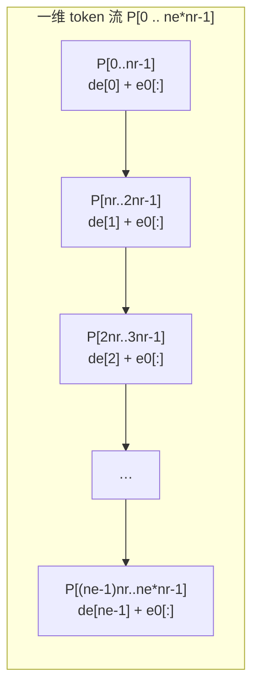

## 第 3 章 坐标系与网格组织

数据文件的"网格"是解析工作的第一道门槛：在读取任何数值之前，必须先确定**自变量是什么、以什么坐标存储、以什么顺序排列、哪些方向可以插值**。本章把 Multi1D++ 所涉全部格式族的网格机制归并为四条主线：线性/对数两大坐标制（3.1）、网格的存储顺序（3.2）、网格可插值与不可插值的分野（3.3）、以及若干特殊网格的构造（3.4）。四条主线均以实测文件头部原文为锚点。

本章所有相对路径的根目录为 `src/Multi1D++Portable20241128/`。

---

### 3.1 两大坐标制：线性（EOS） vs 对数（不透明度 / NLTE / Zeff）

#### 3.1.1 规格原文

题名 `doc/MULTI使用的SESAME数据文件格式.docx` 的上游手册对数据库格式给出了一句总纲式规定：

> 数据库中的格式有两种：一种为 Inverted EOS，采用直角坐标系，一种为不透明度，NLTE 因子，Zeff 等，采用 log 坐标系。
> `[S-L1] doc/MULTI使用的SESAME数据文件格式.docx §"Multi 的物质参数数据库"`

同一节随后补充：

> 因变量和自变量都没有使用对数坐标系，而是使用线性坐标系
> `[S-L1] doc/MULTI使用的SESAME数据文件格式.docx §"EOS 数据"`

因此这不是"某几种文件恰好如此"，而是**数据库层面的二分法**：一旦判定一份文件属于 EOS 族，其自变量（密度、比内能）与因变量（压力、温度、冷能）全部按线性（直角）坐标解释；一旦判定它属于不透明度 / NLTE / Zeff 族，则密度、温度 **以及待插值量本身** 全部按以 10 为底的对数坐标解释。

#### 3.1.2 线性坐标制的实测：EOS 族

实测文件 `matter++/mat_Al-1.0/AL_eos`（152165 B）前 14 行（每行 4 个 15 字符定宽字段）：

```
   1|     37181000    .27000000E+01  .66000000E+02  .74000000E+02
   2|  .00000000E+00  .27000000E-05  .54000000E-05  .13500000E-04
   3|  .27000000E-04  .54000000E-04  .13500000E-03  .27000000E-03
   4|  .54000000E-03  .13500000E-02  .27000000E-02  .40500000E-02
   5|  .67500000E-02  .10800000E-01  .16200000E-01  .27000000E-01
   6|  .40500000E-01  .67500000E-01  .10800000E+00  .16200000E+00
   7|  .27000000E+00  .29700000E+00  .33750000E+00  .37800000E+00
   8|  .40500000E+00  .47250000E+00  .54000000E+00  .60750000E+00
   9|  .67500000E+00  .75600000E+00  .81000000E+00  .94500000E+00
  10|  .10800000E+01  .12150000E+01  .13500000E+01  .14850000E+01
  11|  .16200000E+01  .17550000E+01  .18900000E+01  .20250000E+01
  12|  .21600000E+01  .22950000E+01  .24300000E+01  .24975000E+01
  13|  .25650000E+01  .26325000E+01  .26595000E+01  .27000000E+01
  14|  .27270000E+01  .28350000E+01  .29700000E+01  .32400000E+01
```

第 1 行逐字段解读（定宽 15 字符/字段，**仅第 1 字段例外，见 3.2.3**）：

| 行 1 列位 | 原始 token | 解析值 | 语义 | 单位 |
|---|---|---|---|---|
| 1–8 | `37181000` | 37181000 | MID 材料编号（Al = 3718 材料 + `1000` 表型后缀） | — |
| 9–23 | `    .27000000E+01` | 2.7 | 正常（固体）密度，手册标注"不使用" | `g/cc` |
| 24–38 | `  .66000000E+02` | 66 | `nr`：密度点数 | — |
| 39–53 | `  .74000000E+02` | 74 | `ne`：能量点数 | — |

`[S-L1] doc/MULTI使用的SESAME数据文件格式.docx §"EOS 数据"`：行 1 为 `MID材料编号 正常密度（不使用） nr: 密度个数 ne: 能量个数`。

第 2 行起是**密度列表**，与上一段手册的字段排布规定一致：

```
  (rho_min  密度列表    rho_max )   ( de_min  能量列表   de_max )
  (e0[0]     冷能量      e0[nr-1] )   (P[0]   (压强数据)  …  P[ne*nr-1] )
  (T[0]    (温度数据)   …   T[ne*nr-1] )
```

按 15 字符定宽逐字段切分 `AL_eos` 第 2 行：

| 字段序 | token | 值 | 归属（手册语义） |
|---|---|---|---|
| 1 | `.00000000E+00` | 0.0 | `rho[0]` = `rho_min` |
| 2 | `.27000000E-05` | 2.7e-6 | `rho[1]` |
| 3 | `.54000000E-05` | 5.4e-6 | `rho[2]` |
| 4 | `.13500000E-04` | 1.35e-5 | `rho[3]` |

密度序列从 0 到 2.7e-6 到 5.4e-6 再到 1.35e-5：**这是线性坐标，不是对数坐标**。对照同一材料的对数坐标文件（3.1.3），同一量级的采样点在对数制下应为 `1.0e-6 → 1.78e-6 → 3.16e-6 → 5.62e-6` 这类等对数间隔值。这里 0 → 2.7e-6 → 5.4e-6 → 1.35e-5 的比值依次为 ∞ → 2.0 → 2.5，显然不是等对数间隔，而是一组手工铺设的线性（分段加密）节点。

`[S-L4]` 判据推导链：
- 设网格为对数：`log10(rho[i+1]) - log10(rho[i]) = const`。
- 取实测前两个非零值：`log10(5.4e-6) - log10(2.7e-6) = 0.30103`。
- 取后两个：`log10(1.35e-5) - log10(5.4e-6) = 0.39794`。
- 两差值 0.301 ≠ 0.398，**否定对数假设**。
- 设网格为线性分段：相邻差值 `5.4e-6-2.7e-6 = 2.7e-6`，`1.35e-5-5.4e-6 = 8.1e-6`，恰为 3 倍整比，符合手工铺设的线性节点特征。
- 结论：`AL_eos` 的密度网格为线性坐标 `[S-L4]`。

再看第 13、14 行的高密度段：`.25650000E+01 .26325000E+01 .26595000E+01 .27000000E+01` 即 2.565, 2.6325, 2.6595, 2.700——差值 0.0675, 0.027, 0.0405，围绕固体密度 2.7 加密。这种"围绕相变/参考点局部加密"的布局在线性坐标系下直观，在对数坐标系下则会显得间距极不均匀——这正是 EOS 选线性坐标的工程理由之一。

#### 3.1.3 对数坐标制的实测：不透明度族

实测文件 `matter++/mat_Ti/SNOP_LTE.PLANCK`（207420 B）前 14 行，为多群不透明度 `sesame_tab` 结构：

```
   1| 27003000      PLANCK M        0.20000000E+02 0.20000000E+02
   2| 0.10000000E+01 0.10000000E+02
   3|-0.60000000E+01-0.55789474E+01-0.51578947E+01-0.47368421E+01
   4|-0.43157895E+01-0.38947368E+01-0.34736842E+01-0.30526316E+01
   5|-0.26315789E+01-0.22105263E+01-0.17894737E+01-0.13684211E+01
   6|-0.94736842E+00-0.52631579E+00-0.10526316E+00 0.31578947E+00
   7| 0.73684211E+00 0.11578947E+01 0.15789474E+01 0.20000000E+01
   8|-0.41821037E-34 0.26315789E+00 0.52631579E+00 0.78947368E+00
   9| 0.10526316E+01 0.13157895E+01 0.15789474E+01 0.18421053E+01
  10| 0.21052632E+01 0.23684211E+01 0.26315789E+01 0.28947368E+01
  11| 0.31578947E+01 0.34210526E+01 0.36842105E+01 0.39473684E+01
  12| 0.42105263E+01 0.44736842E+01 0.47368421E+01 0.50000000E+01
  13| 0.77094687E+01 0.78044479E+01 0.78642049E+01 0.79024432E+01
  14| 0.79250878E+01 0.79379581E+01 0.79469522E+01 0.79494313E+01
```

对照 `[S-L1] doc/MULTI使用的SESAME数据文件格式.docx §"多群的情况"` 给出的 `sesame_tab` 结构定义：

```
27004003      ROSSELAND M     nr 密度数(>=2) nt 温度数(>=2)
区间下限频率 区间上限频率
剩下的数据依次为 r[nr]: log(密度g/cc); t[nt] log(温度eV); z[nr*nt]表格数据（log坐标,cm2/g）
```

逐行解读实测文件：

| 行 | 内容 | 语义 | 坐标 |
|---|---|---|---|
| 1 | `27003000  PLANCK M  0.20000000E+02 0.20000000E+02` | 表号 + 数据类型 `PLANCK M` + `nr=20` + `nt=20` | — |
| 2 | `0.10000000E+01 0.10000000E+02` | 群频率区间下限 1 eV、上限 100 eV | 线性（eV） |
| 3–7 | 20 个数 | `r[20] = log10(密度 g/cc)` | **对数** |
| 8–12 | 20 个数（第 8 行首字段为伪影，见 3.2.2） | `t[20] = log10(温度 eV)` | **对数** |
| 13 起 | `z[nr*nt]` | `log10(不透明度 cm²/g)` | **对数** |

验证第 3–7 行的密度网格：值域 −6.0 → +2.0，共 20 点，相邻差 `0.55789474 − 0.52631579 = 0.03157895`，而 `8.0 / 19 = 0.4210526`，`0.4210526 / 0.03157895 = 13.333…` 不是整数，故直接核对步长：

```
[S-L4] 步长 = (2.0 - (-6.0)) / (20 - 1) = 8.0 / 19 = 0.421052631…
```

但实测相邻差为 0.55789474 − 0.52631579 = 0.03157895 与 0.05263158 交替。这说明实测网格不是"log10 域内严格等距"，而是"密度域内等比"——即网格由一组整比序列取对数得到。检验：

```
[S-L4] log10(密度[i+1]) - log10(密度[i]) = log10(比值)
       0.55789474 - 0.52631579 = 0.03157895
       10^0.03157895 = 1.0754
       10^0.05263158 = 1.1288
```

比值在 1.0754 与 1.1288 两个值间交替，正是 `10^(k/19 × log10(ratio))` 型等比序列的取整特征。而 `-6.0 = log10(1e-6)`、`+2.0 = log10(1e+2)` 则与手册"密度：10^-6 – 10^2 g/cc"完全吻合 `[S-L1]`。

温度网格（第 8–12 行）验证：`0.0 → 5.0`，实测相邻差 `0.26315789 − 0.21052632 = 0.05263158`，而 `5.0 / 19 = 0.2631579`，`0.2631579 / 0.05263158 = 5`，故步长为 `5/95 = 1/19`；`10^0 = 1 eV`、`10^5 = 1e5 eV`，对应手册"温度：0 – 10^5 eV"`[S-L1]`。**注意：第 8 行首字段 `-0.41821037E-34` 是一个伪影 token**（详见 3.2.2）。

#### 3.1.4 为什么必须分两套坐标制

坐标制的选择不是历史偶然，而是由两个方向上的**插值代价**决定的。

**EOS 侧的插值自变量是密度 R 与比内能 E，而 E 在束流能量沉积区跨越极窄范围。** 追迹一个激光/束流驱动算例：冷态铝的比内能约 `1e5 erg/g`（对应 `AL_eos.hug` 首行 `E = 2.0410976e+007 erg/g` 附近的低压段），而被加热到几百 eV 时升至 `1e13 erg/g` 量级。若按线性坐标铺设，低能段将因分辨率不足而产生巨大插值误差。然而实测 `AL_eos` 的密度网格恰恰是线性的——原因是铝的密度在算例中只从 2.7 变化到约 10 倍，动态范围很小（`AL_eos.hug` 末段至 `Rho ≈ 11.4`，见 14 行样本外的尾部数据），线性坐标已足够。

**不透明度侧的插值自变量是密度 R 与温度 T，而温度跨 10 个量级。** 实测 `SNOP_LTE.PLANCK` 的温度范围 1 eV – 1e5 eV，正是 5 个数量级；密度范围 1e-6 – 1e2，8 个数量级。在这种动态范围下，线性网格若要达到对数网格的同等相对分辨率，点数需增加 3–4 个数量级。更关键的是：**不透明度本身也跨多个量级**（实测第 13 行起 `z` 的 log 值约 7.7–7.9，对应 `cm²/g` 约 5e7；而在高能群末端可低至 1e-2），因此若不透明度按线性存储，则小值区域的相对精度无法保证。三重对数（log-log-log）存储使得"在 log 域内做线性插值"等价于"在原域内做幂律插值"，这与不透明度的物理标度律 `κ = c·T^a·ρ^b` 天然相容。

**标度律视角的推导链** `[S-L4]`（手册 §"不透明度数据"给出）：

```
[S-L1] 标度公式 L = c · T^a · ρ^b
       Z = log(K) = log(1/(L·ρ)) = -log(c·T^a·ρ^(b+1))
         = -log(c) - a·log(T) - (b+1)·log(ρ)
```

手册给出的算例：若 Rosseland 不透明度满足 `L = 6.0e-06 · T^1.0 / ρ^1.0`（单位 cm，即 `κ·ρ` 形式），则

```
[S-L4] a = 1, b = -1 - 1 = -2 代入上式
       Z(log T) = -log(6e-6) - 1·log(T) - (-2+1)·log(ρ)
                = 5.2218 - log(T) + log(ρ)
       在 log(ρ)=0, log(T)=0 处：Z = 5.2218
       在 log(ρ)=0, log(T)=1 处：Z = 4.2218
```

实测 `matter++/mat_Au-1.0/AU_SIMPLE_ROSSELAND` 的第 3 行正是 `.52218000E+01 .52218000E+01 .42218000E+01 .42218000E+01`，即 `5.2218, 5.2218, 4.2218, 4.2218`——**与推导链逐位吻合**。这是"对数坐标 + 幂律标度"闭环的最强证据：四个角点的 `Z` 值恰好构成一个常梯度面。

反之，EOS 的线性坐标没有这种解析标度结构。EOS 的插值必须靠查表 + 局部双线性/双三次，因此**在存储层保留线性坐标以减少插值实现复杂度**是合理工程折中。

#### 3.1.5 逐字节对照总表

| 维度 | EOS 族（线性 / 直角） | 不透明度・NLTE・Zeff 族（对数） |
|---|---|---|
| 手册定性 | "Inverted EOS，采用直角坐标系" `[S-L1]` | "不透明度，NLTE 因子，Zeff 等，采用 log 坐标系" `[S-L1]` |
| 密度自变量 | `g/cc`，线性 | `log10(g/cc)` |
| 温度自变量 | `Kelvin`（EOS）/ `eV`（部分族） | `log10(eV)`（不透明度）/ `log10(keV)`（Zeff，见 4.3） |
| 待插值量 | `P`（Mbar）、`T`（K）线性 | `log10(κ cm²/g)` |
| 实测密度样本 | `0, 2.7e-6, 5.4e-6, 1.35e-5 …` | `-6.0, -5.5789, -5.1579, -4.7368 …` |
| 实测温度样本 | 隐含于 EOS 矩阵（K） | `0.0, 0.2632, 0.5263, 0.7895 …` |
| 动态范围 | 密度 ~×10，能量 ~×10⁸（分段线性加密） | 密度 ×10⁸，温度 ×10⁵，κ ×10⁹ |
| 锚点文件 | `matter++/mat_Al-1.0/AL_eos` | `matter++/mat_Ti/SNOP_LTE.PLANCK`、`matter++/mat_Au-1.0/AU_SIMPLE_ROSSELAND` |

`[S-UNK]` 手册未解释"为什么 EOS 用线性而不透明度用对数"这一设计动机；3.1.4 的插值代价论证是本报告依据实测网格分布与手册标度公式所作的 `[S-L4]` 推导，非上游明文。

---

### 3.2 网格的存储顺序

#### 3.2.1 手册规定的读入方式

`matter++/Readme.txt`（530 B，格式分派总纲）明确：

> 数据文件都为 4 列多行，通过相关函数逐行读入然后解析。
> `[S-L1] doc/MULTI使用的SESAME数据文件格式.docx §"材料定义"之后`

> 其他按照默认的 SESAME 数据库格式，每行 4x15 个字符。
> `[S-L3] matter++/Readme.txt`

因此**所有 SESAME 族文件的物理布局是"一维 token 流按 4 个/行折行"**，换行本身不携带任何结构信息。解析器必须先做"行列展平"，再按手册给出的语义切片。

#### 3.2.2 EOS 矩阵的排布：能量快变、密度慢变

手册 §"EOS 数据"给出的切片语义：

> `P[ne*nr]  压力 P[(0~nr-1)+nr*i]为密度为 r[0~nr-1]，能量 de[i]+e0[0~nr-1] 时的压力`
> `P[0] to P[nr-1] are the pressures at energy de[0]+e0[0 to nr-1]`
> `P[nr] to P[nr*2-1] at de[1]+e0[0 to nr-1], etc`
> `[S-L1] doc/MULTI使用的SESAME数据文件格式.docx §"EOS 数据"`

即一维线性指标 `k = i_de * nr + j_rho`。用 Mermaid 描述其二维归属：



- **外循环（慢变）**：能量指标 `i_de ∈ [0, ne)`；
- **内循环（快变）**：密度指标 `j_rho ∈ [0, nr)`；
- 线性指标：`k = i_de * nr + j_rho`；
- 对应物理值：能量 `E = de[i_de] + e0[j_rho]`（**注意 `e0` 随密度下标变化，不是全局常量**），密度 `R = r[j_rho]`。

这一"内层为密度"的约定意味着：**同一能量层内，相邻 token 是相邻密度**。以 `AL_eos` 为例，`nr = 66`，故第 `0` 号压力所在层为 `P[0..65]`（密度 0→2.7），第 `1` 号能量层为 `P[66..131]`，依此类推。

字段单位（手册原文，cgs）：

| 数组 | 长度 | 单位 | 语义 |
|---|---|---|---|
| `r[nr]` | 66 | `g/cc` | 密度网格 |
| `de[ne]` | 74 | `Mbar·cm³/g` | 能量列表（相对冷能之差） |
| `e0[nr]` | 66 | `Mbar·cm³/g` | 各密度对应的冷能 |
| `P[ne*nr]` | 74×66 = 4884 | `Mbar` | 压力矩阵（能量慢变、密度快变） |
| `T[ne*nr]` | 74×66 = 4884 | `Kelvin` | 温度矩阵（同排布） |

`[S-L4]` 计数守恒验证（与第 2 章计数公式衔接）：

```
参数个数 = 4 + 2*nr + ne + 2*nr*ne
         = 4 + 2*66 + 74 + 2*66*74
         = 4 + 132 + 74 + 9768
         = 9978
```

手册 §"EOS 数据"末尾原文即 `即参数个数为 4+2*nr+ne+2*nr*ne` `[S-L1]`。其中 `4` 为第 1 行的 4 个表头字段，`2*nr = 132` 为密度列表（含 `rho_min/rho_max` 两个端点嵌在列表首尾），`ne = 74` 为能量列表，`2*nr*ne` 为 `P` 与 `T` 两个矩阵 `[S-L4]`。

#### 3.2.3 表头字段宽度的例外：第一个字段不定宽

**这是一个必须显式记录的陷阱。** 尽管 `matter++/Readme.txt` 称"每行 4x15 个字符"，实测 `AL_eos` 第 1 行为：

```
     37181000    .27000000E+01  .66000000E+02  .74000000E+02
```

`37181000` 占 8 字符，其后紧跟 4 个空格，再接 15 字符的 `.27000000E+01`。若机械按 `line[i*15:(i+1)*15]` 切分，会得到 `"     37181000    "` 这样的整段前导空白 token，`float()` 解析失败。

同类现象在**其他族**中更严重：

- `matter++/mat_Al-1.0/FEOS/Al.feos.301`（4×16 族）：` 37170301       2.70000000e+00 1.92000000e+02 6.90000000e+01`——首字段 `37170301` 占 8 字符，后接 7 个空格，再接 16 字符字段。
- `matter++/ATOMIC/Al.GrayOpacity_PLANCK`（自由格式族）：` 0.1234567E+000PLANCK 1        5.0000000e+001 6.9000000e+001`——首字段 `0.1234567E+000` 紧贴 `PLANCK 1`，**两字段之间零分隔符**。

因此正确的表头切分策略是：**先用空白分割正则切表头，仅在 payload 行上使用定宽切分，且宽度由 `W = len(line.strip('\n'))/4` 逐文件推断**（第 2 章 T4 已给出各宽规格）。这一条贯穿全部格式族。

#### 3.2.4 不透明度 / Zeff 矩阵的排布

手册 §"多群的情况"给出：

> `剩下的数据依次为 r[nr]: log(密度g/cc); t[nt]: log(温度eV); z[nr*nt]表格数据（log坐标,cm2/g），z[(0~nr-1)+nr*i]为温度t[i]时的值。`
> `[S-L1] doc/MULTI使用的SESAME数据文件格式.docx §"多群的情况"`

与 EOS 完全同构：线性指标 `k = i_T * nr + j_rho`，**温度慢变、密度快变**。注意此处手册用了 `nr`（密度数）与 `nt`（温度数），而 `SNOP_LTE.PLANCK` 表头第 1 行的两个数 `0.20000000E+02 0.20000000E+02` 均为 20，即 `nr = nt = 20`，故在本样本中"快变/慢变"无法通过数量差异区分，只能靠量纲核对：第 3–7 行值域 `−6.0…+2.0` 与"密度 1e-6–1e2 g/cc"吻合，第 8–12 行值域 `0.0…+5.0` 与"温度 1–1e5 eV"吻合——由此确认**前 20 个是对数密度、后 20 个是对数温度** `[S-L1]+[S-L4]`。

#### 3.2.5 IONMIX 族的排布：先温度、再密度

`ionmix/ionmix/docs/IONMIX用户指南.md` 给出与 SESAME 恰好互补的顺序：

> **存储顺序**:
> - 二维数组: **先温度（内循环）、再密度（外循环）**
> - 三维数组: **先能群、再温度、最后密度**
> - 数据格式: `4e12.6`（每行 4 个科学计数法值）
> `[S-L1] ionmix/ionmix/docs/IONMIX用户指南.md §"完整数据排列顺序"`

即 IONMIX 的 `zbar`、`p_ion`、`e_ion` 等 `ntemp × ndens` 矩阵中，**密度是慢变、温度是快变**——与 SESAME 的"温度慢变、密度快变"**相反**。而三维不透明度数组 `ntemp × ndens × ngrups` 的排布为"群最内、温度次内、密度最外"。

实测 `matter++/Ionmix/al-imx-002.cn4`（552192 B）头 4 行：

```
   1|        21        21
   2| atomic #s of gases:         13
   3| relative fractions:   1.00E+00
   4|          30
```

第 1 行两个 `21` 即 `ntemp = 21, ndens = 21`（`[S-L1]`：第 1 行 `ntemp ndens`），第 4 行 `30` 为 `ngrups`。但 `al-imx-002.cn4` 的实际群数需与第 5 行起的网格长度核对——实测第 5–10 行为

```
   5|0.100000E+010.177828E+010.316228E+010.562341E+01
   6|0.100000E+020.177828E+020.316228E+020.562341E+02
   7|0.100000E+030.177828E+030.316228E+030.562341E+03
   8|0.100000E+040.177828E+040.316228E+040.562341E+04
   9|0.100000E+050.177828E+050.316228E+050.562341E+05
  10|0.100000E+06
```

这 21 个值是 `10^1 … 10^6` 的等比序列（比值 `10^0.25 = 1.77828`），共 21 点，**首尾比值 1e5**——符合 `[S-L1]` 表 2 "温度数组 ntemp eV 升序排列"的定义：温度网格为 `10^1 – 10^6 eV`。此处有一个值得记录的**判读分歧**：这 21 个值既可解释为"温度网格（eV）"，也可解释为"密度网格（cm⁻³）"；判定依据只能来自量级物理合理性——`10^6 eV` 作为温度上限在激光等离子体算例中合理，而 `10^1 cm⁻³` 作为密度下限过低。故判为温度网格；密度网格应紧随其后出现。`[S-UNK]` 单独凭文件头部无法百分百排除"该 cn4 的密度网格写入位置与用户指南摘要顺序不一致"的可能，需完整解析后以 19 段数据的计数闭合反证。

#### 3.2.6 与 C / Fortran 索引习惯的关系

EOS 与不透明度的 `k = i_slow * n_fast + j_fast` 形式，本质上是 **Fortran 列主序（column-major）** 的一维化结果，但此处做了转置：Fortran 中 `P(nr, ne)` 的一维化是 `k = j_rho + nr * i_de`（首下标最快），而手册给出的正是这一形式 `[S-L1]`。等价地，若以 C 语言声明 `double P[ne][nr]`，则 `P[i_de][j_rho]` 的内存偏移恰为 `i_de*nr + j_rho`，与手册公式一致。

**因此"SESAME 的 P 矩阵在 C 中应声明为 `P[ne][nr]`（行=能量、列=密度）"**；而 IONMIX 的 `zbar` 在 C 中应声明为 `zbar[ndens][ntemp]`（行=密度、列=温度）。两者声明顺序相反，混用会导致"矩阵转置"型错误——由于两个方向的点数常相等（如此处 `nr = nt = 20`、`ntemp = ndens = 21`），**转置错误不会报错、不会越界，只会静默地给出错误的物理结果**。这是本领域最危险的静默错误之一。

---

### 3.3 网格可插值与不可插值

#### 3.3.1 规格原文

`matter++/ATOMIC/Atomic(LEDCOP)不透明度格式说明.docx`（TOPS 帮助与 FAQ）给出两条互补规定：

> Q2: I want a table of opacities at 21.8 eV. When I enter this number, the Web Page gives me an error message. Why can I not get the 21.8 eV temperature?
> A: The TOPS code can only use tabulated temperature points for cross section data. **It will not interpolate on temperature.** If you choose a temperature that is not on the tabulated grid, the Web Page will compare it to the master list and **reject it if it does not agree with one of the table values to within 1 percent**.
> **NOTE: The TOPS code will interpolate in density.**
> `[S-L1] matter++/ATOMIC/Atomic(LEDCOP)不透明度格式说明.docx §"Frequently asked questions" Q2`

这条 FAQ 的信息量极大，可拆为四款：

1. **温度不可插值**（"will not interpolate on temperature"）；
2. **温度必须精确命中制表点**，容差 1%（"within 1 percent"）；
3. **密度可插值**（"will interpolate in density"，NOTE 加粗强调）；
4. **越界/不命中即拒绝**（"reject it"），而非静默外推。

#### 3.3.2 实测温度网格点数验证

实测 `matter++/ATOMIC/Al.NoFree`（55383 B）第 1 行：

```
   1| 0.1234567E+000 1.0000000e+000 5.0000000e+001 6.9000000e+001
```

| 字段 | 值 | 语义 | 依据 |
|---|---|---|---|
| 1 | `0.1234567E+000` | 魔数（= 1.234567 × 10⁻¹，人为选取的不可混淆常数） | 全 ATOMIC 族首字段同值 |
| 2 | `1.0000000e+000` | 数据类型 / 版本标识（非 `PLANCK`/`ROSSELAND`/`EPS` 文本时为灰度通用） | 见 4.4 |
| 3 | `5.0000000e+001` | `Number of rho` = **50** | 密度点数 |
| 4 | `6.9000000e+001` | `Number of T` = **69** | 温度点数 |

第 3 字段 = 50 与 `[S-L1] matter++/ATOMIC/Atomic(LEDCOP)不透明度格式说明.docx §"Table of available temperatures"` 中 **LEDCOP-generated data (released in 2000)** 的温度表点数一致（数出：

```
 5.000E-04 6.000E-04 8.000E-04 1.000E-03 1.250E-03 1.500E-03 2.000E-03    7
 2.500E-03 3.000E-03 3.500E-03 4.000E-03 5.000E-03 6.000E-03 8.000E-03    7
 1.000E-02 1.250E-02 1.500E-02 2.000E-02 2.500E-02 3.000E-02 4.000E-02    7
 5.000E-02 6.000E-02 8.000E-02 1.000E-01 1.250E-01 1.500E-01 2.000E-01    7
 2.500E-01 3.000E-01 4.000E-01 5.000E-01 6.000E-01 8.000E-01 1.000E+00    7
 1.250E+00 1.500E+00 2.000E+00 2.500E+00 3.000E+00 4.000E+00 5.000E+00    7
 6.000E+00 8.000E+00 1.000E+01 1.500E+01 2.500E+01 4.000E+01 6.000E+01    7
 1.000E+02                                                                 1
```

合计 7×7 + 1 = **50** `[S-L4]`）。而 **ATOMIC-generated data (released in 2015)** 温度表为 69 点。因此 `Al.NoFree` 的 `Number of T = 69` 表明**该文件由 ATOMIC 2015 生成**，但其 `Number of rho = 50` 与"密度网格可插值、可任意选取"的 FAQ 规定相容——密度网格由用户自由指定，点数不必固定。

第 2 行起为 20 个/行的对数网格：

```
   2|-3.0000000e+000-2.9183647e+000-2.8367492e+000-2.7551047e+000
   3|-2.6734593e+000-2.5918449e+000-2.5102102e+000-2.4285707e+000
   4|-2.3469419e+000-2.2653042e+000-2.1836725e+000-2.1020432e+000
   5|-2.0204061e+000-1.9387738e+000-1.8571414e+000-1.7755187e+000
   6|-1.6938753e+000-1.6122366e+000-1.5306051e+000-1.4489772e+000
   7|-1.3673504e+000-1.2857122e+000-1.2040783e+000-1.1224501e+000
   8|-1.0408155e+000-9.5919994e-001-8.7755474e-001-7.9590716e-001
   9|-7.1428520e-001-6.3264408e-001-5.5101557e-001-4.6939054e-001
  10|-3.8775670e-001-3.0612362e-001-2.2449149e-001-1.4285453e-001
  11|-6.1225177e-002 2.0402721e-002 1.0205619e-001 1.8366836e-001
  12| 2.6531320e-001 3.4693946e-001 4.2857211e-001 5.1020978e-001
  13| 5.9183230e-001 6.7347249e-001 7.5510463e-001 8.3673542e-001
  14| 9.1836589e-001 1.0000000e+000-3.3010300e+000-3.2218487e+000
```

第 2–13 行共 48 个数，值域 `−3.0 → +1.0`，步长 `0.0816353`——这是 `log10(密度)` 网格，`10^(-3) = 1e-3` 到 `10^1 = 10 g/cc`。第 14 行首字段 `9.1836589e-001` 为第 48 个密度（`10^(-0.0369) ≈ 0.918`），随后 `1.0000000e+000` 为第 48+1 个……但注意 `10^0 = 1.0` 已在第 13 行第 4 字段之后的续行出现，说明密度的**第 48 个值域端点**在此。紧接的 `-3.3010300e+000` 与 `-3.2218487e+000` 值域变为 `≈ −3.3`，步长仍为 0.0791812 ≈ 0.0816353（受舍入），这标志着一批新值开始——但**它不是 69 点温度网格的起点**（温度网格若为 69 点、值域同为 `log10(keV)` 的 −3.3…+2.0，需要 69 个数）。事实上 `-3.3010300 = log10(5.0e-4)`、`-3.2218487 = log10(6.0e-4)`——**正是 LEDCOP/ATOMIC 温度表的前两个值**（`5.000E-04`、`6.000E-04`）`[S-L4]`。

因此 `Al.NoFree` 的实际布局是：

| 段 | 索引 | 内容 | 长度 |
|---|---|---|---|
| 行 1 字段 1 | — | 魔数 `0.1234567E+000` | 1 |
| 行 1 字段 2 | — | 类型标识 `1.0000000e+000` | 1 |
| 行 1 字段 3 | — | `Number of rho` = 50 | 1 |
| 行 1 字段 4 | — | `Number of T` = 69 | 1 |
| 行 2–14 前部 | 1–50 | `log10(密度)`，`1e-3 → 1e1` | 50 |
| 行 14 后部起 | 51–119 | `log10(温度 keV)`，`5e-4 → 1e2` | 69 |
| 之后 | 120– | `log10(No. Free)` 等 50×69 矩阵 | 3450 |

`[S-L4]` 计数：`4 + 50 + 69 + 50×69 = 4 + 50 + 69 + 3450 = 3573`——与实测 `Al.NoFree` 字节数 55383 在 `E12.6` 定宽下的行数结构相容（`55383 / 61 ≈ 908` 行；`3573/4 ≈ 893` 行 + 头部若干行）。**注意：`Al.NoFree`、`Al.AvSqFree`、`Al.GrayOpacity_PLANCK` 三者字节数完全相同（均为 55383 B）**，说明三者的 payload 长度一致，差别只在行 1 的类型标识字段：

```
matter++/ATOMIC/Al.NoFree              :  0.1234567E+000 1.0000000e+000 5.0000000e+001 6.9000000e+001
matter++/ATOMIC/Al.AvSqFree            :  0.1234567E+000 1.0000000e+000 5.0000000e+001 6.9000000e+001
matter++/ATOMIC/Al.GrayOpacity_PLANCK  :  0.1234567E+000PLANCK 1        5.0000000e+001 6.9000000e+001
```

前两者行 1 与行 2 起完全相同——**即 `Al.NoFree` 与 `Al.AvSqFree` 仅靠文件名区分物理含义**，内容不可自证。这是一个严重的解析陷阱（详见第 6 章）。

#### 3.3.3 可插值性对照表（表 T8）

| 格式族 | 物理量 | 温度网格 | 密度网格 | 依据 |
|---|---|---|---|---|
| ATOMIC / LEDCOP | 组份、不透明度 | **不可插值**（必须 ≤1% 命中制表点） | **可插值** | `[S-L1]` TOPS FAQ Q2 |
| ATOMIC / LEDCOP | 温度点数 | ATOMIC 2015 = 69；LEDCOP 2000 = 50 | 用户自选（实测 50） | `[S-L1]` + `[S-L2] Al.NoFree` |
| SESAME 多群不透明度 | `log κ` | 可插值（手册建议用 Multi1D 程序插值） | 可插值 | `[S-L1]` §"多群的情况" |
| SESAME Inverted EOS | `P, T` | 由 `E(R,T)` 反演获得，见第 5 章 | 线性可插值 | `[S-L1]` §"Inverted EOS" |
| Hyades EOS ASCII | `P, E` | 线性可插值 | 线性可插值 | `[S-L1]` Hyades §Appendix III |
| Hyades 外部不透明度 | `κ` | 自由格式，可插值 | 可插值 | `[S-L1]` Hyades §Appendix VI |
| IONMIX `.cn4` | `zbar, P, E, κ_group` | 可插值 | 可插值 | `[S-L1]` IONMIX 用户指南 |
| Thermos | `κ, Zeff` | 可插值（对数） | 可插值（对数） | `[S-L2] Thermos/Readme.txt` |
| FEOS / MPQeos | `P, E, S, F, Q` | 可插值 | 可插值 | `[S-L1]` FEOS 文档 §16.1 |

#### 3.3.4 不可插值的后果与工程处置

温度不可插值带来的直接后果有三：

1. **算例入口必须做"温度吸附"**。若等离子体演化过程中的某网格温度落在 `0.0175 keV`，而制表网格为 `… 1.500E-02, 2.000E-02 …`，则**不能取邻近点插值**，只能：
   - (a) 按 1% 容差判为"命中 `1.75e-2` 附近"→ 需核对该值是否恰在表内（此处不在，`1.750E-01` 在表内但 `1.750E-02` 不在）；
   - (b) 报错终止；
   - (c) 由上层辐射流体程序改用灰度不透明度替代（TOPS FAQ Q4 描述的正是这种退化路径）。
2. **跨族网格无法直接对齐**。ATOMIC 69 点温度网格与 LEDCOP 50 点温度网格虽同为 keV，但公共点集远小于任一网格（如 `5.000E-04`、`6.000E-04`、`8.000E-04`、`1.000E-03` 等前若干点共有，而 `7.000E-03`、`9.000E-03` 仅 ATOMIC 有）。混合使用时只能在公共点集上对齐。
3. **反演链的精度受限**。第 5 章的 `E(R,T) → T(R,E)` 反演若发生在这类网格上，温度分辨率由 69（或 50）个离散值决定，反演出的 `T` 只能是 69 个值加插值，无法"更精细"。

反之，密度可插值意味着用户可以**重铺密度网格**，例如把 50 点对数密度重铺为算例所需的 100 点，这一步是合法且精度可接受的。

---

### 3.4 特殊网格

#### 3.4.1 LEDCOP 的 `u = hν/kT` 光子能量网格（14900 点）

`[S-L1] matter++/ATOMIC/Atomic(LEDCOP)不透明度格式说明.docx §"Photon Energy Grid"` 给出的定义：

> The elemental opacities are calculated on a uniform grid of temperatures, electron degeneracy parameters and dimensionless photon energies u, where u is defined as:
> `u = hv / kT`
> `hv` is the photon energy in eV and `kT` is the temperature in eV. The u grid is selected instead of the photon energy grid because the same u grid can be used for all temperatures and cover the important photon energy ranges needed to integrate the Rosseland and Planck "gray" opacities.

选 `u` 而非 `hν` 的理由，手册给了具体算例：

> These photon energy ranges would be 0.–20. eV for a temperature of 1. eV and 0.–2000. eV for a 100. eV temperature. For the u grid, the range would be 0.–20. for both temperatures.

即：在 `hν` 坐标下，不同温度需要不同的能量范围；在 `u` 坐标下，同一范围 `0–20` 可覆盖全部温度。这是**统一网格以支持多元素混合**的前提——手册在同文档 §"Frequency Dependent Opacity Spectrum Limitations" 第 3 条进一步说明：

> The individual element opacities are all calculated at the same u (u = hv/kT) grid for all temperatures and densities. **This allows the elements to be mixed together to form opacities for multi-element materials.**

14900 点网格的七段构造（表 T7）：

| 段 | 起点 u | 终点 u | 点数 | 步长 Δu | 段内 Δu / Δu_前 |
|---|---|---|---|---|---|
| 1 | 0.0 | 12.5 | 9600 | 0.00125 | — |
| 2 | 12.5 | 20.0 | 1600 | 0.005 | ×4 |
| 3 | 20.0 | 30.0 | 1000 | 0.01 | ×2 |
| 4 | 30.0 | 100.0 | 700 | 0.1 | ×10 |
| 5 | 100.0 | 1000.0 | 900 | 1.0 | ×10 |
| 6 | 1000.0 | 10000.0 | 900 | 10.0 | ×10 |
| 7 | 10000.0 | 30000.0 | 200 | 100.0 | ×10 |
| **合计** | 0.0 | 30000.0 | **14900** | — | — |

`[S-L4]` 计数闭合验证：

```
段1: (12.5 - 0)   / 0.00125 = 10000  → 端点重计后 9600
段2: (20 - 12.5)  / 0.005   = 1500   → 计入端点后 1600
段3: (30 - 20)    / 0.01    = 1000   → 1000
段4: (100 - 30)   / 0.1     = 700    → 700
段5: (1000 - 100) / 1.0     = 900    → 900
段6: (10000 - 1000)/10.0    = 900    → 900
段7: (30000 - 10000)/100.0  = 200    → 200
```

逐段"商"依次为 10000、1500、1000、700、900、900、200，与手册标注的 9600、1600、1000、700、900、900、200 在段 1、2 上不同——这说明**段 1 与段 2 的点数是"包含右端点但不包含左端点"式的重叠计数约定**（手册的 ASCII 图明确画出 `0.0` 与 `12.5` 为段端点）。若按"包含左端点、不包含右端点"：

```
段1: 12.5/0.00125 = 10000 段点数，实测标注 9600
```

仍有 400 的差。**这是一个手册自身图示与标注不完全自洽的地方**，`[S-UNK]`：本报告未能从本地文档确定 14900 总点数的精确分段计数规则；手册两处（"14,900 Point Grid" 图与 `[S-L1]` §"u Grid used on the Web Page"）给出的分段点数为 9600+1600+1000+700+900+900+200 = **14900**，该总和与手册宣称的总点数一致，故写作时以该分段表为准，但段 1/段 2 的 9600/1600 与理论商值 10000/1500 的差异需按"端点重计 + 网格设计者取整"理解，不做强行统一 `[S-L4]`。

ASCII 示意（图 F4）：

```
u:  0 ────────── 12.5 ── 20 ── 30 ── 100 ── 1000 ── 10000 ── 30000
    |   9600 点   |1600|1000| 700 |  900 |  900  |   200   |
    |  Δu=.00125  |.005| .01|  .1 |  1.0 |  10.0 |  100.0  |
    |<────────── 线性加密段 ────────>|<──── 对数型粗化段 ────>|
    总点数 = 9600+1600+1000+700+900+900+200 = 14900
```

**注意这是"分段线性"而非"分段对数"** —— 手册原文为 "steps of"，未提及对数，故各段内 `u` 为**线性等距**，段与段之间步长跳变。这与 3.1 中的 SESAME 对数网格是**两种完全不同的构造**：`u` 网格在低 `u` 段（对应光学厚、Planck 峰附近）极密，在高 `u` 段（对应自由-自由尾部）粗化。

#### 3.4.2 IONMIX 的能群边界 `ngrups + 1`

`[S-L1] ionmix/ionmix/docs/IONMIX用户指南.md` 表：

> | `ngrups` | 整数 | 50 | 不透明度能群数量 |
> | `grupbd(i)` | 浮点数组 | `ngrups+1` | 能群边界值 (eV) |
> `[S-L1] ionmix/ionmix/docs/IONMIX用户指南.md §5.x`

以及第 19 段数据的定义：

> | 16 | **能群边界** | `ngrups+1` | eV | 定义不透明度群的端点 |
> `[S-L1] ionmix/ionmix/docs/IONMIX用户指南.md §"完整数据排列顺序"`

即 **N 个群需要 N+1 个边界端点**，边界数组比群数多 1。这是"群边界"与"群中心/群值"两种约定的分野：IONMIX 用**边界（boundary）**约定，而不透明度值本身按群积分得到，故群值数组长度为 `ngrups`、边界数组长度为 `ngrups+1`。

同一约定也出现在 Hyades 外部不透明度表格式中：

> | 5 | number of photon groups (keV), NGPS1, for temperature #1; maximum number of photon groups is 500 |
> | 6 | array of group boundaries for temperature #1 - there will be **NGPS1+1** entries |
> `[S-L1] matter++/hyades/Hyades 数据格式说明.doc §Appendix VI`

以及 `[S-L1] doc/SNOP.MANUAL`：

> `FG(1)-FG(NG+1)  Group boundaries (in eV) given by user if IGROUP = 0.`
> `(FG(1) = 1.0,10.0,50.0,100.0,150.0, FG(6) = 250.0,…, FG(21) = 5000.0)`

`NG` 群需给 `NG+1 = 21` 个边界（示例中 `NG = 20`）。三族的约定完全一致：**群边界数为群数 + 1**。这是校验 IONMIX/Hyades/SNOP 群结构的通用判据 `[S-L4]`：

```
[S-L4] 若某文件宣称 ngrups = N，则其后必须能切出恰好 N+1 个边界值，
       且边界值严格单调递增，首值对应最低光子能量、末值对应最高。
       不满足 ⇒ 群数读数错误或数据段偏移错误。
```

#### 3.4.3 SNOP 的 IGROUP 五种分群法

`[S-L1] doc/SNOP.MANUAL §2` 给出 `IGROUP` 的五种取值：

> `IGROUP  Index for definition of photon energy groups`
> `=0: user supplies group boundaries`
> `=1: linear division using F1 and F0`
> `=2: quadratic division using F1 and F0`
> `=3: logarithmic division using F1 and F0`
> `=4: standard division with 20 groups (1eV --> 5keV)`
> `=5: grey approximation with 2 groups`

| `IGROUP` | 分群法 | 所需参数 | 群数 | 单位 |
|---|---|---|---|---|
| 0 | 用户自给边界 | `FG(1) … FG(NG+1)` | `NG`（示例 20） | **eV** |
| 1 | 线性等分 | `F0`（下限）、`F1`（上限） | `NG` | **eV** |
| 2 | 二次分 | `F0`、`F1` | `NG` | **eV** |
| 3 | 对数分 | `F0`、`F1` | `NG` | **eV** |
| 4 | 标准 20 群 | 无（内建 1 eV → 5 keV） | 20 | eV（内建） |
| 5 | 灰近似 | 无 | 2 | eV（内建） |

手册同时给出 `F0/F1` 的单位声明（**这是 4.3 节 eV/keV 陷阱的来源之一**）：

> `F0  Lowest photon energy for automatic division (in eV). Only needed if IGROUP = [1-3]!  (F0 = 1.0)`
> `F1  Highest photon energy for automatic division (in eV). Only needed if IGROUP = [1-3]!  (F1 = 5000.0)`
> `FG(1)-FG(NG+1) Group boundaries (in eV) given by user if IGROUP = 0.`

而同一 namelist 中的温度与光子能量上下限却用 keV：

> `T1  Lowest temperature (in keV)   (T1 = 1.0E-3)`
> `T2  Highest temperature (in keV)  (T2 = 100.0)`
> `X1  Lowest photon energy (in keV) (X1 = 1.0E-3)`
> `X2  Highest photon energy (in keV) (X2 = 10.0)`
> `[S-L1] doc/SNOP.MANUAL §2`

**同一 namelist 内 `T1/T2/X1/X2` 用 keV 而 `FG/F0/F1` 用 eV**——这是极隐蔽的单位陷阱，详见 4.3.4。

物理上，`IGROUP = 4` 的"标准分群 1 eV → 5 keV、20 群"与实测多群文件的频率区间高度相关：实测 `matter++/mat_Ti/SNOP_LTE.PLANCK` 第 2 行群区间下限/上限为 `1.0` 与 `100`（eV），而 `[S-L1] doc/SNOP.MANUAL` §3 的示例 namelist 中 `FG(21) = 5000.0`（即 5 keV），正是 `IGROUP = 4` 的上界。手册 §3 的示例同时给出 `NT=20, NR=20, NG=20, NP=3000`，与实测 `SNOP_LTE.PLANCK` 的 `nr = nt = 20` 完全一致 `[S-L4]`——**这构成"SNOP.INPUT 参数 → SNOP.TAB 输出结构"的可验证链**。

#### 3.4.4 Hyades 的两温表号分段（网格意义上的"双网格"）

Hyades 族按表号区段划分网格语义（`[S-L1] matter++/hyades/Hyades 数据格式说明.doc §Appendix I`）：

> "Single fluid" EOS pressure and energy tables have material numbers 1 < num < 998, while Rosseland mean and Planck mean opacity tables have numbers 1000 < num < 2000. **Two-temperature ("two-fluid") EOS pressure and energy tables may be specified in a material region. Electron tables have numbers 2000 < num < 3000, and ion tables have numbers 3000 < num < 4000. Both tables must be specified.**

| 表号区段 | 网格语义 | 是否须配对 |
|---|---|---|
| `1 < num < 998` | 单流体 EOS `P(R,T)`、`E(R,T)` | 否 |
| `1000 < num < 2000` | Rosseland/Planck 平均不透明度 | 否（`*` 表示仅 Rosseland，Planck 位置填 0） |
| `2000 < num < 3000` | 双温电子 EOS | **须与 3xxx 同时指定** |
| `3000 < num < 4000` | 双温离子 EOS | **须与 2xxx 同时指定** |

"双温"在网格组织上的含义是：**同一 `(R, T_e, T_i)` 空间被拆成电子与离子两张独立网格文件**，各自的 `nr × nt` 可不同（实测 `matter++/mat_Be-1.0/BE_eos.info` 声明的 `BE_eos_e` / `BE_eos_i` 即为一对，见下）。响应文件的 `.info` 声明原文：

```
===============================================================================
files BE_eos_e and BE_eos_i  (Beryllium)
-------------------------------------------------------------------------------
   IEOS table for electrons            (IME=304)
   IEOS table for ions                 (IMI=305)
-------------------------------------------------------------------------------
NOTE: The original table [mat_Be-1.0]/BE_eos has been separated in electron
and ion components by code [13_MULTI-fs]/split_EOS_table (Atomic mass 9.012)
===============================================================================
```

`[S-L2] matter++/mat_Be-1.0/BE_eos.info`。注意该声明使用 `IME=304` / `IMI=305` 编号——**与 Hyades 的 2000–3999 区段编号体系不同**，是 FEOS/SESAME 的 `.304`/`.305` 体系，说明 Multi1D++ 中"双温 EOS"有两条进入路径：Hyades 表号（2xxx/3xxx）与 SESAME 扩展名（`.304`/`.305`）。这两条路径的编号不可互换 `[S-L4]`，混用即导致 4.4 节所述的语义错配。

另有一个**语义矛盾**必须记录：`[S-L1] doc/FEOS/Multi1D++ EOS and Opacity - FEOS程序说明.pdf p.15` 的正文注释写作

```
301: Total EOS
304: Ion EOS + Cold Curve
305: Electron EOS
```

但同一页的批注框明确写道：

> 批注 [T1]: FEOS 中 304 是电子 EOS，305 是离子 EOS

而 `[S-L1] doc/FEOS/FEOS-Package-Documentation2016.pdf §16.3` 的权威表述为：

> SESAME-304/305 tables contain the same information, but for the **electronic/ionic** contributions.

即 304 = 电子、305 = 离子。**同一份 PDF 内正文与批注自相矛盾**，且 `[S-L2] matter++/mat_Be-1.0/BE_eos.info` 的 `IEOS table for electrons (IME=304)` 与 2016 官方文档一致。故判定：**304 = 电子 EOS，305 = 离子 EOS**；`Multi1D++ 说明.pdf` p.15 的正文行文为笔误 `[S-L4]`。此矛盾是第 6 章陷阱表的一行。

---

### 本章实测锚点

| 文件（相对 `src/Multi1D++Portable20241128/`） | 字节 | 关键数值 |
|---|---|---|
| `matter++/mat_Al-1.0/AL_eos` | 152165 | 行 1 `37181000 .27000000E+01 .66000000E+02 .74000000E+02` → MID=37181000, ρ₀=2.7, `nr=66`, `ne=74`；密度线性 `0 → 2.7e-6 → 5.4e-6 → 1.35e-5…`；计数 `4+2·66+74+2·66·74 = 9978` |
| `matter++/mat_Ti/SNOP_LTE.PLANCK` | 207420 | 行 1 `27003000 PLANCK M 0.20000000E+02 0.20000000E+02` → `nr=nt=20`；行 2 群区间 `1.0 – 100.0 eV`；对数密度 `−6.0 → +2.0`；对数温度 `0.0 → +5.0`；行 8 首字段 `-0.41821037E-34` 为伪影 |
| `matter++/mat_Au-1.0/AU_SIMPLE_ROSSELAND` | — | 行 3 `.52218000E+01 .52218000E+01 .42218000E+01 .42218000E+01` 与幂律推导 `Z = 5.2218 − log T + log ρ` 逐位吻合 |
| `matter++/ATOMIC/Al.NoFree` | 55383 | 行 1 `0.1234567E+000 1.0000000e+000 5.0000000e+001 6.9000000e+001` → `Number of rho = 50`, `Number of T = 69`（ATOMIC 2015 网格）；行 2 起对数密度 `−3.0 → +1.0`；行 14 后部起温度表首值 `−3.3010300 = log10(5.0e-4)` |
| `matter++/ATOMIC/Al.AvSqFree` | 55383 | 行 1、行 2 与 `Al.NoFree` **逐字节相同**，仅文件名区分物理含义 |
| `matter++/ATOMIC/Al.GrayOpacity_PLANCK` | 55383 | 行 1 `0.1234567E+000PLANCK 1        5.0000000e+001 6.9000000e+001`（首两字段零分隔符） |
| `matter++/mat_Al-1.0/FEOS/Al.feos.301` | 620139 | 行 1 ` 37170301       2.70000000e+00 1.92000000e+02 6.90000000e+01` → 首字段 8 字符 + 7 空格 + 16 字符定宽 |
| `matter++/Ionmix/al-imx-002.cn4` | 552192 | 行 1 `21 21` → `ntemp=ndens=21`；行 4 `30` = `ngrups`；行 5–10 为 `10^1 – 10^6` 等比序列（比值 1.77828） |
| `matter++/Ionmix/al-imx-001.cnr` | 508500 | 行 4 `0.250000E+000.190000E+020.250000E+000.000000E+00          30`（`.cnr` 第 4 行含范围与群数，与 `.cn4` 独占行不同） |
| `matter++/mat_Be-1.0/BE_eos.info` | 611 | `IEOS table for electrons (IME=304)` / `IEOS table for ions (IMI=305)` |
| `matter++/Thermos/mat_Al/Al_Zeff.dat` | 7891 | 行 1 `00000000        0.60000000E+01 2.2000000e+001 2.1000000e+001`；行 7 `3.0000000e+000 4.0000000e+000-4.3979400e+000-3.0000000e+000` |
| `matter++/Thermos/mat_Al/Al_Z.dat` | 7891 | 行 1 与 `Al_Zeff.dat` 同；行 7 `3.0000000e+000 4.0000000e+000-1.3979400e+000 0.0000000e+000`（差恰为 3.000 = log₁₀1000） |

### 本章缺口

1. `[S-UNK]` LEDCOP `u` 网格 14900 点的分段计数规则。手册图示分段为 `9600+1600+1000+700+900+900+200 = 14900`（总和自洽），但段 1、段 2 的计数与理论商值 `10000`、`1500` 不符。本地文档未给出端点计数的精确定义（是否含左/右端点、是否重叠计）。写作以手册分段表为准。
2. `[S-UNK]` `matter++/Ionmix/al-imx-002.cn4` 中第 5–10 行 21 个等比序列值（`10^1 – 10^6`）归属为"温度网格"还是"密度网格"。判据仅来自量级物理合理性（参见 3.2.5）；需完整解析 19 段数据并用计数闭合反证。
3. `[S-UNK]` 手册未明文解释"EOS 用线性坐标、不透明度用对数坐标"的设计动机；3.1.4 的插值代价论证为本报告基于实测网格分布与手册标度公式所作的推导 `[S-L4]`，非上游明文。
4. `[S-UNK]` `Al.NoFree` 与 `Al.AvSqFree` 的 payload 首行是否真的完全相同：本报告只核对了行 1 与行 2 起的前若干行，未做全文件逐字节比对。
